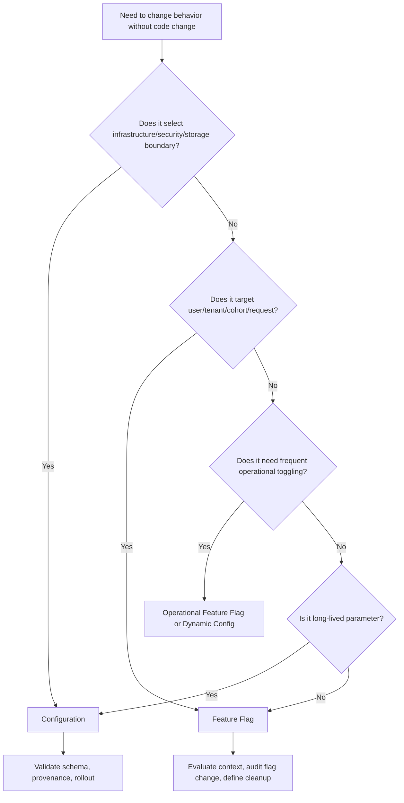
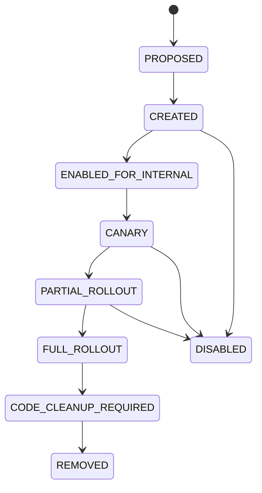
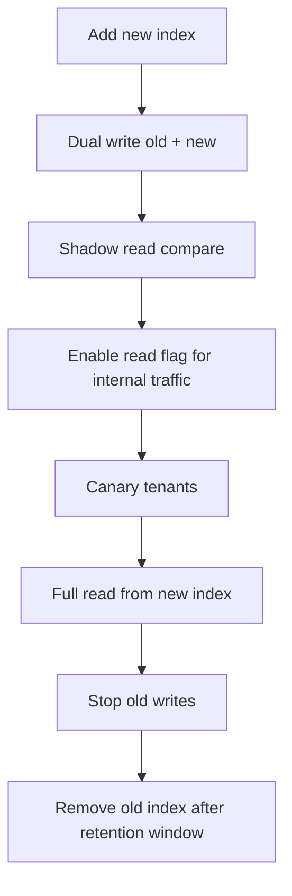

# Part 042 — Feature Flags vs Configuration

> Feature flags and configuration both change behavior.
>
> That does not mean they are the same control.

Banyak engineering incident muncul karena tim memakai configuration untuk masalah yang sebenarnya feature flag, atau memakai feature flag untuk masalah yang sebenarnya configuration.

Contoh salah:

```yaml
features:
  new-evidence-flow-enabled: true
```

Nilai ini terlihat seperti config. Tetapi jika dipakai untuk rollout user tertentu, kill switch, cohort, experiment, atau progressive delivery, ia sudah masuk wilayah **feature flag**.

Contoh lain:

```yaml
storage:
  evidence:
    accepted-bucket: evidence-prod-v2
```

Nilai ini terlihat bisa dibuat “flag” untuk berpindah bucket. Tetapi sebenarnya ini **configuration boundary** yang memengaruhi storage, durability, audit, retention, dan rollback. Jangan ubah seperti toggle UI biasa.

Part ini membangun garis pemisah yang jelas.

---

## 1. Core Difference

Configuration menjawab:

```txt
How should this service be wired and parameterized in this environment?
```

Feature flag menjawab:

```txt
Should this behavior be active for this evaluation context right now?
```

Perbedaan utama:

| Dimension | Configuration | Feature Flag |
|---|---|---|
| Purpose | parameterize service/environment | control behavior exposure |
| Change frequency | low to medium | medium to high |
| Targeting | usually environment/service | user, tenant, cohort, request, region |
| Evaluation | mostly startup or component boundary | runtime per evaluation context |
| Owner | service/platform/domain | product/release/service/platform |
| Rollback | config rollback/redeploy/restart | instant toggle or progressive rollback |
| Audit | config provenance | flag change + evaluation context/history |
| Risk | miswiring infrastructure/business policy | inconsistent behavior/cohort bugs |
| Lifecycle | long-lived | should be temporary unless operational flag |

Short rule:

```txt
If the value selects infrastructure, identity, storage, security, or durability boundary,
it is configuration.

If the value selects whether a behavior is exposed to a context,
it is a feature flag.
```

---

## 2. Why This Distinction Matters

Configuration and feature flags fail differently.

### 2.1 Config Failure

Bad config can cause:

- service fails startup;
- wrong database;
- wrong bucket;
- wrong endpoint;
- wrong retry behavior;
- tenant data crossing;
- retention violation;
- security issuer mismatch;
- config drift between pods.

### 2.2 Feature Flag Failure

Bad flag can cause:

- user sees wrong feature;
- tenant gets unapproved flow;
- partial rollout exposes incompatible behavior;
- experiment contaminates metrics;
- old and new code path diverge;
- flag dependency cycle;
- flag removed incorrectly;
- kill switch fails when needed.

Both are serious, but mitigations differ.

---

## 3. Taxonomy

### 3.1 Configuration Types

| Type | Example | Runtime Reload? |
|---|---|---|
| Infrastructure config | DB URL, broker URL, bucket name | usually no |
| Security config | issuer, audience, mTLS mode | usually no |
| Storage config | prefix, retention class, object lock mode | no without controlled rollout |
| Operational tuning | timeout, pool size, batch size | sometimes |
| Domain policy config | max upload size, retention years | rarely without governance |
| Integration config | downstream endpoint, API version | controlled rollout |

### 3.2 Feature Flag Types

| Type | Purpose | Example |
|---|---|---|
| Release flag | decouple deploy from release | enable new evidence upload flow |
| Experiment flag | A/B or multivariate testing | scanner UI variant A/B |
| Permission/entitlement flag | expose capability to tenant/user | enable bulk export for tenant X |
| Operational flag | kill switch or degrade mode | disable thumbnail generation |
| Migration flag | move traffic gradually | use new metadata index for 5% |
| Safety flag | emergency protection | reject risky file type temporarily |

Important distinction:

```txt
Permission flag is not authorization.
```

A feature flag may expose a UI or route. It must not replace authorization policy for protected actions.

---

## 4. Decision Tree



Use this before adding any new property.

---

## 5. Evaluation Context

Feature flags are evaluated against context.

Context can include:

- user id;
- tenant id;
- jurisdiction;
- plan;
- role;
- request path;
- client version;
- region;
- service name;
- environment;
- risk segment.

Example conceptual context:

```java
public record FlagContext(
    String userId,
    String tenantId,
    String jurisdiction,
    String serviceName,
    String environment,
    Set<String> roles
) {}
```

OpenFeature defines vendor-neutral concepts such as client, provider, evaluation API, and evaluation context. The important architecture point is not vendor choice; it is abstraction:

```txt
Application code should evaluate flags through a stable interface,
not directly depend on a specific flag vendor everywhere.
```

---

## 6. Java Boundary Pattern

Do not scatter raw flag keys through business code.

Bad:

```java
if (flagClient.getBooleanValue("new-evidence-flow", false)) {
    return newUploadFlow(request);
}
```

This looks harmless, but creates problems:

- no ownership;
- no typed context;
- no default reasoning;
- no audit point;
- no central cleanup;
- string key duplication;
- hard to test.

Better:

```java
public interface EvidenceFeatureDecisions {
    boolean useNewUploadFlow(UserContext user, TenantId tenantId);
    boolean allowDirectToStorageUpload(UserContext user, TenantId tenantId);
    boolean disableThumbnailGeneration();
}
```

Implementation:

```java
public final class OpenFeatureEvidenceFeatureDecisions implements EvidenceFeatureDecisions {
    private final FeatureClient featureClient;

    public OpenFeatureEvidenceFeatureDecisions(FeatureClient featureClient) {
        this.featureClient = featureClient;
    }

    @Override
    public boolean useNewUploadFlow(UserContext user, TenantId tenantId) {
        EvaluationContext context = EvaluationContext.builder()
            .set("userId", user.id())
            .set("tenantId", tenantId.value())
            .set("service", "evidence-service")
            .build();

        return featureClient.getBoolean("evidence.new-upload-flow", context, false);
    }

    @Override
    public boolean allowDirectToStorageUpload(UserContext user, TenantId tenantId) {
        EvaluationContext context = EvaluationContext.builder()
            .set("userId", user.id())
            .set("tenantId", tenantId.value())
            .set("service", "evidence-service")
            .build();

        return featureClient.getBoolean("evidence.direct-to-storage-upload", context, false);
    }

    @Override
    public boolean disableThumbnailGeneration() {
        EvaluationContext context = EvaluationContext.builder()
            .set("service", "evidence-service")
            .build();

        return featureClient.getBoolean("evidence.disable-thumbnail-generation", context, false);
    }
}
```

This creates a domain-facing interface.

Business code asks a decision, not a vendor.

---

## 7. Default Value Strategy

Feature flag default is not just fallback. It is failure behavior.

Question:

```txt
If the flag provider is unavailable, what should happen?
```

Typical defaults:

| Flag | Safe Default |
|---|---|
| new feature release | `false` |
| risky optimization | `false` |
| kill switch flag | depends on naming; prefer explicit fail-safe design |
| emergency block risky file type | often `true` for block when provider unavailable if safety-critical |
| migration read from new index | `false` |
| disable non-critical worker | `true` may be safer during provider failure |

Be careful with negative names.

Confusing:

```txt
disable-file-scanning = false
```

During provider failure, default `false` means scanning remains enabled. That might be safe.

But operationally, negative flags are harder to reason about.

Prefer positive decision names when possible:

```txt
file-scanning-required = true
```

For safety-sensitive flags, document default explicitly.

---

## 8. Flag Lifecycle

Feature flags must not live forever unless they are operational controls.

Lifecycle:



Each flag needs metadata:

```yaml
key: evidence.new-upload-flow
type: release
owner: evidence-service
createdAt: 2026-07-05
expectedRemovalDate: 2026-09-01
default: false
safeFallback: false
jira: EVID-1242
risk: medium
authorizationSensitive: false
```

For operational flags:

```yaml
key: evidence.disable-thumbnail-generation
type: operational
owner: evidence-service-sre
createdAt: 2026-07-05
expectedRemovalDate: null
safeFallback: true
runbook: runbooks/disable-thumbnail-generation.md
```

Invariant:

```txt
Every non-operational feature flag must have an owner and removal plan.
```

---

## 9. Governance and Approval

Not all flags require the same approval.

| Flag Type | Approval |
|---|---|
| Internal release flag | service owner |
| Customer-visible feature | product + service owner |
| Tenant entitlement | product/domain + access governance |
| Operational kill switch | SRE/service owner |
| Security-impacting flag | security + service owner |
| Compliance behavior flag | compliance + domain owner |

Example dangerous flag:

```txt
evidence.require-malware-scan = false
```

This should not be a casual feature flag. It changes security posture and compliance defensibility. It may need security approval, audit, and emergency expiry.

---

## 10. Feature Flags and Authorization

Feature flags answer:

```txt
Should a behavior be exposed?
```

Authorization answers:

```txt
Is this actor allowed to perform this action on this resource?
```

Do not combine them accidentally.

Bad:

```java
if (flags.bulkExportEnabled(user)) {
    exportAllEvidence(caseId);
}
```

Better:

```java
if (!flags.bulkExportEnabled(user, tenantId)) {
    throw new FeatureUnavailableException("Bulk export is not enabled");
}

if (!authorization.canExportEvidence(user, caseId)) {
    throw new AccessDeniedException("User cannot export evidence");
}

exportEvidence(caseId);
```

Flag controls availability. Authorization controls permission.

For regulatory systems, this separation is not optional.

---

## 11. Feature Flags and State

Flags can create divergent state.

Example:

```txt
Old flow stores metadata field A.
New flow stores metadata field B.
```

If only 10% of users use new flow, your database now contains mixed-shape state.

Before enabling a flag, ask:

- Does new path write different data?
- Can old path read new data?
- Can new path read old data?
- Is rollback safe after writes occur?
- Do we need dual-write?
- Do we need migration?
- Do we need compatibility window?
- How do we identify records created by each path?

### 11.1 State Compatibility Pattern

```txt
1. Deploy code that can read old and new shape
2. Add non-breaking schema changes
3. Enable flag for write path gradually
4. Monitor mixed-state metrics
5. Backfill if needed
6. Switch reads to new model
7. Remove old path
```

Do not toggle write-path behavior without rollback model.

---

## 12. Feature Flags and File Handling

File pipeline flags can be useful:

```txt
- enable direct-to-storage upload
- enable new malware scanner
- enable thumbnail generation
- enable content-addressable storage
- enable async PDF rendering
- disable expensive metadata extraction
```

But each one can affect state and lifecycle.

### 12.1 Direct Upload Flag

Flag:

```txt
evidence.direct-to-storage-upload
```

Risk:

- bypasses service proxy path;
- changes audit timing;
- changes checksum source;
- changes CORS/security boundary;
- changes upload failure recovery.

Safe rollout:

```txt
1. Service supports both proxy and direct upload
2. Metadata session created before direct upload
3. Presigned URL is short-lived
4. Client sends checksum
5. Completion endpoint verifies object existence/checksum
6. Start with internal tenant
7. Monitor incomplete sessions and orphan objects
8. Gradually roll out
```

### 12.2 New Malware Scanner Flag

Risk:

- different false positive/negative profile;
- different timeout;
- different result vocabulary;
- quarantine lifecycle mismatch.

Safe rollout:

```txt
Run new scanner in shadow mode first.
Compare result with old scanner.
Only promote decision authority after confidence threshold.
```

---

## 13. Feature Flags and Configuration Interaction

Feature flags still need configuration.

Example:

```yaml
feature-platform:
  endpoint: https://flags.platform.svc
  timeout: 500ms
  cache-ttl: 30s
```

This is configuration for the flag client.

The flags themselves live in the flag control plane.

Do not confuse:

```txt
Flag platform endpoint = configuration
Flag value = feature flag
Flag evaluation context = runtime request state
Flag decision = runtime control result
```

---

## 14. Caching Flag Evaluations

Flag evaluation can be remote or local depending on provider architecture.

Caching risks:

| Risk | Example |
|---|---|
| stale release | user keeps seeing disabled feature |
| stale kill switch | dangerous behavior continues |
| inconsistent pods | pod A sees true, pod B sees false |
| tenant targeting bug | wrong tenant gets feature |
| fallback confusion | provider down returns default unexpectedly |

For kill switches, stale cache is dangerous.

Rules:

```txt
- Cache TTL must match flag risk.
- Critical operational flags need fast propagation or fail-safe fallback.
- Evaluation result should be observable.
- Provider outage behavior must be tested.
```

---

## 15. Observability

Feature flag observability needs two layers.

### 15.1 Control Plane Audit

Track:

- who changed flag;
- old value;
- new value;
- targeting rule;
- environment;
- approval;
- timestamp;
- reason.

### 15.2 Runtime Evaluation Observability

Track safely:

```txt
flag_key
evaluation_result
variant
reason
service
environment
tenant class or hashed tenant id if allowed
provider status
fallback_used
```

Be careful not to emit PII or high-cardinality labels into metrics.

Useful metrics:

```txt
feature_flag_evaluation_total{flag_key,result,reason}
feature_flag_fallback_total{flag_key}
feature_flag_provider_error_total
feature_flag_provider_latency_seconds
feature_flag_stale_cache_age_seconds
```

Useful logs for critical decisions:

```json
{
  "event": "FEATURE_FLAG_EVALUATED",
  "flagKey": "evidence.new-upload-flow",
  "result": true,
  "reason": "TARGETING_MATCH",
  "service": "evidence-service",
  "tenantIdHash": "...",
  "correlationId": "..."
}
```

Do not log full user context blindly.

---

## 16. Testing Feature Flags

Testing must include all relevant flag states.

### 16.1 Unit Test Decision Boundary

```java
@Test
void newUploadFlowDisabledUsesOldFlow() {
    EvidenceFeatureDecisions flags = new StubEvidenceFeatureDecisions(false);
    EvidenceUploadService service = new EvidenceUploadService(flags, oldFlow, newFlow);

    service.upload(request);

    verify(oldFlow).upload(request);
    verifyNoInteractions(newFlow);
}
```

### 16.2 Integration Test State Compatibility

```txt
Given old flow creates file metadata
When new flow reads the same file
Then lifecycle, checksum, and audit rendering remain valid
```

### 16.3 Provider Failure Test

```txt
Given flag provider is unavailable
When upload request arrives
Then service uses documented safe fallback
And emits fallback metric
And does not bypass authorization
```

### 16.4 Cleanup Test

When flag is fully rolled out, test code after removing old branch. Dead flags are technical debt with production risk.

---

## 17. Migration Flags

Migration flags are dangerous because they often affect data shape.

Example:

```txt
evidence.use-new-metadata-index
```

Migration flag plan:



Never assume a migration flag can be turned off after writes happen. Rollback must be designed.

---

## 18. Anti-Patterns

### 18.1 Permanent Release Flags

```txt
new-flow-enabled
```

Still exists two years later.

Cost:

- two code paths;
- doubled test matrix;
- unclear behavior;
- dead branch risk;
- onboarding confusion.

### 18.2 Flag as Authorization

```txt
if flag is true, user can access export
```

Wrong. Use authorization separately.

### 18.3 Flag Explosion

Every minor behavior gets a flag. Result:

- combinatorial complexity;
- impossible testing;
- contradictory flags;
- hidden product logic.

Use flags deliberately.

### 18.4 Config for Targeting

```yaml
newFlowEnabledTenants:
  - tenant-a
  - tenant-b
  - tenant-c
```

This becomes a poor feature flag system inside config. If targeting matters, use a feature flag platform.

### 18.5 Flagging Storage Boundary Without State Plan

```txt
use-new-bucket=true
```

Dangerous unless write compatibility, read fallback, migration, and audit are designed.

---

## 19. Governance Checklist

For each flag:

- What type is it?
- Who owns it?
- What is the default?
- What is the safe fallback?
- Is provider failure tested?
- Does it affect write path?
- Does it affect security/compliance?
- Does it replace authorization accidentally?
- Is targeting based on tenant/user/request?
- Is PII used in evaluation context?
- Is evaluation observable?
- Is there a removal date?
- Is rollback safe after writes?
- Is old/new state compatible?
- Is documentation/runbook present?

For each config value:

- Is it long-lived?
- Is it environment-specific?
- Does it select infrastructure/security/storage boundary?
- Is it validated?
- Is it reload-safe?
- Does it need restart/rollout?
- Who approves change?
- Is provenance available?

---

## 20. Practical Rule Set

Use this rule set in design review:

```txt
1. Infrastructure boundary -> configuration.
2. Security boundary -> configuration with security approval.
3. Storage/durability boundary -> configuration with controlled rollout.
4. User/tenant/cohort exposure -> feature flag.
5. Experiment -> feature flag.
6. Kill switch -> operational feature flag with tested fallback.
7. Authorization -> policy engine/access control, not feature flag.
8. Long-lived parameter -> configuration.
9. Temporary release control -> feature flag with removal plan.
10. Write-path migration -> feature flag only with state compatibility plan.
```

---

## 21. Key Takeaways

Feature flags and configuration are both runtime controls, but they should not be collapsed into one concept.

The core principles:

1. **Configuration parameterizes service/environment wiring.**
2. **Feature flags decide behavior exposure for an evaluation context.**
3. **Storage, identity, security, retention, and durability boundaries are configuration, not casual flags.**
4. **Feature flags must not replace authorization.**
5. **Flag defaults are failure behavior.**
6. **Every release flag needs a cleanup plan.**
7. **Write-path flags need state compatibility and rollback design.**
8. **Observability must capture both flag changes and runtime evaluation behavior.**

Next, we will discuss **dynamic config and runtime reload**: when runtime mutation is safe, when it is dangerous, and how Java services should handle reloadable values without creating split-brain behavior.

---

## References

- OpenFeature — Specification: https://openfeature.dev/specification/
- OpenFeature — Flag Evaluation API: https://openfeature.dev/specification/sections/flag-evaluation/
- OpenFeature — Evaluation Context: https://openfeature.dev/specification/sections/evaluation-context/
- OpenFeature — Glossary: https://openfeature.dev/specification/glossary/
- Spring Boot Externalized Configuration: https://docs.spring.io/spring-boot/reference/features/external-config.html
