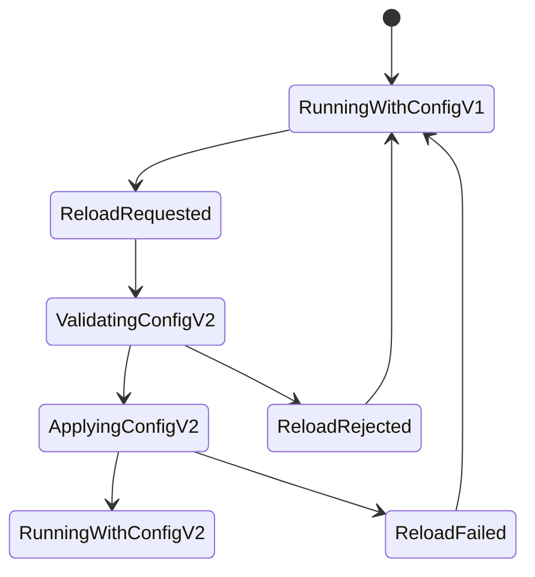
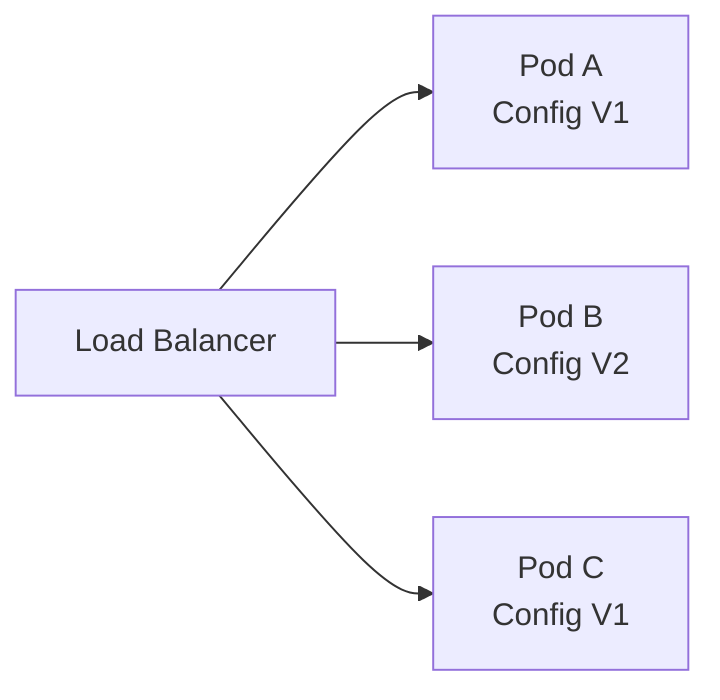
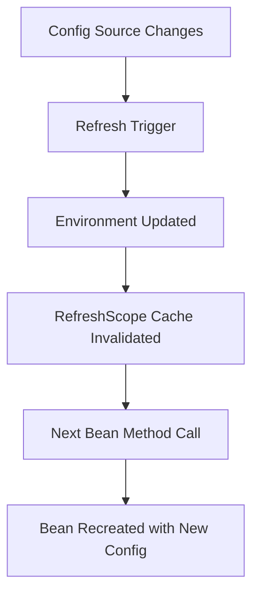
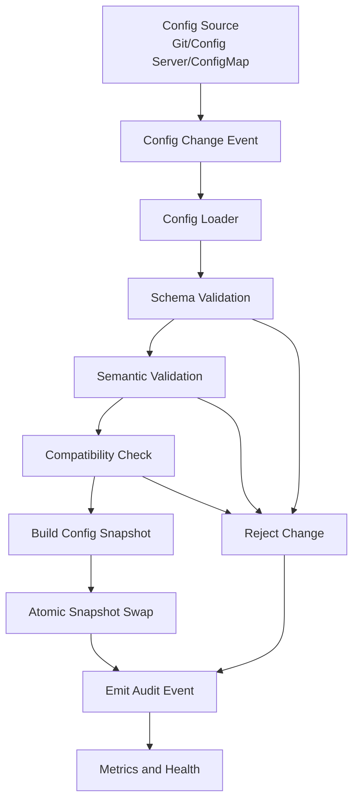

# Part 043 — Dynamic Config and Runtime Reload

> Runtime reload is not a feature.
>
> Runtime reload is a distributed state transition.

Banyak engineer awalnya melihat dynamic config sebagai cara praktis untuk menghindari restart:

```txt
ubah ConfigMap → service langsung berubah
ubah config server → /actuator/refresh
ubah feature flag → behavior berubah realtime
```

Tetapi di production, runtime reload bukan sekadar “nilai berubah”. Runtime reload berarti **running process mengubah behavior-nya ketika request sedang berjalan, connection pool masih hidup, cache masih berisi value lama, worker sedang memproses job, dan instance lain mungkin belum berubah**.

Itu membuat runtime reload masuk kategori distributed systems problem.

Bagian ini membahas bagaimana mendesain dynamic configuration untuk Java microservices secara aman:

- apa yang boleh di-reload;
- apa yang harus restart;
- bagaimana Spring `@RefreshScope` bekerja;
- bagaimana Kubernetes ConfigMap update berbeda antara env var dan volume;
- bagaimana menghindari partial reload antar pod;
- bagaimana menjaga consistency;
- bagaimana observability dan rollback harus dibangun;
- bagaimana membuat config reload menjadi operation yang defensible.

---

## 1. Mental Model: Config Reload adalah State Transition

Static config:

```txt
build artifact + config at startup = running behavior
```

Dynamic config:

```txt
running behavior can change while process is alive
```

Perubahan ini menghasilkan state transition:



Jika desain tidak eksplisit, yang terjadi biasanya:

```txt
Config changed somewhere.
Some beans saw new value.
Some beans still use old value.
Some pods updated.
Some pods did not.
Some worker jobs started with old policy and completed with new policy.
Nobody knows which request used which config.
```

Itu bukan dynamic config. Itu runtime ambiguity.

---

## 2. Reloadable vs Restart-Required Config

Tidak semua config setara.

Gunakan classification berikut.

| Class | Contoh | Runtime Reload? | Alasan |
|---|---|---:|---|
| Pure behavior toggle | enable new UI path, enable async scan | Ya, jika guarded | Tidak mengubah storage/data boundary |
| Threshold/tuning | batch size, timeout, rate limit | Ya, dengan validation | Efek operasional bisa diamati |
| Routing endpoint | downstream base URL | Hati-hati | Bisa mengubah dependency boundary |
| Storage location | bucket, prefix, DB schema | Umumnya tidak | Bisa membuat data split-brain |
| Identity/security | issuer, audience, mTLS mode | Umumnya tidak | Security-sensitive |
| Serialization/schema | Avro schema mode, JSON compatibility | Tidak tanpa rollout | Bisa merusak compatibility |
| Retention/compliance | retention days, legal hold policy | Tidak tanpa approval | Regulated decision |
| Secret material | DB password, API token | Reload via secret rotation flow | Bukan config biasa |

Rule praktis:

```txt
A config is reload-safe only if changing it does not invalidate existing state,
open resources, security assumptions, or in-flight decisions.
```

---

## 3. Runtime Reload Risk Taxonomy

### 3.1 Partial Reload

Sebagian instance memakai config lama, sebagian memakai config baru.



Risiko:

- request user mendapatkan behavior berbeda;
- retry ke pod lain menghasilkan keputusan berbeda;
- audit sulit menjelaskan policy version;
- canary tidak eksplisit;
- rollback ambigu.

### 3.2 Internal Partial Apply

Satu process hanya sebagian berubah.

Contoh:

```txt
Timeout bean updated.
HTTP client old timeout still cached.
Circuit breaker threshold updated.
Worker thread still uses old snapshot.
```

### 3.3 Resource Mismatch

Config baru mengubah value yang sudah dipakai resource lama.

Contoh:

- DB credential berubah, connection pool masih memakai old connection;
- bucket berubah, metadata masih menunjuk object lama;
- thread pool size berubah, executor lama tidak direcreate;
- retention policy berubah, worker lama sudah mengambil batch job.

### 3.4 Policy Drift

Config berubah tanpa versi policy yang tercatat.

```txt
Case decision made at 10:00.
Config changed at 10:01.
Audit review at 11:00.
Which policy was used?
```

Jika audit tidak menyimpan `policyVersion`, sistem tidak defensible.

---

## 4. Kubernetes ConfigMap Reload Semantics

Kubernetes ConfigMap adalah key-value non-confidential configuration object. Pod bisa mengonsumsinya sebagai environment variable, command argument, atau mounted file.

Perbedaan penting:

| Injection Method | Update Behavior |
|---|---|
| Environment variable | Tidak berubah di running container |
| Command argument | Tidak berubah di running container |
| Mounted ConfigMap volume | File projection bisa eventually updated |
| `subPath` mount | Tidak menerima update ConfigMap |
| Immutable ConfigMap | Tidak bisa diubah setelah dibuat |

Implikasi:

```txt
If the application reads config only at startup,
mounted file update does not matter.
```

Kubernetes bisa mengupdate projected volume, tetapi aplikasi Java harus membaca ulang file tersebut dan memutuskan bagaimana apply-nya.

Jangan menganggap:

```txt
ConfigMap changed = Java application behavior changed
```

Yang benar:

```txt
ConfigMap changed = runtime source may change depending on injection method.
Application reload behavior is a separate design.
```

---

## 5. Spring Runtime Refresh Model

Spring Boot mendukung externalized configuration dari banyak source. Spring Cloud menambahkan mekanisme runtime refresh melalui environment update dan `@RefreshScope`.

Konsep penting:

- `@ConfigurationProperties` biasanya di-bind saat bean dibuat.
- `@RefreshScope` membuat bean menjadi scoped proxy.
- Saat refresh dipicu, cache scope bisa dihapus.
- Bean akan dibuat ulang saat dipakai lagi.
- Tidak semua bean aman atau bisa direfresh.
- Spring Cloud Commons mendokumentasikan bahwa `HikariDataSource` termasuk default `never-refreshable`.

Mental model:



Hal yang sering salah dipahami:

```txt
@RefreshScope does not magically make every dependency reload-safe.
```

Contoh berbahaya:

```java
@Service
public class EvidenceUploadService {
    private final EvidenceProperties properties;

    public EvidenceUploadService(EvidenceProperties properties) {
        this.properties = properties;
    }

    public void upload(...) {
        // If properties was bound once and not refreshed,
        // this may still use old value.
    }
}
```

Lebih aman untuk config reloadable kecil:

```java
@ConfigurationProperties(prefix = "evidence.throttle")
@Validated
public record EvidenceThrottleProperties(
    @Min(1) int maxConcurrentUploads,
    @NotNull Duration acquireTimeout
) {}
```

Lalu gunakan provider/snapshot boundary:

```java
public interface RuntimeConfigSnapshotProvider {
    RuntimeConfigSnapshot current();
}

public record RuntimeConfigSnapshot(
    String version,
    int maxConcurrentUploads,
    Duration acquireTimeout,
    Instant loadedAt
) {}
```

Dengan ini, setiap request bisa menempelkan config version ke audit/trace.

---

## 6. Two Models: Pull Reload vs Push Reload

### 6.1 Pull Model

Service mengambil config saat:

- startup;
- scheduled polling;
- explicit refresh endpoint;
- request-time lookup.

Kelebihan:

- controlled;
- mudah diberi validation;
- service menentukan apply point.

Kekurangan:

- delay;
- bisa terjadi skew antar instance;
- butuh polling budget.

### 6.2 Push Model

Config source memberi event:

- config server webhook;
- Spring Cloud Bus;
- Kubernetes watcher/controller;
- feature flag SDK streaming;
- sidecar agent.

Kelebihan:

- cepat;
- centralized trigger.

Kekurangan:

- event loss;
- burst reload;
- partial delivery;
- harder rollback;
- perlu versioning ketat.

Production rule:

```txt
Whether pull or push, runtime config must be versioned, validated,
observable, and reversible.
```

---

## 7. Safe Runtime Reload Architecture



Key idea:

```txt
Never mutate many config fields one-by-one in live code.
Build a complete validated snapshot, then atomically swap the snapshot.
```

Java pattern:

```java
public final class AtomicConfigProvider<T> {
    private final AtomicReference<T> current;

    public AtomicConfigProvider(T initial) {
        this.current = new AtomicReference<>(initial);
    }

    public T current() {
        return current.get();
    }

    public void replace(T next) {
        Objects.requireNonNull(next, "next config must not be null");
        current.set(next);
    }
}
```

Snapshot record:

```java
public record EvidenceRuntimeConfig(
    String version,
    int maxConcurrentUploads,
    Duration scanTimeout,
    boolean asyncScanEnabled,
    Instant loadedAt
) {
    public EvidenceRuntimeConfig {
        if (version == null || version.isBlank()) {
            throw new IllegalArgumentException("config version is required");
        }
        if (maxConcurrentUploads < 1) {
            throw new IllegalArgumentException("maxConcurrentUploads must be >= 1");
        }
        if (scanTimeout == null || scanTimeout.isNegative() || scanTimeout.isZero()) {
            throw new IllegalArgumentException("scanTimeout must be positive");
        }
    }
}
```

Apply service:

```java
public final class EvidenceConfigReloader {
    private final AtomicConfigProvider<EvidenceRuntimeConfig> provider;
    private final AuditLog auditLog;
    private final MeterRegistry meterRegistry;

    public ReloadResult reload(RawConfig raw, UserContext actor) {
        try {
            EvidenceRuntimeConfig next = parseAndValidate(raw);
            EvidenceRuntimeConfig previous = provider.current();

            if (!isCompatible(previous, next)) {
                return ReloadResult.rejected("INCOMPATIBLE_CONFIG_CHANGE");
            }

            provider.replace(next);

            auditLog.record("CONFIG_RELOADED", Map.of(
                "previousVersion", previous.version(),
                "nextVersion", next.version(),
                "actor", actor.id()
            ));

            meterRegistry.counter("config_reload_success_total").increment();

            return ReloadResult.applied(next.version());
        } catch (Exception ex) {
            meterRegistry.counter("config_reload_failure_total").increment();
            return ReloadResult.rejected("VALIDATION_FAILED");
        }
    }
}
```

---

## 8. Request-Time Config Snapshot

A request should not observe config changing halfway through a critical decision.

Bad:

```java
public void processUpload(UploadRequest request) {
    if (config.current().asyncScanEnabled()) {
        ...
    }

    // config may change here

    if (config.current().scanTimeout().toSeconds() > 10) {
        ...
    }
}
```

Better:

```java
public void processUpload(UploadRequest request) {
    EvidenceRuntimeConfig cfg = config.current();

    auditContext.put("configVersion", cfg.version());

    if (cfg.asyncScanEnabled()) {
        ...
    }

    if (cfg.scanTimeout().toSeconds() > 10) {
        ...
    }
}
```

Invariant:

```txt
A material decision must use one coherent config snapshot.
```

---

## 9. Worker-Time Config Snapshot

Workers are more dangerous than request handlers because jobs can run long.

Options:

### Option A — Snapshot at Job Start

```txt
Job uses config version from start to finish.
```

Best when consistency matters.

### Option B — Snapshot per Step

```txt
Each step reads current config.
```

Best when operational tuning matters and intermediate consistency is acceptable.

### Option C — Config Version Embedded in Job

```txt
Job created with policyVersion/configVersion.
Worker must apply that version.
```

Best for regulated decisions.

Example job:

```java
public record ScanJob(
    String jobId,
    String fileId,
    String configVersion,
    Instant createdAt
) {}
```

Rule:

```txt
If the output must be defensible, embed config/policy version into the job.
```

---

## 10. Reload Compatibility Rules

Config change must pass compatibility checks.

Example:

```java
public boolean isCompatible(EvidenceRuntimeConfig oldCfg, EvidenceRuntimeConfig newCfg) {
    if (!oldCfg.asyncScanEnabled() && newCfg.asyncScanEnabled()) {
        return true;
    }

    if (newCfg.scanTimeout().compareTo(Duration.ofSeconds(1)) < 0) {
        return false;
    }

    return true;
}
```

More realistic compatibility matrix:

| Change | Runtime Reload? | Reason |
|---|---:|---|
| Increase timeout 5s → 10s | Yes | Less aggressive failure |
| Decrease timeout 30s → 1s | Maybe no | May break in-flight jobs |
| Increase max upload size | Maybe | Abuse/cost implication |
| Decrease max upload size | Yes for new requests, not in-flight | Need request snapshot |
| Change accepted bucket | No | Data boundary change |
| Change quarantine prefix | No | Lifecycle boundary change |
| Disable scan requirement | No in regulated flow | Security/compliance |
| Enable async scan | Canary first | Workflow behavior change |
| Change retention years | No direct reload | Compliance approval |

---

## 11. Dynamic Config Rollout Strategies

### 11.1 All-at-Once Reload

Useful for low-risk config.

Risk:

- all pods fail if config bad;
- all pods change behavior at same time.

### 11.2 Rolling Restart

Useful for restart-required config.

Kubernetes Deployment rolling update incrementally replaces pods. This is often safer than in-place refresh for config that affects resource wiring.

Pattern:

```txt
Config change committed.
Deployment template annotation changes with config checksum.
Kubernetes rollout creates new ReplicaSet.
Pods start with config v2.
Readiness gates traffic.
Old pods terminate gradually.
```

Example annotation:

```yaml
spec:
  template:
    metadata:
      annotations:
        checksum/config: "sha256-of-rendered-config"
```

### 11.3 Canary Config

Useful for behavior tuning or feature rollout.

```txt
Pod group A: config v1
Pod group B: config v2
Traffic: 5% to B
Observe metrics
Promote or rollback
```

Do not accidentally create canary by partial reload. Canary must be intentional and observable.

### 11.4 Shadow Evaluation

For policy-like config:

```txt
Use old config for decision.
Evaluate new config in parallel.
Record diff.
Do not affect user yet.
```

Example:

```java
Decision oldDecision = policyV1.evaluate(input);
Decision newDecision = policyV2.evaluate(input);

if (!oldDecision.equals(newDecision)) {
    metrics.counter("policy_shadow_diff_total").increment();
    auditLog.record("POLICY_SHADOW_DIFF", ...);
}

return oldDecision;
```

This is powerful for risk thresholds, eligibility policy, routing policy, and fraud/scoring rules.

---

## 12. Health and Readiness During Reload

A service must expose reload health.

Possible states:

```txt
CONFIG_OK
CONFIG_RELOAD_IN_PROGRESS
CONFIG_RELOAD_REJECTED
CONFIG_STALE
CONFIG_INCONSISTENT
CONFIG_SOURCE_UNAVAILABLE
```

Do not necessarily mark readiness false for every config source outage. If current config is valid and not expired, service may continue.

But mark degraded if:

- config has freshness SLA and is stale;
- secret/config version required for compliance cannot be proven;
- reload failed repeatedly;
- current config is past expiry;
- pods disagree on required config version.

Example readiness logic:

```java
public ReadinessState readiness() {
    ConfigStatus status = configStatusProvider.status();

    if (status.currentSnapshotValid() && !status.expired()) {
        return ReadinessState.ACCEPTING_TRAFFIC;
    }

    return ReadinessState.REFUSING_TRAFFIC;
}
```

---

## 13. Observability for Runtime Reload

Metrics:

```txt
config_reload_requested_total
config_reload_success_total
config_reload_rejected_total
config_reload_failure_total
config_current_version
config_snapshot_age_seconds
config_reload_duration_seconds
config_compatibility_rejection_total
config_inconsistent_pod_version_total
```

Audit events:

```txt
CONFIG_RELOAD_REQUESTED
CONFIG_RELOAD_VALIDATED
CONFIG_RELOAD_REJECTED
CONFIG_RELOAD_APPLIED
CONFIG_RELOAD_ROLLED_BACK
CONFIG_RELOAD_FAILED
```

Log fields:

```txt
service=evidence-service
configVersion=cfg-2026-07-05-001
previousConfigVersion=cfg-2026-07-04-009
actor=gitops
source=git
correlationId=...
```

Never log secret values.

---

## 14. Runtime Reload Anti-Patterns

### 14.1 Reload Everything

```txt
Every property is refreshable.
```

This is unsafe. Most config should be startup-bound unless explicitly proven reload-safe.

### 14.2 Mutation Without Version

```txt
maxUploadSize changed but no config version stored in audit.
```

You cannot explain past decisions.

### 14.3 ConfigMap Volume Watch Without App-Level Validation

```txt
File changed, app reloads blindly.
```

Need schema and semantic validation before apply.

### 14.4 Reloading DataSource Blindly

Database pools, HTTP clients, thread pools, and cryptographic material often require careful recreation. Some beans are not refreshable by default. Treat them as resource lifecycle operations, not scalar value updates.

### 14.5 Runtime Reload as Deployment Replacement

Dynamic reload is not a substitute for release discipline. If config affects data boundary, security, schema, or compliance, use controlled deployment/rollout.

---

## 15. Design Decision Framework

Ask this before allowing runtime reload:

```txt
1. Does this config change data location, security boundary, identity, or schema?
   If yes, do not runtime reload by default.

2. Can in-flight request/job safely use old snapshot while new requests use new snapshot?
   If no, use restart/rollout.

3. Can old and new config coexist across pods?
   If no, coordinate rollout.

4. Can we validate config before applying?
   If no, do not runtime reload.

5. Can we audit which config version made a decision?
   If no, do not use for material decisions.

6. Can we rollback safely?
   If no, use canary/shadow first.

7. Can we observe partial failure?
   If no, improve observability before enabling reload.
```

---

## 16. Production Checklist

- Config is classified as reloadable or restart-required.
- Reloadable config has schema validation.
- Reloadable config has semantic validation.
- Reload applies via atomic snapshot swap.
- Request/job uses one coherent snapshot.
- Config version appears in audit/trace for material decisions.
- Partial reload across pods is observable.
- Reload rejection is safe and visible.
- Rollback path exists.
- Runtime reload is not used for storage boundary, schema, identity, or compliance-critical config without explicit design.
- Secrets are handled through secret rotation flow, not generic config reload.
- Readiness reflects invalid/expired config state.
- Metrics and audit events exist.

---

## Key Takeaways

1. **Runtime reload is a distributed state transition.**
2. **Most config should be startup-bound unless explicitly classified as reload-safe.**
3. **A Java service should apply runtime config through validated immutable snapshots, not scattered mutable fields.**
4. **Requests and jobs should use a coherent config version.**
5. **Kubernetes ConfigMap update does not automatically mean application behavior changed.**
6. **Spring `@RefreshScope` is useful but not magic; resource lifecycle still matters.**
7. **Canary, shadow evaluation, and rolling restart are often safer than in-place refresh.**
8. **Every material decision must be explainable by config version.**

Part berikutnya menutup blok configuration management dengan **config testing and promotion**: bagaimana memastikan config aman sebelum masuk production.

---

## References

- Spring Boot Externalized Configuration: https://docs.spring.io/spring-boot/reference/features/external-config.html
- Spring Cloud Commons Application Context Services and Refresh Scope: https://docs.spring.io/spring-cloud-commons/reference/spring-cloud-commons/application-context-services.html
- Kubernetes ConfigMap: https://kubernetes.io/docs/concepts/configuration/configmap/
- Kubernetes Deployment rolling update and rollback: https://kubernetes.io/docs/concepts/workloads/controllers/deployment/
