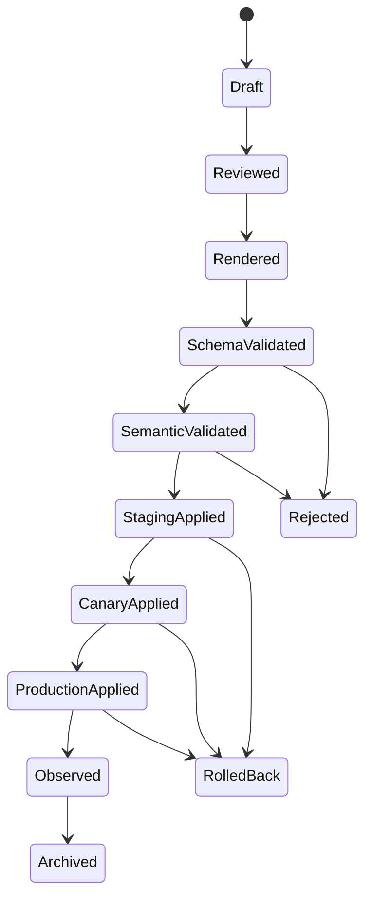
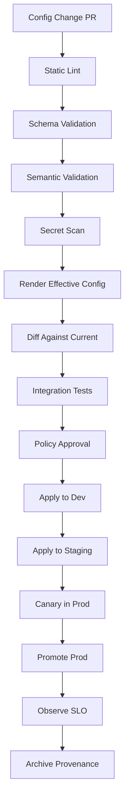
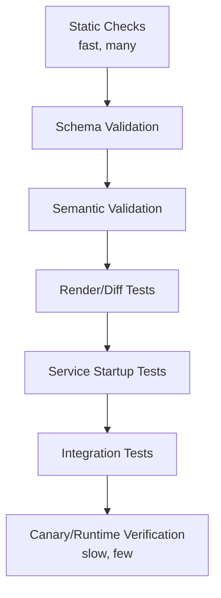
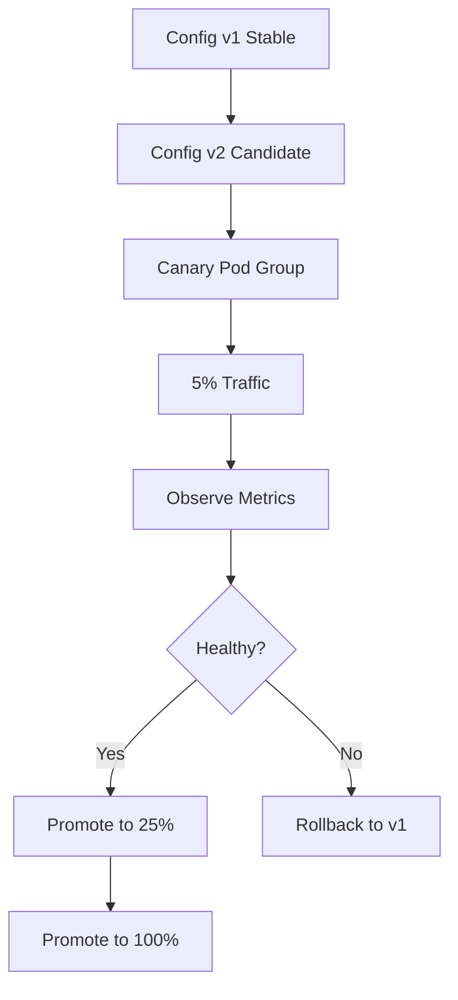

# Part 044 — Config Testing and Promotion

> Bad code usually fails in CI.
>
> Bad config often fails in production.

Configuration changes are production changes.

A single config patch can:

- route traffic to the wrong downstream;
- disable malware scanning;
- increase file upload size and explode cost;
- point quarantine and accepted storage to the same prefix;
- reduce timeout until every request fails;
- change retention behavior;
- break OAuth issuer validation;
- overload a worker pool;
- silently make pods disagree.

The dangerous part: config changes often bypass the discipline used for code changes.

This part builds a production-grade process for config testing and promotion:

- config test pyramid;
- schema validation;
- semantic validation;
- compatibility checks;
- environment promotion;
- canary and shadow evaluation;
- rollback design;
- drift detection;
- GitOps workflow;
- runtime evidence.

This is the last part of the configuration management block. After this, we move to secret management.

---

## 1. Mental Model: Config is an Artifact

Treat config as deployable artifact.

```txt
source config → rendered config → validated config → promoted config → effective runtime config
```

A config value is not “just YAML”. It has lifecycle.



If code has build, test, artifact, deploy, observe, rollback, config should have equivalent gates.

---

## 2. Configuration Promotion Pipeline

Recommended pipeline:



Not every config needs every gate. But production-critical config should pass most of them.

---

## 3. Config Test Pyramid



### 3.1 Static Checks

Examples:

- YAML syntax;
- duplicate keys;
- unknown property detection;
- naming convention;
- forbidden values;
- secret-like string detection;
- no production URL in dev config;
- no dev URL in prod config.

### 3.2 Schema Validation

Config shape is correct.

Example with Spring Boot typed properties:

```java
@ConfigurationProperties(prefix = "evidence.file")
@Validated
public record EvidenceFileProperties(
    @Min(1) long maxUploadSizeMb,
    @NotBlank String quarantineBucket,
    @NotBlank String acceptedBucket,
    @NotBlank String quarantinePrefix,
    @NotBlank String acceptedPrefix,
    @NotNull Duration scanTimeout
) {}
```

### 3.3 Semantic Validation

Config makes sense as a system.

Example:

```java
public void validate(EvidenceFileProperties props) {
    if (props.quarantineBucket().equals(props.acceptedBucket())
        && props.quarantinePrefix().equals(props.acceptedPrefix())) {
        throw new IllegalStateException(
            "quarantine and accepted storage locations must differ"
        );
    }

    if (props.scanTimeout().compareTo(Duration.ofSeconds(1)) < 0) {
        throw new IllegalStateException("scan timeout is unrealistically low");
    }

    if (props.maxUploadSizeMb() > 500) {
        throw new IllegalStateException("max upload size requires explicit approval");
    }
}
```

### 3.4 Compatibility Validation

Config is compatible with current running state.

Example questions:

- Does new bucket contain existing objects?
- Does new retention policy conflict with legal hold?
- Does decreased timeout break P99 latency?
- Does new endpoint support required API version?
- Does new feature flag assume a DB migration already applied?
- Does new issuer require JWK cache refresh?

### 3.5 Startup Validation

A service should be able to start with rendered config in CI.

Run:

```bash
java -jar app.jar \
  --spring.config.location=file:./rendered/prod/application.yaml \
  --spring.main.web-application-type=none
```

For Spring Boot, startup validation catches binding errors, missing required values, invalid durations, invalid enum values, and failed custom invariant checks.

---

## 4. Rendered Config, Not Template Illusion

In real systems, config is often produced from:

- Helm chart values;
- Kustomize overlays;
- Jsonnet;
- Terraform output;
- environment-specific patches;
- Config Server Git repository;
- External Secrets references;
- platform defaults.

Do not validate only source fragments. Validate **rendered effective config**.

```txt
template + overlays + environment + defaults = rendered config
```

Example failure:

```yaml
# base
evidence:
  file:
    scan-timeout: 30s

# prod overlay accidentally overrides
evidence:
  file:
    scan-timeout: 300ms
```

If tests check only base, production breaks.

---

## 5. Effective Config Diff

Every config promotion should produce a human-readable diff.

Example:

```diff
 evidence.file.max-upload-size-mb:
- 100
+ 250

 evidence.file.scan-timeout:
- 30s
+ 10s

 evidence.file.direct-upload-enabled:
- false
+ true
```

But raw diff is not enough. Add risk annotation:

| Key | Old | New | Risk | Approval |
|---|---:|---:|---|---|
| `max-upload-size-mb` | 100 | 250 | Cost + abuse | Product + SRE |
| `scan-timeout` | 30s | 10s | False negative scan timeout | Service owner |
| `direct-upload-enabled` | false | true | Trust boundary shift | Security + service |

Config diff should answer:

```txt
What behavior changes?
Who approved it?
What is rollback?
What should we monitor?
```

---

## 6. Environment Promotion

Do not hand-edit config per environment.

Use promotion:

```txt
dev → test → staging → canary → prod
```

But promotion does not mean identical values across environment. It means identical **change intent** and controlled environment-specific binding.

Example:

```yaml
# intent
evidence.file.direct-upload-enabled: true

# environment binding
dev.bucket: dev-evidence
staging.bucket: stg-evidence
prod.bucket: prod-evidence
```

Rules:

- config key schema should be same across environments;
- environment-specific values should be explicit;
- production overrides require review;
- no hidden manual cluster edits;
- promotion record must show source commit/version.

---

## 7. GitOps Configuration Workflow

Typical GitOps config flow:


GitOps gives:

- review;
- history;
- diff;
- rollback to commit;
- environment promotion;
- reproducibility.

But GitOps alone does not prove config is safe. You still need schema, semantic, and runtime validation.

### 7.1 Sync Order

Some resources depend on others.

Example:

```txt
Namespace before ConfigMap.
ConfigMap before Deployment.
CRD before custom resource.
ExternalSecret before workload that mounts resulting Secret.
```

Argo CD supports sync phases and waves to order resource application during sync. Use ordering to prevent race conditions, but don't rely on ordering as your only readiness guarantee.

---

## 8. Kubernetes Rollout for Config Changes

A common production pattern:

```txt
ConfigMap content changes.
Deployment pod template annotation changes with checksum.
Kubernetes creates new ReplicaSet.
New pods start with config.
Readiness gates traffic.
Old pods terminate gradually.
```

Why checksum annotation?

Kubernetes Deployment rolls pods when Pod template changes. ConfigMap data change alone does not necessarily modify the Deployment template. A checksum annotation forces a new ReplicaSet when rendered config changes.

Example:

```yaml
apiVersion: apps/v1
kind: Deployment
metadata:
  name: evidence-service
spec:
  template:
    metadata:
      annotations:
        checksum/config: "sha256:8d4c..."
```

This is often safer than runtime refresh for restart-required config.

---

## 9. Canary Config Promotion

Canary is not only for code. It is also for config.



Canary metrics:

- error rate;
- latency;
- timeout rate;
- downstream rejection;
- file upload failure;
- scan queue age;
- cache miss/stale rate;
- config-specific business metric;
- audit rejection count.

Canary is especially useful for:

- timeout change;
- feature flag change;
- batch size change;
- direct upload enablement;
- new downstream routing;
- new validation policy;
- larger upload size.

---

## 10. Shadow Evaluation Before Promotion

For policy-like config, canary may still affect users. Shadow evaluation reduces risk.

Example:

```txt
Policy v1 decides.
Policy v2 evaluates in parallel.
Result diff is recorded.
Users still get v1 outcome.
```

Use for:

- file validation policy;
- risk scoring threshold;
- retention classification;
- authorization policy;
- routing policy;
- eligibility rules.

Java sketch:

```java
public Decision decide(DecisionInput input) {
    PolicySnapshot active = policyProvider.active();
    PolicySnapshot candidate = policyProvider.candidateOrNull();

    Decision activeDecision = active.evaluate(input);

    if (candidate != null) {
        Decision candidateDecision = candidate.evaluate(input);

        if (!activeDecision.equals(candidateDecision)) {
            metrics.counter("policy_shadow_diff_total").increment();
            auditLog.record("POLICY_SHADOW_DIFF", Map.of(
                "activeVersion", active.version(),
                "candidateVersion", candidate.version(),
                "inputType", input.type(),
                "activeDecision", activeDecision.code(),
                "candidateDecision", candidateDecision.code()
            ));
        }
    }

    return activeDecision;
}
```

Promotion decision should use diff rate and diff severity.

---

## 11. Rollback Design

Rollback must be designed before deployment.

### 11.1 Simple Rollback

Works when config only changes runtime behavior.

```txt
Revert config commit.
GitOps sync.
Pods restart/reload.
Behavior returns to old value.
```

### 11.2 Rollback with State Compatibility

More complex when config changes state.

Example:

```txt
Config v2 increases max upload size.
Users upload 200 MB files.
Rollback to v1 max 100 MB.
Existing 200 MB files remain.
```

The rollback cannot pretend those files do not exist.

Checklist:

- Can old config read data created under new config?
- Can old config process jobs created under new config?
- Can old config validate metadata created under new config?
- Are there in-flight requests using new config?
- Are there audit events using new policy version?

### 11.3 Rollback Boundary

Define:

```txt
Rollback allowed until:
- no irreversible state transition occurred;
- or compatibility adapter exists;
- or migration rollback plan exists.
```

If config changes data shape, it is closer to schema migration than simple config change.

---

## 12. Drift Detection

Drift means actual runtime differs from declared desired state.

Types:

| Drift | Example |
|---|---|
| Git vs cluster | ConfigMap manually edited |
| Cluster vs pod | pod still uses old env var |
| Pod vs source | runtime refresh failed |
| Service vs peer | pods use different config versions |
| Config vs secret | config references missing secret |
| Config vs state | config points to bucket without required objects |

Drift detection techniques:

- compare rendered config hash to pod annotation;
- expose effective config version endpoint with redaction;
- scrape metric `config_current_version`;
- alert on multiple versions beyond rollout window;
- block manual cluster edits with RBAC/admission policy;
- reconcile object metadata against configured storage;
- include config version in audit events.

Example metric:

```txt
config_current_version{service="evidence-service",pod="pod-a"} 2026070501
config_current_version{service="evidence-service",pod="pod-b"} 2026070500
```

Alert:

```txt
More than one config version is serving production traffic for > 30 minutes
outside declared canary rollout.
```

---

## 13. Config Security Checks

Config is not secret, but config can leak or weaken security.

CI checks should detect:

- secret-like values in config repository;
- `debug=true` in prod;
- actuator exposure too broad;
- `allow-public-download=true`;
- disabled TLS verification;
- wildcard CORS in prod;
- insecure issuer/audience;
- local/dev endpoint in prod;
- disabled malware scan;
- retention set below allowed minimum;
- large upload size without approval.

Example forbidden production config:

```yaml
management:
  endpoints:
    web:
      exposure:
        include: "*"

storage:
  evidence:
    allow-public-read: true
```

Production policy should reject this automatically.

---

## 14. Contract Between Config and Code

Code and config evolve together.

For each config key define:

```yaml
key: evidence.file.scan-timeout
type: duration
owner: evidence-service
default: 30s
min: 1s
max: 5m
reloadable: true
risk: operational
introducedIn: 1.12.0
deprecatedIn: null
removeAfter: null
approval: service-owner
```

This is a config contract.

Benefits:

- unknown key detection;
- deprecated key warning;
- safer cleanup;
- schema compatibility;
- promotion automation;
- audit clarity.

---

## 15. Testing with Spring Boot

Use `ApplicationContextRunner` for focused config tests.

Example:

```java
class EvidenceFilePropertiesTest {
    private final ApplicationContextRunner runner = new ApplicationContextRunner()
        .withUserConfiguration(EvidenceConfig.class)
        .withPropertyValues(
            "evidence.file.max-upload-size-mb=100",
            "evidence.file.quarantine-bucket=quarantine",
            "evidence.file.accepted-bucket=accepted",
            "evidence.file.quarantine-prefix=q/",
            "evidence.file.accepted-prefix=a/",
            "evidence.file.scan-timeout=30s"
        );

    @Test
    void validConfigBinds() {
        runner.run(context -> {
            assertThat(context).hasSingleBean(EvidenceFileProperties.class);
        });
    }

    @Test
    void invalidTimeoutFails() {
        new ApplicationContextRunner()
            .withUserConfiguration(EvidenceConfig.class)
            .withPropertyValues(
                "evidence.file.max-upload-size-mb=100",
                "evidence.file.quarantine-bucket=quarantine",
                "evidence.file.accepted-bucket=accepted",
                "evidence.file.quarantine-prefix=q/",
                "evidence.file.accepted-prefix=a/",
                "evidence.file.scan-timeout=0s"
            )
            .run(context -> assertThat(context).hasFailed());
    }
}
```

For full environment tests, start the application with rendered config.

```java
@SpringBootTest(properties = {
    "spring.config.location=file:./rendered/staging/application.yaml"
})
class RenderedStagingConfigBootTest {
    @Test
    void contextLoadsWithRenderedConfig() {
    }
}
```

---

## 16. Config Promotion Checklist

### PR Review

- Is the owner clear?
- Is the reason clear?
- Is rollback clear?
- Is risk annotated?
- Is approval required?
- Does diff show effective behavior change?

### Static Validation

- YAML/properties valid.
- No unknown keys.
- No duplicate keys.
- No secret-like values.
- No forbidden prod values.

### Schema Validation

- Typed config binds.
- Required fields exist.
- Durations/sizes/enums valid.
- Cross-field constraints pass.

### Semantic Validation

- Storage boundaries make sense.
- Timeout/batch/limit values are realistic.
- Security-sensitive flags are not weakened.
- Retention/compliance rules pass.
- Downstream compatibility checked.

### Environment Validation

- Rendered config validated.
- Dev/staging/prod overlays checked.
- Required platform resources exist.
- Referenced ConfigMaps/Secrets exist.
- Pod template checksum changes when needed.

### Runtime Verification

- Pods report expected config version.
- No mixed version outside rollout window.
- Config-specific metrics healthy.
- Audit events include config version.
- Rollback tested or rehearsed.

---

## 17. Anti-Patterns

### 17.1 Manual Hotfix in Cluster

```txt
kubectl edit configmap production-config
```

This creates drift. If emergency edit is unavoidable, record it, backport it to Git, and reconcile immediately.

### 17.2 Environment Snowflakes

```txt
Prod config has keys that staging never sees.
```

This guarantees promotion surprises.

### 17.3 Config Without Owner

Nobody knows who can approve change.

### 17.4 No Effective Diff

Reviewers see a Helm values patch but not the rendered result.

### 17.5 Rollback Assumed, Not Tested

Rollback is impossible after irreversible state changes.

### 17.6 Treating Feature Flags as Permanent Config

Feature flags should have lifecycle: created, launched, cleaned up. Permanent flags become hidden complexity.

### 17.7 Secret in Config Repo

A ConfigMap is not a Secret. A Git config repo is not a secret manager.

---

## 18. Reference Runbook: Bad Config in Production

### Symptoms

- error rate spike after config sync;
- pods crashloop;
- scan queue stalls;
- upload failures increase;
- downstream timeout increases;
- pods show different config versions.

### Immediate Triage

1. Identify config version currently serving traffic.
2. Compare against last known good version.
3. Check whether config was rollout, reload, or manual drift.
4. Check if all pods agree.
5. Check whether state was mutated under new config.
6. Decide rollback vs forward fix.

### Rollback

If safe:

```txt
revert config commit → GitOps sync → rollout restart/reload → verify version
```

If not safe:

```txt
freeze rollout → disable affected route/flag → drain workers → preserve evidence → create compatibility fix
```

### Evidence to Capture

- config diff;
- actor/commit;
- approval;
- pod versions;
- time range;
- affected request IDs;
- audit events;
- metrics before/after;
- rollback action.

---

## 19. Key Takeaways

1. **Configuration is a deployable artifact.**
2. **Validate rendered effective config, not only source fragments.**
3. **Schema validation catches shape errors; semantic validation catches system errors.**
4. **Config promotion should have review, diff, approval, canary, observability, and rollback.**
5. **Kubernetes ConfigMap changes often need Deployment rollout to affect startup-bound config.**
6. **Runtime reload must be treated as state transition, not convenience.**
7. **Drift detection is mandatory in production.**
8. **Rollback must consider state already created under new config.**

This closes the configuration management block.

Next block: **Secret Management** — identity, capability, rotation, audit, Vault, Kubernetes Secrets, cloud secret managers, External Secrets Operator, SOPS, Sealed Secrets, and zero-downtime rotation.

---

## References

- Spring Boot Externalized Configuration: https://docs.spring.io/spring-boot/reference/features/external-config.html
- Spring Cloud Commons Application Context Services: https://docs.spring.io/spring-cloud-commons/reference/spring-cloud-commons/application-context-services.html
- Kubernetes ConfigMap: https://kubernetes.io/docs/concepts/configuration/configmap/
- Kubernetes Deployments: https://kubernetes.io/docs/concepts/workloads/controllers/deployment/
- Argo CD Sync Phases and Waves: https://argo-cd.readthedocs.io/en/stable/user-guide/sync-waves/
