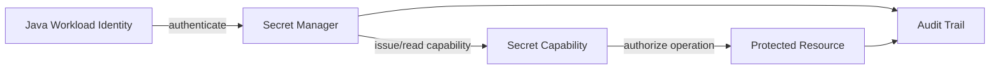
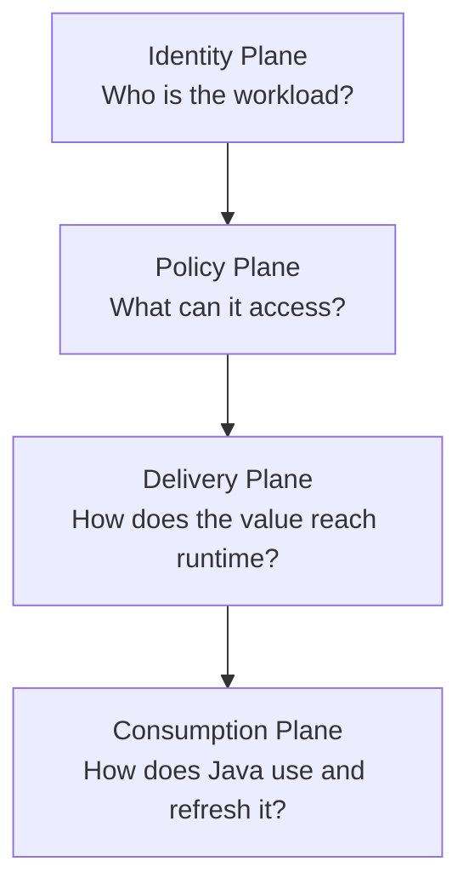
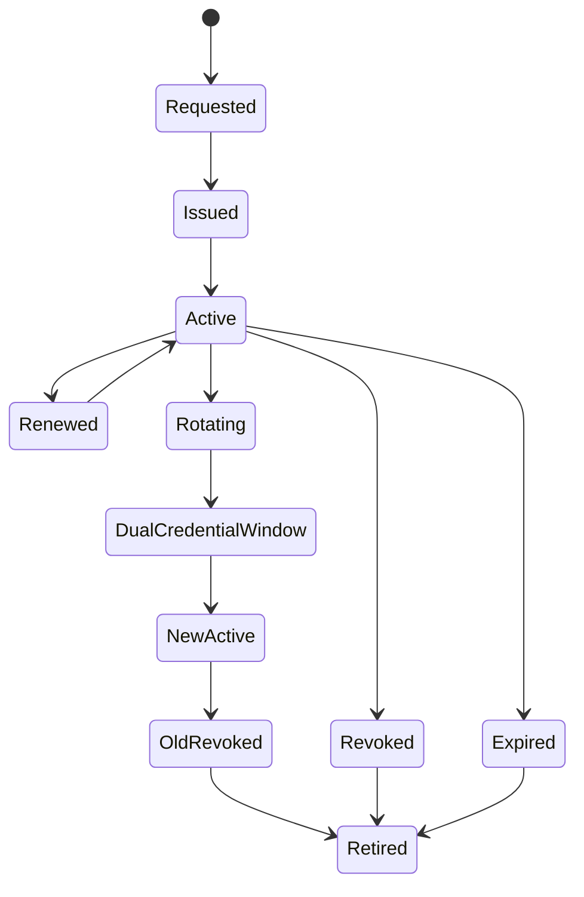
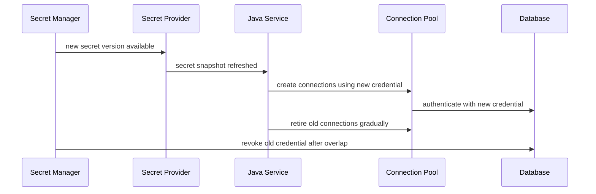
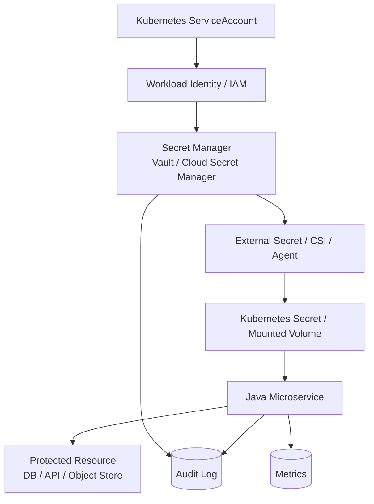

# Part 045 — Secret Management Mental Model

> A secret is not a string.
>
> A secret is a temporary capability with blast radius.

Banyak engineer memperlakukan secret seperti configuration value yang “lebih sensitif”. Itu awal dari desain yang rapuh.

Secret bukan hanya value. Secret adalah **capability**: sesuatu yang memberi kemampuan kepada workload untuk melakukan tindakan terhadap resource lain.

Contoh:

- database password memberi kemampuan membaca/menulis database;
- object storage access key memberi kemampuan membaca/menulis object;
- API token memberi kemampuan memanggil service eksternal;
- TLS private key memberi kemampuan membuktikan identitas endpoint;
- signing key memberi kemampuan membuat token yang dipercaya pihak lain;
- encryption key memberi kemampuan membuka data yang seharusnya tertutup.

Karena secret adalah capability, pertanyaan desainnya bukan hanya:

```txt
Where do we store the secret?
```

Pertanyaannya harus menjadi:

```txt
Who receives which capability, for what purpose, for how long,
under which identity, with what audit trail, and how do we revoke it?
```

Di part ini kita membangun mental model secret management yang akan dipakai untuk Kubernetes Secret, Vault, AWS Secrets Manager, Azure Key Vault, Google Secret Manager, External Secrets Operator, SOPS, Sealed Secrets, dan secret rotation tanpa downtime.

---

## 1. Secret vs Config

Config dan secret sama-sama bisa masuk ke aplikasi melalui environment variable, mounted file, config server, atau remote API. Tetapi semantic-nya berbeda.

| Dimension | Configuration | Secret |
|---|---|---|
| Tujuan | Mengubah behavior | Memberi capability/access |
| Sensitivity | Bisa non-sensitive | Sensitive by default |
| Lifecycle | Bisa stabil lama | Harus bisa rotate/revoke |
| Audit | Change audit | Access + issuance + use audit |
| Failure mode | Behavior salah | Data breach / privilege abuse |
| Default exposure | Bisa ditampilkan sebagian | Harus redacted |
| Owner | Service/domain/platform | Security/platform/service |
| Runtime handling | Validasi dan precedence | TTL, lease, reload, revocation |

Contoh yang sering salah diklasifikasikan:

```yaml
# Bukan secret
payment:
  gateway-base-url: https://api.payment.example
  connect-timeout: 2s
  retry-max-attempts: 3

# Secret
payment:
  api-key: ${PAYMENT_API_KEY}
  webhook-signing-secret: ${PAYMENT_WEBHOOK_SECRET}
```

Rule praktis:

```txt
If knowing the value grants access, impersonation, decryption,
signing, or policy bypass capability, treat it as secret.
```

---

## 2. Secret Is a Capability

Lihat secret sebagai capability token.



Secret yang baik punya boundary:

- **who**: workload identity yang boleh mengambil secret;
- **what**: capability apa yang diberikan;
- **where**: resource mana yang bisa diakses;
- **when**: TTL, expiry, activation window;
- **how much**: scope/permission;
- **why**: purpose dan owner;
- **proof**: audit trail dan issuance log.

Secret yang buruk:

```txt
One static admin password shared by all services forever.
```

Secret yang lebih baik:

```txt
Service-specific credential, least privilege, short TTL where possible,
issued to authenticated workload identity, rotated regularly,
audited, and revocable.
```

---

## 3. Four-Plane Model

Secret management menyentuh empat plane.



### 3.1 Identity Plane

Workload harus punya identitas.

Contoh identity source:

- Kubernetes ServiceAccount;
- cloud workload identity / IAM role;
- Vault Kubernetes auth;
- SPIFFE/SPIRE identity;
- mTLS client certificate;
- instance metadata identity;
- CI/CD OIDC identity.

Tanpa identity plane yang baik, secret manager hanya menjadi database password yang lebih mewah.

### 3.2 Policy Plane

Policy menjawab:

```txt
Which identity can access which secret path or capability?
```

Contoh Vault policy:

```hcl
path "kv/data/prod/evidence-service/*" {
  capabilities = ["read"]
}

path "database/creds/evidence-service" {
  capabilities = ["read"]
}
```

Policy harus least privilege. Jangan memberi service akses wildcard karena “lebih gampang”.

### 3.3 Delivery Plane

Secret bisa dikirim ke runtime dengan beberapa cara:

| Delivery | Contoh | Trade-off |
|---|---|---|
| Env var | `DB_PASSWORD` | Simple, tetapi sulit reload dan mudah bocor via process/env dump |
| Mounted file | Kubernetes Secret volume, Vault Agent template | Lebih reloadable, bisa dibatasi file permission |
| App fetch API | Java client ke Vault/Secrets Manager | Kontrol tinggi, tetapi app harus handle auth/retry/cache |
| Sidecar/agent | Vault Agent, CSI driver | Memindahkan sebagian logic ke platform, tetapi tetap perlu lifecycle handling |
| Build-time injection | Secret baked into image | Anti-pattern untuk runtime secret |

### 3.4 Consumption Plane

Java service tetap bertanggung jawab atas consumption:

- redaction;
- connection pool refresh;
- token expiry handling;
- reload strategy;
- fallback behavior;
- readiness/liveness effect;
- observability;
- avoiding accidental logs;
- not caching beyond TTL.

Secret manager tidak otomatis membuat consumer aman.

---

## 4. Secret Lifecycle

Secret lifecycle minimal:



Tahap-tahapnya:

| Stage | Makna |
|---|---|
| Requested | Workload meminta capability |
| Issued | Secret dibuat/diambil dari authority |
| Active | Consumer memakai secret |
| Renewed | Lease diperpanjang jika renewable |
| Rotating | Versi baru dipersiapkan |
| DualCredentialWindow | Credential lama dan baru sama-sama valid sementara |
| NewActive | Consumer sudah memakai secret baru |
| OldRevoked | Secret lama dicabut |
| Expired | TTL habis |
| Retired | Tidak boleh dipakai lagi |

Invariant:

```txt
A Java service must know whether the secret it uses is static, versioned,
leased, renewable, rotatable, or revocable.
```

Jika service tidak tahu lifecycle secret, service tidak bisa recovery dengan benar.

---

## 5. Secret Types

Tidak semua secret sama.

| Type | Contoh | Concern Utama |
|---|---|---|
| Static secret | API key eksternal | Rotation manual/periodic |
| Versioned static secret | `kv-v2` secret version | Version pinning, rollback |
| Dynamic secret | Vault DB credential | Lease, TTL, revocation |
| Token | OAuth client token, service token | Expiry, refresh |
| Certificate | mTLS cert | Expiry, trust chain, reload |
| Private key | JWT signing key, TLS key | Leakage impact tinggi |
| Data encryption key | Envelope encryption DEK | Key wrapping, rotation |
| Root/break-glass secret | Emergency admin credential | Extreme control, offline audit |

Desain consumer berbeda untuk tiap jenis.

### 5.1 Static Secret

Static secret paling mudah dipakai, paling mudah dilupakan.

Risiko:

- tidak punya TTL natural;
- sering dipakai lintas service;
- rotation dianggap event langka;
- leakage bisa lama tidak terdeteksi.

Mitigasi:

- owner jelas;
- versioning;
- periodic rotation;
- access audit;
- scoped capability;
- no shared credential;
- expiry policy di secret manager atau upstream provider.

### 5.2 Dynamic Secret

Dynamic secret dibuat on-demand, biasanya dengan lease.

Contoh: Vault database secret engine membuat username/password database sementara untuk role tertentu.

Keuntungan:

- unique per consumer/session;
- TTL jelas;
- revocable;
- audit issuance;
- blast radius lebih kecil.

Risiko:

- consumer harus handle expiry;
- connection pool harus refresh;
- lease renewal failure bisa memutus akses;
- secret manager outage memengaruhi runtime.

### 5.3 Certificate

Certificate bukan hanya secret value. Ia membawa identity.

Pertanyaan:

- siapa CA?
- trust bundle dikelola bagaimana?
- kapan cert expire?
- apakah app reload TLS material tanpa restart?
- bagaimana mencegah cert lama tetap dipercaya?
- bagaimana observability days-until-expiry?

### 5.4 Signing Key

Signing key lebih berbahaya daripada banyak password karena bisa membuat artifact yang tampak valid.

Contoh:

- JWT signing key;
- webhook signing secret;
- document signing key;
- token minting key.

Rotation signing key harus memikirkan:

- `kid` / key ID;
- verification key set;
- overlap window;
- issued token TTL;
- revocation;
- audit;
- emergency key compromise response.

---

## 6. Threat Model

Secret management harus dimulai dari threat model, bukan tool.

### 6.1 Threat: Secret Leaks in Logs

Contoh leak:

```java
log.info("Connecting to database with url={}", jdbcUrl);
```

Jika `jdbcUrl` mengandung password, selesai.

Mitigasi:

- jangan embed password di URL string yang dilog;
- gunakan separate username/password property;
- redaction filter;
- avoid `toString()` on credential object;
- secure log access;
- scanning log pipeline.

### 6.2 Threat: Over-Permissioned Service

Service hanya perlu read metadata, tetapi mendapat admin DB password.

Mitigasi:

- role per service;
- schema-level permission;
- read/write split;
- deny DDL;
- no cross-domain table access;
- audit query/connection where available.

### 6.3 Threat: Secret Exposed via Env/Actuator

Env var mudah digunakan, tetapi bisa bocor melalui:

- process introspection;
- debugging shell;
- crash diagnostics;
- `/actuator/env` jika tidak diamankan;
- support bundle;
- CI logs.

Mitigasi:

- disable sensitive actuator exposure;
- use mounted file or agent where better;
- restrict debug access;
- redact diagnostics;
- avoid env var untuk high-value long-lived secret.

### 6.4 Threat: Secret Rotation Breaks Service

Secret dirotasi, tetapi Java connection pool menyimpan koneksi lama.

Mitigasi:

- dual credential window;
- max connection lifetime;
- refresh hook;
- canary rotation;
- monitor old credential use;
- avoid infinite pool lifetime.

### 6.5 Threat: Secret Manager Outage

Jika secret manager tidak bisa diakses, apakah service mati?

Jawabannya tergantung jenis secret.

| Secret | Startup Behavior | Runtime Behavior |
|---|---|---|
| Required DB credential | Fail startup | Degrade/refresh retry/readiness fail before expiry |
| Optional external API token | Start if feature disabled | Disable integration temporarily |
| Signing key | Usually fail closed | Stop issuing new token if key unavailable |
| Trust bundle | Fail if invalid | Maintain current valid bundle until expiry |

---

## 7. Delivery Pattern Decision Matrix

| Pattern | Good For | Avoid When |
|---|---|---|
| Kubernetes Secret env var | Low-risk simple app config | Need runtime rotation/reload |
| Kubernetes Secret volume | File-based credential, cert, reloadable material | App cannot watch/reload file |
| Vault Agent template | Dynamic secrets, file delivery, renewal by agent | Need app-level secret semantics |
| Spring Cloud Vault | Java property source integration, Vault-native app | App team cannot handle Vault operational model |
| Cloud SDK fetch | Fine-grained control and cache | App should not own secret client complexity |
| External Secrets Operator | GitOps/K8s native sync from external manager | Need immediate rotation without K8s Secret sync delay |
| Secrets Store CSI Driver | Mount external secrets as files | Need native env var injection only |

No pattern is universally best. Choose based on:

- reload requirement;
- TTL/lease behavior;
- operational ownership;
- app maturity;
- audit requirement;
- blast radius;
- platform standard.

---

## 8. Java Secret Consumption Model

A good Java service should not scatter secret access across code.

Buruk:

```java
String password = environment.getProperty("db.password");
```

Lebih baik:

```java
public interface SecretProvider {
    SecretSnapshot getCurrent(String secretName);
}

public record SecretSnapshot(
    String name,
    SecretValue value,
    String version,
    Instant loadedAt,
    Instant expiresAt
) {}
```

Wrapper value:

```java
public final class SecretValue {
    private final String value;

    private SecretValue(String value) {
        if (value == null || value.isBlank()) {
            throw new IllegalArgumentException("Secret value must not be blank");
        }
        this.value = value;
    }

    public static SecretValue of(String value) {
        return new SecretValue(value);
    }

    public String reveal() {
        return value;
    }

    @Override
    public String toString() {
        return "[REDACTED]";
    }
}
```

Secret snapshot membantu observability tanpa leak:

```java
log.info(
    "Secret loaded name={} version={} loadedAt={} expiresAt={}",
    snapshot.name(),
    snapshot.version(),
    snapshot.loadedAt(),
    snapshot.expiresAt()
);
```

Jangan log `snapshot.value()`.

---

## 9. Configuration Binding vs Secret Binding

Spring Boot memudahkan binding property ke Java object. Tetapi untuk secret, jangan asal expose field.

Contoh buruk:

```java
@ConfigurationProperties(prefix = "payment")
public record PaymentProperties(
    String baseUrl,
    String apiKey
) {}
```

Jika record ini ter-log, `apiKey` bisa ikut keluar.

Lebih baik:

```java
@ConfigurationProperties(prefix = "payment")
@Validated
public record PaymentProperties(
    @NotBlank String baseUrl,
    @NotBlank String apiKey
) {
    @Override
    public String toString() {
        return "PaymentProperties[baseUrl=" + baseUrl + ", apiKey=[REDACTED]]";
    }

    public SecretValue apiKeySecret() {
        return SecretValue.of(apiKey);
    }
}
```

Lebih baik lagi, pisahkan non-secret config dan credential object:

```java
@ConfigurationProperties(prefix = "payment")
@Validated
public record PaymentClientProperties(
    @NotBlank String baseUrl,
    @NotNull Duration timeout
) {}

public interface PaymentCredentialProvider {
    SecretValue currentApiKey();
}
```

Pemisahan ini membuat config lifecycle dan secret lifecycle tidak tercampur.

---

## 10. Runtime Reload Model

Secret reload harus eksplisit.



Untuk database, secret reload bukan hanya mengganti string password. Ia memengaruhi connection pool.

Checklist:

- apakah pool membuat connection baru dengan credential baru?
- apakah connection lama punya max lifetime?
- apakah credential lama masih valid selama overlap?
- apakah health check membuktikan credential baru berhasil?
- apakah old credential usage bisa dideteksi?
- apakah rollback mungkin?

---

## 11. Secret Observability

Secret tidak boleh terlihat, tetapi lifecycle-nya harus terlihat.

Metric yang aman:

```txt
secret_load_success_total{name="db-main"}
secret_load_failure_total{name="db-main",reason="access_denied"}
secret_seconds_until_expiry{name="db-main"}
secret_version_current{name="db-main",version="v42"}
secret_refresh_duration_seconds{name="db-main"}
secret_rotation_active{name="db-main"}
secret_redaction_failure_total
```

Audit event:

```json
{
  "eventType": "SECRET_REFRESHED",
  "secretName": "evidence-service-db",
  "version": "v42",
  "workload": "evidence-service",
  "namespace": "prod-regulatory",
  "expiresAt": "2026-07-05T12:00:00Z",
  "correlationId": "..."
}
```

Tidak boleh ada raw secret value.

Alert:

```txt
secret_seconds_until_expiry < 600 and last_refresh_failed == true
secret_load_failure_total increased sharply
old_credential_used_after_rotation > 0
unexpected_secret_access_detected
```

---

## 12. Secret Failure Model

Secret failure harus diklasifikasi.

| Failure | Meaning | Default Response |
|---|---|---|
| Secret missing | Misconfiguration/deployment issue | Fail startup |
| Access denied | IAM/RBAC/policy wrong or attack | Fail closed + alert |
| Secret expired | TTL/renewal failure | Refresh/reconnect; degrade before hard fail |
| Secret manager timeout | Dependency issue | Retry with backoff; use valid cached secret if safe |
| Secret version invalid | Bad rotation/payload | Reject new version; keep old if still valid |
| Secret leaked | Security incident | Revoke, rotate, investigate, audit |
| Secret mismatch | Consumer/upstream not aligned | Enter rotation recovery playbook |

Important distinction:

```txt
Using a cached secret during secret-manager outage is safe only if:
- the secret is still valid,
- the secret has not been revoked,
- the app can observe expiry,
- the capability does not require immediate revocation semantics.
```

---

## 13. Secret Design Review Questions

Untuk setiap secret:

### Identity

- Workload identity apa yang boleh membaca secret?
- Apakah identity berbasis pod/service account/cloud role?
- Bagaimana mencegah service lain di namespace sama membaca secret?

### Scope

- Resource apa yang bisa diakses?
- Permission minimal apa yang dibutuhkan?
- Apakah credential shared antar service?
- Apakah credential bisa dipisah read/write?

### Lifecycle

- Static atau dynamic?
- Versioned atau unversioned?
- TTL ada atau tidak?
- Renewable atau tidak?
- Rotation period berapa?
- Bagaimana revocation?

### Delivery

- Env var, mounted file, API fetch, sidecar, CSI, atau operator?
- Apakah perlu runtime reload?
- Apakah app bisa detect update?
- Apakah delivery path punya audit?

### Consumption

- Bagaimana Java app menghindari log leak?
- Bagaimana connection/client refresh?
- Apa behavior saat refresh gagal?
- Apakah readiness berubah saat secret mendekati expiry?

### Incident

- Bagaimana revoke cepat?
- Bagaimana rotate semua consumer?
- Bagaimana membuktikan siapa mengakses?
- Bagaimana mendeteksi old credential masih dipakai?

---

## 14. Anti-Patterns

### 14.1 Secret in Git

```yaml
spring:
  datasource:
    password: super-secret-prod-password
```

Masalah:

- history Git menyimpan secret;
- fork/clone memperluas blast radius;
- sulit revoke semua copy;
- audit consumption tidak ada.

### 14.2 Secret Baked into Docker Image

```dockerfile
ENV DB_PASSWORD=prod-password
```

Masalah:

- image registry menjadi secret store;
- secret pindah antar environment;
- rotation butuh rebuild;
- layer history bisa menyimpan value.

### 14.3 One Secret for All Services

Masalah:

- tidak ada attribution;
- rotation memengaruhi semua service;
- blast radius besar;
- least privilege mustahil.

### 14.4 Treating Base64 as Encryption

Base64 adalah encoding, bukan encryption. Ini akan dibahas detail di Part 046.

### 14.5 Ignoring Consumer Rotation

Secret manager sudah rotate, tetapi app tidak reconnect. Hasilnya outage atau old credential masih dipakai.

### 14.6 Logging Full Configuration

```java
log.info("Properties: {}", properties);
```

Jika object properties berisi secret, log pipeline menjadi breach vector.

---

## 15. Reference Architecture



Arsitektur ini punya beberapa boundary:

- Kubernetes identity tidak otomatis sama dengan cloud identity;
- Secret manager adalah authority;
- operator/CSI/agent adalah delivery mechanism;
- Kubernetes Secret/mounted file adalah local projection;
- Java app adalah consumer yang harus handle runtime lifecycle;
- protected resource harus punya audit dan least privilege.

---

## 16. Production Invariants

Secret management harus menjaga invariant berikut:

1. **No secret without owner.**
2. **No secret without purpose.**
3. **No production secret in source code or image.**
4. **No shared credential across unrelated services.**
5. **No secret value in logs, metrics, traces, errors, or audit payload.**
6. **No static admin credential for normal runtime path.**
7. **No rotation without consumer readiness.**
8. **No dynamic secret without TTL handling.**
9. **No secret access without identity and policy.**
10. **No secret incident without revocation and audit path.**

---

## 17. Key Takeaways

Secret management bukan “di mana menyimpan password”. Secret management adalah lifecycle capability management.

Yang harus tertanam:

- Secret adalah capability, bukan string.
- Identity plane lebih penting daripada storage format.
- Least privilege mengurangi blast radius.
- TTL/lease mengubah cara Java app harus consume secret.
- Delivery mechanism tidak menghapus tanggung jawab consumer.
- Rotation harus didesain sebagai normal operation, bukan emergency procedure.
- Observability harus menunjukkan lifecycle secret tanpa membocorkan nilainya.
- Secret manager adalah authority/custodian; Java service tetap consumer yang accountable.

Di part berikutnya, kita masuk ke Kubernetes Secrets secara realistis: base64, RBAC, encryption at rest, mounting, env var, immutable Secret, update semantics, dan failure mode production.

---

## References

- Kubernetes Secrets: https://kubernetes.io/docs/concepts/configuration/secret/
- Kubernetes Good practices for Secrets: https://kubernetes.io/docs/concepts/security/secrets-good-practices/
- Kubernetes Encrypting Confidential Data at Rest: https://kubernetes.io/docs/tasks/administer-cluster/encrypt-data/
- HashiCorp Vault Lease, Renew, and Revoke: https://developer.hashicorp.com/vault/docs/concepts/lease
- HashiCorp Vault Policies: https://developer.hashicorp.com/vault/docs/concepts/policies
- Spring Cloud Vault Reference: https://docs.spring.io/spring-cloud-vault/reference/index.html
- Spring Cloud Vault Config Data API: https://docs.spring.io/spring-cloud-vault/reference/config-data.html
