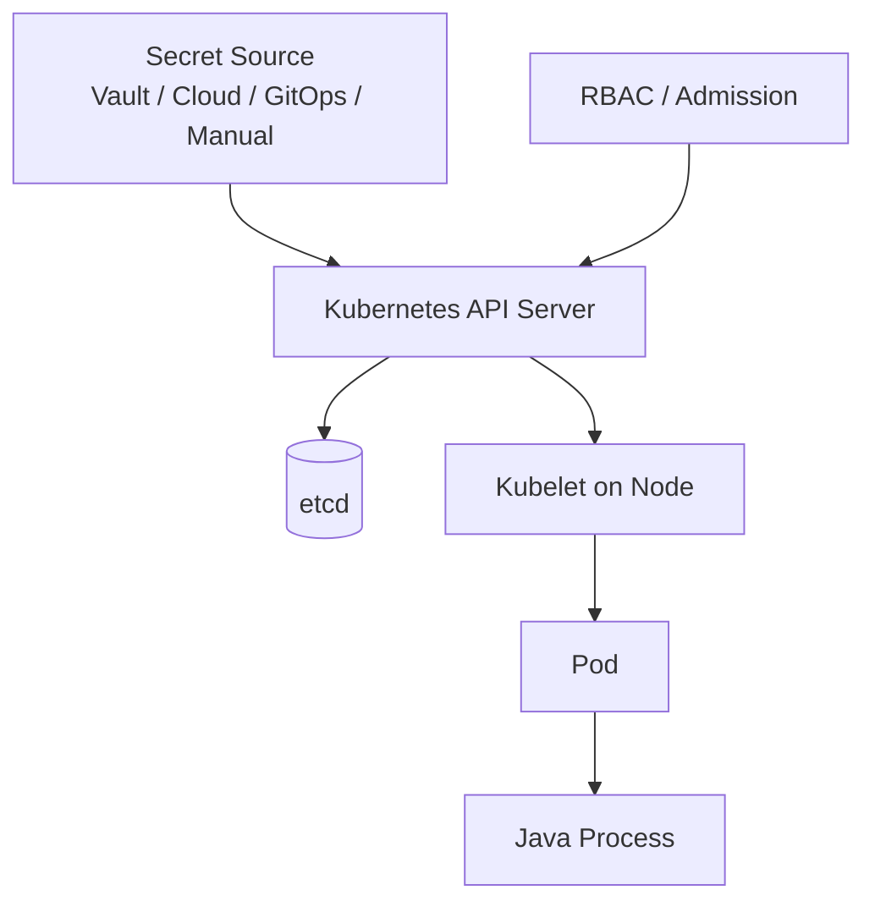
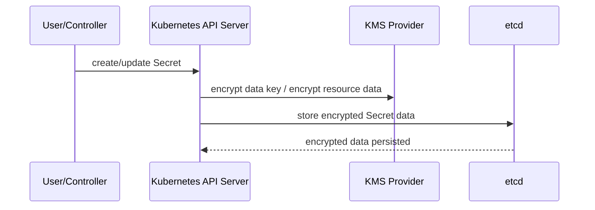
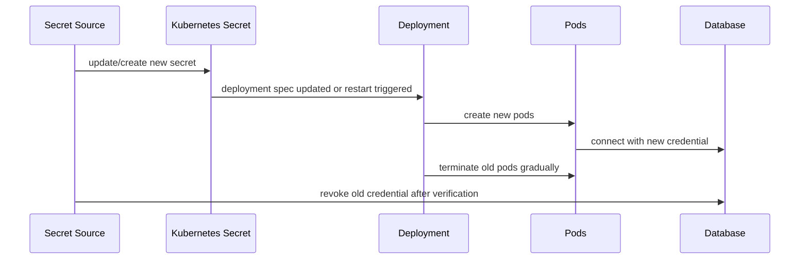

# Part 046 — Kubernetes Secrets Realities

> Kubernetes Secret is a delivery primitive, not a complete secret management program.

Kubernetes Secret sering disalahpahami. Banyak tim menganggap Secret otomatis aman karena namanya “Secret”. Ini berbahaya.

Kubernetes Secret memang lebih tepat daripada menyimpan credential di ConfigMap atau image. Tetapi Secret tetap punya batas:

- nilainya di-encode base64, bukan otomatis terenkripsi end-to-end;
- akses dikontrol oleh Kubernetes API/RBAC dan node runtime;
- Pod yang bisa membaca Secret bisa membacanya sebagai plain value;
- env var secret tidak auto-reload;
- mounted Secret volume punya update semantics sendiri;
- `subPath` bisa membuat update tidak terlihat;
- Secret di etcd perlu encryption at rest agar tidak tersimpan plaintext;
- akses `list/watch` Secrets sangat sensitif;
- Secret bukan pengganti Vault/cloud secret manager untuk semua kasus.

Part ini membedah Kubernetes Secret secara realistis agar Java microservice tidak salah mengandalkannya.

---

## 1. What Kubernetes Secret Actually Is

Kubernetes Secret adalah object API untuk menyimpan data sensitif dalam bentuk key-value.

Contoh:

```yaml
apiVersion: v1
kind: Secret
metadata:
  name: evidence-service-db
  namespace: prod-regulatory
type: Opaque
stringData:
  username: evidence_app
  password: change-me-via-secret-manager
```

Saat disimpan, field `stringData` akan dikonversi menjadi `data` yang base64-encoded.

Contoh manifest setelah encoded:

```yaml
apiVersion: v1
kind: Secret
metadata:
  name: evidence-service-db
type: Opaque
data:
  username: ZXZpZGVuY2VfYXBw
  password: Y2hhbmdlLW1lLXZpYS1zZWNyZXQtbWFuYWdlcg==
```

Base64 membuat data aman untuk transport text/YAML, bukan aman dari attacker.

```txt
base64 decode != decrypt
```

---

## 2. Kubernetes Secret Security Boundary

Secret boundary di Kubernetes terdiri dari beberapa lapisan:



Setiap boundary punya risiko:

| Boundary | Risk |
|---|---|
| Source to API server | Secret masuk dari pipeline yang salah |
| API server to etcd | Secret tersimpan tanpa encryption at rest |
| RBAC | User/service account terlalu luas |
| API server to kubelet | Node compromise exposes mounted secrets |
| Pod boundary | Container dalam Pod bisa membaca mounted/env secret |
| Java process | Secret bocor via log, heap dump, actuator, exception |

Kubernetes Secret hanya salah satu bagian chain. Java service tetap harus menjaga consumption plane.

---

## 3. Base64 Is Not Encryption

Contoh:

```bash
printf 'prod-password' | base64
# cHJvZC1wYXNzd29yZA==

printf 'cHJvZC1wYXNzd29yZA==' | base64 --decode
# prod-password
```

Siapa pun yang bisa membaca Secret object bisa decode value.

Implikasi:

```txt
RBAC read access to Secret equals access to the secret value.
```

Jangan memberi permission ini secara longgar:

```yaml
verbs: ["get", "list", "watch"]
resources: ["secrets"]
```

`list` dan `watch` bisa lebih berbahaya daripada `get` untuk satu Secret karena memberi visibility ke banyak Secret.

---

## 4. Encryption at Rest

Tanpa encryption at rest, Secret bisa tersimpan plaintext di etcd setelah base64 decode oleh API layer. Kubernetes menyediakan mekanisme encryption at rest untuk resource API seperti Secret.

High-level model:



Important distinction:

```txt
Encryption at rest protects stored API data in etcd.
It does not protect the secret once mounted into a Pod or exposed as env var.
```

Checklist cluster-level:

- encryption at rest enabled for `secrets`;
- strong provider/KMS configured;
- encryption config protected;
- key rotation process exists;
- old Secret objects re-encrypted if needed;
- etcd backup encrypted and access-controlled;
- API server audit logs configured carefully.

---

## 5. RBAC Least Privilege

Secret RBAC harus sempit.

Buruk:

```yaml
kind: ClusterRole
rules:
  - apiGroups: [""]
    resources: ["secrets"]
    verbs: ["get", "list", "watch"]
```

Lebih baik, akses spesifik namespace dan Secret name jika memungkinkan:

```yaml
apiVersion: rbac.authorization.k8s.io/v1
kind: Role
metadata:
  name: evidence-service-secret-reader
  namespace: prod-regulatory
rules:
  - apiGroups: [""]
    resources: ["secrets"]
    resourceNames:
      - evidence-service-db
    verbs:
      - get
```

Bind hanya ke ServiceAccount workload yang butuh:

```yaml
apiVersion: rbac.authorization.k8s.io/v1
kind: RoleBinding
metadata:
  name: evidence-service-secret-reader
  namespace: prod-regulatory
subjects:
  - kind: ServiceAccount
    name: evidence-service
    namespace: prod-regulatory
roleRef:
  kind: Role
  name: evidence-service-secret-reader
  apiGroup: rbac.authorization.k8s.io
```

Jika Secret dimount langsung ke Pod via spec, kubelet dapat mengambil Secret untuk Pod tersebut. App tidak selalu butuh permission API `get secrets`. Jangan memberi RBAC read Secret ke app hanya karena Pod menggunakan Secret sebagai volume.

---

## 6. Secret as Environment Variable

Contoh:

```yaml
apiVersion: apps/v1
kind: Deployment
metadata:
  name: evidence-service
spec:
  template:
    spec:
      containers:
        - name: app
          image: registry.example/evidence-service:1.0.0
          env:
            - name: DB_USERNAME
              valueFrom:
                secretKeyRef:
                  name: evidence-service-db
                  key: username
            - name: DB_PASSWORD
              valueFrom:
                secretKeyRef:
                  name: evidence-service-db
                  key: password
```

Kelebihan:

- mudah;
- cocok untuk banyak library;
- Spring Boot mudah membaca env var;
- startup-bound behavior jelas.

Kekurangan:

- tidak auto-update di process berjalan;
- env var bisa muncul di diagnostic/debug context;
- process-level exposure lebih luas;
- restart diperlukan untuk secret baru;
- tidak ideal untuk cert/key material yang perlu file path.

Spring Boot mapping:

```yaml
spring:
  datasource:
    username: ${DB_USERNAME}
    password: ${DB_PASSWORD}
```

Atau env var relaxed binding:

```txt
SPRING_DATASOURCE_USERNAME
SPRING_DATASOURCE_PASSWORD
```

Rule:

```txt
Use env var secrets only when startup-time binding is acceptable
and rotation can be handled by rolling restart or explicit redeploy.
```

---

## 7. Secret as Mounted Volume

Contoh:

```yaml
apiVersion: apps/v1
kind: Deployment
metadata:
  name: evidence-service
spec:
  template:
    spec:
      containers:
        - name: app
          image: registry.example/evidence-service:1.0.0
          volumeMounts:
            - name: db-secret
              mountPath: /var/run/secrets/evidence-db
              readOnly: true
      volumes:
        - name: db-secret
          secret:
            secretName: evidence-service-db
            defaultMode: 0440
```

File di container:

```txt
/var/run/secrets/evidence-db/username
/var/run/secrets/evidence-db/password
```

Java reader:

```java
public final class MountedSecretReader {
    private final Path directory;

    public MountedSecretReader(Path directory) {
        this.directory = directory;
    }

    public SecretValue read(String key) throws IOException {
        Path file = directory.resolve(key).normalize();
        if (!file.startsWith(directory)) {
            throw new SecurityException("Invalid secret key path");
        }
        String value = Files.readString(file).trim();
        return SecretValue.of(value);
    }
}
```

Kelebihan mounted file:

- cocok untuk TLS cert/key;
- bisa dibaca ulang jika projection berubah;
- file permission bisa diatur;
- tidak masuk environment process;
- cocok dengan config tree import.

Kekurangan:

- app harus bisa reload/read ulang;
- update propagation tidak instan;
- `subPath` caveat;
- secret tetap plaintext dalam filesystem container;
- file watcher harus hati-hati terhadap symlink/atomic update behavior.

---

## 8. Secret Volume Update Semantics

Kubernetes dapat memperbarui Secret volume projection saat Secret object berubah, tetapi tidak secara instan. Kubelet melakukan periodic sync/cache update.

Important caveat:

```txt
A container using a Secret as a subPath volume mount does not receive Secret updates.
```

Jangan pakai `subPath` jika ingin secret update terlihat.

Buruk untuk reloadable secret:

```yaml
volumeMounts:
  - name: db-secret
    mountPath: /etc/secrets/password
    subPath: password
```

Lebih baik mount directory:

```yaml
volumeMounts:
  - name: db-secret
    mountPath: /etc/secrets/db
    readOnly: true
```

Lalu app membaca `/etc/secrets/db/password`.

---

## 9. Java Reload from Mounted Secret

Jika secret mounted file bisa berubah, Java app perlu reload strategy.

Simplified approach:

```java
public final class ReloadableMountedSecretProvider {
    private final Path secretFile;
    private volatile SecretSnapshot current;

    public ReloadableMountedSecretProvider(Path secretFile) throws IOException {
        this.secretFile = secretFile;
        this.current = load();
    }

    public SecretSnapshot current() {
        return current;
    }

    public void refresh() throws IOException {
        SecretSnapshot next = load();
        if (!next.value().equals(current.value())) {
            this.current = next;
        }
    }

    private SecretSnapshot load() throws IOException {
        String value = Files.readString(secretFile).trim();
        FileTime modified = Files.getLastModifiedTime(secretFile);
        return new SecretSnapshot(
            secretFile.getFileName().toString(),
            SecretValue.of(value),
            modified.toString(),
            Instant.now(),
            null
        );
    }
}
```

But do not stop here. Reloading a secret value does not automatically reload dependent clients.

If the secret is DB password:

- create new `DataSource`? risky;
- refresh Hikari config? limited;
- allow rolling restart? simpler;
- use dual credential + max connection lifetime? safer;
- use Vault dynamic DB secrets + framework lifecycle? more advanced.

For many production Java services, the safest Kubernetes Secret rotation model is:

```txt
Update Secret -> trigger Deployment rollout -> new Pods start with new secret -> old Pods drain -> old secret revoked later.
```

Runtime reload is useful, but it must be designed end-to-end.

---

## 10. Immutable Secrets

Kubernetes supports immutable Secrets. Immutable Secret cannot be changed after creation.

Why useful:

- prevents accidental mutation;
- can improve cluster performance by avoiding watches for immutable objects;
- forces versioned rollout model;
- makes provenance clearer.

Pattern:

```yaml
apiVersion: v1
kind: Secret
metadata:
  name: evidence-service-db-v42
type: Opaque
immutable: true
stringData:
  username: evidence_app
  password: generated-value
```

Deployment references specific version:

```yaml
env:
  - name: DB_PASSWORD
    valueFrom:
      secretKeyRef:
        name: evidence-service-db-v42
        key: password
```

Rotation flow:

```txt
1. Create evidence-service-db-v43
2. Update Deployment to reference v43
3. Rollout new Pods
4. Verify new credential use
5. Revoke old credential upstream
6. Delete old Secret after safe window
```

Trade-off:

- more explicit and auditable;
- but creates more objects;
- requires cleanup policy;
- needs deployment automation.

---

## 11. Secret Rotation Patterns in Kubernetes

### 11.1 Rolling Restart Pattern



Pros:

- simple mental model;
- good for startup-bound config;
- works with env var;
- easier to test.

Cons:

- restart required;
- rollout speed matters;
- old credential must stay valid during rollout;
- bad secret causes rollout failure.

### 11.2 Mounted File Reload Pattern

Pros:

- no pod restart if app supports reload;
- good for cert rotation;
- can reduce disruption.

Cons:

- app must reload safely;
- dependent client must update;
- propagation delay;
- hard to prove all workers switched.

### 11.3 External Secret Sync Pattern

External Secrets Operator or similar controller syncs from external manager to Kubernetes Secret.

Pros:

- central secret authority;
- Kubernetes-native consumption;
- GitOps-friendly reference object;
- supports multiple backends.

Cons:

- sync delay;
- still creates Kubernetes Secret;
- controller permissions are sensitive;
- app still handles consumption/restart/reload.

---

## 12. ServiceAccount Token Secrets

Modern Kubernetes encourages projected ServiceAccount tokens instead of long-lived token Secrets for Pods.

Old pattern risk:

- long-lived token Secret;
- broad audience;
- difficult revocation;
- accidental mount.

Better pattern:

- bound projected token;
- explicit audience;
- expiration;
- used for workload identity integration;
- minimize automount when not needed.

Example:

```yaml
apiVersion: v1
kind: Pod
metadata:
  name: evidence-service
spec:
  serviceAccountName: evidence-service
  automountServiceAccountToken: false
  containers:
    - name: app
      image: registry.example/evidence-service:1.0.0
```

If the app does not call Kubernetes API, disable automount.

If it needs token for Vault Kubernetes auth or cloud workload identity, mount only what is needed and scope audience/TTL.

---

## 13. Namespace Boundary Is Not Enough

A namespace is an administrative boundary, not a perfect security boundary.

If many workloads share a namespace:

- RBAC mistakes can expose many Secrets;
- compromised service may inspect mounted resources it can access;
- broad RoleBindings become dangerous;
- admission policies matter.

Use:

- separate ServiceAccount per workload;
- narrow RBAC;
- NetworkPolicy;
- Pod Security admission;
- admission validation for secret references;
- secret naming convention with owner/version;
- avoid default ServiceAccount;
- disable automount token unless needed.

---

## 14. Admission and Policy Guardrails

Use policy to prevent common mistakes.

Examples:

- deny Pods referencing Secret from wrong namespace pattern;
- deny env var secrets for high-value cert/key material;
- require `readOnly: true` for secret volume mounts;
- require `automountServiceAccountToken: false` unless labeled exception;
- deny wildcard Secret RBAC;
- require immutable/versioned Secret in prod;
- require external secret source annotation;
- deny plain Secret manifests in Git unless encrypted by approved mechanism.

Pseudo-policy intent:

```txt
In prod namespace:
- no Role may list/watch secrets unless approved controller
- no default ServiceAccount usage
- no mutable secret named without version suffix for high-risk workloads
- no secret volume writable mount
```

---

## 15. Java/Spring Boot Patterns

### 15.1 Env Var Binding

Deployment:

```yaml
env:
  - name: PAYMENT_API_KEY
    valueFrom:
      secretKeyRef:
        name: payment-api
        key: api-key
```

Spring:

```yaml
payment:
  api-key: ${PAYMENT_API_KEY}
```

Typed property with redaction:

```java
@ConfigurationProperties(prefix = "payment")
@Validated
public record PaymentProperties(
    @NotBlank String baseUrl,
    @NotBlank String apiKey
) {
    public SecretValue apiKeySecret() {
        return SecretValue.of(apiKey);
    }

    @Override
    public String toString() {
        return "PaymentProperties[baseUrl=" + baseUrl + ", apiKey=[REDACTED]]";
    }
}
```

### 15.2 Config Tree Binding from Mounted Secret

Mount Secret as files:

```yaml
volumeMounts:
  - name: payment-secret
    mountPath: /etc/secrets/payment
    readOnly: true
```

Spring Boot config import:

```yaml
spring:
  config:
    import: optional:configtree:/etc/secrets/payment/
```

If files are named:

```txt
/etc/secrets/payment/api-key
/etc/secrets/payment/webhook-secret
```

Then properties can be available as keys depending on config tree mapping. Keep naming consistent and test actual effective property names.

### 15.3 Avoid Actuator Exposure

Production actuator config:

```yaml
management:
  endpoints:
    web:
      exposure:
        include: health,info,prometheus
  endpoint:
    env:
      access: none
    configprops:
      access: none
```

If env/configprops endpoint is enabled for internal debug, protect heavily and sanitize.

---

## 16. Kubernetes Secret + Java Failure Modes

| Failure | Symptom | Prevention/Recovery |
|---|---|---|
| Secret missing | Pod stuck or app fails startup | Required secret validation, deployment check |
| Wrong key name | env var missing / file missing | CI manifest validation, startup fail-fast |
| Bad value | authentication failure | canary rollout, health check credential path |
| Env secret updated | running app still old value | rollout restart or versioned Secret |
| Mounted secret updated | app does not reload | watcher/refresh strategy or rollout |
| `subPath` mount | no updates visible | mount directory instead |
| RBAC too broad | unrelated user/service reads secrets | least privilege and audit |
| Secret in logs | data breach | redaction and log tests |
| etcd backup exposed | secret disclosure | encryption, backup protection |
| old secret not revoked | credential reuse | rotation runbook and audit |

---

## 17. Operational Runbook: Rotating a Kubernetes Secret

### Pre-check

- identify secret owner;
- identify consuming Deployments/CronJobs;
- identify whether env var or volume mount;
- confirm upstream supports dual credential;
- confirm rollback path;
- confirm metrics and logs are redacted.

### Rotation

```txt
1. Create new upstream credential.
2. Create new Kubernetes Secret version or update existing Secret.
3. Trigger canary rollout for one replica or small percentage.
4. Verify readiness and real operation using new credential.
5. Roll out remaining replicas.
6. Observe error rate, auth failures, old credential usage.
7. Revoke old upstream credential after overlap.
8. Delete old Kubernetes Secret after retention window.
9. Record audit event/change record.
```

### Rollback

```txt
If new credential fails:
- stop rollout;
- revert Deployment to old Secret version;
- keep old credential active;
- investigate new secret payload/source/policy;
- do not revoke old credential until recovery complete.
```

---

## 18. Production Checklist

### Cluster

- Secret encryption at rest enabled.
- etcd backups encrypted and restricted.
- API server audit logs configured.
- RBAC reviewed for `get/list/watch secrets`.
- Admission policies block dangerous patterns.
- Default ServiceAccount not used for app workloads.

### Namespace

- One ServiceAccount per workload.
- No broad Secret reader RoleBinding.
- NetworkPolicy applied where relevant.
- Secret naming includes owner/purpose/version.
- Controller permissions isolated.

### Workload

- Secret volume mounted read-only.
- Env var secret only when restart rotation is acceptable.
- `subPath` not used for reloadable Secret.
- `automountServiceAccountToken: false` unless needed.
- Readiness checks validate required credential path.
- Logs/metrics/traces redact secret values.
- Actuator env/configprops not exposed.

### Java App

- Startup fails if required secret missing.
- Secret wrapper redacts `toString()`.
- Secret lifecycle documented.
- Rotation model tested.
- Connection pool behavior understood.
- Secret reload does not mutate unsafe state silently.
- Expiry/refresh metrics exist where applicable.

---

## 19. Key Takeaways

Kubernetes Secret adalah primitive yang berguna, tetapi bukan jawaban lengkap untuk secret management.

Yang penting:

1. Base64 bukan encryption.
2. RBAC read access to Secret berarti akses ke value.
3. Encryption at rest melindungi etcd, bukan value setelah dimount ke Pod.
4. Env var secret sederhana tetapi tidak reloadable.
5. Mounted Secret volume lebih cocok untuk file/cert, tetapi reload tetap perlu didesain.
6. `subPath` tidak cocok untuk Secret yang perlu update.
7. Immutable/versioned Secret membuat rotation lebih eksplisit dan auditable.
8. ServiceAccount token harus scoped; disable automount jika tidak perlu.
9. Java service tetap harus menjaga redaction, validation, reload, connection refresh, dan observability.
10. Production secret rotation harus menjadi operasi normal yang diuji, bukan ritual darurat.

Part berikutnya akan membahas pola injection: env var, mounted file, sidecar, API fetch, CSI driver, dan kapan memilih masing-masing.

---

## References

- Kubernetes Secrets: https://kubernetes.io/docs/concepts/configuration/secret/
- Kubernetes Good practices for Secrets: https://kubernetes.io/docs/concepts/security/secrets-good-practices/
- Kubernetes Encrypting Confidential Data at Rest: https://kubernetes.io/docs/tasks/administer-cluster/encrypt-data/
- Kubernetes Managing Secrets using configuration file: https://kubernetes.io/docs/tasks/configmap-secret/managing-secret-using-config-file/
- Kubernetes Distribute credentials securely using Secrets: https://kubernetes.io/docs/tasks/inject-data-application/distribute-credentials-secure/
- Spring Boot Externalized Configuration: https://docs.spring.io/spring-boot/reference/features/external-config.html
