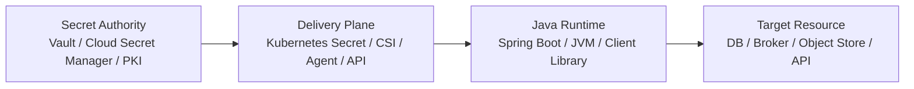
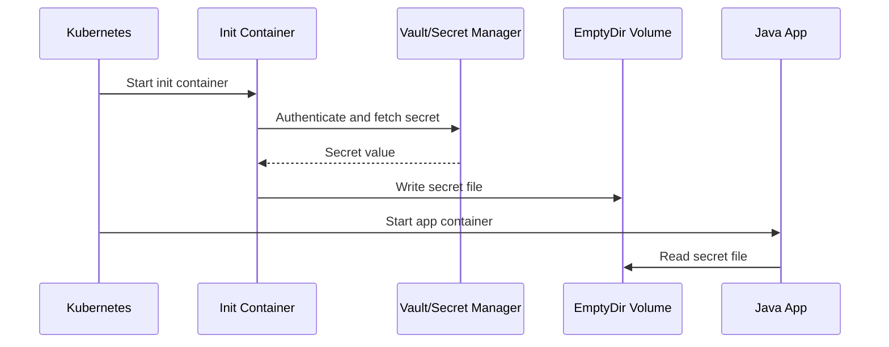
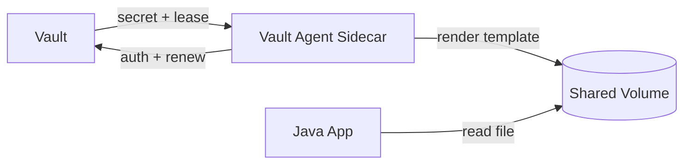
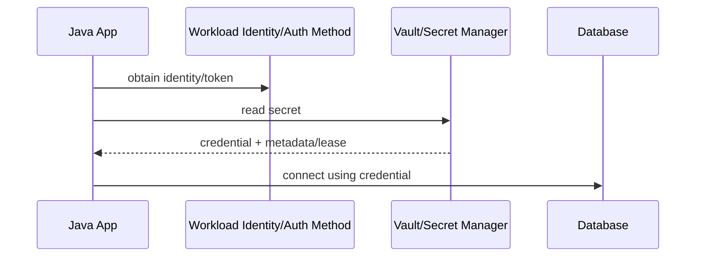
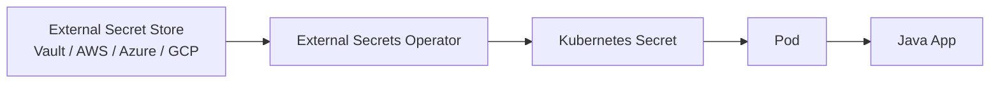
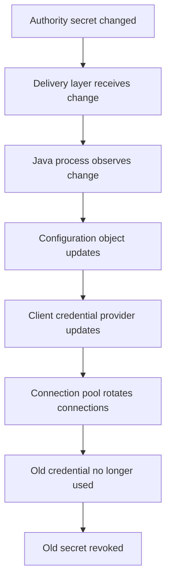

# Part 047 — Secret Injection Patterns

> Secret injection is not a syntax choice.
>
> It is a runtime trust-boundary decision.

Setelah memahami realita Kubernetes Secret, kita perlu menjawab pertanyaan yang lebih praktis:

```txt
Bagaimana secret sampai ke Java process?
```

Jawaban populer biasanya terlalu cepat:

```txt
Pakai environment variable saja.
Mount sebagai file saja.
Ambil dari Vault saja.
```

Jawaban seperti itu tidak cukup untuk production. Cara secret diinjeksi menentukan:

- kapan secret tersedia;
- siapa yang bisa membacanya;
- apakah secret bisa dirotasi tanpa restart;
- apakah secret berisiko bocor ke process list, logs, crash dump, atau actuator;
- apakah service bisa survive secret manager outage;
- apakah startup fail fast atau degrade;
- apakah audit trail ada;
- apakah secret punya TTL/lease yang dihormati;
- apakah runtime bisa membedakan secret lama dan baru;
- apakah deployment GitOps tetap bersih dari plaintext secret.

Di part ini kita akan membahas pattern injeksi secret yang paling sering dipakai dalam Java microservices:

1. Environment variable injection.
2. Mounted Secret volume.
3. Config tree / file-based binding.
4. Init container materialization.
5. Sidecar/agent template rendering.
6. Runtime API fetch.
7. External Secrets Operator / controller sync.
8. CSI Secret Store driver.
9. Service mesh / workload identity based secretless access.
10. Hybrid pattern.

Tujuannya bukan memilih satu pattern yang selalu benar. Tujuannya adalah membangun **decision framework**.

---

## 1. Secret Delivery Plane

Sebelum bicara pattern, pisahkan empat plane berikut.



| Plane | Contoh | Pertanyaan Utama |
|---|---|---|
| Authority | Vault, AWS Secrets Manager, Azure Key Vault, GCP Secret Manager, PKI | Siapa menerbitkan secret? |
| Delivery | Kubernetes Secret, mounted file, sidecar, CSI, API call | Bagaimana secret sampai ke workload? |
| Consumption | Java config binding, HikariCP, HTTP client, SDK credential provider | Bagaimana secret dipakai? |
| Target | Database, broker, API, object store | Secret memberi capability apa? |

Kesalahan umum adalah menganggap delivery plane sebagai authority.

Contoh:

```txt
Kubernetes Secret bukan selalu source of truth.
Ia sering hanya cache/delivery object dari Vault atau cloud secret manager.
```

Jika authority ada di Vault tetapi aplikasi membaca Kubernetes Secret, maka rotation semantics tergantung pada dua hal:

1. bagaimana Vault secret berubah;
2. bagaimana perubahan itu disinkronkan ke Kubernetes Secret;
3. bagaimana Pod menerima update;
4. bagaimana Java process reload/reconnect.

---

## 2. Decision Dimensions

Setiap injection pattern harus dievaluasi dengan dimensi berikut.

| Dimension | Pertanyaan |
|---|---|
| Startup availability | Apakah secret harus tersedia sebelum app start? |
| Runtime refresh | Apakah secret bisa berubah tanpa restart? |
| TTL/lease awareness | Apakah secret punya expiry yang harus dihormati? |
| Blast radius | Jika bocor, capability-nya sebesar apa? |
| Exposure surface | Secret terlihat di env, file, memory, logs, API, process metadata? |
| Operational coupling | Apakah app tergantung langsung ke secret manager saat startup/runtime? |
| Auditability | Apakah secret access dicatat di authority? |
| Language coupling | Apakah app perlu library khusus? |
| Kubernetes coupling | Apakah pattern hanya cocok di Kubernetes? |
| GitOps compatibility | Apakah plaintext secret bisa dihindari dari Git? |
| Failure mode | Fail closed, stale credential, crash loop, degraded mode? |

Jangan pilih pattern sebelum menjawab ini.

---

## 3. Pattern 1 — Environment Variable Injection

Pattern paling umum:

```yaml
apiVersion: apps/v1
kind: Deployment
metadata:
  name: evidence-service
spec:
  template:
    spec:
      containers:
        - name: app
          image: registry.example.com/evidence-service:1.0.0
          env:
            - name: DB_USERNAME
              valueFrom:
                secretKeyRef:
                  name: evidence-db-secret
                  key: username
            - name: DB_PASSWORD
              valueFrom:
                secretKeyRef:
                  name: evidence-db-secret
                  key: password
```

Java consumption:

```yaml
spring:
  datasource:
    username: ${DB_USERNAME}
    password: ${DB_PASSWORD}
```

### 3.1 Strengths

Environment variable injection kuat karena sederhana:

- mudah dipahami;
- bekerja dengan Spring Boot externalized configuration;
- cocok untuk static secret yang jarang berubah;
- tidak perlu application code khusus;
- mudah digunakan oleh legacy library;
- fail fast saat secret missing jika config validation benar.

Spring Boot memang mendukung environment variable sebagai salah satu source externalized configuration.

### 3.2 Weaknesses

Kelemahan utama:

```txt
Environment variable is a startup-time snapshot.
```

Jika Secret Kubernetes berubah, environment variable di process yang sudah berjalan tidak berubah.

Risiko lain:

- secret bisa muncul di diagnostic dump;
- secret bisa terlihat oleh process introspection tertentu;
- secret mudah ikut tercetak saat developer dump environment;
- rotation biasanya butuh restart/rollout;
- tidak cocok untuk short-lived dynamic secret;
- sulit membedakan secret version di runtime.

### 3.3 Good Use Cases

Cocok untuk:

- static-ish secret dengan rotation terjadwal melalui rollout;
- secret bootstrap low-frequency;
- non-lease secret;
- credential yang target client-nya tidak mendukung reload;
- deployment kecil dengan operational maturity terbatas.

Tidak cocok untuk:

- Vault dynamic database credentials dengan TTL pendek;
- certificate/key yang harus rotate tanpa downtime;
- high-security workloads yang ingin minimize env exposure;
- multi-tenant secret yang berubah per request.

### 3.4 Production Guardrails

Gunakan guardrail berikut:

```java
@ConfigurationProperties(prefix = "app.database")
@Validated
public record DatabaseSecretProperties(
    @NotBlank String username,
    @NotBlank String password
) {}
```

Mapping environment:

```yaml
app:
  database:
    username: ${DB_USERNAME}
    password: ${DB_PASSWORD}
```

Tambahkan startup check:

```java
@Component
final class SecretStartupCheck implements ApplicationRunner {
    private final DatabaseSecretProperties properties;

    SecretStartupCheck(DatabaseSecretProperties properties) {
        this.properties = properties;
    }

    @Override
    public void run(ApplicationArguments args) {
        if (properties.password().length() < 16) {
            throw new IllegalStateException("Database password appears invalid");
        }
    }
}
```

Jangan log:

```java
log.info("Database config: username={}, password={}", username, password); // never
```

Lebih aman:

```java
log.info("Database config loaded: usernamePresent={}, passwordPresent={}",
    username != null && !username.isBlank(),
    password != null && !password.isBlank());
```

---

## 4. Pattern 2 — Mounted Secret Volume

Kubernetes Secret bisa diproyeksikan sebagai file.

```yaml
apiVersion: apps/v1
kind: Deployment
metadata:
  name: evidence-service
spec:
  template:
    spec:
      containers:
        - name: app
          image: registry.example.com/evidence-service:1.0.0
          volumeMounts:
            - name: db-secret
              mountPath: /etc/secrets/db
              readOnly: true
      volumes:
        - name: db-secret
          secret:
            secretName: evidence-db-secret
```

File di container:

```txt
/etc/secrets/db/username
/etc/secrets/db/password
```

### 4.1 Java Read Pattern

```java
public final class FileSecretReader {
    public String readSecret(Path path) {
        try {
            return Files.readString(path, StandardCharsets.UTF_8).trim();
        } catch (IOException e) {
            throw new IllegalStateException("Failed to read secret file: " + path, e);
        }
    }
}
```

Untuk secret besar/cert/key:

```java
public byte[] readSecretBytes(Path path) {
    try {
        return Files.readAllBytes(path);
    } catch (IOException e) {
        throw new IllegalStateException("Failed to read secret file: " + path, e);
    }
}
```

### 4.2 Strengths

Mounted file pattern lebih baik dari env untuk beberapa kasus:

- secret tidak masuk environment variable;
- cocok untuk TLS cert, private key, truststore;
- bisa dibaca ulang dari file;
- Kubernetes dapat memperbarui mounted Secret volume secara eventually consistent;
- lebih natural untuk library yang menerima file path.

### 4.3 Weaknesses

Kelemahannya:

- update tidak instan;
- `subPath` mount tidak menerima automated Secret update;
- Java code harus tahu kapan file berubah;
- library mungkin hanya baca file saat startup;
- file permission perlu diperhatikan;
- mounted Secret tetap tersedia untuk process dalam container;
- restart tetap sering lebih sederhana untuk banyak client.

### 4.4 File Watcher Pattern

Java bisa menonton directory dengan `WatchService`, tetapi jangan overestimate reliabilitas watcher lintas filesystem/projection.

Pattern lebih aman:

```txt
periodic poll + content hash + atomic swap in application state
```

Contoh:

```java
public final class PollingSecretFileProvider {
    private final Path path;
    private volatile SecretSnapshot current;

    public PollingSecretFileProvider(Path path) {
        this.path = path;
        this.current = readSnapshot();
    }

    public SecretSnapshot current() {
        return current;
    }

    @Scheduled(fixedDelayString = "${secrets.file.poll-interval:30s}")
    public void refresh() {
        SecretSnapshot next = readSnapshot();
        if (!next.hash().equals(current.hash())) {
            current = next;
        }
    }

    private SecretSnapshot readSnapshot() {
        try {
            String value = Files.readString(path, StandardCharsets.UTF_8).trim();
            String hash = sha256(value);
            return new SecretSnapshot(value, hash, Instant.now());
        } catch (IOException e) {
            throw new IllegalStateException("Failed to read secret file", e);
        }
    }

    private static String sha256(String value) {
        try {
            MessageDigest digest = MessageDigest.getInstance("SHA-256");
            return HexFormat.of().formatHex(digest.digest(value.getBytes(StandardCharsets.UTF_8)));
        } catch (NoSuchAlgorithmException e) {
            throw new IllegalStateException(e);
        }
    }
}

public record SecretSnapshot(String value, String hash, Instant loadedAt) {}
```

Tetapi ingat: membaca secret baru tidak otomatis membuat semua downstream client memakai secret baru. HikariCP, Kafka client, HTTP client, SDK credential provider, TLS context, dan connection pool punya lifecycle sendiri.

---

## 5. Pattern 3 — Spring Boot Config Tree

Spring Boot mendukung import directory tree sebagai configuration source dengan `configtree:`. Pattern ini cocok untuk mounted Kubernetes Secret/ConfigMap sebagai file.

```yaml
spring:
  config:
    import: optional:configtree:/etc/secrets/db/
```

Jika directory berisi:

```txt
/etc/secrets/db/username
/etc/secrets/db/password
```

Maka property bisa dibaca sebagai:

```yaml
app:
  database:
    username: ${username}
    password: ${password}
```

Atau gunakan prefix directory structure yang lebih eksplisit.

### 5.1 Strengths

- cocok dengan Kubernetes mounted Secret;
- lebih bersih daripada manual `Files.readString`;
- bisa dipakai dengan `@ConfigurationProperties`;
- startup validation tetap bekerja;
- tidak perlu env var untuk secret.

### 5.2 Weaknesses

- tetap mostly startup-bound;
- dynamic reload tidak otomatis menyelesaikan client reconnect;
- property name bisa bentrok jika directory tidak diatur;
- secret masih masuk Spring Environment, sehingga perlu hati-hati dengan actuator/env exposure.

### 5.3 Recommended Structure

Gunakan directory dengan namespace jelas:

```txt
/etc/app-secrets/
  datasource/
    username
    password
  kafka/
    sasl-username
    sasl-password
  tls/
    client.crt
    client.key
```

Config:

```yaml
spring:
  config:
    import:
      - optional:configtree:/etc/app-secrets/datasource/
      - optional:configtree:/etc/app-secrets/kafka/
```

Untuk production, jangan expose `/actuator/env` bebas. Jika actuator dipakai, sanitization dan authorization wajib.

---

## 6. Pattern 4 — Init Container Materialization

Init container mengambil secret dari authority lalu menulis ke shared volume sebelum app container start.



### 6.1 Example Shape

```yaml
apiVersion: apps/v1
kind: Deployment
metadata:
  name: evidence-service
spec:
  template:
    spec:
      volumes:
        - name: rendered-secrets
          emptyDir:
            medium: Memory
      initContainers:
        - name: fetch-secrets
          image: secret-fetcher:1.0.0
          volumeMounts:
            - name: rendered-secrets
              mountPath: /rendered-secrets
      containers:
        - name: app
          image: evidence-service:1.0.0
          volumeMounts:
            - name: rendered-secrets
              mountPath: /etc/secrets
              readOnly: true
```

### 6.2 Strengths

- app tidak butuh library Vault/cloud secret manager;
- secret tidak perlu disimpan sebagai Kubernetes Secret;
- startup fail-fast mudah;
- cocok untuk bootstrap material seperti truststore atau config template;
- secret bisa ditulis ke memory-backed `emptyDir`.

### 6.3 Weaknesses

- no runtime refresh unless pod restart;
- init container harus punya identity/permission ke secret authority;
- secret material ada di shared volume;
- jika secret expired setelah start, app tidak tahu;
- cocok untuk static secret, kurang cocok untuk dynamic lease pendek.

### 6.4 Use Case

Cocok untuk:

- certificate bundle saat startup;
- legacy app yang hanya bisa baca file;
- static credential dengan rollout-based rotation;
- rendering config file dari template.

Tidak cocok untuk:

- dynamic DB credential TTL 15 menit;
- per-request credential;
- high-frequency rotation.

---

## 7. Pattern 5 — Sidecar / Agent Rendering

Sidecar atau agent berjalan bersama app, mengambil secret dari authority, lalu merender file ke shared volume. Contoh umum: Vault Agent injector/template.



### 7.1 Strengths

- app tidak perlu langsung bicara ke Vault;
- agent bisa handle auth/renewal/template rendering;
- secret bisa diupdate sebagai file;
- identity/lease logic dipindahkan ke sidecar;
- cocok untuk polyglot environment.

### 7.2 Weaknesses

- Java app tetap perlu reload/reconnect;
- sidecar menambah resource dan operational surface;
- template rendering failure harus dimonitor;
- shared volume permission harus benar;
- dependency startup ordering harus jelas;
- jika agent crash, secret refresh bisa berhenti sementara app masih hidup.

### 7.3 Reload Coordination

Jangan berhenti di “agent menulis file baru”. Pertanyaan penting:

```txt
Siapa yang memberitahu Java process untuk membangun ulang client?
```

Opsi:

1. Java app polling file hash.
2. Sidecar mengirim HTTP reload hook ke localhost.
3. App restart saat secret berubah.
4. Library client mengambil credential dari provider yang membaca file setiap kali dibutuhkan.
5. Connection pool punya max lifetime sehingga credential lama hilang bertahap.

### 7.4 Safe File Swap

Agent sebaiknya menulis secret secara atomic:

```txt
write secret.tmp
fsync if required
rename secret.tmp -> secret
```

Reader Java sebaiknya membaca snapshot utuh, bukan file yang sedang ditulis.

---

## 8. Pattern 6 — Runtime API Fetch

Java app langsung mengambil secret dari authority menggunakan client library/API.



### 8.1 Strengths

- app bisa lease-aware;
- dynamic secret lebih natural;
- audit access tercatat langsung di authority;
- refresh bisa dikontrol oleh app;
- per-tenant/per-operation credential mungkin dilakukan;
- tidak perlu secret disimpan di Kubernetes Secret.

### 8.2 Weaknesses

- app code/library coupling ke secret provider;
- startup tergantung availability secret manager;
- runtime outage secret manager bisa berdampak ke app;
- retry/backoff harus hati-hati agar tidak DDoS secret manager;
- secret caching harus benar;
- developer harus memahami TTL/renew/revoke.

### 8.3 Java Abstraction

Jangan sebar client Vault/AWS/Azure/GCP di seluruh codebase.

Buat abstraction:

```java
public interface SecretProvider {
    SecretMaterial get(String logicalName);
}

public record SecretMaterial(
    String logicalName,
    Map<String, String> values,
    Instant loadedAt,
    Optional<Instant> expiresAt,
    Optional<String> version,
    Optional<String> leaseId
) {
    public String required(String key) {
        String value = values.get(key);
        if (value == null || value.isBlank()) {
            throw new IllegalStateException("Missing secret key: " + key);
        }
        return value;
    }
}
```

Business code tidak perlu tahu apakah secret berasal dari Vault, AWS Secrets Manager, mounted file, atau Kubernetes Secret.

### 8.4 Cache Policy

Runtime fetch tidak berarti fetch setiap request.

Gunakan cache berbasis TTL:

```java
public final class CachingSecretProvider implements SecretProvider {
    private final SecretProvider delegate;
    private final Duration maxCacheTtl;
    private final ConcurrentHashMap<String, SecretMaterial> cache = new ConcurrentHashMap<>();

    public CachingSecretProvider(SecretProvider delegate, Duration maxCacheTtl) {
        this.delegate = delegate;
        this.maxCacheTtl = maxCacheTtl;
    }

    @Override
    public SecretMaterial get(String logicalName) {
        SecretMaterial current = cache.get(logicalName);
        if (current != null && !shouldRefresh(current)) {
            return current;
        }
        SecretMaterial next = delegate.get(logicalName);
        cache.put(logicalName, next);
        return next;
    }

    private boolean shouldRefresh(SecretMaterial material) {
        Instant now = Instant.now();
        if (material.expiresAt().isPresent()) {
            Instant refreshBefore = material.expiresAt().get().minusSeconds(60);
            return now.isAfter(refreshBefore);
        }
        return material.loadedAt().plus(maxCacheTtl).isBefore(now);
    }
}
```

Production version harus menambahkan:

- jitter;
- single-flight refresh;
- metrics;
- fallback policy;
- circuit breaker;
- stale-if-error limit;
- explicit failure mode.

---

## 9. Pattern 7 — External Secrets Operator / Controller Sync

External Secrets Operator pattern:

```txt
External Secret Store -> Kubernetes Secret -> Pod env/volume -> Java app
```

Controller membaca secret dari provider eksternal dan menulis Kubernetes Secret.



### 9.1 Strengths

- app tidak perlu cloud/Vault SDK;
- secret source of truth tetap eksternal;
- GitOps bisa menyimpan ExternalSecret spec tanpa plaintext;
- Kubernetes-native consumption;
- multi-provider abstraction.

### 9.2 Weaknesses

- Kubernetes Secret tetap menjadi materialized copy;
- delay antara external secret update dan Pod consumption;
- rotation butuh chain lengkap: provider -> controller -> K8s Secret -> Pod -> Java reload/restart;
- controller failure bisa membuat secret stale;
- RBAC ke Kubernetes Secret tetap kritikal.

### 9.3 Production Questions

- Berapa refresh interval?
- Apa yang terjadi jika provider unavailable?
- Apakah controller menulis status condition?
- Apakah alert jika sync gagal?
- Apakah Kubernetes Secret immutable atau mutable?
- Apakah Pod restart otomatis saat Secret berubah?
- Apakah Java process membaca ulang?
- Apakah Secret version tercatat di app metrics?

---

## 10. Pattern 8 — CSI Secret Store Driver

CSI Secret Store driver memungkinkan secret dari provider eksternal dimount sebagai volume ke Pod.

Mental model:

```txt
External provider -> CSI driver -> mounted file in Pod
```

### 10.1 Strengths

- secret bisa tidak disimpan sebagai Kubernetes Secret, tergantung konfigurasi;
- cocok untuk cert/key/file secret;
- app consumption via file path;
- provider-specific identity integration.

### 10.2 Weaknesses

- app tetap perlu reload file;
- provider/driver lifecycle menjadi dependency;
- troubleshooting lebih kompleks;
- rotation semantics harus dipahami per provider/driver;
- tidak semua client library nyaman dengan changing file.

### 10.3 Best Fit

Cocok untuk:

- TLS certificate injection;
- cloud secret manager mounted as files;
- app yang bisa reload file;
- menghindari Kubernetes Secret materialization.

Kurang cocok untuk:

- app yang hanya bisa baca env var;
- high-frequency per-request secret;
- credential yang harus dipakai oleh connection pool tanpa reload mechanism.

---

## 11. Pattern 9 — Secretless / Workload Identity

Pattern terbaik kadang bukan mengirim secret ke app, tetapi menghapus kebutuhan secret statis.

Contoh:

- Kubernetes ServiceAccount + cloud workload identity untuk akses object storage;
- IAM role for service account;
- mTLS workload certificate issued automatically;
- database auth berbasis workload identity;
- service mesh identity untuk service-to-service auth.

Mental model:

```txt
Workload identity proves who the service is.
Target system grants capability based on identity.
No long-lived static password injected into app.
```

### 11.1 Strengths

- mengurangi static secret;
- rotation sering ditangani platform;
- audit berbasis identity lebih jelas;
- blast radius lebih kecil jika credential short-lived;
- cocok untuk cloud-native workloads.

### 11.2 Weaknesses

- platform coupling tinggi;
- setup IAM/RBAC lebih kompleks;
- local development perlu strategy;
- tidak semua target mendukung workload identity;
- debugging auth failure bisa lebih sulit.

### 11.3 Java Example: SDK Credential Provider

Untuk cloud SDK modern, gunakan default credential provider chain yang mengambil identity dari runtime environment, bukan hard-coded key.

Pseudo-pattern:

```java
S3Client client = S3Client.builder()
    .region(Region.of(region))
    .credentialsProvider(DefaultCredentialsProvider.create())
    .build();
```

Jangan inject access key/secret key jika workload identity tersedia.

---

## 12. Hybrid Pattern

Production sering memakai hybrid:

| Secret Type | Pattern |
|---|---|
| DB dynamic credential | Vault/Spring Cloud Vault runtime integration or agent + reload |
| TLS cert | CSI or sidecar file rendering |
| API token static | External Secrets Operator -> K8s Secret -> mounted file/env |
| Cloud object storage | workload identity, no static secret |
| Bootstrap trust bundle | init container or mounted ConfigMap/Secret |
| Feature flag SDK key | Kubernetes Secret env with rollout rotation |

Tidak ada kewajiban memakai satu pattern untuk semua secret.

Yang penting adalah konsistensi decision record:

```mdx
## Secret Injection ADR

### Secret
- Logical name:
- Authority:
- Consumer:
- Target resource:
- Sensitivity:

### Delivery Pattern
- Pattern:
- Why:
- Alternatives considered:

### Lifecycle
- Rotation frequency:
- TTL/lease:
- Reload strategy:
- Rollback strategy:

### Failure Mode
- Startup missing:
- Runtime refresh failure:
- Secret manager outage:
- Stale credential limit:

### Observability
- Metrics:
- Logs:
- Audit:
- Alert:
```

---

## 13. Injection Pattern Comparison

| Pattern | Runtime Refresh | App Coupling | Exposure | Best For | Main Risk |
|---|---:|---:|---:|---|---|
| Env var | No | Low | Medium | simple static secrets | restart required |
| Mounted Secret volume | Possible file update | Low/Medium | Medium | certs, file secrets | app may not reload |
| Config tree | Mostly startup | Low | Medium | Spring Boot file secrets | secret in Environment |
| Init container | No | Low | Low/Medium | bootstrap material | no refresh |
| Sidecar/agent | Yes-ish | Low/Medium | Low/Medium | Vault templates, certs | reload coordination |
| Runtime API fetch | Yes | High | Lower materialization | dynamic secrets | provider coupling |
| External Secrets Operator | Depends | Low | Medium | GitOps external source | stale sync chain |
| CSI driver | Depends | Low/Medium | Low/Medium | file/cert secret | driver complexity |
| Workload identity | Platform-managed | Medium | Low | cloud/service auth | platform coupling |

---

## 14. Secret Reload Is Not One Operation

Reload chain:



Jika salah satu stage tidak ada, rotation tanpa restart bisa gagal.

Contoh umum:

```txt
Secret file changed.
Spring property changed.
But HikariCP still uses old connections.
```

Atau:

```txt
Vault issued new DB credential.
App loaded it.
Old pool connections still alive.
Old credential revoked.
Requests fail.
```

Untuk database credentials, pertimbangkan:

- Hikari `maxLifetime` lebih pendek dari credential TTL;
- controlled pool restart;
- dual credential overlap;
- readiness fail jika refresh gagal mendekati expiry;
- canary rotation;
- metrics untuk active credential version.

---

## 15. Failure Mode Matrix

| Failure | Env | Volume | Sidecar | Runtime Fetch | ESO/CSI |
|---|---|---|---|---|---|
| Secret missing at startup | crash if validated | crash if file missing | init/agent fail | app fail | pod may fail/missing secret |
| Secret changes | no update | file may update | file/template update | direct refresh | sync/mount update |
| Secret manager down at startup | maybe unaffected if K8s Secret exists | maybe unaffected | affected | affected | controller/driver affected |
| Secret manager down at runtime | unaffected but stale | unaffected but stale | refresh stops | refresh fails | sync/rotation fails |
| Credential expires | app unaware | app unaware unless polling metadata | agent/app must coordinate | app can be lease-aware | depends on integration |
| Leak via env dump | higher | lower | lower | lower materialization | depends |

---

## 16. Recommended Defaults

Untuk production Java microservices, gunakan default berikut kecuali ada alasan kuat.

### 16.1 Prefer Workload Identity for Cloud Resources

Untuk object storage, queue, KMS, dan cloud API:

```txt
Use workload identity / IAM role instead of static access key.
```

### 16.2 Prefer Mounted File for Certificates

Untuk TLS cert/key/truststore:

```txt
Use mounted file, CSI, or agent-rendered files.
Do not squeeze cert material into env vars unless unavoidable.
```

### 16.3 Prefer Runtime/Agent for Dynamic Secrets

Untuk Vault dynamic DB credential:

```txt
Use Spring Cloud Vault lease-aware integration or Vault Agent + app reload strategy.
Do not treat short-lived dynamic secret like static env var.
```

### 16.4 Prefer External Secret Operator for GitOps Static Secrets

Untuk static API token yang authority-nya external secret manager:

```txt
Use ExternalSecret spec in Git.
Materialize Kubernetes Secret in cluster.
Consume via env/volume with rollout strategy.
```

### 16.5 Never Put Plaintext Secret in Git

Bahkan private repo bukan secret manager.

Jika GitOps butuh secret:

- SOPS;
- Sealed Secrets;
- External Secrets Operator;
- cloud KMS encryption;
- Vault-backed delivery.

---

## 17. Java Redaction Boundary

Apa pun injection pattern-nya, Java code harus redaction-aware.

```java
public record DatabaseCredential(
    String username,
    RedactedValue password,
    Optional<Instant> expiresAt,
    Optional<String> version
) {}

public final class RedactedValue {
    private final String value;

    private RedactedValue(String value) {
        if (value == null || value.isBlank()) {
            throw new IllegalArgumentException("Secret value is required");
        }
        this.value = value;
    }

    public static RedactedValue of(String value) {
        return new RedactedValue(value);
    }

    public String reveal() {
        return value;
    }

    @Override
    public String toString() {
        return "[REDACTED]";
    }
}
```

Structured logging filter:

```java
public final class SecretRedactor {
    private static final Pattern SENSITIVE_KEYS = Pattern.compile(
        "(?i)(password|secret|token|api[_-]?key|authorization|credential)"
    );

    public static Object redact(String key, Object value) {
        if (key != null && SENSITIVE_KEYS.matcher(key).find()) {
            return "[REDACTED]";
        }
        return value;
    }
}
```

---

## 18. Observability Requirements

Secret injection harus punya metrics.

Contoh:

```txt
secret_load_success_total{secret="db"}
secret_load_failure_total{secret="db", reason="missing_file"}
secret_last_loaded_timestamp_seconds{secret="db"}
secret_seconds_until_expiry{secret="db"}
secret_reload_success_total{secret="db"}
secret_reload_failure_total{secret="db"}
secret_stale_seconds{secret="db"}
secret_version_info{secret="db", version="v12"}
```

Jangan expose value. Expose metadata aman:

- loaded yes/no;
- expiry timestamp;
- version hash prefix non-reversible jika perlu;
- lease renewable yes/no;
- refresh result;
- error class.

Health check harus hati-hati.

Buruk:

```txt
/health returns DB_PASSWORD=...
```

Baik:

```json
{
  "status": "UP",
  "components": {
    "secrets": {
      "status": "UP",
      "details": {
        "dbCredentialLoaded": true,
        "dbCredentialExpiresInSeconds": 832,
        "lastRefreshStatus": "SUCCESS"
      }
    }
  }
}
```

---

## 19. Design Review Checklist

Gunakan checklist ini sebelum memilih injection pattern.

### Authority

- Siapa source of truth secret?
- Apakah secret static atau dynamic?
- Apakah secret punya TTL/lease?
- Apakah secret bisa direvoke?
- Apakah akses secret diaudit?

### Delivery

- Apakah melalui env, file, sidecar, CSI, API, atau controller sync?
- Apakah secret disimpan sebagai Kubernetes Secret?
- Apakah plaintext pernah masuk Git?
- Apakah update semantics dipahami?
- Apakah `subPath` dihindari untuk secret yang perlu update?

### Consumption

- Apakah Java app hanya baca saat startup?
- Apakah client library mendukung refresh?
- Apakah connection pool bisa rotate?
- Apakah reload atomic?
- Apakah stale secret punya batas waktu?

### Security

- Apakah secret bisa bocor via log/metrics/traces?
- Apakah actuator dibatasi?
- Apakah RBAC least privilege?
- Apakah file permission benar?
- Apakah heap dump policy aman?

### Operations

- Bagaimana rotation dilakukan?
- Bagaimana rollback?
- Apa alert jika refresh gagal?
- Apa runbook jika secret expired?
- Apa yang terjadi jika secret manager unavailable?

---

## 20. Key Takeaways

Secret injection adalah keputusan boundary, bukan sekadar YAML.

Prinsip utamanya:

1. **Delivery plane is not authority.**
2. **Environment variables are simple but startup-bound.**
3. **Mounted files reduce env exposure but require reload coordination.**
4. **Sidecars/agents can handle secret retrieval, but Java still owns consumption lifecycle.**
5. **Runtime API fetch is powerful for dynamic secrets but couples app to secret authority.**
6. **External operators are excellent for GitOps, but create materialized Kubernetes Secret copies.**
7. **Workload identity is often better than injecting static cloud credentials.**
8. **Secret rotation is a chain: authority, delivery, app observation, client refresh, old credential revocation.**
9. **No pattern is safe if secret leaks through logs, traces, actuator, or exception messages.**

Part berikutnya akan masuk lebih dalam ke **HashiCorp Vault for Java Services**: auth method, token, lease, dynamic secret, Spring Cloud Vault, connection pool refresh, dan failure modelling.

---

## References

- Kubernetes Secrets: https://kubernetes.io/docs/concepts/configuration/secret/
- Kubernetes Volumes: https://kubernetes.io/docs/concepts/storage/volumes/
- Kubernetes Secrets Good Practices: https://kubernetes.io/docs/concepts/security/secrets-good-practices/
- Spring Boot Externalized Configuration: https://docs.spring.io/spring-boot/reference/features/external-config.html
- Spring Boot Config Data and configtree: https://docs.spring.io/spring-boot/reference/features/external-config.html
- HashiCorp Vault Lease, Renew, and Revoke: https://developer.hashicorp.com/vault/docs/concepts/lease
- Spring Cloud Vault Reference: https://docs.spring.io/spring-cloud-vault/reference/index.html
