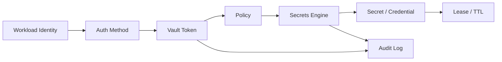
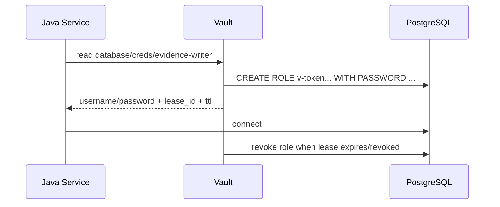
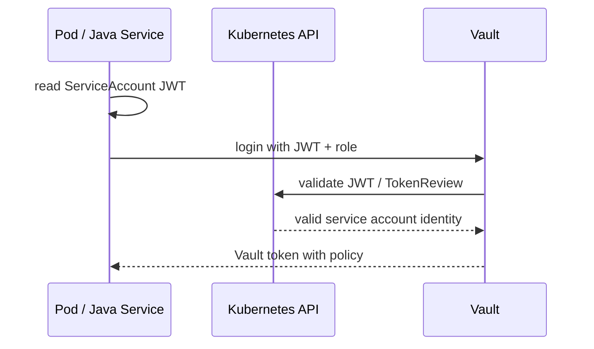
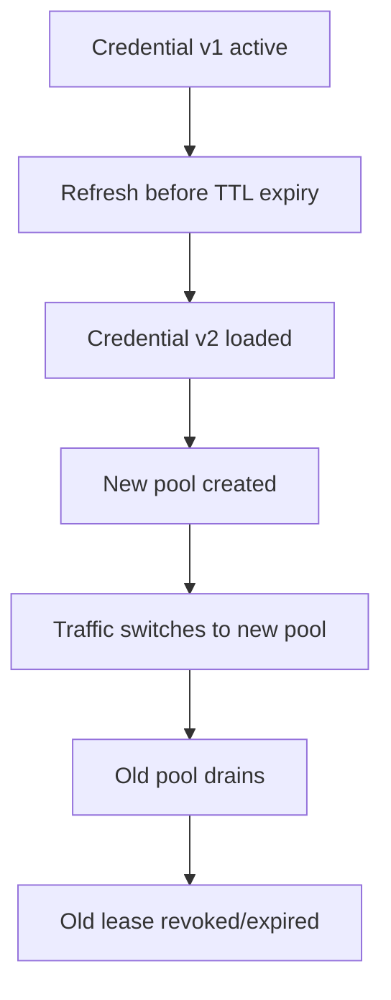
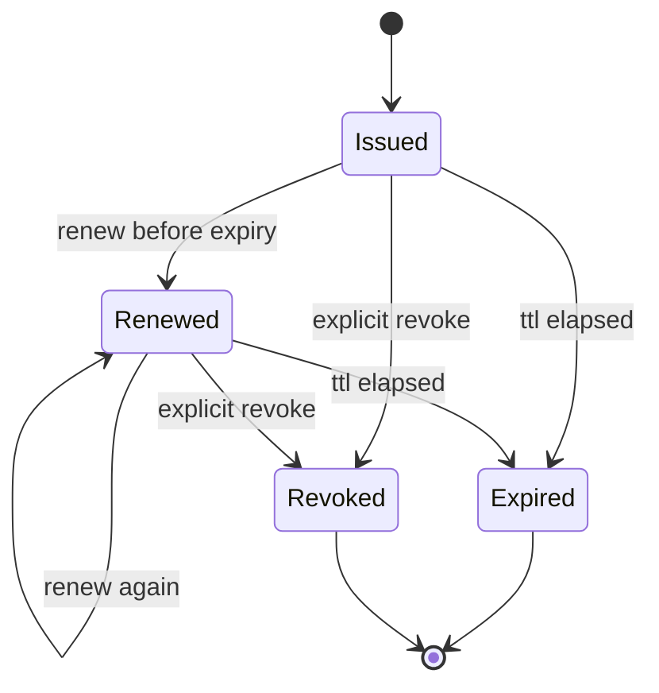
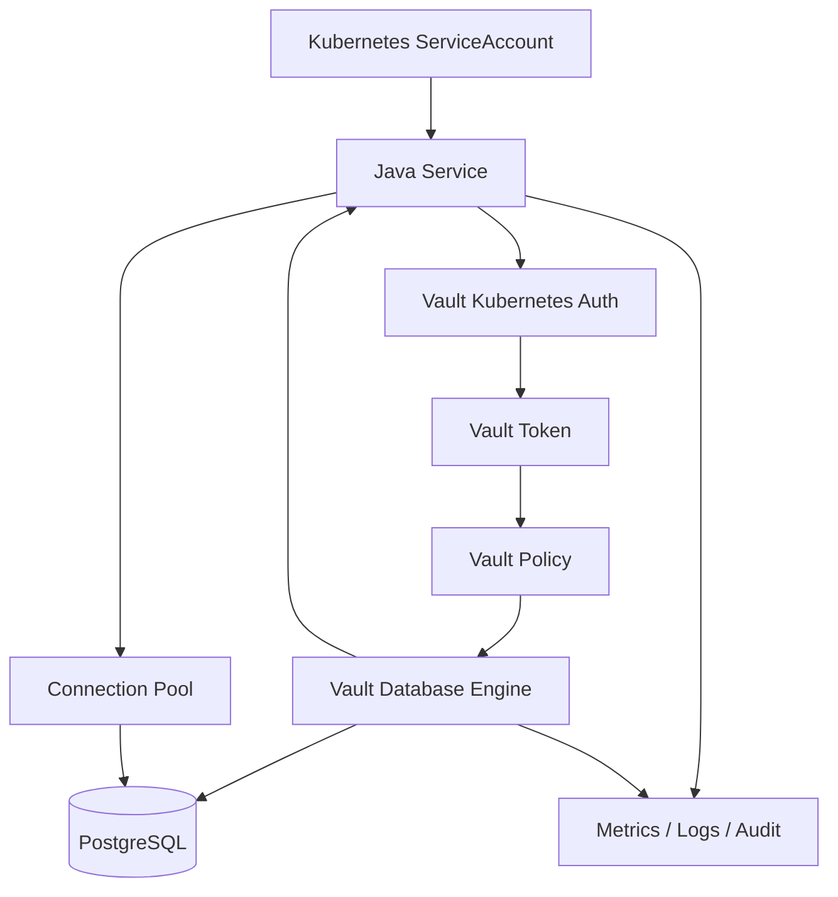

# Part 048 — HashiCorp Vault for Java Services

> Vault is not just a place to store passwords.
>
> In production, Vault is a capability broker with identity, policy, lease, revocation, and audit.

Banyak tim memakai Vault seperti encrypted `.properties` file:

```txt
Put password in Vault.
Read password at startup.
Done.
```

Itu hanya sebagian kecil dari value Vault.

Vault menjadi kuat ketika kita memakai model lengkapnya:

- service membuktikan identity;
- Vault mengevaluasi policy;
- secret diterbitkan atau dibaca;
- secret punya metadata/version/lease;
- dynamic secret bisa dibuat on demand;
- lease bisa direnew atau direvoke;
- akses dicatat di audit log;
- credential bisa berumur pendek;
- credential lama bisa diputus tanpa menunggu manusia mengganti password manual.

Di Java microservices, tantangannya bukan “bagaimana memanggil Vault API”. Tantangannya adalah:

```txt
Bagaimana Java runtime, Spring configuration, connection pool, retry policy,
health check, observability, dan deployment rollout menghormati lifecycle Vault?
```

---

## 1. Vault Mental Model

Vault punya beberapa primitive penting.



| Primitive | Makna |
|---|---|
| Auth method | Cara workload login ke Vault: Kubernetes auth, AppRole, cloud IAM, JWT/OIDC, mTLS, etc. |
| Token | Capability sementara untuk mengakses path tertentu sesuai policy. |
| Policy | Rule path/capability: read, list, create, update, delete, sudo. |
| Secrets engine | Backend yang menyimpan/generate secret: KV, Database, PKI, Transit, AWS, etc. |
| Lease | Metadata TTL/renewability untuk token atau dynamic secret. |
| Audit device | Log akses dan operasi Vault. |

Vault bukan hanya database secret. Vault adalah **runtime authorization system untuk secret capability**.

---

## 2. Static vs Dynamic Secrets

### 2.1 Static Secret

Static secret sudah ada sebelum dibaca.

Contoh KV:

```txt
secret/data/evidence-service/prod/database
  username=evidence_app
  password=...
```

Karakteristik:

- mudah dipahami;
- cocok untuk API token pihak ketiga;
- rotation biasanya update value + rollout/reload;
- jika bocor, credential tetap valid sampai diganti/revoke manual;
- bisa versioned jika memakai KV v2.

### 2.2 Dynamic Secret

Dynamic secret dibuat saat diminta.

Contoh database engine:

```txt
database/creds/evidence-reader
```

Vault membuat credential baru di database sesuai role, mengembalikan username/password + lease.

Karakteristik:

- tidak ada sampai diminta;
- unik per request/workload jika didesain demikian;
- punya TTL;
- bisa revoke;
- mengurangi blast radius;
- membutuhkan consumer yang lease-aware.

Mental model:



---

## 3. Auth Method for Kubernetes Java Workloads

Untuk Kubernetes, pattern umum adalah Kubernetes auth method.

Flow konseptual:



Vault role mengikat:

- service account name;
- namespace;
- policy;
- token TTL;
- max TTL.

### 3.1 Policy Example

Policy minimal untuk evidence-service membaca KV:

```hcl
path "secret/data/evidence-service/prod/*" {
  capabilities = ["read"]
}

path "secret/metadata/evidence-service/prod/*" {
  capabilities = ["read", "list"]
}
```

Policy untuk dynamic DB credential:

```hcl
path "database/creds/evidence-writer" {
  capabilities = ["read"]
}
```

Jangan beri wildcard terlalu luas:

```hcl
path "*" {
  capabilities = ["read"]
}
```

Itu sama saja memberi service kemampuan membaca hampir semua secret.

---

## 4. Integration Options for Java

Ada beberapa cara Java service memakai Vault.

| Option | Pattern | Cocok Untuk | Risiko |
|---|---|---|---|
| Spring Cloud Vault Config | Vault sebagai property source Spring | Spring Boot apps | property lifecycle dan refresh harus dipahami |
| Spring Vault lower-level API | programmatic Vault access | custom lease/secret logic | lebih banyak code |
| Vault Agent sidecar | secret rendered ke file | polyglot, file-based apps | app reload/reconnect tetap perlu |
| Direct HTTP client | raw Vault API | custom platform library | raw protocol responsibility |
| External Secrets Operator | Vault -> K8s Secret | GitOps/K8s-native | materialized copy + sync delay |

Part ini fokus pada Java/Spring path, tetapi semua invariant tetap berlaku untuk sidecar/operator.

---

## 5. Spring Cloud Vault as Config Data

Spring Cloud Vault mengintegrasikan Vault sebagai configuration source untuk Spring Boot.

Contoh dependency Maven secara konseptual:

```xml
<dependency>
  <groupId>org.springframework.cloud</groupId>
  <artifactId>spring-cloud-starter-vault-config</artifactId>
</dependency>
```

Konfigurasi minimal:

```yaml
spring:
  application:
    name: evidence-service
  cloud:
    vault:
      uri: https://vault.example.com
      authentication: KUBERNETES
      kubernetes:
        role: evidence-service
        service-account-token-file: /var/run/secrets/kubernetes.io/serviceaccount/token
      kv:
        enabled: true
        backend: secret
        application-name: evidence-service
```

Dengan Config Data style:

```yaml
spring:
  config:
    import: vault://
```

Konsepnya:

```txt
Vault paths -> Spring PropertySource -> @ConfigurationProperties -> Java beans
```

### 5.1 Typed Secret Binding

```java
@ConfigurationProperties(prefix = "app.datasource")
@Validated
public record VaultBackedDatasourceProperties(
    @NotBlank String username,
    @NotBlank String password
) {}
```

Ini tetap harus treated as secret:

- jangan log object;
- hati-hati actuator;
- password tetap masuk memory;
- refresh property tidak otomatis refresh connection pool kecuali diatur.

---

## 6. KV Secrets Engine

KV engine cocok untuk static secret.

### 6.1 KV v1 vs KV v2

| Feature | KV v1 | KV v2 |
|---|---|---|
| Versioning | No | Yes |
| Metadata | Limited | Better |
| Soft delete / undelete | No | Yes |
| Path shape | simpler | includes `/data/` and `/metadata/` in API |

Untuk production, KV v2 sering lebih baik karena versioning membantu rollback dan audit.

### 6.2 Version Pinning vs Latest

Pertanyaan penting:

```txt
Apakah service selalu membaca latest secret version?
Atau membaca version tertentu yang dipromosikan?
```

Latest lebih sederhana, tetapi bisa mengejutkan service jika secret berubah tanpa rollout.

Version pinning lebih defensible:

```yaml
app:
  secret:
    database-credential-version: 12
```

Tetapi membutuhkan promotion mechanism.

### 6.3 Static Secret Rotation

Rotation static secret umumnya:

```txt
1. Create new secret version.
2. Ensure target system accepts new credential.
3. Deploy/reload consumer to use new version.
4. Observe success.
5. Revoke/delete old credential.
```

Jika target tidak mendukung dua credential sekaligus, rotation akan rawan downtime.

---

## 7. Dynamic Database Secrets

Dynamic database secret adalah salah satu use case Vault paling kuat.

### 7.1 Role Definition Mental Model

Vault database role mendefinisikan:

- bagaimana membuat credential;
- privilege apa yang diberikan;
- TTL default;
- max TTL;
- revocation statement.

Contoh konseptual untuk PostgreSQL:

```sql
CREATE ROLE "{{name}}" WITH LOGIN PASSWORD '{{password}}' VALID UNTIL '{{expiration}}';
GRANT SELECT, INSERT, UPDATE, DELETE ON ALL TABLES IN SCHEMA evidence TO "{{name}}";
```

Jangan beri role superuser.

### 7.2 Java Consumer Problem

Dynamic secret membawa problem Java yang spesifik:

```txt
Database connection pool may outlive the credential lease.
```

Jika Vault memberi credential TTL 1 jam, tetapi Hikari connection hidup 2 jam, credential bisa expired saat connection masih dipakai.

Guardrail:

```yaml
spring:
  datasource:
    hikari:
      max-lifetime: 25m
      idle-timeout: 5m
      validation-timeout: 3s
```

Jika secret TTL 30 menit, `maxLifetime` harus lebih pendek dengan margin aman. Nilai persis bergantung database, pool, traffic, dan rotation strategy.

### 7.3 Credential Refresh Strategy

Pattern:

```txt
1. Load credential from Vault.
2. Build DataSource/pool.
3. Track lease expiry.
4. Refresh credential before expiry.
5. Build replacement pool or update credential provider.
6. Drain old pool.
7. Revoke old lease after safe window if applicable.
```

Sederhana secara diagram, sulit secara lifecycle.



### 7.4 Pool Swap Pattern

Konsep Java:

```java
public final class RotatingDataSourceProvider {
    private final AtomicReference<DataSourceHandle> active = new AtomicReference<>();

    public DataSource currentDataSource() {
        return active.get().dataSource();
    }

    public void rotate(DatabaseCredential nextCredential) {
        HikariDataSource next = buildDataSource(nextCredential);
        DataSourceHandle previous = active.getAndSet(new DataSourceHandle(next, nextCredential));
        scheduleClose(previous.dataSource(), Duration.ofMinutes(2));
    }

    private HikariDataSource buildDataSource(DatabaseCredential credential) {
        HikariConfig config = new HikariConfig();
        config.setJdbcUrl("jdbc:postgresql://postgres.example.com:5432/evidence");
        config.setUsername(credential.username());
        config.setPassword(credential.password().reveal());
        config.setMaximumPoolSize(20);
        config.setMaxLifetime(Duration.ofMinutes(20).toMillis());
        return new HikariDataSource(config);
    }

    private void scheduleClose(HikariDataSource oldPool, Duration delay) {
        // production code should use managed scheduler and metrics
    }
}

public record DataSourceHandle(HikariDataSource dataSource, DatabaseCredential credential) {}
```

Ini bukan drop-in recipe. Ini menunjukkan invariant: **credential rotation harus terhubung ke pool lifecycle**.

---

## 8. Lease Lifecycle

Vault lease punya TTL dan renewability. Dengan dynamic secret dan service token, Vault membuat lease metadata. Setelah lease expired, Vault dapat revoke data, dan consumer tidak bisa yakin credential masih valid.

### 8.1 Lease States



### 8.2 Consumer Invariants

```txt
A Java service must not use a leased credential beyond its safe validity window.
```

Safe validity window biasanya:

```txt
expiry - refresh_margin - clock_skew_margin - drain_margin
```

Contoh:

```txt
TTL = 30m
refresh_margin = 5m
clock_skew_margin = 30s
drain_margin = 2m
safe_new_credential_deadline = before minute 22m30s
```

### 8.3 Renew vs Reissue

Dua strategy:

| Strategy | Makna | Cocok Untuk |
|---|---|---|
| Renew lease | Memperpanjang credential yang sama | credential renewable dan target mendukung |
| Reissue credential | Ambil credential baru, drain lama | database dynamic secrets, safer rotation model |

Renew terlihat sederhana, tetapi jika credential bocor, memperpanjang credential yang sama memperpanjang risiko. Reissue sering lebih aman untuk blast radius, tetapi lebih kompleks untuk pool rotation.

---

## 9. Spring Cloud Vault Lease Awareness

Spring Cloud Vault menyediakan lifecycle untuk secret lease dan login token. Namun jangan salah paham:

```txt
Lease-aware property source does not automatically make every Java client reload-safe.
```

Jika property berubah, bean yang sudah memakai value lama mungkin tetap memegang value lama.

Contoh:

```java
@Bean
DataSource dataSource(VaultBackedDatasourceProperties props) {
    return DataSourceBuilder.create()
        .username(props.username())
        .password(props.password())
        .build();
}
```

DataSource dibuat sekali. Jika property berubah, DataSource tidak otomatis rebuild kecuali lifecycle refresh diatur.

### 9.1 Refresh Scope Caveat

`@RefreshScope` bisa membantu untuk bean tertentu, tetapi jangan pakai membabi buta.

Pertanyaan:

- apakah bean aman direcreate saat traffic berjalan?
- apakah old connection akan ditutup?
- apakah transaction in-flight aman?
- apakah retry akan duplicate write?
- apakah readiness harus false saat refresh?
- apakah refresh event observable?

### 9.2 Recommended Approach

Untuk credential yang critical:

```txt
Use explicit lifecycle manager rather than accidental refresh.
```

Artinya:

- track secret version/lease;
- refresh on schedule before expiry;
- build new client/pool;
- switch atomically;
- drain old resource;
- emit metric/audit;
- fail readiness if rotation cannot complete before safety deadline.

---

## 10. Vault Agent Pattern for Java

Vault Agent bisa:

- authenticate ke Vault;
- renew token;
- render template;
- cache secret;
- write file ke shared volume.

Java membaca file.

### 10.1 Template Example Concept

Template output:

```properties
app.datasource.username=v-token-evidence-123
app.datasource.password=...
app.datasource.expires-at=2026-07-05T12:30:00Z
```

App import file:

```yaml
spring:
  config:
    import: optional:file:/vault/secrets/application.properties
```

### 10.2 Critical Issue

Agent rendering file baru tidak cukup.

Java process perlu:

- detect file changed;
- parse safely;
- validate;
- rebuild affected resource;
- avoid partial read;
- handle failed template render;
- expose secret age/expiry metrics.

### 10.3 Sidecar vs Native Client

| Aspect | Vault Agent | Spring Cloud Vault / Native Client |
|---|---|---|
| App coupling | lower | higher |
| Lease detail visibility | indirect | direct |
| Polyglot | strong | Java-specific |
| Reload control | app must watch files | app can manage directly |
| Debugging | agent + app | app-centric |
| Dynamic DB pool rotation | still app-owned | app-owned, but more metadata available |

---

## 11. Failure Modelling

### 11.1 Vault Down at Startup

Options:

| Option | Behavior | Risk |
|---|---|---|
| Fail startup | safest for secret correctness | crash loop if Vault unavailable |
| Use cached secret | higher availability | stale/revoked secret risk |
| Degraded mode | app starts without secret-dependent capability | complexity |

Untuk database credential, fail startup biasanya benar. Untuk optional integration token, degraded mode mungkin benar.

### 11.2 Vault Down at Runtime

Pertanyaan:

```txt
Do we already have a valid credential? How long until expiry?
```

Policy yang baik:

```txt
If current credential is valid beyond safety window, continue and retry refresh.
If credential approaches unsafe expiry and refresh still fails, fail readiness.
If credential expired, stop using target dependency.
```

### 11.3 Lease Renewal Failure

Jangan retry tight loop.

Gunakan:

- exponential backoff;
- jitter;
- max attempts by deadline;
- alert;
- readiness transition;
- fallback if allowed;
- no secret value in logs.

### 11.4 Token Expiry

Vault token sendiri punya lifecycle. Jika token expired, app tidak bisa membaca/renew secret.

Pastikan:

- login token renewable jika diperlukan;
- re-auth path tersedia;
- service account token valid;
- Kubernetes auth role binding benar;
- clock skew dipertimbangkan.

---

## 12. Observability for Vault Integration

Metrics:

```txt
vault_login_success_total
vault_login_failure_total
vault_secret_read_success_total{path="database/creds/evidence-writer"}
vault_secret_read_failure_total{reason="permission_denied"}
vault_lease_renew_success_total
vault_lease_renew_failure_total
vault_secret_seconds_until_expiry
vault_secret_refresh_deadline_seconds
vault_token_seconds_until_expiry
vault_pool_rotation_success_total
vault_pool_rotation_failure_total
vault_current_secret_version_info
```

Logs:

```txt
INFO Vault login succeeded authMethod=kubernetes role=evidence-service tokenTtlSeconds=1800
INFO Vault dynamic credential loaded role=evidence-writer leaseTtlSeconds=1800 renewable=true
WARN Vault credential refresh failed role=evidence-writer reason=timeout retryInMs=5000
ERROR Vault credential cannot be refreshed before safety deadline role=evidence-writer readiness=DOWN
```

Never log:

- token;
- username if it encodes sensitive info? Usually safe-ish but consider policy;
- password;
- full secret path if path reveals tenant/customer? Consider redaction;
- Authorization header;
- raw Vault response.

Health detail:

```json
{
  "status": "UP",
  "components": {
    "vault": {
      "status": "UP",
      "details": {
        "authenticated": true,
        "dbCredentialLoaded": true,
        "secondsUntilExpiry": 1240,
        "lastRefreshStatus": "SUCCESS"
      }
    }
  }
}
```

---

## 13. Security Hardening

### 13.1 Least Privilege Policy

Policy per service, per environment.

Buruk:

```txt
evidence-service-prod can read secret/data/*
```

Baik:

```txt
evidence-service-prod can read:
- secret/data/evidence-service/prod/*
- database/creds/evidence-writer
```

### 13.2 Separate Roles by Capability

Jangan satu Vault role untuk semua kemampuan.

Contoh:

| Role | Capability |
|---|---|
| evidence-service-readonly | read KV non-DB API token |
| evidence-service-db-writer | read dynamic DB writer credential |
| evidence-worker-scanner | read scanner API token |
| evidence-migration-job | temporary migration capability |

Batch job migration tidak harus memakai role aplikasi runtime.

### 13.3 Audit Log

Vault audit log harus aktif dan dikirim ke pipeline aman.

Audit menjawab:

- service apa membaca secret apa;
- kapan;
- dari auth method mana;
- apakah ditolak policy;
- apakah ada read spike;
- apakah role tidak wajar dipakai.

### 13.4 Break Glass

Siapkan break-glass process:

- revoke leaked lease;
- rotate static secret;
- disable Vault role;
- update policy;
- rollout consumer;
- verify no old credential use;
- produce incident evidence.

---

## 14. Local Development Strategy

Jangan membuat developer menaruh secret production di laptop.

Opsi:

| Environment | Strategy |
|---|---|
| Local unit test | fake SecretProvider |
| Local integration | local Vault dev server with fake secrets |
| Shared dev cluster | Vault dev/staging namespace |
| CI | short-lived CI identity + test secret path |
| Production | Kubernetes/cloud auth + least privilege policy |

Abstraction:

```java
public interface DatabaseCredentialProvider {
    DatabaseCredential current();
}
```

Local fake:

```java
public final class StaticDatabaseCredentialProvider implements DatabaseCredentialProvider {
    private final DatabaseCredential credential;

    public StaticDatabaseCredentialProvider(DatabaseCredential credential) {
        this.credential = credential;
    }

    @Override
    public DatabaseCredential current() {
        return credential;
    }
}
```

Production Vault provider:

```java
public final class VaultDatabaseCredentialProvider implements DatabaseCredentialProvider {
    @Override
    public DatabaseCredential current() {
        // read/refresh from Vault or Spring Cloud Vault managed source
        throw new UnsupportedOperationException("example");
    }
}
```

---

## 15. Testing Vault Integration

### 15.1 Unit Test

Test code without Vault:

```java
@Test
void redactedValueDoesNotExposeSecretInToString() {
    RedactedValue value = RedactedValue.of("super-secret");
    assertEquals("[REDACTED]", value.toString());
}
```

### 15.2 Contract Test

Validate secret shape:

```txt
Given Vault path database/creds/evidence-writer
When service reads credential
Then response contains username, password, lease id, ttl
And ttl >= minimum expected
And policy does not allow unrelated path
```

### 15.3 Failure Test

Inject:

- Vault timeout;
- permission denied;
- malformed secret;
- expired token;
- lease renewal failure;
- DB rejects credential;
- pool rotation failure.

Expected:

```txt
No secret leaked.
No unsafe credential use beyond deadline.
Readiness reflects risk.
Metric and alert emitted.
```

---

## 16. Vault Runbook

Minimal runbook untuk Java service:

```mdx
# Vault Credential Incident Runbook

## Symptoms
- secret refresh failure alert
- seconds_until_expiry below threshold
- database auth failures
- Vault permission denied
- Vault timeout

## First Checks
- Is Vault reachable from namespace?
- Is Kubernetes auth role bound to correct service account?
- Did policy change recently?
- Is service account token valid?
- Is lease renewable?
- Is database role creation failing?

## Immediate Mitigation
- If current credential still valid: keep service running, retry with backoff.
- If nearing expiry: mark readiness down to stop new traffic.
- If expired: disable dependency path or fail closed.
- If leak suspected: revoke lease / rotate static secret.

## Recovery
- Fix policy/auth/engine issue.
- Force credential refresh.
- Rotate pool.
- Verify new credential use.
- Revoke old credential.
- Close incident with audit evidence.
```

---

## 17. Architecture Template



Production invariant:

```txt
The Java service must never use database credentials beyond their safe lease window,
and it must expose enough telemetry to prove refresh/rotation health.
```

---

## 18. Design Checklist

### Vault Authority

- Which Vault namespace/mount?
- KV or dynamic engine?
- Which path/role?
- What policy?
- Is audit enabled?

### Authentication

- Which auth method?
- Which Kubernetes service account?
- Token TTL?
- Max TTL?
- Re-auth behavior?

### Secret Lifecycle

- Static or dynamic?
- TTL?
- Renewable?
- Revocation path?
- Rotation frequency?

### Java Consumption

- Spring Cloud Vault, Spring Vault, agent file, or operator?
- Startup fail mode?
- Runtime refresh?
- Connection pool lifecycle?
- Redaction?

### Failure Handling

- Vault unavailable at startup?
- Vault unavailable at runtime?
- Permission denied?
- Secret malformed?
- Credential expired?
- DB rejects credential?

### Observability

- Lease expiry metric?
- Refresh metric?
- Current version/role metadata?
- Readiness behavior?
- Alert thresholds?
- Audit correlation ID?

---

## 19. Key Takeaways

Vault untuk Java services harus dipahami sebagai lifecycle system, bukan hanya secret storage.

Prinsip utamanya:

1. **Vault combines identity, policy, secret engine, lease, revocation, and audit.**
2. **Static secrets are simpler, but dynamic secrets reduce blast radius when consumers are lease-aware.**
3. **Kubernetes auth maps workload identity to Vault token capability.**
4. **Policy must be least privilege per service, per environment, per capability.**
5. **Spring Cloud Vault can expose Vault secrets as configuration, but client lifecycle remains your responsibility.**
6. **Dynamic DB credentials require connection pool strategy.**
7. **Lease expiry is a correctness boundary, not a monitoring detail.**
8. **Vault Agent reduces app coupling but does not remove reload/reconnect responsibility.**
9. **Observability must show login, read, renew, refresh, expiry, and pool rotation health.**
10. **A service that cannot refresh before credential expiry must fail readiness before it fails user traffic.**

Part berikutnya akan membahas cloud-native managed secret manager pertama: **AWS Secrets Manager with Java**.

---

## References

- HashiCorp Vault Documentation: https://developer.hashicorp.com/vault/docs
- Vault Lease, Renew, and Revoke: https://developer.hashicorp.com/vault/docs/concepts/lease
- Vault Static and Dynamic Secrets: https://developer.hashicorp.com/vault/tutorials/get-started/understand-static-dynamic-secrets
- Vault Dynamic Credential Lease Management: https://developer.hashicorp.com/vault/tutorials/db-credentials/manage-dynamic-leases
- Vault KV Secrets Engine: https://developer.hashicorp.com/vault/docs/secrets/kv
- Spring Cloud Vault Reference: https://docs.spring.io/spring-cloud-vault/reference/index.html
- Spring Cloud Vault Advanced Topics: https://docs.spring.io/spring-cloud-vault/reference/advanced-topics.html
- HashiCorp Vault Spring Reload Secrets Tutorial: https://developer.hashicorp.com/vault/tutorials/app-integration/spring-reload-secrets
- Kubernetes Secrets: https://kubernetes.io/docs/concepts/configuration/secret/
