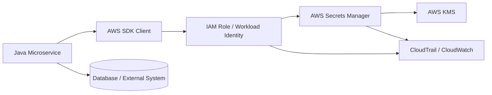
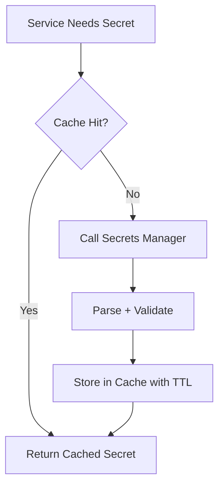
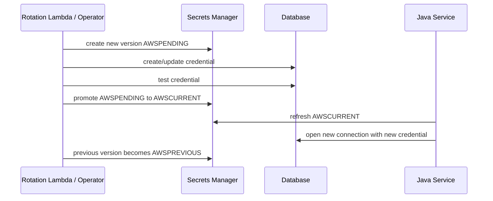
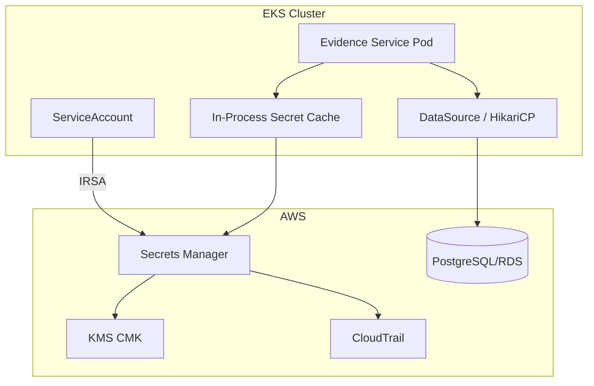

# Part 049 — AWS Secrets Manager with Java

> A secret manager is not a magic vault around bad runtime behavior.
>
> It is a control plane for capability issuance, versioning, access, audit, and rotation.

Di part sebelumnya kita membahas secret injection pattern dan Vault. Sekarang kita masuk cloud-native implementation pertama: **AWS Secrets Manager** untuk Java microservices.

Tujuan part ini bukan sekadar “cara memanggil `GetSecretValue`”. Itu terlalu dangkal. Target kita adalah memahami bagaimana Java service memakai secret manager sebagai **runtime dependency** yang punya latency, cost, IAM boundary, versioning, rotation, audit trail, dan failure mode.

Kita akan bahas:

- kapan memakai AWS Secrets Manager;
- kapan jangan memanggil secret manager langsung dari hot path;
- IAM boundary untuk service Java;
- AWS SDK for Java 2.x client design;
- secret cache;
- secret version/staging label;
- rotation tanpa downtime;
- database credential dan connection pool;
- Spring Boot integration;
- observability dan incident model;
- checklist production readiness.

---

## 1. Mental Model

AWS Secrets Manager menyimpan dan mengelola secret seperti database credential, API key, token, dan material sensitif lain. Dari perspektif Java microservice, Secrets Manager adalah **remote secret authority**.

Modelnya:



Satu request `GetSecretValue` bukan hanya “ambil string”. Ia melibatkan:

- identity service runtime;
- IAM policy evaluation;
- Secrets Manager API;
- optional KMS decrypt;
- network latency;
- API quota/cost;
- version resolution;
- audit event;
- client-side retry;
- application-level fallback.

Karena itu secret retrieval harus didesain sebagai runtime control plane dependency, bukan helper method acak.

---

## 2. What AWS Secrets Manager Solves

AWS Secrets Manager membantu untuk:

| Problem | Solusi yang Diberikan |
|---|---|
| Secret tidak boleh hardcoded | Secret disimpan di managed service |
| Secret perlu access control | IAM policy, resource policy, KMS policy |
| Secret perlu audit | CloudTrail untuk API access |
| Secret perlu rotation | Rotation function dan version staging label |
| Secret perlu versioning | Secret version dan staging labels seperti `AWSCURRENT` |
| Multi-service access | IAM scoped per service |
| Cross-account access | Resource policy + IAM + KMS policy |

Namun ia tidak otomatis menyelesaikan:

- secret bocor di log Java;
- credential lama masih dipakai connection pool;
- service crash saat Secrets Manager unreachable;
- terlalu sering memanggil API dan menambah latency/cost;
- IAM policy terlalu luas;
- secret value diperlakukan seperti config biasa;
- rotation dilakukan tanpa readiness consumer.

Service owner tetap bertanggung jawab atas **consumption behavior**.

---

## 3. Secret as Capability

Jangan melihat secret sebagai string. Secret adalah capability.

Contoh:

```txt
evidence-service/prod/db-writer
```

Maknanya bukan “password database”. Maknanya:

```txt
Service evidence-service pada environment prod diberi capability
untuk melakukan operasi tertentu terhadap database tertentu,
dengan scope tertentu, melalui credential tertentu, pada periode tertentu,
dan access-nya harus bisa diaudit serta dirotasi.
```

Capability ini harus punya atribut:

| Attribute | Contoh |
|---|---|
| Consumer | `evidence-service` |
| Environment | `prod` |
| Capability | `db-writer` |
| Scope | schema `evidence`, read/write only |
| Authority | AWS Secrets Manager / RDS rotation lambda |
| Encryption | KMS key alias |
| Rotation | every 30 days / on incident |
| Version | `AWSCURRENT`, `AWSPREVIOUS` |
| Audit | CloudTrail events |

Secret naming harus merefleksikan boundary ini.

---

## 4. Secret Naming Convention

Naming yang buruk:

```txt
db-password
prod-secret
app-credential
password1
```

Naming yang lebih baik:

```txt
/org/regulator/prod/evidence-service/postgres/writer
/org/regulator/prod/evidence-service/s3/presign-signing-key
/org/regulator/staging/case-service/external-risk-api/client-secret
```

Guideline:

```txt
/<org>/<environment>/<service>/<dependency>/<capability>
```

Contoh:

| Segment | Fungsi |
|---|---|
| org | namespace organisasi |
| environment | dev/staging/prod |
| service | consumer utama |
| dependency | database, API, broker, third-party |
| capability | writer, reader, admin, token, signing-key |

Jangan memasukkan secret value ke name, tag, description, metric, atau log.

---

## 5. Secret Payload Model

AWS Secrets Manager secret bisa berupa string atau binary. Untuk Java service, format umum adalah JSON.

Contoh database secret:

```json
{
  "username": "evidence_writer",
  "password": "REDACTED",
  "host": "evidence-prod.cluster-abc.ap-southeast-1.rds.amazonaws.com",
  "port": 5432,
  "dbname": "regulator",
  "engine": "postgres"
}
```

Contoh API credential:

```json
{
  "clientId": "evidence-service-prod",
  "clientSecret": "REDACTED",
  "tokenEndpoint": "https://partner.example.com/oauth/token"
}
```

### 5.1 Payload Design Rule

Gunakan rule ini:

```txt
Secret payload should contain only material needed to exercise the capability,
not unrelated application configuration.
```

Buruk:

```json
{
  "username": "...",
  "password": "...",
  "featureFlag": true,
  "maxUploadSizeMb": 200,
  "supportEmail": "ops@example.com"
}
```

Kenapa buruk?

- secret manager menjadi config server;
- akses secret memberi akses config non-secret;
- rotation secret bercampur dengan perubahan behavior;
- audit secret access menjadi noisy;
- blast radius membesar.

Pisahkan config dan secret.

---

## 6. IAM Boundary

Service Java sebaiknya tidak memakai static AWS access key. Di ECS/EKS/Lambda/EC2, gunakan runtime identity seperti task role, instance profile, atau IAM Roles for Service Accounts di EKS.

Minimal permission:

```json
{
  "Version": "2012-10-17",
  "Statement": [
    {
      "Effect": "Allow",
      "Action": [
        "secretsmanager:GetSecretValue"
      ],
      "Resource": [
        "arn:aws:secretsmanager:ap-southeast-1:123456789012:secret:/org/regulator/prod/evidence-service/postgres/writer-*"
      ]
    }
  ]
}
```

Jika secret memakai customer-managed KMS key, service identity juga butuh permission decrypt yang sesuai pada key policy/IAM policy.

### 6.1 Avoid Broad Secret Access

Buruk:

```json
{
  "Effect": "Allow",
  "Action": "secretsmanager:GetSecretValue",
  "Resource": "*"
}
```

Ini membuat satu service bisa membaca semua secret jika compromised.

Lebih baik:

- resource ARN spesifik;
- tag-based condition jika governance matang;
- KMS key scoped;
- separate IAM role per service;
- no shared runtime role untuk banyak service;
- deny wildcard di permission boundary/SCP jika organisasi mendukung.

### 6.2 IAM Is Part of the Contract

Secret contract bukan hanya Java class. Ia mencakup:

```txt
Secret name + IAM role + KMS key + secret payload schema + rotation policy + consumer code
```

Jika salah satu berubah, contract berubah.

---

## 7. AWS SDK for Java 2.x Client Design

Gunakan AWS SDK for Java 2.x untuk aplikasi modern. Buat client sebagai singleton bean, bukan dibuat per request.

Contoh Spring Boot bean:

```java
@Configuration
public class AwsSecretsManagerConfig {

    @Bean
    SecretsManagerClient secretsManagerClient(
            AwsSecretClientProperties properties
    ) {
        return SecretsManagerClient.builder()
            .region(Region.of(properties.region()))
            .overrideConfiguration(ClientOverrideConfiguration.builder()
                .apiCallTimeout(properties.apiCallTimeout())
                .apiCallAttemptTimeout(properties.apiCallAttemptTimeout())
                .retryStrategy(RetryMode.STANDARD)
                .build())
            .build();
    }
}
```

Typed properties:

```java
@ConfigurationProperties(prefix = "aws.secrets-manager")
@Validated
public record AwsSecretClientProperties(
    @NotBlank String region,
    @NotNull Duration apiCallTimeout,
    @NotNull Duration apiCallAttemptTimeout
) {}
```

Configuration:

```yaml
aws:
  secrets-manager:
    region: ap-southeast-1
    api-call-timeout: 3s
    api-call-attempt-timeout: 1s
```

### 7.1 Timeout Rule

Secret retrieval should not hang startup indefinitely.

Gunakan:

- API call attempt timeout;
- API call timeout;
- retry policy;
- startup failure mode eksplisit;
- readiness behavior saat refresh gagal.

Jangan biarkan default timeout menjadi production policy tanpa sadar.

---

## 8. Basic Secret Retrieval

Wrapper sederhana:

```java
public interface SecretReader {
    SecretDocument getJsonSecret(String secretId);
}
```

Implementation:

```java
public final class AwsSecretsManagerSecretReader implements SecretReader {
    private final SecretsManagerClient client;
    private final ObjectMapper objectMapper;

    public AwsSecretsManagerSecretReader(
        SecretsManagerClient client,
        ObjectMapper objectMapper
    ) {
        this.client = client;
        this.objectMapper = objectMapper;
    }

    @Override
    public SecretDocument getJsonSecret(String secretId) {
        try {
            GetSecretValueResponse response = client.getSecretValue(
                GetSecretValueRequest.builder()
                    .secretId(secretId)
                    .versionStage("AWSCURRENT")
                    .build()
            );

            String secretString = response.secretString();
            if (secretString == null || secretString.isBlank()) {
                throw new SecretReadException("Secret string is empty for secretId=" + redact(secretId));
            }

            return objectMapper.readValue(secretString, SecretDocument.class);
        } catch (SecretsManagerException ex) {
            throw SecretReadException.fromAws(secretId, ex);
        } catch (JsonProcessingException ex) {
            throw new SecretReadException("Secret payload is not valid JSON for secretId=" + redact(secretId), ex);
        }
    }

    private static String redact(String secretId) {
        return secretId == null ? "[null]" : secretId.replaceAll("[^/]+$", "[REDACTED]");
    }
}
```

Important:

- jangan log secret value;
- jangan return raw `String` ke seluruh codebase;
- parse ke typed model;
- validate payload;
- wrap exception dengan message yang tidak membocorkan value;
- gunakan version stage eksplisit jika perlu.

---

## 9. Typed Secret Document

Database secret model:

```java
public record DatabaseSecret(
    @NotBlank String username,
    @NotBlank String password,
    @NotBlank String host,
    @Min(1) @Max(65535) int port,
    @NotBlank String dbname,
    @NotBlank String engine
) {
    public String jdbcUrl() {
        if (!"postgres".equalsIgnoreCase(engine)) {
            throw new IllegalStateException("Unsupported engine: " + engine);
        }
        return "jdbc:postgresql://" + host + ":" + port + "/" + dbname;
    }

    @Override
    public String toString() {
        return "DatabaseSecret[username=" + username + ", host=" + host + ", port=" + port
            + ", dbname=" + dbname + ", engine=" + engine + ", password=[REDACTED]]";
    }
}
```

Validation:

```java
public final class SecretValidator {
    private final Validator validator;

    public SecretValidator(Validator validator) {
        this.validator = validator;
    }

    public <T> T validate(T value) {
        Set<ConstraintViolation<T>> violations = validator.validate(value);
        if (!violations.isEmpty()) {
            throw new SecretValidationException("Secret payload failed validation");
        }
        return value;
    }
}
```

Secret schema harus diperlakukan seperti API contract. Jika payload berubah, consumer bisa gagal startup atau gagal reconnect.

---

## 10. Caching Is Not Optional in Serious Services

AWS menganjurkan client-side caching untuk secret value karena caching meningkatkan speed dan mengurangi cost. Production Java service hampir selalu perlu cache, terutama jika secret dipakai untuk koneksi database, signing, atau external API client.

Model:



### 10.1 Cache TTL Is a Security-Controlled Value

TTL terlalu pendek:

- latency naik;
- API call cost naik;
- rate limit risk;
- startup storm saat deploy.

TTL terlalu panjang:

- rotation lambat diadopsi;
- revoked secret tetap dipakai;
- incident containment lambat.

Rule:

```txt
Secret cache TTL must be shorter than the operational rotation observation window
and aligned with credential validity expectations.
```

### 10.2 Cache Failure Behavior

Saat refresh gagal, ada dua pilihan:

| Strategy | Cocok untuk | Risiko |
|---|---|---|
| serve stale until max-stale | transient outage Secrets Manager | revoked credential bisa tetap dipakai sementara |
| fail closed | high-security secret | availability turun |

Jangan biarkan ini implisit.

Contoh cache wrapper dengan max stale:

```java
public final class CachedSecretProvider<T> {
    private final Supplier<T> loader;
    private final Duration ttl;
    private final Duration maxStale;

    private volatile CacheEntry<T> current;

    public CachedSecretProvider(Supplier<T> loader, Duration ttl, Duration maxStale) {
        this.loader = loader;
        this.ttl = ttl;
        this.maxStale = maxStale;
    }

    public T get() {
        CacheEntry<T> snapshot = current;
        Instant now = Instant.now();

        if (snapshot != null && snapshot.expiresAt().isAfter(now)) {
            return snapshot.value();
        }

        try {
            T loaded = loader.get();
            current = new CacheEntry<>(loaded, now.plus(ttl), now.plus(ttl).plus(maxStale));
            return loaded;
        } catch (RuntimeException ex) {
            if (snapshot != null && snapshot.maxStaleUntil().isAfter(now)) {
                return snapshot.value();
            }
            throw ex;
        }
    }

    private record CacheEntry<T>(T value, Instant expiresAt, Instant maxStaleUntil) {}
}
```

Tambahkan metric:

```txt
secret_cache_hit_total
secret_cache_miss_total
secret_refresh_success_total
secret_refresh_failure_total
secret_stale_served_total
secret_stale_rejected_total
```

---

## 11. Version Staging Labels

AWS Secrets Manager menggunakan version dan staging label. Label penting:

| Label | Makna |
|---|---|
| `AWSCURRENT` | version aktif yang digunakan normal consumer |
| `AWSPREVIOUS` | version sebelumnya |
| `AWSPENDING` | version yang sedang disiapkan rotation |

Consumer normal biasanya membaca `AWSCURRENT`.

Rotation workflow:



Important:

- service tidak perlu tahu `AWSPENDING` kecuali ikut rotation test;
- service harus refresh cukup cepat setelah `AWSCURRENT` berubah;
- database harus menerima credential baru sebelum old credential dicabut;
- connection pool harus mengeluarkan koneksi lama.

---

## 12. Database Credential Rotation and Java Connection Pools

Ini area yang sering menyebabkan outage.

Masalah:

```txt
Secret rotated successfully in Secrets Manager.
Application still has old JDBC connections in HikariCP.
Old database credential revoked.
Existing or new DB operations fail.
```

Solusi harus melibatkan:

- secret refresh;
- datasource/pool refresh;
- max connection lifetime;
- dual credential overlap;
- canary rotation;
- revocation after observation.

### 12.1 HikariCP Boundary

Jika credential berubah, pool harus membuka connection baru dengan credential baru. Ada beberapa strategi:

1. restart pod secara rolling setelah secret update;
2. rebuild `DataSource` bean;
3. use credential provider integrated into connection acquisition;
4. set `maxLifetime` agar old connections tidak hidup terlalu lama;
5. evict connections setelah refresh.

Contoh simple production-friendly approach:

```txt
Rotation event -> update secret AWSCURRENT -> trigger deployment rollout -> pods restart rolling -> each pod reads new secret at startup.
```

Ini lebih lambat tetapi jelas dan mudah diuji.

Approach runtime refresh lebih kompleks:

```txt
Refresh secret -> build new DataSource -> drain old pool -> switch atomically -> close old pool after grace period.
```

### 12.2 Dual Credential Window

Invariant:

```txt
Old credential must remain valid until all consumers have demonstrably switched
or the max connection lifetime has elapsed plus safety margin.
```

Tanpa overlap window, rotation menjadi outage generator.

---

## 13. Spring Boot Integration Patterns

Ada tiga pattern umum.

### 13.1 Startup Fetch Pattern

Service fetch secret saat startup, membangun beans, lalu berjalan.

Cocok untuk:

- DB credential dengan rolling restart rotation;
- secret jarang berubah;
- fail-fast service startup.

Pro:

- sederhana;
- secret schema validated sebelum traffic;
- easy rollback.

Kontra:

- rotation butuh restart/rollout;
- secret manager outage bisa menggagalkan startup.

### 13.2 Runtime Provider Pattern

Service punya `SecretProvider` yang fetch/cache secret saat runtime.

Cocok untuk:

- external API token;
- signing key yang perlu refresh;
- secret dengan TTL pendek;
- multi-tenant secret retrieval.

Kontra:

- hot path harus cache;
- failure mode lebih kompleks;
- perlu observability.

### 13.3 Mounted Secret Sync Pattern

Secret disinkronkan ke Kubernetes Secret oleh External Secrets Operator, lalu service membaca via env/volume/config tree.

Cocok untuk:

- platform ingin centralized sync;
- aplikasi tidak perlu AWS SDK;
- GitOps/Kubernetes-native deployment.

Kontra:

- secret masuk Kubernetes Secret layer;
- update semantics tergantung env/volume;
- rotation tetap butuh consumer readiness;
- RBAC Kubernetes menjadi bagian threat model.

---

## 14. Do Not Put Secret Values in Spring Environment Carelessly

Spring `Environment` nyaman, tetapi bisa berbahaya jika secret tersebar sebagai property biasa.

Risiko:

- actuator env/configprops exposure;
- accidental log of property source;
- `/actuator` misconfiguration;
- debug dump;
- third-party library membaca property;
- secret bercampur dengan config non-secret.

Jika memakai property binding untuk secret:

- batasi actuator exposure;
- sanitize keys;
- jangan enable env endpoint publik;
- gunakan custom type dengan redacted `toString()`;
- audit property source.

Lebih baik untuk credential sensitif: inject ke komponen spesifik, bukan expose ke seluruh environment jika tidak perlu.

---

## 15. Secret Retrieval Error Mapping

Jangan map semua error menjadi `RuntimeException` generic.

Kategori:

| AWS/API Error | Makna | Response Service |
|---|---|---|
| access denied | IAM/KMS policy salah atau compromised path | fail closed, alert security/platform |
| resource not found | secret missing/wrong env | fail startup or readiness down |
| invalid request | deleted/scheduled deletion/wrong state | fail closed, alert |
| throttling | too many calls/cache broken/deploy storm | retry with backoff, cache, alert |
| network timeout | transient dependency issue | retry, stale cache policy |
| JSON parse failure | schema drift/corrupt secret | fail closed, alert service owner |
| validation failure | secret contract broken | fail closed, block rollout |

Contoh exception taxonomy:

```java
public sealed class SecretAccessException extends RuntimeException
    permits SecretNotFoundException,
            SecretUnauthorizedException,
            SecretTemporarilyUnavailableException,
            SecretSchemaException {
    protected SecretAccessException(String message, Throwable cause) {
        super(message, cause);
    }
}
```

---

## 16. Observability

Secret system harus observable tanpa membocorkan secret.

### 16.1 Metrics

```txt
secret_read_success_total{secret="evidence-db-writer"}
secret_read_failure_total{secret="evidence-db-writer",reason="access_denied"}
secret_cache_hit_total{secret="evidence-db-writer"}
secret_cache_miss_total{secret="evidence-db-writer"}
secret_refresh_duration_seconds{secret="evidence-db-writer"}
secret_last_refresh_age_seconds{secret="evidence-db-writer"}
secret_stale_served_total{secret="evidence-db-writer"}
secret_payload_validation_failure_total{secret="evidence-db-writer"}
```

Use secret alias, not full ARN if ARN exposes account or sensitive naming.

### 16.2 Logs

Good:

```txt
secret refresh failed secretAlias=evidence-db-writer reason=throttling attempt=2 correlationId=...
```

Bad:

```txt
failed secret payload={"username":"evidence_writer","password":"..."}
```

### 16.3 Traces

Trace remote call duration but redact request parameters if naming sensitive.

Span example:

```txt
aws.secretsmanager.get_secret_value
attributes:
  secret.alias=evidence-db-writer
  aws.region=ap-southeast-1
  result=success
```

---

## 17. Availability and Startup Strategy

Ask:

```txt
Can service start if Secrets Manager is temporarily unavailable?
```

Options:

| Strategy | Usage |
|---|---|
| fail startup | high-safety, no valid cached secret available |
| use mounted last-known secret | platform-controlled fallback |
| start degraded | non-critical integration unavailable |
| wait with bounded retry | dependency may recover quickly |

Never wait forever.

Startup invariant:

```txt
Service must either start with validated secret material or fail explicitly before accepting traffic.
```

Readiness invariant:

```txt
If required secret is expired, invalid, or unavailable beyond allowed stale window,
readiness must fail or service must degrade explicitly.
```

---

## 18. Multi-Region and Disaster Recovery

For high-critical systems, define:

- per-region secret replication strategy;
- KMS key per region;
- failover secret naming;
- rotation consistency;
- audit aggregation;
- bootstrap dependency during region failover.

Anti-pattern:

```txt
Application in region B still depends on secret only available in region A.
```

Better:

```txt
/org/regulator/prod/ap-southeast-1/evidence-service/postgres/writer
/org/regulator/prod/ap-southeast-3/evidence-service/postgres/writer
```

or clear mapping via config:

```yaml
aws:
  secrets:
    evidence-db-writer: /org/regulator/prod/${aws.region}/evidence-service/postgres/writer
```

Config chooses secret identity. Secret manager stores secret material.

---

## 19. Cost and Rate Limit Guardrails

Secret retrieval has cost and quota implications.

Bad design:

```java
public void handleRequest(Request request) {
    String password = secretsManager.getSecretValue(...).secretString();
    callDatabase(password);
}
```

This makes every request depend on Secrets Manager latency and quota.

Better:

```txt
request path -> cached credential/provider -> dependency call
background refresh -> update cache/pool safely
```

Guardrails:

- cache secret;
- pre-warm on startup;
- avoid per-request secret fetch;
- avoid deployment thundering herd;
- use jitter for background refresh;
- alert on read volume anomaly.

---

## 20. Security Hardening Checklist

- Use IAM role, not static access key.
- Scope `GetSecretValue` to exact secret ARN/prefix.
- Scope KMS decrypt permission.
- Separate role per service/environment.
- Use resource policy only when needed.
- Do not log secret string/binary.
- Do not expose secret via actuator/env endpoints.
- Validate secret payload schema.
- Cache with explicit TTL and max stale policy.
- Define rotation overlap window.
- Ensure connection pools refresh after rotation.
- Alert on access denied, parse failure, stale secret, high API volume.
- Tag secrets with owner, environment, rotation policy, data classification.
- Document runbook for compromised secret.

---

## 21. Example Production Architecture



Runtime flow:

1. Pod starts with IAM role via workload identity.
2. Service fetches database secret by ID.
3. Secret payload is parsed and validated.
4. DataSource is created.
5. Secret cache records refresh timestamp.
6. Readiness passes only after secret and DB validation succeed.
7. Rotation updates `AWSCURRENT`.
8. Service refreshes or rolling restart picks new version.
9. Old credential is revoked only after observation window.

---

## 22. Failure Modeling Table

| Scenario | Expected Behavior |
|---|---|
| Secret missing | startup fail; deployment blocked |
| Access denied | fail closed; alert security/platform |
| KMS decrypt denied | fail closed; alert platform/security |
| Throttling | retry/backoff; cache protects hot path |
| Secrets Manager outage | serve stale within allowed window or degrade |
| Payload schema changed | validation fails; no traffic accepted |
| Rotation completed but pool uses old password | pool refreshed or rolling restart; old credential overlap |
| Old credential revoked too early | DB auth errors alert; rollback/reissue credential |
| Secret accidentally logged | incident response; rotate secret; audit blast radius |
| Wrong environment secret used | startup invariant catches env/service mismatch |

---

## 23. ADR Template

```mdx
# ADR: AWS Secrets Manager Usage for Evidence Service DB Credential

## Context
Evidence Service needs database writer credential for PostgreSQL in production.

## Decision
Use AWS Secrets Manager as secret authority.
Secret ID: /org/regulator/prod/evidence-service/postgres/writer
Consumer identity: evidence-service IAM role via workload identity.

## Secret Payload Schema
- username: string
- password: string
- host: string
- port: integer
- dbname: string
- engine: postgres

## Access Policy
- evidence-service role can GetSecretValue only on this secret.
- KMS decrypt scoped to the configured key.

## Rotation
- Rotation window: 30 days.
- Consumer strategy: rolling restart after AWSCURRENT update.
- Old credential remains valid for max connection lifetime + safety window.

## Failure Behavior
- Startup fails if secret is missing, invalid, or unauthorized.
- Runtime refresh serves stale for at most 15 minutes only for transient errors.

## Observability
- Metrics: secret refresh success/failure/cache hit/stale served.
- Alerts: access denied, validation failure, stale beyond max window.

## Consequences
- Secrets Manager becomes startup dependency.
- Cache and rollout strategy required for availability.
```

---

## 24. Key Takeaways

AWS Secrets Manager is useful when treated as a capability control plane, not a glorified password string store.

Core principles:

1. **Use IAM runtime identity, not static AWS keys.**
2. **Scope secret access per service and environment.**
3. **Use typed payloads and validation.**
4. **Cache secrets deliberately; do not fetch per request.**
5. **Design rotation with Java connection pools in mind.**
6. **Make timeout, stale policy, and startup behavior explicit.**
7. **Observe secret health without exposing secret values.**
8. **Treat secret schema and IAM policy as part of the service contract.**

Di part berikutnya, kita pindah ke Azure: **Azure Key Vault with Java**, Managed Identity, `SecretClient`, Spring Cloud Azure, dan production integration pattern.

---

## References

- AWS Secrets Manager — Get a secret value using the Java AWS SDK: https://docs.aws.amazon.com/secretsmanager/latest/userguide/retrieving-secrets-java-sdk.html
- AWS SDK for Java 2.x Secrets Manager examples: https://docs.aws.amazon.com/sdk-for-java/latest/developer-guide/java_secrets-manager_code_examples.html
- AWS Secrets Manager API `GetSecretValue`: https://docs.aws.amazon.com/secretsmanager/latest/apireference/API_GetSecretValue.html
- AWS Secrets Manager Java caching client `SecretCache`: https://docs.aws.amazon.com/secretsmanager/latest/userguide/retrieving-secrets_cache-java-ref_SecretCache.html
- AWS Secrets Manager Java caching client repository: https://github.com/aws/aws-secretsmanager-caching-java
- AWS SDK for Java 2.x timeout configuration: https://docs.aws.amazon.com/sdk-for-java/latest/developer-guide/timeouts.html
