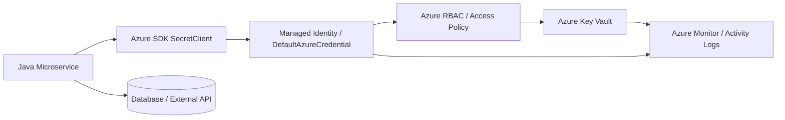
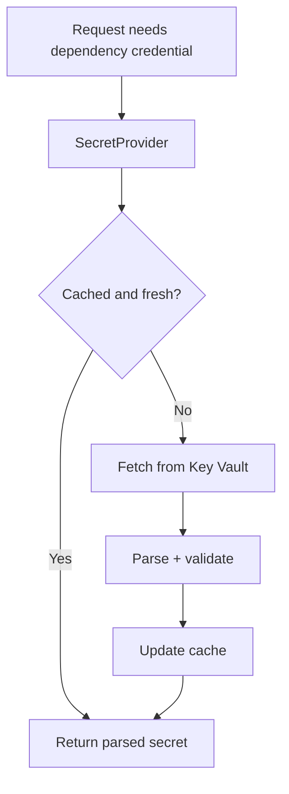
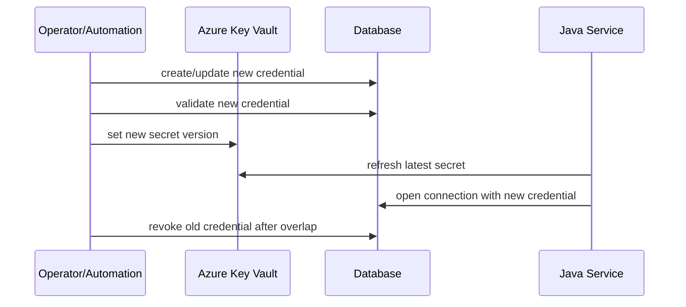
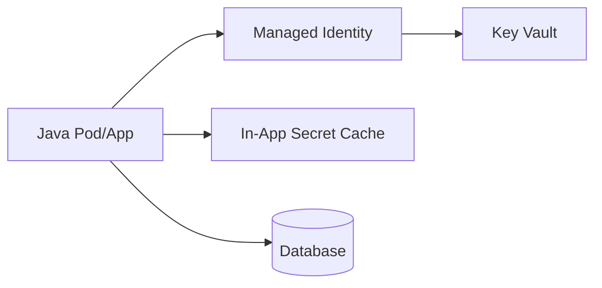
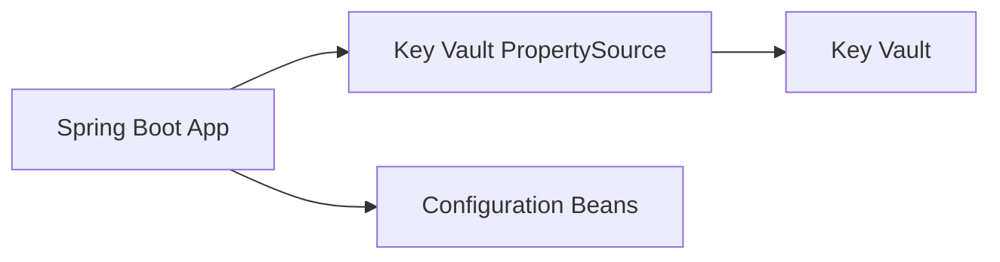
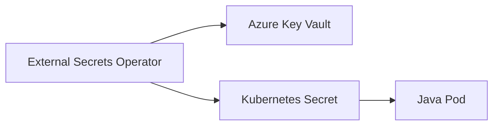
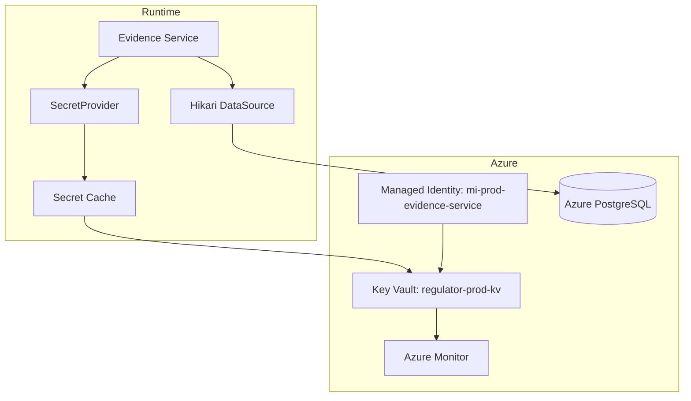

# Part 050 — Azure Key Vault with Java

> A cloud secret manager gives you a secure place to store secrets.
>
> A production Java service still needs a secure way to consume, cache, validate, rotate, and observe them.

Part ini membahas **Azure Key Vault** untuk Java microservices.

Kita tidak akan berhenti di quickstart `SecretClient.getSecret()`. Kita akan memposisikan Key Vault sebagai **secret authority** dalam arsitektur production: identity via Managed Identity, access via RBAC/policy, retrieval via Azure SDK, integration via Spring Cloud Azure, caching/retry, rotation, and failure modeling.

Yang akan kita bahas:

- mental model Azure Key Vault;
- Managed Identity dan `DefaultAzureCredential`;
- `SecretClient` dan SDK boundary;
- naming/versioning secret;
- Spring Cloud Azure Key Vault PropertySource;
- cache dan retry;
- rotation dan service reload;
- Key Vault references vs direct SDK;
- observability;
- incident/failure model;
- production checklist.

---

## 1. Mental Model

Azure Key Vault menyimpan secret, key, dan certificate. Untuk part ini fokusnya **Key Vault Secrets**.

Dari perspektif Java microservice:



Secret retrieval bukan helper method biasa. Ia melibatkan:

- service identity;
- token acquisition;
- Key Vault data-plane authorization;
- network/API latency;
- throttling/retry behavior;
- secret version resolution;
- application caching;
- audit logs;
- operational failure policy.

---

## 2. What Azure Key Vault Solves

Azure Key Vault membantu:

| Problem | Capability |
|---|---|
| Secret tidak boleh disimpan di code | Managed secret storage |
| Akses harus dikontrol | Azure RBAC atau access policy |
| Workload tidak boleh punya static credential | Managed Identity |
| Secret perlu versioning | Secret versions |
| Akses perlu audit | Azure Monitor / logs |
| Integrasi Java/Spring | Azure SDK + Spring Cloud Azure |
| Certificate/key material | Key Vault Certificates/Keys, di luar scope utama part ini |

Namun Key Vault tidak otomatis menyelesaikan:

- secret value bocor di log Java;
- semua property Spring terekspos di actuator;
- cache terlalu lama dan rotation lambat;
- service crash saat Key Vault unreachable;
- Managed Identity salah assign;
- RBAC terlalu luas;
- connection pool masih memakai credential lama;
- secret dan config dicampur sembarangan.

---

## 3. Managed Identity First

Di Azure production workload, prefer **Managed Identity** dibanding menyimpan client secret untuk mengakses Key Vault.

Mental model:

```txt
Application does not hold Azure credential.
Platform assigns an identity to the workload.
Azure SDK obtains token for that identity.
Key Vault authorizes that identity to read specific secrets.
```

`DefaultAzureCredential` dari Azure Identity library mencoba beberapa mekanisme credential berurutan, termasuk environment, managed identity, developer tooling, dan lainnya sesuai runtime. Ini membuat developer lokal dan workload cloud bisa memakai pola auth yang sama, tetapi production harus dikunci dengan identity yang tepat.

### 3.1 System-Assigned vs User-Assigned Managed Identity

| Type | Cocok untuk | Trade-off |
|---|---|---|
| System-assigned | satu identity melekat ke satu resource | lifecycle ikut resource |
| User-assigned | identity reusable lintas resource | perlu governance lebih eksplisit |

Untuk microservice platform, user-assigned identity sering lebih mudah diaudit dan dikelola sebagai service identity eksplisit.

Contoh naming:

```txt
mi-prod-evidence-service
mi-prod-case-service
mi-staging-evidence-service
```

Jangan pakai satu managed identity bersama untuk banyak service sensitif.

---

## 4. Secret Naming Convention

Azure Key Vault secret name punya constraint tertentu dan biasanya tidak memakai slash seperti AWS secret path. Gunakan delimiter aman seperti hyphen.

Naming buruk:

```txt
password
prod-secret
api-key
connection-string
```

Naming lebih baik:

```txt
prod-evidence-service-postgres-writer
prod-evidence-service-risk-api-client-secret
staging-case-service-postgres-reader
```

Aturan:

```txt
<environment>-<service>-<dependency>-<capability>
```

Tambahkan metadata/tag jika governance membutuhkan:

```txt
environment=prod
service=evidence-service
owner=evidence-platform
classification=restricted
rotation=manual-30d
criticality=high
```

Secret name boleh informatif, tetapi jangan mengandung value, token, account number sensitif, atau informasi yang memperbesar blast radius jika terlihat di log.

---

## 5. Secret Value and Schema

Azure Key Vault Secret value adalah string. Untuk payload multi-field, simpan JSON string.

Database secret:

```json
{
  "username": "evidence_writer",
  "password": "REDACTED",
  "host": "evidence-prod.postgres.database.azure.com",
  "port": 5432,
  "database": "regulator",
  "sslMode": "require"
}
```

External API credential:

```json
{
  "clientId": "evidence-service-prod",
  "clientSecret": "REDACTED",
  "tokenEndpoint": "https://partner.example.com/oauth/token",
  "scope": "evidence.write"
}
```

Invariant:

```txt
Secret payload must contain only secret/capability material needed by the consumer,
not general application configuration.
```

Jangan taruh `maxUploadSize`, `featureFlag`, atau `retryCount` di secret JSON kecuali nilainya sendiri sensitif.

---

## 6. Java SDK: SecretClient

Dependency Maven contoh:

```xml
<dependency>
  <groupId>com.azure</groupId>
  <artifactId>azure-security-keyvault-secrets</artifactId>
</dependency>
<dependency>
  <groupId>com.azure</groupId>
  <artifactId>azure-identity</artifactId>
</dependency>
```

Client bean:

```java
@Configuration
@EnableConfigurationProperties(AzureKeyVaultProperties.class)
public class AzureKeyVaultConfig {

    @Bean
    SecretClient secretClient(AzureKeyVaultProperties properties) {
        return new SecretClientBuilder()
            .vaultUrl(properties.vaultUrl())
            .credential(new DefaultAzureCredentialBuilder().build())
            .buildClient();
    }
}
```

Typed config:

```java
@ConfigurationProperties(prefix = "azure.key-vault")
@Validated
public record AzureKeyVaultProperties(
    @NotBlank String vaultUrl
) {}
```

Application YAML:

```yaml
azure:
  key-vault:
    vault-url: https://regulator-prod-kv.vault.azure.net/
```

### 6.1 Client Lifecycle

Treat `SecretClient` like a reusable infrastructure client:

- create once;
- inject as bean;
- do not build per request;
- configure retry/timeout deliberately if needed;
- wrap it behind domain-specific secret provider.

---

## 7. Secret Retrieval Wrapper

Avoid letting all components call `secretClient.getSecret()` directly.

Define a port:

```java
public interface SecretProvider<T> {
    T getCurrent();
}
```

Azure implementation:

```java
public final class AzureJsonSecretProvider<T> implements SecretProvider<T> {
    private final SecretClient client;
    private final String secretName;
    private final Class<T> type;
    private final ObjectMapper objectMapper;
    private final Validator validator;

    public AzureJsonSecretProvider(
        SecretClient client,
        String secretName,
        Class<T> type,
        ObjectMapper objectMapper,
        Validator validator
    ) {
        this.client = client;
        this.secretName = secretName;
        this.type = type;
        this.objectMapper = objectMapper;
        this.validator = validator;
    }

    @Override
    public T getCurrent() {
        try {
            KeyVaultSecret secret = client.getSecret(secretName);
            T parsed = objectMapper.readValue(secret.getValue(), type);
            validate(parsed);
            return parsed;
        } catch (HttpResponseException ex) {
            throw AzureSecretAccessException.from(secretName, ex);
        } catch (JsonProcessingException ex) {
            throw new SecretSchemaException("Invalid JSON secret payload name=" + safeName(secretName), ex);
        }
    }

    private void validate(T parsed) {
        Set<ConstraintViolation<T>> violations = validator.validate(parsed);
        if (!violations.isEmpty()) {
            throw new SecretSchemaException("Secret validation failed name=" + safeName(secretName));
        }
    }

    private static String safeName(String name) {
        return name == null ? "[null]" : name.replaceAll("(?i)(password|secret|token)", "[REDACTED]");
    }
}
```

Notice:

- secret value never logged;
- SDK exception is mapped;
- payload is parsed into typed model;
- validation failure is explicit;
- secret name is sanitized for logs.

---

## 8. Versioning

Azure Key Vault supports versions for secrets. `getSecret(name)` retrieves the latest version by default, while `getSecret(name, version)` retrieves a specific version.

Versioning matters for:

- rollback;
- rotation;
- audit;
- canary validation;
- incident investigation.

### 8.1 Default Version vs Pinned Version

| Strategy | Use Case | Risk |
|---|---|---|
| latest version | normal runtime secret | unexpected version adoption if rotation broken |
| pinned version | forensic/reproducible process | rotation not adopted automatically |
| explicit version during canary | testing new credential | extra orchestration needed |

For normal services, use latest/current secret but validate and observe refresh.

For regulatory evidence processing, if a secret version affects a cryptographic decision, record version metadata in audit event.

Example audit attribute:

```txt
secretAlias=prod-evidence-service-signing-key
secretVersion=8f3c...
```

Do not record secret value.

---

## 9. Caching Strategy

Direct `getSecret()` in every business request is bad design.

Why:

- adds latency;
- increases dependency on Key Vault availability;
- risks throttling;
- increases cost;
- makes hot path fragile.

Use cache:



Cache policy must answer:

- TTL?
- max stale?
- refresh eager or lazy?
- refresh jitter?
- fail closed or serve stale?
- how to detect rotation?
- how to evict old connection/client?

### 9.1 Cache Wrapper

```java
public final class TimeBoundSecretCache<T> implements SecretProvider<T> {
    private final SecretProvider<T> delegate;
    private final Duration ttl;
    private final Duration maxStale;

    private volatile Entry<T> entry;

    public TimeBoundSecretCache(SecretProvider<T> delegate, Duration ttl, Duration maxStale) {
        this.delegate = delegate;
        this.ttl = ttl;
        this.maxStale = maxStale;
    }

    @Override
    public T getCurrent() {
        Instant now = Instant.now();
        Entry<T> snapshot = entry;

        if (snapshot != null && snapshot.expiresAt().isAfter(now)) {
            return snapshot.value();
        }

        try {
            T refreshed = delegate.getCurrent();
            entry = new Entry<>(refreshed, now.plus(ttl), now.plus(ttl).plus(maxStale));
            return refreshed;
        } catch (RuntimeException ex) {
            if (snapshot != null && snapshot.maxStaleUntil().isAfter(now)) {
                return snapshot.value();
            }
            throw ex;
        }
    }

    private record Entry<T>(T value, Instant expiresAt, Instant maxStaleUntil) {}
}
```

For critical secrets, decide whether max stale is allowed. A database password may be safely stale during transient Key Vault outage if the DB credential is still valid. A revoked signing key may need fail-closed.

---

## 10. Spring Cloud Azure Key Vault PropertySource

Spring Cloud Azure can construct a Spring `PropertySource` backed by Azure Key Vault Secrets. This allows secrets to be resolved like configuration properties.

Example conceptual config:

```yaml
spring:
  cloud:
    azure:
      keyvault:
        secret:
          property-sources:
            - endpoint: https://regulator-prod-kv.vault.azure.net/
```

Usage:

```java
@Component
public class ExternalApiClientFactory {
    public ExternalApiClientFactory(
        @Value("${prod-evidence-service-risk-api-client-secret}") String clientSecret
    ) {
        // use carefully; do not log
    }
}
```

### 10.1 When PropertySource Is Useful

Good for:

- simple secrets mapped to Spring config;
- conventional Boot application;
- startup-time secret resolution;
- reducing custom SDK code.

Be careful for:

- secrets that need dynamic refresh;
- multi-field JSON secrets;
- secret values that may leak via config introspection;
- actuator exposure;
- generic `Environment` access.

### 10.2 PropertySource Risk

Spring Environment is broad. Many components can read it. Some diagnostics can expose it if misconfigured.

Guardrails:

- lock down actuator endpoints;
- configure sanitization;
- avoid logging full property sources;
- avoid binding secret into object with unsafe `toString()`;
- use explicit secret provider for high-risk material.

---

## 11. Key Vault References vs Direct SDK

Azure ecosystems also support Key Vault references in certain services, where platform resolves secret references and injects them to application config.

Decision:

| Pattern | Pros | Cons |
|---|---|---|
| Direct SDK | explicit code, typed validation, custom cache | app depends on Azure SDK and Key Vault availability |
| Spring Cloud Azure PropertySource | Spring-native, low custom code | broad environment exposure risk |
| Platform Key Vault reference | app simpler, platform handles retrieval | less control over refresh/version/error semantics |
| External Secrets to Kubernetes Secret | Kubernetes-native, decouples app from Azure SDK | Secret copied into cluster secret store |

For high-sensitivity services, direct SDK or carefully configured Spring Cloud Azure is easier to reason about than opaque injection.

---

## 12. Access Control Model

Azure Key Vault data-plane access can be controlled with Azure RBAC or vault access policies depending on configuration and organization standards.

Production principle:

```txt
A service identity should be allowed to read only the secrets it consumes,
not every secret in the vault.
```

If a vault is shared by many services, broad roles at vault scope can become dangerous. Prefer:

- separate vault per environment/security domain;
- narrow role assignment;
- naming/tag governance;
- managed identity per service;
- no human broad access except break-glass;
- audit role assignments.

### 12.1 Vault Boundary

Possible vault layouts:

| Layout | Pros | Cons |
|---|---|---|
| one vault per environment | simple | broad blast radius |
| one vault per domain | better isolation | more operations |
| one vault per service | strong isolation | high management overhead |
| one vault per security tier | balanced | needs governance |

Regulated systems often benefit from separating high-sensitivity secrets into dedicated vaults.

---

## 13. Retry, Timeout, and Throttling

Secret retrieval is a remote call. Design it like one.

Guidelines:

- set reasonable SDK retry policy;
- do not call Key Vault in hot path without cache;
- use bounded timeouts;
- add jitter to background refresh;
- alert on throttling;
- avoid all pods refreshing at the same second after deployment.

Background refresh model:

```java
@Scheduled(fixedDelayString = "${secrets.refresh-delay:PT5M}")
public void refreshSecrets() {
    try {
        databaseSecretCache.refresh();
        metrics.counter("secret_refresh_success_total", "secret", "db-writer").increment();
    } catch (Exception ex) {
        metrics.counter("secret_refresh_failure_total", "secret", "db-writer").increment();
        log.warn("Secret refresh failed secretAlias=db-writer reason={}", ex.getClass().getSimpleName());
    }
}
```

Never include secret value in exception message.

---

## 14. Rotation

Key Vault secret versions support rotation workflows, but application adoption still needs design.

Rotation flow:



### 14.1 Database Rotation and Connection Pool

Same issue as AWS/Vault:

```txt
Secret manager version changed does not automatically update JDBC connections.
```

Strategies:

| Strategy | Simplicity | Runtime Smoothness |
|---|---:|---:|
| rolling restart after secret update | high | medium |
| rebuild datasource on refresh | medium | high but complex |
| dynamic credential provider per connection | low simplicity | high |
| short-lived credential + pool max lifetime | medium | medium/high |

For most Java microservices, start with rolling restart unless downtime constraints require runtime pool switching.

### 14.2 Rotation Invariant

```txt
Old credential must remain valid until all app instances have refreshed
or restarted and old connections have drained.
```

Observe before revoke:

- new credential login count;
- old credential login count decreasing;
- connection pool age;
- app deployment status;
- auth failure metrics.

---

## 15. Fail-Fast vs Degraded Mode

Not every secret is equal.

| Secret | Startup Behavior | Runtime Failure Behavior |
|---|---|---|
| primary DB credential | fail startup | readiness down if no valid credential |
| optional partner API key | start degraded | disable integration temporarily |
| signing key | fail closed | reject signing operation |
| telemetry token | start without telemetry if allowed | degrade observability with alert |

Decision matrix:

```txt
If secret is required for correctness/security -> fail closed.
If secret is required only for optional integration -> degrade explicitly.
If stale secret is allowed -> define max stale and audit it.
```

---

## 16. Observability

### 16.1 Metrics

```txt
azure_keyvault_secret_fetch_success_total{secret="db-writer"}
azure_keyvault_secret_fetch_failure_total{secret="db-writer",reason="unauthorized"}
azure_keyvault_secret_fetch_duration_seconds{secret="db-writer"}
secret_cache_hit_total{secret="db-writer"}
secret_cache_miss_total{secret="db-writer"}
secret_refresh_failure_total{secret="db-writer"}
secret_last_successful_refresh_age_seconds{secret="db-writer"}
secret_stale_served_total{secret="db-writer"}
```

### 16.2 Logs

Good:

```txt
Key Vault secret refresh failed secretAlias=db-writer reason=HttpResponseException status=429
```

Bad:

```txt
Key Vault secret value={"username":"...","password":"..."}
```

### 16.3 Health Indicator

Health indicator should avoid exposing details:

```java
@Component
public class SecretHealthIndicator implements HealthIndicator {
    private final SecretRefreshState state;

    @Override
    public Health health() {
        if (state.requiredSecretHealthy()) {
            return Health.up()
                .withDetail("requiredSecrets", "available")
                .build();
        }
        return Health.down()
            .withDetail("requiredSecrets", "unavailable")
            .build();
    }
}
```

Do not include secret names if names are sensitive. Use aliases.

---

## 17. Security Pitfalls

### 17.1 Logging Secret Value

Never do this:

```java
KeyVaultSecret secret = client.getSecret("prod-db-password");
log.info("Loaded secret {}", secret.getValue());
```

Use redacted wrapper:

```java
public final class SecretString {
    private final String value;

    private SecretString(String value) {
        if (value == null || value.isBlank()) {
            throw new IllegalArgumentException("Secret value is required");
        }
        this.value = value;
    }

    public static SecretString of(String value) {
        return new SecretString(value);
    }

    public String reveal() {
        return value;
    }

    @Override
    public String toString() {
        return "[REDACTED]";
    }
}
```

### 17.2 Over-Broad Managed Identity

Bad:

```txt
mi-prod-shared-apps can read all secrets in prod vault.
```

Better:

```txt
mi-prod-evidence-service can read only:
- prod-evidence-service-postgres-writer
- prod-evidence-service-risk-api-client-secret
```

### 17.3 Secret as Feature Flag

Bad:

```txt
Key Vault secret value controls rollout percentage.
```

Use config/feature flag platform. Secret manager is for sensitive capability material.

### 17.4 Assuming Latest Version Is Always Valid

Latest secret version can be malformed due to human error. Always parse and validate.

---

## 18. Local Development

For local development, `DefaultAzureCredential` can authenticate through developer tooling. But avoid making local convenience leak into production assumptions.

Rules:

- local dev can use developer identity;
- production must use managed identity;
- local test secrets should be separate vault/environment;
- never give developer identity broad production secret read;
- integration tests should use test vault or mock provider;
- unit tests should not depend on live Key Vault.

Testing abstraction:

```java
public final class InMemorySecretProvider<T> implements SecretProvider<T> {
    private final T value;

    public InMemorySecretProvider(T value) {
        this.value = value;
    }

    @Override
    public T getCurrent() {
        return value;
    }
}
```

---

## 19. Production Deployment Patterns

### 19.1 Direct Key Vault SDK in App



Best when:

- service needs typed secret;
- custom cache/failure handling needed;
- security-critical consumption logic;
- clear Java ownership.

### 19.2 Spring Cloud Azure PropertySource



Best when:

- secret maps naturally to property;
- startup-time injection enough;
- actuator locked down;
- team wants minimal SDK code.

### 19.3 External Secrets Operator to Kubernetes Secret



Best when:

- platform standardizes secret sync;
- apps should be cloud-provider-light;
- Kubernetes Secret threat model is accepted;
- rollout/restart handles rotation.

---

## 20. Failure Modeling Table

| Scenario | Symptom | Expected Response |
|---|---|---|
| Managed identity missing | authentication failure | fail startup/readiness; alert platform |
| Identity lacks secret read | forbidden | fail closed; alert security/platform |
| Secret missing | not found | block deployment/startup |
| Secret disabled/deleted | retrieval failure | fail closed; incident path |
| Latest version malformed | JSON/validation failure | reject version; fail startup/refresh |
| Key Vault throttling | 429 / retry | cache, backoff, alert |
| Key Vault outage | timeout/failure | serve stale within allowed window or degrade |
| Old DB password revoked too early | DB auth failure | rollback/reissue credential; alert |
| Secret leaked in logs | sensitive data incident | rotate, purge logs if possible, audit blast radius |
| Wrong vault URL | startup failure | config validation/pipeline catch |

---

## 21. Example End-to-End Design

Scenario: `evidence-service` needs PostgreSQL writer credential.

Architecture:



Startup flow:

1. App starts with managed identity.
2. `SecretClient` is built with `DefaultAzureCredential`.
3. `DatabaseSecretProvider` retrieves secret.
4. JSON payload is parsed and validated.
5. DataSource is created.
6. DB connectivity check succeeds.
7. Readiness turns green.

Rotation flow:

1. New DB credential is created.
2. New Key Vault secret version is set.
3. Rolling restart or refresh mechanism picks new version.
4. New DB login observed.
5. Old credential revoked after safety window.

---

## 22. Checklist

### Identity

- Managed Identity used in production.
- Identity is per service/environment.
- No static Azure credential in app config.
- RBAC/access policy scoped to required secrets.

### Secret Design

- Naming convention clear.
- Payload schema documented.
- Secret contains only sensitive capability material.
- Versioning/rotation policy defined.
- Tags identify owner and classification.

### Java Code

- `SecretClient` is reused, not built per request.
- Secret access wrapped behind domain provider.
- Payload parsed into typed class.
- Validation applied.
- Secret values redacted in `toString()` and logs.
- Cache policy explicit.

### Spring

- Actuator endpoints secured.
- Sensitive keys sanitized.
- Avoid broad property exposure for high-risk secrets.
- Startup behavior defined.

### Rotation

- Rotation sequence tested.
- DB pool refresh/restart strategy defined.
- Old credential overlap window exists.
- Revocation is delayed until observation confirms adoption.

### Observability

- Fetch success/failure metrics.
- Cache hit/miss metrics.
- Refresh age metric.
- Alert on unauthorized, missing, malformed, stale, throttled.
- Logs contain aliases, not secret values.

---

## 23. ADR Template

```mdx
# ADR: Azure Key Vault Usage for Evidence Service

## Context
Evidence Service needs PostgreSQL writer credential in production.

## Decision
Use Azure Key Vault as secret authority.
Vault: regulator-prod-kv
Secret: prod-evidence-service-postgres-writer
Identity: mi-prod-evidence-service

## Access Control
Managed Identity can read only required Evidence Service secrets.
Human access requires break-glass approval.

## Secret Payload Schema
- username
- password
- host
- port
- database
- sslMode

## Consumption Pattern
Java service uses SecretClient via DefaultAzureCredential.
Secret is parsed, validated, and cached.
Datasource is built after successful retrieval.

## Rotation
New secret version is created after DB credential update.
Consumer adoption is via rolling restart.
Old DB credential remains valid until restart completes + safety margin.

## Failure Behavior
Required DB secret missing/invalid -> startup fails.
Transient Key Vault issue during runtime -> stale cache allowed for 15 minutes.
Beyond max stale -> readiness down.

## Observability
Metrics for fetch, cache, refresh age, validation failure.
Alerts for unauthorized, not found, stale beyond max window.
```

---

## 24. Key Takeaways

Azure Key Vault is strongest when paired with workload identity, narrow authorization, typed secret parsing, explicit cache behavior, and tested rotation.

Core principles:

1. **Use Managed Identity in production.**
2. **Do not give one identity broad access to many secrets.**
3. **Wrap `SecretClient`; do not scatter SDK calls across the codebase.**
4. **Parse and validate secret payloads like external contracts.**
5. **Cache deliberately and define max-stale behavior.**
6. **Treat rotation as a service lifecycle event, not just a vault update.**
7. **Protect Spring Environment and actuator surfaces.**
8. **Observe secret dependency health without exposing secret material.**

Di part berikutnya kita akan membahas **Google Secret Manager with Java** dan bagaimana pattern cloud secret manager tetap sama meskipun API provider berbeda.

---

## References

- Azure Key Vault Secret client library for Java: https://learn.microsoft.com/en-us/java/api/overview/azure/security-keyvault-secrets-readme
- Azure `SecretClient` Java API: https://learn.microsoft.com/en-us/java/api/com.azure.security.keyvault.secrets.secretclient
- Azure Key Vault Secret client quickstart for Java: https://learn.microsoft.com/en-us/azure/key-vault/secrets/quick-create-java
- Azure Identity client library for Java: https://learn.microsoft.com/en-us/java/api/overview/azure/identity-readme
- Spring Cloud Azure secret management: https://learn.microsoft.com/en-us/azure/developer/java/spring-framework/secret-management
- Azure Key Vault Secrets configuration properties for Spring Cloud Azure: https://learn.microsoft.com/en-us/azure/developer/java/spring-framework/configuration-properties-azure-key-vault-secrets
