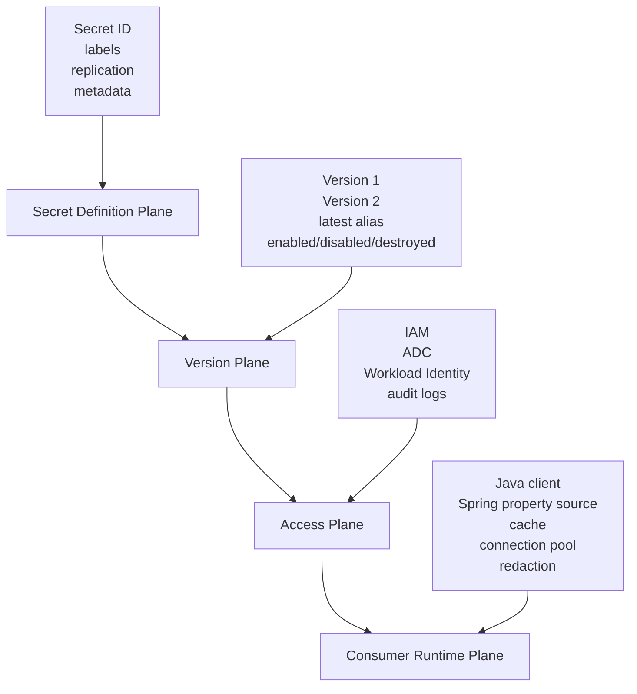
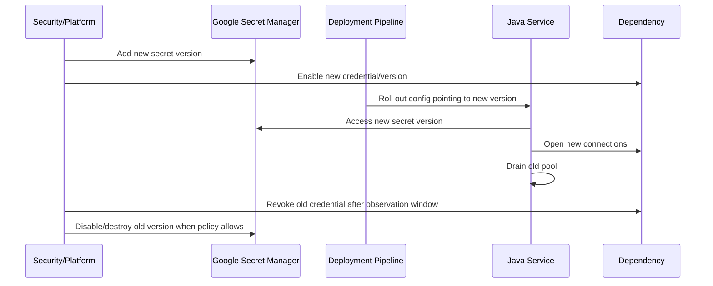

# Part 051 — Google Secret Manager with Java

> Secret Manager is not a magic vault inside your application.
>
> It is a control plane for sensitive capabilities. Your Java service is still responsible for how those capabilities are consumed.

Di part sebelumnya kita membahas Vault, AWS Secrets Manager, dan Azure Key Vault. Sekarang kita masuk ke **Google Secret Manager** dari perspektif Java microservices.

Tujuan part ini bukan sekadar “cara ambil secret dari GCP”. Itu terlalu dangkal. Yang kita butuhkan adalah desain production-grade:

- secret identity yang stabil;
- secret version yang eksplisit;
- IAM boundary yang minimal;
- integration dengan Java client dan Spring Boot;
- caching yang aman;
- rotation tanpa downtime;
- failure mode yang bisa diprediksi;
- redaction di logs/metrics/traces;
- observability dan audit trail;
- alignment dengan Kubernetes/GKE Workload Identity.

Google Secret Manager menyimpan **secret** sebagai container metadata dan **secret version** sebagai payload aktual. Saat service mengakses secret version, API mengembalikan content dan metadata; version bisa diakses dengan nomor spesifik atau alias seperti `latest`. Model ini kelihatan sederhana, tetapi pilihan antara `latest` dan pinned version punya konsekuensi besar untuk rollback, audit, dan rotation.

---

## 1. Mental Model

Google Secret Manager dapat dipahami sebagai empat plane:



### 1.1 Secret Is Not the Same as Secret Version

Jangan campur konsep ini.

| Concept | Makna |
|---|---|
| Secret | Nama logical, metadata, replication policy, labels |
| Secret version | Payload aktual untuk satu versi |
| Version ID | Nomor versi immutable seperti `1`, `2`, `3` |
| Alias | Nama pointer seperti `latest` |
| Payload | Byte content yang digunakan aplikasi |
| IAM policy | Siapa boleh mengakses secret |
| Audit log | Bukti akses dan perubahan |

Contoh resource naming:

```txt
projects/regulator-prod/secrets/evidence-db-password
projects/regulator-prod/secrets/evidence-db-password/versions/7
projects/regulator-prod/secrets/evidence-db-password/versions/latest
```

### 1.2 Core Invariant

```txt
A Java service must never treat a secret payload as ordinary configuration.

Secret payload has sensitivity, provenance, access boundary, rotation lifecycle,
failure mode, and audit implications.
```

Konsekuensinya:

- secret tidak boleh tercetak di log;
- secret tidak boleh masuk metrics label;
- secret tidak boleh masuk exception message;
- secret tidak boleh di-dump via actuator endpoint;
- secret cache harus punya TTL dan invalidation strategy;
- secret access harus least privilege;
- secret rotation harus diuji sebagai runtime scenario.

---

## 2. When to Use Google Secret Manager

Gunakan Google Secret Manager untuk:

- database password;
- external API token;
- private key material;
- webhook signing secret;
- SMTP credential;
- symmetric encryption material yang dikelola sebagai secret;
- third-party integration credential;
- bootstrap credential untuk mengambil dynamic capability lain.

Jangan gunakan untuk:

- non-sensitive application config;
- feature flag;
- large binary file;
- per-request token dengan volume tinggi;
- data yang harus queryable;
- object yang perlu transaksi multi-row;
- file evidence/domain attachment.

Decision rule:

```txt
If disclosure grants capability, treat it as secret.
If disclosure merely explains behavior, it is probably configuration.
```

---

## 3. Secret Naming and Ownership

Nama secret harus stabil, environment-aware, dan domain-aware.

Buruk:

```txt
password
prod-password
app-secret
latest-db-pass
```

Lebih baik:

```txt
evidence-service-prod-postgres-writer
evidence-service-prod-objectstore-signer
case-service-prod-webhook-hmac-key
reporting-service-staging-smtp-password
```

Tetapi jangan memasukkan nilai sensitif ke nama secret. Nama secret bisa muncul di audit log, IAM policy, dashboard, dan error message.

### 3.1 Naming Convention

Gunakan struktur:

```txt
<service>-<env>-<dependency>-<capability>
```

Contoh:

```txt
evidence-service-prod-postgres-writer
evidence-service-prod-antivirus-api-token
evidence-service-prod-pdf-signing-key
```

### 3.2 Ownership Metadata

Gunakan labels/metadata atau catalog terpisah:

```yaml
secret: evidence-service-prod-postgres-writer
ownerService: evidence-service
ownerTeam: enforcement-platform
riskOwner: security-platform
environment: prod
dependency: postgres
capability: writer
rotationPolicy: 30d
consumerReload: rolling-restart
blastRadius: evidence schema write access
```

Ownership bukan kosmetik. Ownership menentukan:

- siapa approve akses IAM;
- siapa handle rotation;
- siapa dipanggil saat secret leak;
- siapa membuktikan access audit;
- siapa menerima alert sebelum credential expired.

---

## 4. IAM Boundary

Secret Manager access harus diberikan ke workload identity yang spesifik, bukan broad project-level identity.

### 4.1 Recommended Shape

```txt
Kubernetes ServiceAccount: evidence-service
Google Service Account: evidence-service-prod@project.iam.gserviceaccount.com
Secret Accessor: only specific required secrets
```

Jangan:

```txt
Grant roles/secretmanager.secretAccessor to default compute service account
at project level for every workload.
```

Lebih baik:

```txt
Grant access only to:
projects/regulator-prod/secrets/evidence-service-prod-postgres-writer
projects/regulator-prod/secrets/evidence-service-prod-antivirus-api-token
```

### 4.2 Least Privilege Invariant

```txt
A workload identity may access only secrets required for its runtime behavior,
and only in the environment where it runs.
```

Anti-pattern:

```txt
staging service identity can read prod secret.
prod service identity can read unrelated team secrets.
CI/CD deployer can read runtime database passwords without need.
```

---

## 5. Authentication from Java

Untuk Java service di Google Cloud, authentication umumnya memakai **Application Default Credentials**.

Di local development:

```txt
gcloud auth application-default login
```

Di GKE production:

```txt
Kubernetes ServiceAccount -> Workload Identity -> Google Service Account
```

Di Cloud Run/GCE:

```txt
Runtime service account -> IAM permission -> Secret Manager
```

Production rule:

```txt
Do not ship JSON service account keys inside container images.
```

Service account key file adalah long-lived secret. Jika bocor, blast radius besar dan revocation sering lambat.

---

## 6. Java Client Library Usage

Minimal direct access dengan Google Cloud Java client:

```java
import com.google.cloud.secretmanager.v1.AccessSecretVersionRequest;
import com.google.cloud.secretmanager.v1.AccessSecretVersionResponse;
import com.google.cloud.secretmanager.v1.SecretManagerServiceClient;
import com.google.cloud.secretmanager.v1.SecretVersionName;

public final class GoogleSecretManagerClient implements SecretProvider {
    private final SecretManagerServiceClient client;
    private final String projectId;

    public GoogleSecretManagerClient(
        SecretManagerServiceClient client,
        String projectId
    ) {
        this.client = client;
        this.projectId = projectId;
    }

    @Override
    public SecretValue getSecret(String secretId, String version) {
        SecretVersionName name = SecretVersionName.of(projectId, secretId, version);

        AccessSecretVersionRequest request = AccessSecretVersionRequest.newBuilder()
            .setName(name.toString())
            .build();

        AccessSecretVersionResponse response = client.accessSecretVersion(request);

        return SecretValue.of(response.getPayload().getData().toStringUtf8());
    }
}
```

Secret wrapper:

```java
public final class SecretValue {
    private final String value;

    private SecretValue(String value) {
        if (value == null || value.isBlank()) {
            throw new IllegalArgumentException("Secret value must not be blank");
        }
        this.value = value;
    }

    public static SecretValue of(String value) {
        return new SecretValue(value);
    }

    public String reveal() {
        return value;
    }

    @Override
    public String toString() {
        return "[REDACTED]";
    }
}
```

### 6.1 Client Lifecycle

`SecretManagerServiceClient` harus dibuat sebagai singleton bean dan ditutup saat application shutdown.

```java
@Configuration
class SecretManagerConfiguration {

    @Bean(destroyMethod = "close")
    SecretManagerServiceClient secretManagerServiceClient() throws IOException {
        return SecretManagerServiceClient.create();
    }
}
```

Jangan membuat client baru per request. Itu menambah latency, connection overhead, dan failure surface.

---

## 7. Payload Integrity: CRC32C

Google Secret Manager response menyediakan checksum untuk membantu memverifikasi payload. Production consumer sebaiknya memverifikasi integrity saat mengambil secret, terutama jika secret dipakai untuk capability sensitif.

Sketch:

```java
public SecretValue getSecretWithIntegrityCheck(String secretId, String version) {
    SecretVersionName name = SecretVersionName.of(projectId, secretId, version);

    AccessSecretVersionResponse response = client.accessSecretVersion(
        AccessSecretVersionRequest.newBuilder().setName(name.toString()).build()
    );

    byte[] payload = response.getPayload().getData().toByteArray();
    long expected = response.getPayload().getDataCrc32C();
    long actual = Crc32c.compute(payload);

    if (actual != expected) {
        throw new SecretIntegrityException("Secret payload checksum mismatch");
    }

    return SecretValue.of(new String(payload, StandardCharsets.UTF_8));
}
```

Implementation detail untuk CRC32C bisa memakai library yang cocok di project. Prinsipnya lebih penting:

```txt
Do not silently accept corrupted secret payload.
```

---

## 8. `latest` vs Pinned Version

Ini keputusan arsitektural.

| Strategy | Kelebihan | Risiko |
|---|---|---|
| Use `latest` | Rotation mudah, tidak perlu config change | Rollback/audit lebih kabur, change bisa memengaruhi runtime tiba-tiba |
| Pin version number | Audit jelas, reproducible, rollout controlled | Rotation butuh config/redeploy/update |
| Alias-based promotion | Bisa promotion terkontrol | Perlu governance alias |

### 8.1 Production Recommendation

Gunakan policy berikut:

```txt
Use pinned version for startup-critical and high-risk secrets.
Use latest only for low-risk secrets or when reload/rotation flow is mature.
```

Contoh startup-critical:

- DB credential;
- signing key;
- encryption secret;
- external payment API credential;
- identity provider client secret.

Untuk secret seperti ini, perubahan payload harus melewati promotion pipeline, bukan berubah diam-diam karena `latest` bergeser.

### 8.2 Effective Secret Snapshot

Saat startup, service sebaiknya tahu:

```txt
secretId=evidence-service-prod-postgres-writer
version=7
loadedAt=2026-07-05T09:00:00Z
source=google-secret-manager
project=regulator-prod
value=[REDACTED]
```

Log provenance, bukan value.

---

## 9. Spring Boot Integration

Ada dua pendekatan umum:

1. direct client usage;
2. Spring Cloud GCP Secret Manager property source.

### 9.1 Direct Client Usage

Cocok untuk:

- secret lifecycle kompleks;
- checksum verification custom;
- caching custom;
- rotation logic;
- per-dependency failure handling;
- explicit observability.

```java
@Service
public final class DatabaseCredentialProvider {
    private final SecretProvider secretProvider;
    private final CredentialProperties properties;

    public DatabaseCredentialProvider(
        SecretProvider secretProvider,
        CredentialProperties properties
    ) {
        this.secretProvider = secretProvider;
        this.properties = properties;
    }

    public DatabaseCredential load() {
        SecretValue username = secretProvider.getSecret(
            properties.usernameSecretId(),
            properties.usernameSecretVersion()
        );
        SecretValue password = secretProvider.getSecret(
            properties.passwordSecretId(),
            properties.passwordSecretVersion()
        );

        return new DatabaseCredential(username, password);
    }
}
```

### 9.2 Spring Property Source

Spring Cloud GCP dapat expose Secret Manager sebagai property source, sehingga secret bisa direferensikan seperti property Spring.

Contoh konseptual:

```yaml
spring:
  config:
    import: sm://

app:
  datasource:
    username: ${sm://evidence-service-prod-postgres-username}
    password: ${sm://evidence-service-prod-postgres-password}
```

Periksa versi Spring Cloud GCP yang dipakai karena detail syntax dan bootstrap/config data behavior dapat berbeda antar versi.

### 9.3 Caution

Property source membuat penggunaan mudah, tetapi juga berbahaya:

- secret bisa ikut muncul di config dump jika endpoint tidak diamankan;
- property binding bisa masuk exception message;
- developer bisa menganggap secret sebagai config biasa;
- reload behavior bisa tidak sesuai ekspektasi;
- provenance version bisa kabur jika memakai `latest`.

Untuk secret kritikal, direct client wrapper sering lebih eksplisit dan lebih mudah diaudit.

---

## 10. Typed Secret Payload

Secret payload sering berupa JSON, bukan string tunggal.

Contoh payload:

```json
{
  "username": "evidence_writer",
  "password": "redacted",
  "host": "postgres.internal",
  "port": 5432,
  "database": "evidence"
}
```

Representasi Java:

```java
public record PostgresSecretPayload(
    String username,
    String password,
    String host,
    int port,
    String database
) {
    public PostgresSecretPayload {
        if (username == null || username.isBlank()) throw new IllegalArgumentException("username required");
        if (password == null || password.isBlank()) throw new IllegalArgumentException("password required");
        if (host == null || host.isBlank()) throw new IllegalArgumentException("host required");
        if (port < 1 || port > 65535) throw new IllegalArgumentException("invalid port");
        if (database == null || database.isBlank()) throw new IllegalArgumentException("database required");
    }
}
```

Parsing:

```java
public PostgresSecretPayload loadPostgresPayload(String secretId, String version) {
    SecretValue value = secretProvider.getSecret(secretId, version);

    try {
        return objectMapper.readValue(value.reveal(), PostgresSecretPayload.class);
    } catch (JsonProcessingException ex) {
        throw new SecretPayloadException("Invalid secret payload schema for " + secretId, ex);
    }
}
```

Never log `value.reveal()`.

---

## 11. Caching Strategy

Secret Manager call adds network dependency. Do not fetch secret on every request.

Use cache for:

- startup secret load;
- low-frequency refresh;
- dependency client construction;
- background rotation check.

Avoid cache for:

- high-frequency per-request direct access;
- unbounded secret set;
- secrets that must be immediately revoked;
- security-critical decision where stale value is unacceptable.

### 11.1 Cache Shape

```java
public final class CachedSecretProvider implements SecretProvider {
    private final SecretProvider delegate;
    private final Duration ttl;
    private final ConcurrentHashMap<SecretRef, CacheEntry> cache = new ConcurrentHashMap<>();

    public CachedSecretProvider(SecretProvider delegate, Duration ttl) {
        this.delegate = delegate;
        this.ttl = ttl;
    }

    @Override
    public SecretValue getSecret(String secretId, String version) {
        SecretRef ref = new SecretRef(secretId, version);
        CacheEntry current = cache.get(ref);

        if (current != null && !current.isExpired(ttl)) {
            return current.value();
        }

        SecretValue loaded = delegate.getSecret(secretId, version);
        cache.put(ref, new CacheEntry(loaded, Instant.now()));
        return loaded;
    }
}
```

### 11.2 Cache Invariants

```txt
Secret cache must have explicit TTL.
Secret cache must expose refresh failure metric.
Secret cache must not log payload.
Secret cache must support forced invalidation.
Secret cache must not cache access-denied as success.
```

---

## 12. Rotation Design

Google Secret Manager versioning makes rotation straightforward at storage layer, but consumer behavior determines whether rotation is safe.

### 12.1 Rotation Flow



### 12.2 Database Credential Rotation

For JDBC/HikariCP:

- old pool may keep existing connections;
- new credential may only apply when new connections are created;
- pool max lifetime controls how long old credential can remain active;
- aggressive full restart can cause thundering herd;
- no-overlap rotation can cause outage.

Design rule:

```txt
Secret rotation must include dependency-side overlap window and consumer-side connection refresh behavior.
```

### 12.3 `latest` Rotation

If service uses `latest`, rotation can happen without deployment. That is convenient but risky.

Required controls:

- refresh interval;
- observability of active version;
- rollback plan;
- canary consumer;
- old version not destroyed immediately;
- manual force refresh;
- error budget for failed refresh.

---

## 13. Failure Modeling

| Failure | Cause | Expected Behavior |
|---|---|---|
| Access denied | IAM removed or wrong workload identity | fail startup or readiness, alert security/platform |
| Secret not found | wrong ID/env/project | fail startup, no fallback to unsafe default |
| Version disabled | rotation mistake | fail closed, rollback to known-good version if allowed |
| Payload invalid | malformed JSON/schema | fail startup or dependency unavailable |
| Network timeout | Secret Manager/API unavailable | use valid cached value if safe, expose degraded state |
| Checksum mismatch | corruption/transmission issue | reject payload, alert |
| Quota exceeded | too many fetches | cache, backoff, reduce per-request access |
| Stale secret | old value cached too long | refresh metric, version observation, rotation runbook |

### 13.1 Startup-Critical Secret

For DB password:

```txt
If secret cannot be loaded, service must not become ready.
```

### 13.2 Optional Integration Secret

For optional external provider:

```txt
If secret cannot be loaded, disable that integration and expose degraded readiness/health detail.
```

Do not silently proceed with null/empty fallback.

---

## 14. Redaction and Safe Logging

Bad:

```java
log.info("Loaded secret {} value={}", secretId, secretValue.reveal());
```

Good:

```java
log.info(
    "Loaded secret secretId={} version={} source={} value={}",
    secretId,
    version,
    "google-secret-manager",
    "[REDACTED]"
);
```

Structured event:

```java
public record SecretLoadEvent(
    String secretId,
    String version,
    String provider,
    String outcome,
    Instant loadedAt
) {}
```

No payload.
No derived hash of secret unless you have a clear security justification.
No secret length unless needed; length can leak information.

---

## 15. Observability

### 15.1 Metrics

```txt
secret_access_success_total{provider="gcp", secret="evidence-db"}
secret_access_failure_total{provider="gcp", reason="access_denied"}
secret_payload_validation_failure_total{provider="gcp"}
secret_cache_hit_total{provider="gcp"}
secret_cache_miss_total{provider="gcp"}
secret_refresh_latency_seconds{provider="gcp"}
secret_active_version{provider="gcp", secret="evidence-db", version="7"}
```

Be careful with labels. Secret IDs may be acceptable in internal metrics if not sensitive, but high-cardinality or sensitive secret names should be normalized.

### 15.2 Health Checks

Do not fetch secret on every health check. Health check endpoints are high-frequency and can cause quota/cost/noise.

Better:

```txt
Background refresh updates internal health state.
Health endpoint reports cached freshness and last outcome.
```

Example:

```json
{
  "secretManager": {
    "status": "UP",
    "lastRefresh": "2026-07-05T09:12:00Z",
    "activeVersion": "7",
    "value": "[REDACTED]"
  }
}
```

---

## 16. Testing Strategy

### 16.1 Unit Test

- payload parser rejects invalid schema;
- wrapper redacts `toString()`;
- cache expires correctly;
- access-denied maps to typed exception;
- no secret appears in exception message.

### 16.2 Integration Test

Use fake/stub provider for most tests:

```java
public final class InMemorySecretProvider implements SecretProvider {
    private final Map<SecretRef, SecretValue> values;

    public InMemorySecretProvider(Map<SecretRef, SecretValue> values) {
        this.values = values;
    }

    @Override
    public SecretValue getSecret(String secretId, String version) {
        SecretValue value = values.get(new SecretRef(secretId, version));
        if (value == null) throw new SecretNotFoundException(secretId + ":" + version);
        return value;
    }
}
```

Test real Google Secret Manager only in dedicated integration environment, not in every unit test.

### 16.3 Failure Injection

Inject:

- access denied;
- not found;
- timeout;
- invalid JSON;
- checksum mismatch;
- old version disabled;
- cache refresh fails while old cache still valid;
- cache refresh fails after cache expired.

Expected:

```txt
Service fails closed or degrades explicitly. No secret leaks.
```

---

## 17. Common Anti-Patterns

### 17.1 Project-Wide Secret Accessor

```txt
Every service account gets secretAccessor at project level.
```

Consequence:

- one compromised service can read many secrets;
- audit blast radius unclear;
- least privilege violated.

### 17.2 JSON Service Account Key in Kubernetes Secret

```txt
Mount service-account.json into every pod.
```

Consequence:

- long-lived credential;
- hard to rotate;
- can leak via image, logs, backup, cluster compromise.

Prefer workload identity.

### 17.3 Secret Fetched Per Request

```txt
Every HTTP request calls Secret Manager.
```

Consequence:

- latency;
- quota pressure;
- higher outage coupling;
- unnecessary cost.

Use cache or initialize dependency client once.

### 17.4 Blind `latest`

```txt
Service always reads latest and auto-refreshes without audit.
```

Consequence:

- behavior changes outside deployment pipeline;
- hard incident reconstruction;
- rollback ambiguous.

### 17.5 Secret as `String` Everywhere

```txt
Secret value passed through arbitrary DTOs, logs, and exceptions.
```

Consequence:

- accidental log leak;
- trace leak;
- poor reviewability.

Use domain wrapper and strict redaction.

---

## 18. Production Checklist

Before using Google Secret Manager in production:

- Secret names follow service/env/dependency/capability convention.
- Secret owner and risk owner are documented.
- Workload identity is used instead of static key file.
- IAM grants are scoped to required secrets.
- Java client is singleton and closed on shutdown.
- Required secrets fail startup if unavailable.
- Payload schema is validated.
- Secret value is never logged.
- Cache TTL is explicit.
- Rotation plan is tested.
- Active version is observable without exposing value.
- Audit logs are enabled and reviewed.
- Access-denied and not-found are different failure classes.
- Health checks do not call Secret Manager per request.
- `latest` usage is intentional and documented.
- Old versions are disabled/destroyed according to policy, not immediately by habit.

---

## 19. Key Takeaways

Google Secret Manager gives Java microservices a strong managed secret authority, but the application still owns consumption correctness.

The important points:

1. **Secret and secret version are different concepts.**
2. **Workload identity is preferred over static service account keys.**
3. **IAM must be scoped per service and per needed secret.**
4. **`latest` is convenient but weakens reproducibility unless governed.**
5. **Secret payload must be typed, validated, redacted, and cached carefully.**
6. **Rotation is not complete until the Java consumer refreshes/reconnects safely.**
7. **Observability should expose secret source, version, and freshness, never value.**

In the next part, we move one layer outward: **External Secrets Operator**, which synchronizes secrets from external secret managers into Kubernetes Secrets.

---

## References

- Google Cloud Secret Manager client libraries: https://docs.cloud.google.com/secret-manager/docs/reference/libraries
- Google Cloud Secret Manager access secret version: https://docs.cloud.google.com/secret-manager/docs/access-secret-version
- Google Cloud Secret Manager create and access secrets: https://docs.cloud.google.com/secret-manager/docs/creating-and-accessing-secrets
- Spring Cloud GCP Secret Manager Property Source: https://googlecloudplatform.github.io/spring-cloud-gcp/3.4.0/reference/html/index.html#secret-manager
- Kubernetes Workload Identity Federation for GKE: https://cloud.google.com/kubernetes-engine/docs/concepts/workload-identity
