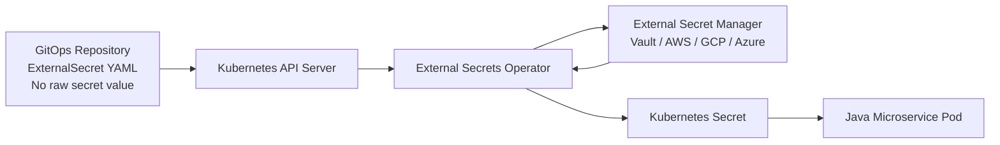
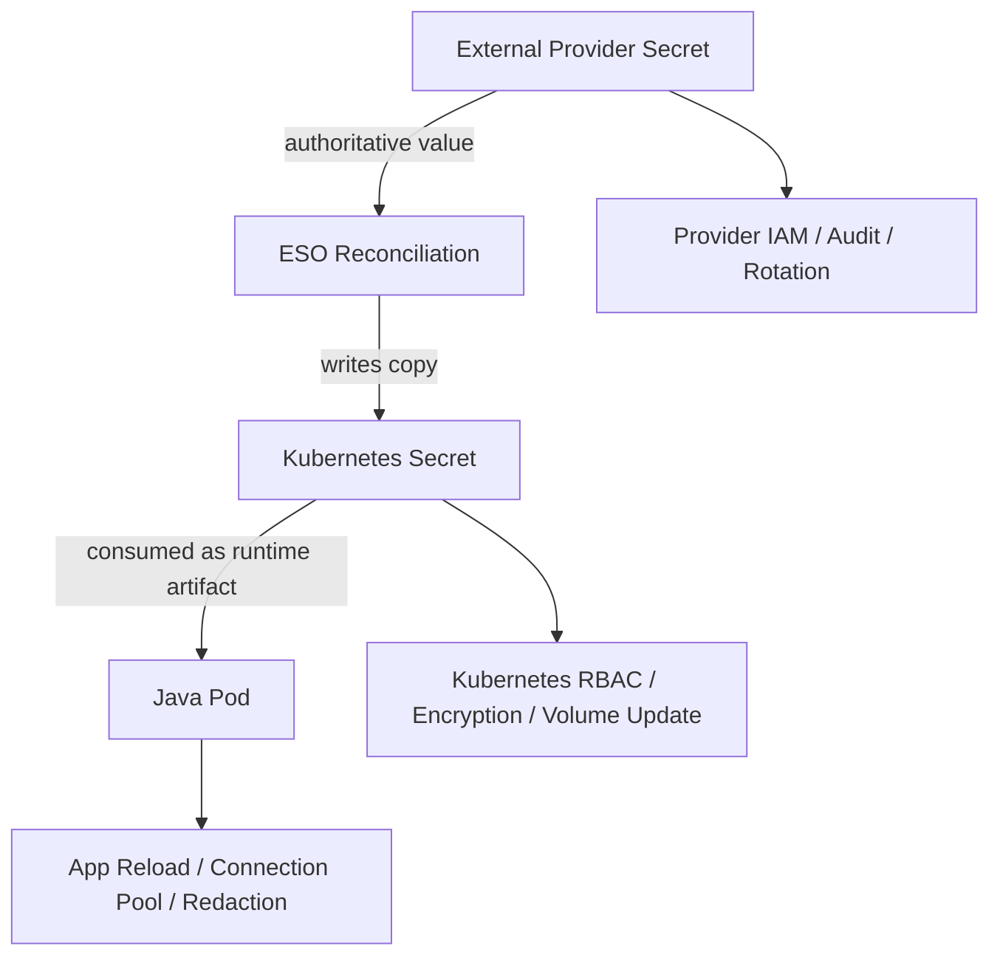
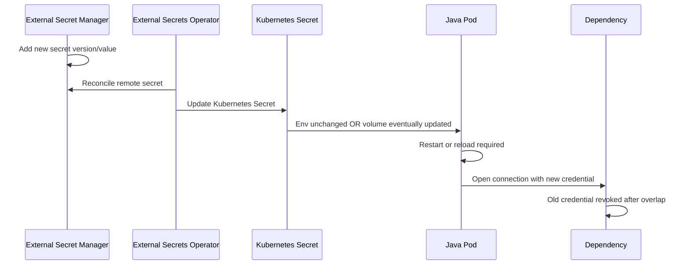

# Part 052 — External Secrets Operator

> External Secrets Operator does not remove secrets from Kubernetes.
>
> It removes raw secret values from your manifests and shifts authority to an external secret manager.

Di part sebelumnya kita membahas Google Secret Manager dari sisi Java service. Sekarang kita naik satu lapis ke Kubernetes platform: **External Secrets Operator** atau ESO.

ESO adalah Kubernetes operator yang membaca secret dari external provider seperti AWS Secrets Manager, Google Secret Manager, Azure Key Vault, HashiCorp Vault, dan provider lain, lalu membuat atau memperbarui Kubernetes `Secret` di cluster.

Ini sangat berguna untuk GitOps karena manifest bisa menyimpan **referensi** ke secret, bukan secret value.

Tetapi ada caveat penting:

```txt
After sync, the value still exists as a Kubernetes Secret.
```

Jadi ESO bukan pengganti:

- Kubernetes RBAC;
- encryption at rest;
- namespace isolation;
- workload identity;
- secret rotation plan;
- application reload behavior;
- audit and observability.

ESO adalah bridge. Bukan silver bullet.

---

## 1. Mental Model



The control flow:

1. Git contains `ExternalSecret`, `SecretStore`, or `ClusterSecretStore` manifests.
2. GitOps tool applies those manifests to Kubernetes.
3. ESO controller watches the CRDs.
4. ESO authenticates to external provider.
5. ESO fetches remote secret values.
6. ESO writes a Kubernetes `Secret`.
7. Pod consumes the Kubernetes `Secret` as env var, mounted file, or config tree.

Core invariant:

```txt
Git stores secret references and templates, not secret values.
The external secret manager remains the authority for secret material.
Kubernetes Secret becomes a synchronized delivery artifact.
```

---

## 2. Main Resources

ESO introduces several custom resources. The most important:

| Resource | Scope | Purpose |
|---|---|---|
| `SecretStore` | Namespace | Defines how to connect to an external provider from one namespace |
| `ClusterSecretStore` | Cluster | Defines provider access reusable across namespaces |
| `ExternalSecret` | Namespace | Defines which remote secret data to fetch and how to write Kubernetes Secret |
| `ClusterExternalSecret` | Cluster | Creates ExternalSecrets across namespaces |

For most teams, start with:

```txt
SecretStore + ExternalSecret
```

Use `ClusterSecretStore` only when platform governance is mature because it broadens blast radius.

---

## 3. ExternalSecret Anatomy

A typical `ExternalSecret` answers:

- how often to refresh;
- which store to use;
- which remote secret to read;
- how to map remote properties to Kubernetes Secret keys;
- how the target Kubernetes Secret should be created;
- what template/type/metadata the resulting Secret should have.

Conceptual YAML:

```yaml
apiVersion: external-secrets.io/v1beta1
kind: ExternalSecret
metadata:
  name: evidence-db-secret
  namespace: evidence
spec:
  refreshInterval: 1h
  secretStoreRef:
    name: evidence-secret-store
    kind: SecretStore
  target:
    name: evidence-db-secret
    creationPolicy: Owner
  data:
    - secretKey: username
      remoteRef:
        key: evidence-service-prod-postgres
        property: username
    - secretKey: password
      remoteRef:
        key: evidence-service-prod-postgres
        property: password
```

Resulting Kubernetes Secret:

```yaml
apiVersion: v1
kind: Secret
metadata:
  name: evidence-db-secret
  namespace: evidence
type: Opaque
data:
  username: <base64>
  password: <base64>
```

Remember: base64 is encoding, not encryption.

---

## 4. SecretStore vs ClusterSecretStore

### 4.1 SecretStore

`SecretStore` is namespaced. It is usually safer for team-level isolation.

```yaml
apiVersion: external-secrets.io/v1beta1
kind: SecretStore
metadata:
  name: evidence-secret-store
  namespace: evidence
spec:
  provider:
    gcpsm:
      projectID: regulator-prod
      auth:
        workloadIdentity:
          clusterLocation: asia-southeast2
          clusterName: regulator-prod-gke
          serviceAccountRef:
            name: external-secrets-evidence
```

The exact provider schema depends on provider and ESO version. Always check provider docs for your installed ESO version.

### 4.2 ClusterSecretStore

`ClusterSecretStore` is reusable across namespaces.

Use it for:

- centrally managed provider access;
- consistent platform-wide secret provider config;
- teams that should not manage provider auth directly.

Risk:

- if misconfigured, many namespaces can access too much;
- RBAC around who can reference it becomes critical;
- audit ownership can become blurry.

Decision rule:

```txt
Use SecretStore by default.
Use ClusterSecretStore only when platform team owns cross-namespace governance.
```

---

## 5. Provider Authority and Kubernetes Delivery

The external provider remains the secret authority.

Kubernetes Secret is only a delivery artifact.



This creates three security boundaries:

| Boundary | Owner | Failure Risk |
|---|---|---|
| Provider access | Security/platform | ESO can read too many provider secrets |
| Kubernetes Secret access | Kubernetes platform/team | Pod/user can read copied secret |
| Java consumer behavior | Service team | secret leak, stale value, no reload |

Do not collapse these into one ownership bucket.

---

## 6. GitOps Pattern

Without ESO, teams often commit Kubernetes Secret manifests with base64 value.

Bad:

```yaml
apiVersion: v1
kind: Secret
metadata:
  name: evidence-db-secret
data:
  password: c3VwZXItc2VjcmV0
```

This is still raw secret, only base64 encoded.

With ESO:

```yaml
apiVersion: external-secrets.io/v1beta1
kind: ExternalSecret
metadata:
  name: evidence-db-secret
spec:
  secretStoreRef:
    name: evidence-secret-store
    kind: SecretStore
  target:
    name: evidence-db-secret
  data:
    - secretKey: password
      remoteRef:
        key: evidence-service-prod-postgres
        property: password
```

Git contains:

- secret name;
- remote key;
- mapping;
- refresh interval;
- target name;
- template.

Git does not contain:

- password;
- token;
- private key;
- certificate private material.

### 6.1 GitOps Invariant

```txt
No raw secret material may be committed to Git, even base64 encoded.
```

Use secret scanning in CI to catch accidental leaks.

---

## 7. Refresh Semantics

ESO reconciles periodically or based on resource change, depending on spec and version.

Important:

```txt
ESO refresh updates Kubernetes Secret.
That does not guarantee the Java process has consumed the new value.
```

Kubernetes consumption behavior matters:

| Consumption | Secret Update Behavior |
|---|---|
| Env var | Running process does not see updated value automatically |
| Mounted Secret volume | File projection can update eventually |
| `subPath` mount | Does not receive automatic update |
| Spring config tree | May need reload/watch/restart depending setup |
| Direct API fetch | App controls refresh path |

Therefore rotation has two hops:

```txt
External provider -> Kubernetes Secret -> Java runtime
```

Both hops need design.

---

## 8. Java Consumption Patterns with ESO

### 8.1 Environment Variable

Deployment:

```yaml
env:
  - name: DB_USERNAME
    valueFrom:
      secretKeyRef:
        name: evidence-db-secret
        key: username
  - name: DB_PASSWORD
    valueFrom:
      secretKeyRef:
        name: evidence-db-secret
        key: password
```

Pros:

- simple;
- familiar;
- works with many libraries.

Cons:

- no runtime update;
- env can leak through process inspection in some contexts;
- hard to rotate without restart;
- may appear in diagnostic dumps if not careful.

Use for startup-bound secrets where rolling restart is intended.

### 8.2 Mounted File

Deployment:

```yaml
volumes:
  - name: db-secret
    secret:
      secretName: evidence-db-secret
containers:
  - name: app
    volumeMounts:
      - name: db-secret
        mountPath: /etc/secrets/db
        readOnly: true
```

Java:

```java
Path passwordPath = Path.of("/etc/secrets/db/password");
String password = Files.readString(passwordPath, StandardCharsets.UTF_8).trim();
```

Pros:

- can be updated by Kubernetes projection;
- works with config tree pattern;
- easier to re-read than env vars.

Cons:

- app must watch/reload;
- update is eventually consistent;
- `subPath` breaks automatic update;
- mounted files are still local runtime secret material.

### 8.3 Spring Boot Config Tree

Spring Boot can import configuration from directory trees where filenames become property names.

Example:

```yaml
spring:
  config:
    import: optional:configtree:/etc/secrets/db/
```

If `/etc/secrets/db/password` exists, it can become property `password` depending path structure and import usage.

Use typed config binding:

```java
@ConfigurationProperties(prefix = "db")
public record DatabaseSecretProperties(
    String username,
    String password
) {}
```

Caution:

```txt
Config tree import at startup does not automatically mean runtime reload is safe.
```

For DB credentials, prefer controlled restart or explicit pool rotation flow.

---

## 9. Rotation with ESO

Rotation sequence:



Important:

```txt
Secret rotation is not done when ESO updates the Kubernetes Secret.
It is done when the application safely uses the new value and the old credential can be revoked.
```

### 9.1 Restart-Based Rotation

Most reliable for startup-bound secrets:

1. provider secret updated;
2. ESO syncs Kubernetes Secret;
3. deployment rollout restarts pods;
4. new pods read updated env/mounted secret;
5. readiness confirms dependency access;
6. old pods terminate;
7. old credential revoked after observation.

### 9.2 Reload-Based Rotation

Use only if app supports it:

- mounted file update;
- file watcher or refresh endpoint;
- rebind typed properties;
- rebuild dependency client;
- drain old connection pool;
- metric confirms active version.

For many Java database workloads, restart-based rotation is simpler and safer.

---

## 10. Template and Target Secret

ESO can template target Kubernetes Secret. This is useful for secrets expected by standard tools.

Example for Docker config style or app-specific secret:

```yaml
spec:
  target:
    name: evidence-db-secret
    template:
      type: Opaque
      metadata:
        labels:
          app.kubernetes.io/name: evidence-service
          secret.mycompany.com/owner: enforcement-platform
      data:
        jdbc-url: |
          jdbc:postgresql://{{ .host }}:{{ .port }}/{{ .database }}
        username: "{{ .username }}"
        password: "{{ .password }}"
```

Caution:

```txt
Templating can accidentally create derived secret values.
Treat rendered target data as secret too.
```

Do not put rendered secret output in logs or GitOps diff tooling.

---

## 11. RBAC and Namespace Isolation

ESO introduces additional authority:

- ESO controller can read external provider secrets;
- ESO controller can write Kubernetes Secrets;
- users who can create ExternalSecret may cause new Kubernetes Secrets to be materialized;
- pods with access to resulting Secret can read the secret;
- users with Kubernetes Secret read permission can read copied values.

### 11.1 RBAC Design

Minimum controls:

```txt
Only platform/team operators can create SecretStore.
Only application team can create ExternalSecret in their namespace.
ExternalSecret admission policy restricts which SecretStore can be referenced.
Kubernetes Secret read permission is tightly restricted.
Pods only mount secrets they need.
```

### 11.2 Admission Policy

Consider policy engine rules:

- forbid `ClusterSecretStore` reference from unapproved namespaces;
- require `refreshInterval` bounds;
- require ownership labels;
- forbid target secret names outside allowed prefix;
- forbid `dataFrom` unless approved;
- require namespace match between application and SecretStore;
- require immutable external secret mapping in production.

---

## 12. `data` vs `dataFrom`

ESO supports explicit mapping and bulk import patterns.

### 12.1 Explicit `data`

```yaml
data:
  - secretKey: password
    remoteRef:
      key: evidence-service-prod-postgres
      property: password
```

Pros:

- explicit;
- reviewable;
- least privilege at mapping level;
- good for production.

### 12.2 `dataFrom`

```yaml
dataFrom:
  - extract:
      key: evidence-service-prod-postgres
```

Pros:

- convenient;
- maps all properties.

Risks:

- new remote properties may appear in Kubernetes Secret without explicit review;
- accidental overexposure;
- harder diff and governance.

Production recommendation:

```txt
Use explicit data mappings for sensitive production secrets.
Use dataFrom only when remote secret shape is tightly controlled.
```

---

## 13. Failure Modeling

| Failure | Cause | Runtime Effect | Required Control |
|---|---|---|---|
| Provider unavailable | network/API outage | ESO cannot refresh | existing K8s Secret remains, alert on stale sync |
| IAM denied | workload identity/policy broken | ESO cannot fetch | fail status, alert platform/security |
| Remote secret missing | wrong key/env | target Secret not updated or absent | fail deployment/readiness |
| Invalid template | template error | target Secret not created | CI validation and ESO condition alert |
| K8s API denied | RBAC broken | ESO cannot write Secret | platform alert |
| Secret updated but pod env stale | env var consumption | app keeps old value | rollout restart required |
| Mounted secret updated but app does not reload | app behavior | dependency still uses old credential | watcher/restart/pool refresh |
| Too broad SecretStore | misgovernance | namespace can fetch unrelated secrets | admission/RBAC/provider policy |
| `dataFrom` overfetch | loose mapping | extra secret keys exposed | explicit mapping |

### 13.1 Stale Sync Invariant

```txt
Every ExternalSecret must expose whether its target Kubernetes Secret is fresh enough for the application risk profile.
```

For high-risk secret:

```txt
refreshInterval=1h
alert if last successful sync > 2h
```

For low-change startup secret:

```txt
refreshInterval=24h may be acceptable, if rotation is deployment-driven.
```

---

## 14. Observability

ESO resources expose status/conditions. Your platform monitoring should track:

```txt
externalsecret_ready
externalsecret_last_sync_time
externalsecret_sync_error_total
externalsecret_stale_seconds
secretstore_auth_error_total
target_secret_missing_total
```

Operational alerts:

```txt
ExternalSecret not Ready for > 10 minutes
last successful sync older than threshold
SecretStore auth failure
target Secret missing for deployed app
unexpected target Secret change
```

Application metrics should also expose whether it has consumed the latest secret generation/version.

ESO freshness alone is not enough.

---

## 15. Drift Detection

There are multiple drift layers:

| Layer | Drift Example |
|---|---|
| Git manifest | ExternalSecret desired mapping changed outside review |
| ESO status | ExternalSecret not synced successfully |
| Kubernetes Secret | Target Secret manually edited |
| Provider secret | Remote value changed outside expected rotation |
| Java runtime | App still using old value |

GitOps controller sees only some of these. ESO sees some. Provider audit sees some. App metrics see some.

Production platform should correlate all four:

```txt
Git desired -> ESO condition -> K8s Secret resourceVersion -> app active secret version
```

---

## 16. Security Review Checklist

For each `ExternalSecret`:

- Does the namespace own this secret?
- Is the referenced `SecretStore` allowed in this namespace?
- Is `ClusterSecretStore` necessary?
- Does remote key belong to this service/environment?
- Is `dataFrom` justified?
- Is target Secret name stable and bounded?
- Are ownership labels present?
- Is refresh interval appropriate?
- Is target Secret consumed by only intended pods?
- Are pods using env var, mounted file, or config tree intentionally?
- Is rotation behavior documented?
- Does app need restart after sync?
- Is Kubernetes Secret encryption at rest enabled?
- Is RBAC read access to Secrets restricted?
- Are ESO controller permissions least privilege?
- Are provider IAM permissions least privilege?

---

## 17. Java Service Contract

Even when ESO manages delivery, Java service needs a contract.

```yaml
secretContract:
  name: evidence-db-secret
  delivery: kubernetes-secret-volume
  mountPath: /etc/secrets/db
  requiredKeys:
    - username
    - password
  reloadMode: restart-required
  owner: evidence-service
  rotation:
    strategy: overlap-window-and-rolling-restart
    maxOldCredentialAge: 24h
  observability:
    exposeActiveGeneration: true
    exposeValue: false
```

Startup validation:

```java
public final class MountedSecretValidator implements ApplicationRunner {
    private final Path secretDir;

    public MountedSecretValidator(@Value("${app.secret.dir}") Path secretDir) {
        this.secretDir = secretDir;
    }

    @Override
    public void run(ApplicationArguments args) throws Exception {
        requireReadable(secretDir.resolve("username"));
        requireReadable(secretDir.resolve("password"));
    }

    private static void requireReadable(Path path) {
        if (!Files.isRegularFile(path) || !Files.isReadable(path)) {
            throw new IllegalStateException("Required mounted secret file is missing: " + path.getFileName());
        }
    }
}
```

Do not print file content.

---

## 18. Production Patterns

### 18.1 Namespace-Scoped SecretStore Per Team

```txt
Team namespace owns SecretStore.
SecretStore auth can read only provider path/prefix for that team.
ExternalSecrets in namespace reference only that SecretStore.
```

Good for multi-team clusters.

### 18.2 Platform-Owned ClusterSecretStore + Admission Policy

```txt
Platform owns ClusterSecretStore.
Admission policy restricts which namespaces can reference which provider paths.
```

Good when platform team centralizes provider integration.

### 18.3 Restart-Based Secret Rotation

```txt
ESO syncs Secret.
GitOps or controller triggers rollout.
Pods restart gradually.
App reads secret at startup.
Readiness verifies dependency.
Old credential revoked after observation.
```

Good default for JDBC and startup-bound Java dependencies.

### 18.4 Mounted File + Explicit Reload

```txt
ESO syncs Secret.
Kubernetes volume updates eventually.
App watcher detects file change.
App validates payload.
App rebuilds dependency client.
Old client drained.
```

Use only with careful testing.

---

## 19. Anti-Patterns

### 19.1 Treating ESO as Complete Security

```txt
We use ESO, so secrets are secure.
```

Wrong. Kubernetes Secret still exists. RBAC and encryption still matter.

### 19.2 Overusing ClusterSecretStore

```txt
All namespaces reference one powerful ClusterSecretStore.
```

Risk: one ExternalSecret typo can sync wrong secret into wrong namespace.

### 19.3 `dataFrom` Everywhere

```txt
Import entire remote secret object by default.
```

Risk: accidental overexposure when remote secret gains new keys.

### 19.4 No Application Reload Plan

```txt
Secret updated in Kubernetes; assume Java app uses it automatically.
```

False for env vars. Often false for already-created clients/pools.

### 19.5 Manual Editing Target Kubernetes Secret

```txt
kubectl edit secret evidence-db-secret
```

ESO may overwrite it. Worse, you create drift and lose provenance.

### 19.6 Secret Values in GitOps Diff Tools

Some tooling can show rendered Kubernetes Secret diffs. Ensure redaction.

---

## 20. Production Checklist

Before using ESO in production:

- External secret manager is the authority.
- Git contains no raw secret values.
- SecretStore/ClusterSecretStore ownership is documented.
- Provider IAM is scoped to required secrets.
- Kubernetes RBAC restricts Secret read access.
- Kubernetes Secret encryption at rest is enabled.
- ExternalSecret uses explicit `data` mapping unless justified.
- Refresh interval matches rotation risk.
- ESO status and sync failures are monitored.
- Target Secret ownership labels exist.
- Java service startup validates required keys.
- Java service does not log secret values.
- Rotation plan includes Java runtime consumption.
- Env-var-based secrets trigger rolling restart after update.
- Mounted-file-based secrets have tested reload or restart behavior.
- Manual edits to target Secrets are prohibited or reconciled.
- Admission policy guards cross-namespace and ClusterSecretStore usage.
- Runbook explains provider outage, sync failure, and stale secret recovery.

---

## 21. Key Takeaways

External Secrets Operator is a strong platform primitive, but it changes the secret delivery topology. It does not erase Kubernetes Secret risk.

The important points:

1. **ESO syncs external provider secrets into Kubernetes Secrets.**
2. **Git stores references, not raw secret values.**
3. **Kubernetes Secret still needs RBAC, encryption at rest, and namespace isolation.**
4. **SecretStore is safer by default than ClusterSecretStore for team isolation.**
5. **`data` is more reviewable than broad `dataFrom`.**
6. **Secret rotation has two hops: provider to Kubernetes, Kubernetes to Java runtime.**
7. **Java applications usually need restart or explicit reload to consume new secret values.**
8. **ESO freshness is not the same as application freshness.**

In the next part, we continue the GitOps angle with **SOPS, Sealed Secrets, and GitOps Secret Delivery**.

---

## References

- External Secrets Operator Introduction: https://external-secrets.io/
- External Secrets Operator `ExternalSecret`: https://external-secrets.io/latest/api/externalsecret/
- External Secrets Operator API overview: https://external-secrets.io/v0.4.1/api-overview/
- External Secrets Operator Kubernetes provider: https://external-secrets.io/latest/provider/kubernetes/
- Kubernetes Secrets: https://kubernetes.io/docs/concepts/configuration/secret/
- Kubernetes Secret good practices: https://kubernetes.io/docs/concepts/security/secrets-good-practices/
- Spring Boot Externalized Configuration and config tree: https://docs.spring.io/spring-boot/reference/features/external-config.html
