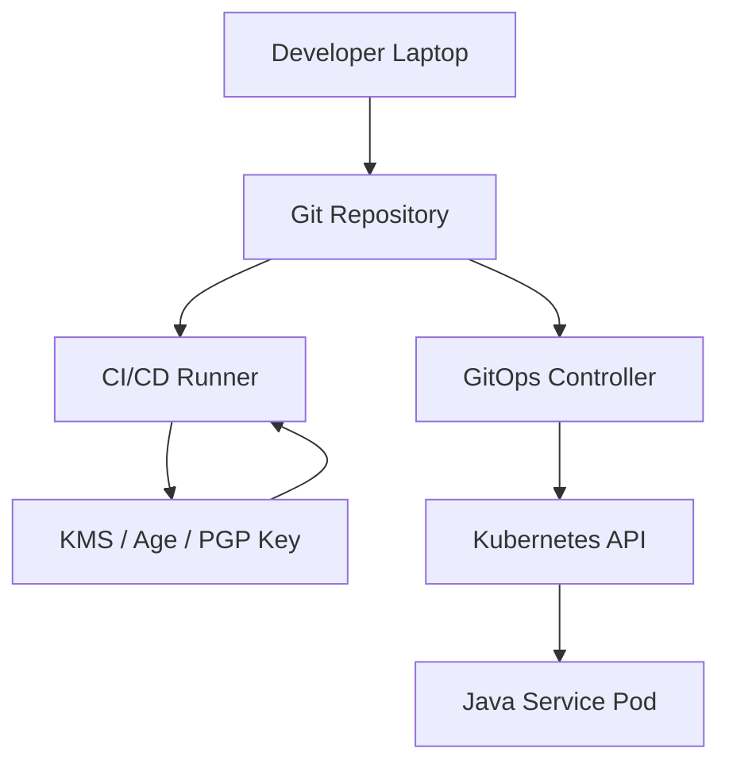
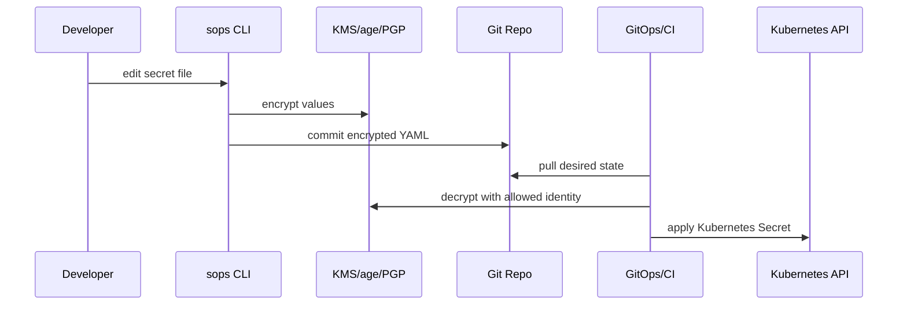
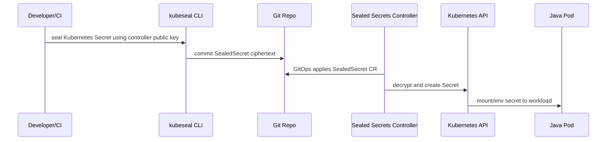
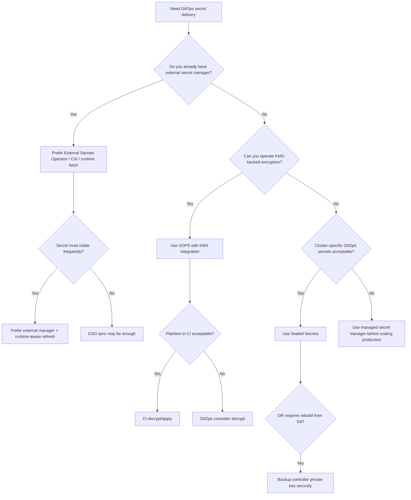

# Part 053 — SOPS, Sealed Secrets, and GitOps Secret Delivery

> GitOps makes desired state visible.
>
> Secret management asks: visible to whom?

Sebelumnya kita sudah membahas beberapa model secret delivery:

- environment variable;
- mounted file;
- runtime API fetch;
- Vault;
- AWS Secrets Manager;
- Azure Key Vault;
- Google Secret Manager;
- External Secrets Operator.

Sekarang kita masuk ke problem yang sering muncul ketika tim sudah memakai GitOps:

```txt
Bagaimana menyimpan desired state aplikasi di Git
tanpa menyimpan secret mentah di Git?
```

Ini bukan pertanyaan kosmetik. Git adalah sistem audit yang bagus, tetapi Git juga sangat sulit “melupakan” data yang sudah pernah commit. Jika secret mentah masuk ke repo, problemnya bukan hanya pull request saat ini. Problemnya adalah:

- commit history;
- fork;
- local clone;
- CI log;
- artifact cache;
- backup Git server;
- mirror repository;
- secret scanner false sense of safety;
- rotation emergency;
- audit exposure.

Part ini membahas tiga pendekatan umum:

1. **SOPS** — encrypted secret files di Git.
2. **Sealed Secrets** — encrypted Kubernetes Secret yang hanya bisa dibuka controller di cluster target.
3. **GitOps Secret Delivery Pattern** — bagaimana memilih dan mengoperasikan secret delivery secara production-grade.

Kita akan tetap memakai prinsip dari part sebelumnya:

```txt
Secret in GitOps is not only encryption problem.
It is ownership, authorization, rotation, audit, blast radius,
and runtime consumption problem.
```

---

## 1. Problem Space

GitOps biasanya ingin semua desired state ada di Git:

```txt
repo
├── apps
│   └── evidence-service
│       ├── deployment.yaml
│       ├── service.yaml
│       ├── configmap.yaml
│       └── secret.yaml
└── clusters
    └── prod
        └── kustomization.yaml
```

Untuk ConfigMap, ini relatif aman karena ConfigMap adalah non-sensitive config.

Untuk Secret, file seperti ini berbahaya:

```yaml
apiVersion: v1
kind: Secret
metadata:
  name: evidence-db
type: Opaque
stringData:
  username: evidence_user
  password: "super-secret-password"
```

Bahkan jika memakai `data:` base64:

```yaml
data:
  password: c3VwZXItc2VjcmV0LXBhc3N3b3Jk
```

Itu bukan encryption. Base64 hanya encoding. Siapa pun yang bisa membaca manifest bisa decode.

GitOps secret delivery harus menjawab:

| Pertanyaan | Contoh |
|---|---|
| Secret source of truth di mana? | Git encrypted file, Vault, cloud secret manager |
| Siapa bisa decrypt? | Developer, CI, cluster controller, KMS principal |
| Secret decrypted di mana? | Laptop, CI, cluster, runtime pod |
| Secret masuk Kubernetes Secret atau tidak? | Ya/tidak |
| Secret bisa dirotasi bagaimana? | PR, controller sync, external manager rotation |
| Blast radius kalau repo bocor? | Tergantung key dan scope |
| Blast radius kalau cluster compromised? | Tergantung RBAC, namespace, secret store |
| Bagaimana audit access? | Git history, KMS logs, controller logs, Kubernetes audit |
| Bagaimana rollback? | Secret version rollback, Git revert, reseal |

---

## 2. Threat Model GitOps Secret

Sebelum memilih tool, buat threat model.



Attack surface:

| Surface | Risiko |
|---|---|
| Developer laptop | private key bocor, decrypted file tertinggal |
| Git repo | encrypted file bisa dicuri, commit history permanen |
| CI runner | secret ter-decrypt di job log/cache/workspace |
| KMS | IAM terlalu luas, key policy salah |
| GitOps controller | controller bisa membaca manifest dan apply Secret |
| Kubernetes API | Secret bisa dibaca via RBAC terlalu luas |
| Pod runtime | env var/file secret bisa bocor via logs, exec, heap dump |
| Backup | etcd backup atau repo mirror menyimpan secret encrypted/plain |

Pola yang matang tidak mencoba membuat semua permukaan hilang. Pola yang matang mengecilkan blast radius dan membuat access auditable.

---

## 3. Model A — SOPS

SOPS adalah tool untuk mengedit file terenkripsi. Ia mendukung format seperti YAML, JSON, ENV, INI, binary, dan dapat menggunakan backend key management seperti AWS KMS, GCP KMS, Azure Key Vault, age, dan PGP.

Mental model SOPS:

```txt
Secret value encrypted in Git.
Decryption allowed only to identities that hold decrypt capability.
Git stores ciphertext.
Runtime or pipeline obtains plaintext only at controlled boundary.
```

Contoh file terenkripsi dengan SOPS secara konseptual:

```yaml
apiVersion: v1
kind: Secret
metadata:
  name: evidence-db
type: Opaque
stringData:
  username: ENC[AES256_GCM,data:...,type:str]
  password: ENC[AES256_GCM,data:...,type:str]
sops:
  kms:
    - arn: arn:aws:kms:ap-southeast-1:111122223333:key/...
  encrypted_regex: '^(data|stringData)$'
  version: 3.9.0
```

SOPS mengenkripsi value, bukan harus seluruh file. Ini berguna karena metadata non-sensitive tetap bisa dibaca saat review.

### 3.1 SOPS Flow



Ada dua variasi:

1. **Decrypt in CI/CD**  
   CI membuka secret lalu apply manifest ke Kubernetes.

2. **Decrypt in GitOps Controller**  
   Controller seperti Flux dengan SOPS integration mendekripsi saat reconcile.

Keduanya punya trade-off.

| Model | Keunggulan | Risiko |
|---|---|---|
| Decrypt in CI | pipeline jelas, mudah diberi approval gate | plaintext ada di CI runner |
| Decrypt in controller | GitOps pull-based, minim CI secret exposure | controller punya decrypt capability |
| Decrypt on developer laptop | mudah untuk edit/manual | private key tersebar ke laptop |

### 3.2 SOPS Key Strategy

SOPS hanya sekuat key strategy-nya.

Pilihan umum:

| Key Backend | Cocok Untuk | Risiko |
|---|---|---|
| age | simple, portable, local/team key | key distribution manual |
| PGP | legacy workflow, individual key | operational complexity |
| AWS KMS | AWS environment, IAM audit | IAM/key policy complexity |
| GCP KMS | GCP environment | IAM/key policy complexity |
| Azure Key Vault | Azure environment | access policy/RBAC complexity |

Production-grade recommendation:

```txt
Use cloud KMS or tightly managed age keys.
Avoid broad developer decrypt access for production secrets.
Prefer environment-scoped keys.
```

Contoh environment scoping:

```txt
sops-key-dev
sops-key-staging
sops-key-prod
```

Jangan gunakan satu key global untuk semua environment.

### 3.3 SOPS Repository Layout

Buruk:

```txt
secrets/all-secrets.enc.yaml
```

Lebih baik:

```txt
clusters/
  dev/
    evidence-service/
      secret.enc.yaml
  staging/
    evidence-service/
      secret.enc.yaml
  prod/
    evidence-service/
      secret.enc.yaml
```

Lebih baik lagi dengan ownership jelas:

```txt
clusters/prod/evidence-service/
  kustomization.yaml
  configmap.yaml
  secret.db.sops.yaml
  secret.object-storage.sops.yaml
  secret.external-api.sops.yaml
```

Pisahkan secret berdasarkan capability:

- DB credential;
- object storage credential;
- external API token;
- signing key;
- TLS material.

Jangan jadikan satu secret raksasa yang semua pod mount.

### 3.4 SOPS Invariant

```txt
Plaintext secret must never be committed.
Decryption capability must be narrower than repository read capability.
Production decryption must be auditable.
```

Tambahkan guardrail:

- pre-commit secret scan;
- CI secret scan;
- `.sops.yaml` policy;
- KMS access review;
- branch protection;
- required approval untuk production secret change;
- no decrypted artifact upload;
- no `set -x` saat decrypt command.

### 3.5 Example `.sops.yaml`

```yaml
creation_rules:
  - path_regex: clusters/dev/.*\.sops\.ya?ml$
    age: age1devpublickey...

  - path_regex: clusters/staging/.*\.sops\.ya?ml$
    kms: arn:aws:kms:ap-southeast-1:111122223333:key/staging-key

  - path_regex: clusters/prod/.*\.sops\.ya?ml$
    kms: arn:aws:kms:ap-southeast-1:111122223333:key/prod-key
    encrypted_regex: '^(data|stringData)$'
```

Policy yang bagus membuat kesalahan sulit dilakukan.

---

## 4. Model B — Sealed Secrets

Sealed Secrets menggunakan asymmetric cryptography.

Mental model:

```txt
Anyone can encrypt a Kubernetes Secret into SealedSecret using public key.
Only the controller inside target cluster can decrypt it into a Kubernetes Secret.
```

Flow:



Contoh conceptual `SealedSecret`:

```yaml
apiVersion: bitnami.com/v1alpha1
kind: SealedSecret
metadata:
  name: evidence-db
  namespace: evidence
spec:
  encryptedData:
    username: AgB...
    password: AgC...
  template:
    metadata:
      name: evidence-db
      namespace: evidence
    type: Opaque
```

### 4.1 Why Sealed Secrets Is Useful

Keunggulan:

- developer tidak butuh akses decrypt secret;
- Git menyimpan encrypted `SealedSecret`;
- hanya cluster target yang bisa decrypt;
- cocok untuk GitOps pull-based;
- review manifest masih bisa melihat metadata/nama secret;
- tidak membutuhkan CI untuk decrypt.

### 4.2 Critical Boundary

SealedSecret biasanya terikat ke:

- controller private key;
- cluster;
- namespace;
- secret name;
- sealing scope.

Artinya sealed secret yang sama tidak selalu bisa dipakai di namespace/cluster lain, tergantung scope.

Ini bagus untuk blast radius, tetapi punya implikasi operasional:

- restore cluster harus mempertahankan controller private key jika ingin decrypt sealed secret lama;
- rotate sealing key perlu proses reseal;
- DR cluster perlu strategy untuk key backup/restore;
- namespace rename bisa mempengaruhi validity;
- GitOps promotion antar environment tidak sekadar copy file.

### 4.3 Sealed Secrets Invariant

```txt
Private key of the Sealed Secrets controller is a cluster-critical secret.
If lost, old SealedSecrets cannot be decrypted.
If stolen, attacker can decrypt sealed payloads intended for that key.
```

Jangan menganggap Sealed Secrets menghapus problem secret management. Ia memindahkan root of trust ke controller private key.

Operational requirement:

- backup controller private key dengan aman;
- restrict controller namespace/RBAC;
- monitor controller health;
- plan resealing process;
- review key rotation;
- restrict who can create SealedSecret in sensitive namespaces;
- avoid broad Kubernetes Secret read permission.

### 4.4 Sealed Secrets vs SOPS

| Dimension | SOPS | Sealed Secrets |
|---|---|---|
| Root of trust | KMS/age/PGP key | Cluster controller private key |
| Decrypt location | CI/controller/laptop | Kubernetes controller |
| Developer can decrypt? | If granted key access | Usually no |
| Environment promotion | Flexible via KMS rules | Needs sealing per target cluster/scope |
| Git file readability | encrypted values, metadata visible | encrypted data in CR |
| Audit | KMS logs, Git logs, CI logs | Git logs, K8s audit, controller logs |
| DR concern | KMS/key access | controller private key backup |
| Best fit | platform with KMS and config-as-code | cluster-scoped GitOps secret delivery |

---

## 5. Model C — External Secret Source + GitOps Reference

Ini sudah dibahas di Part 052, tetapi penting untuk membandingkan.

Dalam model ini, Git tidak menyimpan secret encrypted payload. Git menyimpan reference.

```yaml
apiVersion: external-secrets.io/v1
kind: ExternalSecret
metadata:
  name: evidence-db
spec:
  refreshInterval: 1h
  secretStoreRef:
    name: prod-secret-store
    kind: ClusterSecretStore
  target:
    name: evidence-db
  data:
    - secretKey: username
      remoteRef:
        key: prod/evidence/db
        property: username
    - secretKey: password
      remoteRef:
        key: prod/evidence/db
        property: password
```

Mental model:

```txt
Git stores desired synchronization contract.
Secret manager stores secret value.
Controller syncs value into Kubernetes Secret.
```

Keunggulan:

- secret value tidak ada di Git;
- rotation bisa dilakukan di secret manager;
- access audit berada di secret manager;
- GitOps tetap mengelola desired shape;
- policy bisa centralized.

Risiko:

- controller punya read capability ke external secret;
- Kubernetes Secret tetap menyimpan plaintext di cluster;
- refresh interval dan failure mode harus dipahami;
- external secret outage bisa mempengaruhi rollout/reconciliation.

---

## 6. Choosing the Right Pattern

Tidak ada satu pattern universal.

Gunakan decision tree:



### 6.1 Practical Recommendation

| Scenario | Recommendation |
|---|---|
| Small internal cluster, simple GitOps | Sealed Secrets acceptable |
| Cloud-native platform with KMS | SOPS with KMS or controller integration |
| Regulated/high-audit environment | External secret manager + reference in Git |
| Frequently rotated database credentials | Vault/AWS/Azure/GCP + runtime-aware refresh |
| Multi-cluster promotion | SOPS/External Secret reference usually easier than SealedSecret copy |
| Developer should not decrypt prod | Avoid giving prod KMS/age keys to developers |
| Need audit of secret read | Use external manager with audit logs |
| Need Git-only bootstrap | SOPS or Sealed Secrets with strong key custody |

---

## 7. GitOps Delivery Pipeline

Production pipeline should not be:

```txt
kubectl apply secret.yaml
```

It should be staged.


### 7.1 Static Validation

Check:

- YAML valid;
- Kustomize/Helm render valid;
- expected namespace;
- no plaintext secret;
- encrypted fields present;
- metadata labels correct;
- ownership annotations present;
- no accidental broad secret.

Example annotations:

```yaml
metadata:
  annotations:
    platform.example.com/owner: evidence-service
    platform.example.com/security-owner: security-platform
    platform.example.com/rotation-policy: 90d
    platform.example.com/reload-strategy: rollout
```

### 7.2 Secret Scan

Use secret scanners even if using SOPS/Sealed Secrets.

Reason:

```txt
The purpose of secret scan is not to validate encrypted secret.
It is to catch accidental plaintext secret.
```

Scan:

- PR diff;
- full repo;
- CI logs;
- generated manifests;
- Helm rendered output;
- Kustomize build output.

### 7.3 Policy Check

Examples:

```txt
Production Secret must not use default namespace.
Production Secret must have owner annotation.
Production Secret must not be mounted into more than N workloads.
Production Secret must not be type Opaque if TLS type is expected.
Database secret must not be shared across services.
```

Policy can be enforced with:

- OPA/Gatekeeper;
- Kyverno;
- Conftest;
- admission controllers;
- GitOps pipeline validation.

### 7.4 Dry Run and Apply

Kubernetes server-side dry-run can detect schema and admission issues before actual apply.

For GitOps controller, use staging cluster and canary namespace to test secret reconciliation.

---

## 8. Runtime Consumption by Java Service

GitOps only delivers secret into cluster. Java service still has to consume it safely.

Common consumption patterns:

### 8.1 Mounted File with Config Tree

Kubernetes Secret volume:

```yaml
volumes:
  - name: db-secret
    secret:
      secretName: evidence-db

containers:
  - name: app
    volumeMounts:
      - name: db-secret
        mountPath: /run/secrets/evidence-db
        readOnly: true
```

Spring Boot config tree:

```yaml
spring:
  config:
    import: "optional:configtree:/run/secrets/evidence-db/"
```

Typed binding:

```java
@ConfigurationProperties(prefix = "db")
public record DbSecretProperties(
    @NotBlank String username,
    @NotBlank String password
) {}
```

Important:

```txt
Mounted file update does not automatically mean your DataSource,
connection pool, or HTTP client updates safely.
```

### 8.2 Environment Variable

```yaml
env:
  - name: DB_PASSWORD
    valueFrom:
      secretKeyRef:
        name: evidence-db
        key: password
```

Pros:

- simple;
- easy with Spring Boot env binding.

Cons:

- not automatically updated;
- can appear in process environment;
- can leak through diagnostics;
- requires pod restart for change.

### 8.3 Secret Reload Strategy

For Java services, classify secret:

| Secret | Suggested Reload |
|---|---|
| DB password | dual credential + pool refresh or rollout |
| API token | client credential provider refresh |
| TLS cert | server/client reload if supported, otherwise rollout |
| Signing key | versioned keyring, careful overlap |
| Encryption key | KMS envelope pattern, do not hot swap blindly |
| Object storage access key | prefer workload identity, otherwise refresh/rollout |

---

## 9. Secret Change Does Not Equal Safe Runtime Change

GitOps tools can apply a Secret. Kubernetes can update Secret object. But application correctness depends on runtime behavior.

Failure case:

```txt
1. Secret changed in Git.
2. GitOps applies Kubernetes Secret.
3. Pod environment variable still contains old value.
4. Old DB credential revoked.
5. Application outage.
```

Another failure case:

```txt
1. Secret mounted as volume.
2. File content eventually updates.
3. Java DataSource already initialized with old password.
4. Connection pool keeps old connections.
5. New connections fail after old credential revoked.
```

Invariant:

```txt
Secret delivery, application reload, dependency credential validity,
and connection lifecycle must be coordinated.
```

This leads directly into Part 054: secret rotation without downtime.

---

## 10. GitOps Secret Anti-Patterns

### 10.1 Plaintext Secret in Git

Even private repo is not enough.

Private repo readers are not automatically authorized secret readers.

### 10.2 One Secret for Everything

Bad:

```yaml
metadata:
  name: app-secrets
data:
  db-password: ...
  s3-key: ...
  stripe-token: ...
  signing-key: ...
  smtp-password: ...
```

This increases blast radius. Split by capability and consumer.

### 10.3 Shared Secret Across Services

Bad:

```txt
order-service, evidence-service, reporting-service use same database user.
```

Consequence:

- audit cannot attribute access cleanly;
- rotation becomes coordinated outage;
- compromise of one service compromises others;
- least privilege impossible.

### 10.4 CI Decrypts Secret and Prints Rendered Manifest

Common mistake:

```bash
set -x
sops -d secret.sops.yaml | kubectl apply -f -
```

If shell tracing or logs capture output, secret leaks.

### 10.5 Reseal Without Understanding Scope

For Sealed Secrets, sealing against wrong namespace/name/scope can cause reconciliation failure.

### 10.6 No DR Plan for Root Key

If SOPS KMS/age key or Sealed Secrets private key is lost, recovery can become painful.

---

## 11. Production Runbook: Secret Added via GitOps

### 11.1 Before PR

- define secret owner;
- define consumer service;
- define rotation policy;
- define reload strategy;
- define external source or encryption key;
- confirm least privilege;
- confirm no shared credential unless explicitly approved;
- create staging first.

### 11.2 PR Checklist

```txt
[ ] No plaintext secret in diff
[ ] Secret name is scoped to service/capability
[ ] Namespace is correct
[ ] Owner annotation exists
[ ] Rotation policy annotation exists
[ ] Reload strategy documented
[ ] KMS/SealedSecret target is correct
[ ] Staging tested
[ ] Rollback path documented
```

### 11.3 Deployment Checklist

```txt
[ ] GitOps reconciliation healthy
[ ] Kubernetes Secret exists
[ ] Pod references correct secret
[ ] Service starts with new secret
[ ] Logs do not expose secret
[ ] Metrics show successful dependency auth
[ ] Old secret not revoked until rollout proven
```

### 11.4 Incident Checklist: Secret Leaked in Git

```txt
1. Treat as compromised.
2. Revoke/rotate secret immediately.
3. Remove plaintext from current branch.
4. Assume history, clones, logs, and caches may contain it.
5. Audit access to repo and CI logs.
6. Identify blast radius.
7. Replace with encrypted/reference pattern.
8. Add scanner/pre-commit/policy guardrail.
9. Document incident timeline.
```

Do not waste time arguing “but repo is private”. If plaintext secret was committed, rotate.

---

## 12. Example: Evidence Service Secret Delivery

Scenario:

```txt
evidence-service needs:
- PostgreSQL credential
- object storage signing credential
- malware scanner API token
```

Decision:

| Secret | Delivery Pattern | Reason |
|---|---|---|
| DB credential | External Secrets Operator from Vault dynamic/static path | rotation and audit |
| Object storage | Workload identity preferred; no static secret | reduce secret material |
| Scanner token | SOPS encrypted Secret or external manager | third-party API token |
| TLS cert | cert-manager/Secret volume | cert lifecycle automation |

Git layout:

```txt
clusters/prod/evidence-service/
  deployment.yaml
  configmap.yaml
  externalsecret.db.yaml
  secret.scanner-token.sops.yaml
  serviceaccount.yaml
  kustomization.yaml
```

Runtime:

```txt
DB credential mounted as file or env.
Scanner token mounted as file.
Service validates required secret at startup.
Service redacts secret in logs.
Secret change triggers controlled rollout.
```

---

## 13. Testing GitOps Secret Delivery

### 13.1 Static Tests

- encrypted file can decrypt with expected identity;
- SealedSecret target namespace/name correct;
- ExternalSecret references valid store/key;
- manifest renders;
- no plaintext secret;
- policy constraints pass.

### 13.2 Cluster Tests

- controller reconciles;
- Kubernetes Secret created;
- pod mounts secret;
- Java app starts;
- health checks dependency auth;
- secret value not logged;
- RBAC prevents unrelated service from reading secret.

### 13.3 Rotation Simulation

- update encrypted secret;
- reconcile staging;
- rollout app;
- revoke old credential;
- observe no outage;
- rollback if failure.

### 13.4 DR Test

- restore from Git to new cluster;
- confirm SealedSecret decrypt path or SOPS key access;
- restore controller key if needed;
- verify workloads recover.

---

## 14. Design Review Questions

Use these questions before approving GitOps secret design.

### Source of Truth

- Is Git storing encrypted payload or only reference?
- Is external manager the actual secret authority?
- Who can create/update secret?

### Decryption Boundary

- Where does plaintext appear?
- Who/what can decrypt?
- Is decryption audited?
- Does CI ever see plaintext?

### Runtime Boundary

- How does Java service consume the secret?
- Does it require restart?
- Can it reload safely?
- What happens if secret changes while app is running?

### Rotation

- Is there overlap window?
- Is old credential revoked after verification?
- Is connection pool compatible with rotation?
- Is rollback possible?

### Security

- Is secret least privilege?
- Is RBAC narrow?
- Are logs/traces redacted?
- Are backups protected?

### Operations

- What alert fires if sync fails?
- What alert fires if app still uses old credential?
- Who owns the runbook?
- Has DR been tested?

---

## 15. Key Takeaways

1. **GitOps secret delivery is not just “encrypt YAML”.**
2. **SOPS encrypts files for Git using KMS/age/PGP style root of trust.**
3. **Sealed Secrets encrypts Kubernetes Secrets so only target cluster controller can decrypt.**
4. **External Secrets Operator stores references in Git and keeps secret values in external managers.**
5. **Base64 is not protection.**
6. **Decryption boundary matters more than tool branding.**
7. **Secret delivery must be paired with runtime reload or rollout strategy.**
8. **Sealed Secrets private key and SOPS decrypt key are root-of-trust assets.**
9. **Java services remain responsible for not leaking, over-caching, or misusing delivered secrets.**
10. **Rotation without downtime requires coordination beyond Git apply.**

Next, we finish the secret management block with the most operationally important topic: **Secret Rotation Without Downtime**.

---

## References

- SOPS Documentation: https://getsops.io/docs/
- SOPS GitHub Repository: https://github.com/getsops/sops
- Bitnami Sealed Secrets: https://github.com/bitnami-labs/sealed-secrets
- Flux Guide — Sealed Secrets: https://fluxcd.io/flux/guides/sealed-secrets/
- Kubernetes Secrets: https://kubernetes.io/docs/concepts/configuration/secret/
- Kubernetes Secrets Good Practices: https://kubernetes.io/docs/concepts/security/secrets-good-practices/
- External Secrets Operator Documentation: https://external-secrets.io/
