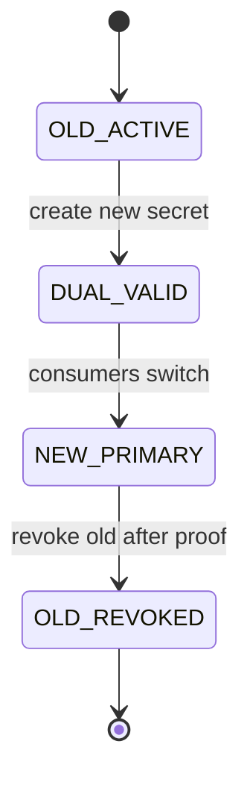
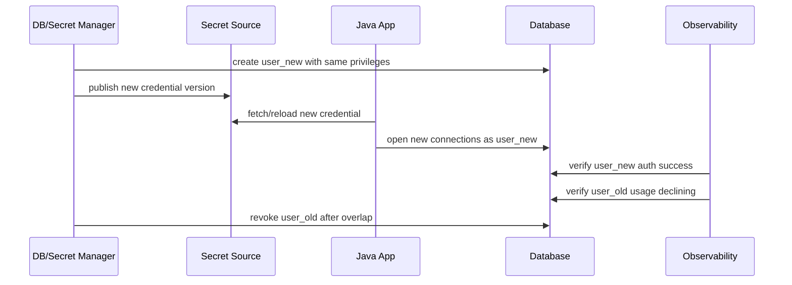
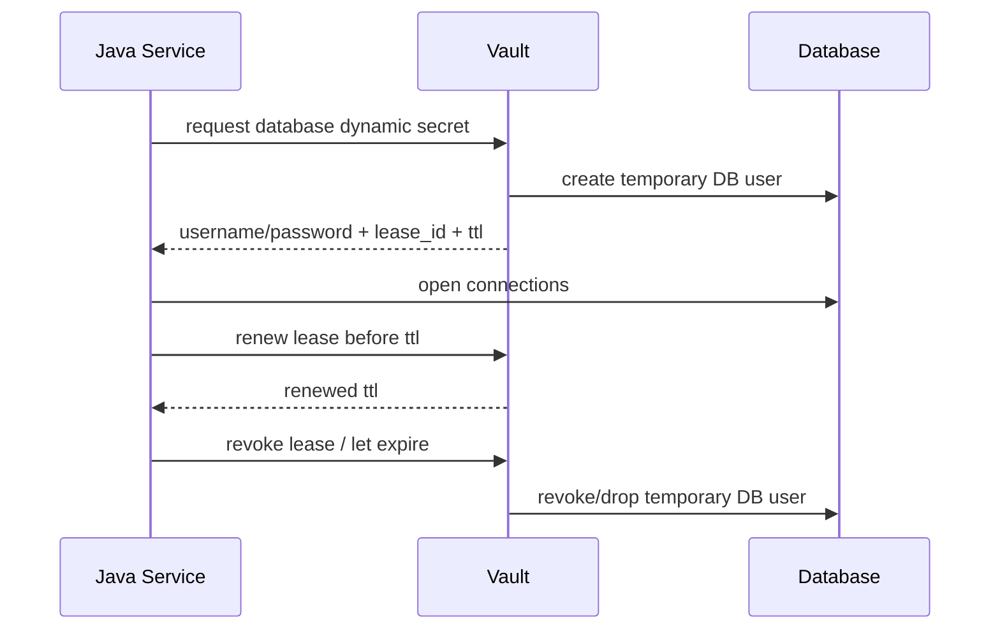
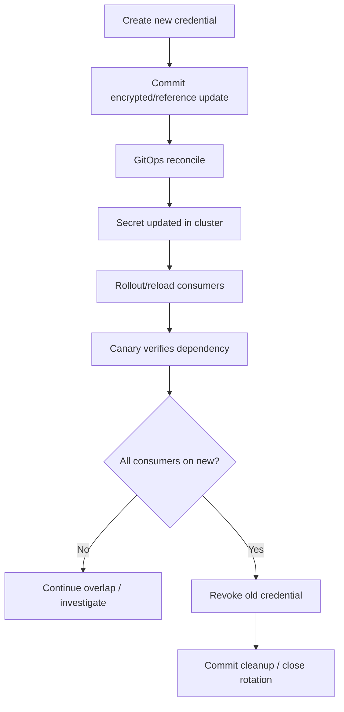

# Part 054 — Secret Rotation Without Downtime

> Secret rotation is not a write operation.
>
> It is a distributed state transition.

Banyak tim menganggap rotation berarti:

```txt
Update secret value.
Restart app.
Done.
```

Itu cukup untuk staging kecil. Di production, terutama Java microservices dengan connection pool, message broker, HTTP client, token cache, TLS context, async worker, dan rolling deployment, secret rotation adalah proses multi-stage.

Jika salah, hasilnya bisa berupa:

- database outage;
- 401/403 spike ke dependency;
- pod crash loop;
- stale connection pool;
- partial rollout;
- one replica memakai secret baru, replica lain memakai secret lama;
- rollback yang tidak bisa jalan karena secret lama sudah dicabut;
- audit gap;
- incident karena rotation dilakukan sebagai “security maintenance” tanpa runtime readiness.

Prinsip utama:

```txt
A secret is safe to revoke only after every valid consumer has stopped using it,
and the system can prove the replacement works.
```

Part ini adalah penutup blok secret management. Kita akan membahas:

- rotation mental model;
- static vs dynamic secret;
- dual credential pattern;
- Java connection pool impact;
- Vault lease/TTL;
- AWS Secrets Manager alternating users;
- Kubernetes Secret rollout;
- cert/key overlap;
- observability;
- rollback;
- production runbook.

---

## 1. Rotation Mental Model

Secret rotation punya empat state, bukan dua.



Deskripsi:

| State | Makna |
|---|---|
| `OLD_ACTIVE` | semua consumer memakai secret lama |
| `DUAL_VALID` | secret lama dan baru sama-sama valid |
| `NEW_PRIMARY` | consumer seharusnya memakai secret baru, lama masih fallback |
| `OLD_REVOKED` | secret lama dicabut setelah terbukti tidak dipakai |

Kesalahan paling sering:

```txt
OLD_ACTIVE -> OLD_REVOKED -> hope app uses new secret
```

Itu bukan rotation. Itu disruption.

---

## 2. Rotation Invariants

Gunakan invariant berikut.

### 2.1 Overlap Invariant

```txt
There must be an overlap window where old and new credentials are both valid
unless the dependency provides atomic credential replacement with proven client compatibility.
```

Tanpa overlap, semua consumer harus update secara atomic. Itu jarang realistis.

### 2.2 Proof Before Revoke Invariant

```txt
Old credential must not be revoked until the platform can observe successful use
of the new credential and no required consumer still depends on the old credential.
```

Proof bisa berupa:

- successful database auth with new user;
- no old username in DB audit log;
- app metric reports new secret version;
- all pods rolled out;
- dependency 401/403 stable;
- canary success;
- synthetic check success.

### 2.3 Consumer Refresh Invariant

```txt
Every consumer must have a defined method to adopt the new secret.
```

Metode:

- pod restart;
- rolling deployment;
- runtime reload;
- connection pool refresh;
- credential provider refresh;
- sidecar file update plus signal;
- API client token refresh;
- certificate reload.

Jika consumer tidak punya metode refresh, rotation akan berubah menjadi restart kasar atau outage.

### 2.4 Rollback Invariant

```txt
Rollback must remain possible until old credential is revoked.
```

Jika old credential sudah dicabut, rollback aplikasi ke version lama mungkin gagal karena version lama masih mengharapkan old secret.

---

## 3. Static Secret vs Dynamic Secret

### 3.1 Static Secret

Static secret adalah secret value yang dibuat dan disimpan sampai diubah.

Contoh:

- API token pihak ketiga;
- database password manual;
- SMTP password;
- object storage access key;
- legacy integration credential.

Rotation static secret biasanya:

```txt
create new credential -> distribute -> rollout/reload -> verify -> revoke old
```

### 3.2 Dynamic Secret

Dynamic secret dibuat on-demand dengan TTL/lease.

Contoh:

- Vault database dynamic credential;
- cloud temporary credential;
- short-lived token;
- leased certificate.

Vault membuat lease untuk dynamic secret dan service-type auth token. Lease memiliki TTL; setelah expired, Vault dapat revoke data dan consumer tidak bisa lagi yakin secret masih valid.

Rotation dynamic secret lebih seperti lifecycle management:

```txt
obtain -> use -> renew/refresh -> stop using before expiry -> revoke/expire
```

Problemnya bukan hanya “secret berubah”. Problemnya adalah:

- lease renewal;
- TTL budget;
- connection lifetime;
- token parent expiry;
- consumer refresh;
- dependency revocation;
- jitter to avoid thundering herd.

---

## 4. Rotation Strategy Matrix

| Secret Type | Good Strategy | Notes |
|---|---|---|
| Database password | alternating users / dual credential | safest for high availability |
| Vault DB dynamic secret | TTL-aware refresh + pool max lifetime | avoid using connections beyond lease |
| External API token | dual token if provider supports; otherwise staged cutover | watch 401/403 |
| TLS certificate | cert overlap + trust bundle overlap + reload/rollout | avoid trust/key mismatch |
| JWT signing key | keyring with `kid`, publish new public key before signing | old tokens valid until expiry |
| Encryption key | envelope encryption + key versioning | do not blindly re-encrypt in request path |
| Object storage access key | prefer workload identity; otherwise dual access key | static keys are rotation liability |
| Kubernetes Secret env var | rolling restart | env var does not update in running process |
| Mounted Secret volume | file update + app reload or rollout | app must re-read and rebuild clients |

---

## 5. Database Credential Rotation

Database credential rotation is the classic hard case.

A Java service usually has:

```txt
HikariCP / pool
  -> existing physical connections
  -> new connection creation
  -> transaction in flight
  -> prepared statements
  -> health checks
```

Changing username/password in Kubernetes Secret does not change existing pool state.

### 5.1 Dangerous Rotation

```txt
1. Update DB password.
2. Update Kubernetes Secret.
3. Pods still use old env var or old pool.
4. New connections fail.
5. Old connections eventually die.
6. Service outage.
```

### 5.2 Safer Rotation: Dual User



AWS Secrets Manager documents an alternating users strategy for database rotation where credentials alternate between two users; this is useful for high availability because one user remains current while the other is being updated.

### 5.3 HikariCP Considerations

HikariCP is common in Spring Boot services. Rotation must handle existing connections.

Important knobs:

```yaml
spring:
  datasource:
    hikari:
      maximum-pool-size: 20
      minimum-idle: 5
      max-lifetime: 1800000
      idle-timeout: 600000
      connection-timeout: 30000
```

Rotation impact:

| Setting | Rotation Concern |
|---|---|
| `maxLifetime` | old credential connection can live until max lifetime |
| `minimumIdle` | pool may keep old idle connections alive |
| `connectionTimeout` | dependency auth failure can amplify latency |
| validation query/health check | must detect new credential failure |
| pool restart | may be needed to force new credential adoption |

### 5.4 Runtime Rebuild Pattern

A robust service can rebuild its `DataSource` on credential version change, but this is advanced and risky if done casually.

Conceptual design:

```java
public interface CredentialVersionProvider {
    DbCredential current();
}

public record DbCredential(
    String username,
    SecretValue password,
    String version,
    Instant loadedAt
) {}
```

Manager:

```java
public final class RotatingDataSourceManager {
    private final AtomicReference<VersionedDataSource> current = new AtomicReference<>();

    public DataSource currentDataSource() {
        return current.get().dataSource();
    }

    public void rotateTo(DbCredential credential) {
        VersionedDataSource old = current.get();

        VersionedDataSource next = VersionedDataSource.create(credential);
        next.validateConnectivity();

        current.set(next);

        old.closeGracefully(Duration.ofMinutes(5));
    }
}
```

Important:

- validate new credential before swap;
- do not kill in-flight transactions abruptly;
- close old pool gracefully;
- emit metrics for old/new version;
- keep rollback possible until old credential revoked;
- avoid multiple replicas all rebuilding at same time without jitter.

Many teams choose simpler and safer rollout restart instead of runtime DataSource rebuild. That is acceptable if overlap window exists.

---

## 6. Vault Lease-Aware Rotation

Vault dynamic secrets are leased.

Mental model:

```txt
credential valid until TTL, unless revoked earlier.
consumer must renew or refresh before expiry.
connection pool must not assume old credential stays valid forever.
```



### 6.1 Lease Budget

If TTL is 1 hour, do not refresh at 59 minutes 55 seconds.

Use safety margin:

```txt
refreshAt = issuedAt + ttl * 0.60 + jitter
hardStop = issuedAt + ttl * 0.90
```

Why?

- Vault can be temporarily unavailable;
- network can fail;
- JVM GC pause can delay scheduled task;
- clock skew can exist;
- DB connection pool needs time to drain old connections.

### 6.2 Connection Lifetime vs Lease TTL

Invariant:

```txt
No database connection should outlive the credential validity window.
```

If Vault credential TTL is 1 hour but Hikari maxLifetime is 2 hours, old connections may survive longer than credential validity expectation.

Set:

```txt
hikari.maxLifetime < secretTTL
```

With safety margin.

Example:

| Vault TTL | Hikari maxLifetime |
|---|---|
| 1h | 45m |
| 30m | 20m |
| 15m | 10m |

But do not set too low without testing; frequent connection churn can overload DB.

### 6.3 Renewal Failure

If renewal fails:

```txt
1. Continue using current credential only until safe deadline.
2. Mark readiness degraded if expiry approaches.
3. Try refresh with backoff.
4. Stop accepting new work if credential is near expiry and no replacement exists.
5. Avoid processing irreversible operations with unstable credential.
```

Pseudo:

```java
public final class VaultLeaseMonitor {
    public SecretHealth evaluate(LeaseInfo lease) {
        Instant now = Instant.now();

        if (now.isAfter(lease.expiresAt())) {
            return SecretHealth.expired();
        }

        if (now.isAfter(lease.expiresAt().minus(Duration.ofMinutes(5)))) {
            return SecretHealth.critical("secret lease expires soon");
        }

        if (now.isAfter(lease.expiresAt().minus(Duration.ofMinutes(15)))) {
            return SecretHealth.warning("secret lease renewal needed");
        }

        return SecretHealth.healthy();
    }
}
```

---

## 7. Kubernetes Secret Rotation

Kubernetes Secret update behavior depends on consumption method.

### 7.1 Env Var Consumption

```yaml
env:
  - name: DB_PASSWORD
    valueFrom:
      secretKeyRef:
        name: evidence-db
        key: password
```

Running process does not get updated env var. Rotation requires pod restart/rollout.

Strategy:

```txt
1. Update Secret.
2. Trigger Deployment rollout.
3. New pods start with new env.
4. Wait for readiness.
5. Drain old pods.
6. Revoke old credential after all old pods gone and no old usage observed.
```

### 7.2 Mounted Secret Volume

Kubernetes updates projected Secret volumes eventually, except special cases such as `subPath` mounts not receiving updates.

But Java app must re-read file and rebuild affected clients.

Strategy:

```txt
1. Watch secret file change or periodically poll.
2. Load and validate new secret.
3. Build new client/pool.
4. Swap atomically.
5. Drain old client/pool.
6. Emit version metric.
```

If app cannot reload safely, use rollout restart.

### 7.3 Immutable Secrets

Immutable Secrets can improve safety/performance but rotation means creating a new Secret name/version.

Example:

```txt
evidence-db-v20260705
```

Deployment references new Secret name, causing rollout.

Pros:

- clear versioning;
- rollback easier;
- no silent mutation.

Cons:

- secret sprawl;
- cleanup needed;
- manifests update per rotation.

---

## 8. GitOps Rotation Flow

For GitOps-managed secret:



GitOps-specific concerns:

- reconciliation delay;
- controller failure;
- partial cluster sync;
- branch rollback;
- secret old/new mismatch during rollout;
- external secret refresh interval;
- encrypted file PR approval;
- drift if someone manually edits Kubernetes Secret.

Invariant:

```txt
Git commit applied does not mean rotation complete.
Rotation complete only after runtime verification and old credential revocation.
```

---

## 9. External API Token Rotation

External providers vary widely.

Some support:

- multiple active tokens;
- token creation API;
- token labels;
- token last-used timestamp;
- scoped tokens;
- expiration;
- immediate revoke.

Some do not.

### 9.1 Dual Token Supported

Flow:

```txt
1. Create token_new.
2. Store token_new in secret manager.
3. Rollout/reload Java service.
4. Observe success using token_new.
5. Revoke token_old.
```

### 9.2 No Dual Token Support

Harder.

Options:

- maintenance window;
- canary with reduced traffic;
- coordinated cutover;
- provider-side grace period if available;
- retry with old token only if still valid;
- circuit breaker to avoid cascading failure.

Java client should classify auth failures:

```java
public enum ExternalAuthFailure {
    TOKEN_REVOKED,
    TOKEN_EXPIRED,
    PERMISSION_CHANGED,
    PROVIDER_UNAVAILABLE,
    UNKNOWN
}
```

Do not blindly retry 401 forever. That causes load and hides rotation failure.

---

## 10. TLS Certificate Rotation

TLS rotation has two sides:

1. **Identity material** — certificate/private key presented by service.
2. **Trust material** — CA/truststore used to verify peer.

Downtime happens when identity and trust are rotated without overlap.

### 10.1 Safe Cert Rotation

```txt
1. Add new CA/cert to trust bundle.
2. Deploy trust bundle to clients.
3. Issue new server/client cert.
4. Reload/rollout service identity.
5. Observe successful handshakes.
6. Remove old CA/cert after old cert expiry or drain.
```

### 10.2 Java TLS Reload

Java applications may load key/trust material into SSLContext at startup. Updating mounted files does not always update SSLContext.

Options:

- rollout restart;
- framework-specific reload;
- custom reloadable SSLContext;
- sidecar proxy handles cert reload;
- service mesh handles mTLS cert lifecycle.

For high maturity platforms, service mesh or cert-manager with automated rollout can reduce app-level complexity, but app owners still need to understand trust overlap.

---

## 11. JWT Signing Key Rotation

JWT signing key rotation needs key versioning.

Use `kid` header.

```txt
1. Generate key_new.
2. Publish public key_new in JWKS.
3. Verifiers refresh JWKS.
4. Sign new tokens with key_new.
5. Keep key_old public until old tokens expire.
6. Remove key_old after max token lifetime + clock skew.
```

Invariant:

```txt
Do not stop publishing old public key until every valid token signed with old private key has expired.
```

Java verification libraries must be configured to refresh JWKS safely and handle cache TTL.

---

## 12. Observability for Rotation

Rotation without observability is guessing.

### 12.1 Application Metrics

Expose:

```txt
secret_current_version{secret="db"} "v42"
secret_loaded_timestamp_seconds{secret="db"}
secret_seconds_until_expiry{secret="db"}
secret_refresh_success_total{secret="db"}
secret_refresh_failure_total{secret="db"}
secret_reload_success_total{secret="db"}
secret_reload_failure_total{secret="db"}
dependency_auth_failure_total{dependency="postgres"}
dependency_connection_success_total{credential_version="v42"}
```

Do not expose secret value.

### 12.2 Logs

Good log:

```txt
INFO db credential version rotated secret=evidence-db oldVersion=v41 newVersion=v42
```

Bad log:

```txt
INFO db credential rotated username=evidence password=...
```

### 12.3 Dependency Audit

For database:

- login username;
- auth success/failure;
- source app/pod;
- last used timestamp.

For API provider:

- token ID/label;
- last used;
- auth failure rate.

For Vault/secret manager:

- read events;
- renew events;
- revoke events;
- denied access.

### 12.4 Alert Rules

Alert on:

```txt
secret_seconds_until_expiry < threshold and refresh failures > 0
dependency_auth_failure_total spikes after rotation
old credential still used after planned cutover window
pods report mixed secret versions beyond expected rollout time
GitOps secret sync failed
ExternalSecret not ready
Vault lease renewal failures
```

---

## 13. Readiness and Health

A service should not be “ready” if its required secret is invalid or near expiry without refresh path.

Example health model:

```java
public enum SecretReadiness {
    READY,
    DEGRADED_RENEWAL_FAILED,
    NOT_READY_EXPIRED,
    NOT_READY_MISSING,
    NOT_READY_INVALID
}
```

Rules:

| Condition | Readiness |
|---|---|
| secret loaded and dependency auth works | ready |
| refresh failed but current credential valid for enough time | degraded but maybe ready |
| secret expires soon and no replacement | not ready |
| secret expired | not ready |
| secret missing/malformed | not ready |
| new credential fails validation | keep old if valid, mark degraded |

Do not crash-loop immediately if old credential is still valid and new credential is bad. But do not silently ignore rotation failure either.

---

## 14. Rollback Strategy

Rollback has to be designed before rotation starts.

### 14.1 App Rollback

If new secret breaks app:

```txt
1. Stop rollout.
2. Keep old credential valid.
3. Roll back deployment or secret reference.
4. Verify old credential works.
5. Investigate new credential failure.
```

### 14.2 Secret Rollback

If secret value wrong:

```txt
1. Restore previous secret version in secret manager/Git.
2. Reconcile cluster.
3. Restart/reload affected consumers.
4. Verify dependency auth.
```

### 14.3 Revoke Rollback Problem

If old credential already revoked, rollback may require:

- recreating old credential;
- restoring permissions;
- redeploying app;
- rebuilding connection pool;
- cleaning failed transactions.

That is why proof-before-revoke matters.

---

## 15. Rotation Runbook

### 15.1 Pre-Rotation

```txt
[ ] Identify secret and all consumers
[ ] Identify dependency owner
[ ] Confirm rotation strategy
[ ] Confirm overlap window
[ ] Confirm rollback path
[ ] Confirm secret delivery mechanism
[ ] Confirm Java refresh/restart behavior
[ ] Confirm connection pool settings
[ ] Confirm observability dashboard
[ ] Confirm alert suppression/escalation
[ ] Test in staging
```

### 15.2 Rotation

```txt
[ ] Create new credential/version
[ ] Grant same least-privilege permissions
[ ] Publish to secret source
[ ] Reconcile GitOps/ExternalSecret
[ ] Rollout or reload canary
[ ] Validate dependency auth
[ ] Rollout remaining consumers
[ ] Monitor error/auth/latency metrics
[ ] Confirm all pods on new version
[ ] Confirm old credential usage stopped
[ ] Revoke old credential
[ ] Confirm no auth failures after revoke
```

### 15.3 Post-Rotation

```txt
[ ] Close rotation ticket
[ ] Record old/new version
[ ] Record revoke timestamp
[ ] Record validation evidence
[ ] Update runbook if issue occurred
[ ] Schedule next rotation
```

---

## 16. Failure Modes and Recovery

### 16.1 New Credential Invalid

Symptoms:

- canary fails readiness;
- DB auth failure;
- 401/403 spike.

Recovery:

- keep old credential valid;
- stop rollout;
- revert secret version;
- inspect permissions;
- retest.

### 16.2 Pods Mixed Too Long

Symptoms:

- half pods report version `v41`, half `v42`;
- old credential still used.

Recovery:

- inspect rollout status;
- check PDB/anti-affinity/resource constraints;
- restart stuck pods;
- do not revoke old credential yet.

### 16.3 Secret Manager Unavailable During Rotation

Symptoms:

- refresh failures;
- ExternalSecret not ready;
- Vault renew failures.

Recovery:

- continue using current credential if valid;
- pause revoke;
- fail readiness if expiry near;
- escalate secret platform incident.

### 16.4 Old Credential Revoked Too Early

Symptoms:

- sudden DB/API auth failures;
- older pods fail;
- rollback fails.

Recovery:

- restore old credential if possible;
- force rollout to new credential;
- drain old pods;
- document incident.

### 16.5 Secret Value Leaked During Rotation

Symptoms:

- secret appears in log/CI output/chat/ticket.

Recovery:

- treat both old and new as compromised if exposed;
- create third credential;
- rotate again;
- revoke exposed credentials;
- fix logging/pipeline.

---

## 17. Java Implementation Sketch: Versioned Credential Provider

```java
public interface SecretSource<T> {
    VersionedSecret<T> load();
}

public record VersionedSecret<T>(
    String name,
    String version,
    T value,
    Instant loadedAt,
    Optional<Instant> expiresAt
) {}
```

Credential watcher:

```java
public final class SecretRotationWatcher<T> {
    private final SecretSource<T> source;
    private final AtomicReference<VersionedSecret<T>> current = new AtomicReference<>();

    public void refreshIfChanged() {
        VersionedSecret<T> latest = source.load();
        VersionedSecret<T> existing = current.get();

        if (existing == null || !existing.version().equals(latest.version())) {
            validate(latest);
            current.set(latest);
            onRotated(existing, latest);
        }
    }

    private void validate(VersionedSecret<T> secret) {
        if (secret.value() == null) {
            throw new IllegalStateException("Secret value is missing");
        }
    }

    private void onRotated(VersionedSecret<T> oldSecret, VersionedSecret<T> newSecret) {
        // emit metric/log without exposing value
    }
}
```

For DB, validation must include actual connectivity test, not just non-null password.

---

## 18. Java Implementation Sketch: Credential Version Metric

```java
public final class SecretVersionReporter {
    private final MeterRegistry registry;
    private final AtomicReference<String> dbVersion = new AtomicReference<>("unknown");

    public SecretVersionReporter(MeterRegistry registry) {
        this.registry = registry;
        Gauge.builder("secret_version_info", dbVersion, ref -> 1)
            .tag("secret", "evidence-db")
            .tag("version", dbVersion.get())
            .register(registry);
    }

    public void updateDbVersion(String version) {
        dbVersion.set(version);
    }
}
```

In real Micrometer usage, tag values should be controlled to avoid unbounded cardinality. Secret version labels are usually bounded, but still treat carefully.

---

## 19. Decision: Runtime Reload or Rolling Restart?

Use this rule.

```txt
If the secret affects long-lived client state and safe runtime rebuild is not proven,
prefer rolling restart with overlap.
```

| Secret | Runtime Reload? | Rolling Restart? |
|---|---:|---:|
| DB password | possible but complex | safe with dual credential |
| API token | often possible | safe fallback |
| TLS cert | depends on framework | common |
| JWT verifier JWKS | yes via cache refresh | not usually needed |
| signing private key | possible with keyring | controlled rollout safer |
| encryption key | rarely direct reload | use KMS/key versioning |
| feature API key | yes if client provider reloads | fallback |

A restart is not primitive if done with rolling deployment, readiness, PDB, and overlap. It is often safer than hot-swapping complex runtime state.

---

## 20. Capstone Example: Evidence Service DB Secret Rotation

Context:

```txt
Service: evidence-service
Runtime: Spring Boot, HikariCP, PostgreSQL, Kubernetes
Secret Source: AWS Secrets Manager via External Secrets Operator
Delivery: Kubernetes Secret env var
Rotation Strategy: alternating DB users
Reload Strategy: rolling restart
```

### Flow

```txt
1. Create/rotate alternate DB user in Secrets Manager.
2. ESO syncs new username/password into Kubernetes Secret.
3. Deployment annotation changes to trigger rollout.
4. New pods start with new env var.
5. Readiness validates DB connection.
6. Hikari pools in new pods use new user.
7. Old pods drain.
8. DB audit confirms old user no longer used.
9. Revoke old user.
10. Record audit evidence.
```

Deployment checksum annotation:

```yaml
spec:
  template:
    metadata:
      annotations:
        secret.platform.example.com/evidence-db-version: "v42"
```

Readiness check:

```java
@Component
public final class DatabaseReadiness {
    private final DataSource dataSource;

    public boolean canConnect() {
        try (Connection c = dataSource.getConnection()) {
            return c.isValid(2);
        } catch (SQLException ex) {
            return false;
        }
    }
}
```

Rotation completion criteria:

```txt
[ ] all pods Ready
[ ] all pods report secret version v42
[ ] DB auth success for new user
[ ] no DB sessions for old user for 30 minutes
[ ] old user revoked
[ ] no auth failures after revoke
```

---

## 21. Key Takeaways

1. **Secret rotation is a distributed state transition, not a single update.**
2. **Always prefer overlap: old and new valid at the same time.**
3. **Do not revoke old credential until new credential use is proven.**
4. **Java connection pools make database rotation non-trivial.**
5. **Vault dynamic secrets require TTL-aware refresh and connection lifetime control.**
6. **Kubernetes Secret update does not automatically update env vars or existing Java clients.**
7. **Runtime reload is valuable only when client rebuild semantics are proven.**
8. **Rolling restart with readiness and overlap is often safer than clever hot reload.**
9. **JWT/TLS/encryption key rotation require versioning and trust overlap.**
10. **Rotation must produce audit evidence: what changed, when, by whom, and with what proof.**

This closes the **Secret Management** block. Next, the series moves into cross-cutting production concerns: threat modeling, leakage prevention, encryption, access control, auditability, observability, chaos testing, and regulatory defensibility.

---

## References

- HashiCorp Vault — Lease, Renew, and Revoke: https://developer.hashicorp.com/vault/docs/concepts/lease
- HashiCorp Vault — Lease Revoke Command: https://developer.hashicorp.com/vault/docs/commands/lease/revoke
- AWS Secrets Manager — Rotation Strategies: https://docs.aws.amazon.com/secretsmanager/latest/userguide/rotation-strategy.html
- AWS Secrets Manager — Alternating Users Rotation Tutorial: https://docs.aws.amazon.com/secretsmanager/latest/userguide/tutorials_rotation-alternating.html
- AWS Secrets Manager — Managed Rotation: https://docs.aws.amazon.com/secretsmanager/latest/userguide/rotate-secrets_managed.html
- Kubernetes Secrets: https://kubernetes.io/docs/concepts/configuration/secret/
- Kubernetes Secret Good Practices: https://kubernetes.io/docs/concepts/security/secrets-good-practices/
- Spring Boot Externalized Configuration: https://docs.spring.io/spring-boot/reference/features/external-config.html
- HikariCP Configuration: https://github.com/brettwooldridge/HikariCP
