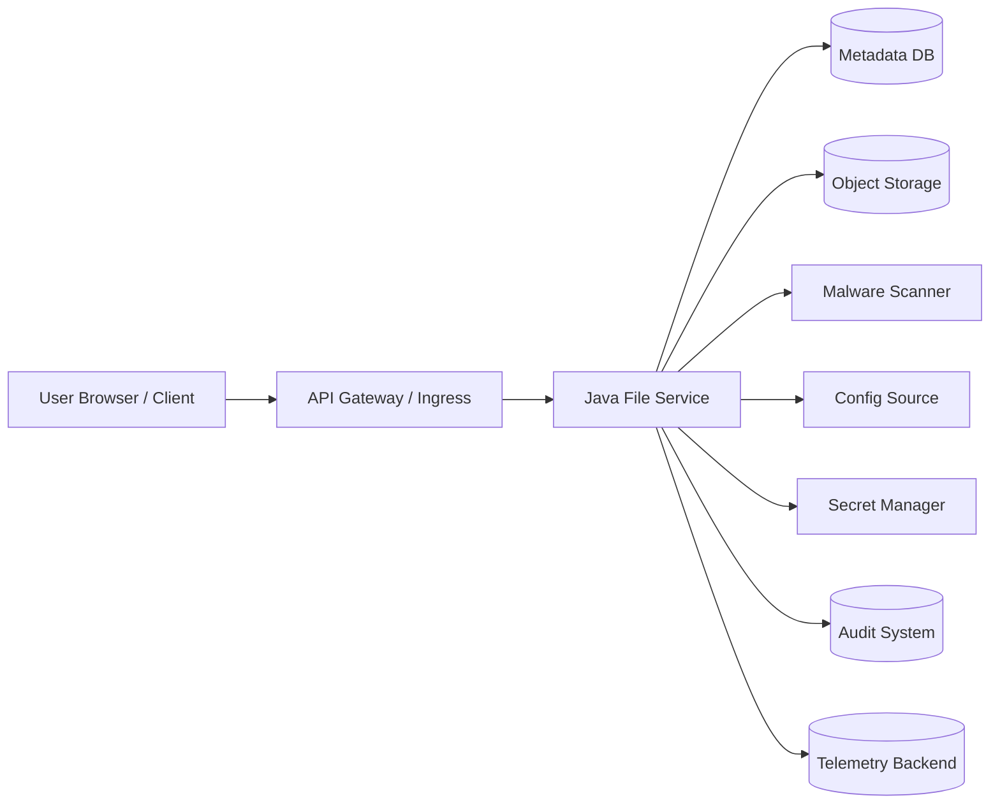
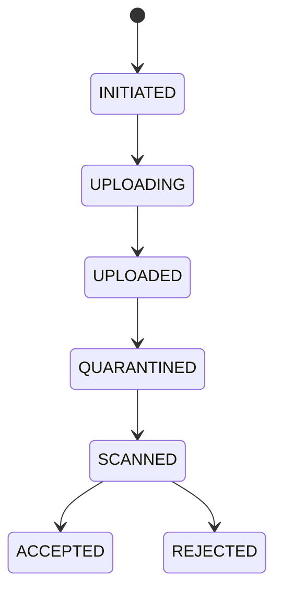
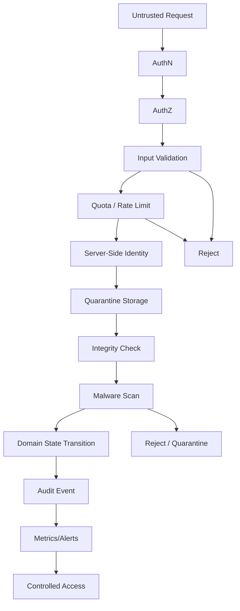

# Part 055 — Threat Modeling Files, Config, and Secrets

> Threat modeling is not a security ceremony.
>
> It is how engineering teams stop lying to themselves about trust boundaries.

Kita sudah membahas file handling, object storage, state management, configuration management, dan secret management. Sekarang kita masuk blok cross-cutting security dan production defensibility.

Part ini menjawab pertanyaan:

```txt
Apa yang bisa diserang, dari mana, oleh siapa, dengan konsekuensi apa,
dan invariant mana yang harus tetap dijaga?
```

Threat modeling di seri ini bukan dokumen panjang yang dibuat sekali lalu dilupakan. Threat modeling adalah cara berpikir yang harus masuk ke design review, code review, test, observability, dan runbook.

Fokus kita bukan semua security topic. Fokusnya sangat spesifik:

- file upload/download;
- object storage;
- metadata;
- local filesystem;
- ephemeral state;
- durable state;
- cache;
- configuration;
- feature flags;
- Kubernetes ConfigMap/Secret;
- Vault/cloud secret manager;
- GitOps secret delivery;
- runtime telemetry.

---

## 1. Threat Model Scope

Untuk Java microservices, threat model harus dimulai dari asset.

Asset di sini bukan hanya database atau bucket. Asset adalah sesuatu yang jika rusak, bocor, dimanipulasi, atau hilang akan berdampak pada correctness, security, compliance, availability, atau cost.

### 1.1 Asset Inventory

| Asset | Example | Primary Risk |
|---|---|---|
| Uploaded payload | PDF, image, evidence video, CSV | malware, spoofing, data leak |
| File metadata | content type, owner, status, checksum | tampering, broken lifecycle |
| Object storage key | bucket/key/version | direct access, overwrite, enumeration |
| Presigned URL | temporary upload/download grant | replay, leak, excessive TTL |
| Temp file | local staging file | path traversal, disk exhaustion |
| Durable state | DB rows, events, workflow status | unauthorized mutation |
| Cache | permission cache, config cache | stale security decision |
| Config | timeout, endpoint, feature toggle, size limit | unsafe behavior change |
| Secret | DB password, token, TLS key | credential compromise |
| Audit event | who did what | evidence gap, tampering |
| Telemetry | logs, traces, metrics | sensitive data leakage |

A weak threat model usually says:

```txt
Asset: database.
```

A useful threat model says:

```txt
Asset: evidence file payload in accepted state,
metadata row linking it to case,
checksum proving integrity,
retention state preventing deletion,
audit trail proving access and lifecycle transition.
```

Specificity matters.

---

## 2. Trust Boundaries

Trust boundary adalah titik di mana kita tidak boleh mempercayai data, identity, atau side effect begitu saja.



Boundary penting:

| Boundary | Jangan Dipercaya |
|---|---|
| Client → API | filename, content-type, size claim, identity claim |
| Gateway → service | forwarded headers tanpa trusted proxy config |
| Service → storage | partial failure, stale read, permission error |
| Service → scanner | scanner timeout, false negative, incomplete scan |
| Service → config | missing config, stale config, wrong precedence |
| Service → secret manager | secret expiry, denied access, stale cache |
| Service → logs/traces | accidental sensitive data |
| Service → DB | concurrency conflict, stale transaction, direct mutation by other actor |
| Kubernetes → app | env var immutability, volume update delay |

Rule:

```txt
Any crossing of trust boundary needs validation, authorization, integrity check,
timeout, audit, and failure handling appropriate to the asset.
```

---

## 3. Threat Modeling Framework

Kita gunakan versi praktis dari STRIDE, tetapi disesuaikan untuk file/config/secret/state.

| STRIDE | Pertanyaan untuk Seri Ini |
|---|---|
| Spoofing | Siapa bisa menyamar sebagai uploader, service, worker, atau secret consumer? |
| Tampering | Siapa bisa mengubah file, metadata, config, secret, atau lifecycle state? |
| Repudiation | Apakah actor bisa menyangkal upload/download/delete/change? |
| Information Disclosure | Apakah payload, secret, config sensitif, atau telemetry bocor? |
| Denial of Service | Apakah file besar, retry storm, config error, atau secret outage bisa menjatuhkan service? |
| Elevation of Privilege | Apakah akses file/secret/config bisa melewati boundary least privilege? |

Tambahkan dua kategori production-grade:

| Category | Pertanyaan |
|---|---|
| Integrity Drift | Apakah metadata, object, cache, index, dan audit bisa diverge? |
| Operational Abuse | Apakah fitur legal/ops seperti presigned URL, debug endpoint, atau config reload bisa disalahgunakan? |

---

## 4. File Upload Threats

File upload adalah salah satu boundary paling berbahaya karena client mengirim binary yang belum dipercaya.

### 4.1 Spoofed Content Type

Client bisa mengirim:

```http
Content-Type: application/pdf
```

tetapi payload sebenarnya executable, zip bomb, HTML, polyglot file, atau malware.

Invariant:

```txt
Client-provided Content-Type is a hint, never a security decision.
```

Mitigation:

- extension allowlist;
- magic bytes/content detection;
- structural parser validation;
- malware scan;
- size limits;
- quarantine-first design;
- no execution;
- no direct serving from upload location.

### 4.2 Dangerous Filename

Spring `MultipartFile#getOriginalFilename()` documentation warns that the original filename is supplied by client and may contain path information or malicious characters. Treat filename as display metadata, not filesystem path.

Bad:

```java
Path target = uploadDir.resolve(file.getOriginalFilename());
```

Better:

```java
String safeDisplayName = sanitizeDisplayName(file.getOriginalFilename());
String storageKey = generateServerSideStorageKey(fileId);
```

Invariant:

```txt
Client filename must never determine physical storage path.
```

### 4.3 Path Traversal

Attack:

```txt
../../../../etc/passwd
..%2f..%2f..%2fapp.yaml
```

Mitigation:

```java
Path base = Path.of("/srv/app/uploads").toRealPath();
Path target = base.resolve(userInputName).normalize();

if (!target.startsWith(base)) {
    throw new SecurityException("Invalid path");
}
```

But for production file upload, better:

```txt
Do not use user filename as path at all.
```

### 4.4 Zip Bomb / Archive Bomb

Uploaded archive can expand massively.

Mitigation:

- max compressed size;
- max uncompressed size;
- max entry count;
- max nesting depth;
- timeout;
- streaming extraction;
- temporary quota;
- no symlink extraction unless explicitly allowed;
- no absolute path extraction.

### 4.5 Malware and Active Content

A “valid PDF” can still contain malicious content.

Mitigation:

- quarantine all uploads;
- scan asynchronously;
- block download until accepted;
- optional content disarm and reconstruction for document types;
- scanner timeout handling;
- re-scan when definitions change if risk requires;
- manual review path.

### 4.6 File Upload DoS

Attack:

- many large uploads;
- slow upload;
- many multipart sessions never completed;
- disk exhaustion in `/tmp`;
- object storage multipart part spam;
- scanner queue flood.

Mitigation:

- authentication before upload;
- per-user/tenant quota;
- max request body size at ingress, service, and app layer;
- rate limit;
- upload session TTL;
- abort incomplete multipart upload;
- scratch volume size limit;
- backpressure;
- worker concurrency control.

---

## 5. File Download Threats

Download looks safer than upload, but it exposes authorization and leakage risks.

### 5.1 Metadata Access vs Payload Access

User may be allowed to see that a file exists but not allowed to download payload.

Invariant:

```txt
Payload access requires an explicit authorization decision,
not just metadata visibility.
```

Bad:

```java
GET /files/{fileId}/download
// if file exists, return presigned URL
```

Better:

```txt
1. Authenticate actor.
2. Load file metadata.
3. Check domain access policy.
4. Check file lifecycle state.
5. Check retention/legal restrictions if needed.
6. Generate short-lived download capability.
7. Audit download decision.
```

### 5.2 Presigned URL Leakage

Presigned URL is a bearer capability.

If leaked, anyone with URL can use it until expiry, unless additional controls exist.

Mitigation:

- short TTL;
- bind to method/object/action;
- avoid logging URL query string;
- do not send via insecure channel;
- audit issuance;
- prefer one-time token pattern for sensitive files if needed;
- never make presigned URL long-lived replacement for authorization.

### 5.3 Cache-Control Mistakes

Sensitive file downloads should not be cached by shared proxy or browser incorrectly.

Headers:

```http
Cache-Control: no-store
Content-Disposition: attachment; filename="safe-name.pdf"
X-Content-Type-Options: nosniff
```

For public assets this differs. But evidence, personal data, or confidential document should default conservative.

### 5.4 Content Sniffing

Browser may interpret content differently from intended type.

Mitigation:

- set correct `Content-Type`;
- set `X-Content-Type-Options: nosniff`;
- serve untrusted content from separate domain if inline rendering is allowed;
- prefer attachment disposition for untrusted uploads.

---

## 6. Object Storage Threats

### 6.1 Bucket Policy Too Broad

Bad:

```txt
service role can read/write/delete all buckets
```

Better:

```txt
evidence-service role can PutObject to evidence/quarantine/*
evidence-worker role can GetObject from quarantine/* and PutObject to accepted/*
download service can GetObject only after domain authorization
no ListBucket unless required
```

Least privilege should be per capability, not per team.

### 6.2 Object Key Enumeration

Object keys can leak information:

```txt
cases/CASE-123/john-smith-medical-record.pdf
```

Better:

```txt
evidence/2026/07/05/FILE-01JZ.../payload
```

Metadata can hold display name, but key should avoid sensitive semantic leak.

### 6.3 Overwrite and Tampering

If accepted object can be overwritten, evidence integrity collapses.

Invariant:

```txt
Accepted artifact must be immutable or tamper-evident.
```

Mitigation:

- object versioning;
- object lock if required;
- no overwrite in accepted prefix;
- checksum verification;
- write-once semantic in service;
- strict IAM;
- audit storage events.

### 6.4 Orphan Objects

Orphan object can become:

- cost leak;
- privacy risk;
- retention ambiguity;
- access ambiguity.

Mitigation:

- metadata-payload reconciliation;
- object tags;
- lifecycle policy for temporary prefix;
- incomplete multipart abort;
- periodic inventory review.

### 6.5 Confused Deputy

Service has broad storage permission and attacker tricks it into accessing object it should not.

Example:

```txt
POST /copy?sourceKey=other-tenant/private-file
```

Mitigation:

- never accept arbitrary object key from user as authority;
- derive storage key from domain metadata;
- authorize source and target through domain model;
- restrict IAM prefix.

---

## 7. Configuration Threats

Configuration changes runtime behavior. That makes config part of the control plane.

### 7.1 Unsafe Override

Spring Boot supports multiple property sources with precedence. A higher-precedence source can override intended safe value.

Threat:

```txt
MALWARE_SCAN_REQUIRED=false
MAX_UPLOAD_SIZE_MB=999999
DIRECT_UPLOAD_ENABLED=true
```

Mitigation:

- typed config validation;
- environment-specific policy;
- config owner approval;
- startup invariant check;
- deny unsafe values in prod;
- effective config audit with redaction;
- GitOps change review.

### 7.2 Config Drift

Manual cluster edit:

```bash
kubectl edit configmap evidence-service-config
```

Impact:

- behavior no longer matches Git;
- rollback unclear;
- audit weak.

Mitigation:

- GitOps reconciliation;
- drift detection;
- restrict direct mutation RBAC;
- annotate config version;
- startup log config source/version;
- alert on live-state drift.

### 7.3 Config as Secret

Common mistake:

```yaml
external-api:
  token: "abc123"
```

inside ConfigMap.

Invariant:

```txt
Secret material must never be stored in ConfigMap or non-sensitive config store.
```

Mitigation:

- secret scan;
- config schema classification;
- policy enforcement;
- naming rules;
- review gates.

### 7.4 Feature Flag Abuse

Feature flags can bypass release controls if too powerful.

Example:

```txt
disableAuthorizationChecks=true
skipMalwareScan=true
```

Mitigation:

- do not implement unsafe bypass flags in prod;
- classify flags by risk;
- audit flag changes;
- require approval for high-risk flags;
- time-bound flags;
- remove stale flags.

---

## 8. Secret Threats

### 8.1 Secret Exfiltration Through Logs

Most secret leaks are not exotic. They are often:

- exception message;
- debug log;
- serialized config object;
- HTTP header log;
- stack trace;
- actuator endpoint;
- CI output.

Invariant:

```txt
Secret value must not appear in logs, metrics, traces, errors, or audit payload.
```

### 8.2 Over-privileged Secret

If service DB credential has admin privileges, compromise becomes catastrophic.

Mitigation:

- least privilege;
- short-lived dynamic secret;
- per-service credential;
- per-environment secret;
- deny shared credentials;
- audit auth usage.

### 8.3 Secret Staleness

Secret rotation fails because app keeps old secret.

Mitigation:

- versioned secret metric;
- rotation overlap;
- connection pool max lifetime;
- readiness check;
- old credential usage audit.

### 8.4 Kubernetes Secret RBAC

Kubernetes docs note that reading Secrets in a namespace enables access to secret data in that namespace. Avoid broad `get/list/watch secrets`.

Mitigation:

- narrow RBAC;
- namespace isolation;
- avoid mounting unnecessary secrets;
- encryption at rest;
- audit secret access;
- use external secret managers where appropriate.

---

## 9. State Threats

### 9.1 Lost Update

Two actors update same state from stale read.

Mitigation:

- optimistic locking/version column;
- compare-and-set transition;
- transaction boundary;
- idempotency key.

### 9.2 Duplicate Event

Event delivered twice promotes file twice or sends duplicate notification.

Mitigation:

- event idempotency;
- processed event table;
- state transition guard;
- monotonic lifecycle.

### 9.3 Stale Cache Authorization

Permission revoked but cache still allows access.

Mitigation:

- short TTL for security-sensitive cache;
- force source-of-truth check on critical operations;
- event invalidation;
- versioned authorization decision;
- cache metrics.

### 9.4 Replay Drift

Rebuild from events produces different state from original due to changed code/config.

Mitigation:

- versioned event schema;
- deterministic replay logic;
- policy version captured;
- replay test;
- conflict detection.

### 9.5 Split Brain Worker

Two workers both think they own a job.

Mitigation:

- database lock with fencing token;
- lease-based leadership;
- idempotent worker output;
- state transition check.

---

## 10. Threat Model by Lifecycle Stage

### 10.1 Upload Lifecycle



Threats by state:

| State | Threat |
|---|---|
| INITIATED | unauthorized session creation, quota bypass |
| UPLOADING | large file DoS, incomplete multipart spam |
| UPLOADED | metadata-payload mismatch |
| QUARANTINED | early download before scan |
| SCANNED | false scan result, duplicate result |
| ACCEPTED | overwrite, unauthorized download |
| REJECTED | retained malware not cleaned up |

### 10.2 Config Change Lifecycle

```txt
PR -> validation -> approval -> merge -> GitOps reconcile -> pod rollout/reload -> runtime proof
```

Threats:

- unauthorized change;
- unsafe value;
- config drift;
- partial rollout;
- stale pod;
- rollback to incompatible config.

### 10.3 Secret Rotation Lifecycle

```txt
create new -> distribute -> consumer switch -> proof -> revoke old
```

Threats:

- new secret invalid;
- old revoked too early;
- consumer not refreshed;
- secret logged during rollout;
- mixed versions too long.

---

## 11. Abuse Cases

Abuse case is attacker-centered story. It is more useful than generic risk list.

### Abuse Case 1 — Upload Polyglot File

```txt
As an attacker, I upload a file named invoice.pdf that is also valid HTML/JS
so that downstream preview renders active content in an employee browser.
```

Controls:

- content detection;
- no inline rendering for untrusted content;
- `nosniff`;
- attachment disposition;
- sandboxed preview domain;
- CDR if needed.

### Abuse Case 2 — Exhaust Scratch Disk

```txt
As an attacker, I start many large uploads and never complete them,
filling /tmp or emptyDir until the pod is evicted.
```

Controls:

- request size limit;
- rate limit;
- upload session TTL;
- scratch quota;
- cleanup job;
- incomplete multipart abort;
- per-tenant quota.

### Abuse Case 3 — Abuse Presigned URL

```txt
As a user with temporary access, I generate a presigned URL and share it
after my domain permission is revoked.
```

Controls:

- short TTL;
- audit issuance;
- permission check before issuance;
- one-time token for sensitive data;
- revoke via object version/key change if needed;
- no long-lived URL.

### Abuse Case 4 — Disable Scan via Config

```txt
As a compromised operator, I set malware.scan.required=false in production.
```

Controls:

- policy forbids unsafe prod config;
- config owner approval;
- admission policy;
- startup invariant;
- alert on effective scan disabled;
- audit config change.

### Abuse Case 5 — Read All Kubernetes Secrets

```txt
As a compromised service account, I list secrets in namespace and steal DB credentials.
```

Controls:

- no broad `list/watch secrets`;
- per-service RBAC;
- namespace isolation;
- workload identity;
- encryption at rest;
- audit secret access;
- avoid injecting all secrets into all pods.

### Abuse Case 6 — Tamper Metadata Directly

```txt
As an insider with DB access, I mark unscanned file as ACCEPTED.
```

Controls:

- DB access control;
- status transition constraints;
- audit trigger;
- checksum/scan result required constraints;
- service-only mutation;
- periodic reconciliation.

---

## 12. Mitigation Architecture



Key design decisions:

- untrusted file never lands directly in accepted storage;
- file identity generated server-side;
- payload not downloadable before lifecycle allows;
- config cannot silently disable security-critical steps;
- secret access is least-privilege;
- every critical transition audited;
- reconciliation catches divergence.

---

## 13. Threat Model Document Template

Gunakan template ini untuk setiap service yang mengelola file/config/secret/state.

```mdx
# Threat Model: <Service Name>

## Scope
- Service:
- Runtime:
- Data classification:
- Environments:

## Assets
| Asset | Classification | Owner | Impact if compromised |
|---|---|---|---|

## Trust Boundaries
| Boundary | Input | Assumption | Validation/Control |
|---|---|---|---|

## Entry Points
| Entry Point | Actor | AuthN | AuthZ | Rate Limit |
|---|---|---|---|---|

## Threats
| Threat | STRIDE | Asset | Impact | Likelihood | Controls |
|---|---|---|---|---|---|

## Abuse Cases
| Abuse Case | Expected Control | Test |
|---|---|---|

## Security Invariants
- ...

## Observability
- Audit events:
- Metrics:
- Alerts:

## Residual Risk
- ...

## Review
- Owner:
- Security reviewer:
- Date:
```

---

## 14. Testing Threat Controls

### 14.1 Security Unit Tests

- path traversal rejected;
- lifecycle transition invalid rejected;
- secret wrapper redacts;
- unsafe config fails startup;
- authorization policy denies payload access.

### 14.2 Integration Tests

- upload file with misleading content type;
- upload huge file beyond limit;
- download without permission;
- presigned URL TTL enforced;
- config scan disable forbidden in prod;
- secret missing fails readiness.

### 14.3 Failure Injection

- scanner timeout;
- object storage returns 403/503;
- DB commit fails after object write;
- secret manager unavailable;
- config source stale;
- duplicate scan event.

### 14.4 Abuse Case Tests

Convert every abuse case into at least one test or manual security scenario.

Example:

```txt
Given a user has access to file F
And user generates presigned URL with TTL 5 minutes
When user permission is revoked
Then new URL issuance is denied
And old URL expires within 5 minutes
And issuance/revocation is audited
```

---

## 15. Review Checklist

### Files

```txt
[ ] Client filename not used as path
[ ] Content type not trusted from client
[ ] Upload size limited at all layers
[ ] Raw upload quarantined
[ ] Accepted file immutable/tamper-evident
[ ] Download requires payload authorization
[ ] Presigned URL short-lived and not logged
[ ] Temp files cleaned and quota-bound
```

### State

```txt
[ ] Source of truth explicit
[ ] Critical state not only in memory/local disk
[ ] Duplicate event safe
[ ] Lost update handled
[ ] Replay drift considered
[ ] Cache correctness risk classified
```

### Configuration

```txt
[ ] Unsafe prod values blocked
[ ] Required config validated at startup
[ ] Config provenance known
[ ] Runtime reload only for reload-safe values
[ ] ConfigMap does not contain secret
[ ] Drift detection exists
```

### Secrets

```txt
[ ] Secret least privilege
[ ] No broad secret RBAC
[ ] Secret not logged
[ ] Rotation strategy documented
[ ] Consumer refresh method defined
[ ] Secret manager/KMS access audited
```

### Observability

```txt
[ ] Security events audited
[ ] Sensitive data redacted
[ ] Invariant violation metrics exist
[ ] Alert on high-risk failure
[ ] Runbook exists
```

---

## 16. Key Takeaways

1. **Threat modeling starts with specific assets, not generic infrastructure labels.**
2. **File upload is untrusted binary crossing a dangerous boundary.**
3. **Client filename, content type, size claim, and metadata are not authority.**
4. **Object storage keys must not become domain authorization.**
5. **Configuration is a control plane and can disable security if not governed.**
6. **Secret risk includes logs, RBAC, stale cache, rotation, and runtime consumers.**
7. **State threats include lost update, duplicate event, stale cache, split brain, and replay drift.**
8. **Presigned URLs are bearer capabilities; treat them as temporary access grants.**
9. **Every abuse case should map to a control and a test.**
10. **Threat modeling is useful only when it changes code, config, tests, alerts, or runbooks.**

Next, we focus on one of the most common real-world failure classes: **Sensitive Data Leakage Prevention** across logs, metrics, traces, exceptions, config dumps, file exports, and operational tooling.

---

## References

- OWASP File Upload Cheat Sheet: https://cheatsheetseries.owasp.org/cheatsheets/File_Upload_Cheat_Sheet.html
- OWASP Threat Modeling Cheat Sheet: https://cheatsheetseries.owasp.org/cheatsheets/Threat_Modeling_Cheat_Sheet.html
- OWASP Logging Cheat Sheet: https://cheatsheetseries.owasp.org/cheatsheets/Logging_Cheat_Sheet.html
- OWASP Secrets Management Cheat Sheet: https://cheatsheetseries.owasp.org/cheatsheets/Secrets_Management_Cheat_Sheet.html
- Kubernetes Secrets: https://kubernetes.io/docs/concepts/configuration/secret/
- Kubernetes Good Practices for Secrets: https://kubernetes.io/docs/concepts/security/secrets-good-practices/
- Spring MultipartFile Javadoc: https://docs.spring.io/spring-framework/docs/current/javadoc-api/org/springframework/web/multipart/MultipartFile.html
