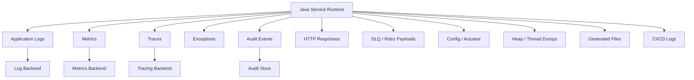
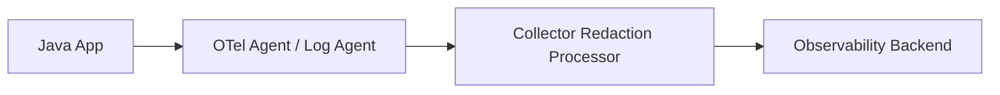

# Part 056 — Sensitive Data Leakage Prevention

> The most common data breach in internal systems is not a cinematic exploit.
>
> It is a log line someone thought was harmless.

Sensitive data leakage prevention adalah disiplin memastikan data sensitif tidak keluar dari boundary yang seharusnya.

Dalam Java microservices, kebocoran sering terjadi lewat:

- logs;
- metrics;
- traces;
- exception messages;
- HTTP access logs;
- audit payload;
- config dumps;
- actuator endpoints;
- heap dump;
- thread dump;
- generated file/export;
- dead-letter queue;
- retry payload;
- CI/CD logs;
- support tooling;
- dashboards;
- alert messages;
- presigned URL logs;
- object key naming.

Part ini bukan hanya “jangan log password”. Kita akan membahas desain sistematis untuk mengklasifikasikan data, membatasi propagation, membuat redaction, dan menguji bahwa leakage tidak terjadi.

OpenTelemetry secara eksplisit menempatkan tanggung jawab handling sensitive data pada implementer, karena telemetry library tidak dapat mengetahui sendiri data mana yang sensitif untuk domain tertentu. OWASP Logging guidance juga menekankan bahwa data sensitif tidak boleh disimpan dalam log tanpa kebutuhan dan kontrol yang tepat.

---

## 1. What Counts as Sensitive?

Jangan batasi sensitive data hanya ke password.

Untuk service file/config/secret/state, data sensitif mencakup:

| Category | Examples |
|---|---|
| Secret material | password, token, API key, private key, signing key |
| Authentication data | session ID, JWT, refresh token, auth code |
| Authorization capability | presigned URL, one-time download token |
| PII | name, email, phone, address, national ID |
| Financial data | account number, payment detail, invoice sensitive fields |
| Health/legal data | medical record, investigation note, enforcement evidence |
| Security metadata | internal IP, service account token path, KMS key use |
| File payload | uploaded document, attachment, image, evidence |
| File metadata | filename, case ID, owner, content hash in some contexts |
| Config sensitive value | endpoint with embedded credential, feature flag revealing security posture |
| Operational secret | database URL with password, broker credential |
| Correlation-sensitive data | request ID combined with user ID and case ID |

Important:

```txt
Data can be non-sensitive alone but sensitive when combined.
```

Example:

```txt
caseId + userId + timestamp + action = sensitive audit context
```

---

## 2. Leakage Surfaces



Every arrow is a potential exfiltration path.

Common weak assumption:

```txt
"It's internal logs, so it's okay."
```

Wrong. Logs are often copied to:

- central observability vendor;
- data lake;
- developer laptop;
- incident ticket;
- Slack alert;
- long-term archive;
- SIEM;
- AI analysis tool;
- support dashboard.

A log line can travel farther than production database access.

---

## 3. Data Classification Model

Use classification before redaction.

Example classification:

| Level | Meaning | Handling |
|---|---|---|
| Public | safe for public docs | no special control |
| Internal | internal operational info | avoid external exposure |
| Confidential | customer/business sensitive | minimize logs, access control |
| Restricted | secrets, credentials, regulated data | never log raw |
| Evidence | legally/audit sensitive artifact | strict access, retention, audit |

In code, model data semantics.

```java
public enum Sensitivity {
    PUBLIC,
    INTERNAL,
    CONFIDENTIAL,
    RESTRICTED,
    EVIDENCE
}
```

Data wrapper:

```java
public record SensitiveValue(String label, String value, Sensitivity sensitivity) {
    @Override
    public String toString() {
        return "[REDACTED:" + label + "]";
    }

    public String revealForAuthorizedUse() {
        return value;
    }
}
```

This is not perfect memory protection, but it makes accidental logging harder.

---

## 4. Logging Rules

### 4.1 Golden Rule

```txt
Log decisions and identifiers, not raw sensitive payloads.
```

Good:

```txt
fileId=FILE-01JZ status=QUARANTINED scanResult=CLEAN actor=user-123 correlationId=req-abc
```

Bad:

```txt
filename=john-smith-medical-report.pdf contentBase64=...
Authorization=Bearer eyJ...
presignedUrl=https://bucket.s3...
```

### 4.2 Log Stable Internal IDs

Prefer:

- `fileId`;
- `caseId` if allowed;
- `actorId`;
- `tenantId`;
- `correlationId`;
- `secretVersion`;
- `configVersion`.

Avoid raw:

- filename with personal data;
- email;
- token;
- document content;
- URL with signed query string;
- database URL with password.

### 4.3 Structured Logging

Use structured logging so fields can be redacted by key.

Example Logback/logstash style:

```java
log.info("File accepted fileId={} status={} scanDecision={} correlationId={}",
    fileId,
    status,
    scanDecision,
    correlationId
);
```

Avoid:

```java
log.info("Upload request: {}", request);
```

`request.toString()` may include headers, body, token, filename, or form fields.

### 4.4 MDC Hygiene

Mapped Diagnostic Context is useful but dangerous.

Good MDC:

```java
MDC.put("correlationId", correlationId);
MDC.put("tenantId", tenantId);
MDC.put("actorId", actorId);
```

Bad MDC:

```java
MDC.put("authorization", authHeader);
MDC.put("email", userEmail);
MDC.put("fileName", originalFilename);
MDC.put("presignedUrl", url);
```

Always clear MDC after request in thread-pool environments.

```java
try {
    MDC.put("correlationId", correlationId);
    chain.doFilter(request, response);
} finally {
    MDC.clear();
}
```

Virtual threads reduce some thread reuse concerns, but MDC propagation still needs explicit design depending on logging framework and async boundaries.

---

## 5. Redaction Strategy

Redaction should be layered.

### 5.1 Prevent

Best: do not create log event with sensitive value.

### 5.2 Type-Safe Redaction

Use value types whose `toString()` redacts.

```java
public final class SecretValue {
    private final String value;

    public SecretValue(String value) {
        if (value == null || value.isBlank()) {
            throw new IllegalArgumentException("Secret cannot be blank");
        }
        this.value = value;
    }

    public String reveal() {
        return value;
    }

    @Override
    public String toString() {
        return "[REDACTED]";
    }
}
```

### 5.3 Field-Based Redaction

Redact by structured keys:

```txt
password
token
authorization
cookie
set-cookie
apiKey
secret
privateKey
presignedUrl
signature
credential
```

### 5.4 Pattern-Based Redaction

Useful for fallback:

- JWT regex;
- AWS access key pattern;
- `Authorization: Bearer`;
- URL query param `X-Amz-Signature`;
- credit card number;
- email depending policy.

But pattern redaction is not enough. It has false negatives and false positives.

### 5.5 Collector-Level Redaction

If using OpenTelemetry Collector or log pipeline, redact before export to external backend.

Architecture:



Redaction should happen as close to source as practical, but collector-level protection is a useful backstop.

---

## 6. Exception Leakage

Exceptions leak more than logs because developers often log whole object context.

Bad:

```java
throw new IllegalStateException("Failed with request " + request);
```

Bad:

```java
log.error("Failed to call dependency headers={} body={}", headers, body, ex);
```

Better:

```java
log.error("Failed to call dependency dependency={} operation={} status={} correlationId={}",
    "scanner",
    "scanFile",
    statusCode,
    correlationId,
    ex
);
```

### 6.1 Safe Error Response

Never return internal details to client.

Bad response:

```json
{
  "error": "Failed to connect jdbc:postgresql://db/evidence?user=evidence&password=secret"
}
```

Better:

```json
{
  "errorCode": "DEPENDENCY_UNAVAILABLE",
  "message": "The request cannot be completed right now.",
  "correlationId": "req-abc"
}
```

### 6.2 Exception Classification

```java
public enum ErrorExposure {
    CLIENT_SAFE,
    INTERNAL_ONLY,
    SECURITY_SENSITIVE
}
```

Use exception mapper:

```java
public record ApiError(
    String code,
    String message,
    String correlationId
) {}
```

Expose safe message, log internal context with redaction.

---

## 7. HTTP Header Leakage

Headers that must be redacted:

```txt
Authorization
Cookie
Set-Cookie
X-Api-Key
X-Amz-Security-Token
X-Amz-Signature
Proxy-Authorization
X-Forwarded-Client-Cert
```

If logging inbound/outbound HTTP, implement explicit allowlist.

Good:

```txt
log headers: content-type, content-length, user-agent, x-request-id
```

Bad:

```txt
log all headers except a few known ones
```

Allowlist beats blocklist.

---

## 8. Presigned URL Leakage

Presigned URLs often contain signature and credential scope in query parameters.

Bad:

```java
log.info("Generated presigned URL {}", presignedUrl);
```

Better:

```java
log.info("Generated presigned URL fileId={} method={} expiresAt={}",
    fileId,
    "GET",
    expiresAt
);
```

If you must log URL shape:

```txt
s3://bucket/evidence/.../payload?signature=[REDACTED]
```

But usually do not log URL at all.

Also avoid:

- returning presigned URL in error body;
- storing presigned URL in audit event;
- putting presigned URL in metrics label;
- sending presigned URL to third-party telemetry.

---

## 9. Metrics Leakage

Metrics labels are dangerous because they are high-cardinality and widely visible.

Bad:

```txt
file_download_total{filename="john-smith-report.pdf", userEmail="john@example.com"}
```

Better:

```txt
file_download_total{status="success", fileType="pdf", tenantTier="enterprise"}
```

### 9.1 Metrics Rules

Do not put these in labels:

- user email;
- raw user ID if policy forbids;
- file name;
- file ID if high cardinality;
- URL;
- token;
- case title;
- error message;
- SQL query;
- object key with semantic data;
- exception stack trace.

Use bounded labels:

- operation;
- status;
- error class;
- dependency;
- region;
- environment;
- lifecycle state.

### 9.2 Secret Version Metrics

In Part 054, we mentioned secret version metrics. Be careful.

Good:

```txt
secret_refresh_success_total{secret="evidence-db"}
secret_seconds_until_expiry{secret="evidence-db"}
```

Maybe acceptable with bounded version:

```txt
secret_current_version_info{secret="evidence-db", version="v42"} 1
```

Avoid raw secret manager version IDs if long/high-cardinality or sensitive. Use sanitized release version if needed.

---

## 10. Trace Leakage

Distributed tracing captures:

- HTTP route;
- headers;
- query params;
- attributes;
- exception event;
- database statements;
- messaging payload metadata.

Threat:

```txt
GET /download?token=abc123
```

If the full URL is captured, token leaks.

### 10.1 Trace Attribute Policy

Allowed:

```txt
http.request.method
http.route
http.response.status_code
service.name
deployment.environment
file.lifecycle.status
```

Dangerous:

```txt
http.url with query string
authorization header
request body
response body
file original name
presigned URL
SQL with literal values
```

Prefer route template:

```txt
/files/{fileId}/download
```

not:

```txt
/files/FILE-123/download?token=...
```

### 10.2 Span Events

Bad:

```java
span.addEvent("request", Attributes.of(
    stringKey("body"), requestBody
));
```

Better:

```java
span.addEvent("file.upload.validated", Attributes.of(
    stringKey("file.lifecycle.status"), "UPLOADED",
    longKey("file.size.bytes"), sizeBytes
));
```

Even `file.size.bytes` may be sensitive in some domains, but it is usually safer than filename or content.

---

## 11. Audit Log vs Application Log

Do not mix audit and app logs.

| Application Log | Audit Log |
|---|---|
| debugging/operations | accountability/evidence |
| may be sampled/rotated | retention governed |
| contains operational events | contains material decisions |
| often accessible by engineers | restricted access |
| redacted | redacted but evidence-grade |
| can include error context | includes actor/action/object/result |

Audit log should answer:

```txt
who did what to which artifact, when, under which policy, with what result
```

But audit log should still avoid raw sensitive payload.

Good audit event:

```json
{
  "eventType": "FILE_DOWNLOAD_GRANTED",
  "actorId": "user-123",
  "artifactType": "EVIDENCE_FILE",
  "artifactId": "FILE-01JZ",
  "policyVersion": "case-access-v7",
  "decision": "ALLOW",
  "correlationId": "req-abc",
  "occurredAt": "2026-07-05T10:00:00Z"
}
```

Bad audit event:

```json
{
  "eventType": "FILE_DOWNLOAD_GRANTED",
  "presignedUrl": "https://bucket.s3...?X-Amz-Signature=...",
  "jwt": "eyJ..."
}
```

---

## 12. Config and Actuator Leakage

Spring Boot Actuator can expose useful operational endpoints. In production, configure exposure carefully.

Dangerous surfaces:

- `/actuator/env`;
- `/actuator/configprops`;
- `/actuator/heapdump`;
- `/actuator/threaddump`;
- `/actuator/logfile`;
- `/actuator/prometheus` if labels leak;
- custom debug endpoint.

Rules:

```txt
Do not expose config dump endpoints publicly.
Do not assume sanitization catches all secret names.
Do not put secret in config if it belongs in secret store.
```

Use:

- endpoint exposure allowlist;
- management port/network restriction;
- authentication/authorization;
- sanitizer customization;
- disable heapdump in normal production path;
- no public actuator.

Example:

```yaml
management:
  endpoints:
    web:
      exposure:
        include: health,info,prometheus
  endpoint:
    env:
      show-values: never
```

---

## 13. Heap Dump and Thread Dump Leakage

Heap dump can contain:

- tokens;
- passwords;
- request bodies;
- file content chunks;
- decrypted secrets;
- user data;
- cached authorization decisions.

Thread dump can contain:

- stack frames with sensitive string values in some cases;
- thread names containing user/request data;
- SQL/debug context;
- file names.

Controls:

- restrict heapdump access;
- encrypt dump storage;
- define dump retention;
- do not auto-upload dumps to broad buckets;
- sanitize before sharing externally;
- limit who can trigger dumps;
- prefer ephemeral secure incident storage.

Java cannot guarantee secret strings disappear immediately from memory. Do not overclaim memory secrecy. Minimize lifetime and avoid unnecessary copies.

---

## 14. Dead Letter Queue and Retry Payload Leakage

DLQ often stores failed message payloads.

If message contains:

- file metadata with personal data;
- presigned URL;
- token;
- raw request body;
- secret;
- user detail;

then DLQ becomes sensitive storage.

Rules:

```txt
DLQ must be classified according to payload sensitivity.
Retry payload must not contain secret material unless absolutely required.
```

Better message design:

```json
{
  "eventId": "evt-123",
  "fileId": "FILE-01JZ",
  "operation": "SCAN_FILE",
  "attempt": 3
}
```

Avoid:

```json
{
  "presignedUrl": "...",
  "fileContentBase64": "...",
  "authorizationHeader": "Bearer ..."
}
```

Worker can fetch payload by authorized service identity using `fileId`.

---

## 15. Generated Files and Exports

Reports, CSV exports, and debug bundles are a major leakage path.

Controls:

- classification per export type;
- explicit user authorization;
- watermark/audit if needed;
- row/column filtering by policy;
- no hidden columns with sensitive data;
- short-lived download link;
- retention and cleanup;
- encryption for archive/export;
- generated file lifecycle state;
- export audit event.

CSV-specific risk:

- formula injection (`=HYPERLINK(...)`);
- embedded sensitive fields;
- accidental extra columns;
- filenames with PII;
- export stored in public bucket.

Mitigation:

- escape formula-leading characters if opened in spreadsheet;
- explicit schema;
- approved columns;
- server-side generated safe filename;
- no direct public access.

---

## 16. Object Key and Filename Leakage

Even if payload is protected, object key can leak.

Bad:

```txt
s3://evidence-prod/cases/CASE-123/john-smith-police-report.pdf
```

Better:

```txt
s3://evidence-prod/evidence/2026/07/05/FILE-01JZ/payload
```

Original filename can still be stored as metadata if needed, but access to metadata must be controlled.

Downloaded filename should be sanitized:

```java
public String safeDownloadName(String originalName) {
    String fallback = "download.bin";
    if (originalName == null || originalName.isBlank()) {
        return fallback;
    }

    return originalName
        .replace("\\", "_")
        .replace("/", "_")
        .replace("\r", "")
        .replace("\n", "")
        .replace("\"", "'");
}
```

Also avoid response header injection through filename.

---

## 17. Java Redaction Utilities

### 17.1 Redacting Headers

```java
public final class HeaderRedactor {
    private static final Set<String> ALLOWED_HEADERS = Set.of(
        "content-type",
        "content-length",
        "user-agent",
        "x-request-id",
        "traceparent"
    );

    public Map<String, String> safeHeaders(Map<String, List<String>> headers) {
        Map<String, String> result = new LinkedHashMap<>();

        for (Map.Entry<String, List<String>> entry : headers.entrySet()) {
            String key = entry.getKey().toLowerCase(Locale.ROOT);

            if (ALLOWED_HEADERS.contains(key)) {
                result.put(key, String.join(",", entry.getValue()));
            } else {
                result.put(key, "[REDACTED]");
            }
        }

        return result;
    }
}
```

### 17.2 Redacting URL

```java
public final class UrlRedactor {
    private static final Set<String> SENSITIVE_QUERY_KEYS = Set.of(
        "token",
        "signature",
        "x-amz-signature",
        "x-amz-security-token",
        "access_token",
        "refresh_token",
        "code"
    );

    public URI redact(URI uri) {
        if (uri.getRawQuery() == null) {
            return uri;
        }

        String safeQuery = Arrays.stream(uri.getRawQuery().split("&"))
            .map(pair -> {
                int idx = pair.indexOf('=');
                String key = idx >= 0 ? pair.substring(0, idx) : pair;
                String normalized = URLDecoder.decode(key, StandardCharsets.UTF_8)
                    .toLowerCase(Locale.ROOT);

                if (SENSITIVE_QUERY_KEYS.contains(normalized)) {
                    return key + "=[REDACTED]";
                }

                return pair;
            })
            .collect(Collectors.joining("&"));

        try {
            return new URI(
                uri.getScheme(),
                uri.getAuthority(),
                uri.getPath(),
                safeQuery,
                uri.getFragment()
            );
        } catch (URISyntaxException ex) {
            throw new IllegalArgumentException("Invalid URI", ex);
        }
    }
}
```

### 17.3 Safe DTO Logging

Bad:

```java
log.info("Request {}", uploadRequest);
```

Better:

```java
public record UploadRequestLogView(
    String fileId,
    long sizeBytes,
    String detectedContentType,
    String actorId
) {}
```

Log the log view, not the domain/request object.

---

## 18. Logback Redaction Concept

Example conceptual TurboFilter/encoder approach:

```txt
application code should avoid logging sensitive data
+
log encoder redacts known fields
+
log pipeline redacts patterns as backstop
+
backend access controlled
```

Do not rely only on regex at backend. It is too late if logs are already forwarded to multiple sinks.

---

## 19. OpenTelemetry Sensitive Data Policy

OpenTelemetry instrumentation can be automatic. Automatic instrumentation is useful, but it may capture more than expected.

Policy:

```txt
Telemetry must be treated as data export.
```

Controls:

- disable capture of request/response bodies;
- sanitize headers;
- drop query string;
- use route template;
- configure DB statement sanitization;
- collector processor redaction;
- environment-specific exporter policy;
- restrict backend access.

Span naming:

Good:

```txt
HTTP POST /files/{fileId}/download
```

Bad:

```txt
HTTP POST /files/FILE-123/download?token=abc
```

---

## 20. CI/CD Leakage

CI/CD often handles:

- decrypted SOPS files;
- rendered manifests;
- docker build args;
- test config;
- Maven settings;
- cloud credentials;
- kubeconfig;
- secret scanner output.

Rules:

```txt
CI logs are production data if they can contain production secret.
```

Controls:

- masked secrets;
- no shell tracing around secret commands;
- no upload decrypted artifacts;
- ephemeral runners;
- restricted job permissions;
- environment approvals;
- no secrets in build args;
- use workload identity/OIDC where possible;
- scan logs/artifacts for leaks.

Bad:

```dockerfile
ARG DB_PASSWORD
RUN echo $DB_PASSWORD
```

Also bad:

```bash
set -x
sops -d secret.sops.yaml
```

---

## 21. Access Control for Observability

If logs contain sensitive operational context, log backend needs access control.

Minimum:

- environment separation;
- team-based access;
- audit access to log search;
- restricted raw log export;
- retention limit;
- masking in UI;
- break-glass process for sensitive logs;
- no broad vendor/admin access without review.

Do not make developers query production logs with unrestricted full-text access to all tenants unless policy allows it.

---

## 22. Data Minimization Patterns

### 22.1 Tokenize

Log token reference, not token.

```txt
tokenId=tok_123
```

### 22.2 Hash with Salt/Pepper

For some identifiers, log irreversible hash for correlation.

Careful: unsalted hash of low-entropy values like email can be brute-forced.

### 22.3 Truncate

Useful for debugging but still risky.

```txt
fileId prefix maybe okay
token prefix not okay unless policy permits
```

### 22.4 Classify and Store Separately

Sensitive audit evidence may need restricted audit store, not generic app logs.

### 22.5 Separate Payload from Control Message

Message carries `fileId`, not file content or presigned URL.

---

## 23. Leakage Prevention Tests

### 23.1 Unit Test Secret Redaction

```java
@Test
void secretToStringIsRedacted() {
    SecretValue secret = new SecretValue("super-secret");
    assertEquals("[REDACTED]", secret.toString());
}
```

### 23.2 Log Capture Test

Use test appender to assert sensitive value not logged.

```java
@Test
void uploadFailureDoesNotLogAuthorizationHeader() {
    String token = "Bearer secret-token";

    service.handleFailure(token);

    assertThat(logs()).doesNotContain("secret-token");
}
```

### 23.3 Integration Test Error Response

```txt
Given dependency error contains internal secret-looking detail
When API returns error
Then response contains safe code and correlationId
And does not contain JDBC URL/password/token
```

### 23.4 Telemetry Test

Validate exported spans:

```txt
[ ] no Authorization header
[ ] no query token
[ ] no request body
[ ] no presigned URL
[ ] route template used
```

### 23.5 CI Policy Test

Fail build if plaintext secret detected in:

- repository;
- rendered manifests;
- logs;
- generated docs;
- test snapshots.

---

## 24. Incident Response for Leakage

If sensitive data leaks into logs:

```txt
1. Identify data type.
2. Stop further leakage.
3. Rotate secret if credential/capability leaked.
4. Restrict log backend access.
5. Determine exposure window.
6. Delete/purge if policy and system allow.
7. Audit who accessed logs.
8. Notify required parties based on classification/regulation.
9. Add test and redaction rule.
10. Update runbook.
```

If secret leaked:

```txt
Assume compromised. Rotate.
```

If presigned URL leaked:

```txt
Expire quickly, rotate object key/version if necessary,
review access logs, reduce TTL/control issuance.
```

If PII leaked:

```txt
Follow privacy/compliance incident process.
```

---

## 25. Production Checklist

### Logging

```txt
[ ] No request/response body logging by default
[ ] Header logging allowlist
[ ] Query string redaction
[ ] Secret wrapper redacts toString
[ ] DTO logging uses safe log view
[ ] MDC does not contain sensitive fields
[ ] Logs access controlled
```

### Metrics

```txt
[ ] No high-cardinality sensitive labels
[ ] No user email/filename/token/object key labels
[ ] Error labels bounded
[ ] Secret metrics expose health, not values
```

### Tracing

```txt
[ ] No auth headers
[ ] No request/response body
[ ] Route templates used
[ ] Query params dropped/redacted
[ ] DB statements sanitized
[ ] Collector redaction configured
```

### Exceptions

```txt
[ ] Client responses safe
[ ] Internal exceptions sanitized
[ ] Dependency errors classified
[ ] Stack traces not exposed externally
```

### Config/Actuator

```txt
[ ] Actuator env/configprops restricted
[ ] Heapdump endpoint disabled/restricted
[ ] Management endpoint protected
[ ] Config values redacted
```

### Files/Exports

```txt
[ ] Object key avoids PII
[ ] Filename sanitized
[ ] Exports have explicit schema
[ ] CSV formula injection handled
[ ] Generated file lifecycle and cleanup defined
```

### CI/CD

```txt
[ ] No decrypted secrets in artifacts
[ ] No shell tracing for secret commands
[ ] Secret scanning enabled
[ ] Build logs access controlled
```

---

## 26. Key Takeaways

1. **Telemetry is data export. Treat it as such.**
2. **Sensitive data includes more than passwords: presigned URLs, filenames, headers, case IDs, and payload-derived metadata may be sensitive.**
3. **Prevent sensitive logging at source; pipeline redaction is only a backstop.**
4. **Use allowlists for headers and structured logging fields.**
5. **Do not put sensitive data in metrics labels.**
6. **Traces must avoid query strings, auth headers, bodies, and raw file metadata.**
7. **Audit logs need evidence-grade events, not raw secrets or payload.**
8. **Config dumps, heap dumps, DLQs, and CI logs are common leakage paths.**
9. **Leakage prevention must be tested like any other invariant.**
10. **If credential material leaks, rotate; do not debate intent.**

Next, we move deeper into data protection mechanics: **Encryption in Transit and at Rest**, including TLS, KMS, envelope encryption, object storage encryption, DB encryption, and Java implementation boundaries.

---

## References

- OWASP Logging Cheat Sheet: https://cheatsheetseries.owasp.org/cheatsheets/Logging_Cheat_Sheet.html
- OWASP Secrets Management Cheat Sheet: https://cheatsheetseries.owasp.org/cheatsheets/Secrets_Management_Cheat_Sheet.html
- OWASP Error Handling Cheat Sheet: https://cheatsheetseries.owasp.org/cheatsheets/Error_Handling_Cheat_Sheet.html
- OpenTelemetry Handling Sensitive Data: https://opentelemetry.io/docs/security/handling-sensitive-data/
- OpenTelemetry Logs Data Model: https://opentelemetry.io/docs/specs/otel/logs/data-model/
- Kubernetes Good Practices for Secrets: https://kubernetes.io/docs/concepts/security/secrets-good-practices/
- Spring Boot Actuator Endpoints: https://docs.spring.io/spring-boot/reference/actuator/endpoints.html
