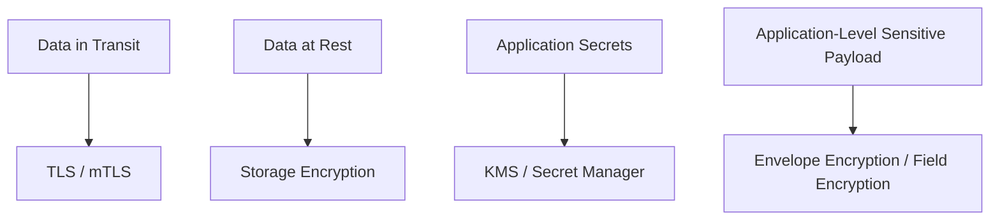
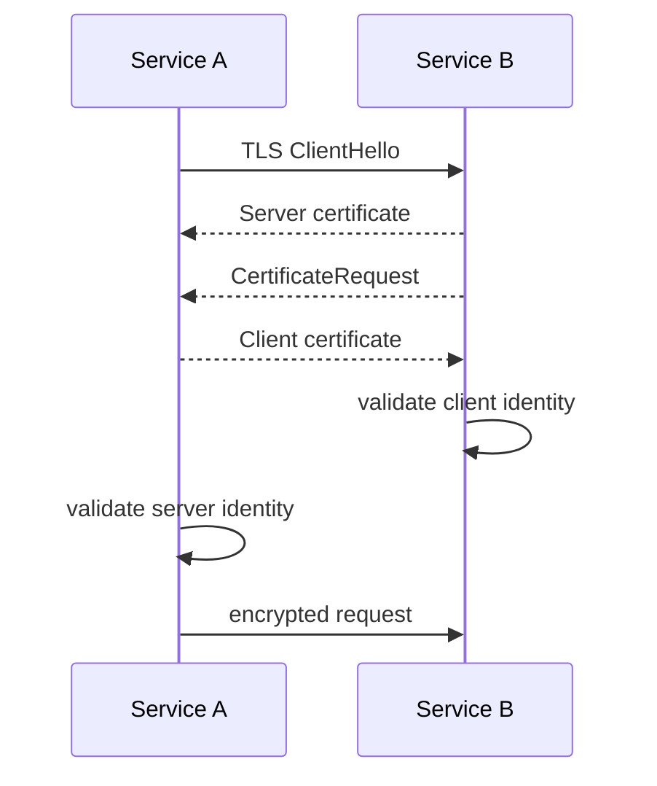
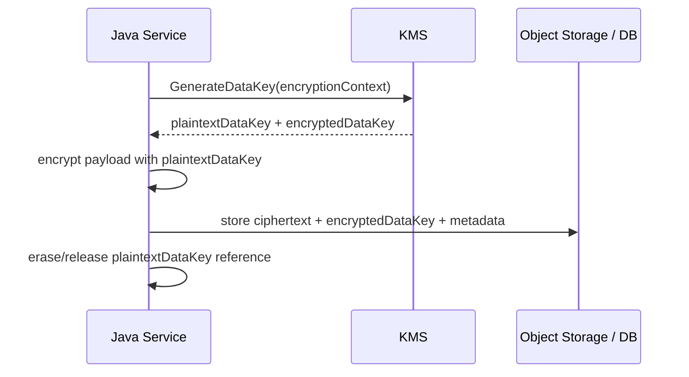
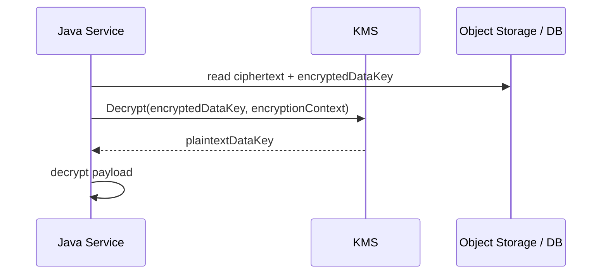
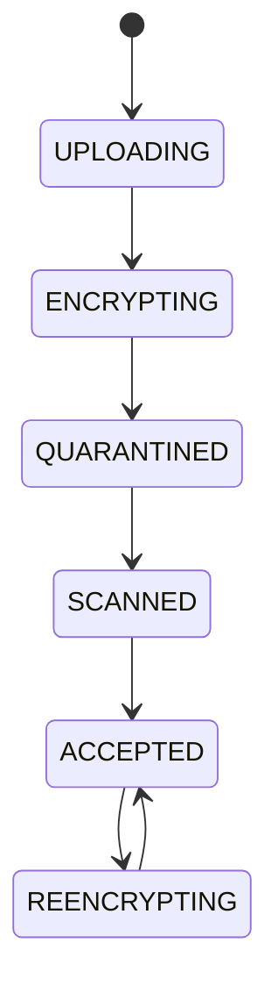

# Part 057 — Encryption in Transit and at Rest

> Encryption is not a checkbox.
>
> It is a boundary design: what is protected, from whom, at which layer, with which key, and how failure is handled.

Setelah leakage prevention, kita masuk ke proteksi data yang lebih fundamental: encryption.

Di Java microservices, encryption sering dibahas terlalu dangkal:

```txt
Use HTTPS.
Enable S3 encryption.
Use KMS.
Done.
```

Itu belum cukup untuk production-grade system. Encryption yang benar harus menjawab:

- data apa yang dilindungi;
- saat transit atau saat at rest;
- siapa yang memegang key;
- siapa yang boleh decrypt;
- bagaimana key dirotasi;
- apa yang terjadi saat KMS down;
- apakah encryption melindungi dari threat yang benar;
- apakah metadata juga bocor;
- apakah app layer masih bisa log plaintext;
- apakah backup, DLQ, export, cache, dan temp file ikut terlindungi.

Encryption juga bukan pengganti authorization. Jika service punya permission decrypt terlalu luas, data tetap bisa bocor walaupun disimpan terenkripsi.

---

## 1. Encryption Mental Model

Gunakan model empat lapis:



| Layer | Protects | Does Not Automatically Protect |
|---|---|---|
| TLS | network path | compromised app, bad authz, logs |
| mTLS | peer identity + network path | bad policy, stolen workload cert |
| Storage encryption | disk/media/storage backend | app with read permission |
| KMS | key custody and decrypt authorization | plaintext after decrypt |
| Envelope encryption | per-object/per-record key isolation | metadata leakage, bad key policy |
| Field encryption | selected sensitive fields | queryability and app misuse |

Core invariant:

```txt
Data must be encrypted at every boundary where an unauthorized actor could observe it,
and decryption capability must be narrower than storage/read capability.
```

---

## 2. Encryption in Transit

Encryption in transit protects communication over network.

For Java services, common paths:

```txt
Client -> Ingress/API Gateway
Ingress -> Java service
Java service -> database
Java service -> object storage
Java service -> broker
Java service -> secret manager
Java service -> internal service
Java service -> observability backend
```

Do not stop at external HTTPS. Internal traffic can also carry secrets, tokens, file metadata, presigned URLs, and personal data.

### 2.1 TLS

Java uses JSSE (`javax.net.ssl`) as the standard secure socket framework. JSSE provides TLS/SSL-related secure socket classes for encryption and peer authentication.

In Spring Boot, TLS server config commonly looks like:

```yaml
server:
  ssl:
    enabled: true
    key-store: classpath:server.p12
    key-store-type: PKCS12
    key-store-password: ${SERVER_KEYSTORE_PASSWORD}
    key-alias: evidence-service
```

But embedding keystore inside jar is rarely ideal for production. Better:

```yaml
server:
  ssl:
    enabled: true
    key-store: file:/run/tls/server.p12
    key-store-type: PKCS12
    key-store-password: ${SERVER_KEYSTORE_PASSWORD}
```

or terminate TLS at ingress/service mesh and use mTLS inside mesh.

### 2.2 TLS Is Not One Thing

TLS configuration includes:

- protocol version;
- cipher suites;
- certificate chain;
- hostname verification;
- trust anchor;
- client authentication if mTLS;
- certificate rotation;
- revocation/expiry handling;
- endpoint identity semantics.

Bad assumption:

```txt
If it connects, TLS is correct.
```

A connection can succeed while hostname verification is disabled or truststore is too broad.

### 2.3 Hostname Verification

Client must verify it connected to intended peer.

Bad anti-pattern:

```java
TrustManager[] trustAll = new TrustManager[] { /* accepts everything */ };
HostnameVerifier allowAll = (host, session) -> true;
```

This converts TLS into encryption without identity. It is vulnerable to man-in-the-middle.

Invariant:

```txt
TLS client must validate certificate chain and endpoint identity unless there is a documented, tested, and restricted exception.
```

### 2.4 mTLS

mTLS adds client certificate authentication.



mTLS is useful for:

- service-to-service identity;
- zero-trust internal networks;
- high-sensitivity internal APIs;
- reducing reliance on static API keys;
- workload authentication to internal systems.

But mTLS alone does not decide authorization. It says “this is workload X”. Policy must still decide what X can do.

---

## 3. Java Keystore and Truststore

Java usually deals with:

| Store | Contains | Purpose |
|---|---|---|
| Keystore | private key + certificate chain | prove this service identity |
| Truststore | CA/public certs | decide which peers to trust |

Common formats:

- PKCS12;
- JKS legacy;
- PEM depending framework/client.

### 3.1 Store Placement

Do not commit keystore/truststore private material to Git.

Delivery options:

- mounted Kubernetes Secret;
- cert-manager generated Secret;
- service mesh certificate injection;
- Vault PKI sidecar/agent;
- cloud-managed workload identity where applicable.

### 3.2 Truststore Scope

A truststore that trusts every corporate root CA may be too broad for critical internal service calls.

Better:

```txt
Trust only the CA or SPIFFE trust domain needed for this dependency.
```

Trade-off:

- narrow truststore improves security;
- broad truststore simplifies operations;
- service mesh can centralize trust policy;
- certificate rotation needs overlap.

### 3.3 Certificate Expiry

Certificate expiry is one of the simplest avoidable outages.

Metrics:

```txt
certificate_seconds_until_expiry{cert="server"}
certificate_seconds_until_expiry{cert="client-db"}
```

Alerts:

```txt
cert expires < 30 days: warning
cert expires < 7 days: critical
cert expires < 24 hours: page
```

---

## 4. Encryption at Rest

Encryption at rest protects stored data from storage-layer exposure: disks, snapshots, backups, object storage media, stolen volumes, storage admin mistakes, and some compliance requirements.

But it does not protect data from a service that is authorized to read it.

### 4.1 Object Storage Encryption

For S3-style storage, common options:

| Mode | Meaning | Key Control |
|---|---|---|
| SSE-S3 | provider-managed server-side encryption | provider managed |
| SSE-KMS | server-side encryption with KMS key | KMS policy/IAM control |
| SSE-C | customer-provided key per request | app manages key material |
| Client-side encryption | encrypt before upload | app/KMS manages data keys |

Amazon S3 encrypts new object uploads by default with SSE-S3, and SSE-KMS allows encryption with AWS KMS keys.

### 4.2 Why SSE-KMS Matters

SSE-KMS gives extra control:

- key policy;
- IAM condition;
- CloudTrail/KMS audit;
- key rotation;
- separation between storage read and decrypt permission;
- encryption context for policy/audit.

Design invariant:

```txt
Reading object storage and decrypting sensitive object data should be separate capabilities where practical.
```

### 4.3 S3 PutObject with SSE-KMS

Conceptual Java SDK usage:

```java
PutObjectRequest request = PutObjectRequest.builder()
    .bucket(bucket)
    .key(storageKey)
    .serverSideEncryption(ServerSideEncryption.AWS_KMS)
    .ssekmsKeyId(kmsKeyId)
    .metadata(Map.of(
        "file-id", fileId,
        "sha256", sha256
    ))
    .build();

s3.putObject(request, RequestBody.fromFile(path));
```

Do not hardcode KMS key ID in code if environment-specific. Use typed config with validation.

### 4.4 KMS Key Policy Mistakes

Common mistakes:

- one KMS key for all services and environments;
- broad decrypt permission to all workloads;
- no separation between encrypt and decrypt;
- no audit of decrypt;
- no condition on encryption context;
- disabled key breaks critical workloads without readiness signal;
- key deletion scheduled accidentally.

Better:

```txt
KMS key scoped by environment + data domain + sensitivity.
```

Example:

```txt
kms-prod-evidence-files
kms-prod-config-secrets
kms-staging-evidence-files
```

---

## 5. Envelope Encryption

Envelope encryption uses two levels of key:

```txt
Data Key encrypts payload.
KMS Key encrypts Data Key.
```

Flow:



Read flow:



Envelope encryption is useful when:

- per-file/per-tenant isolation needed;
- client-side encryption required;
- object storage provider should not see plaintext;
- app must store encrypted payload in DB/object storage;
- key access audit matters;
- cryptographic erasure is desired through key destruction.

### 5.1 Encryption Context

Encryption context is additional authenticated metadata used by KMS and audit.

Example:

```txt
fileId=FILE-01JZ
tenantId=TENANT-123
dataDomain=evidence
```

Invariant:

```txt
Encryption context used for decrypt must match encryption context used for encrypt.
```

This helps prevent ciphertext/data key from being replayed in another context.

### 5.2 Java AES-GCM Sketch

Use authenticated encryption. AES-GCM provides confidentiality and integrity for ciphertext.

Conceptual implementation:

```java
public record EncryptedPayload(
    byte[] ciphertext,
    byte[] iv,
    byte[] encryptedDataKey,
    String algorithm,
    String keyId
) {}
```

```java
public EncryptedPayload encrypt(byte[] plaintext, SecretKey dataKey, byte[] aad) {
    byte[] iv = secureRandomBytes(12);

    Cipher cipher = Cipher.getInstance("AES/GCM/NoPadding");
    GCMParameterSpec spec = new GCMParameterSpec(128, iv);
    cipher.init(Cipher.ENCRYPT_MODE, dataKey, spec);
    cipher.updateAAD(aad);

    byte[] ciphertext = cipher.doFinal(plaintext);

    return new EncryptedPayload(ciphertext, iv, encryptedDataKey, "AES/GCM/NoPadding", kmsKeyId);
}
```

Rules:

- never reuse IV with same key;
- use authenticated encryption;
- include relevant AAD;
- store algorithm/version;
- test decryption failure;
- do not invent crypto protocols;
- prefer vetted libraries/KMS SDK patterns.

---

## 6. Database Encryption

Database encryption has layers.

| Layer | Example | Protects Against |
|---|---|---|
| Disk/volume encryption | managed database storage encryption | storage media exposure |
| TDE | transparent database encryption | database files/backups exposure |
| Column/field encryption | app or DB encrypts selected columns | narrower data exposure |
| Application envelope encryption | app encrypts before DB | DB operator/read replica exposure |
| TLS DB connection | network path | network sniffing/MITM |

### 6.1 At-Rest DB Encryption Is Not Enough

If a DB user can run:

```sql
SELECT sensitive_field FROM evidence_case;
```

then storage encryption does not help. The DB engine decrypts data for authorized users.

For highly sensitive fields, consider application-level encryption or tokenization.

### 6.2 Queryability Trade-off

Encrypting fields reduces query capability.

| Need | Impact |
|---|---|
| exact match | possible with deterministic encryption/tokenization, with leakage trade-off |
| range query | hard without specialized crypto/search design |
| full-text search | often requires separate protected index |
| sorting | usually not compatible with strong encryption |
| analytics | requires privacy-preserving pipeline or controlled decrypt zone |

Do not add field encryption without understanding product/query requirements.

---

## 7. Local File and Temp Encryption

File handling often uses temp files.

Question:

```txt
Does sensitive plaintext ever touch local disk?
```

Examples:

- multipart upload staging;
- PDF generation;
- zip extraction;
- AV scanning copy;
- export generation;
- object download cache.

Controls:

- use encrypted node/volume storage;
- use memory only if small and safe;
- use scratch volume with restricted access;
- delete temp files reliably;
- avoid world-readable permissions;
- do not write secrets to temp files;
- consider app-level encryption for temp artifacts;
- set retention and cleanup.

Kubernetes `emptyDir` is ephemeral. Ephemeral does not mean encrypted or safe by default. It means lifecycle tied to Pod/node semantics.

---

## 8. Backup and Replica Encryption

Data copies matter.

Checklist:

```txt
[ ] database backups encrypted
[ ] object storage replicas encrypted
[ ] snapshots encrypted
[ ] exported reports encrypted or access-controlled
[ ] DLQ payload classified/encrypted
[ ] audit logs protected
[ ] search index protected
[ ] cache persistence protected
[ ] disaster recovery environment has key access policy
```

Important:

```txt
If primary data is encrypted but backups are not, data is not effectively encrypted.
```

---

## 9. Key Rotation

Encryption key rotation differs from secret rotation.

### 9.1 KMS Key Rotation

Provider-managed KMS rotation may rotate backing key material while preserving key ID. Existing ciphertext can still decrypt through KMS.

### 9.2 Re-encryption Rotation

Sometimes you must re-encrypt data:

```txt
old KMS key -> new KMS key
old data key -> new data key
old algorithm -> new algorithm
```

This needs migration plan:

- identify encrypted records/objects;
- support read old/write new;
- lazy re-encrypt on read or batch re-encrypt;
- track encryption version;
- verify checksum/integrity;
- avoid huge blast radius;
- rollback plan;
- progress metrics.

### 9.3 Crypto-Shredding

If each tenant/file has separate encrypted data key, deleting the key can make ciphertext unrecoverable.

This can support deletion semantics, but be careful:

- backups may still contain key;
- key deletion has waiting period in cloud KMS;
- audit/compliance retention may forbid deletion;
- accidental key loss is catastrophic.

---

## 10. Encryption Metadata Model

For files:

```java
public record EncryptionMetadata(
    String mode,
    String algorithm,
    String kmsKeyId,
    String encryptedDataKeyRef,
    String encryptionContextHash,
    int encryptionVersion,
    Instant encryptedAt
) {}
```

For object metadata, avoid putting sensitive values in metadata. Metadata itself may be visible to actors who can list/read object metadata.

Store sensitive encryption metadata in DB if needed.

---

## 11. Failure Modeling

### 11.1 KMS Unavailable

What happens when KMS cannot decrypt?

Options:

- fail closed;
- serve cached decrypted key for short TTL if allowed;
- degrade read/download operations;
- continue writes with local data key? usually risky;
- queue work until KMS returns.

Invariant:

```txt
If data cannot be decrypted safely, service must not fabricate plaintext or bypass encryption policy.
```

### 11.2 Wrong Key Policy

Symptoms:

- `AccessDenied` on decrypt;
- uploads succeed but downloads fail;
- staging works, prod fails;
- new pod identity cannot decrypt old data.

Controls:

- integration tests with real IAM/KMS path;
- canary decrypt;
- startup/readiness check for required key capability;
- audit denied decrypt.

### 11.3 Metadata Lost

If encrypted data key or algorithm version is lost, ciphertext may be unrecoverable.

Controls:

- durable metadata;
- backup metadata with payload;
- versioned encryption schema;
- reconciliation.

### 11.4 Algorithm Migration

Do not change encryption algorithm without read compatibility.

Strategy:

```txt
write version 2, read version 1 and 2, migrate gradually, remove version 1 only after proof.
```

---

## 12. Java Service Design Pattern

Avoid scattering encryption calls.

Use a domain port:

```java
public interface PayloadEncryptionService {
    EncryptedPayload encrypt(FileId fileId, byte[] plaintext);
    byte[] decrypt(FileId fileId, EncryptedPayload encryptedPayload);
}
```

For streaming large files, avoid `byte[]`:

```java
public interface StreamingEncryptionService {
    OutputStream encryptingOutputStream(FileId fileId, OutputStream target);
    InputStream decryptingInputStream(FileId fileId, InputStream source);
}
```

But streaming AEAD is subtle. Prefer vetted libraries or cloud SDK client-side encryption libraries when available. If implementing, design chunked authenticated encryption with per-chunk nonce and manifest integrity.

---

## 13. Encryption and File Lifecycle

Encryption state should be part of file metadata lifecycle.



Invariant:

```txt
Accepted sensitive file must have valid encryption metadata and decrypt test evidence.
```

During re-encryption:

- do not lose old object before new object verified;
- preserve version/audit;
- handle partial migration;
- avoid making file unavailable unless planned.

---

## 14. Encryption Is Not Authorization

This is critical.

Bad model:

```txt
Object is encrypted, so broad read access is okay.
```

No.

If the role also has decrypt permission, encryption adds little against that role. If service can generate presigned URLs for anyone, encryption at rest does not protect downloads.

Correct model:

```txt
Authorization decides who can ask for access.
Encryption limits who can transform ciphertext into plaintext.
Audit records both.
```

---

## 15. Production Checklist

### Transit

```txt
[ ] TLS enabled for external traffic
[ ] internal sensitive traffic protected by TLS/mTLS or equivalent trusted boundary
[ ] hostname verification enabled
[ ] no trust-all manager
[ ] certificate expiry monitored
[ ] truststore scoped appropriately
[ ] cert rotation tested
```

### At Rest

```txt
[ ] object storage encryption enabled
[ ] sensitive buckets use KMS where required
[ ] DB/storage/backups encrypted
[ ] temp file handling classified
[ ] DLQ/export/search/cache copies protected
[ ] metadata leakage reviewed
```

### KMS

```txt
[ ] KMS key scoped by environment/domain
[ ] encrypt and decrypt permissions least-privilege
[ ] key policy reviewed
[ ] decrypt audited
[ ] key rotation strategy documented
[ ] key deletion protected
```

### Application-Level Encryption

```txt
[ ] encryption version stored
[ ] algorithm stored
[ ] encrypted data key stored durably
[ ] encryption context defined
[ ] re-encryption path exists
[ ] decryption failure observable
```

### Operations

```txt
[ ] KMS outage runbook
[ ] cert expiry alert
[ ] decrypt denied alert
[ ] encryption migration dashboard
[ ] canary decrypt test
```

---

## 16. Key Takeaways

1. **TLS protects the network path, not application misuse.**
2. **mTLS proves workload identity but still needs authorization policy.**
3. **Storage encryption protects at-rest media, not against authorized readers.**
4. **SSE-KMS separates storage access from decrypt capability when policies are designed correctly.**
5. **Envelope encryption gives finer-grained key isolation but adds metadata and rotation complexity.**
6. **Field encryption affects queryability; design it with product requirements.**
7. **Temp files, backups, DLQ, exports, cache, and search indexes are part of the encryption boundary.**
8. **Key rotation is a migration problem, not only a key setting.**
9. **Encryption failure must fail closed and be observable.**
10. **Encryption is not a substitute for least privilege.**

Next, we focus exactly on that: **Access Control and Least Privilege** across IAM, RBAC, ServiceAccount, Workload Identity, object storage, config, secret, and runtime operations.

---

## References

- Java Secure Socket Extension JSSE Reference Guide: https://docs.oracle.com/en/java/javase/11/security/java-secure-socket-extension-jsse-reference-guide.html
- Java SE 21 `javax.net.ssl`: https://docs.oracle.com/en/java/javase/21/docs/api/java.base/javax/net/ssl/package-summary.html
- Java Security Standard Algorithm Names: https://docs.oracle.com/en/java/javase/21/docs/specs/security/standard-names.html
- Amazon S3 Server-Side Encryption with S3 Managed Keys: https://docs.aws.amazon.com/AmazonS3/latest/userguide/UsingServerSideEncryption.html
- Amazon S3 Server-Side Encryption with AWS KMS: https://docs.aws.amazon.com/AmazonS3/latest/userguide/UsingKMSEncryption.html
- AWS KMS Concepts: https://docs.aws.amazon.com/kms/latest/developerguide/concepts.html
- Kubernetes Secrets Good Practices: https://kubernetes.io/docs/concepts/security/secrets-good-practices/
