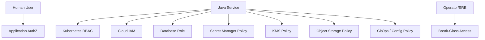
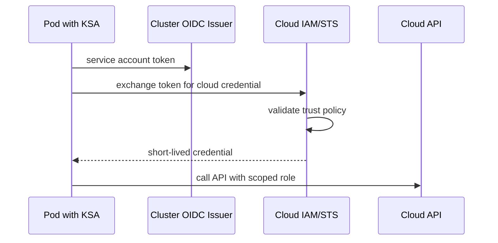
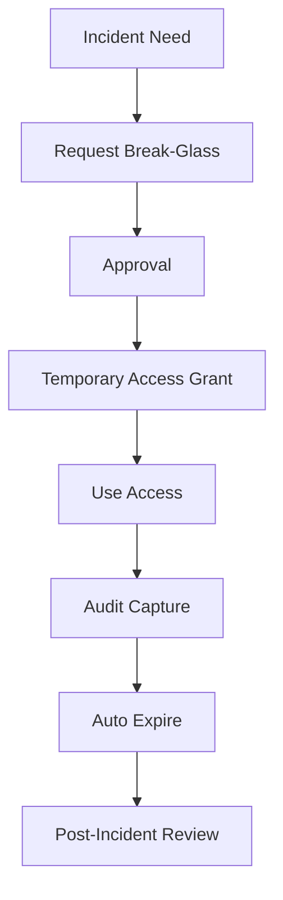

# Part 058 — Access Control and Least Privilege

> Least privilege is not “give fewer permissions”.
>
> It is “give exactly the capability needed for a specific actor to perform a specific action at a specific boundary.”

Encryption protects data under certain conditions. Access control decides who can reach the protected thing in the first place.

Untuk file, state, config, dan secret, access control muncul di banyak lapisan:

- application authorization;
- object storage IAM;
- KMS decrypt policy;
- Kubernetes RBAC;
- ServiceAccount binding;
- cloud workload identity;
- database role;
- broker ACL;
- secret manager policy;
- ConfigMap mutation permission;
- GitOps repository permission;
- observability backend access;
- break-glass operational access.

Akses yang buruk biasanya bukan karena tidak ada security. Biasanya karena permission diberikan terlalu luas agar deployment cepat jalan.

Contoh:

```txt
evidence-service can read/write/delete all S3 objects in all buckets,
read all Kubernetes Secrets in namespace,
update ConfigMaps,
and decrypt all KMS keys.
```

Itu bukan production-grade. Itu incident waiting to happen.

---

## 1. Capability Mental Model

Jangan berpikir dalam resource saja. Berpikir dalam capability.

```txt
Actor + Action + Resource + Condition + Time + Audit = Capability
```

Example:

```txt
Actor: evidence-scan-worker ServiceAccount
Action: GetObject
Resource: s3://regulator-prod-evidence/quarantine/*
Condition: only prod cluster workload identity, TLS, specific KMS context
Time: while workload exists
Audit: storage access log + KMS decrypt log + app audit
```

A capability should be:

- specific;
- necessary;
- time-bounded where possible;
- environment-scoped;
- auditable;
- revocable;
- testable.

---

## 2. Access Control Planes



Each plane answers different questions.

| Plane | Question |
|---|---|
| App authorization | Can this user perform this domain action? |
| Kubernetes RBAC | Can this workload/operator read/update Kubernetes API objects? |
| Cloud IAM | Can this workload call cloud APIs? |
| DB role | Can this service read/write tables/functions? |
| Secret policy | Can this service retrieve this secret? |
| KMS policy | Can this identity decrypt this ciphertext/key? |
| Storage policy | Can this service get/put/delete object keys? |
| Config policy | Can this actor change runtime behavior? |
| Observability access | Can this actor see sensitive telemetry? |

Do not collapse these into one “admin role”.

---

## 3. Application Authorization for Files

Application authorization is domain-aware.

Storage IAM cannot know:

- whether user belongs to case team;
- whether case is sealed;
- whether evidence is under legal hold;
- whether download is allowed during appeal;
- whether user can view metadata but not payload.

So file download must pass through domain authorization before issuing storage capability.

```java
public interface FileAuthorizationService {
    boolean canViewMetadata(UserContext actor, FileRecord file);
    boolean canDownloadPayload(UserContext actor, FileRecord file);
    boolean canAttachToCase(UserContext actor, CaseId caseId);
    boolean canRequestDeletion(UserContext actor, FileRecord file);
}
```

Invariant:

```txt
Storage access is never the first authorization decision for domain-sensitive files.
```

### 3.1 Metadata vs Payload Permission

```txt
canViewMetadata != canDownloadPayload
```

Example:

| Role | Metadata | Payload |
|---|---:|---:|
| Case viewer | yes | maybe no |
| Investigator | yes | yes |
| External party | limited | limited/time-bound |
| Auditor | yes | controlled/break-glass |
| Storage operator | no domain access | no payload via app |

---

## 4. Kubernetes RBAC

Kubernetes RBAC controls access to Kubernetes API resources. Default RBAC policies grant scoped control-plane permissions but do not automatically give broad permissions to normal service accounts outside system namespaces.

Important resources for this series:

- `secrets`;
- `configmaps`;
- `pods`;
- `deployments`;
- `events`;
- `leases`;
- custom resources like `externalsecrets` or `sealedsecrets`.

### 4.1 Avoid Broad Secret Permissions

Dangerous:

```yaml
rules:
  - apiGroups: [""]
    resources: ["secrets"]
    verbs: ["get", "list", "watch"]
```

For a service account, `list/watch secrets` in a namespace is often equivalent to reading many credentials.

Prefer:

```yaml
rules:
  - apiGroups: [""]
    resources: ["secrets"]
    resourceNames: ["evidence-db"]
    verbs: ["get"]
```

Even better: avoid the app needing Kubernetes API read on Secrets. Mount only the specific secret needed.

### 4.2 Role vs ClusterRole

| Type | Scope | Use |
|---|---|---|
| Role | namespace | application namespace permissions |
| ClusterRole | cluster-wide or reusable | controllers/operators/system roles |

For application workloads, default to namespaced `Role` unless there is a strong reason.

### 4.3 Privilege Escalation Verbs

Kubernetes RBAC good practices warn that some privileges can escalate access.

Be careful with:

- `create pods`;
- `update deployments`;
- `create rolebindings`;
- `bind`;
- `escalate`;
- `impersonate`;
- `get secrets`;
- `create serviceaccounts/token`;
- access to admission/webhook resources.

If a service can create arbitrary pods, it may mount service accounts or secrets depending cluster policy. Treat this as high risk.

---

## 5. ServiceAccount Design

One ServiceAccount per application capability boundary.

Bad:

```txt
namespace default ServiceAccount used by every workload
```

Better:

```txt
evidence-api-sa
evidence-worker-sa
evidence-scan-worker-sa
evidence-reconciler-sa
```

Why split?

| Workload | Needed Capability |
|---|---|
| API | create upload session, issue presigned URLs |
| Scan worker | read quarantine object, write scan result |
| Reconciler | list metadata, cleanup temp objects |
| Export worker | generate reports, write export bucket |

Different workloads need different storage, DB, KMS, and secret permissions.

### 5.1 Disable Default Token Automount

For pods that do not need Kubernetes API:

```yaml
spec:
  automountServiceAccountToken: false
```

This reduces token exposure inside containers.

### 5.2 Bound Service Account Tokens

Modern Kubernetes uses projected, bounded tokens for service accounts. Still, treat tokens as sensitive.

Controls:

- do not log token;
- restrict filesystem access;
- avoid shell/debug access;
- disable automount where not needed;
- use audience-bound tokens where applicable.

---

## 6. Workload Identity

Static cloud credentials mounted as Kubernetes Secrets create rotation and leakage risk.

Better pattern:

```txt
Kubernetes ServiceAccount -> cloud workload identity -> short-lived cloud credentials
```

Examples:

- AWS IAM Roles for Service Accounts / Pod Identity;
- GKE Workload Identity Federation;
- Azure Workload Identity for AKS.

Mental model:



Advantages:

- no long-lived cloud key in Kubernetes Secret;
- per-service identity;
- short-lived credential;
- cloud audit logs;
- easier revocation through IAM binding.

Risk:

- trust policy misconfigured;
- ServiceAccount too broadly reusable;
- namespace compromise;
- token audience/issuer mistakes;
- cloud role too broad.

---

## 7. Object Storage Least Privilege

Do not give service full bucket access unless necessary.

### 7.1 Prefix-Based Capability

Example split:

| Actor | Permission |
|---|---|
| API | `PutObject` to `uploads/tmp/*` |
| Upload finalizer | `CompleteMultipartUpload` for known upload IDs |
| Scanner | `GetObject` from `quarantine/*`, `PutObject` to `accepted/*` |
| Download broker | `GetObject` from `accepted/*` after app authz |
| Cleanup worker | `DeleteObject` only from `tmp/*` and expired rejected files |
| Reconciler | `ListBucket` limited to known prefixes |

Avoid `DeleteObject` on accepted evidence unless lifecycle policy explicitly permits.

### 7.2 No User-Controlled Key Authority

User should not send arbitrary object key for service to act on.

Bad:

```json
{
  "sourceKey": "other-tenant/private/file.pdf"
}
```

Better:

```json
{
  "fileId": "FILE-01JZ"
}
```

Service resolves `fileId` to storage key after authorization.

### 7.3 KMS Coupling

If object uses SSE-KMS, storage permission alone is not enough. The role also needs KMS permission.

This is good if designed deliberately:

```txt
GetObject allowed + Decrypt denied = cannot read plaintext.
```

But application must have exactly the decrypt permissions required for its objects.

---

## 8. KMS Least Privilege

Separate capabilities:

| KMS Action | Use |
|---|---|
| Encrypt | write encrypted data |
| Decrypt | read plaintext |
| GenerateDataKey | envelope encryption write |
| ReEncrypt | migration/rotation |
| DescribeKey | health/metadata |
| ScheduleKeyDeletion | highly restricted |

Do not give application `kms:*`.

Use encryption context where supported:

```txt
Only allow decrypt if context includes dataDomain=evidence and environment=prod.
```

This reduces cross-domain misuse.

---

## 9. Secret Manager Least Privilege

Secret access should be per service and per capability.

Bad:

```txt
evidence-service can read /prod/*
```

Better:

```txt
evidence-api can read /prod/evidence/api/*
evidence-worker can read /prod/evidence/worker/*
```

For Vault policy:

```hcl
path "secret/data/prod/evidence/db" {
  capabilities = ["read"]
}

path "database/creds/evidence-reader" {
  capabilities = ["read"]
}
```

Avoid giving app secret write unless it is responsible for secret creation.

### 9.1 Secret Version Access

Some systems allow reading all versions. Be deliberate.

If old secret versions remain readable, compromise may expose revoked credentials or historic signing keys.

---

## 10. Database Least Privilege

Database roles should match service responsibility.

Bad:

```txt
evidence-service uses postgres superuser
```

Better:

```sql
CREATE ROLE evidence_app LOGIN;
GRANT USAGE ON SCHEMA evidence TO evidence_app;
GRANT SELECT, INSERT, UPDATE ON evidence.file_metadata TO evidence_app;
GRANT SELECT, INSERT ON evidence.audit_outbox TO evidence_app;
REVOKE DELETE ON evidence.file_metadata FROM evidence_app;
```

Use stored procedures or domain-specific DB roles for dangerous operations if needed.

### 10.1 Migration Role vs Runtime Role

Separate:

| Role | Capability |
|---|---|
| migration role | DDL, schema migration |
| runtime app role | DML required by service |
| read-only role | reporting/debug |
| break-glass role | emergency controlled access |

Do not let runtime app role perform schema migration in production unless your governance explicitly accepts that risk.

---

## 11. Config Mutation Access

Config is a control plane.

Access to change config can be equivalent to changing code behavior.

Dangerous config examples:

```txt
malware.scan.required=false
max.upload.size=100GB
download.public.enabled=true
auth.issuer.url=http://fake-issuer
retry.max-attempts=100000
```

Controls:

- GitOps PR review;
- ownership metadata;
- policy validation;
- environment-specific constraints;
- approval for high-risk keys;
- drift detection;
- no direct cluster edit for production config.

### 11.1 Config Change Authorization Matrix

| Config Type | Owner | Approval |
|---|---|---|
| timeout/retry | service + SRE | service review |
| upload max size | service + product + security if risky | product/security depending threshold |
| retention | compliance/domain | compliance approval |
| auth issuer | security/platform | security approval |
| bucket/KMS key | platform/service/security | platform/security approval |
| feature flag | release owner | product/release governance |

---

## 12. Observability Access Control

Logs, metrics, traces, audit events, and dashboards can contain sensitive data.

Least privilege applies here too.

Access levels:

| Role | Access |
|---|---|
| developer | staging logs, limited prod service logs |
| on-call engineer | prod logs for owned service |
| security | cross-service security events |
| auditor | audit trail, not raw debug logs |
| support | customer-scoped operational view |
| platform admin | backend operation, restricted data access |

Controls:

- environment separation;
- tenant scoping;
- log redaction;
- dashboard permissions;
- audit queries;
- break-glass for broad search;
- retention policy.

---

## 13. Break-Glass Access

Break-glass is emergency access outside normal least privilege.

It must be:

- rare;
- time-bound;
- approved;
- strongly authenticated;
- logged;
- monitored;
- reviewed afterward.

Flow:



Anti-pattern:

```txt
Permanent admin role called break-glass.
```

That is not break-glass. That is standing privilege.

---

## 14. Policy as Code

Least privilege should be verified, not only documented.

Tools/patterns:

- OPA/Gatekeeper;
- Kyverno;
- Conftest;
- IAM Access Analyzer;
- cloud policy simulator;
- Kubernetes audit;
- RBAC review tools;
- GitOps policy checks;
- CI assertions.

Example policy intent:

```txt
No application ServiceAccount may have list/watch secrets.
No production workload may use default ServiceAccount.
No app role may have kms:ScheduleKeyDeletion.
No service may have object storage wildcard delete in accepted prefix.
```

---

## 15. Java Service Defensive Design

Even with IAM/RBAC, app code must enforce domain-level access.

### 15.1 Do Not Trust Infrastructure Permission as User Permission

Bad:

```java
public URL download(String fileId) {
    return storage.presign(fileRepository.get(fileId).storageKey());
}
```

Better:

```java
public URL download(UserContext actor, FileId fileId) {
    FileRecord file = fileRepository.getRequired(fileId);

    if (!authorization.canDownloadPayload(actor, file)) {
        audit.denied(actor, "FILE_DOWNLOAD", fileId);
        throw new AccessDeniedException("Not allowed to download this file");
    }

    if (!file.lifecycle().isDownloadable()) {
        throw new IllegalStateException("File is not downloadable");
    }

    audit.allowed(actor, "FILE_DOWNLOAD", fileId);
    return storage.presignRead(file.storageKey(), Duration.ofMinutes(5));
}
```

### 15.2 Capability Object

Represent capability explicitly.

```java
public record FileReadCapability(
    FileId fileId,
    UserId actorId,
    Instant expiresAt,
    String policyVersion
) {}
```

Do not pass raw bucket/key across layers as authorization.

---

## 16. Least Privilege Review by Artifact

### 16.1 File Payload

```txt
Who can create?
Who can read raw quarantine object?
Who can promote to accepted?
Who can download accepted payload?
Who can delete?
Who can list prefixes?
Who can decrypt?
```

### 16.2 Metadata

```txt
Who can insert file metadata?
Who can change lifecycle status?
Who can update checksum?
Who can mark deletion requested?
Who can query cross-tenant?
```

### 16.3 Config

```txt
Who can change key?
Who approves high-risk values?
Who can override in emergency?
Who can edit live cluster state?
```

### 16.4 Secret

```txt
Who can create secret?
Who can read secret?
Who can rotate secret?
Who can revoke secret?
Who can read old versions?
Who can access audit logs?
```

---

## 17. Access Review Automation

Production environments need periodic review.

Signals:

```txt
service account with no pods using it
role binding to deleted user
wildcard IAM action
wildcard resource
secret read permission unused for 90 days
KMS decrypt permission unused
S3 delete permission unused but present
human admin role with no recent approval
```

Reduce standing privilege.

### 17.1 Permission Drift

Access drifts because:

- emergency grants never removed;
- old services retired;
- migrations added temporary permissions;
- new bucket prefixes added broadly;
- platform migration duplicates roles;
- copy-paste manifests.

Use drift detection and review.

---

## 18. Testing Least Privilege

### 18.1 Positive Tests

Service can do what it needs:

```txt
[ ] API can create upload session
[ ] worker can read quarantine object
[ ] scanner can write scan result
[ ] app can read its DB secret
[ ] app can decrypt its object
```

### 18.2 Negative Tests

Service cannot do what it should not:

```txt
[ ] API cannot list all secrets
[ ] API cannot delete accepted objects
[ ] scan worker cannot read unrelated bucket prefix
[ ] app cannot decrypt other service KMS key
[ ] runtime DB role cannot run DDL
[ ] non-owner cannot mutate production ConfigMap
```

Negative tests are where least privilege becomes real.

### 18.3 Runtime Canary

A startup canary can verify required capabilities, but avoid checking dangerous permissions.

Good:

```txt
can read required secret metadata
can connect to DB
can write temp object in allowed prefix
can decrypt known test object
```

Do not test by deleting real accepted evidence object.

---

## 19. Incident Response

If access is overbroad:

```txt
1. Identify actor and granted capability.
2. Determine whether capability was used.
3. Review logs/audit/storage/KMS access.
4. Reduce permission.
5. Rotate affected secrets if read exposure possible.
6. Reconcile dependent workloads.
7. Add policy guardrail.
8. Backfill negative test.
```

If ServiceAccount token leaks:

```txt
1. Treat token as compromised.
2. Revoke/rotate token if applicable.
3. Delete/recreate pod/serviceaccount if needed.
4. Review RBAC and cloud IAM binding.
5. Audit API calls.
6. Reduce automount and permissions.
```

If KMS decrypt overbroad:

```txt
1. Review decrypt audit logs.
2. Scope down policy.
3. Consider data exposure impact.
4. Rotate/re-encrypt if required.
```

---

## 20. Production Checklist

### Identity

```txt
[ ] one ServiceAccount per workload capability
[ ] default ServiceAccount not used
[ ] token automount disabled when unnecessary
[ ] workload identity used instead of static cloud keys where possible
[ ] service identity mapped to cloud role narrowly
```

### Kubernetes RBAC

```txt
[ ] no broad list/watch secrets for app workloads
[ ] namespaced Role preferred over ClusterRole
[ ] no bind/escalate/impersonate unless justified
[ ] no create pods for normal app workloads
[ ] RBAC manifests reviewed in PR
```

### Cloud IAM / Storage

```txt
[ ] bucket/prefix permissions scoped
[ ] DeleteObject restricted
[ ] ListBucket restricted
[ ] KMS decrypt scoped by key/context
[ ] no wildcard admin policy
[ ] unused permissions reviewed
```

### Secret and Config

```txt
[ ] secret read scoped per service/capability
[ ] config mutation governed by owner
[ ] high-risk config has approval
[ ] secret rotation role separated from read role when practical
```

### Database

```txt
[ ] runtime role not superuser
[ ] migration role separate
[ ] schema/table grants minimal
[ ] audit sensitive access
```

### Operations

```txt
[ ] break-glass time-bound and audited
[ ] observability access scoped
[ ] access review scheduled
[ ] negative authorization tests exist
```

---

## 21. Key Takeaways

1. **Least privilege is capability design, not permission minimization theater.**
2. **Application authorization, IAM, RBAC, DB roles, KMS policy, and secret policy solve different problems.**
3. **Storage permission must not replace domain authorization.**
4. **ServiceAccounts should be split by workload capability.**
5. **Avoid broad `list/watch secrets`; it is often equivalent to namespace secret disclosure.**
6. **Workload identity reduces static secret exposure, but trust policy still matters.**
7. **Object storage permissions should be scoped by action and prefix.**
8. **KMS decrypt permission is a high-value capability.**
9. **Config mutation is production control-plane access.**
10. **Least privilege must be tested with negative tests and reviewed for drift.**

Next, we move to **Auditability and Forensics**: how to prove who accessed what, when, why, through which policy, and how to investigate incidents without losing evidentiary integrity.

---

## References

- Kubernetes RBAC Authorization: https://kubernetes.io/docs/reference/access-authn-authz/rbac/
- Kubernetes RBAC Good Practices: https://kubernetes.io/docs/concepts/security/rbac-good-practices/
- Kubernetes Service Accounts: https://kubernetes.io/docs/concepts/security/service-accounts/
- Kubernetes Secrets Good Practices: https://kubernetes.io/docs/concepts/security/secrets-good-practices/
- Google Kubernetes Engine Workload Identity Federation: https://cloud.google.com/kubernetes-engine/docs/how-to/workload-identity
- Microsoft Entra Workload ID for AKS: https://learn.microsoft.com/en-us/azure/aks/workload-identity-overview
- AWS IAM Roles for Service Accounts: https://docs.aws.amazon.com/eks/latest/userguide/iam-roles-for-service-accounts.html
- AWS S3 User Guide — Policy and Permissions: https://docs.aws.amazon.com/AmazonS3/latest/userguide/access-policy-language-overview.html
- HashiCorp Vault Policies: https://developer.hashicorp.com/vault/docs/concepts/policies
