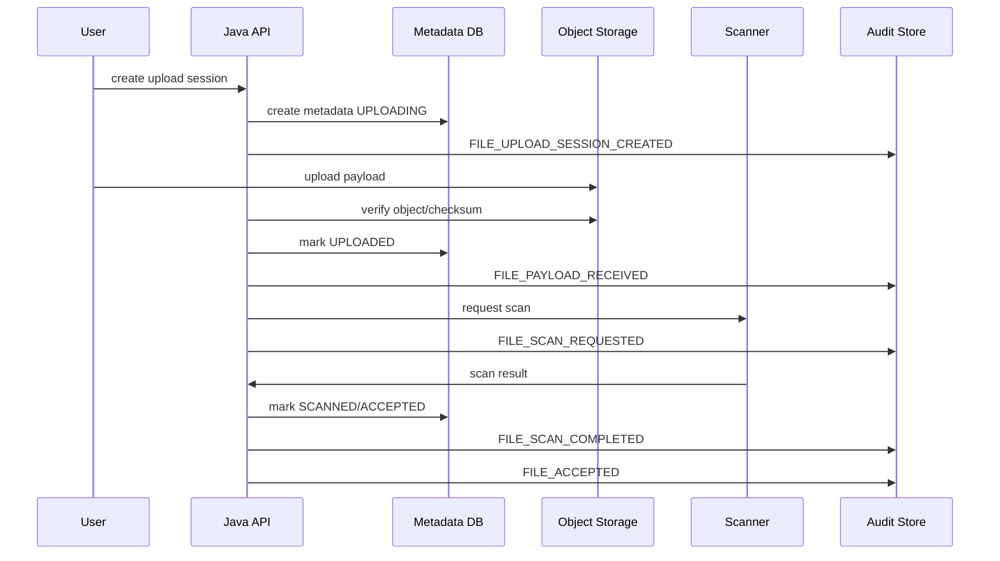
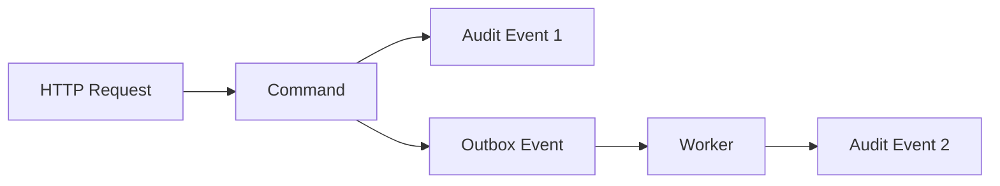
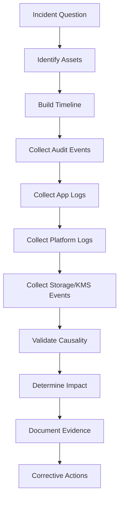

# Part 059 — Auditability and Forensics

> If the system cannot explain what happened, it did not merely fail operationally.
>
> It failed as an accountable system.

Auditability adalah kemampuan sistem untuk menjawab pertanyaan material:

```txt
Who did what, to which artifact, when, from where, under which policy,
with what result, and what evidence proves it?
```

Forensics adalah kemampuan untuk merekonstruksi kejadian setelah incident:

```txt
What happened?
What was affected?
What was the timeline?
Was data accessed, changed, deleted, leaked, or only attempted?
Which control worked, failed, or was bypassed?
```

Dalam sistem file/state/config/secret, audit dan forensics bukan fitur tambahan. Ia adalah bagian dari correctness. Terutama untuk sistem yang mengelola evidence, dokumen, case lifecycle, secret, dan configuration control plane.

Part ini membahas:

- perbedaan app log, audit log, security event, dan forensic evidence;
- audit event model;
- file lifecycle audit;
- config change audit;
- secret access/rotation audit;
- object storage audit;
- Kubernetes audit;
- correlation and causality;
- tamper evidence;
- forensic reconstruction;
- Java implementation patterns;
- testing auditability.

---

## 1. Auditability vs Logging

Logging biasa bertanya:

```txt
What did the application print?
```

Auditability bertanya:

```txt
What decision was made, by whom, under which authority,
against which object, and can we prove it?
```

Forensics bertanya:

```txt
Can we reconstruct enough evidence to answer what actually happened?
```

Jangan mencampur semuanya.

| Signal | Purpose | Audience | Retention | Sensitivity |
|---|---|---|---|---|
| Application log | debugging and operations | engineers/SRE | short/medium | variable |
| Security event | detection and response | security/SOC | medium/long | sensitive |
| Audit event | accountability and compliance | auditor/domain/security | long | high |
| Access log | resource access record | platform/security | medium/long | medium/high |
| Trace | request causality/performance | engineers/SRE | short | may leak |
| Metric | aggregate health | engineers/SRE | short/medium | low/medium |
| Forensic bundle | incident reconstruction | incident team/legal | controlled | high |

Audit event harus didesain sebagai domain evidence, bukan efek samping log framework.

---

## 2. What Must Be Audited?

Tidak semua hal perlu audit event evidence-grade. Audit event terlalu banyak bisa membuat noise, biaya tinggi, dan data sensitif tersebar.

Audit event wajib untuk material decision.

### 2.1 File Events

| Event | Why It Matters |
|---|---|
| upload session created | establishes intent and actor |
| upload completed | payload arrived |
| checksum verified | integrity proof |
| malware scan started/completed | trust decision |
| file accepted/rejected | lifecycle decision |
| file downloaded/granted | sensitive access |
| presigned URL issued | bearer capability issued |
| file archived | retention/lifecycle |
| deletion requested | destructive intent |
| deletion approved/blocked | governance proof |
| physical delete completed | irreversible effect |
| retention/legal hold changed | compliance state |

### 2.2 State Events

| Event | Why |
|---|---|
| workflow state transition | business lifecycle |
| manual override | high-risk intervention |
| replay/rebuild started/completed | state repair provenance |
| cache invalidation forced | security/correctness action |
| ownership changed | authority boundary changed |

### 2.3 Configuration Events

| Event | Why |
|---|---|
| config PR approved | change authorization |
| config version deployed | runtime behavior changed |
| config validation failed | prevented unsafe runtime |
| dynamic config reloaded | behavior changed without deploy |
| config drift detected | live state diverged from desired |
| unsafe config blocked | security/compliance proof |

### 2.4 Secret Events

| Event | Why |
|---|---|
| secret read by workload | access to capability |
| secret version changed | runtime credential changed |
| secret rotation started/completed | security lifecycle |
| old credential revoked | rotation closure |
| secret lease renewed/failed | expiry risk |
| secret access denied | possible intrusion/misconfig |
| secret material leaked | incident evidence |

### 2.5 Platform Events

| Event | Why |
|---|---|
| Kubernetes Secret read | credential exposure risk |
| ConfigMap/Secret updated | runtime control plane change |
| ServiceAccount/RBAC changed | authority change |
| object storage Get/Put/Delete | data access/mutation |
| KMS decrypt | key use |
| admission policy denied | prevented violation |

---

## 3. Audit Event Model

A good audit event is structured, immutable, redacted, and correlation-friendly.

```java
public record AuditEvent(
    String eventId,
    String eventType,
    String eventVersion,
    String actorId,
    ActorType actorType,
    String subjectId,
    String subjectType,
    String action,
    String resourceType,
    String resourceId,
    String resourceVersion,
    String decision,
    String reasonCode,
    String policyId,
    String policyVersion,
    String correlationId,
    String causationId,
    String requestId,
    String tenantId,
    Instant occurredAt,
    Map<String, String> safeAttributes
) {}
```

Important fields:

| Field | Meaning |
|---|---|
| `eventId` | unique audit event identity |
| `eventType` | semantic event name |
| `eventVersion` | schema version |
| `actorId` | who initiated |
| `actorType` | user/service/system/admin |
| `subjectId` | person/entity affected if different |
| `resourceId` | file/config/secret/state object |
| `resourceVersion` | object version/checksum/config version |
| `decision` | ALLOW/DENY/SUCCESS/FAILURE/BLOCKED |
| `reasonCode` | machine-readable reason |
| `policyVersion` | which policy produced decision |
| `correlationId` | same request/journey |
| `causationId` | previous event/command that caused it |
| `safeAttributes` | redacted bounded metadata |

### 3.1 Actor vs Subject

Actor is who performs action.

Subject is who is affected.

Example:

```txt
Admin downloads evidence file for Case C.
Actor = admin-123
Subject = case-owner/user affected by evidence
Resource = FILE-01JZ
```

For system worker:

```txt
Actor = service:evidence-scan-worker
Subject = file owner/case if relevant
Resource = FILE-01JZ
```

### 3.2 Decision and Reason Code

Avoid only logging text.

Good:

```json
{
  "decision": "DENY",
  "reasonCode": "RETENTION_LEGAL_HOLD_ACTIVE"
}
```

Bad:

```json
{
  "message": "Nope, cannot delete file because it seems held"
}
```

Machine-readable reason code helps detection, reporting, and forensics.

---

## 4. Audit Event Naming

Use stable, domain-specific names.

Examples:

```txt
FILE_UPLOAD_SESSION_CREATED
FILE_PAYLOAD_RECEIVED
FILE_CHECKSUM_VERIFIED
FILE_SCAN_COMPLETED
FILE_ACCEPTED
FILE_DOWNLOAD_GRANTED
FILE_DOWNLOAD_DENIED
FILE_PRESIGNED_URL_ISSUED
FILE_DELETION_REQUESTED
FILE_DELETION_BLOCKED
FILE_DELETED

CONFIG_CHANGE_APPROVED
CONFIG_VERSION_DEPLOYED
CONFIG_VALIDATION_FAILED
CONFIG_RUNTIME_RELOADED
CONFIG_DRIFT_DETECTED

SECRET_VERSION_DEPLOYED
SECRET_ROTATION_STARTED
SECRET_ROTATION_COMPLETED
SECRET_LEASE_RENEWAL_FAILED
SECRET_ACCESS_DENIED
```

Do not make event names too generic:

```txt
UPDATED
CHANGED
ACTION_DONE
```

Generic events are weak forensic evidence.

---

## 5. Audit Event Schema Versioning

Audit events are long-lived. Their schema must evolve safely.

```java
public record FileAcceptedAuditV1(
    String eventId,
    String fileId,
    String actorId,
    String checksumSha256,
    String scanDecisionId,
    Instant occurredAt
) {}
```

Later:

```java
public record FileAcceptedAuditV2(
    String eventId,
    String fileId,
    String actorId,
    String checksumSha256,
    String scanDecisionId,
    String contentPolicyVersion,
    String retentionPolicyVersion,
    Instant occurredAt
) {}
```

Invariant:

```txt
Audit event schema evolution must be backward-readable.
```

Use:

- `eventVersion`;
- schema registry if event pipeline requires;
- compatibility tests;
- explicit migration if needed;
- avoid deleting meaning of old fields.

---

## 6. File Lifecycle Audit Chain

File artifact should have an audit chain.



For a regulatory evidence file, you want to answer:

```txt
When was it uploaded?
By whom?
What payload hash?
Was it scanned?
Which scanner/policy version?
When was it accepted?
Was it ever downloaded?
By whom?
Was deletion attempted?
Why blocked or allowed?
```

### 6.1 Audit Chain Integrity

For high-sensitivity domains, consider hash chaining:

```txt
eventHash = SHA-256(canonicalEventJson)
chainHash = SHA-256(previousChainHash + eventHash)
```

This does not replace secure storage, but it makes tampering detectable if chain checkpoints are protected.

Example event chain fields:

```json
{
  "eventId": "AUD-123",
  "resourceId": "FILE-01JZ",
  "eventHash": "abc...",
  "previousChainHash": "def...",
  "chainHash": "ghi..."
}
```

Store chain checkpoints in independent storage if tamper resistance is required.

---

## 7. Config Audit

Configuration is a control plane. Audit config like you audit code deployment.

### 7.1 Config Provenance Event

```json
{
  "eventType": "CONFIG_VERSION_DEPLOYED",
  "service": "evidence-service",
  "environment": "prod",
  "configVersion": "git:8d21a9f",
  "actorId": "gitops-controller",
  "actorType": "SERVICE",
  "decision": "SUCCESS",
  "occurredAt": "2026-07-05T10:00:00Z"
}
```

### 7.2 Runtime Effective Config

At startup, log and optionally emit audit/ops event:

```txt
service=evidence-service
configVersion=git:8d21a9f
schemaVersion=3
profile=prod
source=configmap:evidence-service-config
sensitiveValues=redacted
```

Do not audit full config if it contains sensitive values or excessive data. Audit version, source, validation result, and risk-relevant fields.

### 7.3 High-Risk Config Changes

Examples:

- max upload size increased;
- malware scan disabled;
- retention duration changed;
- direct upload enabled;
- allowed issuer changed;
- feature flag enables destructive operation.

These should create specific events:

```txt
CONFIG_HIGH_RISK_VALUE_CHANGED
CONFIG_UNSAFE_VALUE_BLOCKED
CONFIG_RUNTIME_RELOAD_COMPLETED
```

---

## 8. Secret Audit

Secret audit must avoid secret value.

Audit:

- who/what read secret;
- which secret name/path;
- version;
- when;
- from which identity;
- result;
- lease id hash or reference if safe;
- rotation lifecycle.

Never audit:

- raw password;
- token;
- private key;
- presigned URL;
- decrypted payload.

### 8.1 Rotation Audit Chain

```txt
SECRET_ROTATION_STARTED
SECRET_NEW_VERSION_CREATED
SECRET_VERSION_DISTRIBUTED
SECRET_CONSUMER_SWITCHED
SECRET_OLD_VERSION_UNUSED_CONFIRMED
SECRET_OLD_VERSION_REVOKED
SECRET_ROTATION_COMPLETED
```

This is important because “rotation complete” is a claim requiring evidence.

### 8.2 Lease Failure Audit

Vault/secret manager lease failure should produce security/ops event:

```json
{
  "eventType": "SECRET_LEASE_RENEWAL_FAILED",
  "secretName": "evidence-db",
  "consumer": "evidence-service",
  "remainingTtlSeconds": 420,
  "decision": "FAILURE",
  "reasonCode": "VAULT_UNAVAILABLE"
}
```

This is not just logging. It can affect readiness and incident response.

---

## 9. Object Storage Forensics

For object storage, audit must combine:

- application audit event;
- storage access logs/data events;
- object metadata/tags;
- KMS decrypt events;
- network/proxy logs if relevant.

AWS CloudTrail can log S3 object-level data events such as `GetObject`, `PutObject`, and `DeleteObject`. These events are useful for forensic reconstruction of object access, but data event logging must be deliberately enabled and cost-managed.

### 9.1 Storage Event Correlation

When writing object, include metadata/tags:

```txt
fileId=FILE-01JZ
tenantId=TENANT-123
ownerService=evidence-service
lifecycle=quarantine
correlationId=req-abc
```

Careful: object tags/metadata can leak if broadly readable, so keep values safe.

### 9.2 Forensic Questions

For a suspected unauthorized download:

```txt
1. Was FILE-01JZ download granted by app?
2. Which actor got the grant?
3. Was presigned URL issued?
4. What was URL TTL?
5. Was object GetObject observed?
6. From which source IP/user agent?
7. Did KMS decrypt occur?
8. Was permission revoked before/after access?
9. Was file lifecycle state acceptable for download?
10. Did any direct storage access bypass app?
```

If you cannot correlate app decision to storage access, your audit story is incomplete.

---

## 10. Kubernetes Audit

Kubernetes audit logs provide chronological, security-relevant records for actions in the cluster, including actions by users, applications using the Kubernetes API, and control plane components.

For this series, relevant Kubernetes audit events include:

- Secret read/update/delete;
- ConfigMap update;
- Role/RoleBinding change;
- ServiceAccount token use;
- Deployment rollout;
- exec into pod;
- port-forward;
- admission denial;
- namespace policy change.

### 10.1 High-Risk Kubernetes Actions

Audit these closely:

```txt
get/list/watch secrets
create/update rolebindings
create/update clusterrolebindings
pods/exec
pods/portforward
update configmaps in prod
update deployments in prod outside GitOps
delete persistentvolumeclaim
```

### 10.2 Kubernetes Audit to Domain Correlation

Kubernetes audit tells you cluster action happened.

Application audit tells you domain decision happened.

You need both.

Example incident:

```txt
ConfigMap was manually edited in prod.
Service behavior changed.
File accepted without scan.
```

Evidence:

- Kubernetes audit: `update configmaps/evidence-service-config` by user X.
- GitOps drift event: config live state diverged from Git.
- App startup/runtime event: effective config version changed.
- File audit: FILE_ACCEPTED events after config change.
- Security alert: malware scan disabled in prod.

---

## 11. Correlation and Causality

Correlation ID groups events in same request.

Causation ID links an event to the command/event that caused it.

```txt
correlationId = user journey/request trace
causationId = immediate parent command/event
eventId = this event identity
```

Example:

```txt
requestId=req-abc
correlationId=case-journey-789
commandId=cmd-upload-complete
eventId=aud-file-accepted
causationId=cmd-upload-complete
```

For async processing:



Preserve:

- correlation ID;
- tenant ID;
- file ID;
- actor/system actor;
- causation ID.

Without correlation, forensic reconstruction becomes log archaeology.

---

## 12. Tamper Evidence

Audit log must be harder to tamper with than the primary system.

Controls:

| Control | Purpose |
|---|---|
| append-only audit store | prevent silent update |
| write-once object storage | retention/tamper resistance |
| hash chaining | detect deletion/reordering |
| external timestamp/checkpoint | prove time/order |
| restricted write identity | limit who can emit/modify |
| separate admin boundary | app admins cannot edit audit |
| replication | preserve evidence |
| access audit | log who reads audit logs |

Do not let the same compromised service identity both mutate data and delete audit evidence.

### 12.1 Append-Only Design

Application should only append audit event.

No update/delete API for normal service path.

Correction should be new event:

```txt
AUDIT_CORRECTION_RECORDED
```

not editing old event.

### 12.2 Audit Store Separation

Bad:

```txt
audit_events table in same DB,
same DB user can update/delete all rows.
```

Better:

```txt
service writes audit event to append-only stream/store,
separate audit platform enforces retention and access.
```

You may still keep local audit projection for UI, but source audit evidence should be more protected.

---

## 13. Audit Reliability

Audit event must not be casually lost.

But blocking every request on remote audit system can harm availability.

Choose strategy by criticality.

### 13.1 Synchronous Audit

Use when operation must not proceed without audit proof.

Example:

- destructive delete;
- legal hold removal;
- high-risk admin override.

```txt
If audit write fails, operation fails closed.
```

### 13.2 Transactional Outbox Audit

For most domain changes:

```txt
DB transaction writes business state + audit outbox row.
Async publisher sends audit event to audit store.
```

Pattern:

```sql
BEGIN;

UPDATE evidence_file
SET status = 'ACCEPTED'
WHERE file_id = ?;

INSERT INTO audit_outbox(event_id, event_type, payload, created_at)
VALUES (?, 'FILE_ACCEPTED', ?, now());

COMMIT;
```

A publisher drains outbox.

Invariant:

```txt
No committed material state change without durable audit intent.
```

### 13.3 Audit Publisher Failure

If publisher fails:

- outbox grows;
- alert fires;
- service may continue depending policy;
- high-risk operations may be blocked if backlog exceeds threshold;
- replay publisher after recovery.

Metrics:

```txt
audit_outbox_pending_total
audit_outbox_oldest_age_seconds
audit_publish_failure_total
audit_event_duplicate_total
```

---

## 14. Forensic Reconstruction Workflow

When incident happens, use structured reconstruction.



### 14.1 Timeline

Build timeline with UTC timestamps.

Include:

- detection time;
- first suspicious event;
- config/secret/deploy changes;
- affected file/state events;
- access events;
- mitigation actions;
- recovery actions;
- revoke/rollback times.

### 14.2 Evidence Bundle

For sensitive incident, create controlled evidence bundle:

```txt
incident-2026-07-05-evidence-config-drift/
  timeline.md
  audit-events.jsonl
  app-log-excerpts-redacted.jsonl
  k8s-audit-excerpts.jsonl
  s3-data-events.jsonl
  config-diff.patch
  secret-rotation-evidence.md
  impact-analysis.md
  corrective-actions.md
```

Protect this bundle. It likely contains sensitive operational data.

### 14.3 Impact Analysis

Answer:

```txt
What was accessed?
What was changed?
What was deleted?
Was data exfiltrated?
Was secret material exposed?
Which tenants/users/cases affected?
Was retention/compliance violated?
What evidence supports this conclusion?
What uncertainty remains?
```

Do not overclaim. If evidence is insufficient, state that.

---

## 15. Java Implementation Pattern

### 15.1 Audit Service Interface

```java
public interface AuditService {
    void record(AuditEvent event);
}
```

### 15.2 Domain Audit Factory

Avoid building audit maps everywhere.

```java
public final class FileAuditEvents {
    public AuditEvent fileAccepted(
        StoredFile file,
        UserContext actor,
        String policyVersion,
        String correlationId
    ) {
        return AuditEvent.builder()
            .eventType("FILE_ACCEPTED")
            .eventVersion("1")
            .actorId(actor.actorId())
            .actorType(actor.actorType())
            .resourceType("EVIDENCE_FILE")
            .resourceId(file.fileId())
            .resourceVersion(file.sha256())
            .decision("SUCCESS")
            .reasonCode("SCAN_CLEAN")
            .policyVersion(policyVersion)
            .correlationId(correlationId)
            .occurredAt(Instant.now())
            .safeAttribute("contentType", file.contentType())
            .safeAttribute("sizeBucket", sizeBucket(file.sizeBytes()))
            .build();
    }

    private String sizeBucket(long sizeBytes) {
        if (sizeBytes < 1_000_000) return "lt_1mb";
        if (sizeBytes < 100_000_000) return "lt_100mb";
        return "gte_100mb";
    }
}
```

Do not put raw filename or presigned URL unless policy explicitly allows.

### 15.3 Outbox Table

```sql
CREATE TABLE audit_outbox (
    event_id UUID PRIMARY KEY,
    event_type TEXT NOT NULL,
    event_version TEXT NOT NULL,
    aggregate_type TEXT NOT NULL,
    aggregate_id TEXT NOT NULL,
    payload JSONB NOT NULL,
    created_at TIMESTAMPTZ NOT NULL DEFAULT now(),
    published_at TIMESTAMPTZ NULL,
    publish_attempts INT NOT NULL DEFAULT 0,
    last_error TEXT NULL
);

CREATE INDEX audit_outbox_unpublished_idx
ON audit_outbox(created_at)
WHERE published_at IS NULL;
```

### 15.4 Idempotent Audit Publish

Audit publisher must handle duplicate publish.

```java
public void publish(AuditOutboxRow row) {
    try {
        auditSink.send(row.eventId(), row.payload());
        repository.markPublished(row.eventId());
    } catch (Exception ex) {
        repository.recordFailure(row.eventId(), ex.getClass().getSimpleName());
        throw ex;
    }
}
```

Sink should use `eventId` as idempotency key where possible.

---

## 16. Audit Testing

### 16.1 Unit Tests

```txt
When file is accepted
Then FILE_ACCEPTED audit event is created
And event contains fileId, actorId, checksum, policyVersion
And event does not contain secret, presigned URL, raw payload
```

### 16.2 Integration Tests

```txt
Given DB transaction commits file status ACCEPTED
Then audit_outbox contains FILE_ACCEPTED in same transaction
```

### 16.3 Failure Tests

```txt
Given audit sink is unavailable
When file accepted
Then business transaction still commits only if outbox row commits
And publisher retries
And alert fires if backlog grows
```

For high-risk operation:

```txt
Given audit sink unavailable
When legal hold removal requested
Then operation fails closed
```

### 16.4 Forensic Drill

Run a quarterly drill:

```txt
Scenario: unauthorized ConfigMap change disables scan.
Goal: reconstruct timeline and affected files within target time.
```

Evaluate:

- were events present?
- were timestamps consistent?
- could team correlate config change to file acceptance?
- were logs redacted?
- did alert trigger?
- could impact be bounded?

---

## 17. Audit Anti-Patterns

### 17.1 Audit as Log Line

```java
log.info("User deleted file {}", fileId);
```

This is not sufficient audit.

### 17.2 Audit Without Deny Events

Only logging success hides attempted abuse.

Log material denies:

```txt
FILE_DOWNLOAD_DENIED
FILE_DELETION_BLOCKED
SECRET_ACCESS_DENIED
CONFIG_UNSAFE_VALUE_BLOCKED
```

### 17.3 Audit Without Policy Version

If policy changes, you cannot explain why old decision was allowed.

### 17.4 Audit With Sensitive Payload

Audit store is not exemption from data minimization.

### 17.5 Mutable Audit Records

Updating old audit records destroys evidentiary value.

### 17.6 No Clock Discipline

Use synchronized time source. Record UTC. Keep service clock drift monitored.

### 17.7 No Access Audit to Audit Store

If audit logs are sensitive and powerful, access to them must itself be audited.

---

## 18. Production Checklist

```txt
[ ] Material file lifecycle decisions produce audit events
[ ] Material config changes produce audit events
[ ] Secret access/rotation produces audit events
[ ] Deny/block events recorded for high-risk operations
[ ] Audit event schema versioned
[ ] Audit event has actor, resource, decision, policyVersion, timestamp
[ ] Audit events do not contain raw secret/payload/presigned URL
[ ] Audit outbox or equivalent durable mechanism exists
[ ] Audit sink publish is idempotent
[ ] Audit backlog monitored
[ ] Audit store access controlled and audited
[ ] Object storage/KMS/Kubernetes audit sources enabled where needed
[ ] Correlation and causation IDs propagated across async boundaries
[ ] Forensic reconstruction drill performed
```

---

## 19. Key Takeaways

1. **Auditability is not ordinary logging.**
2. **Audit events must represent material decisions and lifecycle transitions.**
3. **Forensics requires correlation across app, platform, storage, KMS, Kubernetes, and secret manager evidence.**
4. **Audit event should include actor, resource, decision, policy version, timestamp, and correlation.**
5. **Audit log must be redacted but still evidence-grade.**
6. **No committed material state change should exist without durable audit intent.**
7. **Object storage access needs storage-level evidence, not only app log.**
8. **Kubernetes audit is essential for ConfigMap, Secret, RBAC, and exec investigations.**
9. **Tamper evidence matters when audit is used for compliance or legal defensibility.**
10. **Forensic readiness must be tested before incident.**

Next, we move from evidence after the fact to detection during operation: **Observability for File, Config, Secret, and State**.

---

## References

- OWASP Logging Cheat Sheet: https://cheatsheetseries.owasp.org/cheatsheets/Logging_Cheat_Sheet.html
- OWASP Top 10 A09 — Security Logging and Monitoring Failures: https://owasp.org/Top10/A09_2021-Security_Logging_and_Monitoring_Failures/
- Kubernetes Auditing: https://kubernetes.io/docs/tasks/debug/debug-cluster/audit/
- Amazon S3 CloudTrail Events: https://docs.aws.amazon.com/AmazonS3/latest/userguide/cloudtrail-logging-s3-info.html
- AWS CloudTrail Data Events: https://docs.aws.amazon.com/awscloudtrail/latest/userguide/logging-data-events-with-cloudtrail.html
- OpenTelemetry Documentation: https://opentelemetry.io/docs/
