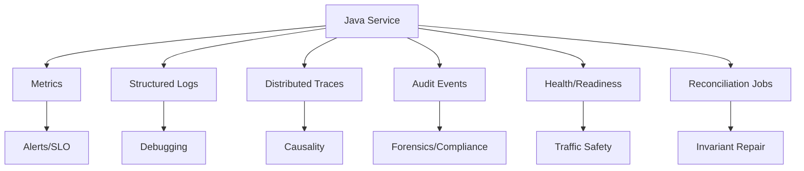
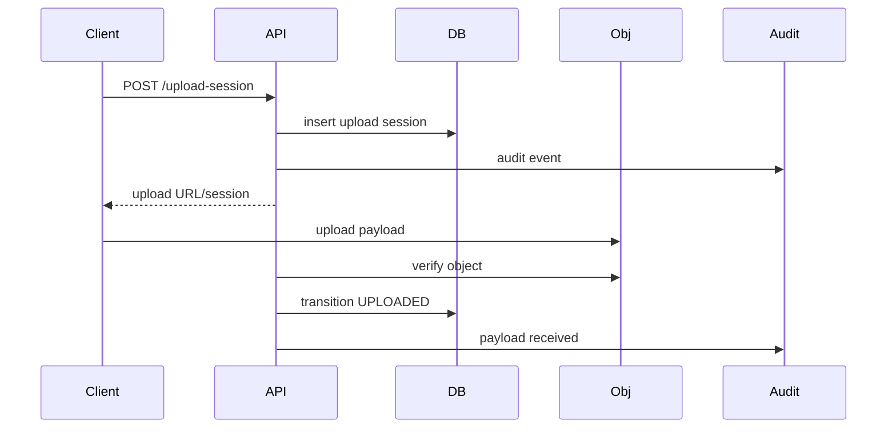

# Part 060 — Observability for File, Config, Secret, and State

> Observability is not “we have dashboards”.
>
> Observability is the ability to ask new questions about a running system
> without shipping new code.

For this series, observability has a sharper purpose:

```txt
Detect invariant stress before it becomes data loss, security failure,
configuration incident, secret outage, or regulatory gap.
```

Generic RED metrics are useful:

- request rate;
- error rate;
- latency.

But they are not enough for file/state/config/secret systems.

You need signals like:

```txt
accepted files without checksum
upload sessions stuck in UPLOADING
metadata-payload mismatch
config reload failures
pods running mixed config versions
secret lease nearing expiry
old credential still used after rotation
cache stale authorization reads
audit outbox backlog
object storage delete denied by retention
```

This part builds an observability model for Java microservices that manage runtime artifacts.

OpenTelemetry provides a vendor-neutral framework for generating, collecting, and exporting telemetry data such as traces, metrics, and logs. That gives us the plumbing. The engineering challenge is deciding what to observe.

---

## 1. Observability vs Monitoring

Monitoring answers known questions:

```txt
Is CPU high?
Is error rate high?
Is service up?
```

Observability supports unknown investigation:

```txt
Why are accepted files increasing but scan completions flat?
Which config version caused upload failures?
Are only pods with secret version v42 failing DB auth?
Did a specific file transition happen before or after object storage PutObject?
```

You need both.

---

## 2. Signal Taxonomy

For this series, use six signal types.

| Signal | Purpose |
|---|---|
| Metrics | aggregate health and alerting |
| Logs | contextual events and debugging |
| Traces | causal path across service/dependency |
| Audit events | accountable material decisions |
| Health/readiness | traffic routing safety |
| Reconciliation reports | invariant drift detection |



Do not force every signal into one tool. Each has different semantics.

---

## 3. Invariant-Driven Observability

Start from invariant, derive signal.

### 3.1 Example: File Integrity

Invariant:

```txt
No file in ACCEPTED state may exist without verified checksum.
```

Signals:

```txt
file_integrity_missing_total
file_accepted_total
file_checksum_verification_failed_total
file_reconciliation_mismatch_total
```

Alert:

```txt
file_integrity_missing_total > 0
```

Dashboard:

- accepted files per minute;
- checksum failures;
- reconciliation mismatches;
- oldest accepted file without checksum.

### 3.2 Example: Secret Rotation

Invariant:

```txt
Secret must not expire before consumer refreshes.
```

Signals:

```txt
secret_seconds_until_expiry
secret_refresh_success_total
secret_refresh_failure_total
secret_current_version_info
dependency_auth_failure_total
```

Alert:

```txt
secret_seconds_until_expiry < 600 AND secret_refresh_failure_total increasing
```

### 3.3 Example: Config Rollout

Invariant:

```txt
Pods should not run mixed critical config versions beyond rollout window.
```

Signals:

```txt
config_current_version_info{pod="...", version="..."}
config_reload_success_total
config_validation_failure_total
config_runtime_mixed_version_pods
```

Alert:

```txt
mixed critical config versions > 0 for > expected rollout window
```

---

## 4. Metrics Design

Metrics should be:

- bounded cardinality;
- semantically stable;
- action-oriented;
- connected to SLO/invariant;
- redacted.

### 4.1 File Metrics

```txt
file_upload_started_total{tenant_class, file_type}
file_upload_completed_total{tenant_class, file_type}
file_upload_failed_total{reason}
file_upload_bytes_total{file_type}
file_upload_active_sessions
file_upload_stale_sessions_total
file_upload_session_age_seconds
file_checksum_verification_failed_total{reason}
file_lifecycle_transition_total{from,to}
file_lifecycle_transition_denied_total{from,to,reason}
file_scan_requested_total
file_scan_completed_total{decision}
file_scan_pending_age_seconds
file_download_granted_total{file_type}
file_download_denied_total{reason}
file_presigned_url_issued_total{method}
file_orphan_object_total
file_metadata_payload_mismatch_total
```

Avoid labels:

- raw `fileId`;
- filename;
- user email;
- object key;
- presigned URL;
- unbounded case ID.

### 4.2 Object Storage Metrics

```txt
object_storage_request_total{operation,status}
object_storage_request_duration_seconds{operation}
object_storage_retry_total{operation,reason}
object_storage_error_total{operation,error_class}
object_storage_put_bytes_total
object_storage_get_bytes_total
object_storage_multipart_active_uploads
object_storage_multipart_aborted_total
object_storage_multipart_stale_uploads_total
object_storage_egress_bytes_total{destination_class}
```

Important dimensions:

- operation: `put`, `get`, `delete`, `copy`, `complete_multipart`, `abort_multipart`;
- status: `success`, `failure`;
- error class: `throttled`, `timeout`, `access_denied`, `not_found`, `conflict`.

### 4.3 State Metrics

```txt
state_transition_total{entity,from,to}
state_transition_denied_total{entity,reason}
state_optimistic_lock_conflict_total{entity}
state_replay_started_total{job}
state_replay_completed_total{job,status}
state_replay_conflict_total{job}
state_reconciliation_mismatch_total{type}
cache_hit_total{cache}
cache_miss_total{cache}
cache_stale_read_total{cache}
cache_invalidation_total{cache,source}
```

For authorization cache, explicitly expose:

```txt
authorization_cache_stale_decision_total
authorization_cache_forced_source_check_total
```

### 4.4 Config Metrics

```txt
config_validation_success_total
config_validation_failure_total{reason}
config_reload_success_total{config_group}
config_reload_failure_total{config_group,reason}
config_current_version_info{service,environment,version}
config_drift_detected_total{source}
config_unsafe_value_blocked_total{key_class}
config_runtime_mixed_version_pods
```

Do not put raw config key/value labels if values are sensitive or cardinality-heavy.

### 4.5 Secret Metrics

```txt
secret_load_success_total{secret}
secret_load_failure_total{secret,reason}
secret_refresh_success_total{secret}
secret_refresh_failure_total{secret,reason}
secret_seconds_until_expiry{secret}
secret_rotation_started_total{secret}
secret_rotation_completed_total{secret}
secret_old_version_usage_total{secret}
secret_access_denied_total{secret}
dependency_auth_failure_total{dependency,reason}
```

Do not expose:

- secret value;
- token prefix;
- full version ID if sensitive/high-cardinality.

### 4.6 Audit Metrics

```txt
audit_event_created_total{event_type}
audit_event_publish_success_total
audit_event_publish_failure_total{reason}
audit_outbox_pending_total
audit_outbox_oldest_age_seconds
audit_event_duplicate_total
audit_sink_latency_seconds
```

Audit metrics are crucial. If audit path fails silently, accountability is false.

---

## 5. Logs Design

Logs should provide context, not raw data.

### 5.1 Event-Style Logs

Good:

```txt
INFO file_lifecycle_transition fileId=FILE-01JZ from=SCANNED to=ACCEPTED actorType=SERVICE correlationId=req-abc
```

Bad:

```txt
INFO accepted uploaded file john-smith-report.pdf with url https://...
```

### 5.2 Log Levels

| Level | Usage |
|---|---|
| DEBUG | local/staging diagnostics; avoid sensitive data |
| INFO | material operational events, state transitions |
| WARN | recoverable anomaly or invariant stress |
| ERROR | failed operation requiring attention |
| SECURITY/AUDIT | separate channel if framework supports |

Avoid using `ERROR` for expected denied operations. Use structured event and metrics.

### 5.3 Log Sampling

Sampling can hide rare security events.

Do not sample:

- access denied high-risk events;
- secret access denied;
- file deletion attempts;
- config unsafe value blocked;
- audit publish failure.

Can sample:

- repeated transient storage retry logs;
- high-frequency health check logs;
- noisy expected validation errors, while metrics count all.

---

## 6. Tracing Design

Tracing helps answer causality:

```txt
Request -> metadata DB -> object storage -> scan worker -> audit sink
```

### 6.1 Trace Spans for File Upload



Span names:

```txt
POST /files/upload-sessions
db.evidence_file.insert
object_storage.verify_object
audit.outbox.insert
file.transition.UPLOADING_TO_UPLOADED
```

Attributes:

```txt
file.lifecycle.from=UPLOADING
file.lifecycle.to=UPLOADED
file.size.bucket=lt_100mb
storage.operation=head_object
audit.event_type=FILE_PAYLOAD_RECEIVED
```

Avoid:

- filename;
- presigned URL;
- auth token;
- raw object key if it leaks semantics;
- request body.

### 6.2 Async Trace Propagation

For outbox/worker:

- propagate traceparent if appropriate;
- preserve correlation ID;
- add causation ID/event ID.

If tracing breaks at async boundary, forensic debugging becomes harder.

---

## 7. Health and Readiness

Health is not just process alive.

### 7.1 Liveness

Liveness answers:

```txt
Should Kubernetes restart this container?
```

Use liveness for deadlock/fatal state, not dependency blips.

### 7.2 Readiness

Readiness answers:

```txt
Should this pod receive traffic?
```

Readiness should fail when required runtime dependencies or invariants make request handling unsafe.

Examples:

| Condition | Readiness Impact |
|---|---|
| required config invalid | not ready |
| secret missing/expired | not ready |
| DB unavailable | usually not ready |
| object storage unavailable | not ready for file endpoints |
| audit outbox temporarily pending | maybe ready |
| audit outbox too old for high-risk service | not ready/degraded |
| scanner queue backlog high | maybe ready but degrade upload acceptance |
| cache unavailable | depends fallback |

### 7.3 Component Health

Expose safe component health:

```json
{
  "status": "DEGRADED",
  "components": {
    "metadataDb": "UP",
    "objectStorage": "UP",
    "scanner": "DEGRADED",
    "auditOutbox": "UP",
    "secret:evidence-db": "UP",
    "config": "UP"
  }
}
```

Do not expose secret values, URLs with credentials, or internal topology publicly.

---

## 8. SLO Design

SLOs should reflect user and invariant outcomes.

### 8.1 File Upload SLO

Bad SLO:

```txt
HTTP 200 rate > 99.9%
```

Better:

```txt
99.5% of valid upload sessions under 100MB complete and reach QUARANTINED
within 2 minutes.
```

### 8.2 File Processing SLO

```txt
99% of uploaded files are scanned and accepted/rejected within 10 minutes.
```

### 8.3 Download SLO

```txt
99.9% of authorized download grant requests complete within 500ms,
excluding object storage client download time for direct downloads.
```

### 8.4 Secret SLO

```txt
Required production secrets have at least 15 minutes of valid TTL remaining
for 99.99% of service-minutes.
```

### 8.5 Config SLO

```txt
Critical config rollout converges to a single validated version across ready pods
within 10 minutes.
```

### 8.6 Audit SLO

```txt
99.9% of material audit events are durably stored within 60 seconds.
No high-risk destructive operation commits without durable audit intent.
```

---

## 9. Alert Design

Alerts should be actionable.

### 9.1 Bad Alerts

```txt
CPU > 80%
log contains "error"
S3 request failed once
cache miss rate high
```

These may be useful dashboard signals but poor pages.

### 9.2 Good Alerts

```txt
Accepted file without checksum > 0
Secret expires in < 10m and refresh failing
Audit outbox oldest pending > 5m for prod
Config validation failed on new rollout
Pods mixed critical config version for > 15m
File scan pending p95 age > SLO
Object storage access denied spike after deploy
Metadata-payload mismatch detected
Old DB credential still used after rotation window
```

Every alert should have:

- owner;
- severity;
- runbook;
- dashboard link;
- expected action;
- false-positive guidance.

---

## 10. Dashboards

### 10.1 File Platform Dashboard

Sections:

- upload started/completed/failed;
- active upload sessions;
- stale sessions;
- object storage error/latency;
- scan queue depth and pending age;
- lifecycle transitions;
- download grants/denies;
- metadata-payload mismatch;
- orphan object count;
- audit event backlog.

### 10.2 Config Dashboard

- current config version per pod;
- validation failures;
- reload successes/failures;
- drift detections;
- unsafe values blocked;
- rollout convergence time;
- config source availability.

### 10.3 Secret Dashboard

- secret version per service/pod;
- seconds until expiry;
- refresh success/failure;
- dependency auth failures;
- old credential usage;
- rotation progress;
- secret manager latency/error rate.

### 10.4 State Dashboard

- state transition counts;
- invalid transition attempts;
- optimistic lock conflicts;
- cache hit/miss/stale reads;
- replay/reconciliation status;
- DLQ counts;
- oldest unprocessed event.

---

## 11. Java Instrumentation Patterns

### 11.1 Micrometer Counter

```java
@Component
public final class FileMetrics {
    private final Counter uploadStarted;
    private final Counter uploadFailed;

    public FileMetrics(MeterRegistry registry) {
        this.uploadStarted = Counter.builder("file_upload_started_total")
            .description("Number of file uploads started")
            .register(registry);

        this.uploadFailed = Counter.builder("file_upload_failed_total")
            .description("Number of file uploads failed")
            .tag("reason", "unknown")
            .register(registry);
    }

    public void uploadStarted() {
        uploadStarted.increment();
    }
}
```

Be careful with dynamic tags. Do not create a counter per file/user/error message.

Better:

```java
public void uploadFailed(String reason) {
    Counter.builder("file_upload_failed_total")
        .tag("reason", normalizeReason(reason))
        .register(registry)
        .increment();
}
```

Where `normalizeReason` returns bounded values:

```txt
size_limit
auth_denied
storage_timeout
checksum_mismatch
scan_rejected
unknown
```

### 11.2 Timer for Object Storage

```java
public <T> T timedStorageCall(String operation, Supplier<T> supplier) {
    return Timer.builder("object_storage_request_duration_seconds")
        .tag("operation", operation)
        .register(meterRegistry)
        .record(supplier);
}
```

Again, `operation` must be bounded.

### 11.3 Gauge for Audit Backlog

```java
Gauge.builder("audit_outbox_pending_total", repository, AuditOutboxRepository::countPending)
    .description("Pending audit outbox events")
    .register(registry);
```

Gauge query must be efficient. Do not run expensive DB count every scrape on huge table without optimization.

### 11.4 OpenTelemetry Span

```java
Span span = tracer.spanBuilder("file.transition")
    .setAttribute("file.lifecycle.from", from.name())
    .setAttribute("file.lifecycle.to", to.name())
    .setAttribute("file.type", safeFileType)
    .startSpan();

try (Scope ignored = span.makeCurrent()) {
    transition();
    span.setStatus(StatusCode.OK);
} catch (Exception ex) {
    span.recordException(ex);
    span.setStatus(StatusCode.ERROR);
    throw ex;
} finally {
    span.end();
}
```

Do not attach raw filename or secret values.

---

## 12. Correlation IDs

Correlation ID must flow across:

- HTTP ingress;
- logs;
- traces;
- audit events;
- outbox messages;
- workers;
- storage metadata if safe;
- DLQ.

### 12.1 HTTP Filter

```java
public final class CorrelationIdFilter implements Filter {
    private static final String HEADER = "X-Correlation-ID";

    @Override
    public void doFilter(ServletRequest request, ServletResponse response, FilterChain chain)
        throws IOException, ServletException {

        HttpServletRequest http = (HttpServletRequest) request;
        String correlationId = Optional.ofNullable(http.getHeader(HEADER))
            .filter(this::isValid)
            .orElse(UUID.randomUUID().toString());

        try {
            MDC.put("correlationId", correlationId);
            ((HttpServletResponse) response).setHeader(HEADER, correlationId);
            chain.doFilter(request, response);
        } finally {
            MDC.clear();
        }
    }

    private boolean isValid(String value) {
        return value.length() <= 128 && value.matches("[A-Za-z0-9._-]+");
    }
}
```

Do not trust arbitrary correlation ID length/content. Otherwise attacker can inject logs or create high-cardinality chaos.

---

## 13. Reconciliation Observability

Reconciliation is a first-class signal.

Examples:

```txt
reconciliation_run_started_total{job}
reconciliation_run_completed_total{job,status}
reconciliation_duration_seconds{job}
reconciliation_mismatch_total{type}
reconciliation_repaired_total{type}
reconciliation_failed_total{type}
```

For file metadata-payload reconciliation:

```txt
mismatch_type:
- metadata_without_object
- object_without_metadata
- checksum_mismatch
- invalid_lifecycle
- retention_policy_mismatch
```

Alert:

```txt
metadata_without_object > 0 for accepted files
```

Not all mismatches are same severity. Temporary orphan in upload temp prefix may be low severity; accepted metadata without object is high severity.

---

## 14. DLQ Observability

DLQ must be monitored.

Signals:

```txt
dlq_messages_total{queue,reason}
dlq_oldest_message_age_seconds{queue}
dlq_replay_success_total{queue}
dlq_replay_failure_total{queue}
```

Runbook should answer:

- is message safe to replay?
- is operation idempotent?
- does payload contain sensitive data?
- what caused failure?
- should it be repaired manually or code-fixed?

---

## 15. Observability for Cost

File systems can fail economically.

Metrics:

```txt
storage_bytes_total{class}
storage_object_count{prefix_class}
storage_egress_bytes_total{destination_class}
multipart_incomplete_bytes_total
archive_restore_request_total
presigned_download_bytes_total
scan_compute_seconds_total
```

Alerts:

```txt
incomplete multipart bytes > threshold
egress bytes spike
archive restore requests spike
orphan object count increasing
storage class transition failures
```

Cost observability is reliability observability. A runaway upload abuse can be both DoS and cost incident.

---

## 16. Observability for Security Controls

Security controls need health metrics.

```txt
malware_scan_required_effective{service="evidence"} 1
malware_scan_bypass_attempt_total
authorization_denied_total{operation}
secret_redaction_test_failure_total
config_unsafe_value_blocked_total
rbac_access_denied_total
kms_decrypt_denied_total
```

If scan is disabled accidentally, you want a binary signal:

```txt
malware_scan_required_effective == 0 in prod
```

Alert immediately.

---

## 17. Observability Anti-Patterns

### 17.1 Dashboard Theater

Many graphs, no action.

Fix:

```txt
Every dashboard panel should map to a question or invariant.
```

### 17.2 High Cardinality Labels

Bad:

```txt
file_download_total{fileId="FILE-..."}
```

This can hurt metrics backend and leak data.

### 17.3 Logging Everything

More logs can reduce observability if noise hides signal and leaks data.

### 17.4 No Async Correlation

Worker logs without correlation ID make event-driven systems hard to debug.

### 17.5 Only Infrastructure Metrics

CPU/memory is not enough. You need domain and invariant metrics.

### 17.6 Alert on Symptoms Too Late

Example:

```txt
DB CPU high
```

after secret rotation caused auth failure/retry storm.

Better alert earlier:

```txt
dependency_auth_failure_total spike after secret version change
```

---

## 18. Observability Review Template

```mdx
# Observability Review

## Service
- Name:
- Owner:
- Runtime:
- Critical artifacts:

## Invariants
| Invariant | Metric | Log | Trace | Audit | Alert |
|---|---|---|---|---|---|

## Metrics
- Counters:
- Gauges:
- Histograms:
- Cardinality review:

## Logs
- Structured fields:
- Redaction:
- Sampling:
- Retention:

## Traces
- Span boundaries:
- Attributes:
- Async propagation:

## Health
- Liveness:
- Readiness:
- Dependency checks:
- Degraded states:

## Alerts
| Alert | Severity | Owner | Runbook | SLO |
|---|---|---|---|---|

## Dashboards
- Operational:
- Security:
- Cost:
- Compliance:

## Failure Drills
- ...
```

---

## 19. Testing Observability

Observability must be tested.

### 19.1 Metric Test

```txt
Given upload fails due to checksum mismatch
Then file_upload_failed_total{reason="checksum_mismatch"} increments
And no label contains fileId or filename
```

### 19.2 Log Test

```txt
Given request contains Authorization header
When operation fails
Then logs do not contain token
And logs contain correlationId
```

### 19.3 Trace Test

```txt
Given file upload request
Then trace contains spans for DB, storage, audit
And does not contain request body or presigned URL
```

### 19.4 Alert Test

Synthetic failure:

```txt
Force secret_seconds_until_expiry below threshold with refresh failure
Verify alert fires and runbook is correct
```

### 19.5 Dashboard Review

During game day, ask:

```txt
Can an engineer answer what is broken, what is affected,
and what action to take within 5 minutes?
```

---

## 20. Key Takeaways

1. **Observability should be driven by invariants, not generic dashboards.**
2. **File systems need metrics for lifecycle, scan latency, object mismatch, orphan objects, and upload/session health.**
3. **Config observability must expose version, validation, reload, drift, and rollout convergence.**
4. **Secret observability must expose TTL, refresh, rotation, old-version usage, and dependency auth failures.**
5. **State observability must expose transition conflicts, replay drift, stale cache, and reconciliation mismatch.**
6. **Audit pipeline itself needs metrics and alerts.**
7. **Tracing should preserve causality across async boundaries without leaking sensitive data.**
8. **Readiness should represent whether service can safely receive traffic, not just whether JVM is alive.**
9. **Cost and security controls are part of observability.**
10. **Every alert needs owner, runbook, severity, and action.**

Next, we intentionally break things: **Chaos and Failure Testing** for file, config, secret, and state systems.

---

## References

- OpenTelemetry Documentation: https://opentelemetry.io/docs/
- OpenTelemetry Logs Data Model: https://opentelemetry.io/docs/specs/otel/logs/data-model/
- OpenTelemetry Handling Sensitive Data: https://opentelemetry.io/docs/security/handling-sensitive-data/
- Spring Boot Actuator Endpoints: https://docs.spring.io/spring-boot/reference/actuator/endpoints.html
- Micrometer Documentation: https://docs.micrometer.io/micrometer/reference/
- OWASP Logging Cheat Sheet: https://cheatsheetseries.owasp.org/cheatsheets/Logging_Cheat_Sheet.html
