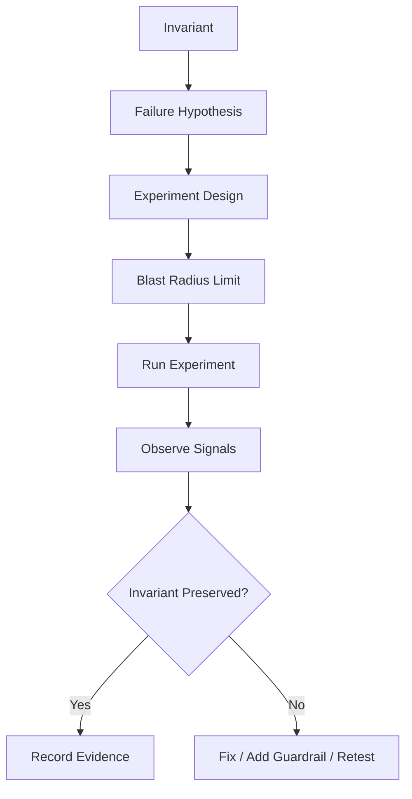

# Part 061 — Chaos and Failure Testing

> Do not wait for production to teach you how your system fails.
>
> Production is an expensive classroom.

Kita sudah membangun model:

- file lifecycle;
- object storage;
- state consistency;
- configuration management;
- secret management;
- threat modeling;
- leakage prevention;
- encryption/access control;
- auditability;
- observability.

Sekarang kita harus membuktikan semuanya.

Chaos and failure testing bukan “randomly break production”. Itu pemahaman yang salah dan berbahaya.

Chaos engineering adalah eksperimen terkontrol untuk memvalidasi hipotesis tentang sistem dalam kondisi failure. Untuk seri ini, targetnya sangat spesifik:

```txt
Can the system preserve or detect its invariants when file, state,
config, secret, and runtime dependencies fail?
```

Kubernetes sendiri menyediakan probe readiness/liveness/startup untuk membantu kubelet menentukan apakah container sehat, siap menerima traffic, atau perlu direstart. Chaos tooling seperti Chaos Mesh menyediakan fault injection di Kubernetes untuk menguji perilaku sistem terhadap abnormality yang realistis. Tetapi tool hanyalah mekanisme. Nilai utamanya ada pada desain eksperimen.

---

## 1. Failure Testing Mindset

Ada tiga level test.

| Level | Question |
|---|---|
| Unit/integration failure test | Does this code path handle failure? |
| Scenario test | Does this workflow recover from partial failure? |
| Chaos experiment | Does the running system preserve steady state under injected fault? |

Example:

```txt
Unit test:
ObjectStorageClient throws timeout.

Scenario test:
Upload object succeeds, DB commit fails, reconciliation cleans orphan object.

Chaos experiment:
Object storage returns intermittent 503 for 10 minutes while upload traffic continues.
System degrades safely, no accepted file lacks checksum, alerts fire.
```

---

## 2. The Steady State

Chaos experiment must define steady state first.

Weak steady state:

```txt
Service is up.
```

Useful steady state:

```txt
- Valid upload sessions can be created.
- Uploaded files reach QUARANTINED or fail with explicit reason.
- No ACCEPTED file exists without checksum.
- Audit outbox oldest age < 60 seconds.
- Secret TTL > 15 minutes.
- Config version is consistent across ready pods.
- Download authorization deny rate does not unexpectedly drop to zero.
```

Steady state should be measurable.

---

## 3. Invariant-Driven Chaos

Start with invariant.



Example:

| Invariant | Failure |
|---|---|
| No accepted file without checksum | scanner returns duplicate/out-of-order result |
| No secret expires before refresh | Vault unavailable near lease renewal |
| No config unsafe value in prod | ConfigMap patched manually |
| No metadata-payload mismatch persists | DB failure after object write |
| No duplicate processing side effect | worker crashes after side effect before ack |
| No stale authorization decision for critical download | permission revoked while cache contains allow |

---

## 4. Failure Taxonomy

### 4.1 File Handling Failures

| Failure | What to Verify |
|---|---|
| disk full in temp directory | upload fails safely, cleanup works |
| temp file deleted mid-processing | worker retries/rejects explicitly |
| path permission denied | service fails readiness or operation fails cleanly |
| partial multipart upload | abort/reconciliation works |
| checksum mismatch | file rejected/quarantined |
| malware scanner timeout | file not accepted |
| scanner duplicate event | idempotent state transition |
| object missing for metadata | reconciliation detects |
| metadata missing for object | orphan cleanup detects |
| delete denied by retention | deletion blocked and audited |

### 4.2 Object Storage Failures

| Failure | What to Verify |
|---|---|
| `PutObject` timeout | retry/idempotency, no false accepted state |
| `GetObject` 404 | error classification, no misleading response |
| storage 403 | access policy alert |
| storage 503 | backoff/circuit breaker |
| slow storage | timeout, backpressure |
| multipart complete failure | session remains recoverable |
| abort multipart failure | cleanup retry |
| object version conflict | metadata version consistency |

### 4.3 State Failures

| Failure | What to Verify |
|---|---|
| optimistic lock conflict | retry or explicit conflict |
| duplicate event | idempotent consumer |
| out-of-order event | lifecycle guard |
| DB deadlock | bounded retry |
| DB commit after external side effect fails | reconciliation |
| cache stale | critical operations recheck |
| replay job uses changed config | replay policy versioning |
| worker split brain | fencing/idempotency |

### 4.4 Configuration Failures

| Failure | What to Verify |
|---|---|
| missing required config | startup fails |
| invalid config value | validation blocks |
| unsafe production value | policy blocks |
| config reload partial failure | old config remains active |
| mixed config versions | detected and bounded |
| ConfigMap changed manually | drift alert |
| feature flag service down | safe fallback |
| config import unavailable | fail-fast or safe degrade |

### 4.5 Secret Failures

| Failure | What to Verify |
|---|---|
| secret missing | startup/readiness fails |
| secret malformed | validation blocks |
| secret manager unavailable | cached credential TTL respected |
| lease renewal fails | alert and degrade before expiry |
| secret expires | readiness fails before unsafe work |
| rotation new credential invalid | old credential remains valid |
| old credential revoked too early | alert and recovery path |
| secret volume updates but app does not reload | rollout/reload strategy verified |

---

## 5. Experiment Template

Use consistent template.

```mdx
# Chaos Experiment: <Name>

## Purpose
What invariant are we validating?

## Hypothesis
Under <fault>, the system will <expected behavior>.

## Scope
- Environment:
- Services:
- Tenants/test data:
- Blast radius:
- Time window:

## Steady State
- Metric:
- Threshold:
- Dashboard:

## Fault Injection
- Fault:
- Duration:
- Intensity:
- Target:

## Expected Behavior
- User-visible:
- Internal state:
- Audit:
- Alerts:
- Recovery:

## Abort Conditions
- Error budget burn:
- Data integrity risk:
- Security risk:
- Manual stop signal:

## Rollback
- How to stop fault:
- How to recover:
- Who owns recovery:

## Evidence
- Metrics:
- Logs:
- Traces:
- Audit events:
- Screenshots/links:

## Result
- Pass/fail:
- Findings:
- Corrective actions:
```

---

## 6. Safety Rules

Chaos without guardrails is negligence.

### 6.1 Blast Radius

Limit by:

- environment;
- namespace;
- label selector;
- tenant;
- traffic percentage;
- duration;
- dependency;
- operation type;
- canary service instance.

Never start with broad production faults.

### 6.2 Abort Conditions

Define before running.

Examples:

```txt
- upload error rate > 10% for 5 minutes
- audit outbox oldest age > 15 minutes
- accepted file without checksum > 0
- secret seconds until expiry < 5 minutes
- scanner queue age > 1 hour
- security deny rate unexpectedly drops
```

### 6.3 Data Safety

Use test tenants and synthetic files.

If real data is involved:

- get explicit approval;
- ensure retention/legal constraints;
- no destructive test unless controlled;
- backup/recovery plan;
- audit evidence.

### 6.4 Communication

For game day:

- declare window;
- owner;
- incident channel;
- rollback authority;
- observer roles;
- expected alerts.

---

## 7. Local and Integration Failure Injection

Not every failure test needs cluster chaos.

### 7.1 Java Unit Test with Faulty Storage

```java
final class FailingObjectStorage implements ObjectStorage {
    @Override
    public StoredObject put(PutObjectRequest request) {
        throw new StorageTimeoutException("simulated timeout");
    }
}
```

Test:

```java
@Test
void uploadDoesNotAcceptFileWhenStorageTimeouts() {
    ObjectStorage storage = new FailingObjectStorage();
    UploadService service = new UploadService(storage, repository, audit);

    assertThrows(StorageTimeoutException.class, () -> service.completeUpload(command));

    StoredFile file = repository.get(command.fileId());
    assertNotEquals(FileLifecycleStatus.ACCEPTED, file.status());
}
```

### 7.2 Toxiproxy for Dependency Faults

For integration tests, use proxy to simulate:

- latency;
- timeout;
- connection reset;
- bandwidth limit;
- dependency unavailable.

Useful targets:

- PostgreSQL;
- Redis;
- object storage emulator;
- Vault;
- HTTP scanner.

### 7.3 Testcontainers

Testcontainers can run dependencies and inject lifecycle disruption:

```txt
start DB -> perform upload -> stop DB -> verify retry/failure -> start DB -> verify recovery
```

Do not overfit tests to emulator behavior. Object storage emulator may not perfectly match S3 semantics.

---

## 8. Kubernetes Fault Injection

Kubernetes-native experiments can target:

- pod kill;
- container kill;
- network delay;
- network loss;
- DNS failure;
- CPU stress;
- memory stress;
- disk pressure;
- time skew where supported by tooling;
- HTTP fault injection via mesh/proxy.

Chaos Mesh, LitmusChaos, and other tools provide CRD-driven experiments in Kubernetes. Tool choice matters less than experiment discipline.

### 8.1 Pod Kill Experiment

Hypothesis:

```txt
If upload worker pod dies after receiving scan result but before ack,
duplicate delivery/retry will not create invalid lifecycle transition.
```

Expected:

- worker restarts/replaced;
- event reprocessed idempotently;
- file remains in valid state;
- audit event not duplicated or duplicate is idempotently ignored;
- alert only if backlog exceeds threshold.

### 8.2 Network Delay to Object Storage

Hypothesis:

```txt
If object storage latency increases by 2s, upload API applies timeout/backpressure,
does not exhaust servlet threads, and does not mark file accepted prematurely.
```

Expected metrics:

```txt
object_storage_request_duration_seconds increases
file_upload_failed_total{reason="storage_timeout"} may increase
JVM threads stable
no accepted file without checksum
```

### 8.3 Secret Manager Outage

Hypothesis:

```txt
If Vault/secret manager is unavailable for 10 minutes,
service continues only while cached credential is valid,
alerts before expiry, and readiness fails before unsafe work.
```

Expected:

- secret refresh failures increment;
- secret TTL gauge decreases;
- readiness degrades near threshold;
- no secret value logged;
- no immediate crash loop if current credential valid.

### 8.4 ConfigMap Drift

Hypothesis:

```txt
If ConfigMap is manually patched to unsafe value,
drift detection and policy block or alert before service accepts unsafe behavior.
```

Expected:

- GitOps reverts or drift alert fires;
- config validation blocks if app restarts;
- runtime reload rejects unsafe value;
- audit event records drift.

---

## 9. File Workflow Experiments

### 9.1 DB Commit Fails After Object Upload

Failure:

```txt
Object upload succeeds.
Metadata DB commit fails.
```

Expected:

- client gets explicit failure or retryable response;
- object remains in temp/quarantine prefix;
- reconciliation detects object_without_metadata;
- cleanup or metadata repair path runs;
- no accepted file exists without metadata;
- audit records failure or recovery.

### 9.2 Scan Result Arrives Twice

Failure:

```txt
Scanner sends SCAN_CLEAN twice.
```

Expected:

- first event transitions SCANNED -> ACCEPTED;
- second event is ignored/idempotent;
- no duplicate audit material event or duplicate marked as idempotent;
- state version unchanged.

### 9.3 Scan Result Arrives After Deletion Request

Failure:

```txt
File deletion requested while scan is still pending.
Scan result arrives later.
```

Expected:

- lifecycle guard prevents deleted/rejected file becoming accepted;
- late event recorded as ignored/conflict;
- alert if frequent.

### 9.4 Presigned Upload Never Completed

Failure:

```txt
Client creates upload session but never uploads.
```

Expected:

- session expires;
- multipart upload aborted;
- temp metadata marked expired/rejected;
- no permanent object;
- quota released.

---

## 10. Config Experiments

### 10.1 Bad Startup Config

Inject:

```yaml
evidence:
  file:
    quarantine-bucket: evidence-prod
    accepted-bucket: evidence-prod
```

Expected:

- startup fails;
- readiness never becomes ready;
- deployment rollout stops;
- previous version continues serving;
- alert includes config validation failure;
- no traffic sent to bad pod.

### 10.2 Runtime Reload Failure

Inject:

```txt
reloadable timeout value malformed
```

Expected:

- new config rejected;
- old config remains active;
- metric increments;
- audit/ops event records failure;
- no partial object/client rebuild.

### 10.3 Mixed Config Version

Inject:

```txt
only 50% pods receive new config/restart
```

Expected:

- dashboard shows mixed versions;
- alert if beyond rollout window;
- canary analysis catches behavior difference;
- rollback or complete rollout path.

---

## 11. Secret Experiments

### 11.1 Secret Rotation New Credential Invalid

Inject:

```txt
new DB password wrong
```

Expected:

- canary fails readiness;
- old credential remains valid;
- rollout paused;
- old pods continue serving;
- alert fires;
- no old credential revoke.

### 11.2 Secret Expires During Traffic

Inject:

```txt
short TTL dynamic credential, block renewal
```

Expected:

- refresh failure observed;
- readiness fails before expiry or near unsafe threshold;
- existing in-flight work handled according policy;
- no infinite auth retry storm;
- no secret logged.

### 11.3 Mounted Secret Updated Without App Reload

Inject:

```txt
Kubernetes Secret volume content changes
```

Expected:

- if runtime reload supported: app loads version, validates, rebuilds client;
- if not supported: rollout triggered;
- service does not assume file update automatically updates connection pool.

---

## 12. State Experiments

### 12.1 Lost Update

Inject:

```txt
two requests attempt same lifecycle transition concurrently
```

Expected:

- optimistic lock conflict;
- only one transition commits;
- loser gets conflict or retry;
- audit event only for committed transition.

### 12.2 Worker Split Brain

Inject:

```txt
two workers process same job with same fileId
```

Expected:

- idempotency key/fencing prevents duplicate side effect;
- state transition guard holds;
- duplicate metric increments;
- no duplicate physical delete.

### 12.3 Replay Drift

Inject:

```txt
run replay with newer policy against old events
```

Expected:

- replay uses captured policy version or flags conflict;
- drift report generated;
- no silent mutation of authoritative state.

---

## 13. Readiness and Probe Testing

Kubernetes readiness controls whether Pod receives traffic. Use failure tests to verify readiness semantics.

Test cases:

| Condition | Expected Readiness |
|---|---|
| DB down | not ready for write service |
| object storage down | not ready for file operations |
| scanner down | maybe ready but upload accepted only to quarantine, depending design |
| secret expired | not ready |
| config invalid | not ready |
| audit outbox too old for high-risk operations | degraded/not ready depending policy |

Do not use liveness to restart pod for every dependency blip. That can cause crash-loop storms. Liveness should detect unrecoverable process failure; readiness should represent traffic safety.

---

## 14. Game Day Structure

A game day is a coordinated exercise.

### 14.1 Roles

| Role | Responsibility |
|---|---|
| Experiment lead | runs experiment |
| Service owner | observes service behavior |
| SRE | monitors platform |
| Security | watches security signals |
| Incident commander | coordinates if abort needed |
| Scribe | records evidence/timeline |

### 14.2 Timeline

```txt
T-30m: confirm steady state
T-15m: announce experiment
T0: inject fault
T+5m: observe first signals
T+15m: evaluate hypothesis
T+20m: remove fault
T+30m: confirm recovery
T+60m: write findings
```

### 14.3 Output

Every game day should produce:

- pass/fail result;
- observed metrics;
- screenshots/dashboard links;
- audit/log/tracing evidence;
- bugs found;
- runbook improvements;
- backlog items;
- owner and due date.

---

## 15. Failure Testing in CI/CD

Not all chaos belongs in production.

### 15.1 Pull Request Level

- unit failure tests;
- config validation tests;
- secret redaction tests;
- lifecycle transition tests;
- idempotency tests.

### 15.2 Integration Pipeline

- dependency timeout tests;
- DB restart;
- object storage emulator failure;
- duplicate message delivery;
- malformed config;
- missing secret.

### 15.3 Staging Game Day

- Kubernetes pod kill;
- network delay/loss;
- secret manager outage simulation;
- config drift;
- storage 503 simulation;
- DLQ replay.

### 15.4 Production Controlled Experiment

Only after staging proof:

- tiny blast radius;
- synthetic tenant;
- clear abort;
- owner present;
- known dashboard/runbook.

---

## 16. Chaos Experiment Examples

### 16.1 Object Storage 503

```mdx
## Hypothesis
When object storage returns intermittent 503 for 10 minutes,
file upload API returns retryable errors and no file reaches ACCEPTED without checksum.

## Steady State
- file_upload_completed_total increasing
- file_checksum_verification_failed_total stable
- audit_outbox_oldest_age_seconds < 60
- no metadata_payload_mismatch for accepted files

## Expected
- object_storage_retry_total increases
- file_upload_failed_total{reason="storage_unavailable"} increases
- readiness maybe remains up if service can return graceful errors
- alert fires only if SLO breached
```

### 16.2 Audit Sink Down

```mdx
## Hypothesis
If audit sink is down, business transactions still write audit outbox rows,
publisher retries, and high-risk delete operations fail closed if synchronous audit is required.

## Expected
- audit_outbox_pending_total increases
- audit_publish_failure_total increases
- no material state change without audit outbox row
- destructive operation blocked if policy requires
```

### 16.3 Secret Manager Down Near Expiry

```mdx
## Hypothesis
If secret manager is unavailable and cached secret expires soon,
service fails readiness before using invalid credential.

## Expected
- secret_refresh_failure_total increases
- secret_seconds_until_expiry decreases
- readiness not ready below threshold
- dependency auth failures do not explode
```

---

## 17. Anti-Patterns

### 17.1 Random Failure Injection

No hypothesis, no steady state, no learning.

### 17.2 No Abort Condition

This is how experiments become incidents.

### 17.3 Testing Only Infrastructure, Not Domain Invariants

Killing pods is easy. Proving no accepted file lacks checksum is valuable.

### 17.4 No Evidence Capture

If you do not record results, the organization does not learn.

### 17.5 Running Chaos Before Observability

If you cannot observe outcome, do not inject fault yet.

### 17.6 No Follow-Through

Finding weakness without fixing it trains the team to ignore risk.

---

## 18. Production Checklist

```txt
[ ] Critical invariants defined
[ ] Steady state metrics exist
[ ] Failure scenarios mapped to invariants
[ ] Abort conditions defined
[ ] Blast radius limited
[ ] Synthetic test data available
[ ] Owners present
[ ] Dashboards ready
[ ] Alerts tested
[ ] Runbooks linked
[ ] Audit evidence captured
[ ] Findings turned into backlog
[ ] Experiment repeated after fixes
```

---

## 19. Key Takeaways

1. **Chaos testing validates invariants under controlled fault, not random destruction.**
2. **Every experiment needs hypothesis, steady state, blast radius, abort condition, and evidence.**
3. **File systems need failure tests for partial upload, scanner failure, orphan objects, checksum mismatch, and retention delete denial.**
4. **Configuration tests must cover missing, invalid, unsafe, stale, mixed, and drifted config.**
5. **Secret tests must cover missing secret, lease failure, bad rotation, expiry, and stale consumer.**
6. **State tests must cover duplicate event, lost update, replay drift, stale cache, and split brain.**
7. **Readiness must represent traffic safety; liveness must not restart pods for every dependency blip.**
8. **Game days should produce evidence and corrective actions.**
9. **Run chaos only after observability is sufficient.**
10. **A system is not production-grade until its failure behavior is tested.**

Next, we close the cross-cutting block with **Compliance and Regulatory Defensibility**: turning technical controls into evidence that can survive audit, legal review, and post-incident scrutiny.

---

## References

- Principles of Chaos Engineering: https://principlesofchaos.org/
- Chaos Mesh Documentation: https://chaos-mesh.org/docs/
- Kubernetes Liveness, Readiness, and Startup Probes: https://kubernetes.io/docs/concepts/workloads/pods/probes/
- Kubernetes Configure Probes: https://kubernetes.io/docs/tasks/configure-pod-container/configure-liveness-readiness-startup-probes/
- Kubernetes Pod Disruption Budgets: https://kubernetes.io/docs/tasks/run-application/configure-pdb/
- OpenTelemetry Documentation: https://opentelemetry.io/docs/
