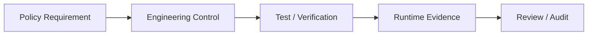
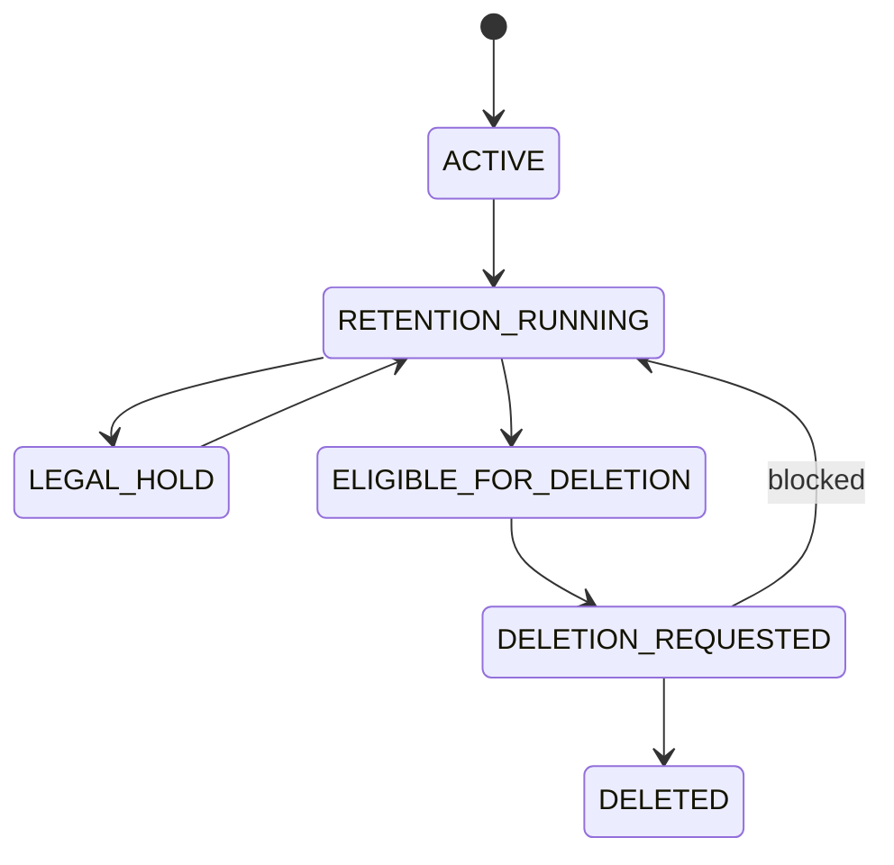
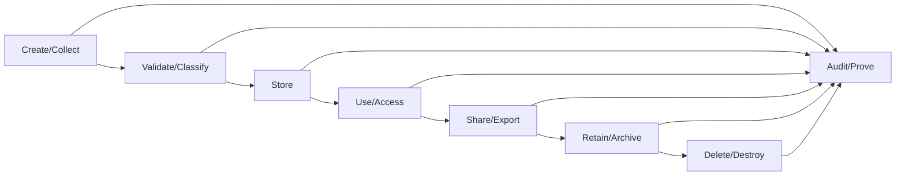
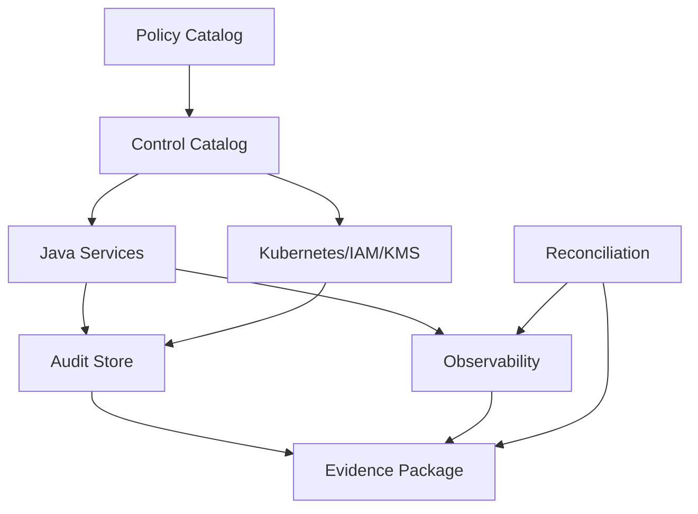

# Part 062 — Compliance and Regulatory Defensibility

> Compliance is not a PDF you attach after the system is built.
>
> It is a set of invariants the system can prove over time.

This part is not legal advice. It is engineering guidance for building systems that can be defended in audit, investigation, incident review, and regulatory scrutiny.

A defensible system does not merely claim:

```txt
We protect files.
We rotate secrets.
We audit access.
We enforce retention.
```

It can show evidence:

```txt
Here is the policy.
Here is the implementation.
Here is the control.
Here is the audit event.
Here is the access record.
Here is the test.
Here is the exception handling.
Here is the incident runbook.
Here is proof the control worked on this date.
```

For file/state/config/secret systems, defensibility is especially important because these systems often hold:

- evidence;
- case files;
- documents;
- personal data;
- regulated records;
- credentials;
- audit records;
- configuration that changes enforcement behavior;
- state transitions that affect rights, obligations, or liability.

---

## 1. What Is Regulatory Defensibility?

Regulatory defensibility means:

```txt
The system can explain and prove that its behavior followed approved policy,
and that deviations were detected, recorded, assessed, and corrected.
```

It has four layers.

| Layer | Question |
|---|---|
| Policy | What should happen? |
| Control | How is the policy enforced? |
| Evidence | How do we prove it happened? |
| Review | Who verifies and improves it? |

Example:

| Layer | Example |
|---|---|
| Policy | Evidence file retained for 7 years after case closure unless legal hold active |
| Control | deletion service checks retention and legal hold before physical delete |
| Evidence | audit event `FILE_DELETION_BLOCKED` with reason `LEGAL_HOLD_ACTIVE` |
| Review | quarterly retention control review and reconciliation report |

---

## 2. Compliance Is About Traceability

Every important technical control should trace to a policy requirement.



Example:

```txt
Requirement:
Accepted evidence must be tamper-evident.

Control:
Store SHA-256 checksum, object version ID, lifecycle state, and audit event.

Test:
Attempt overwrite accepted object and invalid state transition.

Evidence:
FILE_ACCEPTED audit event includes checksum/objectVersion.
Object storage data event shows no overwrite.
```

---

## 3. Control Catalog

For this series, build a control catalog.

```yaml
controlId: FILE-RET-001
name: Evidence retention enforcement
owner: evidence-platform
policy:
  description: Evidence files under active retention or legal hold must not be physically deleted.
  source: retention-policy-v4
implementation:
  service: evidence-service
  codePath: EvidenceFileDeletionService
  storage: object-lock-enabled-bucket
verification:
  tests:
    - EvidenceDeletionRetentionTest
    - LegalHoldDeletionBlockedIT
  reconciliation:
    - evidence-retention-reconciliation
evidence:
  auditEvents:
    - FILE_DELETION_REQUESTED
    - FILE_DELETION_BLOCKED
    - FILE_DELETION_COMPLETED
  metrics:
    - file_deletion_blocked_total
    - retention_mismatch_total
review:
  frequency: quarterly
  reviewer: compliance-engineering
```

Control catalog does not need to start as a large GRC tool. A versioned repository is enough if it is maintained, reviewed, and mapped to runtime evidence.

---

## 4. Key Control Domains

### 4.1 File Lifecycle Controls

| Control | Evidence |
|---|---|
| raw upload quarantined | `FILE_QUARANTINED` |
| accepted file scanned | `FILE_SCAN_COMPLETED`, `FILE_ACCEPTED` |
| checksum verified | checksum field + audit event |
| accepted file immutable | object version/object lock/no overwrite |
| download authorized | `FILE_DOWNLOAD_GRANTED/DENIED` |
| delete controlled | deletion request/approval/block/complete events |
| orphan detection | reconciliation report |

### 4.2 State Controls

| Control | Evidence |
|---|---|
| lifecycle transition valid | state transition audit + DB constraint |
| source of truth explicit | ownership catalog |
| replay controlled | replay job report |
| duplicate event idempotent | duplicate metric/audit evidence |
| manual override governed | override approval + audit event |
| cache not authoritative for critical decisions | design review + test evidence |

### 4.3 Configuration Controls

| Control | Evidence |
|---|---|
| config change reviewed | PR approval |
| config value validated | CI/startup validation result |
| unsafe prod value blocked | policy/admission denial |
| config provenance known | version/source startup event |
| drift detected | drift alert/report |
| dynamic reload governed | reload audit + safe fallback |

### 4.4 Secret Controls

| Control | Evidence |
|---|---|
| secret not stored in plaintext Git | secret scan + SOPS/ESO/SealedSecret design |
| least privilege | IAM/RBAC policy review |
| secret access audited | secret manager/Kubernetes audit |
| rotation performed | rotation audit chain |
| old credential revoked | revoke event + dependency audit |
| secret not logged | redaction tests + log scan |
| TTL respected | secret TTL metrics |

### 4.5 Observability/Audit Controls

| Control | Evidence |
|---|---|
| material events audited | audit event coverage matrix |
| audit pipeline reliable | outbox metrics and tests |
| audit store protected | access policy and access logs |
| incident reconstruction possible | forensic drill report |
| alerts actionable | runbook and alert test |

---

## 5. Retention Engineering

Retention is not “delete after N days”.

Retention depends on:

- record type;
- lifecycle status;
- jurisdiction/policy;
- case status;
- legal hold;
- appeal/dispute;
- investigation freeze;
- tenant contract;
- deletion request;
- archival class;
- evidence integrity.

### 5.1 Retention State Model



### 5.2 Retention Decision Record

Do not just delete. Record decision.

```java
public record RetentionDecision(
    String fileId,
    boolean deletable,
    String reasonCode,
    String policyVersion,
    Instant evaluatedAt,
    Optional<Instant> retentionUntil
) {}
```

Reason codes:

```txt
RETENTION_ACTIVE
LEGAL_HOLD_ACTIVE
CASE_NOT_CLOSED
APPEAL_WINDOW_ACTIVE
DELETE_ALLOWED
POLICY_NOT_FOUND
```

### 5.3 Delete Workflow

```txt
1. Deletion requested.
2. Retention evaluated.
3. Legal hold checked.
4. Authorization checked.
5. Audit event recorded.
6. Object delete or tombstone executed.
7. Metadata state updated.
8. Reconciliation verifies.
```

Invariant:

```txt
No physical delete of regulated file without retention decision evidence.
```

### 5.4 Object Lock and Legal Hold

For storage like S3 Object Lock, retention period and legal hold can prevent object version overwrite/delete. Legal hold does not have a fixed expiration and remains until removed by an authorized user. Engineering implication:

```txt
Domain retention decision and storage-level retention must be aligned,
but storage control should be treated as a backstop, not the only policy brain.
```

---

## 6. Legal Hold

Legal hold overrides normal deletion.

### 6.1 Legal Hold Control

```txt
If legalHold=true, deletion must be blocked regardless of default retention expiry.
```

### 6.2 Legal Hold Audit

Events:

```txt
LEGAL_HOLD_APPLIED
LEGAL_HOLD_REMOVED
FILE_DELETION_BLOCKED
```

Each event should include:

- actor;
- authority;
- reason;
- scope;
- policy/case reference;
- timestamp;
- resource list or query criteria;
- approval reference.

### 6.3 Legal Hold Scope

Legal hold may apply to:

- file;
- case;
- tenant;
- subject;
- investigation;
- date range;
- document type;
- storage prefix.

Be careful with query-based hold. If hold is “all evidence for Case X”, newly added evidence may also be covered. This needs implementation clarity.

---

## 7. Evidence Integrity

Evidence integrity means:

```txt
The system can prove the artifact presented later is the same artifact accepted earlier,
or can explain every transformation with authorization and audit trail.
```

Controls:

- checksum;
- object version ID;
- immutable accepted prefix;
- object lock if required;
- no overwrite policy;
- audit chain;
- scanner decision version;
- access log;
- retention state;
- lifecycle state machine.

### 7.1 Chain of Custody

For file evidence:

```txt
Uploader -> upload session -> object received -> checksum verified -> scanned
-> accepted -> accessed/downloaded -> archived -> deleted/retained
```

Each step should have audit evidence.

### 7.2 Transformation

If you transform file:

- thumbnail;
- OCR text;
- redacted copy;
- PDF/A conversion;
- virus-disarmed copy;
- archive package;

then model derived artifact separately.

```txt
sourceFileId=FILE-1
derivedFileId=FILE-2
transformationType=OCR_TEXT_EXTRACTION
toolVersion=ocr-engine-3.2.1
createdAt=...
```

Do not overwrite original evidence.

---

## 8. Access Review

Least privilege is not one-time.

### 8.1 Access Review Objects

Review access to:

- object storage buckets/prefixes;
- database schemas;
- Kubernetes Secrets;
- ConfigMaps in prod;
- secret manager paths;
- KMS keys;
- audit store;
- GitOps repo;
- CI/CD production environment;
- admin/debug endpoints;
- support tools.

### 8.2 Evidence

Access review should produce:

```txt
who had access
why they needed it
who approved
what changed
when next review occurs
```

### 8.3 Runtime Access Evidence

For sensitive file download:

```txt
FILE_DOWNLOAD_GRANTED actor=user-123 resource=FILE-01JZ policy=case-access-v7
```

For secret read:

```txt
secret manager audit: serviceAccount=evidence-service read path=prod/evidence/db version=v42
```

---

## 9. Configuration Defensibility

Configuration changes can alter compliance behavior.

Examples:

- retention period;
- scan required;
- max upload size;
- accepted MIME types;
- direct upload enabled;
- download TTL;
- audit sync mode;
- feature flag for new workflow;
- tenant isolation mode.

### 9.1 Config Control Requirements

Every high-risk config needs:

- owner;
- schema;
- allowed range;
- safe default;
- environment policy;
- approval;
- rollout plan;
- rollback plan;
- runtime evidence;
- audit event.

### 9.2 Effective Config Evidence

At runtime, capture:

```txt
service=evidence-service
configVersion=git:abc123
policyVersion=retention-v4
scanRequired=true
downloadUrlTtlMax=300s
```

Do not capture secrets or sensitive values.

### 9.3 Config Change Review

For high-risk config PR:

```txt
[ ] owner approved
[ ] security/compliance approved if needed
[ ] validation passed
[ ] staging tested
[ ] rollback documented
[ ] observability updated
```

---

## 10. Secret Defensibility

For secrets, defensibility means proving:

- secret was stored appropriately;
- access was least privilege;
- access was audited;
- rotation happened;
- old credential revoked;
- leakage controls exist;
- consumers refreshed safely.

### 10.1 Secret Rotation Evidence

A complete rotation record:

```txt
secret: evidence-db
oldVersion: v41
newVersion: v42
rotationStartedAt: ...
newCredentialValidatedAt: ...
allConsumersSwitchedAt: ...
oldCredentialRevokedAt: ...
authFailuresAfterRevoke: 0
approver: ...
runbook: ...
```

### 10.2 Secret Storage Evidence

Depending on architecture:

| Pattern | Evidence |
|---|---|
| Vault | policy, auth method, audit log, lease events |
| AWS Secrets Manager | secret version, rotation event, IAM policy, CloudTrail |
| Azure Key Vault | access policy/RBAC, secret version, audit logs |
| GCP Secret Manager | IAM policy, secret version, access logs |
| SOPS | encrypted file, KMS key policy, PR approval |
| Sealed Secrets | controller key custody, sealed manifest |
| ESO | ExternalSecret manifest, SecretStore policy, sync status |

---

## 11. Data Lifecycle

A defensible data lifecycle has explicit stages.



For each stage:

| Stage | Engineering Questions |
|---|---|
| Create | who can create, what validation |
| Validate | content/integrity/security checks |
| Store | encryption, ownership, storage class |
| Use | authorization, logging, access audit |
| Share | export/download restrictions |
| Retain | retention/legal hold |
| Delete | deletion policy and proof |
| Audit | evidence and reconstruction |

---

## 12. Policy-as-Code

Compliance controls should be automated where possible.

Examples:

### 12.1 Kubernetes Admission

Deny:

- Secret in default namespace;
- ConfigMap containing key name `password`;
- Deployment mounting all secrets;
- pod with privileged mode;
- prod ConfigMap without owner annotation;
- service account with broad secret list permission.

### 12.2 CI Policy

Deny:

- plaintext secret in Git;
- high-risk config change without owner approval;
- missing config schema;
- missing audit event for new lifecycle transition;
- missing test for retention delete.

### 12.3 Runtime Policy

Deny:

- deletion under legal hold;
- download before file accepted;
- config reload unsafe value;
- secret expired usage;
- state transition not allowed.

Policy-as-code should not replace domain code. It complements it.

---

## 13. Evidence Package for Audit

For an audit request, prepare evidence packages.

### 13.1 File Control Evidence

```txt
- file lifecycle state machine documentation
- code references for transition guards
- tests for invalid transition
- audit event examples
- retention decision examples
- reconciliation reports
- storage object lock settings if applicable
```

### 13.2 Secret Control Evidence

```txt
- secret inventory
- secret ownership catalog
- secret manager policies
- Kubernetes RBAC
- rotation records
- redaction tests
- incident runbook
```

### 13.3 Config Control Evidence

```txt
- config schema
- config owner catalog
- Git PR history
- validation pipeline result
- deployment config version evidence
- drift detection report
```

### 13.4 Observability Evidence

```txt
- dashboards
- alert rules
- alert test result
- audit outbox metrics
- forensic drill report
```

---

## 14. Regulatory Failure Modes

### 14.1 Control Exists but No Evidence

```txt
"We validate checksum."
```

But no audit event, no stored checksum, no test record.

Fix:

- persist checksum;
- audit verification;
- test and report.

### 14.2 Evidence Exists but Is Not Trustworthy

Audit table can be edited by app admin.

Fix:

- append-only store;
- restricted access;
- tamper-evident chain;
- separate boundary.

### 14.3 Policy Not Mapped to Code

Retention policy says 7 years. Code says 5 years.

Fix:

- policy versioning;
- config schema;
- policy review;
- automated test.

### 14.4 Manual Exception Without Audit

Operator deletes object directly from bucket.

Fix:

- least privilege;
- storage audit;
- break-glass process;
- reconciliation;
- legal hold/object lock where needed.

### 14.5 Secret Rotated but Old Credential Still Active

Fix:

- rotation completion criteria;
- dependency audit;
- old credential usage metric;
- revoke evidence.

---

## 15. Compliance Testing

### 15.1 Control Tests

```txt
Given file under legal hold
When deletion requested
Then deletion is blocked
And FILE_DELETION_BLOCKED audit event recorded
And object still exists
```

### 15.2 Evidence Tests

```txt
Given file accepted
Then audit event contains fileId, checksum, scan decision, policy version
And does not contain raw payload or secret
```

### 15.3 Access Tests

```txt
Given user lacks case permission
When download requested
Then FILE_DOWNLOAD_DENIED event recorded
And no presigned URL issued
```

### 15.4 Retention Reconciliation

```txt
Find:
- object deleted but metadata active
- metadata deleted but object retained
- file past retention but legal hold active
- file eligible but not deleted
```

Each mismatch gets severity and remediation.

---

## 16. Design Review Checklist

### Policy

```txt
[ ] Requirement identified
[ ] Owner assigned
[ ] Policy versioned
[ ] Exception process defined
```

### Control

```txt
[ ] Control implemented in code/config/platform
[ ] Fail-closed behavior defined
[ ] Manual bypass controlled
[ ] Least privilege applied
```

### Evidence

```txt
[ ] Audit event defined
[ ] Event schema versioned
[ ] Runtime metric exists
[ ] Test evidence exists
[ ] Storage/platform audit enabled if needed
```

### Review

```txt
[ ] Control owner reviews periodically
[ ] Access review schedule defined
[ ] Retention reconciliation schedule defined
[ ] Incident/forensic drill performed
```

---

## 17. Regulatory Defensibility Architecture



The architecture has one goal:

```txt
Make it easy to prove the system behaved according to policy,
and hard to hide when it did not.
```

---

## 18. Production Checklist

```txt
[ ] Control catalog exists
[ ] File lifecycle controls mapped to evidence
[ ] Retention and legal hold implemented as domain controls
[ ] Physical delete requires retention decision evidence
[ ] Accepted files have checksum/version/audit evidence
[ ] Config changes have owner, validation, approval, rollout evidence
[ ] Secret rotation has completion evidence and revoke proof
[ ] Access reviews scheduled and recorded
[ ] Audit store is protected and access audited
[ ] Reconciliation reports retained
[ ] Forensic drill performed
[ ] Manual/break-glass actions audited
[ ] Exception process documented
```

---

## 19. Key Takeaways

1. **Compliance is an engineering property, not a document afterthought.**
2. **Defensibility requires policy, control, evidence, and review.**
3. **Retention is a domain decision, not just a storage lifecycle rule.**
4. **Legal hold must override deletion and produce audit evidence.**
5. **Evidence integrity requires checksum, immutable/tamper-evident storage, lifecycle state, and audit chain.**
6. **Config changes can change compliance behavior and must be governed.**
7. **Secret rotation is not complete until old credential revoke is proven.**
8. **Access review must cover storage, DB, Kubernetes, secret managers, KMS, GitOps, CI/CD, and observability systems.**
9. **Policy-as-code reduces manual drift but does not replace domain invariant enforcement.**
10. **A defensible system can reconstruct what happened and show why it was allowed, denied, blocked, or corrected.**

This closes the cross-cutting security, observability, and compliance block. Next, the series moves into final architecture and case studies: building a production reference architecture for file, state, config, and secret management in Java microservices.

---

## References

- NIST Cybersecurity Framework: https://www.nist.gov/cyberframework
- NIST SP 800-92 Guide to Computer Security Log Management: https://csrc.nist.gov/pubs/sp/800/92/final
- AWS S3 Object Lock: https://docs.aws.amazon.com/AmazonS3/latest/userguide/object-lock.html
- AWS S3 Object Lock Legal Hold: https://docs.aws.amazon.com/AmazonS3/latest/userguide/batch-ops-legal-hold.html
- Kubernetes Auditing: https://kubernetes.io/docs/tasks/debug/debug-cluster/audit/
- Kubernetes Good Practices for Secrets: https://kubernetes.io/docs/concepts/security/secrets-good-practices/
- OWASP Logging Cheat Sheet: https://cheatsheetseries.owasp.org/cheatsheets/Logging_Cheat_Sheet.html
