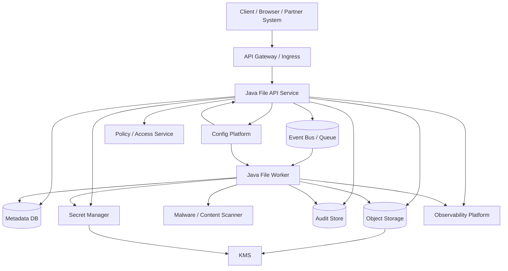
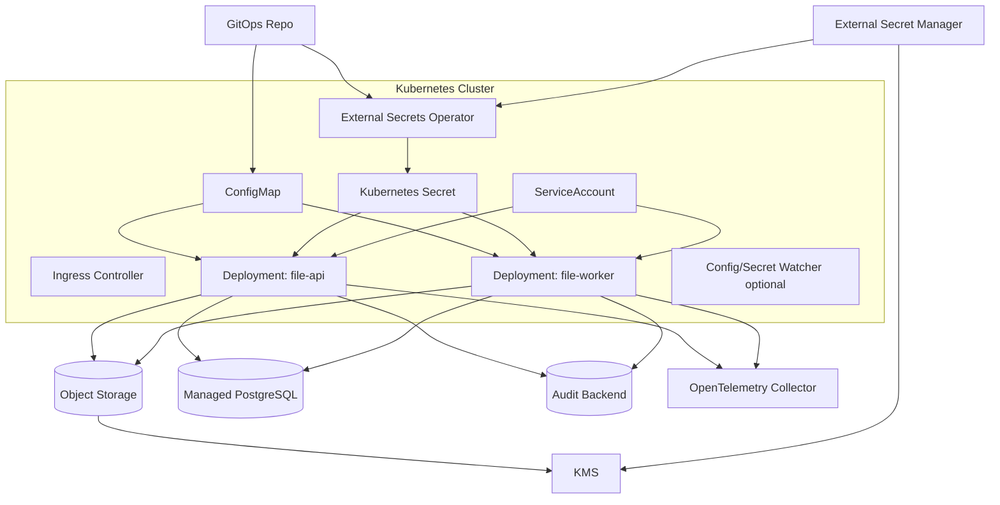
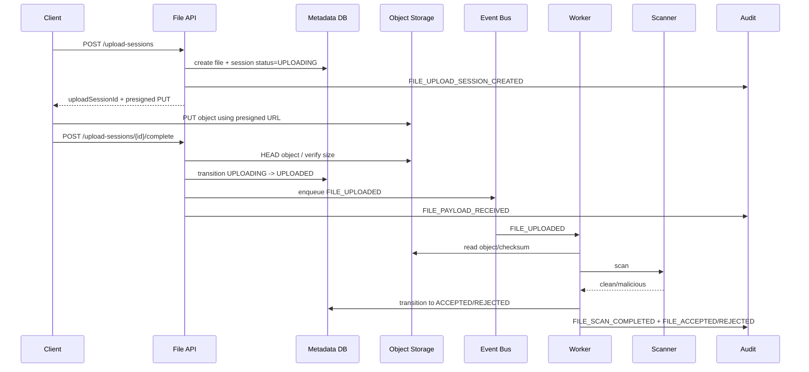
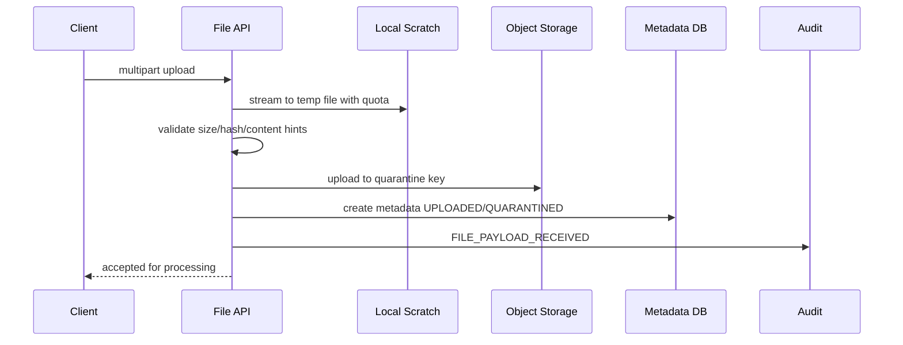
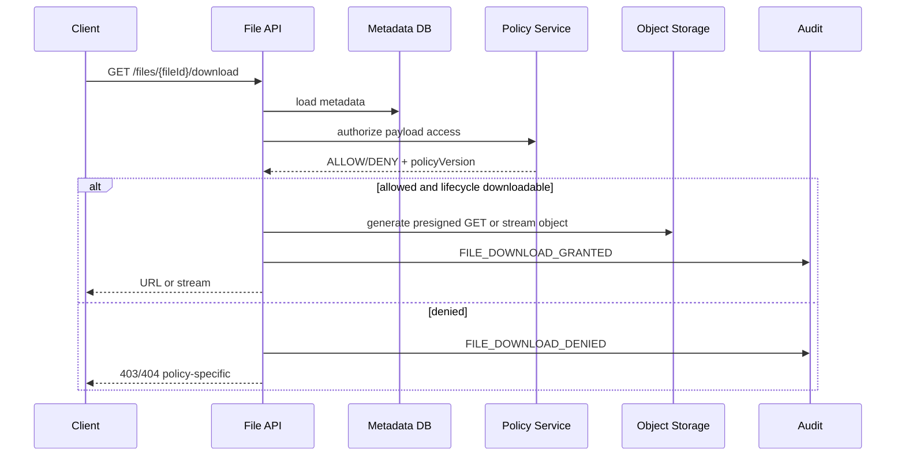

# Part 063 — Reference Architecture

> Architecture is not a box diagram.
>
> Architecture is the set of boundaries that keeps wrong things hard
> and right things boring.

Kita sudah membahas detail teknis dari banyak sisi:

- local file handling;
- object storage;
- file lifecycle;
- state management;
- configuration;
- secret management;
- threat model;
- observability;
- compliance.

Sekarang kita satukan menjadi reference architecture.

Reference architecture ini bukan “copy-paste template”. Tujuannya adalah memberi model yang bisa diadaptasi untuk organisasi yang membangun Java microservices production-grade, terutama yang menangani dokumen, attachment, evidence, large file, regulated record, config control plane, dan secret lifecycle.

Architecture yang baik harus menjawab:

```txt
Where do bytes live?
Where does truth live?
Where does policy live?
Where does capability live?
Where does proof live?
How does the system fail?
How does it recover?
Who owns each boundary?
```

---

## 1. Architecture Goals

Reference architecture ini mengoptimalkan beberapa objective.

| Goal | Meaning |
|---|---|
| Safety | untrusted file tidak langsung dipercaya |
| Integrity | payload, metadata, checksum, version, audit konsisten |
| Recoverability | partial failure bisa direkonsiliasi |
| Least privilege | service hanya punya capability yang dibutuhkan |
| Config discipline | behavior runtime berasal dari config tervalidasi dan dapat diaudit |
| Secret hygiene | secret tidak bocor, bisa dirotasi, dan consumer siap |
| Observability | invariant stress terlihat sebelum incident besar |
| Compliance | retention, legal hold, access, dan audit bisa dibuktikan |
| Cost control | storage class, egress, scan cost, temp data terkendali |
| Developer usability | API domain jelas dan tidak bocor sebagai wrapper S3 mentah |

---

## 2. High-Level Architecture



Key idea:

```txt
The File API owns domain contract.
Object storage owns bytes.
Metadata DB owns domain state.
Secret manager owns capabilities.
Config platform owns runtime behavior values.
Audit store owns proof.
```

Jangan campur semua ke satu “file service” yang melakukan segalanya tanpa boundary.

---

## 3. Service Boundaries

### 3.1 File API Service

Responsibilities:

- authenticate request context via platform;
- authorize upload/download/delete request through policy/domain;
- create upload session;
- issue presigned upload/download capability when allowed;
- manage file metadata;
- enforce lifecycle transitions;
- validate config at startup;
- emit audit events;
- expose safe API contract.

Does not:

- trust client filename as storage key;
- directly accept unbounded payload without limit;
- expose bucket/key as domain API;
- bypass scan for accepted file;
- log presigned URL/secret;
- physically delete regulated file without retention decision.

### 3.2 File Worker Service

Responsibilities:

- process upload completion;
- verify object existence/checksum;
- call content detection/scanner;
- transition file lifecycle;
- copy/promote object if needed;
- run reconciliation;
- handle DLQ/retry;
- emit audit.

Worker must be idempotent.

### 3.3 Metadata Database

Stores:

- file identity;
- storage pointer;
- lifecycle status;
- checksum;
- size;
- content type decision;
- owner;
- retention state;
- legal hold;
- object version;
- policy version;
- optimistic lock version.

Does not store large binary payload unless explicit reason exists.

### 3.4 Object Storage

Stores:

- raw upload object;
- quarantine object;
- accepted object;
- archived object;
- derived artifacts;
- temporary multipart parts.

Object storage is not the domain source of truth. It is payload custody.

### 3.5 Policy / Access Service

Responsibilities:

- decide if actor can create/read/delete file;
- resolve case/tenant/role/ownership;
- enforce domain authorization;
- produce policy version/reason.

For high-risk systems, keep policy decisions auditable.

### 3.6 Config Platform

Provides:

- environment config;
- config version/provenance;
- schema validation;
- GitOps promotion;
- safe defaults;
- drift detection.

Runtime config can be delivered by Spring Boot externalized configuration, Kubernetes ConfigMap, Spring Cloud Config, config tree, or platform-specific tooling.

### 3.7 Secret Manager

Provides:

- database credential;
- API token;
- object storage signing capability if static keys are unavoidable;
- TLS/private key material if not handled by mesh/cert-manager;
- dynamic secret/lease if available.

Secret manager is authority. Kubernetes Secret may be delivery mechanism, not source of truth.

### 3.8 Audit Store

Stores append-only material events.

Audit store should be protected from normal app admin mutation.

### 3.9 Observability Platform

Collects:

- metrics;
- logs;
- traces;
- audit pipeline health;
- reconciliation reports;
- alerts and dashboards.

---

## 4. Deployment Topology



Production considerations:

- separate service account for API and worker;
- separate RBAC per namespace;
- external secret source preferred for production;
- pod identity/workload identity preferred over static cloud key;
- `ConfigMap` for non-sensitive config;
- `Secret` for sensitive delivery only;
- `emptyDir` with size limit for scratch if local staging needed;
- readiness checks reflect config/secret/dependency safety;
- PodDisruptionBudget for availability if needed.

---

## 5. Data Flow: Direct Upload

Use direct-to-object-storage upload for large files where possible.



Invariant:

```txt
Client upload completion does not mean file is trusted.
It means payload arrived and must enter validation/scanning lifecycle.
```

---

## 6. Data Flow: Proxy Upload

Proxy upload is useful when:

- clients cannot upload directly to object storage;
- file size is small/moderate;
- you need synchronous content validation;
- object store is internal only;
- network path must go through service.



Key controls:

- request body limit at ingress and app;
- streaming, not `byte[]`;
- temp directory quota;
- cleanup on failure;
- path traversal defense;
- no trusted use of original filename;
- checksum while streaming;
- backpressure.

---

## 7. Download Flow



Important:

```txt
Presigned URL issuance is the authorization moment.
```

Do not issue URL before access policy and lifecycle checks.

---

## 8. Storage Layout

Example object storage layout:

```txt
bucket: regulator-prod-file-artifacts

tmp/
  upload-session/{sessionId}/part-or-object

quarantine/
  yyyy/mm/dd/{fileId}/payload

accepted/
  yyyy/mm/dd/{fileId}/payload

derived/
  yyyy/mm/dd/{fileId}/{derivedType}/payload

archive/
  yyyy/mm/dd/{fileId}/payload
```

Principles:

- no client-derived path;
- no PII in key;
- prefix by lifecycle;
- include fileId;
- use object tags for owner/lifecycle if safe;
- avoid overwriting accepted objects;
- versioning where needed;
- retention/object lock for regulated artifacts.

---

## 9. Metadata Model

```sql
CREATE TABLE file_artifact (
    file_id TEXT PRIMARY KEY,
    tenant_id TEXT NOT NULL,
    owner_domain TEXT NOT NULL,
    owner_resource_type TEXT NOT NULL,
    owner_resource_id TEXT NOT NULL,

    lifecycle_status TEXT NOT NULL,
    original_filename_display TEXT NULL,
    declared_content_type TEXT NULL,
    detected_content_type TEXT NULL,

    size_bytes BIGINT NULL,
    sha256 TEXT NULL,

    bucket TEXT NOT NULL,
    object_key TEXT NULL,
    object_version TEXT NULL,

    scan_status TEXT NULL,
    scan_decision TEXT NULL,
    scan_policy_version TEXT NULL,

    retention_policy_version TEXT NULL,
    retention_until TIMESTAMPTZ NULL,
    legal_hold BOOLEAN NOT NULL DEFAULT FALSE,

    created_by TEXT NOT NULL,
    created_at TIMESTAMPTZ NOT NULL,
    updated_at TIMESTAMPTZ NOT NULL,
    version BIGINT NOT NULL
);
```

Constraints:

```sql
ALTER TABLE file_artifact
ADD CONSTRAINT file_status_check
CHECK (lifecycle_status IN (
  'UPLOADING',
  'UPLOADED',
  'QUARANTINED',
  'SCANNED',
  'ACCEPTED',
  'REJECTED',
  'ARCHIVED',
  'DELETION_REQUESTED',
  'DELETED'
));

ALTER TABLE file_artifact
ADD CONSTRAINT accepted_requires_checksum
CHECK (lifecycle_status <> 'ACCEPTED' OR sha256 IS NOT NULL);
```

---

## 10. API Contract

### 10.1 Create Upload Session

```http
POST /files/upload-sessions
Content-Type: application/json
```

Request:

```json
{
  "ownerResourceType": "CASE",
  "ownerResourceId": "CASE-123",
  "originalFilename": "report.pdf",
  "declaredContentType": "application/pdf",
  "expectedSizeBytes": 1048576,
  "expectedSha256": "optional"
}
```

Response:

```json
{
  "fileId": "FILE-01JZ",
  "uploadSessionId": "UPL-01JZ",
  "uploadMethod": "PRESIGNED_PUT",
  "uploadUrl": "redacted in logs",
  "expiresAt": "2026-07-05T10:05:00Z"
}
```

### 10.2 Complete Upload

```http
POST /files/upload-sessions/{uploadSessionId}/complete
```

Response:

```json
{
  "fileId": "FILE-01JZ",
  "status": "QUARANTINED",
  "message": "File received and queued for validation."
}
```

### 10.3 Get File Metadata

```http
GET /files/{fileId}
```

Response:

```json
{
  "fileId": "FILE-01JZ",
  "status": "ACCEPTED",
  "detectedContentType": "application/pdf",
  "sizeBytes": 1048576,
  "createdAt": "2026-07-05T10:00:00Z"
}
```

Do not expose bucket/key/version unless caller is internal and authorized.

### 10.4 Download

```http
POST /files/{fileId}/download-grants
```

Response:

```json
{
  "grantType": "PRESIGNED_URL",
  "expiresAt": "2026-07-05T10:05:00Z",
  "url": "..."
}
```

Use POST for capability issuance to avoid accidental caching and to model it as a decision.

---

## 11. Java Module Structure

Example:

```txt
file-platform/
  file-api/
    controller/
    dto/
    security/
    config/
  file-domain/
    model/
    lifecycle/
    policy/
    audit/
  file-storage/
    objectstore/
    local/
    checksum/
  file-worker/
    scanner/
    reconciliation/
    events/
  file-observability/
    metrics/
    tracing/
    health/
```

Keep domain model independent from S3 SDK.

Bad dependency direction:

```txt
domain -> aws-sdk-s3
```

Better:

```txt
domain -> storage port
storage adapter -> aws-sdk-s3
```

Port:

```java
public interface ObjectStoragePort {
    StoredObjectHead head(StorageObjectRef ref);
    void put(StoragePutRequest request);
    InputStream get(StorageObjectRef ref);
    PresignedCapability createPresignedUpload(PresignUploadRequest request);
    PresignedCapability createPresignedDownload(PresignDownloadRequest request);
}
```

Domain talks in file identity and lifecycle, not bucket APIs.

---

## 12. Configuration Architecture

Config categories:

```yaml
file:
  upload:
    max-size-mb: 100
    presigned-url-ttl: 5m
    allowed-content-types:
      - application/pdf
      - image/png
  storage:
    bucket: regulator-prod-file-artifacts
    quarantine-prefix: quarantine/
    accepted-prefix: accepted/
  scan:
    required: true
    timeout: 30s
  retention:
    default-years: 7
```

Typed config:

```java
@ConfigurationProperties(prefix = "file")
@Validated
public record FilePlatformProperties(
    @Valid Upload upload,
    @Valid Storage storage,
    @Valid Scan scan,
    @Valid Retention retention
) {}
```

Startup invariant:

```txt
scan.required must be true in prod
quarantinePrefix != acceptedPrefix
presignedUrlTtl <= configured maximum
maxSizeMb within tenant/product policy
```

Config delivery options:

| Option | Good For |
|---|---|
| Spring Boot env/YAML | simple service config |
| Kubernetes ConfigMap | cluster-native non-secret config |
| Config tree | mounted file config/secret |
| Spring Cloud Config | centralized config |
| GitOps + validation | promotion/provenance |
| Feature flag platform | release/experiment control |

---

## 13. Secret Architecture

Secret inventory:

| Secret | Consumer | Source | Delivery | Reload |
|---|---|---|---|---|
| DB credential | file-api, worker | secret manager/Vault | mounted file/env | rollout or pool refresh |
| scanner API token | worker | secret manager | mounted file | reload or rollout |
| object storage credential | avoid if workload identity | IAM/workload identity | none/static fallback | n/a |
| audit sink credential | api/worker | secret manager | mounted file/env | rollout |
| TLS private key | ingress/mesh/app | cert manager | secret volume | cert reload/rollout |

Principles:

- prefer workload identity for cloud resources;
- avoid static cloud access keys;
- no secret in ConfigMap;
- no plaintext secret in Git;
- rotation runbook per secret;
- secret value never logged;
- secret health in readiness.

---

## 14. State Architecture

State classes:

| State | Store | Rebuild? | Owner |
|---|---|---|---|
| file metadata | PostgreSQL | authoritative | file service |
| payload | object storage | authoritative bytes | storage/file service |
| lifecycle audit | audit store | append-only | audit platform |
| scan queue | event bus | replayable with idempotency | file worker |
| search index | search engine | derived | indexing service |
| cache | Redis/Caffeine | disposable | service |
| upload session | DB + object multipart state | partially reconstructable | file service |
| config version | Git/config platform | authoritative | platform/service |
| secret version | secret manager | authoritative | security/platform |

Rules:

- critical state durable;
- derived state rebuildable;
- cache not source of truth;
- local disk disposable;
- event consumers idempotent;
- reconciliation for divergent state.

---

## 15. Observability Architecture

Required dashboards:

1. file lifecycle dashboard;
2. object storage dashboard;
3. scanner dashboard;
4. config/version dashboard;
5. secret/rotation dashboard;
6. audit pipeline dashboard;
7. reconciliation dashboard;
8. cost dashboard.

Required alerts:

```txt
accepted file without checksum > 0
metadata-payload mismatch for accepted file > 0
scan pending p95 > SLO
audit outbox oldest age > threshold
secret expires soon and refresh failing
config validation failure in prod rollout
mixed critical config version beyond rollout window
object storage access denied spike
incomplete multipart bytes above threshold
```

Telemetry redaction:

- no presigned URL in logs/traces;
- no secret values;
- no raw filename if sensitive;
- no high-cardinality fileId metrics labels;
- no request/response bodies by default.

---

## 16. Reconciliation Architecture

Reconciliation jobs:

| Job | Detects |
|---|---|
| upload session expiry | stale sessions |
| object orphan cleanup | object without metadata |
| metadata-payload verifier | metadata points to missing/wrong object |
| checksum verifier | checksum drift |
| scan backlog reconciler | stuck scan |
| retention reconciler | delete eligibility/legal hold mismatch |
| config drift detector | live config differs from desired |
| secret version detector | pods with old secret |
| audit outbox publisher | unpublished audit events |

Reconciliation output should be:

- metric;
- report;
- audit/ops event for material findings;
- repair action or ticket;
- safe retry.

---

## 17. Security Architecture

Controls:

| Threat | Control |
|---|---|
| malicious upload | quarantine + scan + content validation |
| path traversal | no client filename as path |
| unauthorized download | domain access policy before grant |
| presigned URL leak | short TTL + no logs + audit issuance |
| storage compromise | least privilege + KMS + object lock/versioning |
| config abuse | schema + policy + GitOps + approval |
| secret leak | secret manager + redaction + RBAC + rotation |
| stale cache auth | short TTL + source check for critical action |
| audit tamper | append-only, separate access boundary |
| orphan object | reconciliation/lifecycle policy |

---

## 18. Resilience Patterns

| Failure | Pattern |
|---|---|
| upload interrupted | upload session + resume/expire |
| storage timeout | bounded retry + idempotency |
| DB commit fail after object write | temp prefix + reconciliation |
| duplicate event | idempotency key |
| scanner down | quarantine and backlog alert |
| secret manager down | cached credential with TTL + readiness |
| config reload fails | keep old config, alert |
| audit sink down | transactional outbox |
| worker crash | durable queue + idempotent processing |
| pod eviction | no critical state on local disk |

---

## 19. Cost Architecture

Cost controls:

- maximum file size;
- tenant quota;
- multipart abort lifecycle;
- temporary prefix lifecycle;
- storage class transition;
- archive restore policy;
- egress monitoring;
- scan compute budget;
- derived artifact retention;
- orphan object cleanup.

Cost is architecture. If you do not model it, attackers and accidents will.

---

## 20. Deployment Checklist

### App

```txt
[ ] typed config validation
[ ] readiness checks for required dependencies
[ ] liveness not tied to transient dependency failure
[ ] structured logging with redaction
[ ] metrics/traces/audit integrated
[ ] graceful shutdown handles in-flight upload/worker jobs
```

### Storage

```txt
[ ] bucket public access blocked
[ ] encryption configured
[ ] lifecycle policy configured
[ ] object versioning/object lock where needed
[ ] incomplete multipart abort configured
[ ] access logs/data events where required
```

### Security

```txt
[ ] least privilege IAM/RBAC
[ ] service account per service role
[ ] no static cloud key if workload identity available
[ ] secret rotation runbook
[ ] actuator restricted
[ ] presigned URL not logged
```

### Compliance

```txt
[ ] retention policy implemented
[ ] legal hold supported if required
[ ] audit event coverage matrix
[ ] reconciliation reports
[ ] access review evidence
```

---

## 21. Architecture Decision Records

Minimum ADRs:

```txt
ADR-001 File identity and storage key model
ADR-002 Direct upload vs proxy upload
ADR-003 Object storage provider and encryption model
ADR-004 File lifecycle state machine
ADR-005 Metadata-payload consistency strategy
ADR-006 Malware scanning pipeline
ADR-007 Config delivery and validation
ADR-008 Secret delivery and rotation
ADR-009 Audit and forensic evidence design
ADR-010 Retention/legal hold implementation
ADR-011 Observability and SLO model
```

Each ADR should include:

- context;
- decision;
- alternatives;
- consequences;
- operational impact;
- security impact;
- testing evidence.

---

## 22. Architecture Anti-Patterns

### 22.1 S3 Wrapper Service

A service that only maps HTTP to S3 operations without domain lifecycle.

Problem:

- no metadata truth;
- no audit;
- no retention;
- no authorization nuance;
- storage key leaks.

### 22.2 Config as Hidden Code

Business behavior changed by untyped config with no review.

### 22.3 Secret Manager as Magic Shield

Secret stored in Vault but logged by app and never rotated.

### 22.4 Cache as Authority

Permission cache allows download after permission revoked.

### 22.5 Local Disk as Durable State

Upload progress only in `/tmp`.

### 22.6 Audit as Best-Effort Log

File deleted but audit sink was down and nothing durable recorded.

---

## 23. Key Takeaways

1. **File platform architecture is about separating bytes, truth, policy, capability, and proof.**
2. **Object storage is payload custody, not domain authority.**
3. **Metadata DB owns lifecycle state and consistency contract.**
4. **File API must hide storage detail and expose domain capability.**
5. **Workers must be idempotent and reconciliation-aware.**
6. **Config must be typed, validated, versioned, and governed.**
7. **Secret management must include rotation and runtime consumption semantics.**
8. **Audit and observability are first-class architectural components.**
9. **Retention/legal hold must be domain-controlled and storage-backed.**
10. **Reference architecture is not a template; it is a set of boundaries and invariants.**

Next, we apply this architecture to a concrete domain: **Evidence Management Service for Enforcement Lifecycle**.

---

## References

- Kubernetes ConfigMaps: https://kubernetes.io/docs/concepts/configuration/configmap/
- Kubernetes Secrets: https://kubernetes.io/docs/concepts/configuration/secret/
- Kubernetes Projected Volumes: https://kubernetes.io/docs/tasks/configure-pod-container/configure-projected-volume-storage/
- Spring Boot Externalized Configuration: https://docs.spring.io/spring-boot/reference/features/external-config.html
- Amazon S3 Presigned URLs: https://docs.aws.amazon.com/AmazonS3/latest/userguide/using-presigned-url.html
- Amazon S3 Object Lock: https://docs.aws.amazon.com/AmazonS3/latest/userguide/object-lock.html
- AWS CloudTrail S3 Data Events: https://docs.aws.amazon.com/AmazonS3/latest/userguide/cloudtrail-logging-s3-info.html
