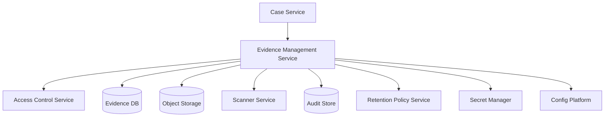
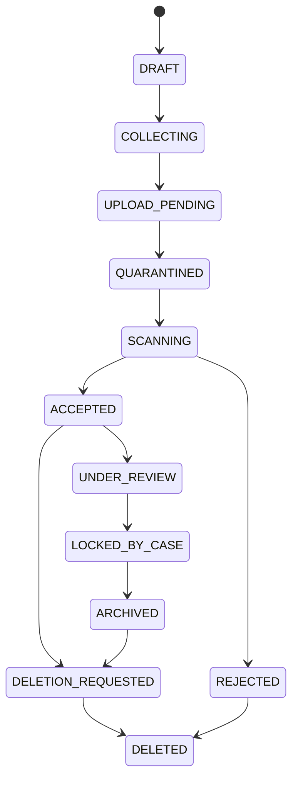
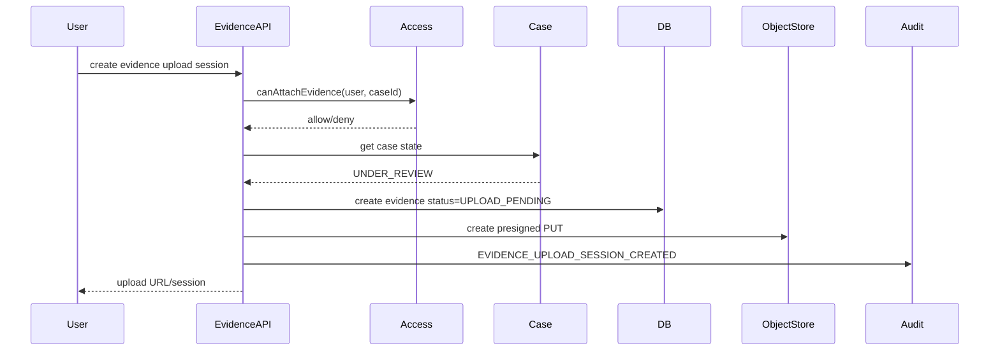
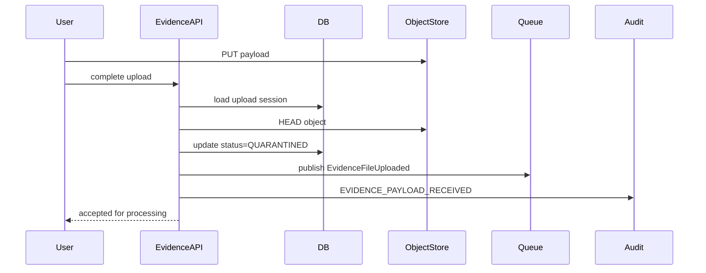
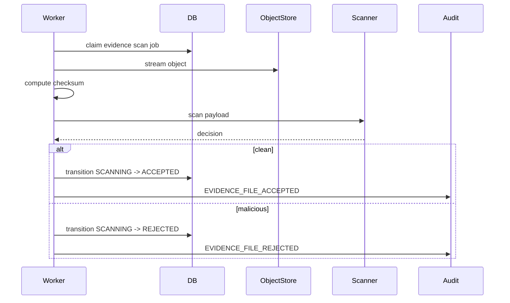

# Part 064 — Case Study: Evidence Management Service for Enforcement Lifecycle

> Evidence systems are not file upload systems.
>
> They are accountability systems that happen to store files.

Di part ini kita membangun case study konkret: **Evidence Management Service** untuk enforcement lifecycle.

Domain ini cocok karena memaksa semua konsep seri bertemu:

- file upload;
- state machine;
- object storage;
- metadata;
- retention;
- legal hold;
- chain of custody;
- secret/config;
- audit;
- access control;
- failure recovery;
- regulatory defensibility.

Kita tidak akan membuat aplikasi mainan. Kita akan mendesain service yang cukup serius untuk menjadi basis platform internal.

---

## 1. Domain Context

Bayangkan organisasi memiliki lifecycle enforcement:

```txt
Case created
-> evidence gathered
-> review
-> escalation
-> enforcement action
-> appeal
-> closure
-> retention/archive
```

Evidence bisa berupa:

- PDF;
- image;
- audio/video;
- screenshot;
- exported system report;
- email attachment;
- form submission;
- regulator letter;
- signed document;
- derived OCR text;
- redacted copy;
- analyst note attachment.

Core requirement:

```txt
Evidence must be collected, validated, protected, traceable, retained,
and accessible only under policy.
```

---

## 2. Bounded Context

Evidence Management Service owns:

- evidence file metadata;
- evidence lifecycle;
- evidence attachment to case;
- evidence retention status;
- legal hold flag;
- checksum/object version;
- chain of custody audit;
- derived evidence relationships.

It does not own:

- case lifecycle itself;
- user identity;
- global authorization model;
- object storage platform;
- malware scanner engine;
- KMS;
- secret manager;
- audit backend.



---

## 3. Domain Language

Use precise terms.

| Term | Meaning |
|---|---|
| Evidence Item | domain entity representing evidence in a case |
| Evidence File | binary payload associated with evidence item |
| Upload Session | temporary process for receiving payload |
| Evidence Artifact | immutable accepted payload or derived artifact |
| Chain of Custody | audit trail of evidence lifecycle/access |
| Legal Hold | domain/legal block on deletion |
| Retention Rule | policy governing minimum storage |
| Derived Artifact | OCR text, thumbnail, redacted copy |
| Evidence Package | export bundle for review/enforcement |

Avoid generic terms:

```txt
Attachment
Blob
File thing
Document row
```

unless the domain truly means those.

---

## 4. Aggregate Design

### 4.1 EvidenceItem Aggregate

```java
public final class EvidenceItem {
    private final EvidenceId id;
    private final CaseId caseId;
    private EvidenceStatus status;
    private EvidenceFileRef fileRef;
    private RetentionState retentionState;
    private LegalHold legalHold;
    private long version;

    public void attachUploadedFile(EvidenceFileRef ref) {
        requireStatus(EvidenceStatus.COLLECTING);
        if (!ref.isQuarantined()) {
            throw new IllegalArgumentException("Evidence file must be quarantined first");
        }
        this.fileRef = ref;
    }

    public void acceptFile(ScanDecision scanDecision, FileIntegrity integrity) {
        requireStatus(EvidenceStatus.COLLECTING);

        if (!scanDecision.isClean()) {
            throw new IllegalStateException("Cannot accept non-clean evidence file");
        }

        if (integrity == null || !integrity.isVerified()) {
            throw new IllegalStateException("Verified integrity is required");
        }

        this.status = EvidenceStatus.ACCEPTED;
    }

    public void requestDeletion(RetentionDecision decision) {
        if (!decision.deletable()) {
            throw new RetentionViolationException(decision.reasonCode());
        }
        this.status = EvidenceStatus.DELETION_REQUESTED;
    }

    private void requireStatus(EvidenceStatus expected) {
        if (this.status != expected) {
            throw new IllegalStateException("Expected " + expected + " but was " + status);
        }
    }
}
```

### 4.2 EvidenceStatus

```java
public enum EvidenceStatus {
    DRAFT,
    COLLECTING,
    UPLOAD_PENDING,
    QUARANTINED,
    SCANNING,
    ACCEPTED,
    REJECTED,
    UNDER_REVIEW,
    LOCKED_BY_CASE,
    ARCHIVED,
    DELETION_REQUESTED,
    DELETED
}
```

This is domain status. File storage lifecycle may be separate but correlated.

---

## 5. Lifecycle State Machine



Rules:

```txt
Only ACCEPTED evidence can be used in enforcement action.
Evidence attached to escalated case becomes LOCKED_BY_CASE.
LOCKED_BY_CASE cannot be deleted unless case/retention/legal policy allows.
REJECTED evidence cannot become ACCEPTED without new upload/scan decision.
DELETED is terminal.
```

---

## 6. Evidence File Model

```java
public record EvidenceFileRef(
    String fileId,
    String bucket,
    String objectKey,
    String objectVersion,
    String sha256,
    long sizeBytes,
    String detectedContentType,
    EvidenceFileState state
) {
    public boolean isQuarantined() {
        return state == EvidenceFileState.QUARANTINED;
    }
}
```

State:

```java
public enum EvidenceFileState {
    UPLOADING,
    UPLOADED,
    QUARANTINED,
    SCANNING,
    SCANNED_CLEAN,
    SCANNED_MALICIOUS,
    ACCEPTED,
    REJECTED,
    ARCHIVED,
    DELETED
}
```

Invariant:

```txt
EvidenceItem.ACCEPTED requires EvidenceFileState.ACCEPTED
and verified checksum + clean scan decision.
```

---

## 7. Metadata Schema

```sql
CREATE TABLE evidence_item (
    evidence_id TEXT PRIMARY KEY,
    case_id TEXT NOT NULL,
    tenant_id TEXT NOT NULL,

    status TEXT NOT NULL,
    evidence_type TEXT NOT NULL,

    file_id TEXT NULL,
    object_bucket TEXT NULL,
    object_key TEXT NULL,
    object_version TEXT NULL,

    original_filename_display TEXT NULL,
    detected_content_type TEXT NULL,
    size_bytes BIGINT NULL,
    sha256 TEXT NULL,

    scan_decision TEXT NULL,
    scan_policy_version TEXT NULL,
    scan_completed_at TIMESTAMPTZ NULL,

    retention_policy_version TEXT NULL,
    retention_until TIMESTAMPTZ NULL,
    legal_hold BOOLEAN NOT NULL DEFAULT FALSE,

    created_by TEXT NOT NULL,
    created_at TIMESTAMPTZ NOT NULL,
    updated_at TIMESTAMPTZ NOT NULL,
    version BIGINT NOT NULL
);
```

Constraints:

```sql
ALTER TABLE evidence_item
ADD CONSTRAINT evidence_status_check
CHECK (status IN (
  'DRAFT',
  'COLLECTING',
  'UPLOAD_PENDING',
  'QUARANTINED',
  'SCANNING',
  'ACCEPTED',
  'REJECTED',
  'UNDER_REVIEW',
  'LOCKED_BY_CASE',
  'ARCHIVED',
  'DELETION_REQUESTED',
  'DELETED'
));

ALTER TABLE evidence_item
ADD CONSTRAINT accepted_requires_integrity
CHECK (
  status <> 'ACCEPTED'
  OR (
    file_id IS NOT NULL
    AND object_key IS NOT NULL
    AND sha256 IS NOT NULL
    AND scan_decision = 'CLEAN'
  )
);
```

---

## 8. Upload Flow



Validation:

- case allows evidence attachment;
- actor has permission;
- tenant quota;
- file type policy;
- expected size policy;
- case not closed unless special permission;
- legal policy.

---

## 9. Upload Completion Flow



Do not synchronously call scanner in user request unless file size and SLA allow it. Async scan is more scalable.

---

## 10. Scan Flow



Idempotency:

```txt
Same scan event for same fileId + scannerRunId processed once.
Late scan result after deletion rejected.
Duplicate clean result does not create duplicate accepted event.
```

---

## 11. Case Lifecycle Integration

Evidence lifecycle depends on case lifecycle.

Case Service emits:

```txt
CASE_ESCALATED
CASE_CLOSED
CASE_REOPENED
CASE_LEGAL_HOLD_APPLIED
CASE_LEGAL_HOLD_REMOVED
```

Evidence reacts:

| Case Event | Evidence Reaction |
|---|---|
| `CASE_ESCALATED` | accepted evidence becomes locked |
| `CASE_CLOSED` | retention timer starts |
| `CASE_REOPENED` | retention state recalculated |
| `CASE_LEGAL_HOLD_APPLIED` | deletion blocked |
| `CASE_LEGAL_HOLD_REMOVED` | deletion eligibility recalculated |

Do not let Case Service directly update Evidence DB. Use event/command boundary.

---

## 12. Retention Model

```java
public record EvidenceRetentionPolicy(
    String policyVersion,
    Duration retainAfterCaseClosure,
    boolean legalHoldOverridesDeletion,
    boolean objectLockRequired
) {}
```

Decision:

```java
public RetentionDecision evaluate(EvidenceItem item, CaseSnapshot caseSnapshot) {
    if (item.legalHold().active() || caseSnapshot.legalHoldActive()) {
        return RetentionDecision.notDeletable("LEGAL_HOLD_ACTIVE", policyVersion);
    }

    if (!caseSnapshot.closed()) {
        return RetentionDecision.notDeletable("CASE_NOT_CLOSED", policyVersion);
    }

    Instant retentionUntil = caseSnapshot.closedAt().plus(retainAfterCaseClosure);

    if (Instant.now().isBefore(retentionUntil)) {
        return RetentionDecision.notDeletable("RETENTION_ACTIVE", policyVersion, retentionUntil);
    }

    return RetentionDecision.deletable("RETENTION_EXPIRED", policyVersion);
}
```

Invariant:

```txt
Evidence under active legal hold or retention cannot be physically deleted.
```

---

## 13. Access Control

Operations:

| Operation | Required Policy |
|---|---|
| create evidence | can attach evidence to case |
| view metadata | can view case evidence metadata |
| download payload | can access evidence payload |
| delete evidence | can request evidence deletion + retention allows |
| apply legal hold | legal/compliance authority |
| export package | enforcement package permission |
| override rejection | high-risk admin authority |

Separate metadata and payload access.

```java
public interface EvidenceAccessPolicy {
    Decision canCreateEvidence(UserContext actor, CaseId caseId);
    Decision canReadMetadata(UserContext actor, EvidenceId evidenceId);
    Decision canDownloadPayload(UserContext actor, EvidenceId evidenceId);
    Decision canRequestDeletion(UserContext actor, EvidenceId evidenceId);
    Decision canApplyLegalHold(UserContext actor, CaseId caseId);
}
```

---

## 14. Audit Events

Domain audit events:

```txt
EVIDENCE_CREATED
EVIDENCE_UPLOAD_SESSION_CREATED
EVIDENCE_PAYLOAD_RECEIVED
EVIDENCE_CHECKSUM_VERIFIED
EVIDENCE_SCAN_REQUESTED
EVIDENCE_SCAN_COMPLETED
EVIDENCE_FILE_ACCEPTED
EVIDENCE_FILE_REJECTED
EVIDENCE_METADATA_VIEWED
EVIDENCE_DOWNLOAD_GRANTED
EVIDENCE_DOWNLOAD_DENIED
EVIDENCE_LOCKED_BY_CASE
EVIDENCE_LEGAL_HOLD_APPLIED
EVIDENCE_LEGAL_HOLD_REMOVED
EVIDENCE_DELETION_REQUESTED
EVIDENCE_DELETION_BLOCKED
EVIDENCE_DELETED
EVIDENCE_PACKAGE_EXPORTED
```

Example:

```json
{
  "eventType": "EVIDENCE_FILE_ACCEPTED",
  "actorId": "service:evidence-worker",
  "actorType": "SERVICE",
  "resourceType": "EVIDENCE_ITEM",
  "resourceId": "EVD-01JZ",
  "resourceVersion": "sha256:abc...",
  "decision": "SUCCESS",
  "reasonCode": "SCAN_CLEAN",
  "policyVersion": "scan-policy-v5",
  "correlationId": "req-abc",
  "occurredAt": "2026-07-05T10:00:00Z"
}
```

---

## 15. Evidence Package Export

Export package is dangerous. It aggregates sensitive artifacts.

Flow:

```txt
1. User requests package export for case.
2. Authorization checks export permission.
3. Case/evidence snapshot captured.
4. Files collected by fileId, not arbitrary key.
5. Package manifest generated.
6. Checksums included.
7. Package encrypted if required.
8. Short-lived download grant issued.
9. Audit event emitted.
10. Package expires/archived by policy.
```

Manifest:

```json
{
  "caseId": "CASE-123",
  "packageId": "PKG-01JZ",
  "generatedAt": "2026-07-05T10:00:00Z",
  "policyVersion": "package-export-v2",
  "files": [
    {
      "evidenceId": "EVD-1",
      "fileId": "FILE-1",
      "sha256": "abc...",
      "sizeBytes": 1000
    }
  ]
}
```

Do not export hidden/internal files accidentally.

---

## 16. Configuration

Example:

```yaml
evidence:
  upload:
    max-size-mb: 500
    presigned-upload-ttl: 5m
    allowed-content-types:
      - application/pdf
      - image/jpeg
      - image/png
      - video/mp4
  scan:
    required: true
    timeout: 60s
    reject-on-timeout: false
  retention:
    default-years-after-case-closure: 7
    legal-hold-enabled: true
  download:
    presigned-download-ttl: 2m
    require-fresh-authz: true
```

Production invariants:

```txt
scan.required must be true.
download.presigned-download-ttl <= 5m.
retention.legal-hold-enabled must be true.
upload.max-size-mb <= platform maximum.
```

---

## 17. Secrets

Secrets:

| Secret | Use |
|---|---|
| DB credential | Evidence DB |
| scanner API token | scanner service |
| audit sink credential | audit backend |
| object storage capability | preferably workload identity |
| package encryption key | KMS envelope encryption |

Rotation strategy:

- DB: dual credential/rolling restart;
- scanner token: dual token if provider supports;
- audit credential: rolling restart;
- KMS: key version/envelope encryption;
- object storage: workload identity preferred.

---

## 18. Failure Modes

### 18.1 Object Uploaded, DB Update Fails

Expected:

- object remains in temp/quarantine prefix;
- upload session not accepted;
- reconciliation detects orphan;
- user can retry complete;
- no evidence accepted without metadata.

### 18.2 DB Updated, Event Publish Fails

Expected:

- transactional outbox contains event;
- publisher retries;
- audit outbox monitored;
- scan eventually runs.

### 18.3 Scanner Down

Expected:

- evidence remains QUARANTINED/SCANNING;
- not downloadable as accepted evidence;
- queue age alert fires;
- no bypass unless approved policy.

### 18.4 Case Closed During Upload

Expected:

- completion checks current case state;
- if attachment no longer allowed, evidence rejected/blocked;
- audit event records reason.

### 18.5 Legal Hold Applied During Deletion

Expected:

- deletion transaction evaluates latest hold state;
- deletion blocked;
- object not removed;
- audit event recorded.

### 18.6 Duplicate Download Request

Expected:

- each grant audited;
- URL short-lived;
- authorization checked each issuance;
- no cached allow beyond policy.

---

## 19. Reconciliation Jobs

| Job | Frequency | Purpose |
|---|---|---|
| stale upload session | 15m | expire abandoned uploads |
| orphan quarantine object | hourly | detect object without metadata |
| metadata object verifier | daily/hourly by risk | verify object exists/checksum |
| scan backlog reconciler | 5m | requeue stuck scan |
| retention eligibility | daily | find deletable evidence |
| legal hold consistency | daily | sync case/evidence hold |
| audit outbox publisher | continuous | publish audit events |
| package cleanup | hourly | remove expired export packages |

Each job emits report.

---

## 20. Observability

Metrics:

```txt
evidence_created_total
evidence_upload_session_created_total
evidence_scan_pending_age_seconds
evidence_accepted_total
evidence_rejected_total{reason}
evidence_download_granted_total
evidence_download_denied_total{reason}
evidence_deletion_blocked_total{reason}
evidence_retention_mismatch_total
evidence_legal_hold_active_total
evidence_package_exported_total
```

Alerts:

```txt
accepted evidence without checksum > 0
scan pending p95 > SLO
legal hold deletion blocked spike
metadata-object mismatch > 0
audit outbox oldest age > threshold
evidence package cleanup failures
```

Dashboards:

- evidence lifecycle funnel;
- scan latency;
- download grant/deny;
- retention/legal hold;
- object storage health;
- audit backlog;
- reconciliation.

---

## 21. Java Service Skeleton

```java
@RestController
@RequestMapping("/cases/{caseId}/evidence")
public final class EvidenceController {
    private final EvidenceApplicationService evidenceService;

    @PostMapping("/upload-sessions")
    public UploadSessionResponse createUploadSession(
        @PathVariable String caseId,
        @RequestBody CreateEvidenceUploadRequest request,
        Principal principal
    ) {
        return evidenceService.createUploadSession(
            new CaseId(caseId),
            request,
            UserContext.from(principal)
        );
    }

    @PostMapping("/{evidenceId}/download-grants")
    public DownloadGrantResponse createDownloadGrant(
        @PathVariable String caseId,
        @PathVariable String evidenceId,
        Principal principal
    ) {
        return evidenceService.createDownloadGrant(
            new CaseId(caseId),
            new EvidenceId(evidenceId),
            UserContext.from(principal)
        );
    }
}
```

Application service:

```java
public final class EvidenceApplicationService {
    private final EvidenceRepository repository;
    private final EvidenceAccessPolicy accessPolicy;
    private final CaseClient caseClient;
    private final ObjectStoragePort storage;
    private final AuditService audit;

    public UploadSessionResponse createUploadSession(
        CaseId caseId,
        CreateEvidenceUploadRequest request,
        UserContext actor
    ) {
        CaseSnapshot caseSnapshot = caseClient.getCase(caseId);

        Decision decision = accessPolicy.canCreateEvidence(actor, caseId);
        if (decision.denied()) {
            audit.record(EvidenceAudit.uploadSessionDenied(actor, caseId, decision));
            throw new AccessDeniedException("Not allowed to attach evidence");
        }

        EvidenceItem item = EvidenceItem.create(caseId, actor.actorId(), request.evidenceType());

        repository.save(item);

        PresignedCapability upload = storage.createPresignedUpload(
            PresignUploadRequest.forEvidence(item.id(), request.expectedSizeBytes())
        );

        audit.record(EvidenceAudit.uploadSessionCreated(actor, item, decision));

        return UploadSessionResponse.from(item, upload);
    }
}
```

---

## 22. Testing Matrix

### Domain Tests

```txt
[ ] cannot accept evidence without clean scan
[ ] cannot delete under legal hold
[ ] rejected evidence cannot become accepted
[ ] locked evidence cannot be modified by normal actor
```

### Integration Tests

```txt
[ ] upload completion verifies object exists
[ ] scan event transitions to accepted
[ ] duplicate scan event idempotent
[ ] download grant requires payload permission
[ ] deletion blocked by retention
```

### Failure Tests

```txt
[ ] object upload succeeds but DB update fails
[ ] scanner timeout leaves evidence not accepted
[ ] audit sink down persists outbox
[ ] secret missing fails readiness
[ ] invalid config fails startup
```

### Security Tests

```txt
[ ] path traversal filename ignored
[ ] content-type spoof detected
[ ] presigned URL not logged
[ ] unauthorized download denied and audited
[ ] metadata access does not imply payload access
```

---

## 23. ADRs for This Case Study

```txt
ADR-001 Evidence identity and object key strategy
ADR-002 Evidence lifecycle state machine
ADR-003 Direct upload with presigned URL
ADR-004 Scanner and quarantine model
ADR-005 Evidence retention and legal hold
ADR-006 Evidence download grant and authorization
ADR-007 Audit event model for chain of custody
ADR-008 Evidence package export model
ADR-009 Reconciliation strategy
ADR-010 Secret/config delivery
```

---

## 24. Operational Runbooks

Minimum runbooks:

```txt
RUNBOOK evidence scan backlog
RUNBOOK upload session stuck
RUNBOOK object metadata mismatch
RUNBOOK unauthorized download investigation
RUNBOOK legal hold deletion blocked
RUNBOOK evidence package export failure
RUNBOOK evidence DB credential rotation
RUNBOOK object storage access denied
RUNBOOK audit outbox backlog
```

---

## 25. Key Takeaways

1. **Evidence management is domain lifecycle, not generic upload.**
2. **Evidence must separate file payload, metadata, lifecycle, retention, access, and audit.**
3. **Accepted evidence requires clean scan, verified checksum, metadata, and audit evidence.**
4. **Case lifecycle affects evidence mutability and deletion.**
5. **Legal hold and retention must be evaluated before physical delete.**
6. **Download grant is a material authorization decision and must be audited.**
7. **Evidence package export is high-risk aggregation and needs its own controls.**
8. **Worker processing must be idempotent and reconciliation-aware.**
9. **Config and secret settings must preserve compliance invariants.**
10. **Forensic readiness is a core feature of evidence systems.**

Next, we use the same architectural discipline for a different problem: **Multi-Environment Configuration Platform**.

---

## References

- OWASP File Upload Cheat Sheet: https://cheatsheetseries.owasp.org/cheatsheets/File_Upload_Cheat_Sheet.html
- Spring MultipartFile Javadoc: https://docs.spring.io/spring-framework/docs/current/javadoc-api/org/springframework/web/multipart/MultipartFile.html
- Amazon S3 Presigned URLs: https://docs.aws.amazon.com/AmazonS3/latest/userguide/using-presigned-url.html
- Amazon S3 Object Lock: https://docs.aws.amazon.com/AmazonS3/latest/userguide/object-lock.html
- Kubernetes ConfigMaps: https://kubernetes.io/docs/concepts/configuration/configmap/
- Kubernetes Secrets: https://kubernetes.io/docs/concepts/configuration/secret/
- Spring Boot Externalized Configuration: https://docs.spring.io/spring-boot/reference/features/external-config.html
