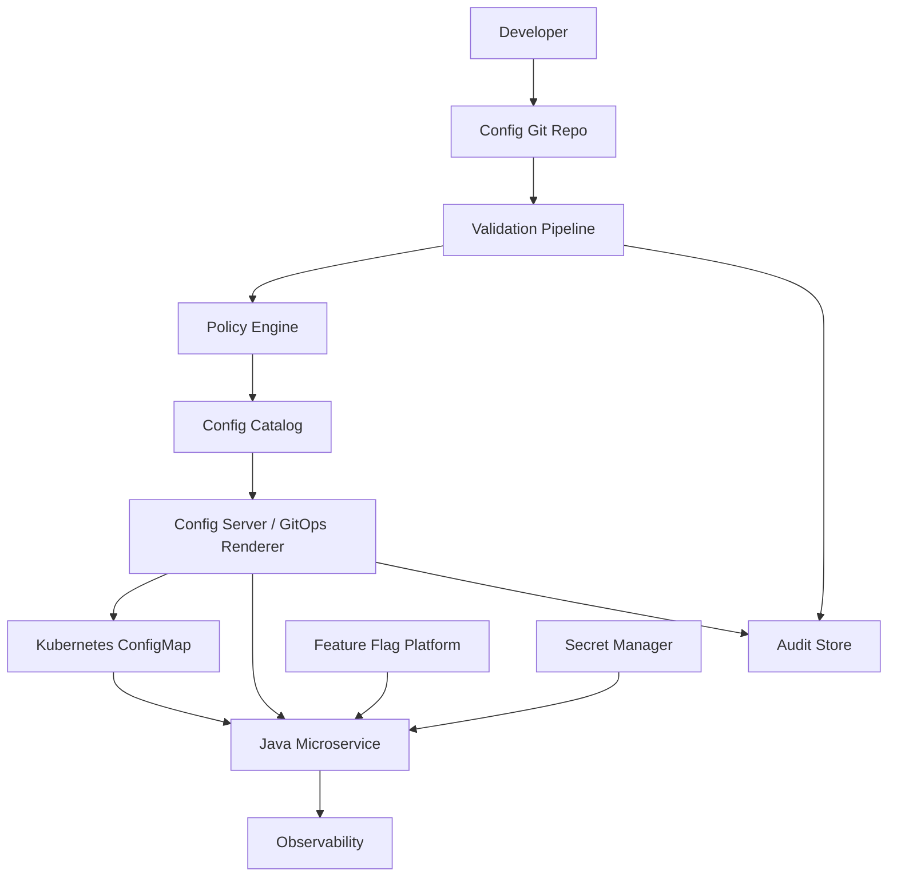
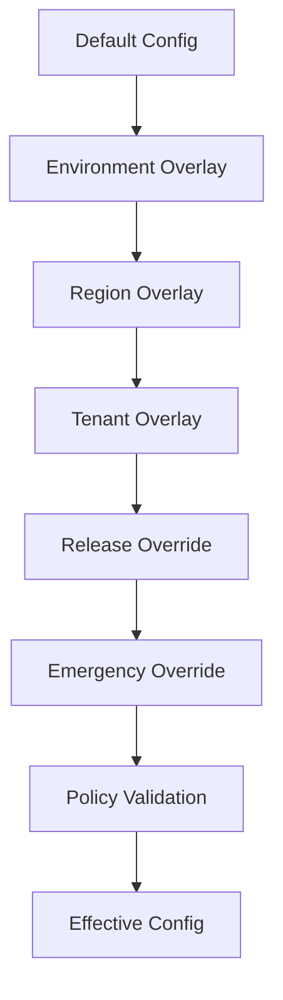
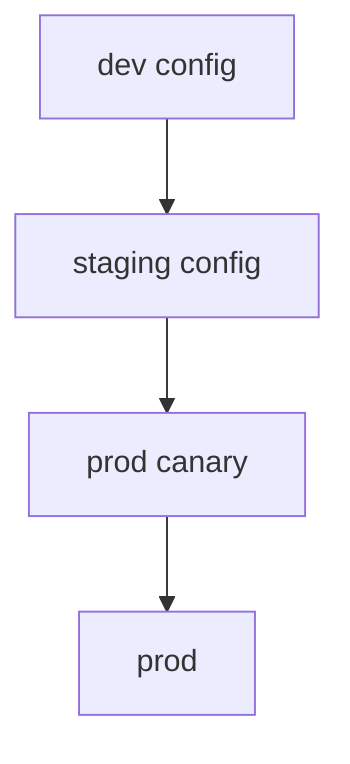
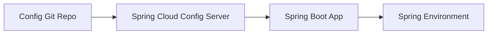
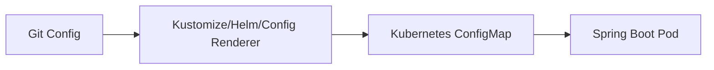

# Part 065 — Case Study: Multi-Environment Configuration Platform

> A configuration platform is not a key-value store.
>
> It is a controlled path for changing runtime behavior.

Dalam part ini kita membangun case study kedua: **Multi-Environment Configuration Platform** untuk Java microservices.

Masalah yang ingin diselesaikan:

```txt
Bagaimana service Java bisa menerima konfigurasi yang berbeda per environment,
tenant, region, dan release stage tanpa membuat behavior production liar,
tidak tervalidasi, sulit diaudit, dan sulit rollback?
```

Kita tidak sedang membuat sistem “bisa baca YAML”. Itu sudah basic.

Kita membangun platform yang:

- punya ownership;
- punya schema;
- punya promotion;
- punya validation;
- punya audit;
- punya drift detection;
- punya safe reload;
- tahu perbedaan config vs secret vs feature flag;
- bisa dipakai oleh banyak Java microservices;
- tetap sederhana untuk developer.

---

## 1. Problem Statement

Microservices biasanya punya config seperti:

```yaml
server:
  port: 8080

evidence:
  upload:
    max-size-mb: 100
  scan:
    required: true
    timeout: 30s
  download:
    presigned-url-ttl: 2m
```

Di awal, config tinggal di `application.yml`.

Lalu tumbuh:

```txt
dev
staging
prod
prod-ap-southeast
prod-eu
tenant-a
tenant-b
canary
emergency override
feature flag
```

Tanpa platform, config berubah menjadi campuran:

- environment variable;
- Helm values;
- ConfigMap manual;
- Spring profile;
- command-line override;
- CI variable;
- secret manager;
- feature flag;
- database table;
- admin screen;
- emergency patch.

Masalahnya bukan banyak source. Masalahnya adalah **effective behavior tidak bisa dijelaskan**.

---

## 2. Platform Goals

Configuration platform harus memberi jawaban untuk:

| Question | Platform Responsibility |
|---|---|
| What is the config value? | effective config resolution |
| Where did it come from? | provenance |
| Who owns it? | ownership catalog |
| Is it valid? | schema validation |
| Is it safe for prod? | policy validation |
| When did it change? | audit |
| Which pods use it? | runtime version visibility |
| Can it reload? | reload classification |
| How to rollback? | promotion and versioning |
| Is it secret? | secret classification |
| Is it feature flag? | flag separation |

---

## 3. Architecture Overview



Ada dua delivery model yang umum:

1. **Pull from Config Server**  
   App mengambil externalized config dari Spring Cloud Config atau platform config API.

2. **Push/Sync to Kubernetes ConfigMap**  
   GitOps me-render config ke ConfigMap, lalu app consume via env/volume/config tree.

Keduanya valid. Platform mature sering memakai kombinasi.

---

## 4. Configuration Taxonomy

Jangan perlakukan semua config sama.

| Category | Example | Owner | Reload? |
|---|---|---|---|
| Build default | default timeout | service team | no |
| Environment endpoint | DB host, broker endpoint | platform | no |
| Operational tuning | pool size, retry count | service + SRE | maybe |
| Domain policy | max upload size, retention years | domain + compliance | usually no |
| Security policy | allowed issuer, scan required | security + service | no |
| Feature flag | new upload flow enabled | product/release owner | yes |
| Tenant config | per-tenant quota | domain/platform | maybe |
| Emergency override | reduce concurrency | SRE | yes, time-bound |

Important distinction:

```txt
Feature flags are for controlling code paths.
Configuration is for defining environment and policy behavior.
Secrets are capabilities.
```

If you put secret into config, you create leakage risk.
If you use config as feature flag, you create governance confusion.
If you use feature flag as policy store, you create compliance risk.

---

## 5. Repository Layout

A scalable config repo can look like this:

```txt
config-repo/
  services/
    evidence-service/
      schema/
        evidence-config.schema.yaml
      defaults/
        application.yaml
      env/
        dev.yaml
        staging.yaml
        prod.yaml
      regions/
        ap-southeast-1.yaml
        eu-west-1.yaml
      tenants/
        tenant-a.yaml
        tenant-b.yaml
      policies/
        prod-policy.yaml
      README.md
  platform/
    global/
      logging.yaml
      telemetry.yaml
    policies/
      forbidden-prod-values.yaml
  catalog/
    config-ownership.yaml
```

Config resolution order must be explicit.

Example:

```txt
defaults
-> environment
-> region
-> tenant
-> release/canary override
-> emergency override
```

But do not allow all levels to override all keys.

---

## 6. Effective Config Resolution

Resolution should be deterministic.



Example:

```yaml
# defaults/application.yaml
evidence:
  upload:
    max-size-mb: 50
  scan:
    required: true
```

```yaml
# env/prod.yaml
evidence:
  upload:
    max-size-mb: 100
```

```yaml
# tenants/tenant-a.yaml
evidence:
  upload:
    max-size-mb: 200
```

Policy may still reject:

```txt
tenant-a max-size-mb=200 is invalid if prod max allowed is 100.
```

Final config is not just merge. It is merge + validation + policy + provenance.

---

## 7. Config Schema

Schema is the contract.

```yaml
prefix: evidence
owner: evidence-service
schemaVersion: 3
properties:
  upload.max-size-mb:
    type: integer
    min: 1
    max: 500
    owner: evidence-platform
    reloadable: false
    sensitivity: internal
    risk: medium
  scan.required:
    type: boolean
    owner: security-platform
    reloadable: false
    prodInvariant: mustBeTrue
    risk: high
  scan.timeout:
    type: duration
    min: 5s
    max: 5m
    owner: evidence-platform
    reloadable: true
    risk: medium
  download.presigned-url-ttl:
    type: duration
    min: 10s
    max: 5m
    owner: evidence-platform
    reloadable: true
    risk: high
```

In Java:

```java
@ConfigurationProperties(prefix = "evidence")
@Validated
public record EvidenceProperties(
    @Valid Upload upload,
    @Valid Scan scan,
    @Valid Download download
) {
    public record Upload(
        @Min(1) @Max(500) long maxSizeMb
    ) {}

    public record Scan(
        boolean required,
        @NotNull Duration timeout
    ) {}

    public record Download(
        @NotNull Duration presignedUrlTtl
    ) {}
}
```

Cross-field validation:

```java
public EvidenceProperties {
    if (!scan.required()) {
        throw new IllegalArgumentException("scan.required must not be false");
    }

    if (download.presignedUrlTtl().compareTo(Duration.ofMinutes(5)) > 0) {
        throw new IllegalArgumentException("download.presignedUrlTtl exceeds maximum");
    }
}
```

---

## 8. Validation Pipeline


### 8.1 Syntax Check

- YAML valid;
- no duplicate keys;
- no unresolved placeholders;
- no unknown file path;
- no tabs/format issue if standard.

### 8.2 Schema Validation

- type;
- range;
- required fields;
- enum;
- duration format;
- regex;
- cross-field invariant.

### 8.3 Policy Check

Examples:

```txt
prod.evidence.scan.required must be true
prod.download.presigned-url-ttl <= 5m
prod.upload.max-size-mb <= 500
prod.debug.enabled must be false
prod.actuator.env.exposed must be false
```

### 8.4 Semantic Diff

Instead of only Git diff:

```txt
evidence.scan.required: true -> false
Risk: high
Environment: prod
Approval required: security-platform
```

### 8.5 Integration Test

Start service with rendered effective config:

```txt
java -jar evidence-service.jar --spring.config.location=rendered-prod.yaml
```

Expected:

- starts;
- config binds;
- startup invariants pass;
- readiness would be safe;
- no secret in config.

---

## 9. Promotion Model

Avoid editing prod config directly.

Use promotion:

```txt
dev -> staging -> prod-canary -> prod
```



Promotion does not mean byte-identical config. Environment values differ. But the change intent should be promoted.

Example:

```txt
Change intent:
increase scan.timeout from 30s to 60s

dev: 60s
staging: 60s
prod-canary: 60s
prod: 60s
```

Promotion record:

```json
{
  "changeId": "CFG-2026-07-05-001",
  "service": "evidence-service",
  "key": "evidence.scan.timeout",
  "oldValue": "30s",
  "newValue": "60s",
  "environments": ["dev", "staging", "prod-canary", "prod"],
  "approvers": ["evidence-platform", "sre"],
  "risk": "medium"
}
```

---

## 10. Delivery Pattern A: Spring Cloud Config

Spring Cloud Config provides server-side and client-side support for externalized configuration in distributed systems. Config Server can use Git backend, and clients map remote properties into Spring `Environment`/`PropertySource`.

Architecture:



Config Server advantages:

- central API;
- Git backend;
- Spring-native;
- encryption/decryption support;
- consistent client model;
- good for multi-app config.

Risks:

- Config Server becomes runtime dependency;
- availability and caching matter;
- security of config endpoint;
- config freshness behavior must be understood;
- bootstrap ordering can surprise teams;
- secret handling must be deliberate.

Recommended:

```txt
Use Config Server for non-secret external config.
Keep secrets in secret manager.
Validate typed config in app.
Log config version/provenance.
Do not dynamically refresh startup-bound config casually.
```

---

## 11. Delivery Pattern B: Kubernetes ConfigMap + GitOps



Pros:

- cluster-native;
- GitOps-friendly;
- simple;
- no runtime config server dependency;
- works well with config tree/mounted files.

Cons:

- ConfigMap update semantics must be understood;
- env var does not update in running container;
- volume update is eventually consistent;
- `subPath` update caveat;
- rollout trigger needed for startup-bound config;
- large ConfigMaps are not ideal.

Recommended:

```txt
For critical config, prefer immutable/versioned ConfigMap + rollout.
For reloadable config, use mounted file/watcher only if app can reload safely.
```

---

## 12. Runtime Reload Model

Classify each key:

| Reload Class | Meaning | Example |
|---|---|---|
| startup-bound | requires restart | bucket, DB URL, issuer |
| reload-safe | can apply at runtime | timeout, rate limit |
| reload-dangerous | possible but risky | storage prefix, auth mode |
| flag-like | use feature flag platform | enable new flow |
| forbidden-runtime | must not change without deploy/review | retention semantics |

Runtime reload algorithm:

```txt
1. detect config version change
2. load candidate config
3. validate schema
4. validate policy
5. build affected components
6. swap atomically
7. emit event/metric
8. keep rollback path
```

Never mutate half the runtime.

---

## 13. Feature Flag Separation

Feature flag platform should handle:

- rollout percentage;
- targeting;
- experiments;
- kill switch;
- release toggles;
- short-lived behavioral switches.

OpenFeature provides a vendor-neutral API/specification for feature flagging, allowing applications to use a common interface while providers vary.

Example flag:

```txt
evidence.new-upload-flow.enabled
```

Not feature flag:

```txt
evidence.retention.years
evidence.scan.required
security.allowed-issuer
db.password
```

Feature flag lifecycle:

```txt
proposed -> active -> fully rolled out -> removed
```

Every flag should have owner and expiry date.

---

## 14. Config Catalog

Example catalog:

```yaml
service: evidence-service
config:
  evidence.upload.max-size-mb:
    owner: evidence-platform
    risk: medium
    reloadable: false
    environments:
      prod:
        max: 500
    approval:
      - evidence-platform
  evidence.scan.required:
    owner: security-platform
    risk: high
    reloadable: false
    prodInvariant: true
    approval:
      - security-platform
      - evidence-platform
  evidence.download.presigned-url-ttl:
    owner: evidence-platform
    risk: high
    reloadable: true
    max: 5m
```

Platform can use catalog for:

- validation;
- semantic diff;
- approval routing;
- documentation;
- dashboards;
- audit.

---

## 15. Drift Detection

Drift means live config differs from desired config.

Sources of drift:

- manual `kubectl edit`;
- emergency patch not committed;
- stale ConfigMap;
- failed GitOps reconciliation;
- pod old version;
- runtime reload failed;
- config server cache issue.

Drift detector:

```txt
desired config version from Git
live ConfigMap version
pod effective config version
runtime-reported config version
```

Metric:

```txt
config_drift_detected_total{service,environment,source}
config_runtime_mixed_version_pods{service}
```

Alert:

```txt
prod live config != Git desired for > 10 minutes
```

---

## 16. Java Runtime Effective Config Endpoint

Expose safe endpoint internally:

```http
GET /internal/config/effective
```

Response:

```json
{
  "service": "evidence-service",
  "environment": "prod",
  "configVersion": "git:8d21a9f",
  "schemaVersion": 3,
  "profiles": ["prod"],
  "reloadableGroups": {
    "scan-timeout": "v12",
    "download-policy": "v7"
  },
  "sensitiveValues": "redacted"
}
```

Do not expose raw values publicly. For some environments, expose only version/provenance.

---

## 17. Audit Events

Config platform events:

```txt
CONFIG_CHANGE_PROPOSED
CONFIG_VALIDATION_PASSED
CONFIG_VALIDATION_FAILED
CONFIG_POLICY_BLOCKED
CONFIG_APPROVED
CONFIG_MERGED
CONFIG_PROMOTED
CONFIG_DEPLOYED
CONFIG_RUNTIME_RELOADED
CONFIG_RUNTIME_RELOAD_FAILED
CONFIG_DRIFT_DETECTED
CONFIG_ROLLED_BACK
```

Example:

```json
{
  "eventType": "CONFIG_POLICY_BLOCKED",
  "service": "evidence-service",
  "environment": "prod",
  "key": "evidence.scan.required",
  "attemptedValueClass": "boolean:false",
  "decision": "DENY",
  "reasonCode": "PROD_SCAN_MUST_BE_ENABLED",
  "actorId": "user-123",
  "policyVersion": "config-policy-v9"
}
```

Do not store secret values or sensitive raw config.

---

## 18. Rollback

Rollback config safely.

Types:

| Rollback | Meaning |
|---|---|
| Git revert | desired config returns previous version |
| ConfigMap rollback | cluster object returns previous data |
| app rollout rollback | pods restart with previous config |
| runtime reload rollback | app swaps back to previous snapshot |
| feature flag rollback | flag disabled |

Rollback must know if config is compatible with current app version.

Example issue:

```txt
App v2 requires config key X.
Rollback config to v1 removes X.
App v2 fails startup.
```

Solution:

- config/app compatibility matrix;
- schema version;
- staged rollout;
- backward compatible config evolution;
- canary.

---

## 19. Multi-Tenant Config

Tenant config is dangerous because it can become per-tenant code path.

Rules:

- tenant overrides must be bounded by global policy;
- tenant config should be schema-validated;
- tenant config owner explicit;
- high-risk tenant config audited;
- avoid unbounded custom behavior;
- cache with version and TTL;
- propagate tenant config version in logs/traces.

Example:

```yaml
tenantOverrides:
  tenant-a:
    evidence.upload.max-size-mb: 200
    evidence.download.presigned-url-ttl: 2m
```

Policy:

```txt
tenant upload max <= platform max
download TTL <= 5m
scan.required cannot be overridden
retention.years cannot be lower than regulatory minimum
```

---

## 20. Failure Modes

| Failure | Expected Behavior |
|---|---|
| config source unavailable at startup | fail-fast or use approved bundled default |
| invalid config merged | CI blocks |
| invalid config reaches app | startup validation fails, pod not ready |
| runtime reload invalid | old config remains active |
| ConfigMap patched manually | GitOps reverts/drift alert |
| mixed config versions | dashboard/alert until convergence |
| config contains secret | scanner/policy blocks |
| feature flag provider down | safe fallback |
| config rollback incompatible | canary catches before full prod |

---

## 21. Observability

Metrics:

```txt
config_validation_success_total
config_validation_failure_total{reason}
config_policy_blocked_total{reason}
config_deploy_success_total{environment}
config_deploy_failure_total{environment,reason}
config_current_version_info{service,environment,version}
config_runtime_reload_success_total{group}
config_runtime_reload_failure_total{group,reason}
config_drift_detected_total{source}
config_mixed_version_pods{service}
```

Alerts:

```txt
prod config validation failure
prod unsafe config blocked
live config drift > threshold
mixed critical config version > rollout window
runtime reload failure
feature flag provider unavailable with unsafe fallback
```

---

## 22. Testing

### 22.1 Schema Tests

```txt
Given prod config
When schema validation runs
Then all required keys exist
And types/ranges are valid
```

### 22.2 Policy Tests

```txt
Given prod config scan.required=false
Then policy blocks with reason PROD_SCAN_MUST_BE_ENABLED
```

### 22.3 App Startup Tests

```txt
Start app with rendered prod config.
Expect ApplicationContext loads and typed properties validate.
```

### 22.4 Reload Tests

```txt
Given reloadable scan.timeout changes
When reload triggered
Then new timeout applied atomically
And old config restored if validation fails
```

### 22.5 Drift Tests

```txt
Patch live ConfigMap manually.
Expect drift detector alert.
Expect GitOps revert if configured.
```

---

## 23. Platform API

Optional internal API:

```http
GET /configs/{service}/{environment}/effective
POST /configs/{service}/{environment}/validate
POST /configs/{service}/{environment}/promote
GET /configs/{service}/{environment}/diff?from=a&to=b
```

But be careful: adding an API can bypass GitOps review if not governed.

For many teams, config repo + CI + GitOps is simpler and safer.

---

## 24. Anti-Patterns

### 24.1 One Giant YAML

Hard to own, review, validate, and diff.

### 24.2 Everything Reloadable

If everything can change at runtime, nothing is stable.

### 24.3 Config Without Owner

Nobody can approve or explain behavior.

### 24.4 ConfigMap as Secret Store

Base64 and ConfigMap are not secret management.

### 24.5 Manual Prod Patch as Normal Workflow

Emergency patch should be rare, audited, and backfilled to Git.

### 24.6 Feature Flags That Never Die

Stale flags become hidden branches and security risk.

---

## 25. Production Readiness Checklist

```txt
[ ] Config taxonomy defined
[ ] Config ownership catalog exists
[ ] Schema validation implemented
[ ] Prod policy validation implemented
[ ] Config does not contain secrets
[ ] Promotion path defined
[ ] Semantic diff available
[ ] Approval routing based on risk/owner
[ ] Runtime config version observable
[ ] Drift detection implemented
[ ] Reload classification defined per key
[ ] Rollback tested
[ ] Feature flags separated from config
[ ] High-risk config audited
```

---

## 26. Key Takeaways

1. **Configuration platform is a runtime behavior control plane.**
2. **Effective config must be deterministic, validated, governed, and observable.**
3. **Schema is the contract between config producers and Java services.**
4. **Policy validation is required because syntactically valid config can still be unsafe.**
5. **Spring Cloud Config and Kubernetes ConfigMap are delivery mechanisms, not governance by themselves.**
6. **Runtime reload must be opt-in per key/group and must be atomic.**
7. **Feature flags are not a replacement for policy/config management.**
8. **Drift detection is mandatory in GitOps environments.**
9. **Config rollback must consider app/config compatibility.**
10. **A mature platform can explain what config is active, who changed it, why, and how to rollback.**

Next, we build the third case study: **Zero-Downtime Secret Rotation Platform**.

---

## References

- Spring Boot Externalized Configuration: https://docs.spring.io/spring-boot/reference/features/external-config.html
- Spring Cloud Config Reference: https://docs.spring.io/spring-cloud-config/reference/index.html
- Spring Cloud Config Git Backend: https://docs.spring.io/spring-cloud-config/reference/server/environment-repository/git-backend.html
- Kubernetes ConfigMaps: https://kubernetes.io/docs/concepts/configuration/configmap/
- Kubernetes Secrets: https://kubernetes.io/docs/concepts/configuration/secret/
- OpenFeature: https://openfeature.dev/
- OpenFeature Specification: https://github.com/open-feature/spec
