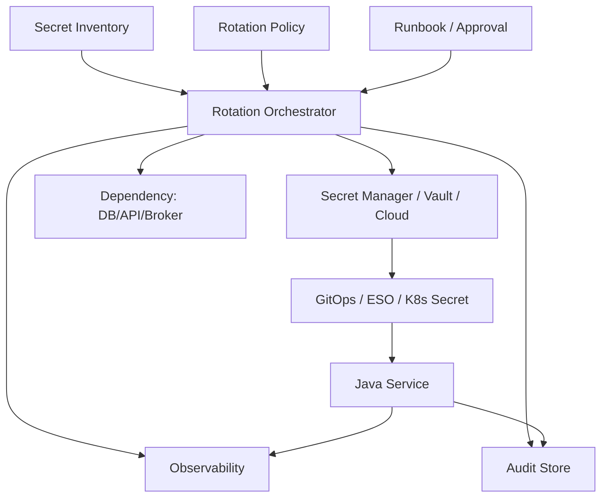
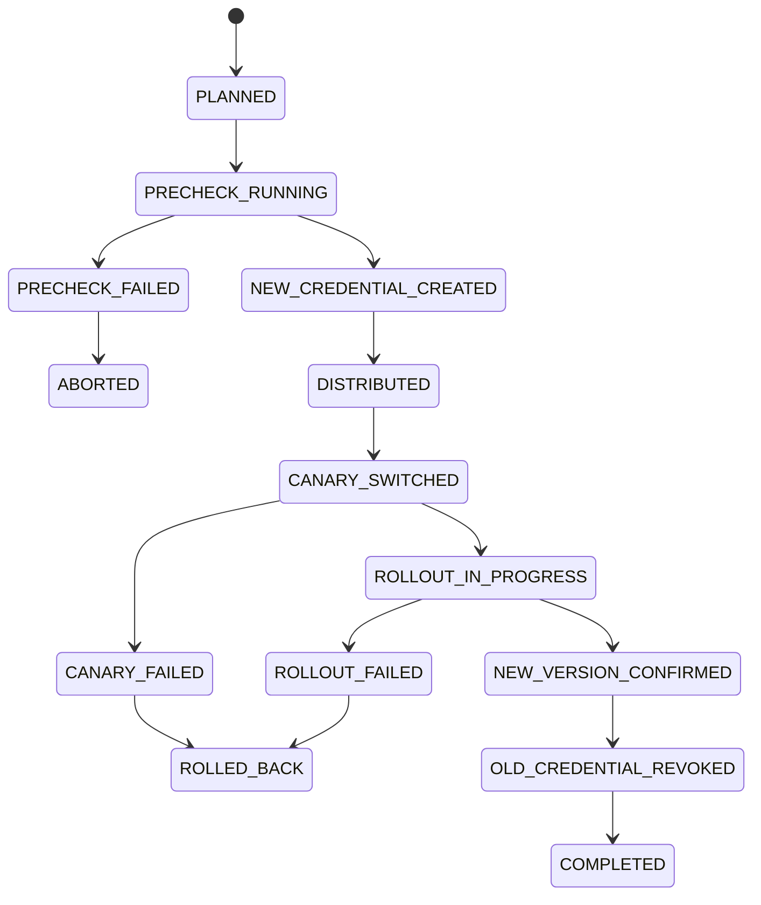
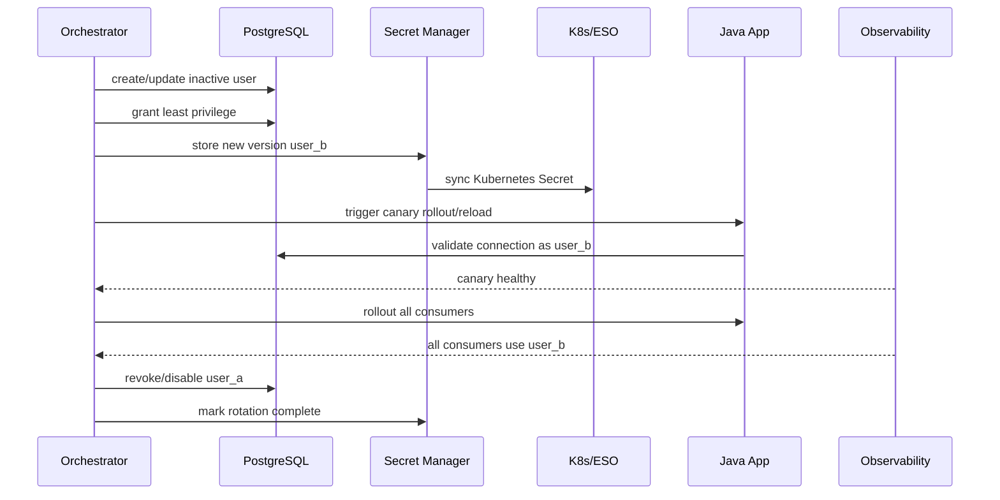

# Part 066 — Case Study: Zero-Downtime Secret Rotation Platform

> Secret rotation is easy until consumers exist.
>
> Then it becomes distributed systems engineering.

This case study designs a **Zero-Downtime Secret Rotation Platform** for Java microservices.

The platform goal:

```txt
Rotate credentials across services without global downtime,
without leaking secret values, without revoking old credentials too early,
and with evidence that rotation completed safely.
```

This is a platform because rotation requires coordination between:

- secret authority;
- runtime delivery;
- application consumer;
- dependency;
- deployment;
- observability;
- audit;
- rollback.

Updating a secret value is not enough.

---

## 1. Scope

Secret types:

| Secret Type | Example |
|---|---|
| database credentials | PostgreSQL app user |
| external API tokens | scanner/vendor API |
| message broker credentials | Kafka/SASL, RabbitMQ |
| TLS certificate/key | service identity |
| signing keys | JWT/private signing key |
| encryption keys | data encryption key reference |
| object storage keys | static access key if unavoidable |

Out of scope:

- human password rotation;
- end-user credential recovery;
- full PKI platform;
- hardware security module deep dive.

---

## 2. Architecture Overview



Core platform services:

1. **Secret Inventory** — what secrets exist, owners, consumers, rotation policy.
2. **Rotation Orchestrator** — state machine for rotation.
3. **Secret Adapter** — Vault/AWS/Azure/GCP/Kubernetes/GitOps integration.
4. **Dependency Adapter** — DB/API/broker credential management.
5. **Consumer Readiness Collector** — verifies apps adopted new version.
6. **Audit/Evidence Store** — records rotation lifecycle.
7. **Runbook and Approval Workflow** — human governance where needed.

---

## 3. Secret Inventory

Inventory is the source of operational truth.

```yaml
secretId: evidence-db
type: database-credential
environment: prod
owner: evidence-platform
securityOwner: security-platform
dependency:
  type: postgresql
  instance: prod-postgres-main
  database: evidence
  role: evidence_app
source:
  provider: aws-secrets-manager
  path: prod/evidence/db
delivery:
  mechanism: external-secrets-operator
  kubernetesSecret: evidence-db
consumers:
  - service: evidence-api
    namespace: evidence
    reloadStrategy: rolling-restart
    readinessCheck: db-connectivity
  - service: evidence-worker
    namespace: evidence
    reloadStrategy: rolling-restart
    readinessCheck: db-connectivity
rotation:
  strategy: alternating-users
  frequency: 30d
  overlapWindow: 2h
  minimumRollbackWindow: 1h
observability:
  secretMetricName: evidence-db
  authFailureMetric: dependency_auth_failure_total
```

Without inventory, platform cannot answer:

```txt
Who uses this secret?
Can they reload?
When can old credential be revoked?
Who approves rotation?
What breaks if rotation fails?
```

---

## 4. Rotation State Machine



Important:

```txt
COMPLETED is not when the new secret is written.
COMPLETED is after consumers have switched and old credential is revoked.
```

---

## 5. Rotation Strategies

### 5.1 Single Credential In-Place

```txt
Change password for same user.
```

Risk:

- old connections may fail;
- consumers must update almost atomically;
- hard to rollback;
- not ideal for high availability.

Use for:

- low-risk non-critical systems;
- dependencies that do not support dual credential;
- maintenance window.

### 5.2 Alternating Users

```txt
user_a active -> create/update user_b -> consumers switch -> revoke/update user_a later
```

AWS Secrets Manager documents alternating users rotation for database credentials as a high-availability strategy because one user remains current while the other is being updated.

Use for:

- databases;
- high availability;
- Java services with connection pools.

### 5.3 Dynamic Lease

Vault database secrets engine can generate database credentials dynamically. Vault creates leases for dynamic secrets; after TTL expires, Vault can revoke the data and the consumer can no longer be certain it is valid.

Use for:

- short-lived DB credentials;
- strong audit;
- reduced static secret footprint.

Consumer requirements:

- lease renewal/refresh;
- connection max lifetime < TTL;
- readiness near expiry;
- jittered refresh.

### 5.4 Versioned Keyring

For signing/encryption:

```txt
publish new key -> use new key -> keep old verification/decryption key -> retire old
```

Use for:

- JWT signing keys;
- encryption key versioning;
- certificate trust bundles.

---

## 6. Precheck Phase

Before rotation:

```txt
[ ] owner approved
[ ] consumers discovered
[ ] dependency reachable
[ ] current credential works
[ ] new credential can be created
[ ] delivery mechanism healthy
[ ] GitOps/ESO healthy
[ ] service rollout healthy
[ ] observability dashboard ready
[ ] rollback path valid
[ ] old credential not scheduled for immediate revoke
```

Automated precheck examples:

```java
public record RotationPrecheckResult(
    boolean dependencyReachable,
    boolean secretManagerReachable,
    boolean gitOpsHealthy,
    boolean consumersHealthy,
    boolean rollbackPossible,
    List<String> blockers
) {}
```

Do not start rotation if rollback is impossible.

---

## 7. Database Rotation: Alternating Users

For PostgreSQL app credential:

```txt
evidence_app_a
evidence_app_b
```

Only one is current in secret source.

Flow:



PostgreSQL permissions:

```sql
GRANT CONNECT ON DATABASE evidence TO evidence_app_b;
GRANT USAGE ON SCHEMA evidence TO evidence_app_b;
GRANT SELECT, INSERT, UPDATE, DELETE ON ALL TABLES IN SCHEMA evidence TO evidence_app_b;
ALTER DEFAULT PRIVILEGES IN SCHEMA evidence
GRANT SELECT, INSERT, UPDATE, DELETE ON TABLES TO evidence_app_b;
```

Do not grant superuser.

---

## 8. Java Consumer Pattern

### 8.1 Rolling Restart Strategy

Simplest robust model:

```txt
Secret updated -> Deployment annotation changed -> new pods start -> readiness validates -> old pods drain.
```

Works well when:

- old and new credentials overlap;
- deployment can roll without downtime;
- readiness checks dependency auth;
- PDB/replica count support availability.

Deployment annotation:

```yaml
spec:
  template:
    metadata:
      annotations:
        secret.platform.example.com/evidence-db-version: "v42"
```

Spring Boot app reads secret at startup.

### 8.2 Runtime Reload Strategy

More advanced:

```txt
Secret file changes -> app validates -> rebuilds client/pool -> swaps atomically -> drains old.
```

Use only if proven.

Java abstraction:

```java
public interface RotatableClient<T> {
    String currentCredentialVersion();
    void rotateTo(VersionedSecret<T> secret);
    boolean validate(VersionedSecret<T> secret);
}
```

DB example:

```java
public final class DataSourceRotator implements RotatableClient<DbCredential> {
    private final AtomicReference<HikariDataSource> current = new AtomicReference<>();

    @Override
    public void rotateTo(VersionedSecret<DbCredential> secret) {
        HikariDataSource next = buildDataSource(secret.value());
        validateConnection(next);

        HikariDataSource old = current.getAndSet(next);

        closeGracefully(old);
        emitRotationMetric(secret.version());
    }
}
```

Caution:

```txt
Runtime DataSource rotation is complex. Rolling restart with dual credential is often safer.
```

---

## 9. HikariCP Considerations

Java services commonly use HikariCP.

Rotation implications:

| Concern | Recommendation |
|---|---|
| old connections live long | set `maxLifetime` below credential validity window |
| new credential invalid | readiness connectivity check catches |
| revoke too early | observe no old DB sessions before revoke |
| pool stuck | rolling restart may be safer |
| auth retry storm | bounded retry/circuit breaker |

Config example:

```yaml
spring:
  datasource:
    hikari:
      maximum-pool-size: 20
      minimum-idle: 5
      connection-timeout: 30000
      idle-timeout: 600000
      max-lifetime: 1800000
```

For dynamic secrets:

```txt
hikari.maxLifetime < secret TTL minus safety margin
```

---

## 10. Vault Dynamic Secret Integration

Vault database secrets engine generates credentials dynamically based on roles. Leases define TTL and renewability.

Platform pattern:

```txt
service authenticates to Vault
requests database credential
uses credential until refresh threshold
renews or requests new credential
ensures connection lifetime respects TTL
fails readiness before expiry
```

Lease policy:

```txt
refresh at 60% of TTL + jitter
critical at TTL - 10 minutes
not ready at TTL - 5 minutes if no replacement
```

Metrics:

```txt
vault_lease_seconds_until_expiry{secret}
vault_lease_renew_success_total{secret}
vault_lease_renew_failure_total{secret}
secret_refresh_failure_total{secret}
```

Failure rule:

```txt
Do not process irreversible work if required credential is near expiry
and replacement cannot be obtained.
```

---

## 11. External Secrets Operator Flow

For Kubernetes delivery:

```txt
Secret Manager -> External Secrets Operator -> Kubernetes Secret -> Pod
```

Rotation caveat:

```txt
Kubernetes Secret update does not guarantee Java client updates.
```

Platform must define:

- refresh interval;
- rollout trigger;
- consumer reload capability;
- version annotation;
- drift detection;
- old/new version visibility.

Example ExternalSecret target annotation:

```yaml
target:
  name: evidence-db
  template:
    metadata:
      annotations:
        secret.platform.example.com/rotation-id: "{{ .rotationId }}"
```

A separate reloader/controller may trigger Deployment rollout when Secret changes. Use carefully and intentionally.

---

## 12. Canary Rotation

Do not rotate all consumers blindly.

Flow:

```txt
1. update secret source
2. sync to cluster
3. rollout one canary pod/deployment slice
4. verify readiness and dependency auth
5. compare error/latency
6. rollout remaining pods
7. verify old credential no longer used
8. revoke old
```

Canary metrics:

```txt
dependency_auth_failure_total{pod=canary}
db_connection_success_total{credential_version=v42}
http_server_errors_total{pod=canary}
readiness_status
```

Canary must exercise real dependency auth, not only JVM startup.

---

## 13. Proof of Consumer Switch

How does orchestrator know consumers switched?

Evidence sources:

| Source | Signal |
|---|---|
| app metric | `secret_current_version_info` |
| readiness check | DB auth success |
| DB audit | login user/version |
| pod annotation | desired version |
| deployment status | rollout complete |
| secret manager access log | new version read |
| old credential usage metric | old user no longer active |

Do not rely only on Deployment rollout complete. The app may still fail to use new credential if config binding is wrong.

---

## 14. Old Credential Revocation

Revoke only after proof.

Criteria:

```txt
[ ] all consumers healthy
[ ] all required pods report new version
[ ] dependency sees new credential auth success
[ ] old credential usage = 0 for observation window
[ ] rollback window satisfied
[ ] owner approval if high-risk
```

Revocation examples:

- disable DB user;
- revoke API token;
- delete old secret version;
- revoke Vault lease;
- remove old public key after token expiry;
- remove old certificate trust after overlap.

---

## 15. Rollback

Rollback before old revoke:

```txt
1. pause rollout
2. restore old secret version/current label
3. rollout/reload consumers back
4. verify old credential works
5. investigate new credential
```

Rollback after old revoke is harder:

```txt
1. recreate old credential or create third credential
2. distribute emergency version
3. force rollout
4. verify
```

That is why old revoke is final step.

---

## 16. Orchestrator Data Model

```sql
CREATE TABLE secret_rotation (
    rotation_id TEXT PRIMARY KEY,
    secret_id TEXT NOT NULL,
    environment TEXT NOT NULL,
    strategy TEXT NOT NULL,
    status TEXT NOT NULL,
    old_version TEXT NOT NULL,
    new_version TEXT NULL,
    started_at TIMESTAMPTZ NOT NULL,
    completed_at TIMESTAMPTZ NULL,
    owner TEXT NOT NULL,
    failure_reason TEXT NULL
);

CREATE TABLE secret_rotation_consumer (
    rotation_id TEXT NOT NULL,
    service TEXT NOT NULL,
    namespace TEXT NOT NULL,
    expected_version TEXT NOT NULL,
    observed_version TEXT NULL,
    readiness_status TEXT NULL,
    last_observed_at TIMESTAMPTZ NULL,
    PRIMARY KEY (rotation_id, service, namespace)
);
```

Status values:

```txt
PLANNED
PRECHECK_RUNNING
PRECHECK_FAILED
NEW_CREDENTIAL_CREATED
DISTRIBUTED
CANARY_SWITCHED
ROLLOUT_IN_PROGRESS
NEW_VERSION_CONFIRMED
OLD_CREDENTIAL_REVOKED
COMPLETED
ROLLED_BACK
ABORTED
```

---

## 17. Audit Events

```txt
SECRET_ROTATION_PLANNED
SECRET_ROTATION_PRECHECK_PASSED
SECRET_ROTATION_PRECHECK_FAILED
SECRET_NEW_CREDENTIAL_CREATED
SECRET_VERSION_DISTRIBUTED
SECRET_CONSUMER_CANARY_SWITCHED
SECRET_CONSUMER_ROLLOUT_COMPLETED
SECRET_NEW_VERSION_CONFIRMED
SECRET_OLD_CREDENTIAL_REVOKED
SECRET_ROTATION_COMPLETED
SECRET_ROTATION_ROLLED_BACK
```

Example:

```json
{
  "eventType": "SECRET_OLD_CREDENTIAL_REVOKED",
  "secretId": "evidence-db",
  "rotationId": "ROT-20260705-001",
  "oldVersion": "v41",
  "newVersion": "v42",
  "actorId": "rotation-orchestrator",
  "decision": "SUCCESS",
  "reasonCode": "NEW_VERSION_CONFIRMED",
  "occurredAt": "2026-07-05T10:00:00Z"
}
```

Never include secret value.

---

## 18. Observability

Metrics:

```txt
secret_rotation_started_total{secret,type}
secret_rotation_completed_total{secret,type}
secret_rotation_failed_total{secret,reason}
secret_rotation_duration_seconds{secret,type}
secret_current_version_info{service,secret,version}
secret_old_version_usage_total{secret}
secret_seconds_until_expiry{secret}
secret_refresh_failure_total{secret,reason}
dependency_auth_failure_total{dependency,reason}
```

Alerts:

```txt
rotation stuck in state > threshold
new credential auth failure
old credential still used after cutover window
secret expires soon and refresh failing
mixed secret versions beyond rollout window
rotation failed after old credential created
```

Dashboard:

- active rotations;
- state distribution;
- consumer adoption;
- old credential usage;
- auth failures;
- expiry risk;
- rotation duration;
- revoke status.

---

## 19. Security Controls

### 19.1 Least Privilege

Rotation orchestrator needs specific capabilities:

- create/update inactive DB user;
- write secret version;
- trigger rollout;
- read health metrics;
- revoke old credential.

It should not have broad admin access.

### 19.2 Separation of Duties

For high-risk secrets:

- requester;
- approver;
- orchestrator;
- dependency admin;
- security reviewer.

Do not require human approval for every low-risk automated rotation if that makes rotation rare. Automate with policy.

### 19.3 Secret Value Handling

Orchestrator should avoid logging secret values.

If it must handle plaintext:

- keep in memory only;
- never write to logs;
- no debug dump;
- restricted process identity;
- audit access;
- prefer secret manager generated credential.

---

## 20. Java Service Contract for Platform

Services must implement a rotation readiness contract.

Minimum:

```http
GET /internal/runtime/secrets
```

Response:

```json
{
  "service": "evidence-api",
  "secrets": [
    {
      "name": "evidence-db",
      "version": "v42",
      "loadedAt": "2026-07-05T10:00:00Z",
      "status": "ACTIVE"
    }
  ]
}
```

And readiness should validate critical dependency auth.

Do not expose this publicly.

---

## 21. GitOps Integration

If using GitOps:

- secret source update may happen outside Git;
- ExternalSecret manifest stays same;
- Kubernetes Secret changes via controller;
- Deployment rollout must be triggered.

Options:

1. annotation bump by orchestrator through Git PR;
2. annotation patch by controlled deployment controller;
3. reloader watches Secret and restarts pods;
4. runtime reload with no rollout.

Git PR is most auditable but slower.
Controller patch is faster but must be governed.
Reloader is simple but can cause surprise restarts if uncontrolled.

---

## 22. Testing Matrix

### Unit Tests

```txt
[ ] rotation state machine transitions valid
[ ] cannot revoke before new version confirmed
[ ] rollback allowed before revoke
[ ] rollback blocked/changed after revoke
```

### Integration Tests

```txt
[ ] create alternate DB user
[ ] sync new secret
[ ] app can connect with new credential
[ ] old credential remains valid during overlap
[ ] revoke old causes no auth failure
```

### Failure Tests

```txt
[ ] new credential invalid
[ ] secret manager unavailable
[ ] ESO sync delayed
[ ] canary fails readiness
[ ] rollout stuck
[ ] old credential still used
[ ] revoke fails
```

### Security Tests

```txt
[ ] secret value not logged
[ ] orchestrator cannot access unrelated secret
[ ] old credential revoked
[ ] audit event contains no secret value
```

---

## 23. Runbook

### 23.1 Planned Rotation

```txt
1. Open rotation record.
2. Run precheck.
3. Create new credential/version.
4. Distribute to secret manager.
5. Sync delivery layer.
6. Rollout canary.
7. Verify new credential.
8. Rollout all consumers.
9. Observe old credential usage.
10. Revoke old credential.
11. Mark complete with evidence.
```

### 23.2 Emergency Rotation

Used when credential leaked.

Differences:

- compress approval;
- assume old credential compromised;
- create new credential quickly;
- force rollout;
- revoke old as soon as safe;
- investigate access logs;
- preserve incident evidence.

Emergency rotation may accept controlled degradation if compromise risk is severe.

---

## 24. Anti-Patterns

### 24.1 Rotate by Replacing Kubernetes Secret Only

App may not reload.

### 24.2 Revoke Old First

Causes outage.

### 24.3 No Consumer Inventory

You do not know who breaks.

### 24.4 No Version Metrics

You cannot prove adoption.

### 24.5 Shared Credential

All services must coordinate rotation; blast radius huge.

### 24.6 Static Cloud Access Keys Everywhere

Prefer workload identity.

### 24.7 Manual Rotation Without Audit

No defensibility.

---

## 25. Production Readiness Checklist

```txt
[ ] Secret inventory complete
[ ] Owner and security owner assigned
[ ] Consumer list known
[ ] Reload/rollout strategy per consumer
[ ] Rotation strategy per secret type
[ ] Overlap window defined
[ ] Rollback path tested
[ ] Readiness checks dependency auth
[ ] Version metrics exposed
[ ] Old credential usage observable
[ ] Audit events emitted
[ ] Secret value never logged
[ ] Least privilege enforced
[ ] Emergency rotation runbook tested
```

---

## 26. Key Takeaways

1. **Secret rotation is distributed state transition.**
2. **Inventory is required before automation.**
3. **Alternating users is the safest database rotation model for high availability.**
4. **Vault dynamic secrets require lease-aware consumers.**
5. **Kubernetes Secret update does not imply Java client update.**
6. **Rolling restart with overlap is often safer than runtime hot reload.**
7. **Old credential revoke is the final step, not the first.**
8. **Consumer adoption must be proven through metrics, readiness, and dependency audit.**
9. **Orchestrator must record evidence and avoid handling/logging plaintext unnecessarily.**
10. **Emergency rotation is a separate runbook with different risk trade-offs.**

Next, we translate the whole series into production checklists: design review, security review, and operational readiness.

---

## References

- AWS Secrets Manager Rotation Strategies: https://docs.aws.amazon.com/secretsmanager/latest/userguide/rotation-strategy.html
- AWS Secrets Manager Alternating Users Rotation: https://docs.aws.amazon.com/secretsmanager/latest/userguide/tutorials_rotation-alternating.html
- AWS Secrets Manager Managed Rotation: https://docs.aws.amazon.com/secretsmanager/latest/userguide/rotate-secrets_managed.html
- HashiCorp Vault Lease, Renew, and Revoke: https://developer.hashicorp.com/vault/docs/concepts/lease
- HashiCorp Vault Database Secrets Engine: https://developer.hashicorp.com/vault/docs/secrets/databases
- Kubernetes Secrets: https://kubernetes.io/docs/concepts/configuration/secret/
- External Secrets Operator: https://external-secrets.io/
- HikariCP Configuration: https://github.com/brettwooldridge/HikariCP
