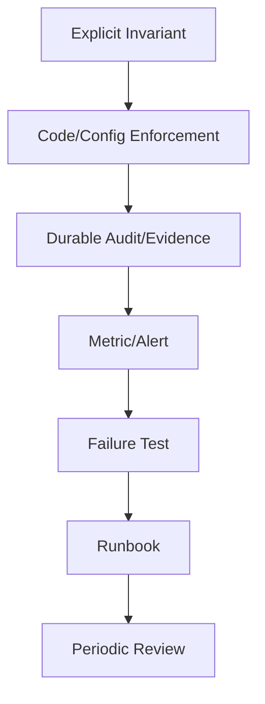

# Part 068 — Anti-Patterns and War Stories

> A senior engineer is not someone who never made mistakes.
>
> A senior engineer is someone who can smell an incident while it is still a design proposal.

This part collects anti-patterns and war stories for Java microservices dealing with file, state, configuration, and secret management.

These stories are intentionally realistic composites. They are not about blaming individuals. They show how small design shortcuts become production incidents when combined with retries, concurrency, Kubernetes rollout behavior, object storage semantics, config precedence, secret rotation, and human operations.

For each story, we analyze:

```txt
Symptom
Root cause
Failure chain
Missing invariant
How to prevent
How to detect
How to recover
```

---

## 1. Anti-Pattern: “It Is Just a File Upload”

### Symptom

Upload endpoint works in testing. In production:

- memory spikes;
- pods restart;
- some uploads stuck forever;
- support sees files users cannot download;
- object storage cost increases;
- scanner backlog grows.

### Root Cause

The team treated upload as simple request/response.

```java
byte[] bytes = multipartFile.getBytes();
s3.putObject(bucket, originalFilename, bytes);
db.insert(fileMetadata);
```

Problems:

- entire file loaded into heap;
- client filename used as storage key;
- no upload session;
- no quarantine;
- no checksum;
- DB insert after object write can fail;
- no cleanup for orphan object;
- no lifecycle state machine.

### Failure Chain

```txt
1. User uploads large file.
2. App loads full payload into heap.
3. GC pressure increases.
4. Pod restarts during request.
5. Object write may have partially succeeded or client retries.
6. DB metadata inconsistent.
7. Cleanup job does not exist.
8. Support cannot explain file state.
```

### Missing Invariant

```txt
No accepted file without durable metadata, verified checksum, and valid lifecycle state.
```

### Prevention

- stream upload;
- size limit;
- server-generated file ID;
- upload session;
- quarantine state;
- checksum;
- transactional metadata/outbox;
- reconciliation.

### Detection

Metrics:

```txt
file_upload_failed_total{reason}
file_upload_active_sessions
file_upload_stale_sessions_total
file_orphan_object_total
jvm_memory_used_bytes
pod_restart_total
```

### Recovery

- identify orphan objects;
- compare metadata and object inventory;
- expire stale sessions;
- reprocess valid objects if possible;
- add lifecycle states before new upload volume.

---

## 2. Anti-Pattern: Client Filename as Storage Path

### Symptom

Security test uploads file named:

```txt
../../../../tmp/evil.pdf
```

or:

```txt
CASE-123/private-report.pdf
```

Files overwrite or collide. Some object keys expose PII.

### Root Cause

Original filename was used as filesystem path/object key.

### Failure Chain

```txt
1. Client controls filename.
2. Service normalizes poorly or not at all.
3. Path traversal or object key collision becomes possible.
4. Logs and object inventory expose sensitive names.
5. Download header can be abused if filename not sanitized.
```

### Missing Invariant

```txt
Client-controlled filename must never determine physical storage location.
```

### Prevention

- generate storage key server-side;
- sanitize display filename;
- reject control characters;
- use `Content-Disposition` safely;
- never trust `MultipartFile#getOriginalFilename()` as path authority.

### Detection

- object key scan for `..`, slashes, PII patterns;
- security tests;
- log scan;
- file metadata review.

### Recovery

- migrate object keys;
- patch API;
- invalidate exposed URLs;
- review logs/object inventory for sensitive path exposure.

---

## 3. Anti-Pattern: “Accepted” Before Scan Completes

### Symptom

A malicious file is downloaded by internal user before scanner flags it.

### Root Cause

Upload completion marked file as `ACCEPTED`. Scanner was asynchronous but lifecycle did not represent untrusted states.

### Failure Chain

```txt
1. User uploads file.
2. API marks status=ACCEPTED.
3. Async scanner later detects malware.
4. Download was already allowed.
5. Audit shows valid download grant because status was accepted.
```

### Missing Invariant

```txt
Only cleanly scanned and integrity-verified files can become ACCEPTED.
```

### Prevention

Use states:

```txt
UPLOADING -> UPLOADED -> QUARANTINED -> SCANNING -> ACCEPTED/REJECTED
```

Block download before `ACCEPTED`.

### Detection

```txt
download_granted_total for status != ACCEPTED should be zero
accepted_without_scan_total should be zero
scan_completed_after_download_total should be investigated
```

### Recovery

- revoke download grants where possible;
- identify access events;
- notify security/compliance;
- quarantine affected files;
- fix lifecycle transition.

---

## 4. Anti-Pattern: Metadata and Object Storage Are “Eventually Someone Else’s Problem”

### Symptom

- DB says file exists, object storage returns 404.
- Object storage contains thousands of unreferenced objects.
- Retention report cannot determine whether objects should be deleted.

### Root Cause

No consistency model between metadata DB and object storage.

### Failure Chain

```txt
1. Object write succeeds.
2. DB commit fails.
3. Retry creates another object.
4. No object tagging/metadata owner.
5. No reconciliation job.
6. Storage lifecycle deletes something metadata still references.
```

### Missing Invariant

```txt
Metadata-payload divergence must be detected and repaired or explicitly resolved.
```

### Prevention

- temp/quarantine prefix;
- DB status `UPLOADING` before object write;
- idempotency key;
- object tags;
- reconciliation;
- lifecycle policy only for temporary areas;
- no storage lifecycle delete for regulated accepted files without domain policy alignment.

### Detection

```txt
metadata_without_object_total
object_without_metadata_total
checksum_mismatch_total
orphan_object_bytes_total
```

### Recovery

- object inventory scan;
- metadata query;
- classify mismatch by lifecycle;
- repair metadata or delete orphan safely;
- audit repair.

---

## 5. Anti-Pattern: Cache Used as Authorization Truth

### Symptom

User permission is revoked, but user can still download files for several minutes.

### Root Cause

Authorization decision cached as allow with long TTL. Download grant endpoint trusts cache.

### Failure Chain

```txt
1. User has access.
2. Access decision cached for 30 minutes.
3. Permission revoked due to case reassignment.
4. User requests download.
5. Cache returns allow.
6. Service issues presigned URL.
```

### Missing Invariant

```txt
Security-critical actions must not rely on stale allow decision beyond acceptable risk window.
```

### Prevention

- shorter TTL for authorization cache;
- event-driven invalidation;
- source-of-truth check for high-risk actions;
- cache version based on permission version;
- deny cache failures conservatively for sensitive access.

### Detection

```txt
download_granted_after_permission_revoked_total
authorization_cache_stale_decision_total
authorization_forced_source_check_total
```

### Recovery

- revoke outstanding grants if possible;
- shorten TTL;
- invalidate cache;
- audit affected downloads.

---

## 6. Anti-Pattern: ConfigMap as Secret Store

### Symptom

Security scanner finds API token in ConfigMap YAML committed to Git.

### Root Cause

Team thought Kubernetes ConfigMap is acceptable because the repo is private and values are base64 somewhere else.

### Failure Chain

```txt
1. Developer adds api.token to application.yaml.
2. Helm renders it into ConfigMap.
3. Git stores plaintext.
4. ConfigMap is readable by broader RBAC than Secret.
5. Token appears in app config dump.
6. Token must be rotated as compromised.
```

### Missing Invariant

```txt
Secret material must not enter non-secret configuration path.
```

### Prevention

- config schema sensitivity classification;
- secret scan in PR;
- policy block keys like token/password/privateKey in ConfigMap;
- secret manager or encrypted GitOps pattern;
- typed separation between config and secret.

### Detection

- Git secret scanning;
- rendered manifest scanning;
- Kubernetes policy;
- actuator/config dump review.

### Recovery

- rotate token;
- purge/limit exposed logs/artifacts where possible;
- move to secret manager;
- add policy guardrail.

---

## 7. Anti-Pattern: Runtime Reload Everything

### Symptom

A production config reload changes object storage prefix. Some pods write to old prefix, some to new prefix. Reconciliation starts reporting missing objects.

### Root Cause

All config keys were marked reloadable because dynamic config was considered “advanced”.

### Failure Chain

```txt
1. ConfigMap updated.
2. Watcher triggers runtime refresh.
3. Existing beans keep old storage client/prefix.
4. New operations use mixed config.
5. Metadata and object keys diverge.
6. Rollback unclear.
```

### Missing Invariant

```txt
Only reload-safe config may change at runtime; storage boundary config is startup-bound unless explicitly designed otherwise.
```

### Prevention

- classify config reloadability;
- atomic config snapshot;
- validate candidate config;
- rebuild affected components safely;
- prefer rollout for startup-bound config;
- block dangerous runtime reload.

### Detection

```txt
config_runtime_reload_failure_total
config_current_version_info by pod
metadata_payload_mismatch_total
mixed_config_version_pods
```

### Recovery

- freeze writes if divergence severe;
- choose canonical prefix;
- reconcile objects/metadata;
- redeploy with stable config;
- update reload classification.

---

## 8. Anti-Pattern: Secret Rotated, App Not Rotated

### Symptom

Database password rotated successfully in secret manager. One hour later, Java services start failing DB connections.

### Root Cause

Kubernetes Secret updated, but app consumed password via env var. Running pods did not receive new value. Connection pool continued using old credential.

### Failure Chain

```txt
1. Secret manager creates new password.
2. External Secrets Operator syncs Kubernetes Secret.
3. Running pod env var unchanged.
4. Old DB password revoked.
5. New DB connections fail.
6. Readiness fails across rollout.
```

### Missing Invariant

```txt
Secret delivery, Java consumer refresh, dependency validity, and old credential revoke must be coordinated.
```

### Prevention

- dual credential overlap;
- rolling restart after secret update;
- readiness DB check;
- old credential usage metric;
- revoke only after adoption proof;
- secret rotation runbook.

### Detection

```txt
secret_current_version_info
old_credential_usage_total
dependency_auth_failure_total
secret_rotation_stuck_state
```

### Recovery

- re-enable old credential if possible;
- force rollout to new secret;
- verify DB auth;
- revoke old only after stable.

---

## 9. Anti-Pattern: Secret Manager as Magic Shield

### Symptom

Secret is stored in Vault, but appears in logs and incident ticket screenshots.

### Root Cause

Team assumed secret manager solves leakage. App logged config object and exception messages containing secret.

### Failure Chain

```txt
1. App retrieves secret from Vault.
2. Secret bound into config object.
3. Startup log prints config object.
4. Failure exception includes JDBC URL with password.
5. Logs sent to central backend.
6. Screenshot copied to ticket.
```

### Missing Invariant

```txt
Secret value must never appear in logs, metrics, traces, errors, dumps, or audit payload.
```

### Prevention

- secret wrapper redacts `toString()`;
- no full config object logging;
- JDBC URL without embedded password;
- log redaction;
- actuator restrictions;
- leakage tests.

### Detection

- log scanning;
- CI tests;
- secret scanner on observability export;
- manual incident drill.

### Recovery

- rotate secret;
- restrict/purge logs where possible;
- audit access to logs;
- patch redaction;
- add regression test.

---

## 10. Anti-Pattern: Audit as Best-Effort Log

### Symptom

A user disputes file deletion. The system shows file is deleted but there is no reliable record of who deleted it or why.

### Root Cause

Audit was implemented as application log line after deletion, not durable audit event.

### Failure Chain

```txt
1. Delete request authorized.
2. Object deleted.
3. App tries to log audit line.
4. Log backend unavailable or log sampled/dropped.
5. No durable audit evidence.
6. Forensic reconstruction impossible.
```

### Missing Invariant

```txt
No material destructive operation commits without durable audit intent.
```

### Prevention

- transactional audit outbox;
- synchronous audit for high-risk delete;
- append-only audit store;
- audit event schema;
- audit backlog alert.

### Detection

```txt
audit_outbox_pending_total
audit_publish_failure_total
file_deleted_without_audit_total
```

### Recovery

- reconstruct from storage/Kubernetes/app logs if possible;
- classify evidence gap;
- add durable audit path;
- review all destructive operations.

---

## 11. Anti-Pattern: Retention as Bucket Lifecycle Only

### Symptom

Object storage lifecycle deletes evidence after 90 days. A case is still under legal hold.

### Root Cause

Retention was configured only as storage rule. Storage had no knowledge of case status or legal hold.

### Failure Chain

```txt
1. File uploaded to accepted prefix.
2. Bucket lifecycle rule deletes objects after 90 days.
3. Case legal hold applied in domain DB.
4. Storage lifecycle still deletes object.
5. Metadata points to missing evidence.
6. Compliance incident.
```

### Missing Invariant

```txt
Domain retention/legal hold must control physical deletion of regulated artifacts.
```

### Prevention

- domain retention decision;
- object lock/legal hold where required;
- lifecycle only for temporary/non-regulated prefixes;
- retention reconciliation;
- legal hold audit.

### Detection

```txt
accepted_metadata_without_object_total
retention_policy_mismatch_total
legal_hold_object_delete_attempt_total
```

### Recovery

- restore from version/backup if possible;
- investigate delete event;
- apply object lock;
- move delete logic to domain-controlled path.

---

## 12. Anti-Pattern: Shared Database Credential Across Services

### Symptom

Credential leak in reporting service forces emergency rotation for five unrelated services.

### Root Cause

Multiple services share same DB username/password for convenience.

### Failure Chain

```txt
1. Reporting service logs DB credential.
2. Credential has access to multiple schemas.
3. Security requires rotation.
4. Evidence, case, reporting, export, admin services all affected.
5. Coordinated downtime risk.
```

### Missing Invariant

```txt
A service credential must grant only the capability needed by that service.
```

### Prevention

- per-service DB users;
- least privilege schema grants;
- separate secret paths;
- rotation inventory;
- dynamic credentials where possible.

### Detection

- access review;
- DB audit;
- secret inventory scan;
- policy check against shared secret references.

### Recovery

- create per-service credentials;
- migrate services gradually;
- revoke shared credential;
- update runbooks.

---

## 13. Anti-Pattern: Feature Flag as Compliance Override

### Symptom

A flag named `skipEvidenceScan` is enabled during incident mitigation and forgotten for two days.

### Root Cause

Feature flag platform allowed high-risk compliance behavior without expiry, approval, or alert.

### Failure Chain

```txt
1. Scanner latency high.
2. Operator enables skipEvidenceScan.
3. Files become accepted without scan.
4. No alert because flag is “normal feature platform behavior”.
5. Audit discovers unscanned accepted files.
```

### Missing Invariant

```txt
Compliance/security-critical controls must not be bypassed by ordinary feature flag without governance.
```

### Prevention

- no unsafe bypass flag in prod;
- if emergency override exists, require approval/expiry/audit/alert;
- accepted file invariant still enforced;
- flag lifecycle management.

### Detection

```txt
malware_scan_required_effective == 0 in prod
accepted_without_scan_total > 0
high_risk_flag_enabled_total
```

### Recovery

- disable flag;
- identify affected files;
- quarantine/re-scan;
- report compliance impact;
- remove or govern flag.

---

## 14. Anti-Pattern: DLQ as Data Lake

### Symptom

Dead-letter queue contains raw request bodies, presigned URLs, and file metadata with personal information. Engineers download DLQ payloads for debugging.

### Root Cause

Message payloads were designed for convenience, not sensitivity.

### Failure Chain

```txt
1. Worker fails to scan file.
2. Full command payload sent to DLQ.
3. Payload contains presigned URL and original filename.
4. DLQ retained for 30 days.
5. Broad engineering group has read access.
```

### Missing Invariant

```txt
Retry/DLQ payload must be classified and minimized like any other data store.
```

### Prevention

- messages carry fileId, not payload/capability;
- worker fetches by service identity;
- DLQ access control;
- DLQ retention;
- redaction;
- replay tool with authorization.

### Detection

- DLQ payload scanner;
- access logs;
- data classification review.

### Recovery

- purge sensitive DLQ after safe handling;
- rotate leaked capabilities;
- redesign message payload;
- restrict DLQ access.

---

## 15. Anti-Pattern: No Reconciliation Because “Events Are Reliable”

### Symptom

Some files remain in `SCANNING` forever. Some scan-completed events are missing from DB state.

### Root Cause

Team assumed event pipeline is perfect. No reconciliation job or stuck-state detector.

### Failure Chain

```txt
1. Worker processes event.
2. Worker crashes after scanner call but before DB update.
3. Event ack behavior unclear.
4. File remains stuck.
5. Users wait indefinitely.
6. No alert because API request succeeded earlier.
```

### Missing Invariant

```txt
Long-running lifecycle states must have timeout, reconciliation, and recovery path.
```

### Prevention

- pending age metric;
- reconciliation job;
- idempotent worker;
- DLQ monitoring;
- state timeout policy.

### Detection

```txt
file_scan_pending_age_seconds
file_stuck_state_total{state="SCANNING"}
dlq_oldest_message_age_seconds
```

### Recovery

- requeue scan;
- mark failed/rejected if policy requires;
- investigate worker crash;
- add timeout/reconciliation.

---

## 16. Anti-Pattern: Readiness Says OK When System Is Unsafe

### Symptom

Kubernetes sends traffic to pods that cannot load required secret or have invalid config. Requests fail after routing.

### Root Cause

Readiness endpoint returns UP if JVM process is alive.

### Failure Chain

```txt
1. Secret missing after rollout.
2. App starts partially.
3. Readiness returns UP.
4. Traffic routed.
5. DB auth fails.
6. Error rate spikes.
```

### Missing Invariant

```txt
A pod must be ready only if it can safely serve its required traffic class.
```

### Prevention

- readiness checks required config/secret/dependency;
- startup validation;
- separate liveness from readiness;
- dependency-specific health with safe degradation.

### Detection

```txt
readiness_up while dependency_auth_failure_total increasing
startup_config_validation_failure_total
secret_missing_total
```

### Recovery

- fix secret/config;
- restart rollout;
- tighten readiness;
- add pre-deploy validation.

---

## 17. Anti-Pattern: One Service Account to Rule Them All

### Symptom

A compromised worker can read all Kubernetes Secrets in namespace and delete objects in multiple buckets.

### Root Cause

All services use default service account or shared cloud IAM role.

### Failure Chain

```txt
1. Worker RCE vulnerability exploited.
2. Attacker uses pod service account.
3. Service account can list secrets.
4. Cloud role can access all buckets.
5. Blast radius expands beyond worker.
```

### Missing Invariant

```txt
Runtime identity must be scoped to minimum required capability.
```

### Prevention

- service account per workload;
- narrow RBAC;
- workload identity scoped by service;
- no secret list/watch unless needed;
- bucket prefix/action restrictions.

### Detection

- Kubernetes audit for secret reads;
- IAM access analyzer;
- unusual object access;
- service account review.

### Recovery

- rotate stolen secrets;
- restrict RBAC/IAM;
- rebuild workload identity model;
- audit access logs.

---

## 18. Anti-Pattern: Metrics With Sensitive Labels

### Symptom

Metrics backend contains file names and user emails as labels. Cardinality explodes and privacy review fails.

### Root Cause

Developers used domain identifiers directly as metric labels.

```txt
file_download_total{userEmail="...", filename="..."}
```

### Failure Chain

```txt
1. Metric emitted per file/user.
2. Metrics backend indexes labels.
3. Cost/cardinality explodes.
4. Sensitive data replicated to monitoring vendor.
5. Deletion from metrics history difficult.
```

### Missing Invariant

```txt
Metrics labels must be low-cardinality and non-sensitive.
```

### Prevention

- label allowlist;
- metric review;
- data classification;
- bounded reason codes;
- no fileId/user/email/filename labels.

### Detection

- cardinality dashboard;
- label scan;
- privacy review.

### Recovery

- remove labels;
- drop/expire bad time series;
- restrict backend access;
- document incident if sensitive.

---

## 19. Anti-Pattern: Object Key Is Authorization

### Symptom

Endpoint accepts object key parameter and returns file if object exists.

```http
GET /download?key=evidence/2026/...
```

### Root Cause

Storage key treated as capability.

### Failure Chain

```txt
1. User learns or guesses object key.
2. API checks object exists.
3. API generates presigned URL.
4. Domain authorization bypassed.
```

### Missing Invariant

```txt
Domain authorization must be based on domain identity and policy, not object key possession.
```

### Prevention

- API accepts fileId/evidenceId;
- service loads metadata;
- policy checks actor;
- storage key derived internally;
- no arbitrary source key operations.

### Detection

- API review;
- access logs for key-based endpoints;
- pen test;
- static analysis for request parameter to storage key flow.

### Recovery

- remove key-based endpoint;
- rotate object keys if exposed;
- audit access;
- enforce domain access.

---

## 20. Anti-Pattern: “We Can Rebuild From Events” Without Testing Replay

### Symptom

After index corruption, replay job produces different state from production DB.

### Root Cause

Events did not capture policy version/config context. Replay code used current rules against old events.

### Failure Chain

```txt
1. Old event emitted under policy v1.
2. Policy changes to v3.
3. Replay uses v3 logic.
4. Derived state differs.
5. Team cannot tell which state is correct.
```

### Missing Invariant

```txt
Replay must be deterministic or explicitly report policy/schema conflict.
```

### Prevention

- event schema version;
- policy version in event;
- replay tests;
- snapshot strategy;
- conflict report.

### Detection

```txt
state_replay_conflict_total
replay_drift_total
projection_checksum_mismatch_total
```

### Recovery

- use historical policy if available;
- rebuild from authoritative DB if events insufficient;
- backfill missing event context;
- document replay limitations.

---

## 21. Anti-Pattern: Emergency Manual Fix With No Backfill

### Symptom

Incident fixed by manually editing ConfigMap/DB row/object tag. Weeks later, GitOps rollback or reconciliation undoes it.

### Root Cause

Emergency operational action was not recorded, audited, or backfilled into desired state.

### Failure Chain

```txt
1. Incident pressure.
2. Operator patches live state.
3. System recovers.
4. No PR/runbook/audit update.
5. GitOps or deploy reverts change.
6. Incident repeats.
```

### Missing Invariant

```txt
Manual emergency changes must be audited, time-bound, and reconciled back to source of truth.
```

### Prevention

- break-glass process;
- emergency change audit;
- post-incident backfill PR;
- drift detection;
- expiry on overrides.

### Detection

- GitOps drift;
- Kubernetes audit;
- config version mismatch;
- manual patch alert.

### Recovery

- backfill desired state;
- remove stale emergency patch;
- add runbook step.

---

## 22. War Story Pattern: The Three-Step Incident

Many incidents follow this shape:

```txt
1. A shortcut creates hidden coupling.
2. A normal operational event activates the coupling.
3. Missing observability delays diagnosis.
```

Example:

```txt
Shortcut:
DB password in env var, no rollout trigger.

Operational event:
Security rotates password.

Missing observability:
No metric showing pods still use old secret version.

Incident:
Auth failures after old password revoked.
```

The fix is not “never rotate secrets”. The fix is to remove hidden coupling.

---

## 23. Root Cause Analysis Questions

When incident happens, ask:

```txt
Which invariant failed?
Was the invariant defined?
Was it enforced in code/config/platform?
Was it observable?
Was there a test?
Was there a runbook?
Was ownership clear?
Did retry/concurrency/rollback make it worse?
Did an emergency fix become hidden state?
```

Avoid shallow RCA:

```txt
Cause: human error.
```

Better:

```txt
Cause: production ConfigMap could be manually edited without drift alert;
unsafe value was not blocked by policy; service accepted runtime reload for security-critical key.
```

---

## 24. Anti-Pattern Smell List

When reviewing design, smell for these phrases:

```txt
"It's just a file."
"We'll clean it up later."
"The bucket lifecycle handles retention."
"Vault stores it, so it's secure."
"Config can reload everything."
"The cache is only optimization." 
"This endpoint is internal."
"Only admins can do that."
"The repo is private."
"We can replay events if needed."
"We don't need audit for this."
"The service account already has access."
"We'll rotate manually."
"The scanner is usually fast."
"Presigned URLs expire eventually."
```

These are not always wrong. But each should trigger deeper questioning.

---

## 25. Prevention Meta-Pattern

Most anti-patterns are prevented by the same loop:



If any link is missing, the system relies on hope.

---

## 26. Recovery Playbook Pattern

For file/state/config/secret incidents:

```txt
1. Freeze risky operations if integrity/security may be affected.
2. Identify affected artifacts and time window.
3. Preserve audit/log/storage evidence.
4. Stop further leakage/corruption.
5. Reconcile source of truth vs derived/physical state.
6. Repair with auditable commands/scripts.
7. Rotate secrets if capability leaked.
8. Restore config to known-good version.
9. Verify invariants with reconciliation and tests.
10. Add guardrail to prevent recurrence.
```

Do not start by deleting evidence.

---

## 27. Key Takeaways

1. **Most production incidents are hidden boundary mistakes, not exotic failures.**
2. **File upload must be lifecycle-managed, not treated as raw request body.**
3. **Client-provided filename/content-type/object key must never become authority.**
4. **Metadata and object storage need explicit consistency and reconciliation.**
5. **Cache can become security state if used for authorization.**
6. **ConfigMap is not secret storage; dynamic config is not automatically safe.**
7. **Secret rotation requires consumer adoption proof before old revoke.**
8. **Audit must be durable evidence, not best-effort log text.**
9. **Retention/legal hold must be domain-aware, not only storage lifecycle.**
10. **A good engineer detects incident shape during design review.**

Next, we convert the full series into an engineering playbook: decision trees, ADR templates, runbooks, and implementation templates.

---

## References

- OWASP File Upload Cheat Sheet: https://cheatsheetseries.owasp.org/cheatsheets/File_Upload_Cheat_Sheet.html
- OWASP Logging Cheat Sheet: https://cheatsheetseries.owasp.org/cheatsheets/Logging_Cheat_Sheet.html
- OWASP Secrets Management Cheat Sheet: https://cheatsheetseries.owasp.org/cheatsheets/Secrets_Management_Cheat_Sheet.html
- Kubernetes ConfigMaps: https://kubernetes.io/docs/concepts/configuration/configmap/
- Kubernetes Secrets: https://kubernetes.io/docs/concepts/configuration/secret/
- Kubernetes Good Practices for Secrets: https://kubernetes.io/docs/concepts/security/secrets-good-practices/
- Spring MultipartFile Javadoc: https://docs.spring.io/spring-framework/docs/current/javadoc-api/org/springframework/web/multipart/MultipartFile.html
- Amazon S3 Presigned URLs: https://docs.aws.amazon.com/AmazonS3/latest/userguide/using-presigned-url.html
