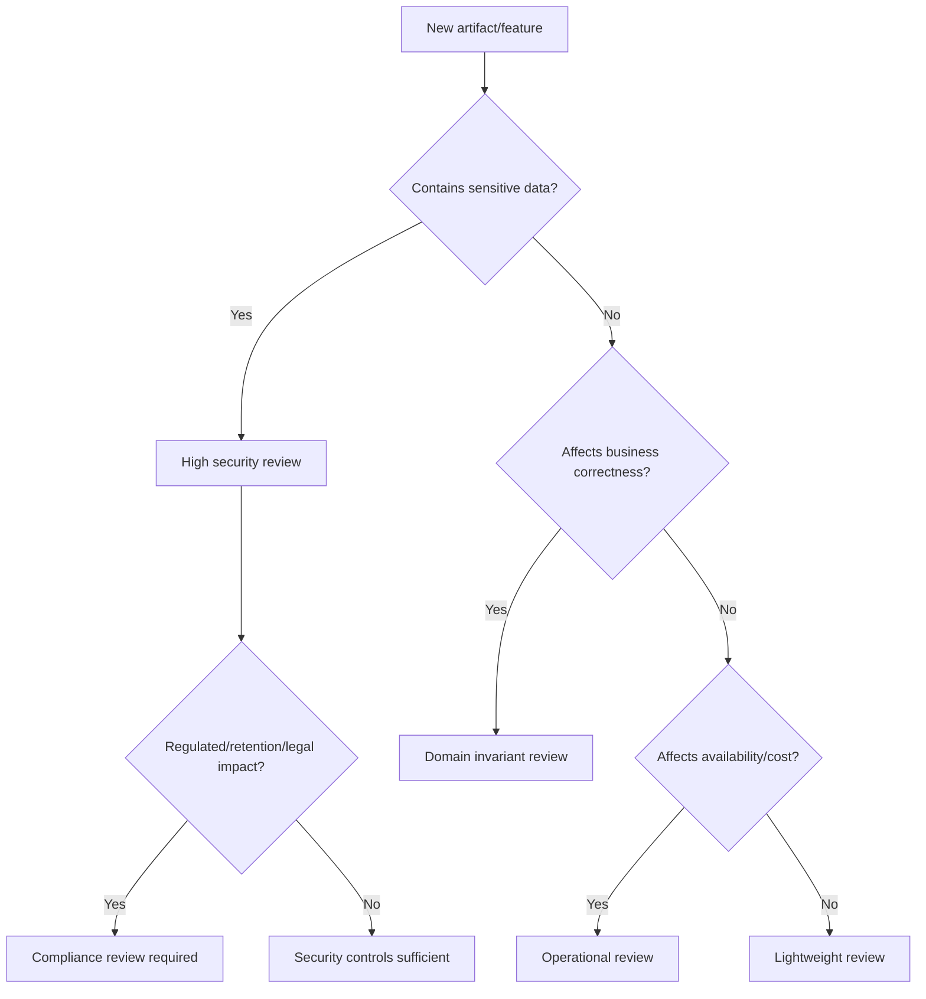
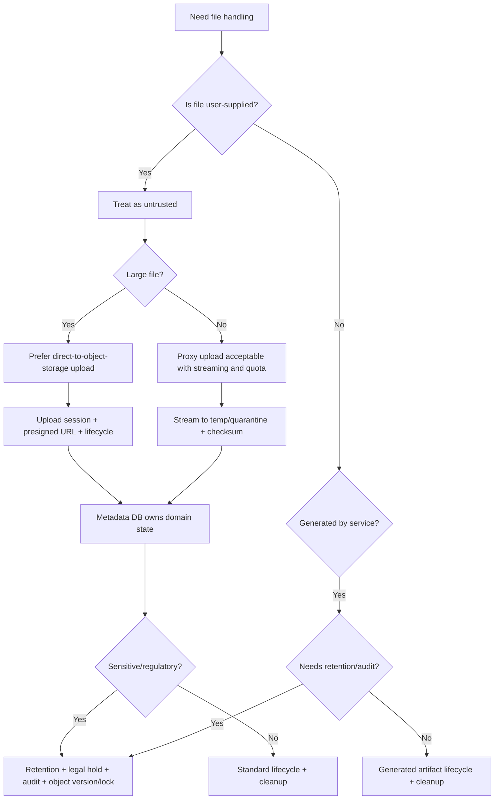
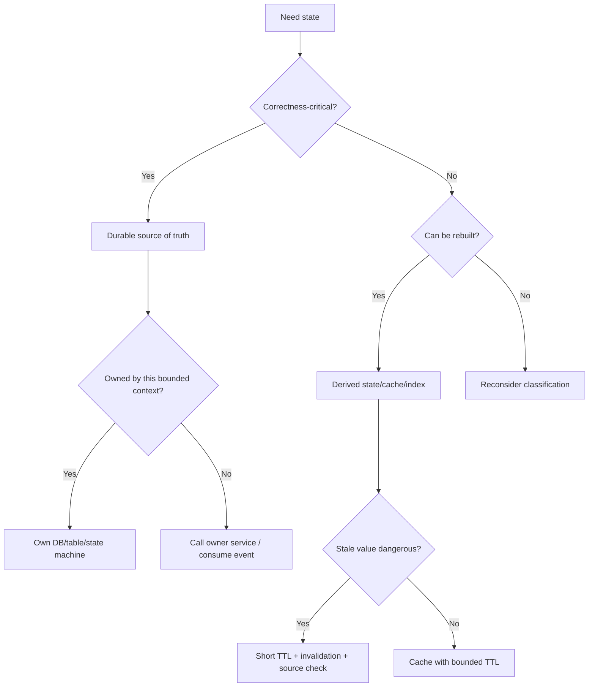
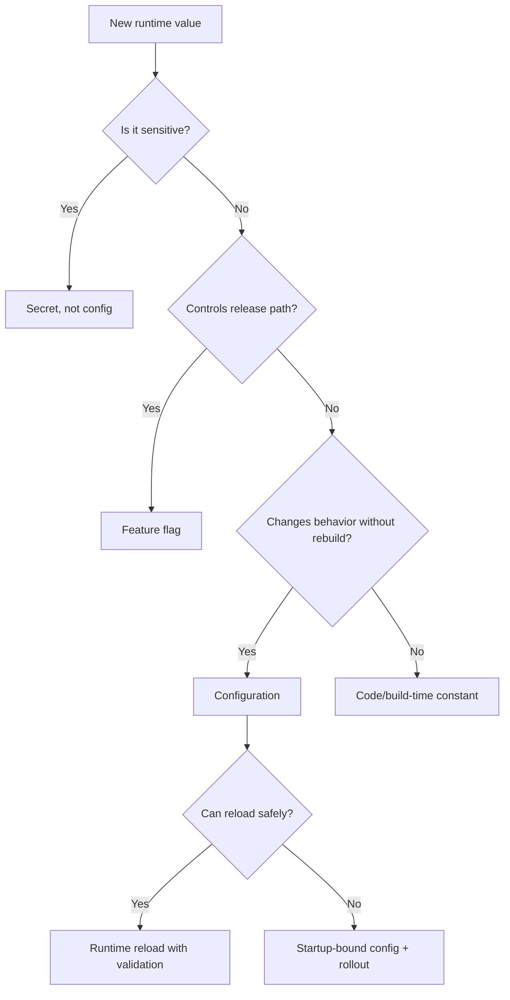

# Part 069 — Engineering Playbook

> Senior engineering is not knowing every answer.
>
> It is knowing which question must be answered before code is allowed to exist.

This part turns the whole series into a practical engineering playbook.

A playbook is not a tutorial. It is a set of reusable decision tools:

- decision trees;
- review gates;
- ADR templates;
- runbooks;
- design invariants;
- testing matrices;
- failure models;
- implementation skeletons;
- production readiness checks.

The goal:

```txt
When a Java microservice needs file handling, state, config, or secret logic,
the team should not reinvent the mental model from scratch.
```

This playbook is designed for tech leads, staff engineers, platform engineers, security reviewers, and service owners.

---

## 1. How to Use This Playbook

Use it at six moments:

| Moment | Use |
|---|---|
| New service design | choose file/state/config/secret architecture |
| Feature design | identify ownership, lifecycle, and invariants |
| Code review | catch boundary and failure mistakes |
| Security review | validate threat controls and least privilege |
| Production readiness | confirm observability, runbook, and rollback |
| Incident review | map failure back to missing invariant/control |

Do not apply every section mechanically. Use the parts relevant to the risk level.

---

## 2. Risk Classification

Before design depth, classify the artifact.



Risk levels:

| Level | Example | Required Review |
|---|---|---|
| Low | temp export cache | basic code review |
| Medium | internal config timeout | service + SRE review |
| High | file upload/download | security + operational review |
| Critical | evidence/legal-hold file | security + compliance + architecture review |

---

## 3. Decision Tree: File Handling



Rules:

```txt
Do not store user file directly in accepted state.
Do not use client filename as storage path.
Do not expose bucket/key as domain identity.
Do not skip metadata-payload consistency checks.
```

---

## 4. Decision Tree: Upload Architecture

| Question | Choose |
|---|---|
| File > service memory budget? | streaming/direct upload |
| Client can reach object storage? | presigned direct upload |
| Need synchronous inspection before storage? | proxy upload |
| Need malware scan? | quarantine-first |
| Need resumable upload? | multipart upload/session |
| Need regulatory retention? | versioning/object lock/legal hold |
| Need low-latency small files? | proxy may be simpler |
| Need mobile/browser direct upload? | presigned with strict TTL/CORS |

Recommended default:

```txt
Large or untrusted files:
upload session -> presigned upload -> quarantine -> scan -> accepted/rejected
```

---

## 5. Decision Tree: State Placement



Rules:

```txt
No correctness-critical state only in local disk, heap, or pod memory.
No shared database mutation across service ownership boundaries.
No cache as hidden source of truth.
```

---

## 6. Decision Tree: Configuration



Rules:

```txt
Config must have owner, schema, validation, provenance, and safe default.
Feature flags must have owner and expiry.
Secrets must never be stored in ConfigMap/plain config.
```

---

## 7. Decision Tree: Secret Delivery

| Situation | Recommended Pattern |
|---|---|
| Cloud workload accessing cloud resources | workload identity/IAM role |
| DB credential needing rotation | secret manager + dual credential/alternating users |
| short-lived dynamic credential | Vault dynamic secret + lease-aware consumer |
| GitOps with external manager | External Secrets Operator/reference |
| GitOps without external manager | SOPS with KMS or Sealed Secrets |
| TLS cert lifecycle | cert-manager/service mesh/app reload |
| Java app cannot hot reload secret | rolling restart with overlap |
| high-risk secret | audit, access review, rotation evidence |

Rules:

```txt
Secret delivery is not secret rotation.
Secret update is not consumer adoption.
Old credential revoke is final step.
```

---

## 8. ADR Template: File Architecture

```mdx
# ADR: File Handling Architecture for <Service>

## Status
Proposed | Accepted | Deprecated

## Context
- What files are handled?
- Who uploads/generates them?
- Data classification:
- Size range:
- Retention/compliance requirements:
- Access model:
- Expected volume:

## Decision
- Upload model:
- Storage:
- Metadata source of truth:
- Lifecycle states:
- Scan/validation:
- Download model:
- Retention/legal hold:
- Audit events:
- Reconciliation:

## Alternatives Considered
1. Proxy upload
2. Direct upload
3. DB BLOB
4. Shared filesystem
5. External DMS

## Consequences
### Positive
- ...

### Negative
- ...

## Invariants
- ...

## Failure Handling
- ...

## Observability
- ...

## Security
- ...

## Rollback/Migration
- ...
```

---

## 9. ADR Template: Configuration

```mdx
# ADR: Configuration Delivery for <Service>

## Context
- Config categories:
- Environments:
- Reload requirements:
- Security/compliance impact:
- Existing platform constraints:

## Decision
- Source of truth:
- Delivery mechanism:
- Schema:
- Validation:
- Promotion:
- Runtime reload:
- Drift detection:
- Rollback:

## Reload Classification
| Key/Group | Reloadable | Owner | Risk |
|---|---|---|---|

## Invariants
- ...

## Operational Model
- ...

## Alternatives
- Spring Cloud Config
- Kubernetes ConfigMap
- GitOps rendered config
- Feature flag platform
- Database-backed config

## Consequences
- ...
```

---

## 10. ADR Template: Secret Management

```mdx
# ADR: Secret Management for <Service>

## Context
- Secret list:
- Consumers:
- Dependency:
- Rotation requirement:
- Availability impact:
- Compliance/security requirement:

## Decision
- Secret authority:
- Delivery:
- Runtime consumption:
- Rotation strategy:
- Reload/rollout:
- Least privilege:
- Audit:
- Emergency rotation:

## Secret Inventory
| Secret | Source | Consumer | Rotation | Reload |
|---|---|---|---|---|

## Invariants
- Secret not logged
- Consumer refresh defined
- Old credential not revoked before proof
- ...

## Failure Handling
- Secret source down:
- Bad new credential:
- Expired secret:
- Rollback:

## Observability
- ...
```

---

## 11. Runbook Template

```mdx
# Runbook: <Problem>

## Symptoms
- Alerts:
- User-visible impact:
- Metrics:
- Logs:

## Severity
- Sev:
- Escalation:

## Immediate Checks
1. ...
2. ...
3. ...

## Diagnosis
- Query/dashboard:
- Expected normal:
- Abnormal patterns:

## Mitigation
- Safe action:
- Risk:
- Approval required:

## Recovery
- Steps:
- Validation:
- Rollback:

## Evidence to Capture
- Audit events:
- Logs:
- Metrics:
- Config/secret versions:
- Timeline:

## Post-Incident
- Root cause:
- Corrective actions:
- Tests to add:
- Runbook updates:
```

---

## 12. Runbook: Metadata-Payload Mismatch

Symptoms:

```txt
metadata_payload_mismatch_total > 0
download returns 404 from object storage
accepted file missing object
```

Diagnosis:

```txt
1. Identify fileId.
2. Load metadata row.
3. Check lifecycle status.
4. Check object bucket/key/version.
5. Query object storage HEAD.
6. Check audit events around upload/acceptance.
7. Check recent storage/delete events.
8. Check reconciliation reports.
```

Mitigation:

| Case | Action |
|---|---|
| UPLOADING/temp object missing | expire upload session |
| QUARANTINED object missing | mark failed/rejected and notify |
| ACCEPTED object missing | severity high; freeze deletion; start forensic investigation |
| object exists with checksum mismatch | quarantine/lock and investigate tampering |
| metadata wrong key | repair only with audit/approval |

Never silently recreate accepted evidence unless domain policy allows and evidence source is provable.

---

## 13. Runbook: Secret Rotation Failure

Symptoms:

```txt
dependency_auth_failure_total spike
secret_rotation_failed_total
pods mixed secret versions
secret_seconds_until_expiry low
```

Immediate:

```txt
1. Do not revoke old credential.
2. Pause rollout.
3. Identify new version and affected consumers.
4. Check canary readiness.
5. Check dependency auth logs.
6. Confirm old credential still valid.
```

Mitigation:

| Failure | Action |
|---|---|
| new credential invalid | revert secret current version |
| ESO sync delayed | wait/fix ESO before rollout |
| app cannot reload | rolling restart |
| old credential already revoked | recreate/third credential emergency path |
| secret leaked | emergency rotation and incident process |

Completion criteria:

```txt
all consumers healthy
new version used
old usage zero for observation window
old revoked
audit event recorded
```

---

## 14. Runbook: Config Drift

Symptoms:

```txt
config_drift_detected_total
live ConfigMap differs from Git
pods report unknown config version
behavior changed without deployment
```

Diagnosis:

```txt
1. Compare desired Git version vs live ConfigMap.
2. Check Kubernetes audit for update actor.
3. Check GitOps controller events.
4. Check app effective config version endpoint.
5. Identify high-risk keys changed.
6. Check correlated incidents after drift timestamp.
```

Mitigation:

```txt
- If unsafe: revert immediately to Git desired or previous safe version.
- If emergency valid: record exception and backfill Git.
- Restrict actor/RBAC if unauthorized.
- Add policy to prevent recurrence.
```

---

## 15. Runbook: Audit Outbox Backlog

Symptoms:

```txt
audit_outbox_oldest_age_seconds > threshold
audit_publish_failure_total increasing
audit sink unavailable
```

Diagnosis:

```txt
1. Check audit sink health.
2. Check outbox table growth.
3. Check publisher logs.
4. Check duplicate/idempotency errors.
5. Check network/credential issues.
```

Mitigation:

```txt
- Restart/fix publisher.
- Scale publisher if throughput issue.
- Pause high-risk operations if policy requires.
- Do not delete outbox rows manually.
- Replay idempotently.
```

Validation:

```txt
oldest age decreasing
publish success increasing
no gaps in event IDs
audit sink confirms receipt
```

---

## 16. Design Review Gate

Before implementation:

```txt
[ ] Artifact classified
[ ] Owner defined
[ ] Source of truth defined
[ ] Lifecycle state machine defined
[ ] Invariants defined
[ ] Threat model completed
[ ] Access model defined
[ ] Config/secret classification done
[ ] Failure modes listed
[ ] Observability plan defined
[ ] Audit events defined
[ ] Reconciliation plan defined
[ ] ADR written
```

---

## 17. Code Review Gate

During code review:

```txt
[ ] No `MultipartFile.getBytes()` for large/unbounded file
[ ] No client filename used as path
[ ] No bucket/key exposed as public domain ID
[ ] No raw secret in logs/exceptions
[ ] No request/response body logging by default
[ ] Typed config uses validation
[ ] Invalid lifecycle transition impossible
[ ] Idempotency implemented for retryable commands
[ ] External side effects have compensation/reconciliation
[ ] Metrics labels bounded and non-sensitive
[ ] Audit events emitted for material decisions
```

---

## 18. Security Review Gate

```txt
[ ] File upload allowlist/size/content validation
[ ] Quarantine before trust
[ ] Malware scan decision model
[ ] Payload access authorization separate from metadata
[ ] Presigned URL TTL and logging policy
[ ] Least privilege IAM/RBAC
[ ] Kubernetes Secret access restricted
[ ] Secret rotation strategy documented
[ ] Config cannot disable security controls in prod
[ ] Actuator/debug endpoints restricted
[ ] Logs/traces/metrics redacted
[ ] Audit store protected
```

---

## 19. Production Readiness Gate

```txt
[ ] Readiness checks required dependencies
[ ] Liveness not tied to transient dependency failure
[ ] Dashboards exist
[ ] Alerts have runbooks
[ ] Reconciliation jobs deployed
[ ] DLQ monitored
[ ] Storage lifecycle/incomplete multipart cleanup configured
[ ] Secret version/expiry observable
[ ] Config version observable
[ ] Audit outbox monitored
[ ] Rollback tested
[ ] Chaos/failure scenario tested in staging
[ ] Incident owner defined
```

---

## 20. Migration Playbook

When migrating existing file/config/secret system:

### 20.1 Inventory

```txt
- all buckets/prefixes
- DB metadata tables
- file types
- object keys with PII
- configs and sources
- secrets and consumers
- access policies
- retention rules
- audit gaps
```

### 20.2 Stabilize

```txt
- stop direct bucket access where possible
- add metadata-payload reconciliation
- add audit events for critical operations
- add config schema validation
- add secret scanning
- add least privilege
```

### 20.3 Migrate

```txt
- introduce stable fileId
- backfill checksums
- backfill object metadata/tags
- map lifecycle states
- move secrets to manager
- move config to governed path
- add runbooks and alerts
```

### 20.4 Verify

```txt
- compare counts
- verify checksums
- test downloads
- test retention
- test secret rotation
- test rollback
```

---

## 21. Implementation Skeleton: File Lifecycle Guard

```java
public final class FileLifecycleGuard {
    private static final Map<FileStatus, Set<FileStatus>> ALLOWED = Map.of(
        FileStatus.UPLOADING, Set.of(FileStatus.UPLOADED),
        FileStatus.UPLOADED, Set.of(FileStatus.QUARANTINED),
        FileStatus.QUARANTINED, Set.of(FileStatus.SCANNING),
        FileStatus.SCANNING, Set.of(FileStatus.ACCEPTED, FileStatus.REJECTED),
        FileStatus.ACCEPTED, Set.of(FileStatus.ARCHIVED, FileStatus.DELETION_REQUESTED),
        FileStatus.ARCHIVED, Set.of(FileStatus.DELETION_REQUESTED),
        FileStatus.DELETION_REQUESTED, Set.of(FileStatus.DELETED),
        FileStatus.REJECTED, Set.of(FileStatus.DELETED),
        FileStatus.DELETED, Set.of()
    );

    public void requireAllowed(FileStatus from, FileStatus to) {
        if (!ALLOWED.getOrDefault(from, Set.of()).contains(to)) {
            throw new InvalidLifecycleTransitionException(from, to);
        }
    }
}
```

---

## 22. Implementation Skeleton: Safe Config Snapshot

```java
public record ConfigSnapshot<T>(
    String version,
    T value,
    Instant loadedAt
) {}

public final class ReloadableConfig<T> {
    private final AtomicReference<ConfigSnapshot<T>> current;

    public ReloadableConfig(ConfigSnapshot<T> initial) {
        this.current = new AtomicReference<>(initial);
    }

    public ConfigSnapshot<T> current() {
        return current.get();
    }

    public void reload(ConfigSnapshot<T> candidate, Predicate<T> validator) {
        if (!validator.test(candidate.value())) {
            throw new InvalidConfigurationException(candidate.version());
        }

        current.set(candidate);
    }
}
```

---

## 23. Implementation Skeleton: Safe Secret Display

```java
public final class SecretValue {
    private final String value;

    private SecretValue(String value) {
        if (value == null || value.isBlank()) {
            throw new IllegalArgumentException("Secret value is required");
        }
        this.value = value;
    }

    public static SecretValue of(String value) {
        return new SecretValue(value);
    }

    public String revealForUse() {
        return value;
    }

    @Override
    public String toString() {
        return "[REDACTED]";
    }
}
```

---

## 24. Review Questions for Staff-Level Engineers

Ask these in design reviews.

```txt
What is the source of truth?
What happens if this operation succeeds halfway?
What retries this command?
What makes retry safe?
What state can become stale?
Who can mutate this value?
How is this audited?
Can we prove the file was not changed?
What happens if config changes during traffic?
What happens if secret expires during traffic?
What happens if old pods and new pods run different config?
What data leaks if logs are exported?
What is the recovery path?
What is the smallest blast radius?
What is the rollback path?
```

If the team cannot answer, the design is not done.

---

## 25. Key Takeaways

1. **A playbook converts engineering judgment into repeatable review practice.**
2. **Decision trees prevent teams from defaulting to unsafe convenience.**
3. **ADR templates capture consequences before code hardens them.**
4. **Runbooks must be written before production incidents.**
5. **Review gates catch different classes of failure: design, code, security, operations.**
6. **Migration should inventory, stabilize, migrate, and verify.**
7. **Reusable skeletons should encode invariants, not just wrappers.**
8. **The best senior engineers ask boundary, failure, ownership, and proof questions early.**
9. **Production-grade systems make correct operation boring and unsafe operation difficult.**
10. **Playbooks improve only when incidents and game days feed back into them.**

Next is the final part: a capstone that combines the entire series into an end-to-end production design exercise and next learning path.

---

## References

- Spring Boot Externalized Configuration: https://docs.spring.io/spring-boot/reference/features/external-config.html
- Kubernetes Liveness, Readiness, and Startup Probes: https://kubernetes.io/docs/concepts/workloads/pods/probes/
- OWASP Logging Cheat Sheet: https://cheatsheetseries.owasp.org/cheatsheets/Logging_Cheat_Sheet.html
- OpenTelemetry Documentation: https://opentelemetry.io/docs/
