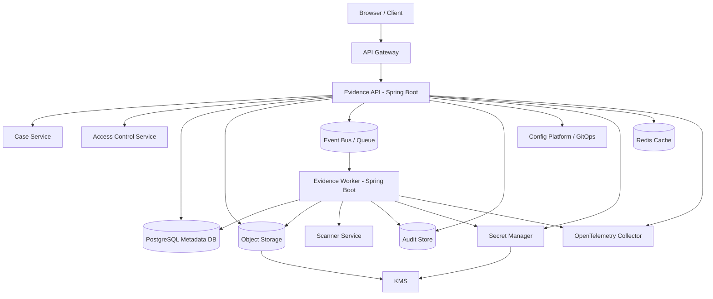
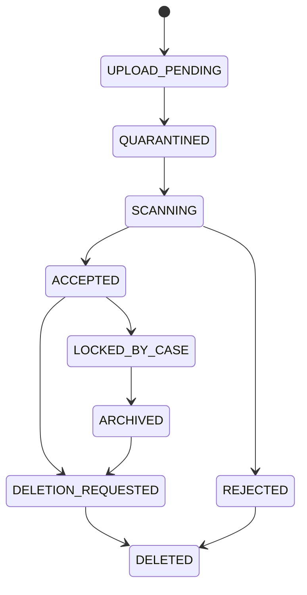

# Part 070 — Final Capstone and Next Steps

> The goal of this series was not to memorize patterns.
>
> The goal was to make you dangerous in the right way:
> able to see failure before it becomes production history.

This is the final part of the series.

We started with mental models:

- file is not just bytes;
- state is never absent, only relocated;
- configuration is runtime behavior control;
- secret is capability with lifecycle;
- ownership must be explicit;
- invariants are stronger than validation.

Then we built implementation depth:

- Java File I/O;
- safe local file handling;
- large file streaming;
- upload/download design;
- object storage;
- presigned URLs;
- content-addressable storage;
- versioning/retention/legal hold;
- state reconstruction;
- Spring Boot configuration;
- Kubernetes ConfigMaps and Secrets;
- Vault/cloud secret managers;
- GitOps secret delivery;
- secret rotation;
- threat modeling;
- leakage prevention;
- encryption;
- access control;
- auditability;
- observability;
- chaos testing;
- compliance;
- reference architecture;
- case studies;
- engineering playbook.

This final capstone asks you to combine all of it.

---

## 1. Capstone Scenario

Design a production-grade Java microservice platform for:

```txt
Regulatory Case Evidence and Document Processing
```

The system must support:

- uploading evidence files;
- direct browser upload for large files;
- proxy upload for small internal files;
- malware scanning;
- checksum verification;
- file lifecycle state machine;
- metadata and object storage consistency;
- evidence package export;
- retention and legal hold;
- case lifecycle integration;
- audit and forensics;
- multi-environment config;
- zero-downtime secret rotation;
- Kubernetes deployment;
- object storage;
- PostgreSQL metadata;
- Redis cache for non-authoritative data;
- OpenTelemetry observability;
- GitOps deployment.

Non-functional requirements:

```txt
- valid upload accepted for processing within 2 seconds
- 99% scanned within 10 minutes
- no accepted file without checksum
- no download without fresh authorization
- presigned download URL TTL <= 5 minutes
- evidence retained 7 years after case closure unless legal hold active
- DB credential rotated every 30 days without downtime
- config changes traceable to Git PR
- production scan cannot be disabled by config
- audit events durably stored within 60 seconds
```

---

## 2. Capstone Architecture



Boundary summary:

| Boundary | Owner |
|---|---|
| Evidence lifecycle | Evidence service |
| Case lifecycle | Case service |
| Authorization policy | Access control service |
| Payload custody | Object storage platform |
| Metadata truth | Evidence DB |
| Secret authority | Secret manager/security platform |
| Config desired state | GitOps/config platform |
| Audit proof | Audit platform |
| Telemetry | Observability platform |

---

## 3. Capstone Domain Model

```java
public record EvidenceId(String value) {}
public record CaseId(String value) {}
public record FileId(String value) {}

public enum EvidenceStatus {
    DRAFT,
    UPLOAD_PENDING,
    QUARANTINED,
    SCANNING,
    ACCEPTED,
    REJECTED,
    LOCKED_BY_CASE,
    ARCHIVED,
    DELETION_REQUESTED,
    DELETED
}

public record FileIntegrity(
    long sizeBytes,
    String sha256,
    String detectedContentType,
    Instant verifiedAt
) {}

public record RetentionState(
    String policyVersion,
    Instant retentionUntil,
    boolean legalHold
) {}
```

Core invariant:

```txt
EvidenceStatus.ACCEPTED requires:
- fileId exists
- object exists
- checksum verified
- scan decision CLEAN
- metadata committed
- audit event emitted
```

---

## 4. Capstone Lifecycle



Invalid transitions:

```txt
UPLOAD_PENDING -> ACCEPTED
REJECTED -> ACCEPTED
DELETED -> ACCEPTED
LOCKED_BY_CASE -> DELETED without retention/legal decision
```

---

## 5. Capstone Upload Design

### 5.1 Direct Upload

Use for large browser uploads.

```txt
1. POST /cases/{caseId}/evidence/upload-sessions
2. authorize actor
3. create metadata status=UPLOAD_PENDING
4. issue presigned PUT to quarantine/temp key
5. client uploads object
6. client completes session
7. API verifies object metadata
8. transition to QUARANTINED
9. enqueue scan
```

### 5.2 Proxy Upload

Use for internal small files.

```txt
1. stream multipart request
2. enforce size/quota
3. compute checksum while streaming
4. write to temp/quarantine storage
5. create metadata
6. enqueue scan
```

Do not use:

```java
multipartFile.getBytes()
```

for unbounded files.

---

## 6. Capstone Storage Design

Object key:

```txt
quarantine/{yyyy}/{mm}/{dd}/{fileId}/payload
accepted/{yyyy}/{mm}/{dd}/{fileId}/payload
archive/{yyyy}/{mm}/{dd}/{fileId}/payload
```

Avoid:

```txt
cases/{caseId}/{originalFilename}
```

Object metadata/tags:

```txt
fileId
tenantId
ownerService=evidence-service
lifecycle=quarantine
checksumSha256
correlationId
```

Keep values safe and bounded.

Storage controls:

- private bucket;
- encryption with KMS;
- versioning;
- object lock/legal hold if required;
- incomplete multipart abort;
- temp lifecycle cleanup;
- object data events where needed;
- least privilege per service account.

---

## 7. Capstone Metadata Schema

```sql
CREATE TABLE evidence_file (
    evidence_id TEXT PRIMARY KEY,
    file_id TEXT NOT NULL UNIQUE,
    case_id TEXT NOT NULL,
    tenant_id TEXT NOT NULL,
    status TEXT NOT NULL,

    bucket TEXT NOT NULL,
    object_key TEXT NOT NULL,
    object_version TEXT NULL,

    original_filename_display TEXT NULL,
    detected_content_type TEXT NULL,
    size_bytes BIGINT NULL,
    sha256 TEXT NULL,

    scan_decision TEXT NULL,
    scan_policy_version TEXT NULL,
    scan_completed_at TIMESTAMPTZ NULL,

    retention_policy_version TEXT NULL,
    retention_until TIMESTAMPTZ NULL,
    legal_hold BOOLEAN NOT NULL DEFAULT FALSE,

    created_by TEXT NOT NULL,
    created_at TIMESTAMPTZ NOT NULL,
    updated_at TIMESTAMPTZ NOT NULL,
    version BIGINT NOT NULL
);
```

Constraint:

```sql
ALTER TABLE evidence_file
ADD CONSTRAINT accepted_evidence_integrity_check
CHECK (
  status <> 'ACCEPTED'
  OR (
    sha256 IS NOT NULL
    AND size_bytes IS NOT NULL
    AND scan_decision = 'CLEAN'
    AND object_key IS NOT NULL
  )
);
```

---

## 8. Capstone Configuration

Typed config:

```yaml
evidence:
  upload:
    max-size-mb: 500
    direct-upload-enabled: true
    presigned-upload-ttl: 5m
  download:
    presigned-download-ttl: 2m
    require-fresh-authorization: true
  scan:
    required: true
    timeout: 60s
  retention:
    default-years-after-case-closure: 7
    legal-hold-enabled: true
```

Production policy:

```txt
scan.required must be true
download.presigned-download-ttl <= 5m
retention.legal-hold-enabled must be true
upload.max-size-mb <= platform maximum
```

Delivery:

```txt
Git -> validation -> GitOps -> ConfigMap -> Spring Boot typed properties -> startup validation
```

Runtime reload:

- scan timeout may reload;
- bucket/prefix/retention policy does not reload silently;
- production security invariants cannot be disabled dynamically.

---

## 9. Capstone Secrets

Secrets:

| Secret | Strategy |
|---|---|
| Evidence DB credential | secret manager + alternating users + rolling restart |
| Scanner API token | secret manager + rollout/reload |
| Audit sink credential | secret manager |
| Object storage access | workload identity preferred |
| KMS access | IAM/workload identity |
| TLS | cert-manager/service mesh or controlled secret volume |

Rotation:

```txt
create new -> distribute -> canary -> rollout -> prove new use -> revoke old
```

Consumer proof:

```txt
secret_current_version_info
DB audit login user
readiness DB check
dependency_auth_failure_total stable
old credential usage zero
```

---

## 10. Capstone Access Control

Separate operations:

```txt
canViewEvidenceMetadata
canDownloadEvidencePayload
canAttachEvidence
canDeleteEvidence
canApplyLegalHold
canExportEvidencePackage
```

Payload access rules:

```txt
Metadata access is not payload access.
Download grant requires fresh authorization.
Presigned URL issuance is audited.
Presigned URL is short-lived.
```

Cache:

```txt
Authorization cache may improve performance,
but critical download action must use fresh or bounded-staleness decision.
```

---

## 11. Capstone Audit Events

Minimum audit matrix:

| Operation | Audit Event |
|---|---|
| upload session create | `EVIDENCE_UPLOAD_SESSION_CREATED` |
| payload received | `EVIDENCE_PAYLOAD_RECEIVED` |
| checksum verified | `EVIDENCE_CHECKSUM_VERIFIED` |
| scan completed | `EVIDENCE_SCAN_COMPLETED` |
| accepted/rejected | `EVIDENCE_FILE_ACCEPTED/REJECTED` |
| download allowed/denied | `EVIDENCE_DOWNLOAD_GRANTED/DENIED` |
| legal hold applied/removed | `EVIDENCE_LEGAL_HOLD_APPLIED/REMOVED` |
| delete requested/blocked/completed | `EVIDENCE_DELETION_*` |
| config deployed | `CONFIG_VERSION_DEPLOYED` |
| secret rotated | `SECRET_ROTATION_*` |

Audit event must include:

- actor;
- resource;
- decision;
- reason code;
- policy version;
- timestamp;
- correlation ID;
- safe attributes.

---

## 12. Capstone Observability

Metrics:

```txt
evidence_upload_session_created_total
evidence_upload_completed_total
evidence_scan_pending_age_seconds
evidence_scan_completed_total{decision}
evidence_accepted_total
evidence_download_granted_total
evidence_download_denied_total{reason}
evidence_deletion_blocked_total{reason}
metadata_payload_mismatch_total
audit_outbox_oldest_age_seconds
config_current_version_info
secret_seconds_until_expiry
secret_refresh_failure_total
dependency_auth_failure_total
```

Alerts:

```txt
accepted evidence without checksum > 0
metadata-payload mismatch for accepted evidence > 0
scan pending p95 > 10 minutes
audit outbox oldest age > 60 seconds
secret expires in < 10 minutes and refresh failing
prod config scan.required false
mixed critical config versions beyond rollout window
old DB credential used after rotation window
```

---

## 13. Capstone Failure Model

| Failure | Required Behavior |
|---|---|
| object upload succeeds, DB update fails | object orphan detected/cleaned |
| DB commit succeeds, event publish fails | outbox retries |
| scanner down | evidence remains not accepted |
| duplicate scan event | idempotent |
| legal hold during delete | delete blocked |
| secret manager down | cached credential used within TTL; readiness fails near expiry |
| config invalid | startup/reload blocked |
| object storage 503 | bounded retry/backpressure |
| audit sink down | outbox persists; high-risk operations may fail closed |
| pod killed mid-worker | queue redelivery/idempotent processing |

---

## 14. Capstone Testing Plan

### 14.1 Unit

```txt
[ ] invalid lifecycle transition rejected
[ ] accepted evidence requires clean scan/checksum
[ ] legal hold blocks delete
[ ] secret value toString redacts
[ ] config validation rejects unsafe prod values
```

### 14.2 Integration

```txt
[ ] direct upload session flow
[ ] object verification flow
[ ] scan worker flow
[ ] download authorization flow
[ ] audit outbox transaction
[ ] secret missing readiness
[ ] config startup validation
```

### 14.3 Failure

```txt
[ ] storage timeout
[ ] scanner timeout
[ ] duplicate event
[ ] DB deadlock/retry
[ ] audit sink down
[ ] secret rotation bad credential
[ ] ConfigMap drift
[ ] pod kill during processing
```

### 14.4 Security

```txt
[ ] content type spoof
[ ] path traversal filename
[ ] unauthorized download
[ ] presigned URL not logged
[ ] ConfigMap secret scanner
[ ] broad RBAC forbidden
[ ] actuator restricted
```

---

## 15. Capstone Scoring Rubric

Score from 0 to 5.

| Area | 0 | 5 |
|---|---|---|
| File lifecycle | ad-hoc upload | explicit state machine + audit |
| Storage | bucket wrapper | domain metadata + object lifecycle |
| Integrity | no checksum | checksum/object version verified |
| Security | basic auth only | least privilege + threat model |
| Config | raw env vars | typed schema + promotion + drift detection |
| Secret | static secret | rotation + TTL/readiness + audit |
| State | hidden state | source of truth + replay/reconciliation |
| Observability | generic logs | invariant-driven metrics/alerts |
| Compliance | manual docs | policy-control-evidence-review |
| Failure testing | happy path | chaos/game day + runbooks |

Target for production-grade:

```txt
No category below 4.
Critical systems need 5 in security, audit, retention, and recovery.
```

---

## 16. Implementation Roadmap

### Phase 1 — Safe Foundation

```txt
- typed config
- secret manager integration
- basic metadata model
- object storage adapter
- upload session
- lifecycle state machine
- audit outbox
- checksum verification
```

### Phase 2 — Production Controls

```txt
- scanner pipeline
- presigned direct upload/download
- authorization policy integration
- retention/legal hold
- reconciliation jobs
- metrics/logs/traces
- dashboards/alerts
```

### Phase 3 — Operational Maturity

```txt
- secret rotation automation
- config promotion platform
- chaos testing
- forensic drill
- access review
- cost controls
- object lock/versioning if required
```

### Phase 4 — Platformization

```txt
- reusable file platform library
- config schema registry
- secret inventory and orchestrator
- standardized ADR/runbook templates
- self-service dashboards
- policy-as-code
```

---

## 17. What “Top 1%” Looks Like Here

Not memorizing every API.

A top-tier engineer can:

```txt
see that MultipartFile.getOriginalFilename is not authority
see that ConfigMap update does not equal safe runtime reload
see that Kubernetes Secret update does not rotate DB connections
see that object storage key is not domain identity
see that cache can become security state
see that audit log must be durable before destructive operation
see that secret revocation before proof causes outage
see that retention is a domain rule, not only lifecycle policy
see that observability must map to invariants
see that rollback must be designed before rollout
```

The skill is structural judgment.

---

## 18. Recommended Next Learning Path

After this series, the natural continuations are:

### 18.1 Platform Engineering for Java Microservices

Focus:

- golden paths;
- internal developer platform;
- service templates;
- policy-as-code;
- paved roads;
- workload identity;
- service catalog;
- runtime contracts.

### 18.2 Advanced Distributed State and Workflow

Focus:

- workflow engines;
- saga orchestration/choreography;
- deterministic replay;
- temporal models;
- event sourcing;
- process audit;
- compensating actions.

### 18.3 Secure Software Supply Chain for Java

Focus:

- SBOM;
- dependency signing;
- provenance;
- SLSA;
- artifact promotion;
- image signing;
- vulnerability management;
- runtime admission.

### 18.4 Production Data Governance Engineering

Focus:

- data classification;
- retention;
- privacy;
- lineage;
- access review;
- audit evidence;
- deletion workflows;
- legal hold.

### 18.5 Resilience Engineering and Game Days

Focus:

- chaos engineering;
- SLO/error budget;
- incident command;
- failure injection;
- recovery drills;
- socio-technical reliability.

### 18.6 Advanced Cloud Storage Architecture

Focus:

- multi-region object storage;
- replication;
- object lock;
- archival retrieval;
- storage cost modeling;
- CDN/private content;
- data residency.

---

## 19. Final Series Summary

The core pattern across this entire series is:

```txt
Separate responsibility.
Name the artifact.
Own the lifecycle.
Validate the boundary.
Preserve the invariant.
Emit evidence.
Observe stress.
Reconcile drift.
Practice failure.
```

Applied to files:

```txt
bytes + metadata + lifecycle + policy + audit
```

Applied to state:

```txt
truth + ownership + consistency + reconstruction
```

Applied to config:

```txt
schema + provenance + validation + promotion + rollback
```

Applied to secrets:

```txt
capability + least privilege + TTL + rotation + proof
```

Applied to production:

```txt
invariant + observability + runbook + game day + evidence
```

---

## 20. Final Checklist

Before claiming a Java microservice handles file/state/config/secret production-grade, verify:

```txt
[ ] File identity independent of storage key
[ ] Metadata and payload consistency strategy exists
[ ] Accepted files require checksum and trust decision
[ ] Upload/download authorization separated
[ ] Presigned URLs short-lived and not logged
[ ] State source of truth explicit
[ ] Critical state not stored only in local disk/memory
[ ] Config typed, validated, versioned, and governed
[ ] Runtime reload only where safe
[ ] Secrets stored in secret manager or encrypted GitOps path
[ ] Secret rotation strategy tested
[ ] Least privilege IAM/RBAC applied
[ ] Sensitive data redaction tested
[ ] Audit events cover material decisions
[ ] Audit pipeline durable and monitored
[ ] Retention/legal hold enforced before delete
[ ] Reconciliation jobs deployed
[ ] Dashboards and alerts map to invariants
[ ] Failure/chaos tests run
[ ] Runbooks exist and are current
[ ] ADRs document major decisions
```

---

## 21. Closing Mental Model

A weak system says:

```txt
We uploaded the file.
We set the config.
We stored the secret.
We have logs.
```

A strong system says:

```txt
We know who owns the file.
We know its lifecycle state.
We know its checksum.
We know who can access it.
We know which config version influenced behavior.
We know which secret version was used.
We know how it fails.
We know how it recovers.
We know how to prove what happened.
```

That is the difference between code that works and a system that can be trusted.

This series is now complete.

---

## References

- Spring Boot Externalized Configuration: https://docs.spring.io/spring-boot/reference/features/external-config.html
- Kubernetes Liveness, Readiness, and Startup Probes: https://kubernetes.io/docs/concepts/workloads/pods/probes/
- OWASP Logging Cheat Sheet: https://cheatsheetseries.owasp.org/cheatsheets/Logging_Cheat_Sheet.html
- OpenTelemetry Documentation: https://opentelemetry.io/docs/
- AWS S3 Presigned URLs: https://docs.aws.amazon.com/AmazonS3/latest/userguide/using-presigned-url.html
- AWS S3 Object Lock: https://docs.aws.amazon.com/AmazonS3/latest/userguide/object-lock.html
- HashiCorp Vault Lease, Renew, and Revoke: https://developer.hashicorp.com/vault/docs/concepts/lease
