------
title: Build From Scratch: Large Production Grade Java Payment Systems - Part 001
description: Mental model dasar untuk membangun payment system production-grade: money movement, authorization, clearing, settlement, ledger truth, failure semantics, dan invariants.
series: learn-java-payment-systems
seriesTitle: Build From Scratch: Large Production Grade Java Payment Systems
order: 1
partTitle: Payment System Mental Model
tags:
- java
- payments
- payment-systems
- fintech
- ledger
- reconciliation
- enterprise-architecture
date: 2026-07-02
---

# Part 001 — Payment System Mental Model

Payment system yang benar tidak dibangun dari pertanyaan:

> “Endpoint apa saja yang perlu dibuat?”

Payment system yang benar dibangun dari pertanyaan:

> “Kapan sebuah pergerakan uang boleh dianggap benar, final, dapat diaudit, dapat direkonsiliasi, dan aman terhadap retry, duplikasi, timeout, fraud, serta kesalahan operator?”

Perbedaan dua pertanyaan itu besar.

Endpoint bisa selesai dalam beberapa hari. Payment system yang aman butuh model mental yang tepat: uang tidak bergerak seperti HTTP request. Uang bergerak melalui janji, otorisasi, pesan antar institusi, file settlement, ledger internal, laporan eksternal, koreksi, dispute, dan audit trail.

Di part pertama ini kita belum menulis kode. Kita membangun fondasi konseptual agar saat nanti membuat Java services, schema, outbox, state machine, ledger, reconciliation, dan settlement engine, kita tidak salah menaruh “source of truth”.

---

## 1. Tujuan Part Ini

Setelah bagian ini, kamu harus bisa menjelaskan payment system dengan presisi berikut:

1. Bedanya payment request, authorization, capture, clearing, settlement, refund, reversal, chargeback, dan payout.
2. Kenapa `success` dari provider belum tentu sama dengan uang sudah final.
3. Kenapa ledger internal tidak boleh sekadar menyalin status provider.
4. Kenapa idempotency adalah financial control, bukan hanya API convenience.
5. Kenapa “unknown state” adalah kondisi normal dalam payment system.
6. Kenapa payment system harus didesain sebagai sistem audit dan koreksi, bukan hanya sistem transaksi online.

Kita akan menghindari definisi dangkal. Fokusnya mental model yang bisa dipakai untuk desain production-grade.

---

## 2. Kesalahan Umum: Mengira Payment Gateway Sama dengan Payment System

Banyak engineer pertama kali membangun pembayaran dengan model seperti ini:

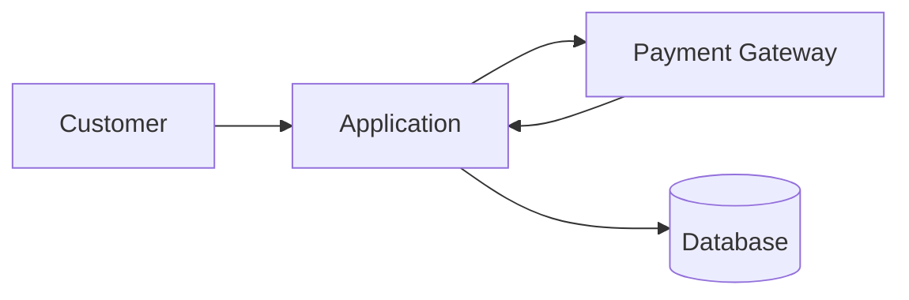

Model itu terlalu kecil.

Ia cocok untuk demo: user checkout, aplikasi call payment gateway, gateway memberi URL pembayaran atau status sukses, lalu order dianggap paid.

Untuk production enterprise, model itu tidak cukup. Beberapa pertanyaan yang tidak terjawab:

- Jika request ke gateway timeout tetapi transaksi sebenarnya berhasil, apa yang terjadi?
- Jika webhook sukses datang dua kali, apakah order dikirim dua kali?
- Jika provider bilang sukses tetapi settlement file besok tidak mencantumkan transaksi itu, siapa yang benar?
- Jika customer berhasil membayar tetapi ledger internal gagal posting, apakah payment dianggap paid?
- Jika refund berhasil di provider tetapi gagal di ledger, laporan finance membaca apa?
- Jika fraud team menahan dana merchant, apakah balance tersedia berubah?
- Jika operator melakukan manual adjustment, bagaimana audit trail dan approval-nya?
- Jika provider mengubah status dari `SUCCESS` menjadi `REVERSED`, apakah domain model kita siap?

Payment system bukan “integrasi gateway”. Payment system adalah **kontrol uang**.

---

## 3. Payment System sebagai Sistem Kontrol Uang

Payment system production-grade memiliki tiga lapisan kebenaran:

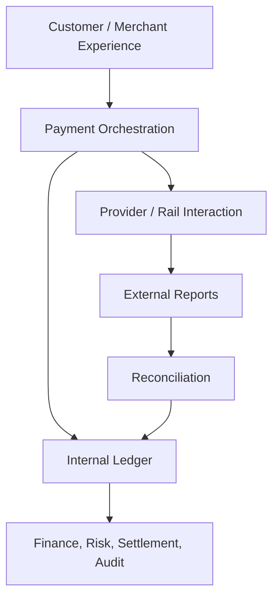

Penjelasannya:

- **Experience layer** melihat transaksi sebagai “bayar”, “refund”, “withdraw”, “top up”, atau “checkout”.
- **Orchestration layer** mengatur provider, retry, routing, timeout, webhook, dan status.
- **External rail/provider layer** berinteraksi dengan PSP, acquirer, bank, wallet, QR network, atau payment rail.
- **Internal ledger** mencatat hak dan kewajiban internal secara immutable.
- **External reports** berisi statement provider, settlement file, bank statement, scheme report, dispute report, atau payout confirmation.
- **Reconciliation** membandingkan catatan internal dengan catatan eksternal.
- **Finance/risk/audit** membaca ledger dan reconciliation result, bukan sekadar status endpoint.

Mental model penting:

> Payment orchestration menjawab “apa yang sedang kita coba lakukan”. Ledger menjawab “hak dan kewajiban finansial apa yang sudah kita akui”. Reconciliation menjawab “apakah dunia luar setuju dengan catatan kita”.

Ketiga jawaban itu tidak boleh dicampur.

---

## 4. Uang Tidak Bergerak Seketika

Dalam banyak rail, uang tidak bergerak saat user melihat layar “payment success”. Yang bergerak lebih dulu biasanya adalah informasi, authorization, atau janji pembayaran.

Contoh kartu:

1. Customer memasukkan kartu.
2. Merchant/acquirer meminta issuer mengotorisasi transaksi.
3. Issuer menyetujui atau menolak.
4. Merchant melakukan capture.
5. Transaksi masuk clearing.
6. Settlement antar institusi terjadi kemudian.
7. Merchant menerima net settlement setelah fee, reserve, chargeback, atau adjustment.

Contoh virtual account:

1. Platform membuat VA number.
2. Customer transfer dari bank/channel lain.
3. Bank/processor mengirim notifikasi credit.
4. Platform mencocokkan pembayaran dengan invoice/order.
5. Dana masuk laporan settlement atau account statement.
6. Platform mengakui penerimaan dan mungkin melakukan payout/settlement ke merchant.

Contoh QR dinamis:

1. Merchant membuat payment intent.
2. Sistem menghasilkan QR untuk nominal tertentu.
3. Customer scan dan approve di aplikasi issuer/wallet/bank.
4. Acquirer/aggregator menerima confirmation.
5. Merchant mendapat notifikasi.
6. Settlement dilakukan sesuai jadwal/aturan rail.

Jadi kata “paid” harus didefinisikan. Paid untuk siapa?

- Paid menurut customer experience?
- Paid menurut order fulfillment?
- Paid menurut provider response?
- Paid menurut ledger internal?
- Paid menurut settlement bank?
- Paid menurut finance close?

Jika definisi ini tidak eksplisit, sistem akan rapuh.

---

## 5. Empat Gerakan: Instruction, Authorization, Obligation, Settlement

Untuk memahami payment, pisahkan empat hal:

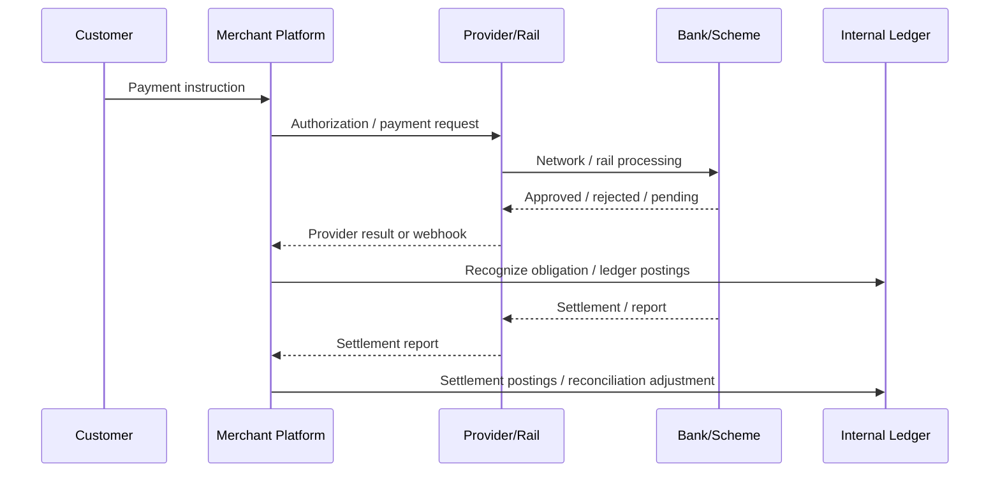

### 5.1 Instruction

Instruction adalah niat bisnis: customer ingin membayar invoice, merchant ingin melakukan refund, platform ingin melakukan payout.

Instruction belum berarti uang bergerak. Instruction adalah command.

Contoh:

```json
{
  "paymentIntentId": "pi_123",
  "merchantId": "m_789",
  "amount": 125000,
  "currency": "IDR",
  "method": "CARD",
  "purpose": "ORDER_PAYMENT"
}
```

### 5.2 Authorization

Authorization adalah approval dari pihak yang berwenang untuk melanjutkan pembayaran. Pada kartu, issuer menyetujui hold/authorization. Pada wallet/QR/instant transfer, authorization bisa berarti customer sudah approve transfer.

Authorization bukan selalu settlement final.

### 5.3 Obligation

Obligation adalah kewajiban finansial yang harus diakui internal.

Misalnya:

- Platform berutang kepada merchant karena customer sudah membayar.
- Customer balance berkurang karena pembayaran wallet.
- Platform berhak atas fee.
- Merchant balance ditahan karena risk reserve.

Obligation harus dicatat di ledger internal.

### 5.4 Settlement

Settlement adalah perpindahan dana final atau netting antar institusi sesuai rail. Ini bisa real-time, near real-time, harian, T+1, T+2, atau bergantung skema.

Settlement sering datang dalam bentuk report/file, bukan callback real-time.

---

## 6. Authorization, Capture, Clearing, Settlement

Untuk kartu, empat kata ini sering membingungkan. Kita gunakan model berikut:

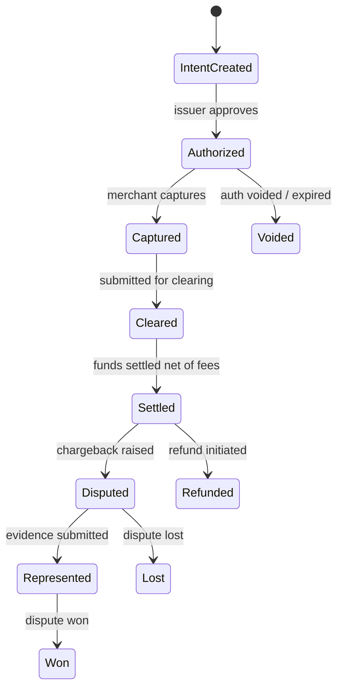

### Authorization

Authorization adalah issuer/acquirer/scheme menyatakan transaksi boleh dilanjutkan. Pada kartu, ini sering menciptakan hold di limit/balance customer.

Engineering implication:

- Jangan mengirim barang mahal hanya karena payment intent dibuat.
- Jangan mengakui revenue final hanya karena authorization sukses.
- Simpan `authorizationId`, expiry, authorized amount, currency, dan method detail.

### Capture

Capture adalah instruksi merchant untuk menagih authorized amount. Untuk ecommerce, capture bisa langsung setelah authorization atau delayed setelah stok siap.

Engineering implication:

- Sistem harus mendukung partial capture bila business model membutuhkannya.
- Capture harus idempotent.
- Capture bisa gagal walau authorization sebelumnya sukses.

### Clearing

Clearing adalah proses pertukaran data transaksi untuk menentukan siapa berutang kepada siapa.

Engineering implication:

- Clearing tidak selalu terlihat di API real-time.
- Data clearing bisa muncul di settlement/reconciliation report.
- Beberapa fee dan adjustment baru jelas di tahap ini.

### Settlement

Settlement adalah perpindahan dana/net settlement antar pihak.

Engineering implication:

- Merchant payable harus menunggu settlement policy.
- Settlement amount sering net of fee, tax, chargeback, reserve, dan adjustment.
- Reconciliation harus membandingkan transaksi internal dengan settlement report eksternal.

---

## 7. Payment Status Bukan Satu Dimensi

Kesalahan desain umum: membuat satu kolom `status` untuk semua hal.

```sql
-- terlalu miskin untuk production-grade payment
payment.status = 'SUCCESS'
```

Status tunggal akan rusak saat menghadapi situasi nyata:

- provider status sukses, ledger posting gagal;
- payment authorized, belum captured;
- capture sukses, settlement pending;
- settlement sukses, dispute muncul;
- refund requested, belum accepted provider;
- refund accepted, belum settled;
- webhook menyatakan paid, reconciliation menyatakan missing;
- order sudah fulfilled, chargeback lost.

Payment status lebih sehat jika dipisah menjadi beberapa perspektif.

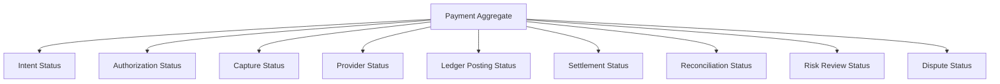

Contoh model konseptual:

```text
PaymentIntent
  intentStatus: REQUIRES_METHOD | REQUIRES_CONFIRMATION | PROCESSING | SUCCEEDED | CANCELED
  authorizationStatus: NOT_REQUIRED | PENDING | AUTHORIZED | DECLINED | EXPIRED | VOIDED
  captureStatus: NOT_REQUIRED | CAPTURABLE | CAPTURED | PARTIALLY_CAPTURED | FAILED
  providerStatus: PENDING | SUCCEEDED | FAILED | UNKNOWN | REVERSED
  ledgerStatus: NOT_POSTED | POSTED | POST_FAILED | REVERSED
  settlementStatus: NOT_SETTLED | SETTLEMENT_PENDING | SETTLED | SETTLEMENT_MISMATCH
  reconciliationStatus: NOT_RECONCILED | MATCHED | MISSING_EXTERNAL | MISSING_INTERNAL | AMOUNT_MISMATCH
```

Ini bukan berarti setiap tabel harus punya semua kolom. Ini berarti domain model harus sadar bahwa status pembayaran adalah beberapa fakta berbeda.

---

## 8. Unknown State adalah First-Class State

Dalam payment system, “unknown” bukan bug pinggiran. Unknown adalah kondisi normal.

Contoh:

1. Aplikasi mengirim request charge ke provider.
2. Provider memproses charge.
3. Koneksi timeout sebelum response diterima.
4. Aplikasi tidak tahu apakah charge berhasil, gagal, atau masih diproses.

Naive system akan retry request yang sama tanpa idempotency dan berisiko double charge.

Production-grade system memperlakukan unknown sebagai state eksplisit.

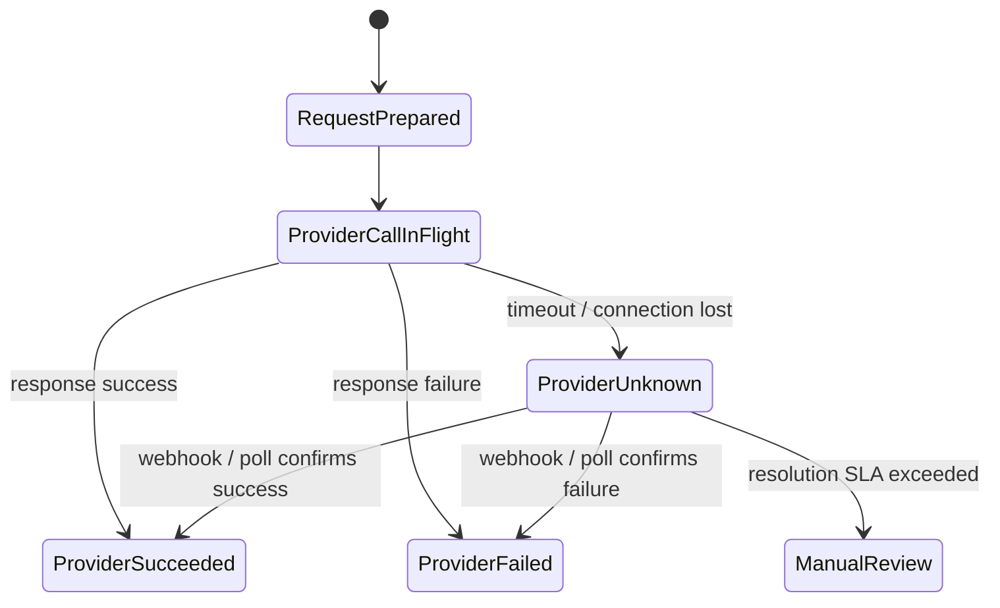

Konsekuensi desain:

- Timeout tidak boleh langsung dianggap gagal.
- Retry harus memakai idempotency key yang sama jika operation sama.
- Polling dan webhook repair harus tersedia.
- Manual review harus punya evidence trail.
- Order fulfillment harus tahu apakah boleh lanjut saat payment unknown.

Rule praktis:

> External timeout means “we do not know”, not “it failed”.

---

## 9. Ledger Truth vs Provider Truth

Provider truth menjawab:

> “Menurut provider/rail, operasi ini statusnya apa?”

Ledger truth menjawab:

> “Menurut pembukuan internal kita, hak dan kewajiban finansial apa yang sudah kita catat?”

Keduanya harus cocok pada akhirnya, tetapi tidak selalu sama pada saat yang sama.

Contoh payment sukses:

```text
Provider says: CHARGE_SUCCESS
Ledger posts:
  Dr Cash/Provider Clearing      100000
  Cr Merchant Payable             97000
  Cr Platform Fee Revenue          3000
```

Contoh refund:

```text
Provider says: REFUND_SUCCESS
Ledger posts:
  Dr Merchant Payable             100000
  Cr Cash/Provider Clearing       100000
```

Jika provider sukses tapi ledger gagal, kita punya financial incident. Solusinya bukan sekadar update status. Solusinya harus masuk repair/reconciliation workflow.

---

## 10. Double-Entry Ledger sebagai Tulang Punggung

Payment system tanpa ledger biasanya akan berakhir dengan spreadsheet reconciliation manual.

Ledger yang sehat menggunakan prinsip double-entry:

> Setiap journal harus balance: total debit sama dengan total credit.

Contoh customer membayar merchant 100.000, fee platform 3.000:

| Account | Debit | Credit |
|---|---:|---:|
| Provider Clearing / Cash Receivable | 100.000 | 0 |
| Merchant Payable | 0 | 97.000 |
| Platform Fee Revenue | 0 | 3.000 |

Total debit = 100.000. Total credit = 100.000.

Kenapa penting?

- Tidak ada uang yang muncul dari udara.
- Tidak ada uang yang hilang diam-diam.
- Setiap movement punya lawan akuntansi.
- Finance bisa audit tanpa membaca business code.
- Reconciliation punya basis data internal yang stabil.

Ledger bukan tabel transaksi biasa.

Tabel transaksi menjawab:

> “Apa yang terjadi?”

Ledger menjawab:

> “Dampak finansialnya apa?”

---

## 11. Payment System Minimal yang Masih Benar

Sistem minimal yang masih masuk akal untuk production bukan satu service `payment-service` dengan satu tabel `payments`.

Minimal mental architecture:

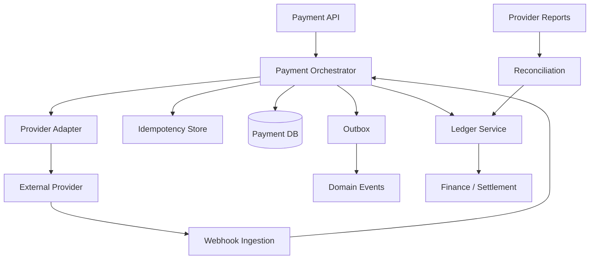

Komponen minimal:

1. **Payment API** menerima intent, confirm, capture, refund, cancel.
2. **Idempotency store** mengontrol retry dari client/service.
3. **Payment orchestrator** mengelola lifecycle dan provider interaction.
4. **Provider adapter** menormalisasi API eksternal.
5. **Webhook ingestion** menerima event eksternal secara aman.
6. **Ledger** mencatat financial impact secara immutable.
7. **Outbox/inbox** menjamin event tidak hilang.
8. **Reconciliation** membandingkan internal vs external truth.
9. **Backoffice** menangani exception, repair, dan approval.

---

## 12. The Payment Pyramid

Bayangkan payment system sebagai piramida:

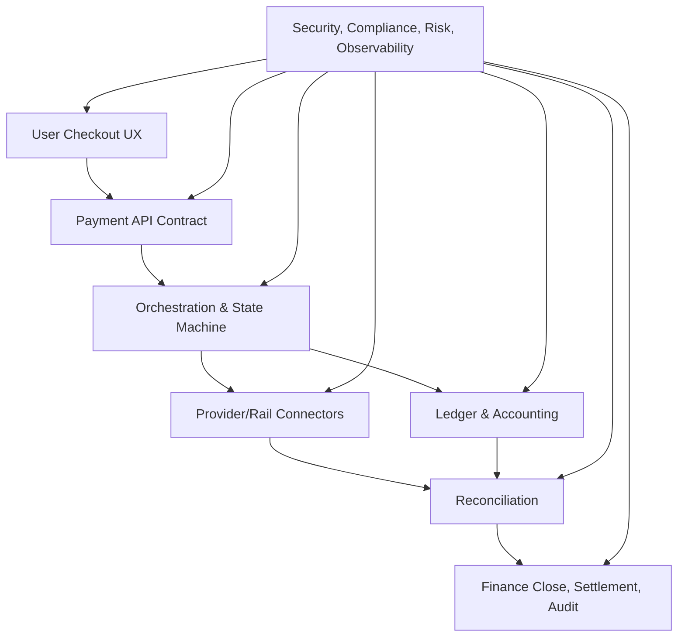

Lapisan atas tampak sederhana. Lapisan bawah menentukan apakah sistem bisa dipercaya.

Untuk demo, cukup UX dan API.

Untuk enterprise, yang mahal adalah:

- correctness,
- auditability,
- reconciliation,
- operational repair,
- risk controls,
- compliance boundaries,
- incident handling,
- settlement accuracy.

---

## 13. Payment Invariants

Payment system harus punya invariants. Invariant adalah kondisi yang harus selalu benar, bahkan saat retry, crash, timeout, duplicate webhook, race condition, atau operator action.

### 13.1 No Double Charge

Untuk satu business intent yang sama, customer tidak boleh ditagih dua kali karena retry teknis.

Implementasi nanti melibatkan:

- idempotency key,
- unique business reference,
- provider idempotency,
- database uniqueness,
- state transition guard,
- reconciliation repair.

### 13.2 No Lost Money

Setiap uang yang masuk, keluar, ditahan, atau dikoreksi harus tercatat.

Tidak boleh ada kondisi:

```text
provider settlement report contains transaction X
but internal system has no ledger impact and no exception record
```

Jika mismatch terjadi, harus menjadi reconciliation break yang terlihat.

### 13.3 No Silent Mutation

Financial record tidak boleh diubah diam-diam.

Jika salah, buat correction/reversal journal. Jangan update angka lama tanpa jejak.

### 13.4 Balance Must Be Explainable

Setiap balance harus bisa dijelaskan dari ledger entries.

```text
available_balance = settled_balance - holds - pending_debits + pending_credits - reserves
```

Jika angka balance hanya field mutable tanpa journal detail, sistem sulit diaudit.

### 13.5 External Unknown Must Be Resolved

Unknown state harus punya workflow resolusi.

Tidak boleh ada transaksi `PROCESSING` selamanya tanpa SLA, polling, webhook repair, reconciliation, atau manual review.

### 13.6 Settlement Must Be Reconciled

Setiap transaksi yang diakui sebagai settled harus punya evidence eksternal: settlement report, bank statement, scheme report, atau confirmation dari rail.

---

## 14. Failure Model: Cara Payment System Benar-Benar Rusak

Payment failure bukan hanya “provider down”. Ada beberapa kelas failure.

### 14.1 Synchronous Failure

Terjadi saat request-response.

Contoh:

- HTTP 400 karena payload salah.
- Decline dari issuer.
- Provider 500.
- Timeout.
- TLS error.

### 14.2 Asynchronous Failure

Terjadi setelah request awal.

Contoh:

- webhook terlambat,
- webhook duplikat,
- webhook out of order,
- provider mengubah status,
- settlement file tidak match.

### 14.3 Internal Persistence Failure

Provider sukses, tetapi internal gagal menyimpan state atau ledger.

Ini sangat berbahaya karena customer/provider melihat sukses, tetapi sistem internal kehilangan jejak.

### 14.4 Messaging Failure

Database sudah commit, tetapi event tidak terkirim. Atau event terkirim, consumer gagal.

Karena itu outbox/inbox wajib untuk payment-grade eventing.

### 14.5 Human Operation Failure

Operator bisa salah refund, salah manual adjustment, salah release hold, salah approve payout.

Sistem harus punya maker-checker, permission, reason code, evidence, dan audit trail.

### 14.6 Financial Report Failure

Settlement file salah parsing, timezone cutoff salah, FX rate salah, fee rule salah, rounding salah.

Ini jarang terlihat di demo, tetapi sering muncul di production.

---

## 15. Payment is a Distributed System with Legal/Financial Consequences

Distributed system biasa punya problem:

- retry,
- duplicate message,
- partial failure,
- ordering,
- stale read,
- idempotency,
- clock skew.

Payment system punya semua itu, ditambah:

- uang customer,
- kewajiban merchant,
- audit regulator,
- chargeback,
- AML/sanctions,
- PCI/security,
- finance close,
- legal dispute,
- reputational risk.

Jadi pendekatan “eventually consistent saja” terlalu kabur.

Yang benar:

> Payment boleh eventually consistent, tetapi setiap intermediate state harus eksplisit, terbatas, terukur, dan dapat direkonsiliasi.

---

## 16. State Machine: Bukan Enum Status Biasa

State machine payment harus menjawab:

1. State apa yang legal?
2. Transisi apa yang legal?
3. Command apa yang menyebabkan transisi?
4. Event eksternal apa yang boleh mengubah state?
5. Apakah transisi menghasilkan ledger journal?
6. Apakah transisi menghasilkan event?
7. Siapa yang boleh melakukan override?
8. Apa evidence-nya?

Contoh sederhana:

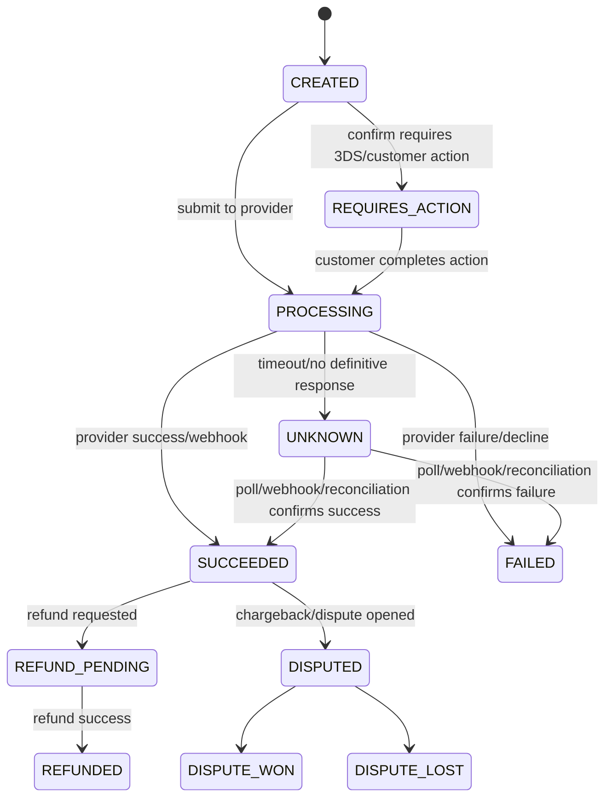

Rule penting:

- State transition harus atomic dengan audit log.
- State transition yang berdampak uang harus atomic dengan ledger intent atau journal posting.
- Event duplicate tidak boleh mengubah state dua kali.
- Event out-of-order harus disimpan sebagai evidence, bukan selalu diproses langsung.

---

## 17. Payment Aggregate vs Ledger Aggregate

Jangan jadikan `Payment` sebagai satu-satunya sumber truth.

Payment aggregate cocok untuk lifecycle orchestration:

```text
PaymentIntent
  id
  merchantId
  amount
  currency
  method
  status
  providerAttempts[]
  captures[]
  refunds[]
```

Ledger aggregate cocok untuk financial posting:

```text
Journal
  journalId
  businessRef
  journalType
  effectiveAt
  entries[]

Entry
  accountId
  direction: DEBIT | CREDIT
  amount
  currency
```

Keduanya berhubungan melalui business reference, bukan saling menggantikan.

Contoh:

```text
payment_intent_id = pi_123
capture_id = cap_456
ledger_journal.business_ref = cap_456
```

Kenapa tidak cukup payment table?

Karena satu payment bisa menghasilkan banyak financial events:

- authorization hold,
- capture,
- fee recognition,
- settlement,
- refund,
- dispute hold,
- chargeback loss,
- representment win,
- manual adjustment.

---

## 18. Payment Rail Berbeda, Domain Core Harus Stabil

Payment method berbeda punya detail berbeda:

| Rail | Real-time? | Reversible? | Needs customer action? | Settlement style |
|---|---:|---:|---:|---|
| Card | Authorization real-time | Ya, chargeback/refund | Kadang 3DS | Batch/net settlement |
| Bank transfer | Bergantung rail | Sulit/reversal terbatas | Ya | Statement/settlement report |
| Instant payment | Real-time/near real-time | Terbatas | Ya | Real-time or deferred net |
| QR | Real-time confirmation | Bergantung skema | Ya | Acquirer/aggregator settlement |
| Wallet | Real-time internal | Refund/reversal internal | Ya | Internal ledger + partner settlement |
| Payout | Bisa real-time/batch | Reversal sulit | Tidak selalu | Bank/rail report |

Rail berbeda, tetapi core domain tetap punya pola:

```text
instruction -> processing -> external result -> ledger impact -> reconciliation -> settlement/finalization
```

Jika core domain terlalu mengikuti satu provider, sistem sulit menambah method baru.

---

## 19. “Sukses” Selalu Harus Diberi Kualifikasi

Kata sukses harus selalu punya scope.

Lebih baik:

```text
provider_authorization_succeeded
capture_succeeded
ledger_posted
settlement_matched
refund_provider_accepted
refund_settled
payout_submitted
payout_bank_confirmed
```

Daripada:

```text
payment_success
```

Dalam API publik, kamu boleh menampilkan `succeeded` untuk pengalaman user, tetapi internal system harus lebih detail.

---

## 20. Contoh Timeline Nyata: Card Payment

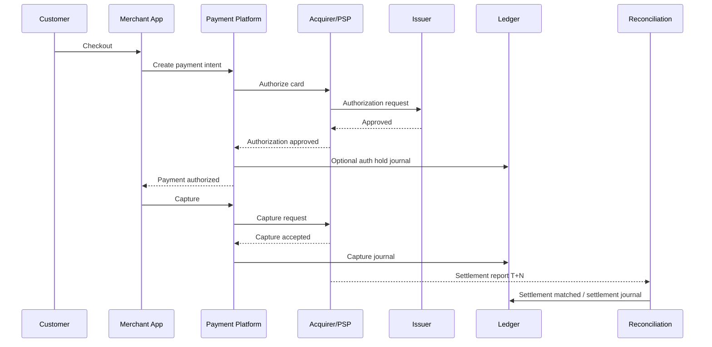

Yang tampak bagi customer mungkin hanya:

```text
Pay -> Success
```

Yang terjadi di sistem:

```text
Intent created -> auth approved -> capture submitted -> capture accepted -> ledger posted -> settlement pending -> settlement matched
```

---

## 21. Contoh Timeline Nyata: Virtual Account

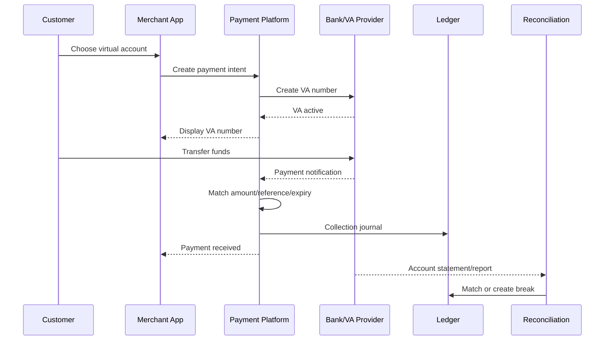

Masalah khas:

- customer bayar nominal salah,
- customer bayar setelah expiry,
- customer bayar dua kali,
- bank notification terlambat,
- statement menunjukkan credit tetapi webhook tidak pernah datang.

Tanpa reconciliation, kasus ini menjadi tiket manual yang melelahkan.

---

## 22. Contoh Timeline Nyata: Payout

Payout berbeda dari collection. Pada collection, platform menerima uang. Pada payout, platform mengirim uang.

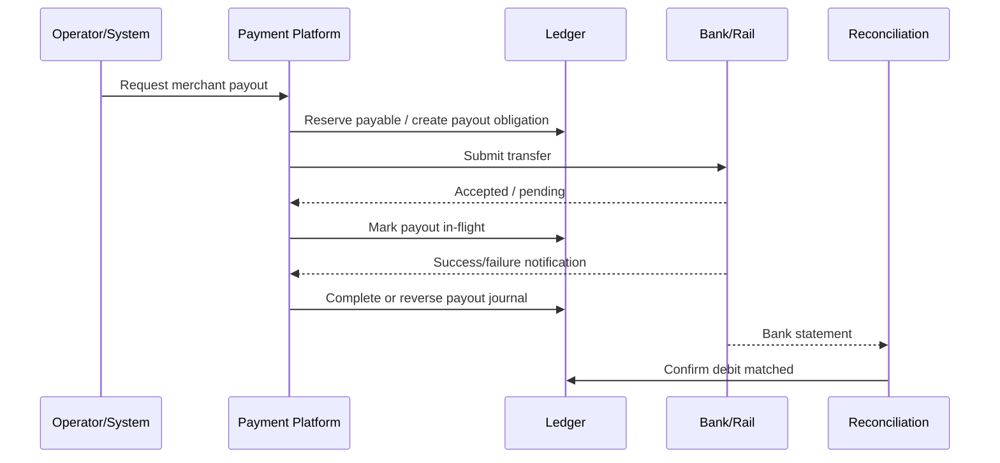

Payout risk lebih tinggi karena uang keluar. Kontrolnya biasanya lebih ketat:

- beneficiary validation,
- limit,
- approval,
- sanctions screening,
- balance sufficiency,
- duplicate detection,
- manual hold,
- maker-checker.

---

## 23. Idempotency: Bukan Sekadar “Jangan Duplicate Request”

Dalam payment, idempotency adalah kontrol finansial.

Skenario:

1. Client call `POST /payments/pi_123/confirm`.
2. Server call provider.
3. Provider berhasil charge.
4. Server crash sebelum response ke client.
5. Client retry.

Tanpa idempotency, retry bisa membuat charge kedua.

Idempotency harus punya beberapa lapisan:

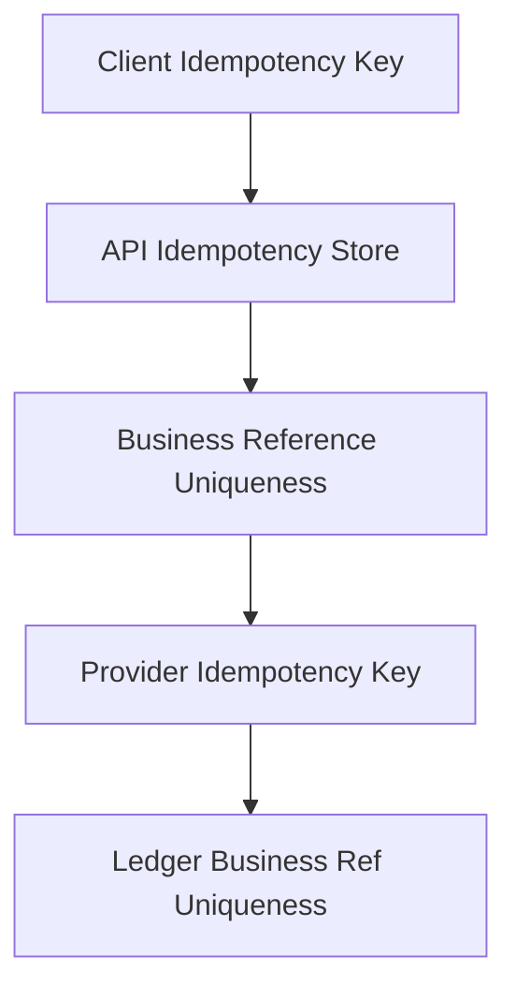

Prinsip:

- Operation yang sama harus memakai idempotency key yang sama.
- Payload mismatch dengan key sama harus ditolak.
- Result harus bisa replay ke client.
- Provider idempotency harus digunakan bila tersedia.
- Ledger journal harus unique berdasarkan business event.
- Idempotency window harus disesuaikan dengan lifecycle payment, bukan sekadar 5 menit.

---

## 24. Reconciliation: Sistem Kebenaran Akhir

Reconciliation bukan pekerjaan finance belakangan. Reconciliation adalah bagian inti payment platform.

Reconciliation membandingkan:

```text
internal payment records
internal ledger journals
provider transaction reports
settlement reports
bank statements
scheme dispute reports
```

Kemungkinan hasil:

| Internal | External | Meaning |
|---|---|---|
| Ada | Ada | Matched |
| Ada | Tidak ada | Missing external / unsettled / provider issue |
| Tidak ada | Ada | Missing internal / lost notification / manual credit |
| Ada amount A | Ada amount B | Amount mismatch / fee / FX / partial / error |
| Ada status success | Ada status reversed | Reversal / chargeback / late correction |

Production system tidak berharap semua selalu match. Production system memastikan mismatch terlihat, terklasifikasi, dan bisa diselesaikan.

---

## 25. Payment System sebagai Mesin Evidence

Payment system yang matang menyimpan evidence.

Evidence bisa berupa:

- request payload,
- response payload,
- signature verification result,
- webhook raw body,
- provider transaction id,
- authorization code,
- settlement report row,
- bank statement line,
- operator reason,
- approval record,
- device/risk signals,
- audit log,
- ledger journal id.

Tapi evidence tidak berarti sembarang data disimpan. Data sensitif seperti PAN, CVV, credential, atau private key harus dibatasi, ditokenisasi, atau tidak pernah masuk sistem sesuai scope keamanan.

Payment engineering adalah seni menyimpan cukup evidence untuk audit dan debugging tanpa memperluas blast radius data sensitif.

---

## 26. Compliance is Architecture

Compliance bukan bagian “nanti”. Compliance mengubah arsitektur.

Contoh:

- Jika menyentuh cardholder data, PCI scope membesar.
- Jika menyimpan PAN, kamu butuh proteksi sangat ketat, segmentasi, logging terbatas, key management, dan proses audit.
- Jika melakukan payout lintas negara, screening dan regulatory reporting bisa masuk.
- Jika menyimpan wallet/stored value, model accounting dan izin regulasi bisa berubah.
- Jika menerima open API payment di Indonesia, standar seperti SNAP bisa memengaruhi signature, timestamp, access token, dan contract.

PCI Security Standards Council menerbitkan PCI DSS v4.0.1 sebagai revisi terbatas yang mengklarifikasi requirement/guidance tanpa menambah atau menghapus requirement. Ini penting karena arsitektur card payment harus mengikuti standar aktif, bukan kebiasaan lama. Lihat referensi resmi di akhir file.

---

## 27. ISO 20022 dan Payment Message Thinking

Walau kita tidak langsung membangun payment rail, engineer payment perlu memahami bahwa dunia pembayaran modern bergerak ke message model yang kaya data.

ISO 20022 penting karena:

- memakai struktur pesan yang lebih kaya dibanding banyak format lama,
- membantu straight-through processing,
- dipakai dalam banyak inisiatif pembayaran modern,
- menjadi bahasa umum untuk payment instruction, status, return, dan reporting.

Contoh mental model message:

```text
pain.001  customer credit transfer initiation
pacs.008  FI to FI customer credit transfer
pacs.002  payment status report
camt.053  bank statement
camt.054  debit/credit notification
```

Kamu tidak perlu menghafal semua message di awal. Yang penting: payment system enterprise harus mampu berpikir dalam bentuk instruction, status, report, return, dan reconciliation message.

---

## 28. Java Payment Platform: Cara Kita Akan Membangun

Dalam seri ini, kita akan membangun secara konseptual dan teknis dengan Java.

Tapi Java di sini bukan tujuan. Java adalah alat untuk menjaga invariants.

Kita akan memakai pola:

```text
API contract -> command model -> state transition -> provider operation -> ledger posting -> outbox event -> reconciliation -> operational repair
```

Nanti tiap bagian akan diterjemahkan ke:

- package/module boundary,
- database schema,
- aggregate model,
- service boundary,
- transaction boundary,
- idempotency implementation,
- state transition guard,
- ledger posting rule,
- event model,
- testing strategy.

---

## 29. Boundary Penting yang Harus Diingat dari Awal

### 29.1 Payment Service Tidak Sama dengan Ledger Service

Payment service mengatur lifecycle. Ledger service mencatat dampak finansial.

Boleh berada dalam monolith modular di awal, tetapi boundary konseptual harus dipisah.

### 29.2 Provider Adapter Tidak Boleh Bocor ke Domain Core

Provider A punya status `CAPTURED`, provider B punya `PAID`, provider C punya `SETTLED`. Domain core harus punya normalized state yang stabil.

### 29.3 Webhook Tidak Boleh Langsung Mengubah Order Tanpa Guard

Webhook harus diverifikasi, dideduplicate, disimpan, lalu diproses melalui state machine.

### 29.4 Ledger Tidak Boleh Mutable

Jika salah, buat reversal/correction. Jangan edit historical journal tanpa jejak.

### 29.5 Backoffice Adalah Core System

Payment production selalu punya exception. Backoffice bukan fitur admin sederhana; ia adalah operational safety system.

---

## 30. Anti-Pattern yang Harus Dihindari

### Anti-Pattern 1: `payment_status = SUCCESS`

Satu status untuk semua perspektif membuat sistem tidak bisa menjawab status settlement, ledger, refund, dispute, dan reconciliation.

### Anti-Pattern 2: Provider Response sebagai Source of Truth Tunggal

Provider bisa timeout, terlambat, berubah status, atau salah kirim webhook. Provider truth harus direkonsiliasi.

### Anti-Pattern 3: Tidak Ada Ledger

Tanpa ledger, balance dihitung dari tabel transaksi mutable. Ini sulit diaudit dan sulit diperbaiki.

### Anti-Pattern 4: Retry Tanpa Idempotency

Ini resep double charge.

### Anti-Pattern 5: Webhook Dipercaya Tanpa Verification dan Deduplication

Webhook adalah input eksternal. Ia harus dianggap tidak terurut, bisa duplikat, dan harus diverifikasi.

### Anti-Pattern 6: Manual DB Update untuk Repair

Manual SQL update mungkin menyelesaikan tiket hari ini, tetapi menghancurkan audit trail besok.

### Anti-Pattern 7: Reconciliation sebagai Spreadsheet Manual

Spreadsheet boleh menjadi alat investigasi, bukan sistem kontrol utama.

---

## 31. Payment Mental Model Ringkas

Simpan model ini:

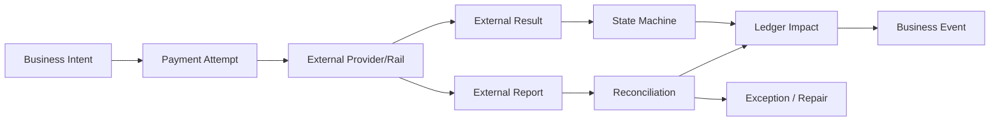

Artinya:

1. Business intent datang dari domain: order, invoice, top-up, subscription, payout.
2. Payment attempt membawa intent ke external provider/rail.
3. Provider result bisa success, failed, pending, atau unknown.
4. State machine mengontrol lifecycle.
5. Ledger mencatat dampak uang.
6. Events memberi tahu sistem lain.
7. External report menjadi bukti dunia luar.
8. Reconciliation menjaga internal truth dan external truth tetap selaras.
9. Exception/repair adalah bagian normal, bukan failure memalukan.

---

## 32. Latihan Mental Model

Jawab tanpa kode dulu.

### Case 1 — Timeout Saat Charge

Kamu call provider untuk charge kartu. Provider timeout. Customer menekan tombol pay lagi.

Pertanyaan:

- State payment pertama apa?
- Apakah boleh membuat provider charge baru?
- Idempotency key mana yang dipakai?
- Bagaimana sistem tahu charge pertama sukses/gagal?
- Apa yang order service lihat?

Jawaban ideal:

- State pertama menjadi `UNKNOWN` atau `PROCESSING_WITH_UNKNOWN_OUTCOME`.
- Tidak boleh membuat operation baru untuk business intent yang sama tanpa resolution.
- Retry memakai key yang sama.
- Sistem resolve via webhook, polling, provider lookup, atau reconciliation.
- Order service melihat payment belum final, kecuali business policy membolehkan fulfillment risk.

### Case 2 — Webhook Sukses Datang Dua Kali

Provider mengirim webhook `payment.succeeded` dua kali.

Pertanyaan:

- Apakah ledger diposting dua kali?
- Bagaimana deduplication dilakukan?
- Apakah raw webhook kedua disimpan?

Jawaban ideal:

- Ledger tidak boleh diposting dua kali.
- Dedup bisa memakai provider event id, provider transaction id + event type, dan business transition guard.
- Raw webhook kedua boleh disimpan sebagai evidence dengan status duplicate/ignored.

### Case 3 — Settlement Report Missing

Internal mencatat payment sukses 100.000, tetapi settlement report provider tidak mencantumkan transaksi itu.

Pertanyaan:

- Apakah payment langsung dibatalkan?
- Apakah ledger langsung direverse?
- Siapa yang harus melihat break ini?

Jawaban ideal:

- Tidak langsung dibatalkan tanpa evidence tambahan.
- Ledger tidak direverse otomatis kecuali rule dan evidence mendukung.
- Reconciliation membuat break untuk finance/ops/provider investigation.

### Case 4 — Refund Sukses Provider, Ledger Gagal

Provider menerima refund, tetapi ledger posting gagal karena bug internal.

Pertanyaan:

- Apakah refund dianggap sukses?
- Bagaimana customer communication?
- Apa repair yang benar?

Jawaban ideal:

- Secara external refund mungkin sukses, tetapi internal financial posting belum lengkap.
- Customer bisa diberi status sesuai policy, tetapi internal incident harus tercatat.
- Repair harus membuat ledger journal idempotent berdasarkan refund business reference, bukan manual update balance.

---

## 33. Checklist Pemahaman Sebelum Lanjut

Kamu siap lanjut ke Part 002 jika bisa menjawab:

- Apa bedanya provider status dan ledger status?
- Kenapa timeout bukan failure final?
- Kenapa settlement report lebih penting daripada webhook untuk finance close?
- Kenapa satu payment bisa menghasilkan banyak journal?
- Kenapa double-entry ledger membantu debugging?
- Kenapa backoffice bukan fitur tambahan?
- Kenapa payment state machine harus menyimpan evidence?

Jika belum, ulangi bagian failure model, unknown state, dan ledger truth.

---

## 34. Referensi Resmi dan Bacaan Lanjutan

Referensi berikut dipakai sebagai orientasi standar/ekosistem, bukan sebagai satu-satunya desain implementasi:

- PCI Security Standards Council — “Just Published: PCI DSS v4.0.1”  
  https://blog.pcisecuritystandards.org/just-published-pci-dss-v4-0-1
- Swift — “ISO 20022 for Financial Institutions: focus on payments instructions”  
  https://www.swift.com/standards/iso-20022/iso-20022-financial-institutions-focus-payments-instructions
- Federal Reserve Financial Services — “The FedNow Service and ISO 20022”  
  https://www.frbservices.org/financial-services/fednow/what-is-iso-20022-why-does-it-matter
- EMVCo — “EMV® 3-D Secure”  
  https://www.emvco.com/emv-technologies/3-d-secure/
- Bank Indonesia — “Quick Response Code Indonesian Standard (QRIS)”  
  https://www.bi.go.id/en/fungsi-utama/sistem-pembayaran/ritel/kanal-layanan/qris/default.aspx
- Bank Indonesia — “BI-FAST” infrastructure overview  
  https://www.bi.go.id/id/fungsi-utama/sistem-pembayaran/ritel/infrastruktur/default.aspx
- Bank Indonesia — “National Open API Payment Standard (SNAP)”  
  https://www.bi.go.id/en/layanan/standar/snap/default.aspx
- Bank Indonesia — “Blueprint Sistem Pembayaran Indonesia 2030”  
  https://www.bi.go.id/id/fungsi-utama/sistem-pembayaran/blueprint/default.aspx

---

## 35. Penutup Part 001

Payment system yang benar dimulai dari mental model ini:

> Payment bukan request-response. Payment adalah lifecycle finansial yang harus dikontrol dari niat bisnis sampai settlement, reconciliation, audit, dan koreksi.

Di part berikutnya kita akan membangun peta ekosistem: siapa saja aktornya, apa tanggung jawabnya, siapa memegang uang, siapa memegang risiko, siapa memberi status, dan kenapa desain platform pembayaran harus selalu jelas tentang boundary antar pihak.
