------
title: Build From Scratch: Large Production Grade Java Payment Systems - Part 002
description: Peta ekosistem payment system enterprise: merchant, customer, PSP, acquirer, issuer, scheme, bank, wallet, regulator, risk, finance, settlement, dan boundary arsitektur.
series: learn-java-payment-systems
seriesTitle: Build From Scratch: Large Production Grade Java Payment Systems
order: 2
partTitle: Payment Ecosystem Map
tags:
- java
- payments
- payment-ecosystem
- psp
- acquirer
- issuer
- banking
- fintech
- enterprise-architecture
date: 2026-07-02
---

# Part 002 — Payment Ecosystem Map

Payment system tidak hidup sendirian. Ia berada di tengah jaringan aktor: customer, merchant, PSP, acquirer, issuer, scheme, bank, wallet, regulator, fraud vendor, settlement partner, finance team, support team, dan kadang payment facilitator atau marketplace platform.

Kalau Part 001 membangun mental model lifecycle uang, Part 002 membangun peta aktor dan boundary.

Kenapa ini penting?

Karena banyak bug desain payment muncul bukan karena salah kode, tetapi karena salah memahami siapa yang bertanggung jawab atas apa.

Contoh:

- Platform menganggap provider status final, padahal settlement dilakukan pihak lain.
- Merchant menganggap refund langsung mengembalikan uang, padahal rail butuh beberapa hari.
- Engineer menganggap customer sudah “membayar”, padahal baru authorization hold.
- Finance menganggap balance merchant tersedia, padahal masih ada reserve atau dispute exposure.
- Product menganggap semua payment method punya lifecycle sama, padahal card, VA, QR, wallet, dan payout punya karakter berbeda.

Di payment, boundary adalah desain inti.

---

## 1. Tujuan Part Ini

Setelah bagian ini, kamu harus bisa:

1. Memetakan aktor utama dalam payment ecosystem.
2. Membedakan role PSP, gateway, acquirer, issuer, scheme, bank, wallet, dan merchant-of-record.
3. Menjelaskan aliran informasi, aliran uang, dan aliran risiko.
4. Mendesain boundary Java services berdasarkan tanggung jawab, bukan berdasarkan nama provider.
5. Menghindari vendor-coupled domain model.
6. Menentukan data apa yang berasal dari customer, merchant, provider, bank, ledger, dan reconciliation.

---

## 2. Model Besar Ekosistem Payment

Peta paling sederhana:

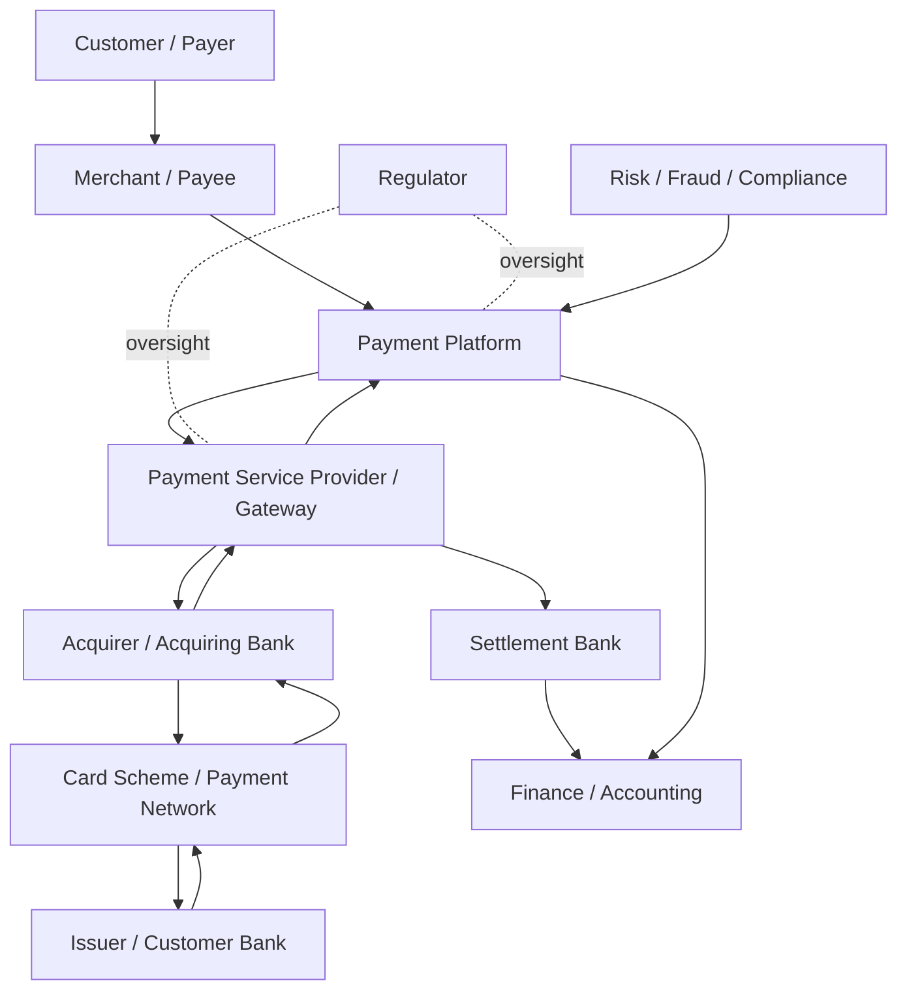

Model ini masih menyederhanakan. Dalam production, satu pembayaran bisa melewati beberapa layer tambahan:

- payment facilitator,
- sub-merchant,
- marketplace seller,
- fraud scoring provider,
- token vault,
- 3DS server,
- directory server,
- issuer ACS,
- settlement processor,
- reconciliation file delivery,
- chargeback management portal,
- AML screening provider.

Tapi peta dasar di atas cukup untuk mulai.

---

## 3. Tiga Aliran yang Harus Selalu Dipisah

Dalam ekosistem payment, jangan hanya melihat API call. Pisahkan tiga aliran:

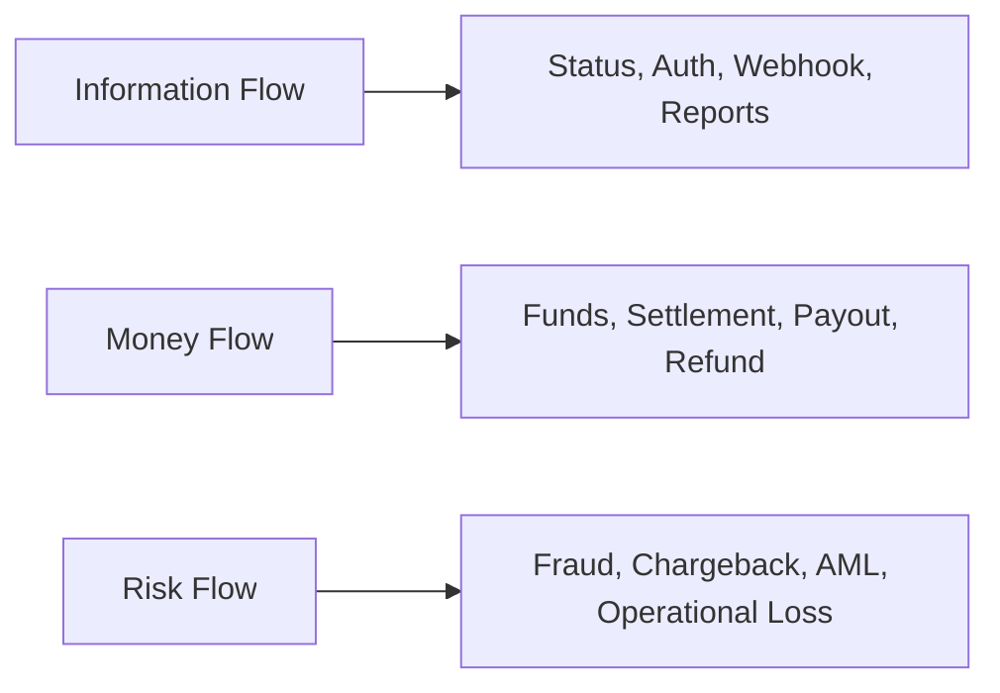

### 3.1 Information Flow

Information flow adalah pesan:

- create payment,
- authorize,
- capture,
- notify paid,
- payment status,
- settlement file,
- dispute notice,
- refund confirmation.

Information flow cepat, kadang real-time.

### 3.2 Money Flow

Money flow adalah perpindahan dana aktual atau net settlement.

Money flow bisa lebih lambat daripada information flow.

Customer bisa melihat transaksi sukses hari ini, tetapi merchant menerima settlement besok atau beberapa hari kemudian.

### 3.3 Risk Flow

Risk flow adalah siapa menanggung risiko saat terjadi:

- fraud,
- chargeback,
- customer complaint,
- settlement failure,
- AML hit,
- provider outage,
- wrong beneficiary payout,
- duplicated charge,
- insufficient merchant balance for refund.

Risk flow sering tidak terlihat di API, tetapi menentukan ledger, reserve, dan operational control.

---

## 4. Aktor 1 — Customer / Payer

Customer adalah pihak yang menginisiasi pembayaran atau pemilik dana/instrument.

Customer bisa berupa:

- cardholder,
- bank account holder,
- wallet user,
- buyer marketplace,
- corporate payer,
- user internal wallet.

Data penting dari customer:

```text
customer_id
payer_reference
payment_method_reference
billing information
shipping information
device/risk signals
consent / authentication evidence
```

Yang harus diingat:

- Customer experience tidak selalu sama dengan financial finality.
- Customer bisa membatalkan, dispute, refund request, atau melakukan chargeback.
- Customer identity bisa berbeda dari payer instrument owner.
- Customer action bisa asynchronous: 3DS challenge, QR scan, bank transfer, wallet approval.

### Engineering Implication

Payment API tidak boleh menganggap semua method synchronous.

Desain response harus bisa mengembalikan:

```json
{
  "paymentIntentId": "pi_123",
  "status": "REQUIRES_ACTION",
  "nextAction": {
    "type": "REDIRECT",
    "url": "https://provider.example/checkout/session/abc"
  }
}
```

atau:

```json
{
  "paymentIntentId": "pi_456",
  "status": "PENDING_CUSTOMER_PAYMENT",
  "nextAction": {
    "type": "DISPLAY_VIRTUAL_ACCOUNT",
    "bankCode": "BCA",
    "accountNumber": "1234567890",
    "expiresAt": "2026-07-02T10:00:00+07:00"
  }
}
```

---

## 5. Aktor 2 — Merchant / Payee

Merchant adalah pihak yang menerima pembayaran atau memiliki claim terhadap dana.

Merchant bisa berupa:

- toko ecommerce,
- seller marketplace,
- biller,
- SaaS vendor,
- platform merchant,
- internal business unit,
- sub-merchant di bawah payment facilitator.

Pertanyaan penting:

1. Apakah merchant menerima dana langsung dari acquirer/provider?
2. Apakah platform menahan dana lalu melakukan settlement ke merchant?
3. Apakah platform adalah merchant of record?
4. Apakah merchant bisa punya negative balance?
5. Apakah merchant terkena reserve, rolling reserve, atau settlement hold?
6. Siapa menanggung chargeback?

### Merchant Balance Model

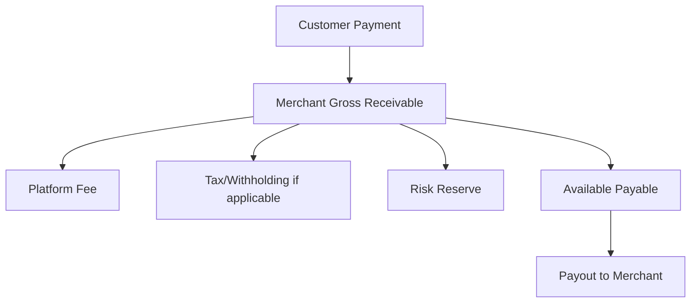

Merchant bukan hanya field `merchant_id`. Merchant adalah financial counterparty.

### Engineering Implication

Merchant service harus menyediakan atribut payment-relevant:

```text
merchant_id
country
business_type
settlement_currency
settlement_schedule
capabilities
risk_tier
payment_method_enabled
payout_enabled
reserve_policy
fee_plan
kyb_status
compliance_status
```

Jangan simpan semua ini sebagai hardcoded config di payment service. Buat boundary capability/config yang jelas.

---

## 6. Aktor 3 — Payment Platform

Payment platform adalah sistem yang kita bangun.

Ia bisa berperan sebagai:

- payment gateway internal,
- payment orchestrator,
- payment facilitator,
- marketplace payment platform,
- wallet platform,
- payout platform,
- ledger and reconciliation platform.

Dalam seri ini, kita membangun payment platform enterprise dengan capability berikut:

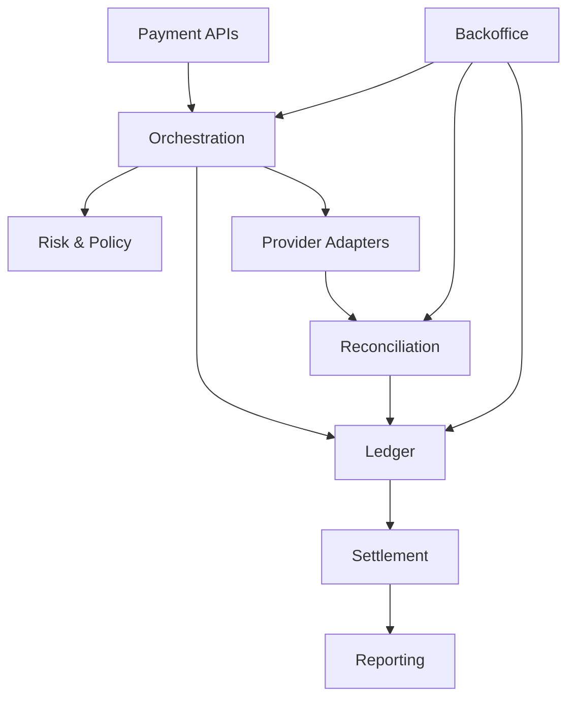

Payment platform harus menjaga boundary antara:

- customer-facing status,
- merchant-facing status,
- provider-facing status,
- ledger truth,
- finance truth,
- risk/compliance decision,
- operational repair.

---

## 7. Aktor 4 — Payment Gateway / PSP

Payment gateway atau PSP menyediakan interface untuk menerima/memproses payment method.

Peran PSP bisa mencakup:

- payment page/session,
- card tokenization,
- card authorization/capture,
- VA creation,
- QR payment generation,
- wallet integration,
- payout/disbursement,
- webhook notification,
- settlement report,
- fraud checks,
- recurring billing,
- dispute tools.

Namun PSP tidak selalu sama dengan acquirer.

### Gateway vs PSP vs Acquirer

| Role | Fungsi Utama | Memegang Settlement? | Contoh Tanggung Jawab |
|---|---|---:|---|
| Gateway | Technical routing/API | Tidak selalu | Submit transaction, normalize response |
| PSP | Payment service layer | Kadang | Methods, reporting, merchant tools |
| Acquirer | Acquiring financial institution | Ya untuk card acquiring flow | Merchant acquiring, card network access |
| Processor | Technical processor | Tidak selalu | Authorization processing, batch, files |

Dalam beberapa perusahaan, satu vendor bisa memainkan beberapa role sekaligus. Dalam desain internal, tetap pisahkan role konseptualnya.

### Engineering Implication

Jangan beri nama domain class berdasarkan vendor:

```java
// buruk untuk domain core
XenditPaymentStatus
StripeChargeState
MidtransTransactionStatus
```

Gunakan adapter layer:

```text
ProviderRawStatus -> ProviderNormalizedStatus -> DomainTransition
```

Contoh:

```text
Provider A: CAPTURED       -> AUTHORIZATION_CAPTURED
Provider B: paid           -> PAYMENT_CONFIRMED
Provider C: settlement     -> SETTLED_BY_PROVIDER
Provider D: expire         -> EXPIRED
```

---

## 8. Aktor 5 — Acquirer

Acquirer adalah pihak yang memungkinkan merchant menerima pembayaran kartu atau payment network tertentu. Dalam card ecosystem, acquirer berhubungan dengan merchant dan card scheme.

Peran acquirer:

- onboarding merchant untuk acceptance,
- mengirim authorization/capture ke network,
- menerima settlement dari scheme,
- menyalurkan dana ke merchant/PSP/platform,
- mengelola chargeback/dispute flow,
- menerapkan risk controls.

Dalam banyak integrasi modern, platform tidak bicara langsung ke acquirer, tetapi melalui PSP/processor.

### Engineering Implication

Walau tidak direct integration, konsep acquirer penting untuk memahami:

- merchant category code,
- settlement timing,
- MDR/fee,
- chargeback liability,
- card acceptance rules,
- merchant underwriting,
- scheme compliance.

Jika kamu membangun platform marketplace/payment facilitator, acquirer relationship bisa menentukan bagaimana sub-merchant didaftarkan dan siapa yang menjadi merchant of record.

---

## 9. Aktor 6 — Issuer

Issuer adalah bank/lembaga penerbit instrument customer.

Untuk kartu, issuer menerbitkan kartu kepada cardholder.

Issuer menentukan:

- authorization approve/decline,
- available credit/balance,
- risk decision,
- 3DS challenge behavior,
- chargeback initiation dari sisi cardholder,
- refund posting ke customer.

### Engineering Implication

Ketika transaksi ditolak, decline reason sering berasal dari issuer dan tidak selalu detail.

Contoh decline:

```text
insufficient_funds
suspected_fraud
do_not_honor
expired_card
incorrect_cvv
restricted_card
issuer_unavailable
```

Sistem harus membedakan:

- decline final,
- decline retriable,
- decline karena authentication,
- decline karena provider/network unavailable,
- decline yang sebaiknya tidak diperlihatkan terlalu detail ke user demi security.

---

## 10. Aktor 7 — Card Scheme / Payment Network

Card scheme/payment network menghubungkan acquirer dan issuer serta menetapkan rule interoperabilitas.

Peran scheme:

- routing authorization,
- clearing/settlement rule,
- dispute rule,
- chargeback reason code,
- tokenization/network token rule,
- 3DS ecosystem rule,
- acceptance standard.

Untuk card-not-present payment, EMV 3DS membantu issuer dan merchant meningkatkan keamanan transaksi ecommerce dan mengurangi fraud card-not-present. Detail spesifikasi resmi dikelola EMVCo.

### Engineering Implication

Card payment platform harus memodelkan:

```text
authorization_id
auth_code
network_transaction_id
scheme
card_brand
issuer_country
bin / iin range metadata
3ds_result
liability_shift
chargeback_reason_code
```

Tidak semua field tersedia dari semua PSP, tetapi domain harus bisa menampung evidence ketika tersedia.

---

## 11. Aktor 8 — Bank / Settlement Bank

Bank bisa berperan sebagai:

- account holding bank,
- settlement bank,
- payout bank,
- issuing bank,
- acquiring bank,
- virtual account bank,
- sponsor bank,
- operational treasury bank.

Dalam payment platform, bank statement adalah salah satu external truth paling penting.

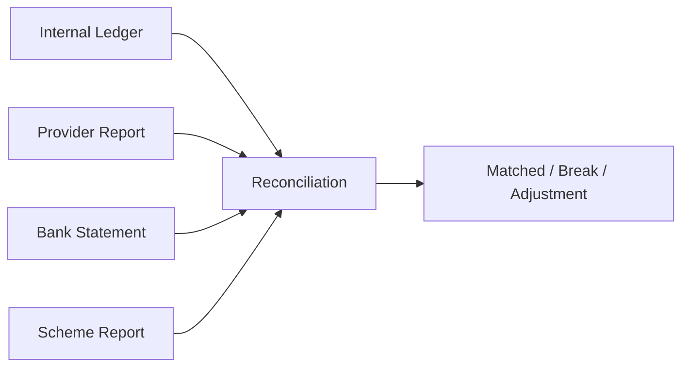

### Engineering Implication

Bank integration sering memakai:

- API,
- host-to-host file,
- SFTP,
- statement file,
- ISO 20022 camt messages,
- proprietary CSV/fixed-width.

Sistem harus siap menghadapi:

- cutoff date,
- timezone,
- duplicate statement line,
- reversed line,
- fee line,
- bank reference mismatch,
- delayed posting,
- missing report.

---

## 12. Aktor 9 — Wallet / Stored Value Provider

Wallet/stored value system berbeda dari pure gateway karena bisa memiliki internal balance.

Pertanyaan kunci:

- Apakah balance customer disimpan di platform?
- Apakah dana customer disimpan sebagai float/safeguarded funds?
- Apakah top-up dan spend terjadi di ledger internal?
- Apakah withdrawal/payout ke bank didukung?
- Apakah wallet balance transferable?
- Apakah ada regulatory requirement khusus?

### Wallet Flow

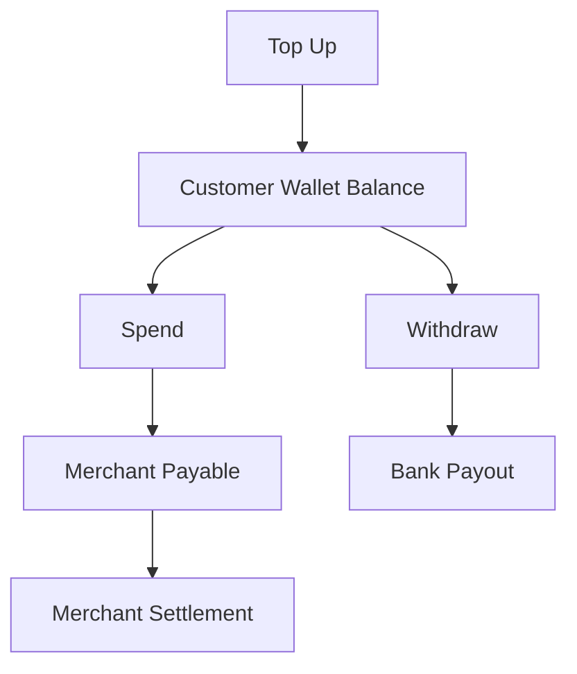

Wallet membutuhkan ledger yang lebih ketat karena platform memegang balance customer/merchant secara eksplisit.

---

## 13. Aktor 10 — Regulator

Regulator tidak selalu berada di data path request-response, tetapi regulator memengaruhi arsitektur.

Regulator dapat mengatur:

- licensing,
- payment method operation,
- data localization,
- reporting,
- AML/CFT,
- consumer protection,
- dispute handling,
- open API standard,
- settlement rule,
- operational resilience,
- cybersecurity.

Dalam konteks Indonesia, Bank Indonesia mengatur ekosistem sistem pembayaran termasuk QRIS, BI-FAST, SNAP, dan BSPI 2030. QRIS mengakomodasi Merchant Presented Mode dan Consumer Presented Mode. BI-FAST adalah infrastruktur pembayaran ritel nasional yang real-time, aman, efisien, dan tersedia 24/7. SNAP adalah standar nasional Open API pembayaran untuk industri sistem pembayaran. BSPI 2030 memiliki lima inisiatif 4I-RD: Infrastruktur, Industri, Inovasi, Internasional, dan Rupiah Digital.

### Engineering Implication

Regulatory requirement biasanya berubah menjadi requirement teknis:

| Regulatory Need | Technical Consequence |
|---|---|
| Auditability | Immutable logs, evidence, maker-checker |
| Data protection | Encryption, tokenization, masking, access control |
| Open API standard | Signature, timestamp, token, schema compliance |
| Consumer protection | Complaint/dispute workflow, SLA, notification |
| AML/CFT | Screening, monitoring, reporting, hold/release |
| Operational resilience | DR, monitoring, incident report, RTO/RPO |

---

## 14. Aktor 11 — Fraud, Risk, and Compliance Team

Risk team menentukan apakah transaksi boleh diproses, ditahan, ditolak, atau direview manual.

Risk input:

- customer history,
- merchant risk tier,
- amount,
- payment method,
- velocity,
- device fingerprint,
- IP/geolocation,
- BIN country,
- shipping/billing mismatch,
- refund behavior,
- dispute history,
- sanctions/PEP screening,
- merchant category.

Risk output:

```text
ALLOW
BLOCK
REVIEW
HOLD_SETTLEMENT
REQUIRE_3DS
LIMIT_PAYMENT_METHOD
DELAY_PAYOUT
```

### Engineering Implication

Risk decision harus disimpan sebagai evidence:

```text
risk_decision_id
policy_version
input_snapshot_hash
decision
reason_codes
decided_at
expires_at
manual_reviewer_id
```

Jangan hanya menyimpan `risk_passed = true`.

Payment decisions harus bisa dijelaskan saat audit, dispute, atau incident.

---

## 15. Aktor 12 — Finance and Accounting

Finance membaca payment system bukan sebagai “status transaksi”, tetapi sebagai hak, kewajiban, pendapatan, biaya, pajak, reserve, settlement, dan exception.

Finance membutuhkan:

- gross amount,
- fee amount,
- tax amount,
- net amount,
- settlement amount,
- outstanding receivable/payable,
- aging,
- merchant statement,
- reconciliation breaks,
- adjustment history,
- dispute exposure,
- revenue recognition support.

### Engineering Implication

Payment platform harus menyediakan reporting berdasarkan ledger, bukan hanya payment rows.

Contoh laporan merchant:

```text
Opening balance
+ Collections
- Refunds
- Fees
- Chargebacks
- Reserve hold
+ Reserve release
- Payouts
= Closing balance
```

Jika sistem tidak bisa menjelaskan closing balance dari journal entries, finance akan membuat shadow accounting di spreadsheet.

Itu tanda arsitektur payment belum matang.

---

## 16. Aktor 13 — Operations / Support / Backoffice

Payment production selalu punya exception.

Backoffice harus bisa menangani:

- payment unknown,
- customer paid but order unpaid,
- duplicate payment,
- wrong amount,
- expired VA paid,
- refund stuck,
- payout failed,
- provider mismatch,
- settlement break,
- chargeback,
- manual adjustment,
- merchant complaint,
- suspicious activity.

### Backoffice Bukan CRUD Admin

Backoffice payment harus punya:

```text
case management
action permissions
maker-checker approval
reason code
evidence attachment
audit log
action preview
ledger impact preview
reversal/correction workflow
SLA tracking
```

Jika operator bisa langsung edit `payment.status` di database, sistem tidak defensible.

---

## 17. Merchant of Record

Merchant of Record adalah pihak yang secara legal menjual produk/jasa kepada customer dan bertanggung jawab atas transaksi tersebut.

Ini penting karena menentukan:

- nama yang muncul di statement customer,
- siapa menanggung chargeback,
- siapa bertanggung jawab terhadap refund,
- siapa mengakui revenue,
- siapa punya hubungan acquiring,
- pajak dan invoice model,
- compliance obligation.

### Model 1 — Merchant Direct

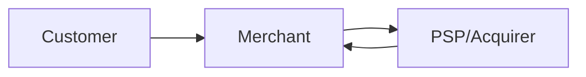

Merchant adalah merchant of record. Platform hanya menyediakan software.

### Model 2 — Platform as Merchant of Record

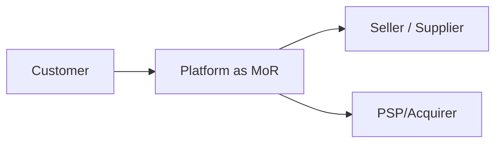

Platform menanggung lebih banyak kewajiban.

### Model 3 — Payment Facilitator / Sub-Merchant

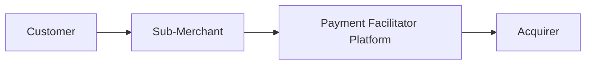

Platform memfasilitasi banyak sub-merchant di bawah arrangement tertentu.

### Engineering Implication

Domain model harus punya konsep:

```text
merchant_id
merchant_of_record_id
sub_merchant_id
settlement_party_id
fee_bearer
chargeback_liability_party
refund_liability_party
statement_descriptor
```

Tanpa ini, marketplace dan payment facilitator logic akan kacau.

---

## 18. Source of Truth Matrix

Salah satu alat desain paling kuat adalah matrix source of truth.

| Data | Source of Truth | Notes |
|---|---|---|
| Customer order | Commerce/order service | Payment tidak menentukan isi order |
| Payment lifecycle | Payment orchestrator | Status domain internal |
| Provider status | Provider adapter + raw event store | Tidak langsung menjadi ledger truth |
| Financial impact | Ledger | Immutable journal |
| Settlement confirmation | Provider/bank/scheme report | Perlu reconciliation |
| Merchant balance | Ledger + balance projection | Projection boleh rebuild |
| Risk decision | Risk/policy engine | Simpan policy version/evidence |
| Refund eligibility | Payment + ledger + merchant policy | Jangan hanya provider status |
| Payout eligibility | Ledger + risk + merchant config | Balance dan controls |
| Compliance status | Compliance/KYB system | Payment memakai capability |

Matrix ini mencegah satu service menjadi “tuhan” untuk semua hal.

---

## 19. Capability-Based Merchant Model

Payment method tidak boleh sekadar boolean global.

Gunakan capability model:

```text
merchant_capability
  merchant_id
  capability_type: CARD_PAYIN | QRIS_PAYIN | VA_PAYIN | WALLET_TOPUP | PAYOUT | REFUND | SUBSCRIPTION
  status: REQUESTED | ACTIVE | DISABLED | SUSPENDED | REJECTED
  limits
  currency
  country
  provider_route
  risk_conditions
  effective_from
  effective_until
```

Kenapa?

Karena merchant bisa:

- boleh menerima QRIS tapi belum boleh card,
- boleh refund tapi tidak boleh payout,
- punya limit harian,
- terkena hold karena chargeback tinggi,
- punya provider route berbeda,
- butuh KYB tambahan untuk capability tertentu.

---

## 20. Payment Method Taxonomy

Payment method perlu taxonomy yang eksplisit.

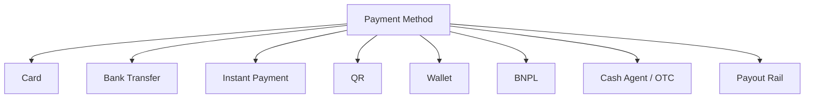

Untuk setiap method, catat karakteristik:

| Dimension | Meaning |
|---|---|
| Direction | payin, payout, refund, reversal |
| Customer action | none, redirect, app approval, transfer, challenge |
| Finality | immediate, delayed, reversible, disputeable |
| Settlement | real-time, batch, net, gross |
| Risk | fraud, chargeback, wrong account, AML |
| Evidence | auth code, bank ref, QR ref, wallet ref, statement line |
| Reconciliation | webhook, provider report, bank statement, scheme file |

---

## 21. Provider Adapter Boundary

Provider adapter harus menerjemahkan dunia luar ke internal canonical model.

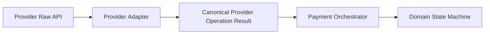

Canonical result contoh:

```json
{
  "operationType": "AUTHORIZE",
  "provider": "provider_a",
  "providerTransactionId": "tr_789",
  "resultCategory": "APPROVED",
  "resultStatus": "DEFINITIVE_SUCCESS",
  "amount": 100000,
  "currency": "IDR",
  "rawStatus": "CAPTURED",
  "rawCode": "00",
  "receivedAt": "2026-07-02T09:15:00+07:00"
}
```

Result category harus membedakan:

```text
DEFINITIVE_SUCCESS
DEFINITIVE_FAILURE
PENDING
UNKNOWN
REQUIRES_ACTION
RETRIABLE_FAILURE
PROVIDER_ERROR
```

Jangan biarkan string raw provider menyebar ke seluruh sistem.

---

## 22. Payment Orchestrator Boundary

Orchestrator bertanggung jawab atas lifecycle, bukan ledger detail, bukan provider raw parsing, bukan fraud model training.

Orchestrator melakukan:

- validate command,
- check idempotency,
- load payment aggregate,
- check merchant capability,
- ask risk decision,
- select route,
- call provider adapter,
- apply state transition,
- request ledger posting,
- publish domain event.

Pseudo-flow:

```text
confirmPayment(command):
  idempotency.guard(command.key)
  payment = repo.load(command.paymentIntentId)
  capability = merchantCapability.check(payment.merchantId, payment.method)
  riskDecision = risk.evaluate(payment)
  route = routing.select(payment, capability, riskDecision)
  providerResult = adapter.confirm(route, payment)
  transition = stateMachine.apply(payment, providerResult)
  ledger.postIfNeeded(transition.financialEffect)
  outbox.publish(transition.domainEvents)
  return apiView(payment)
```

Ini bukan final implementation. Ini boundary mental.

---

## 23. Ledger Boundary

Ledger tidak peduli provider A atau provider B. Ledger peduli account, journal, entry, amount, currency, dan business reference.

Ledger API sebaiknya menerima posting instruction yang sudah dinormalisasi:

```json
{
  "businessRef": "capture_cap_123",
  "journalType": "CUSTOMER_PAYMENT_CAPTURED",
  "currency": "IDR",
  "entries": [
    { "account": "provider_clearing", "direction": "DEBIT", "amount": 100000 },
    { "account": "merchant_payable:m_123", "direction": "CREDIT", "amount": 97000 },
    { "account": "platform_fee_revenue", "direction": "CREDIT", "amount": 3000 }
  ]
}
```

Ledger harus enforce:

- debit = credit,
- idempotent businessRef,
- immutable journal,
- valid account,
- valid currency,
- valid effective date,
- no negative balance when policy forbids.

---

## 24. Reconciliation Boundary

Reconciliation menerima sumber eksternal, bukan hanya webhook.

Input:

```text
provider transaction report
settlement report
bank statement
scheme report
dispute report
internal payment records
internal ledger journals
```

Output:

```text
matched
missing_internal
missing_external
amount_mismatch
currency_mismatch
status_mismatch
duplicate_external
duplicate_internal
late_settlement
unexpected_fee
```

Reconciliation tidak boleh “asal update status”. Ia harus membuat break, evidence, dan bila rule aman, membuat correction instruction.

---

## 25. Settlement Boundary

Settlement engine menjawab:

> “Berapa yang harus dibayarkan kepada merchant, kapan, dari sumber dana apa, setelah dikurangi apa, dan dengan risiko apa?”

Input:

- merchant balance,
- settlement schedule,
- fee,
- reserve,
- refund exposure,
- chargeback exposure,
- risk hold,
- payout method,
- bank cutoff,
- approval requirement.

Output:

- settlement batch,
- payout instruction,
- merchant statement,
- ledger journals,
- settlement report.

Settlement bukan sekadar cron `pay merchant daily`.

---

## 26. Risk Ownership Matrix

Siapa menanggung risiko?

| Risk | Customer | Merchant | Platform | PSP/Acquirer | Issuer/Bank |
|---|---:|---:|---:|---:|---:|
| Card fraud | Kadang | Kadang | Kadang | Kadang | Kadang |
| Chargeback | Tidak selalu | Sering | Jika MoR/PF | Tergantung contract | Bisa initiate |
| Duplicate charge | Terdampak | Terdampak | Sangat bertanggung jawab | Bisa ikut | Tidak utama |
| Wrong payout beneficiary | Tidak | Merchant/platform | Sering | Terbatas | Terbatas |
| AML/sanctions miss | Tidak | Bisa | Ya | Ya | Ya |
| Settlement mismatch | Tidak | Terdampak | Ya | Ya | Ya |
| Provider outage | Terdampak | Terdampak | Ya | Ya | Tidak selalu |

Matrix ini tidak universal. Contract dan regulasi menentukan detail. Tapi engineer harus selalu bertanya: siapa yang menanggung loss jika flow ini salah?

---

## 27. Indonesia-Specific Ecosystem Notes

Karena konteks payment sering lokal, kita perlu memasukkan Indonesia sebagai payment ecosystem yang relevan.

### 27.1 QRIS

QRIS adalah standar nasional QR Code Indonesia. Bank Indonesia menjelaskan QRIS mengakomodasi dua model: Merchant Presented Mode dan Consumer Presented Mode.

Engineering implication:

- Static QR berbeda dari dynamic QR.
- Dynamic QR biasanya terikat payment intent/amount.
- Static QR perlu matching amount/reference lebih hati-hati.
- QR payment harus punya expiry, reference, callback/webhook, dan reconciliation.

### 27.2 BI-FAST

BI-FAST adalah infrastruktur pembayaran ritel nasional yang real-time, aman, efisien, dan tersedia 24/7.

Engineering implication:

- Availability expectation tinggi.
- Timeout/unknown tetap mungkin terjadi.
- Reconciliation tetap diperlukan.
- Beneficiary validation dan transfer status harus jelas.

### 27.3 SNAP

SNAP adalah standar nasional Open API pembayaran yang ditetapkan Bank Indonesia.

Engineering implication:

- API security, signature, timestamp, token, dan schema compliance menjadi bagian integrasi.
- Contract-first penting.
- Provider/bank integration perlu test conformance.

### 27.4 BSPI 2030

BSPI 2030 memberi arah bahwa sistem pembayaran Indonesia bergerak ke infrastruktur yang lebih resilien, terintegrasi, inovatif, internasional, dan terkait Rupiah Digital.

Engineering implication:

- Payment platform harus didesain adaptable.
- Rail baru dan standard baru harus bisa ditambahkan tanpa rewrite domain core.
- ISO 20022-style message thinking akan makin penting.

---

## 28. Global Payment Modernization Notes

Payment system modern bergerak ke beberapa arah:

1. **Instant payment**: real-time/near-real-time transfer dengan rich data.
2. **ISO 20022**: structured payment messages untuk instruction, status, report.
3. **Tokenization**: mengurangi exposure data sensitif.
4. **Strong authentication**: 3DS/SCA-style risk-based authentication.
5. **Open banking/open API**: standardized bank/payment API.
6. **Operational resilience**: payment downtime punya dampak sistemik.
7. **Embedded finance**: payment capability masuk ke non-bank platforms.

Swift menyatakan komunitasnya tetap berkomitmen pada November 2025 sebagai akhir coexistence period MT/ISO 20022 untuk cross-border payments. Federal Reserve menjelaskan FedNow memakai ISO 20022 messages sebagai fondasi modernisasi payment process dan instant payments. Ini bukan berarti semua sistem internal harus expose ISO 20022 langsung, tetapi domain model harus siap dengan message-rich payment ecosystem.

---

## 29. Designing the Enterprise Boundary Map

Kita bisa petakan sistem enterprise seperti ini:

```mermaid
flowchart TD
    subgraph Experience
      CHECKOUT[Checkout]
      MERCHANT_PORTAL[Merchant Portal]
      BACKOFFICE[Backoffice]
    end

    subgraph Core Payment Platform
      PAYMENT_API[Payment API]
      ORCH[Payment Orchestrator]
      ROUTING[Routing Engine]
      IDEMP[Idempotency]
      STATE[State Machine]
    end

    subgraph Financial Core
      LEDGER[Ledger]
      BALANCE[Balance Projection]
      SETTLEMENT[Settlement Engine]
      RECON[Reconciliation]
    end

    subgraph Controls
      RISK[Risk Engine]
      COMPLIANCE[Compliance Screening]
      AUDIT[Audit Trail]
      POLICY[Policy/Limit Engine]
    end

    subgraph External
      PSP[PSP/Gateway]
      BANK[Bank]
      CARD[Card Network]
      WALLET[Wallet]
      QR[QR/Instant Rail]
    end

    CHECKOUT --> PAYMENT_API
    MERCHANT_PORTAL --> PAYMENT_API
    BACKOFFICE --> ORCH
    PAYMENT_API --> ORCH
    ORCH --> IDEMP
    ORCH --> STATE
    ORCH --> ROUTING
    ROUTING --> PSP
    PSP --> BANK
    PSP --> CARD
    PSP --> WALLET
    PSP --> QR
    ORCH --> RISK
    ORCH --> COMPLIANCE
    ORCH --> LEDGER
    LEDGER --> BALANCE
    BALANCE --> SETTLEMENT
    PSP --> RECON
    BANK --> RECON
    RECON --> LEDGER
    AUDIT --> BACKOFFICE
    POLICY --> ORCH
```

Boundary map ini akan menjadi tulang punggung seri.

---

## 30. Data Ownership dalam Payment Platform

Gunakan ownership eksplisit.

### Payment Orchestrator Owns

```text
payment_intent
payment_attempt
provider_operation
payment_state_transition
webhook_event_reference
```

### Ledger Owns

```text
account
journal
entry
balance_projection
financial_event_reference
```

### Merchant/Risk Owns

```text
merchant_profile
merchant_capability
risk_tier
limit_policy
reserve_policy
fee_plan
```

### Reconciliation Owns

```text
external_report
external_report_line
match_result
reconciliation_break
repair_case
```

### Settlement Owns

```text
settlement_batch
settlement_item
payout_instruction
merchant_statement
settlement_approval
```

### Audit Owns

```text
operator_action
authorization_decision
approval_record
evidence_reference
immutable_audit_event
```

---

## 31. Canonical Domain Events

Payment ecosystem butuh event, tetapi event harus canonical.

Contoh event internal:

```text
PaymentIntentCreated
PaymentRequiresAction
PaymentAuthorized
PaymentAuthorizationFailed
PaymentCaptured
PaymentCaptureUnknown
PaymentFailed
PaymentExpired
RefundRequested
RefundSucceeded
RefundFailed
LedgerJournalPosted
SettlementBatchCreated
SettlementPayoutSubmitted
ReconciliationBreakCreated
DisputeOpened
DisputeWon
DisputeLost
MerchantCapabilitySuspended
```

Event tidak boleh sekadar proxy webhook provider.

Buruk:

```text
MidtransTransactionStatusChanged
StripeChargeUpdated
XenditInvoicePaid
```

Boleh di adapter/raw layer, tapi domain core harus menerima event canonical.

---

## 32. Ecosystem Failure Map

Payment failure bisa berasal dari aktor berbeda.

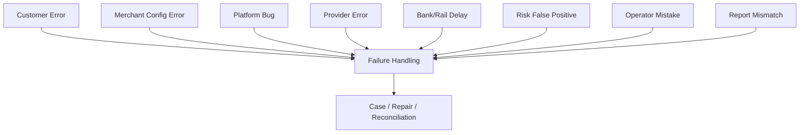

Contoh:

| Source | Failure | System Response |
|---|---|---|
| Customer | closes browser during 3DS | pending action / expire |
| Merchant | wrong callback URL | webhook retry / alert |
| Platform | ledger posting bug | incident + idempotent repair |
| PSP | timeout | unknown state + lookup |
| Bank | delayed statement | reconciliation pending |
| Risk | false block | manual review/release |
| Operator | wrong adjustment | approval + reversal |
| Report | amount mismatch | reconciliation break |

---

## 33. Designing for Replaceable Providers

Provider replacement adalah real business need.

Alasan:

- cost optimization,
- availability,
- approval rate,
- geographic expansion,
- method availability,
- contract issue,
- regulatory requirement,
- provider outage,
- merger/migration.

Jika domain model vendor-coupled, migration mahal.

### Rule

Provider boleh memengaruhi adapter, routing config, dan reconciliation parser. Provider tidak boleh menentukan core lifecycle model.

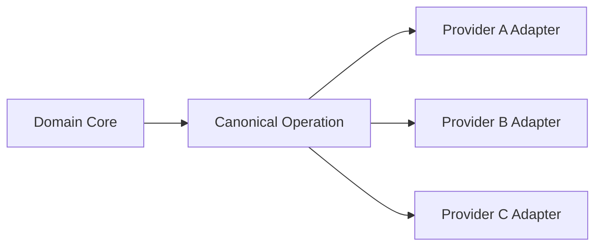

Core concept harus stabil:

```text
PaymentIntent
PaymentAttempt
Authorization
Capture
Refund
Payout
LedgerJournal
SettlementBatch
ReconciliationBreak
```

---

## 34. Trust Boundaries

Payment architecture harus jelas tentang trust boundary.

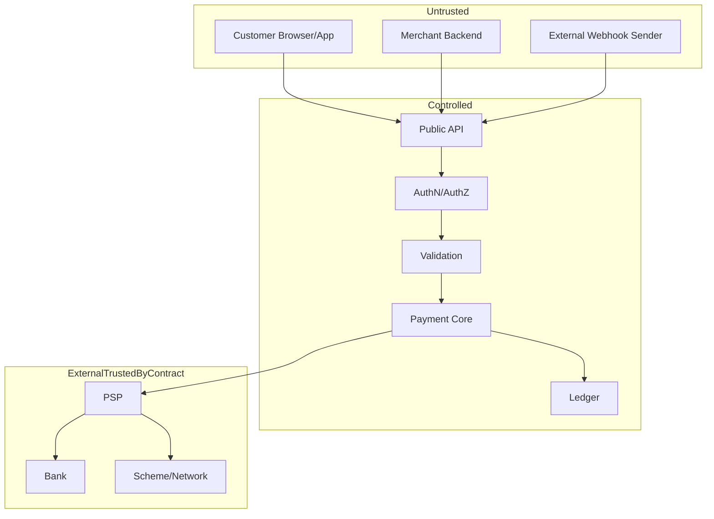

Trust boundary implications:

- Merchant-provided amount must be validated against order/invoice source.
- Webhook signature must be verified.
- Provider data must be stored as external claim until processed.
- Operator action must be permissioned and audited.
- Ledger posting must not be triggered by unauthenticated input.

---

## 35. Ecosystem-Aware API Design

API harus mencerminkan lifecycle dan actor boundary.

Contoh endpoint konseptual:

```text
POST /payment-intents
POST /payment-intents/{id}/confirm
POST /payment-intents/{id}/capture
POST /payment-intents/{id}/cancel
POST /payment-intents/{id}/refunds
GET  /payment-intents/{id}
GET  /merchant-balances/{merchantId}
POST /payouts
GET  /settlements/{id}
GET  /reconciliation-breaks/{id}
```

Tapi endpoint bukan inti. Yang penting command ownership:

| Command | Actor | Boundary |
|---|---|---|
| Create payment intent | Merchant/system | Payment API |
| Confirm payment | Customer/merchant | Orchestrator |
| Capture payment | Merchant/system | Orchestrator + provider |
| Refund payment | Merchant/support | Payment + ledger + provider |
| Create payout | Merchant/system/ops | Settlement/payout engine |
| Manual adjustment | Ops/finance | Backoffice + ledger approval |
| Resolve reconciliation break | Ops/finance | Reconciliation workflow |

---

## 36. Case Study: Marketplace Payment

Marketplace payment lebih rumit dari single merchant.

Scenario:

- Customer membayar 1.000.000.
- Seller A menerima 600.000.
- Seller B menerima 300.000.
- Platform fee 100.000.
- Settlement ke seller dilakukan H+1.
- Seller B terkena risk hold.

Ledger impact:

```text
Dr Provider Clearing              1.000.000
Cr Seller A Payable                 600.000
Cr Seller B Pending Payable         300.000
Cr Platform Fee Revenue             100.000
```

Risk hold Seller B:

```text
Dr Seller B Pending Payable         300.000
Cr Seller B Reserve/Hold            300.000
```

Jika nanti hold dilepas:

```text
Dr Seller B Reserve/Hold            300.000
Cr Seller B Available Payable       300.000
```

Ini menunjukkan kenapa merchant/account model penting sejak awal.

---

## 37. Case Study: Refund After Settlement

Customer membayar merchant. Dana sudah disettle ke merchant. Lalu customer minta refund.

Pertanyaan:

- Apakah platform masih punya dana merchant?
- Apakah merchant balance cukup?
- Apakah platform menalangi refund?
- Apakah merchant boleh negative balance?
- Apakah refund langsung ke original payment method?
- Apakah provider fee dikembalikan?

Possible ledger:

```text
Dr Merchant Payable / Merchant Receivable   100.000
Cr Provider Clearing / Cash                 100.000
```

Jika merchant balance tidak cukup, sistem bisa:

- menolak refund,
- membuat negative balance,
- menahan settlement berikutnya,
- meminta top-up merchant,
- memakai platform reserve.

Ini bukan hanya technical decision. Ini policy, contract, finance, dan risk decision.

---

## 38. Case Study: Payout to Wrong Beneficiary

Merchant memasukkan rekening bank salah. Platform melakukan payout.

Pertanyaan:

- Apakah beneficiary diverifikasi?
- Apakah nama rekening cocok?
- Apakah merchant mengonfirmasi?
- Apakah operator approval diperlukan?
- Apakah transfer bisa ditarik balik?
- Siapa menanggung loss?

System design:

```text
beneficiary_status: UNVERIFIED | VERIFIED | REJECTED | SUSPENDED
payout_status: CREATED | APPROVAL_REQUIRED | SUBMITTED | BANK_ACCEPTED | SUCCEEDED | FAILED | UNKNOWN
risk_check: PASS | REVIEW | BLOCK
```

Backoffice harus menyimpan evidence bahwa merchant/operator menyetujui beneficiary.

---

## 39. Checklist Boundary untuk Setiap Payment Method

Sebelum menambahkan payment method baru, jawab:

1. Siapa payer?
2. Siapa payee?
3. Siapa merchant of record?
4. Siapa provider/rail?
5. Apakah ada authorization?
6. Apakah ada capture?
7. Apakah customer action synchronous/asynchronous?
8. Apa finality semantics?
9. Apakah bisa refund?
10. Apakah bisa reversal?
11. Apakah bisa dispute/chargeback?
12. Apa settlement source?
13. Apa reconciliation source?
14. Apa unique external reference?
15. Apa idempotency support provider?
16. Apa fee model?
17. Apa risk controls?
18. Apa compliance requirement?
19. Apa operational exception yang umum?
20. Apa evidence yang wajib disimpan?

Jika pertanyaan ini tidak bisa dijawab, integrasi belum siap production.

---

## 40. Checklist Service Boundary

Sebelum menulis kode, pastikan:

- Payment core tidak tergantung enum vendor.
- Provider adapter menyimpan raw request/response secara aman.
- Webhook event store immutable dan deduplicated.
- Ledger memiliki business reference idempotency.
- Merchant capability model ada.
- Risk decision tersimpan dengan reason code.
- Reconciliation punya model external report line.
- Settlement punya batch dan item model.
- Backoffice action selalu audited.
- Sensitive data boundary jelas.
- Finance report bisa dijelaskan dari ledger.

---

## 41. Referensi Resmi dan Bacaan Lanjutan

Referensi berikut dipakai untuk orientasi standar dan ekosistem:

- PCI Security Standards Council — “Just Published: PCI DSS v4.0.1”  
  https://blog.pcisecuritystandards.org/just-published-pci-dss-v4-0-1
- EMVCo — “EMV® 3-D Secure”  
  https://www.emvco.com/emv-technologies/3-d-secure/
- Swift — “ISO 20022 for Financial Institutions: focus on payments instructions”  
  https://www.swift.com/standards/iso-20022/iso-20022-financial-institutions-focus-payments-instructions
- Federal Reserve Financial Services — “The FedNow Service and ISO 20022”  
  https://www.frbservices.org/financial-services/fednow/what-is-iso-20022-why-does-it-matter
- Bank Indonesia — “Quick Response Code Indonesian Standard (QRIS)”  
  https://www.bi.go.id/en/fungsi-utama/sistem-pembayaran/ritel/kanal-layanan/qris/default.aspx
- Bank Indonesia — “BI-FAST” infrastructure overview  
  https://www.bi.go.id/id/fungsi-utama/sistem-pembayaran/ritel/infrastruktur/default.aspx
- Bank Indonesia — “National Open API Payment Standard (SNAP)”  
  https://www.bi.go.id/en/layanan/standar/snap/default.aspx
- Bank Indonesia — “Blueprint Sistem Pembayaran Indonesia 2030”  
  https://www.bi.go.id/id/fungsi-utama/sistem-pembayaran/blueprint/default.aspx

---

## 42. Penutup Part 002

Payment ecosystem map mengajarkan satu hal penting:

> Payment platform bukan pusat semesta. Ia adalah pengendali lifecycle di tengah banyak aktor, banyak sumber truth, banyak risk owner, dan banyak settlement semantics.

Engineer top-level tidak hanya bertanya “bagaimana call API provider?”. Ia bertanya:

- siapa memegang uang,
- siapa memberi status,
- siapa menanggung risiko,
- siapa menjadi source of truth,
- bagaimana mismatch diselesaikan,
- bagaimana evidence disimpan,
- bagaimana domain tetap stabil ketika provider berubah.

Di Part 003 kita akan mendefinisikan production scope boundary: gateway, orchestrator, ledger, risk, reconciliation, settlement, backoffice, dan apa yang masuk/keluar dari sistem yang akan kita bangun.
