------
title: Build From Scratch: Large Production Grade Java Payment Systems - Part 003
description: Menentukan production scope boundary untuk payment platform enterprise: apa yang dimiliki sistem, apa yang hanya diintegrasikan, bounded context, capability map, ownership data, dan garis batas risiko.
series: learn-java-payment-systems
seriesTitle: Build From Scratch: Large Production Grade Java Payment Systems
order: 3
partTitle: Production Scope Boundary
tags:
- java
- payments
- payment-systems
- enterprise-architecture
- bounded-context
- fintech
- ledger
- reconciliation
date: 2026-07-02
---

# Part 003 — Production Scope Boundary

Sebelum menulis satu endpoint pun, kita harus menjawab pertanyaan yang lebih keras:

> “Sistem pembayaran ini sebenarnya bertanggung jawab atas apa?”

Pertanyaan itu terdengar sederhana, tetapi di production ia menentukan hampir semua keputusan arsitektur: service boundary, schema, audit, compliance, reconciliation, incident handling, ownership finance, dan siapa yang harus bangun jam 03:00 ketika uang customer tertahan.

Payment platform yang buruk biasanya gagal bukan karena kurang endpoint. Ia gagal karena boundary-nya kabur.

Contoh boundary kabur:

- order service langsung percaya status provider dan menandai order `PAID` tanpa ledger posting.
- payment service membuat refund tetapi finance tidak tahu liability berubah.
- webhook langsung mengubah order tanpa idempotency dan tanpa audit trail.
- settlement file diimpor sebagai laporan, bukan sebagai mekanisme kontrol.
- operator bisa mengubah status payment tanpa jurnal koreksi.
- risk engine bisa hold merchant balance, tetapi payout service tidak membaca hold tersebut.
- provider timeout dianggap gagal, padahal bisa saja authorization berhasil.

Di part ini kita tidak sedang membuat diagram cantik. Kita sedang menarik garis perang: bagian mana yang menjadi tanggung jawab payment platform, bagian mana milik external provider, bagian mana milik domain bisnis seperti order/subscription, dan bagian mana milik finance/risk/operations.

---

## 1. Tujuan Part Ini

Setelah part ini, kamu harus bisa:

1. Membedakan **payment gateway integration** dan **payment platform**.
2. Menentukan scope minimal production-grade untuk sistem pembayaran enterprise.
3. Membagi domain payment menjadi bounded context yang masuk akal.
4. Menentukan data mana yang authoritative dan data mana yang hanya external evidence.
5. Menentukan service mana yang boleh mengubah state pembayaran, ledger, settlement, refund, dispute, dan payout.
6. Mendesain boundary agar sistem tahan terhadap timeout, duplicate webhook, provider inconsistency, manual adjustment, dan audit.
7. Menolak scope yang terlihat cepat tetapi merusak correctness jangka panjang.

---

## 2. Payment System Bukan Satu Service

Untuk proyek demo, payment biasanya terlihat seperti ini:

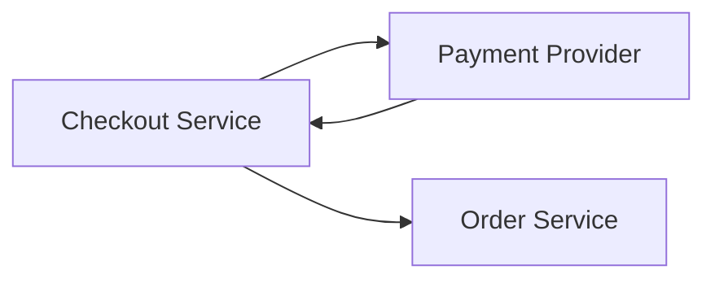

Untuk production enterprise, model itu terlalu kecil. Payment platform minimal punya beberapa kemampuan berbeda:

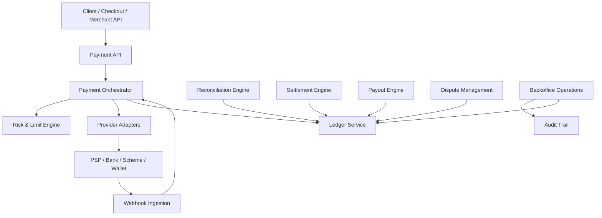

Tidak semua harus menjadi microservice terpisah sejak hari pertama. Tetapi secara **domain responsibility**, kemampuan ini harus dipisahkan di kepala kita. Kalau tidak, sistem cepat berubah menjadi campuran endpoint, status provider, dan if-else yang tidak bisa diaudit.

Mental modelnya:

> Payment platform bukan satu service. Payment platform adalah kumpulan kontrol atas lifecycle uang.

---

## 3. Boundary Pertama: Apa yang Dimaksud “Production Grade”?

Dalam seri ini, production-grade berarti sistem memenuhi karakteristik berikut:

| Dimensi | Pertanyaan produksi |
|---|---|
| Correctness | Apakah uang tidak hilang, tidak dobel, tidak salah balance, dan tidak salah finalitas? |
| Idempotency | Apakah retry client/provider/operator aman? |
| Auditability | Apakah setiap perubahan state dan uang bisa dijelaskan? |
| Reconciliation | Apakah internal record bisa dicocokkan dengan provider, bank, scheme, dan settlement report? |
| Resilience | Apakah timeout, partial failure, duplicate webhook, dan delayed report tidak merusak state? |
| Security | Apakah data sensitif, key, token, signature, dan akses operator dikontrol? |
| Compliance | Apakah sistem bisa memenuhi kebutuhan audit, PCI boundary, data retention, dan regulator? |
| Operability | Apakah operasi manual aman, tercatat, dan punya approval? |
| Extensibility | Apakah payment method/provider baru bisa ditambah tanpa menghancurkan core model? |
| Explainability | Apakah finance, support, risk, dan engineering bisa melihat alasan status dan saldo? |

Production-grade bukan berarti “pakai Kubernetes”, “pakai Kafka”, atau “pakai microservices”. Itu hanya teknik deployment. Payment production-grade berarti **financial behavior-nya benar di bawah gangguan nyata**.

---

## 4. Boundary Kedua: Apa yang Bukan Scope Kita?

Build from scratch bukan berarti membangun semua dari nol.

Sistem pembayaran enterprise yang realistis tetap menggunakan bank, acquirer, scheme, wallet, PSP, processor, KYC/KYB provider, fraud data provider, HSM/KMS, observability platform, dan compliance tooling. Yang kita bangun adalah **control plane dan domain platform** yang membuat integrasi itu aman, konsisten, dan dapat diaudit.

### 4.1 Yang Tidak Kita Bangun dari Nol

| Area | Kenapa bukan scope utama |
|---|---|
| Card network seperti Visa/Mastercard | Itu scheme global dengan aturan, sertifikasi, dan network sendiri. |
| Bank core system | Kita berintegrasi dengan bank, bukan menggantikan core banking. |
| HSM fisik | Kita mendesain integrasi dan key lifecycle, bukan membuat hardware security module. |
| Full AML intelligence database | Kita mengintegrasikan screening provider atau internal policy, bukan membuat semua sumber data global. |
| Real acquirer processing switch | Untuk sebagian perusahaan, ini regulated dan membutuhkan sertifikasi besar. Kita modelkan boundary-nya. |
| National payment rail | BI-FAST, FedNow, RTP, SEPA, ACH, dan sejenisnya adalah external rail. |
| Scheme dispute portal penuh | Kita modelkan lifecycle dispute dan evidence, tetapi scheme portal tetap eksternal. |

### 4.2 Yang Wajib Kita Bangun

| Area | Kenapa wajib dimiliki platform |
|---|---|
| Payment domain model | Agar status provider tidak langsung bocor ke domain bisnis. |
| Payment orchestration | Agar provider/routing/retry/fallback tidak tersebar di banyak service. |
| Idempotency control | Agar retry tidak menjadi double charge/refund/payout. |
| Ledger | Agar perubahan uang punya source of truth internal. |
| Reconciliation | Agar internal record tidak buta terhadap provider/bank report. |
| Settlement | Agar payable ke merchant dihitung benar. |
| Risk/limit hooks | Agar transaksi dan payout bisa ditahan/dibatasi. |
| Audit trail | Agar setiap keputusan bisa dibuktikan. |
| Backoffice controls | Agar manual operation aman dan tidak menjadi fraud vector. |

Prinsipnya:

> Kita tidak harus menjadi bank. Tetapi sistem kita harus tahu persis kapan harus percaya, menunggu, menolak, mengoreksi, atau merekonsiliasi informasi dari bank/provider.

---

## 5. Capability Map Production Payment Platform

Capability map membantu kita melihat sistem sebagai kumpulan tanggung jawab, bukan kumpulan class.

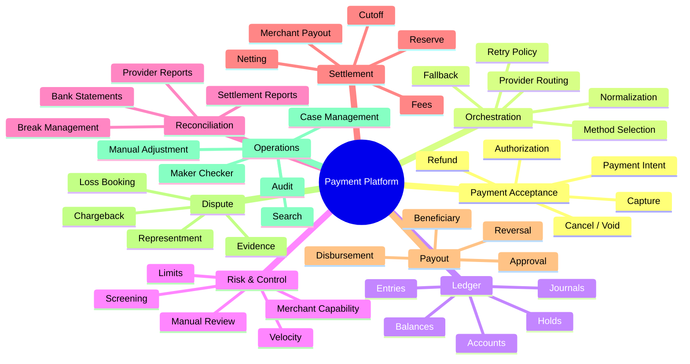

Capability map ini akan menjadi tulang punggung seri. Setiap part berikutnya akan memperdalam satu area, tetapi tetap terhubung ke keseluruhan sistem.

---

## 6. Core Bounded Context

Untuk payment platform enterprise, boundary yang sehat biasanya lebih mirip ini:

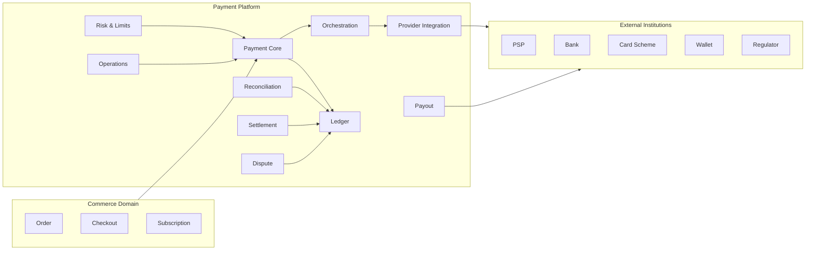

### 6.1 Commerce Domain

Commerce domain memikirkan order, cart, invoice, entitlement, shipment, subscription, dan customer experience.

Ia boleh bertanya:

- “Payment ini sudah bisa dianggap paid untuk order ini?”
- “Apakah invoice ini punya outstanding amount?”
- “Apakah subscription renewal berhasil?”

Ia tidak boleh menjadi owner lifecycle payment internal.

Anti-pattern:

```java
// Buruk: Order service menyimpan status provider mentah
order.setPaymentStatus(providerResponse.getStatus());
```

Yang lebih sehat:

```java
// Lebih sehat: Order service menerima domain event yang sudah dinormalisasi
if (event.type() == PaymentEventType.PAYMENT_CONFIRMED) {
    order.markPaymentConfirmed(event.paymentId(), event.confirmedAmount());
}
```

Commerce domain tidak perlu tahu apakah payment berhasil karena card capture, QR webhook, bank transfer matching, atau wallet debit. Ia perlu tahu status bisnis yang sudah melalui payment domain.

### 6.2 Payment Core

Payment Core adalah pusat lifecycle:

- membuat payment intent.
- menerima confirmation request.
- mengatur transition state.
- mengeluarkan event domain.
- menjaga idempotency.
- memastikan perubahan uang diposting ke ledger.
- menjaga hubungan payment dengan order/invoice tanpa menjadi order service.

Payment Core bukan adapter provider.

Payment Core juga bukan ledger. Ia mengorkestrasi perubahan lifecycle, sementara ledger menyimpan truth finansial.

### 6.3 Orchestration Context

Orchestration memilih bagaimana payment diproses:

- provider mana.
- payment method mana.
- route mana.
- retry/fallback boleh atau tidak.
- timeout harus diperlakukan bagaimana.
- error provider dipetakan menjadi domain outcome apa.

Orchestration adalah tempat strategi, bukan tempat bookkeeping final.

### 6.4 Provider Integration Context

Provider integration menyembunyikan detail eksternal:

- API PSP.
- bank API.
- wallet API.
- QR provider.
- signature verification.
- webhook format.
- provider-specific error code.
- report download.

Provider integration tidak boleh menyimpan truth final tanpa payment core/ledger.

### 6.5 Ledger Context

Ledger adalah tempat sistem mencatat konsekuensi finansial.

Ia tidak bertanya “apakah order paid?” Ia bertanya:

- akun mana didebit?
- akun mana dikredit?
- amount berapa?
- currency apa?
- journal type apa?
- posting rule mana?
- apakah entry balance?
- apakah immutable?

Ledger harus membosankan. Semakin banyak business branching di ledger, semakin berbahaya.

### 6.6 Risk & Limits Context

Risk dan limit menentukan apakah tindakan boleh dilanjutkan:

- customer velocity.
- merchant risk tier.
- country/method restriction.
- amount limit.
- suspicious pattern.
- sanction hit.
- manual review.
- payout hold.

Risk tidak langsung memindahkan uang. Risk memberi keputusan/policy effect yang harus diterapkan oleh payment core, payout, atau ledger hold mechanism.

### 6.7 Reconciliation Context

Reconciliation membandingkan kebenaran internal dengan external evidence:

- provider transaction report.
- bank statement.
- settlement report.
- scheme file.
- wallet report.

Reconciliation bukan sekadar laporan finance. Reconciliation adalah mekanisme deteksi drift.

### 6.8 Settlement Context

Settlement menghitung payable/receivable final antar pihak:

- gross captured amount.
- fees.
- tax.
- chargeback.
- refund.
- reserve.
- hold.
- payout batch.

Settlement membaca ledger dan report eksternal, lalu menghasilkan settlement instruction dan ledger posting.

### 6.9 Payout Context

Payout memindahkan dana keluar dari platform ke merchant, seller, partner, atau customer.

Payout harus lebih ketat dari payment acceptance karena efeknya mengeluarkan dana dari kontrol kita.

### 6.10 Dispute Context

Dispute mengelola chargeback, complaint, representment, evidence, deadline, liability, dan loss booking.

Dispute bukan sekadar customer support ticket. Dispute mengubah financial exposure.

### 6.11 Operations Context

Operations menyediakan tools untuk manusia:

- search payment.
- inspect timeline.
- replay webhook.
- create case.
- approve adjustment.
- put hold.
- release hold.
- export evidence.

Operations harus punya audit dan approval. Operator adalah bagian dari threat model.

---

## 7. Data Ownership: Siapa Source of Truth?

Sistem pembayaran rusak ketika semua service merasa boleh menjadi source of truth.

Gunakan aturan ini:

| Data | Owner | Consumer |
|---|---|---|
| Payment lifecycle state | Payment Core | Order, Support, Risk, Reporting |
| Provider raw status | Provider Integration | Payment Core, Reconciliation, Debugging |
| Financial postings | Ledger | Finance, Settlement, Payout, Reporting |
| Merchant payable balance | Ledger/Settlement | Merchant dashboard, Payout |
| Risk decision | Risk Engine | Payment Core, Payout, Ops |
| Provider report import | Reconciliation | Finance, Ops, Ledger correction workflow |
| Settlement batch | Settlement Engine | Payout, Finance, Merchant reporting |
| Operator action | Audit/Ops | Compliance, Security, Investigation |
| Order fulfillment state | Order Service | Payment Core only as reference |

Rule penting:

> External provider status adalah evidence. Ledger internal adalah financial truth. Payment Core adalah lifecycle truth. Commerce domain adalah business fulfillment truth.

Tiga truth ini tidak boleh dicampur.

---

## 8. “Paid” Itu Milik Siapa?

Pertanyaan “payment sudah paid belum?” sering memicu kekacauan domain.

Secara teknis, ada beberapa lapisan paid:

| Layer | Arti |
|---|---|
| Provider accepted | Provider menerima request. Belum tentu uang disetujui. |
| Authorized | Issuer/bank/wallet menyetujui hold/debit. Belum tentu settled. |
| Captured | Merchant/platform meminta dana ditagih. |
| Confirmed internally | Payment core sudah menilai outcome cukup untuk bisnis. |
| Ledger posted | Konsekuensi finansial tercatat internal. |
| Reconciled | External evidence cocok dengan internal record. |
| Settled | Dana masuk/keluar melalui settlement. |
| Available | Dana boleh dipakai/dibayarkan setelah hold/reserve/risk. |

Jadi `paid` untuk order bisa berarti:

> Payment confirmed secara domain dan ledger posting minimal sudah berhasil.

Tetapi untuk finance, `paid` belum cukup. Finance butuh tahu apakah sudah settled dan reconciled.

Untuk merchant, `paid` belum berarti balance available. Bisa saja dana masih pending settlement atau ditahan risk.

---

## 9. Production Scope: Minimum Viable Safe Platform

Minimum viable safe payment platform bukan minimum endpoint. Ia minimum kontrol.

### 9.1 Core Acceptance Scope

Wajib:

- create payment intent.
- confirm payment.
- track lifecycle state.
- store idempotency record.
- call provider via adapter.
- ingest webhook.
- normalize provider result.
- emit domain event.
- post ledger journal.
- expose payment timeline.

Belum wajib di awal:

- multi-provider smart routing.
- ML fraud scoring.
- full dispute automation.
- global multi-currency settlement.
- full PCI card vault.

Tetapi desainnya tidak boleh menutup jalan ke sana.

### 9.2 Ledger Scope

Wajib:

- immutable journal.
- double-entry posting.
- idempotent journal reference.
- account model.
- balance projection.
- audit metadata.

Belum wajib di awal:

- complex GL integration.
- multi-ledger legal entity accounting.
- tax engine penuh.

### 9.3 Reconciliation Scope

Wajib:

- import provider report.
- match by external reference.
- detect missing internal/external transaction.
- detect amount/currency/status mismatch.
- create recon break.
- expose break queue.

Belum wajib di awal:

- fuzzy matching advanced.
- automated accounting adjustment for every break.
- machine learning anomaly matching.

### 9.4 Operations Scope

Wajib:

- search payment by internal/external reference.
- view timeline.
- view ledger journals.
- view provider raw response/webhook.
- replay webhook safely.
- create manual review case.
- audit every action.

Belum wajib di awal:

- fully customizable workflow builder.
- complex role hierarchy.
- generic case management platform.

---

## 10. Service Boundary Versi Pertama

Untuk build from scratch, kita akan mulai dengan boundary seperti ini:

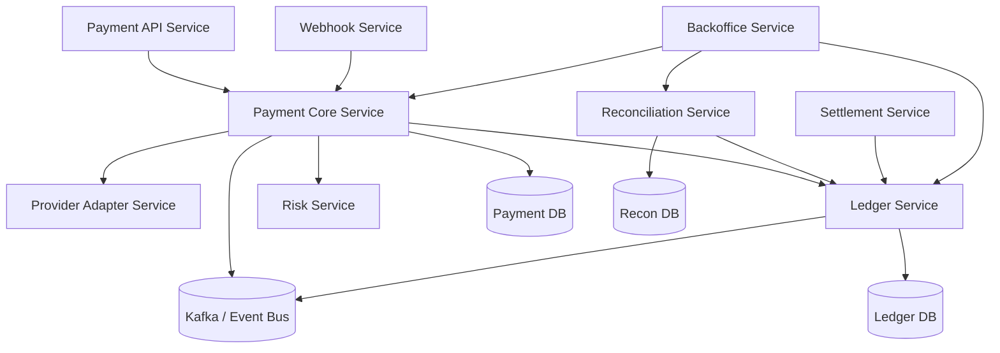

Catatan penting:

- Ini bukan ajakan membuat microservice terlalu banyak sejak hari pertama.
- Ini adalah logical boundary.
- Pada fase awal, beberapa context boleh satu deployable selama module boundary dan data ownership jelas.
- Yang tidak boleh: satu tabel `payments` menjadi tempat semua state, ledger, reconciliation, settlement, webhook, dan operator action dicampur.

---

## 11. Modular Monolith vs Microservices untuk Payment Platform

Banyak tim langsung ingin microservices. Untuk payment system, keputusan ini harus dingin.

### 11.1 Modular Monolith Cocok Jika

- tim kecil.
- domain belum stabil.
- volume belum besar.
- ingin menjaga transaksi lokal untuk core lifecycle + ledger posting.
- belum punya maturity operasional tinggi.

Struktur modular monolith yang sehat:

```text
payment-platform/
  payment-api/
  payment-core/
  payment-orchestration/
  payment-provider-adapters/
  ledger-core/
  reconciliation-core/
  settlement-core/
  risk-core/
  backoffice-core/
  shared-kernel/
```

Tetapi shared-kernel harus kecil. Jangan jadikan `shared-kernel` sebagai tempat semua model domain.

### 11.2 Microservices Cocok Jika

- volume tinggi.
- team ownership jelas.
- compliance/audit boundary perlu dipisah.
- ledger harus diisolasi ketat.
- provider integration punya deployment cadence berbeda.
- reconciliation/settlement batch berat.
- platform melayani banyak product line.

Risikonya:

- distributed transaction problem.
- eventual consistency.
- observability lebih sulit.
- data ownership harus disiplin.
- operational overhead naik.

Rule yang saya pakai:

> Payment Core dan Ledger boleh dekat secara transaksi pada awal sistem, tetapi boundary konseptualnya harus dipisah sejak hari pertama.

---

## 12. Boundary Database

Payment platform tidak boleh memiliki satu database sebagai tempat semua service bebas baca-tulis.

Minimal boundary data:

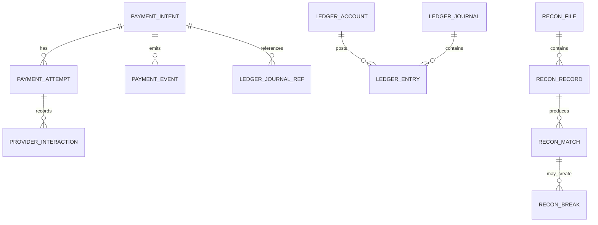

Payment Core boleh menyimpan `payment_intent`, `payment_attempt`, `provider_interaction`, dan `payment_event`.

Ledger menyimpan `ledger_account`, `ledger_journal`, `ledger_entry`, dan balance projection.

Reconciliation menyimpan report import, raw record, match result, dan break.

Settlement menyimpan settlement batch, settlement item, dan payout instruction.

Boundary database tidak selalu berarti database fisik berbeda, tetapi harus berarti ownership berbeda.

---

## 13. External Boundary: Provider Bukan Source of Truth Tunggal

Provider penting, tetapi provider bukan tuhan.

Provider bisa:

- timeout.
- mengirim webhook duplikat.
- mengirim webhook terlambat.
- mengubah status.
- mengembalikan error ambigu.
- menghasilkan settlement report yang berbeda dari real-time API.
- punya bug.
- melakukan maintenance.
- punya timezone/cutoff berbeda.
- memberi ID berbeda antara authorization, capture, refund, dan settlement.

Karena itu, provider response harus diperlakukan sebagai **evidence stream**.

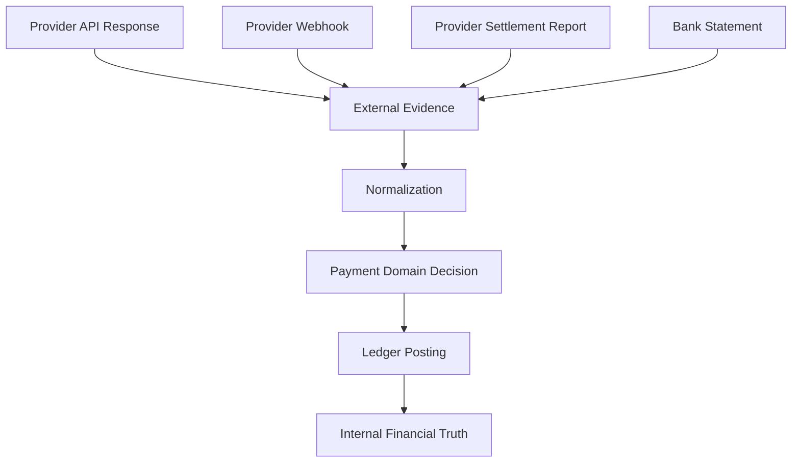

Provider evidence masuk ke sistem, dinormalisasi, dibandingkan dengan state internal, lalu menghasilkan keputusan domain. Jangan langsung copy-paste status provider ke payment state.

---

## 14. Internal Boundary: Payment State Bukan Ledger

Payment state menjawab:

> “Lifecycle transaksi ini berada di tahap apa?”

Ledger menjawab:

> “Dampak finansial apa yang sudah tercatat?”

Contoh:

| Payment state | Ledger effect |
|---|---|
| `REQUIRES_PAYMENT_METHOD` | belum ada posting |
| `AUTHORIZED` | bisa ada hold/pending receivable |
| `CAPTURED` | merchant receivable/payable mulai terbentuk |
| `SETTLED` | cash/bank settlement tercatat |
| `REFUNDED` | liability/customer payable berubah |
| `DISPUTED` | contingent liability/loss exposure muncul |

Jangan desain ledger sebagai enum status. Jangan desain payment state sebagai pengganti jurnal.

Anti-pattern:

```sql
ALTER TABLE payments ADD COLUMN merchant_balance_delta NUMERIC;
ALTER TABLE payments ADD COLUMN finance_status VARCHAR(50);
ALTER TABLE payments ADD COLUMN settlement_amount NUMERIC;
```

Lebih sehat:

```text
Payment state: CAPTURED
Ledger journal:
  Dr Customer/Card Receivable       100.00
  Cr Merchant Pending Payable       97.00
  Cr Platform Fee Revenue            3.00
```

Payment state ringkas. Ledger detail.

---

## 15. API Boundary: Public API Tidak Sama dengan Internal Command

Public API harus stabil, aman, dan idempotent. Internal command boleh lebih kaya dan eksplisit.

Contoh public API:

```http
POST /v1/payment-intents
POST /v1/payment-intents/{id}/confirm
POST /v1/payment-intents/{id}/capture
POST /v1/payment-intents/{id}/cancel
POST /v1/refunds
GET  /v1/payment-intents/{id}
```

Internal command:

```text
CreatePaymentIntentCommand
ConfirmPaymentCommand
AuthorizePaymentAttemptCommand
MarkProviderAuthorizationSucceededCommand
MarkProviderAuthorizationUnknownCommand
PostAuthorizationLedgerJournalCommand
PublishPaymentConfirmedEventCommand
```

Kenapa perlu dipisahkan?

Karena external API adalah kontrak product. Internal command adalah mekanisme domain. Kalau dicampur, kita akan memaksa domain mengikuti bentuk API public yang sering terlalu sederhana.

---

## 16. Event Boundary

Payment platform akan banyak menggunakan event. Tetapi event harus punya maksud yang jelas.

Jenis event:

| Jenis event | Contoh | Fungsi |
|---|---|---|
| Domain event | `PaymentAuthorized` | Fakta bisnis internal |
| Integration event | `PaymentAuthorizedV1` | Kontrak untuk service lain |
| Provider event | `ProviderWebhookReceived` | Evidence eksternal |
| Audit event | `OperatorRefundApproved` | Bukti aksi manusia |
| Ledger event | `LedgerJournalPosted` | Fakta posting finansial |
| Recon event | `ReconciliationBreakCreated` | Fakta mismatch |

Anti-pattern:

```json
{
  "eventType": "payment_updated",
  "status": "success"
}
```

Event seperti itu terlalu lemah. Tidak jelas success apa: authorization, capture, refund, settlement, atau payout.

Lebih sehat:

```json
{
  "eventType": "PaymentCaptureSucceeded",
  "paymentId": "pay_123",
  "captureId": "cap_456",
  "amount": { "currency": "IDR", "minor": 15000000 },
  "provider": "provider_a",
  "occurredAt": "2026-07-02T03:15:30Z",
  "ledgerJournalId": "jrnl_789"
}
```

Event payment harus spesifik karena downstream effect berbeda.

---

## 17. Risk Boundary: Risk Memutuskan, Payment Mengeksekusi

Risk engine tidak seharusnya langsung mengubah payment state atau ledger. Risk engine memberi decision:

```json
{
  "decision": "REVIEW_REQUIRED",
  "reasonCodes": ["HIGH_AMOUNT", "NEW_DEVICE", "MERCHANT_RISK_TIER_HIGH"],
  "effects": ["HOLD_CAPTURE", "DISABLE_INSTANT_PAYOUT"]
}
```

Payment Core menerapkan efek pada lifecycle:

- allow.
- reject.
- require review.
- hold after capture.
- block refund.
- require stronger authentication.

Payout menerapkan efek pada disbursement:

- hold payout.
- reduce limit.
- require approval.

Ledger menerapkan efek finansial:

- pending balance.
- reserve balance.
- unavailable balance.

Risk adalah policy. Payment/Ledger/Payout adalah enforcement.

---

## 18. Backoffice Boundary: Operator Tidak Boleh Menjadi Database Admin

Backoffice sering diremehkan. Padahal di payment system, operasi manual adalah salah satu sumber risiko terbesar.

Operator perlu tools, tetapi tools harus aman:

| Action | Kontrol wajib |
|---|---|
| Replay webhook | idempotency, audit, reason, no duplicate financial effect |
| Force status resolution | approval, evidence, ledger consistency check |
| Manual refund | permission, amount limit, idempotency, ledger posting |
| Manual adjustment | maker-checker, journal reason, attachment evidence |
| Hold/release merchant balance | risk reason, approval, expiry/review date |
| Export sensitive report | access log, purpose, masking |

Backoffice yang buruk memberi tombol “mark as paid”. Backoffice yang sehat memberi workflow “resolve unknown payment state dengan evidence dan posting yang benar”.

---

## 19. Compliance Boundary

Payment systems menyentuh domain regulated. Dalam desain, kita harus membedakan:

1. compliance yang diwajibkan karena jenis data.
2. compliance yang diwajibkan karena jenis aktivitas.
3. compliance yang diwajibkan karena negara/rail.
4. compliance yang diwajibkan oleh partner/scheme.

Contoh:

| Concern | Dampak arsitektur |
|---|---|
| PCI DSS | segmentasi card data environment, tokenization, access control, logging, vulnerability management |
| AML/sanctions | screening, hold, case management, audit trail |
| Data privacy | minimization, retention, masking, data subject access process |
| Local payment standards | format API, signature, report, settlement behavior |
| Scheme rules | dispute deadline, chargeback reason, evidence format |

Kita tidak akan menjadi pengacara/regulator di seri ini. Tetapi engineering design harus membuat compliance mungkin dilakukan, bukan mustahil.

---

## 20. Product Boundary: Satu Platform, Banyak Use Case

Payment platform enterprise biasanya mendukung beberapa product flow:

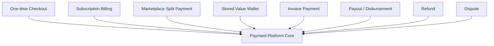

Jangan membuat payment flow per product secara terpisah tanpa shared core. Itu membuat reconciliation dan ledger kacau.

Tetapi jangan juga membuat satu model generik super abstrak yang sulit dipahami. Payment core harus punya konsep yang cukup universal:

- money amount.
- party.
- payment method.
- payment intent.
- attempt.
- authorization.
- capture.
- refund.
- ledger journal.
- settlement.
- external reference.

Product-specific behavior masuk sebagai metadata dan policy, bukan cabang liar di semua tempat.

---

## 21. Boundary untuk “Build From Scratch” di Seri Ini

Kita akan membangun payment platform dengan asumsi realistis berikut:

### 21.1 Domain yang Akan Kita Implementasikan

- Payment Intent.
- Payment Attempt.
- Provider Adapter interface.
- Webhook ingestion.
- Idempotency store.
- Payment state machine.
- Double-entry ledger.
- Balance projection.
- Refund.
- Reconciliation import and matching.
- Settlement batch.
- Payout instruction.
- Risk/limit decision stub.
- Backoffice timeline.
- Provider simulator.

### 21.2 Domain yang Akan Kita Modelkan Tetapi Tidak Diimplementasikan Penuh

- PCI-grade card vault.
- HSM integration.
- full AML screening provider.
- scheme dispute portal integration.
- direct ISO 8583 switch.
- real BI-FAST/QRIS participant connectivity.
- real bank host-to-host onboarding.

Kenapa? Karena beberapa area membutuhkan sertifikasi, izin, kontrak, hardware, atau akses partner. Tetapi kita tetap akan modelkan boundary dan adapter-nya agar desain kita production-aware.

---

## 22. Deployment Boundary Awal

Untuk seri ini, deployment logical yang masuk akal:

```text
payment-api
payment-core
provider-simulator
ledger-service
reconciliation-service
settlement-service
backoffice-api
```

Dengan infrastruktur pendukung:

```text
PostgreSQL
Kafka / event bus
Redis for idempotency/cache where appropriate
Object storage for reports/evidence
KMS/secret manager abstraction
Observability stack
```

Tetapi sekali lagi: kita tidak akan mengulang cara install PostgreSQL/Kafka/Kubernetes. Kita akan fokus pada apa yang payment-specific.

---

## 23. Apa yang Harus Terjadi Ketika Payment Berhasil?

Untuk memperjelas boundary, mari lihat flow sukses sederhana:

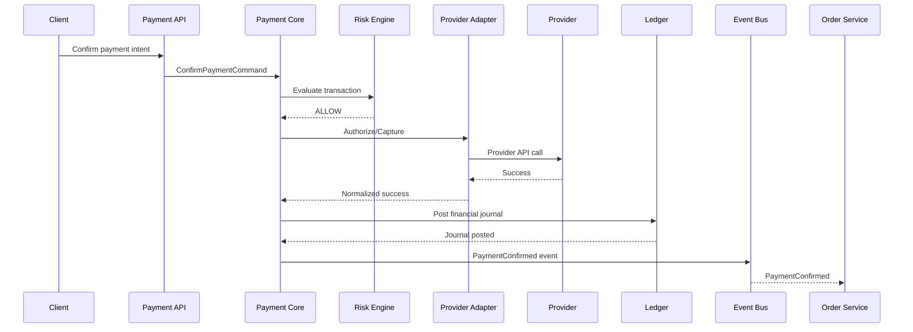

Boundary penting:

- Client tidak bicara ke ledger.
- Order tidak bicara ke provider.
- Provider adapter tidak publish `PaymentConfirmed` sendiri.
- Ledger tidak memutuskan order paid.
- Payment Core tidak menyimpan journal sebagai kolom asal-asalan.

---

## 24. Apa yang Harus Terjadi Ketika Provider Timeout?

Flow timeout jauh lebih menarik:

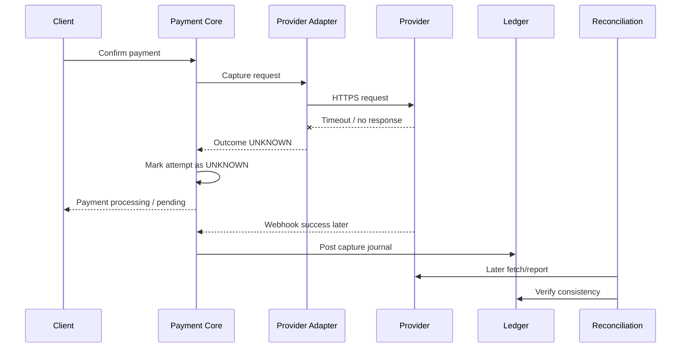

Kalau boundary salah, timeout akan dianggap gagal. Itu bisa membuat user mencoba lagi dan akhirnya double charge.

Dengan boundary benar, timeout menghasilkan `UNKNOWN`, bukan `FAILED`.

---

## 25. State Ownership Matrix

| State/Status | Owner | Boleh diubah oleh | Tidak boleh diubah oleh |
|---|---|---|---|
| Payment intent status | Payment Core | Payment Core command handler/state machine | Provider adapter langsung, Order service, SQL manual |
| Payment attempt status | Payment Core/Orchestration | Orchestrator setelah evidence | Order service, Ledger |
| Provider interaction status | Provider Integration | Adapter/Webhook ingestion | Order service |
| Ledger journal posted | Ledger | Ledger service only | Payment Core direct table update |
| Recon break status | Reconciliation | Recon workflow/Ops with audit | Provider adapter |
| Settlement batch status | Settlement | Settlement engine/Ops approval | Payment Core |
| Payout instruction status | Payout | Payout engine/provider callback | Merchant dashboard langsung |
| Risk hold status | Risk/Ops | Risk policy/Ops approval | Payment provider |

Matrix ini nanti akan diterjemahkan menjadi database constraints, service contracts, role permissions, dan audit events.

---

## 26. Anti-Pattern Scope yang Harus Ditolak

### 26.1 “Kita Simpan Semua Status di Satu Tabel Payments”

Awalnya terlihat mudah.

```sql
CREATE TABLE payments (
  id UUID PRIMARY KEY,
  order_id UUID,
  provider_status TEXT,
  payment_status TEXT,
  settlement_status TEXT,
  refund_status TEXT,
  chargeback_status TEXT,
  amount NUMERIC,
  fee NUMERIC,
  merchant_balance NUMERIC
);
```

Masalah:

- status lifecycle bercampur dengan settlement.
- refund bisa banyak, tetapi kolom cuma satu.
- chargeback bisa beberapa tahap.
- provider interaction hilang.
- audit tidak jelas.
- ledger tidak immutable.
- reconciliation sulit.

### 26.2 “Webhook Langsung Update Order”

Buruk:

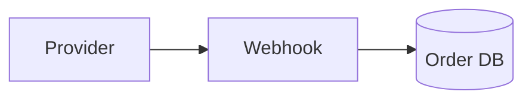

Masalah:

- duplicate webhook bisa double effect.
- order service tidak tahu provider evidence mana yang valid.
- tidak ada ledger posting.
- replay webhook berbahaya.
- reconciliation tidak punya timeline internal.

### 26.3 “Refund Cukup Panggil Provider”

Refund mengubah banyak hal:

- customer receiving money back.
- merchant payable berkurang atau menjadi negative balance.
- platform fee bisa dikembalikan atau tidak.
- tax bisa berubah.
- settlement batch bisa terkena dampak.
- dispute exposure bisa berubah.
- ledger harus posting.

Provider refund success tanpa ledger posting adalah financial drift.

### 26.4 “Manual Fix Langsung SQL”

SQL manual mungkin menyelesaikan incident hari itu tetapi menghancurkan audit.

Manual fix harus menjadi domain action:

```text
ManualAdjustmentRequested
ManualAdjustmentApproved
LedgerCorrectionPosted
PaymentTimelineAnnotated
```

Bukan:

```sql
UPDATE payments SET status = 'PAID' WHERE id = '...';
```

---

## 27. Capability Prioritization untuk Build

Urutan build yang sehat:

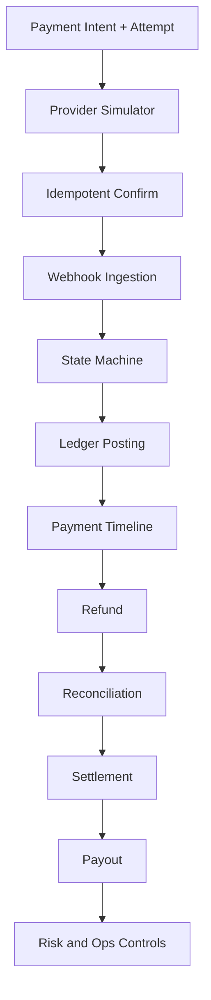

Kenapa ledger sebelum reconciliation? Karena reconciliation butuh internal truth yang stabil.

Kenapa provider simulator awal? Karena tanpa simulator, kita tidak bisa menguji timeout, duplicate webhook, delayed success, reversal, dan settlement mismatch secara deterministik.

Kenapa ops controls tidak paling akhir secara absolut? Karena sejak awal kita butuh visibility. Tetapi operasi yang mengubah uang harus muncul setelah ledger dan audit siap.

---

## 28. Domain Model Skeleton

Model awal yang akan kita kembangkan:

```java
public final class PaymentIntent {
    private PaymentIntentId id;
    private MerchantId merchantId;
    private OrderReference orderReference;
    private Money amount;
    private PaymentIntentStatus status;
    private List<PaymentAttempt> attempts;
    private Instant createdAt;
    private Instant updatedAt;
}
```

```java
public final class PaymentAttempt {
    private PaymentAttemptId id;
    private PaymentIntentId paymentIntentId;
    private PaymentMethod method;
    private ProviderCode providerCode;
    private PaymentAttemptStatus status;
    private ExternalReference externalReference;
    private Money amount;
    private Instant startedAt;
    private Instant completedAt;
}
```

```java
public final class ProviderInteraction {
    private ProviderInteractionId id;
    private PaymentAttemptId attemptId;
    private InteractionType type;
    private String requestHash;
    private String responseCode;
    private ProviderOutcome normalizedOutcome;
    private Instant occurredAt;
}
```

```java
public final class LedgerJournalRef {
    private PaymentIntentId paymentIntentId;
    private LedgerJournalId journalId;
    private JournalPurpose purpose;
}
```

Ini belum final. Tetapi cukup untuk menggambarkan boundary: payment intent bukan ledger journal, provider interaction bukan payment state, dan external reference bukan primary identity internal.

---

## 29. Contract Boundary dengan Order Service

Payment Platform tidak boleh bergantung pada tabel order. Ia menerima reference.

Contoh request:

```json
{
  "merchantId": "mrc_123",
  "orderReference": "ord_987",
  "amount": {
    "currency": "IDR",
    "minor": 25000000
  },
  "captureMode": "AUTOMATIC",
  "metadata": {
    "checkoutSessionId": "chk_456"
  }
}
```

Payment Platform bisa memvalidasi order reference melalui callback/API jika perlu, tetapi tidak menjadi owner order.

Event ke Order:

```json
{
  "eventType": "PaymentConfirmed",
  "paymentIntentId": "pi_123",
  "orderReference": "ord_987",
  "amount": {
    "currency": "IDR",
    "minor": 25000000
  },
  "confirmedAt": "2026-07-02T10:15:30+07:00"
}
```

Order Service menerima fakta domain, bukan status provider mentah.

---

## 30. Contract Boundary dengan Finance

Finance tidak cukup dengan `payment.status = SUCCESS`.

Finance butuh:

- ledger journal.
- settlement status.
- fees.
- tax.
- reserve.
- payout status.
- reconciliation status.
- adjustment history.

Contoh finance-facing read model:

```json
{
  "paymentIntentId": "pi_123",
  "grossAmount": { "currency": "IDR", "minor": 25000000 },
  "feeAmount": { "currency": "IDR", "minor": 750000 },
  "netMerchantAmount": { "currency": "IDR", "minor": 24250000 },
  "ledgerJournals": ["jrnl_001", "jrnl_002"],
  "reconciliationStatus": "MATCHED",
  "settlementStatus": "PENDING_SETTLEMENT"
}
```

Finance read model boleh didenormalisasi, tetapi harus bersumber dari ledger/recon/settlement, bukan status provider.

---

## 31. Contract Boundary dengan Support

Support butuh jawaban cepat:

- customer sudah bayar atau belum?
- kenapa payment gagal?
- apakah uang sudah keluar?
- kapan refund diproses?
- apakah butuh menunggu bank/provider?

Support view harus berupa timeline:

```text
10:00:01 Payment intent created
10:00:05 Customer selected card
10:00:06 Authorization request sent to ProviderA
10:00:08 Provider timeout: outcome unknown
10:00:23 Webhook received: authorization succeeded
10:00:24 Ledger journal posted
10:00:25 Order notified: payment confirmed
```

Jangan beri support akses langsung ke raw provider dashboard sebagai satu-satunya alat. Raw provider dashboard tidak punya konteks internal.

---

## 32. Contract Boundary dengan Merchant

Merchant butuh API/dashboard yang menjawab:

- transaksi apa yang sukses.
- kapan dana tersedia.
- biaya apa yang dipotong.
- refund/dispute apa yang memengaruhi balance.
- payout batch mana yang membawa dana.

Merchant tidak perlu melihat semua internal state. Tetapi data yang ditampilkan harus konsisten dengan ledger dan settlement.

Merchant-facing balance:

| Balance | Arti |
|---|---|
| Pending | captured tetapi belum available |
| Available | bisa dibayarkan |
| Reserved | ditahan untuk risk/dispute/rolling reserve |
| In payout | sedang dalam batch payout |
| Paid out | sudah dikirim ke rekening |

Ini bukan kolom asal di merchant table. Ini projection dari ledger + settlement + hold policy.

---

## 33. Policy Boundary

Payment platform butuh policy yang eksplisit:

- capture mode: automatic/manual.
- refund eligibility.
- max refund amount.
- partial refund allowed.
- duplicate payment handling.
- timeout resolution SLA.
- provider retry limit.
- settlement cutoff.
- payout schedule.
- reserve percentage.
- merchant risk tier.
- manual approval threshold.

Policy jangan ditanam sebagai if-else tersebar.

Contoh buruk:

```java
if (merchant.getCountry().equals("ID") && amount > 10000000 && provider.equals("X")) {
    // random rule
}
```

Lebih sehat:

```java
PaymentPolicyDecision decision = policyEngine.evaluate(new PaymentPolicyRequest(
    merchantId,
    amount,
    paymentMethod,
    captureMode,
    riskSignals
));
```

Policy engine tidak harus produk rules engine besar. Yang penting rule punya nama, version, reason, audit, dan test.

---

## 34. Non-Functional Requirements yang Payment-Specific

### 34.1 Latency

Tidak semua flow butuh latency sama.

| Flow | Target mental model |
|---|---|
| Payment confirm | user-facing, harus cepat tapi aman |
| Webhook ingestion | harus cepat acknowledge, processing bisa async |
| Ledger posting | harus konsisten, bukan asal cepat |
| Reconciliation | batch/offline, correctness lebih penting dari latency |
| Settlement | batch window, auditability penting |
| Backoffice search | cepat untuk investigation |

### 34.2 Availability

Payment acceptance downtime langsung berdampak revenue. Tetapi availability tidak boleh mengorbankan correctness.

Lebih baik payment pending daripada salah paid.

### 34.3 Durability

Semua event finansial harus durable sebelum dianggap berhasil.

### 34.4 Replayability

Sistem harus bisa replay provider webhook, report import, dan event projection tanpa double financial effect.

### 34.5 Explainability

Setiap state harus bisa dijelaskan:

```text
Payment is PENDING because provider API timed out and no webhook/report evidence has confirmed final outcome yet.
```

Bukan:

```text
status = 2
```

---

## 35. Minimal Acceptance Criteria untuk Boundary yang Benar

Sebelum lanjut ke API design, payment platform harus memenuhi acceptance criteria desain berikut:

1. Order service tidak menyimpan provider raw status sebagai truth.
2. Provider adapter tidak langsung mengubah order atau ledger.
3. Payment Core adalah satu-satunya owner lifecycle payment.
4. Ledger adalah satu-satunya owner financial posting.
5. Webhook ingestion idempotent dan tidak langsung menghasilkan efek ganda.
6. Timeout menghasilkan unknown/pending, bukan otomatis failed.
7. Refund punya lifecycle sendiri dan ledger effect sendiri.
8. Reconciliation bisa menemukan mismatch antara internal dan provider.
9. Settlement tidak dihitung dari payment table mentah, tetapi dari ledger/recon data.
10. Backoffice operation menghasilkan audit trail dan tidak melakukan SQL update langsung.

---

## 36. File dan Modul yang Akan Muncul Nanti

Saat implementasi, kita akan bergerak ke struktur seperti:

```text
learn-java-payment-platform/
  pom.xml
  payment-api/
    src/main/java/...
  payment-core/
    src/main/java/...
  payment-provider-spi/
    src/main/java/...
  payment-provider-simulator/
    src/main/java/...
  ledger-core/
    src/main/java/...
  reconciliation-core/
    src/main/java/...
  settlement-core/
    src/main/java/...
  risk-core/
    src/main/java/...
  backoffice-api/
    src/main/java/...
  platform-common/
    src/main/java/...
```

Tetapi struktur Maven bukan fokus part ini. Fokusnya adalah agar saat folder itu dibuat, setiap folder punya alasan domain.

---

## 37. Latihan Mental Model

Jawab pertanyaan berikut sebelum lanjut:

1. Jika provider mengirim webhook `SUCCESS` dua kali, context mana yang bertanggung jawab mencegah double ledger posting?
2. Jika order sudah dikirim tetapi reconciliation menunjukkan provider tidak pernah settle, context mana yang membuat break?
3. Jika merchant meminta payout tetapi risk hold aktif, context mana yang menolak payout?
4. Jika support ingin “mark as paid”, workflow aman apa yang harus menggantikan tombol itu?
5. Jika refund sukses di provider tetapi ledger posting gagal, state apa yang harus muncul dan siapa yang menyelesaikan?
6. Jika provider API timeout, kenapa tidak boleh langsung `FAILED`?
7. Jika settlement report berbeda timezone dari internal system, boundary mana yang menormalisasi cutoff?

Kalau jawabanmu masih “update tabel payment”, ulangi part ini.

---

## 38. Ringkasan

Payment platform production-grade dimulai dari boundary.

Boundary yang benar:

- Payment Core memiliki lifecycle truth.
- Ledger memiliki financial truth.
- Provider memberi evidence, bukan truth tunggal.
- Commerce domain menerima fakta pembayaran yang sudah dinormalisasi.
- Risk memberi keputusan dan efek policy.
- Reconciliation mendeteksi drift.
- Settlement menghitung payable final.
- Backoffice mengoperasikan koreksi dengan audit, bukan SQL manual.

Setelah boundary ini jelas, barulah kita bisa mendesain lifecycle payment secara detail.

Di part berikutnya, kita masuk ke **Payment Lifecycle Deep Dive**: intent, authorization, capture, clearing, settlement, refund, reversal, dispute, dan payout.

---

## 39. Referensi Resmi dan Bacaan Lanjutan

- PCI Security Standards Council — PCI DSS v4.0.1: https://blog.pcisecuritystandards.org/just-published-pci-dss-v4-0-1
- PCI Security Standards Council — Document Library: https://www.pcisecuritystandards.org/document_library/
- EMVCo — EMV 3-D Secure: https://www.emvco.com/emv-technologies/3-d-secure/
- Bank Indonesia — SNAP: https://www.bi.go.id/id/layanan/standar/snap/default.aspx
- Bank Indonesia — BI-FAST Infrastructure: https://www.bi.go.id/id/fungsi-utama/sistem-pembayaran/ritel/infrastruktur/default.aspx
- Bank Indonesia — Blueprint Sistem Pembayaran Indonesia: https://www.bi.go.id/id/fungsi-utama/sistem-pembayaran/blueprint/default.aspx
- Swift — ISO 20022 for Payments: https://www.swift.com/standards/iso-20022/iso-20022-financial-institutions-focus-payments-instructions
