------
title: Build From Scratch: Large Production Grade Java Payment Systems - Part 004
description: Deep dive lifecycle pembayaran production-grade: payment intent, authorization, capture, clearing, settlement, refund, reversal, dispute, payout, finality, unknown state, dan failure semantics.
series: learn-java-payment-systems
seriesTitle: Build From Scratch: Large Production Grade Java Payment Systems
order: 4
partTitle: Payment Lifecycle Deep Dive
tags:
- java
- payments
- payment-lifecycle
- state-machine
- authorization
- capture
- settlement
- refund
- dispute
date: 2026-07-02
---

# Part 004 — Payment Lifecycle Deep Dive

Di part sebelumnya kita menarik boundary: siapa pemilik lifecycle, siapa pemilik ledger, siapa pemilik evidence, dan siapa pemilik fulfillment. Sekarang kita masuk ke lifecycle itu sendiri.

Payment lifecycle bukan sekadar:

```text
PENDING -> SUCCESS -> FAILED
```

Model seperti itu terlalu miskin untuk production.

Di dunia nyata, pembayaran melewati tahap yang berbeda-beda: intent, attempt, authorization, authentication, capture, clearing, settlement, refund, reversal, dispute, chargeback, payout, dan reconciliation. Beberapa tahap synchronous, sebagian asynchronous. Sebagian final, sebagian reversible. Sebagian memindahkan uang, sebagian hanya menahan atau menjanjikan uang.

Kalau lifecycle salah, semua downstream ikut salah: order fulfillment, ledger, settlement, merchant balance, customer support, risk, dispute, dan laporan finance.

Part ini membangun model lifecycle yang akan kita pakai sepanjang seri.

---

## 1. Tujuan Part Ini

Setelah part ini, kamu harus bisa:

1. Menjelaskan perbedaan payment intent, payment attempt, authorization, capture, clearing, settlement, refund, reversal, dispute, chargeback, dan payout.
2. Mendesain state machine payment yang cukup kaya tetapi tidak berlebihan.
3. Memahami kenapa `success` dari provider harus diterjemahkan ke domain event yang spesifik.
4. Memahami kapan uang masih pending, authorized, captured, settled, available, disputed, atau paid out.
5. Memahami unknown state sebagai first-class lifecycle state.
6. Memahami lifecycle yang berbeda untuk card, bank transfer, QR, wallet, dan payout.
7. Menentukan kapan order boleh dianggap paid dan kapan finance boleh menganggap transaksi settled.

---

## 2. Lifecycle Besar: Dari Niat Membayar Sampai Uang Tersedia

Secara konseptual, payment acceptance bisa digambarkan seperti ini:

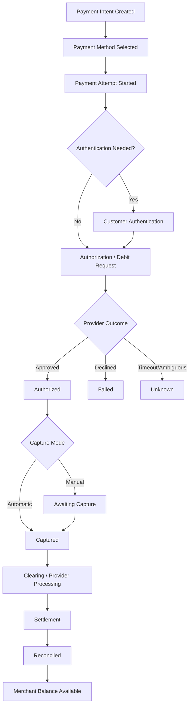

Namun diagram ini masih menyederhanakan. Dalam production, refund, void, reversal, dispute, chargeback, and payout bisa masuk di tengah lifecycle.

---

## 3. Payment Intent

Payment intent adalah representasi niat untuk menerima pembayaran.

Ia menjawab:

> “Ada kewajiban membayar sebesar X currency Y untuk merchant/order/reference tertentu.”

Payment intent belum tentu punya attempt. Customer bisa belum memilih metode pembayaran. Payment intent juga bisa punya lebih dari satu attempt, misalnya card pertama declined lalu customer mencoba wallet.

Contoh:

```json
{
  "id": "pi_123",
  "merchantId": "mrc_001",
  "orderReference": "ord_9001",
  "amount": {
    "currency": "IDR",
    "minor": 25000000
  },
  "captureMode": "AUTOMATIC",
  "status": "REQUIRES_PAYMENT_METHOD"
}
```

### 3.1 Kenapa Intent Penting?

Tanpa intent, sistem biasanya langsung membuat transaction per provider. Itu membuat retry dan multi-attempt kacau.

Intent memberi identitas stabil:

```text
Payment Intent: pi_123
  Attempt 1: card via ProviderA -> declined
  Attempt 2: QR via ProviderB -> expired
  Attempt 3: wallet via ProviderC -> succeeded
```

Order hanya peduli bahwa `pi_123` confirmed, bukan attempt mana yang akhirnya berhasil.

### 3.2 State Payment Intent Awal

State awal yang masuk akal:

| State | Arti |
|---|---|
| `REQUIRES_PAYMENT_METHOD` | intent dibuat, belum ada metode valid |
| `REQUIRES_CONFIRMATION` | metode tersedia, butuh confirm |
| `PROCESSING` | attempt sedang berjalan atau outcome belum final |
| `REQUIRES_ACTION` | customer harus menyelesaikan auth/action eksternal |
| `AUTHORIZED` | dana disetujui/di-hold tetapi belum captured |
| `CAPTURED` | dana berhasil dicapture/debit secara domain |
| `CANCELLED` | intent dibatalkan sebelum final capture |
| `FAILED` | tidak ada attempt yang berhasil dan intent selesai gagal |
| `PARTIALLY_REFUNDED` | sebagian dana dikembalikan |
| `REFUNDED` | seluruh captured amount dikembalikan |
| `DISPUTED` | ada dispute/chargeback aktif |

Jangan gunakan terlalu banyak state jika belum ada aksi domain yang berbeda. State harus punya konsekuensi.

---

## 4. Payment Attempt

Payment attempt adalah satu percobaan konkret untuk memproses intent melalui payment method/provider tertentu.

Contoh:

```json
{
  "id": "pa_001",
  "paymentIntentId": "pi_123",
  "method": "CARD",
  "provider": "PROVIDER_A",
  "amount": {
    "currency": "IDR",
    "minor": 25000000
  },
  "status": "AUTHORIZATION_DECLINED"
}
```

Payment attempt harus terpisah dari intent karena:

- satu intent bisa dicoba beberapa kali.
- provider references berbeda per attempt.
- decline reason berbeda per attempt.
- risk signals berbeda per attempt.
- authentication bisa terjadi per attempt.
- ledger effect hanya muncul pada attempt yang berhasil.

### 4.1 Attempt State

| Attempt State | Arti |
|---|---|
| `CREATED` | attempt dibuat tetapi belum dikirim ke provider |
| `AUTHENTICATION_REQUIRED` | customer perlu menyelesaikan action/auth |
| `AUTHENTICATION_FAILED` | customer gagal auth |
| `AUTHORIZATION_REQUESTED` | request authorization/debit dikirim |
| `AUTHORIZED` | authorization berhasil |
| `AUTHORIZATION_DECLINED` | provider/issuer menolak |
| `AUTHORIZATION_UNKNOWN` | outcome authorization belum jelas |
| `CAPTURE_REQUESTED` | capture dikirim |
| `CAPTURED` | capture berhasil |
| `CAPTURE_DECLINED` | capture ditolak/gagal final |
| `CAPTURE_UNKNOWN` | outcome capture belum jelas |
| `EXPIRED` | attempt tidak diselesaikan sampai batas waktu |
| `CANCELLED` | attempt dibatalkan |

Attempt state lebih detail dari intent state. Intent state adalah agregasi bisnis.

---

## 5. Authorization

Authorization berarti pihak yang mengendalikan dana memberi persetujuan bahwa dana boleh ditahan atau didebit sesuai aturan metode pembayaran.

Pada card, authorization biasanya berarti issuer menyetujui transaksi dan menahan limit/dana. Pada wallet, bisa berarti wallet balance didebit atau di-reserve tergantung provider. Pada bank transfer/QR, konsep authorization bisa berbeda atau tidak eksplisit.

### 5.1 Authorization Bukan Settlement

Authorization bukan berarti merchant sudah menerima uang final.

Authorization menjawab:

> “Apakah transaksi ini disetujui untuk dilanjutkan?”

Settlement menjawab:

> “Apakah dana antar institusi sudah diperhitungkan/dipindahkan sesuai settlement?”

Kesalahan umum:

```text
authorized == paid == settled
```

Yang benar:

```text
authorized <= captured <= cleared/reported <= settled <= reconciled <= available
```

Tidak semua rail punya semua tahap secara eksplisit, tetapi mental model ini menjaga kita dari kesalahan finalitas.

### 5.2 Authorization Expiry

Authorization bisa kedaluwarsa. Jika capture tidak dilakukan sebelum expiry, authorization tidak bisa digunakan.

State yang perlu disiapkan:

- `AUTHORIZED`.
- `AUTHORIZATION_EXPIRED`.
- `CAPTURE_FAILED_AUTH_EXPIRED`.

Untuk manual capture, expiry penting karena bisnis bisa menunda fulfilment. Hotel, rental, pre-order, dan marketplace sering memakai manual capture.

---

## 6. Authentication dan 3DS

Authentication menjawab:

> “Apakah customer perlu membuktikan identitas/kepemilikan payment method?”

Untuk card-not-present, EMV 3-D Secure adalah salah satu protokol penting yang membantu issuer dan merchant meningkatkan keamanan pembayaran e-commerce dan mengurangi fraud card-not-present.

Dalam lifecycle, authentication bisa menghasilkan:

| Outcome | Dampak |
|---|---|
| Frictionless success | lanjut authorization tanpa challenge customer |
| Challenge required | customer harus melakukan action |
| Challenge success | lanjut authorization |
| Challenge failed | attempt gagal |
| Authentication unavailable | policy menentukan lanjut atau fail |

Model state:

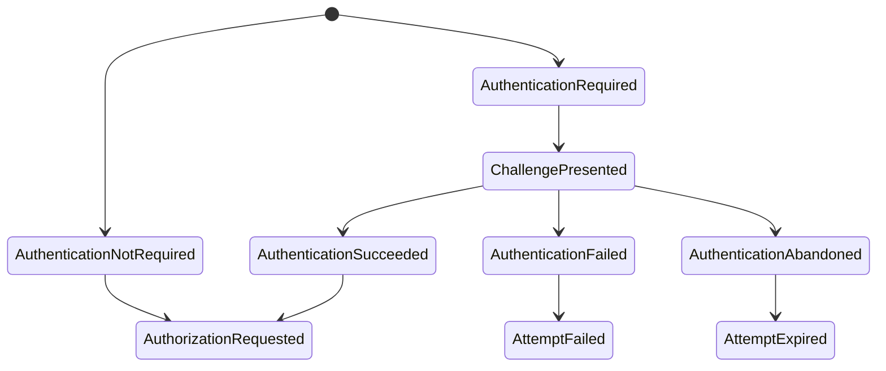

Jangan campur authentication dengan authorization. Customer bisa berhasil authentication tetapi issuer tetap decline authorization.

---

## 7. Capture

Capture adalah tindakan meminta dana yang sudah authorized untuk ditagihkan/diambil.

Ada dua mode utama:

| Capture Mode | Arti |
|---|---|
| Automatic capture | authorization dan capture dilakukan berdekatan dalam satu flow user checkout |
| Manual capture | authorization dilakukan dulu, capture dilakukan belakangan |

### 7.1 Automatic Capture

Cocok untuk barang/jasa yang langsung diberikan:

- digital goods.
- food delivery.
- simple ecommerce.
- top-up wallet.

Flow:

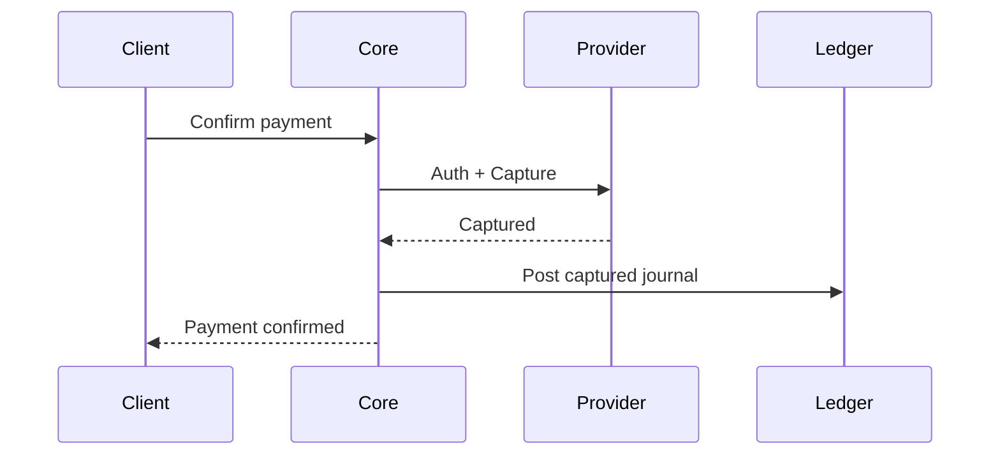

### 7.2 Manual Capture

Cocok untuk:

- hotel.
- rental.
- marketplace order validation.
- stock confirmation.
- fraud review.
- delayed fulfillment.

Flow:

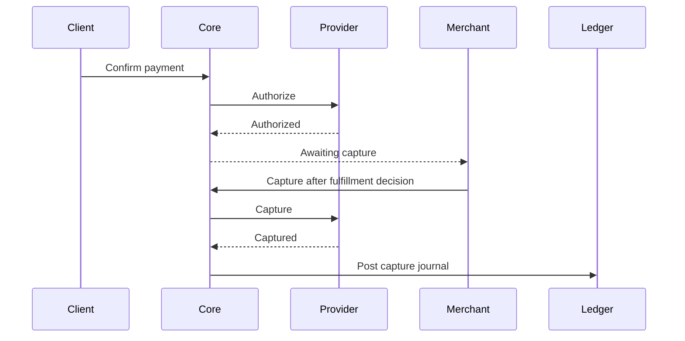

### 7.3 Partial Capture

Manual capture bisa partial. Misalnya order 3 item, 1 item out of stock.

Rules yang harus jelas:

- apakah partial capture allowed?
- apakah remaining authorization dibatalkan otomatis?
- apakah multiple capture allowed?
- apakah capture amount boleh lebih kecil dari authorized amount?
- bagaimana fee dihitung?
- bagaimana ledger posting partial?

Jangan membuat `capturedAmount` sebagai field mutable tanpa journal.

---

## 8. Clearing

Clearing adalah proses pertukaran informasi transaksi antar institusi untuk menghitung kewajiban settlement. Dalam banyak integrasi PSP, clearing tidak selalu terlihat langsung oleh merchant/platform. Tetapi efeknya muncul di report dan settlement.

Untuk platform kita, clearing dipahami sebagai tahap:

> “Provider/scheme/bank memproses transaksi untuk settlement dan report.”

Kenapa perlu dimodelkan walau tidak selalu ada API clearing?

Karena beberapa issue baru terlihat setelah real-time success:

- transaction missing from settlement file.
- amount differs.
- fee differs.
- transaction reversed.
- settlement delayed.
- cut-off masuk hari berbeda.

Lifecycle internal bisa punya state/read model seperti:

| Status | Arti |
|---|---|
| `CAPTURED_NOT_REPORTED` | internal captured, belum muncul di report |
| `REPORTED_BY_PROVIDER` | muncul di provider report |
| `MATCHED_FOR_SETTLEMENT` | cocok dengan expected settlement |
| `SETTLEMENT_BREAK` | mismatch perlu investigasi |

Ini bukan selalu payment intent state utama. Bisa menjadi reconciliation/settlement dimension.

---

## 9. Settlement

Settlement adalah tahap ketika kewajiban finansial antar pihak diperhitungkan dan dana masuk/keluar melalui jalur settlement.

Untuk merchant/platform, settlement sering berarti:

- provider/acquirer menyetorkan dana ke platform.
- platform menghitung payable merchant.
- platform membayar merchant sesuai jadwal.

Ada dua settlement yang sering tercampur:

| Settlement | Arti |
|---|---|
| External settlement | provider/bank/scheme menyelesaikan dana ke platform/acquirer/merchant |
| Merchant settlement | platform menghitung dan membayar merchant/seller |

Keduanya tidak selalu sama.

### 9.1 Settlement Timeline

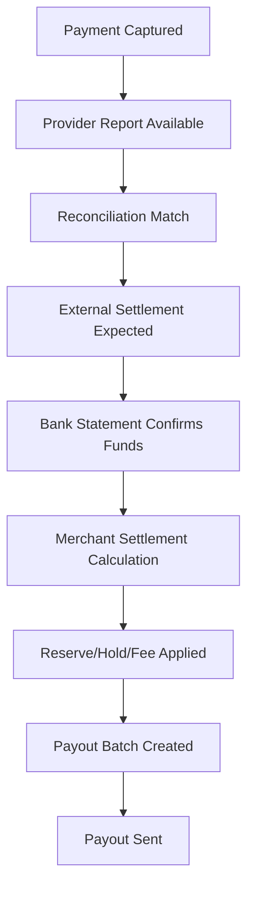

### 9.2 Settlement Bukan Satu Kolom

Settlement memiliki banyak dimensi:

- expected settlement date.
- actual settlement date.
- gross amount.
- net amount.
- fee.
- tax.
- reserve.
- currency.
- FX rate.
- provider batch ID.
- bank statement reference.
- payout batch ID.

Jangan desain:

```sql
settlement_status = 'DONE'
```

Tanpa breakdown, status itu tidak menjawab apa-apa bagi finance.

---

## 10. Refund

Refund adalah pengembalian dana ke customer setelah payment berhasil dicapture/debit.

Refund punya lifecycle sendiri. Satu payment bisa memiliki banyak refund.

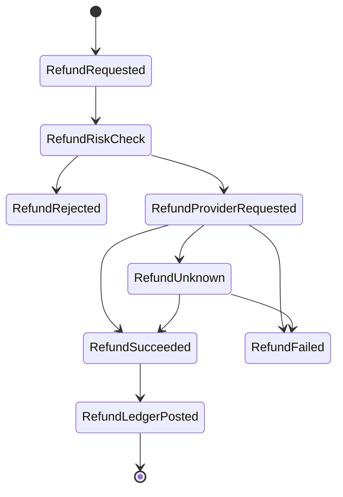

### 10.1 Refund Rules

Rules minimal:

- refund amount tidak boleh melebihi refundable amount.
- partial refund boleh/tidak.
- multiple refund boleh/tidak.
- fee dikembalikan atau tidak.
- refund setelah settlement memengaruhi merchant balance/payout.
- refund sebelum settlement bisa netted di settlement batch.
- refund setelah payout bisa membuat merchant balance negatif.

### 10.2 Refund Ledger Effect

Contoh sederhana:

Saat capture:

```text
Dr Customer/Card Receivable       100.00
Cr Merchant Pending Payable        97.00
Cr Platform Fee Revenue             3.00
```

Saat full refund dengan fee juga dikembalikan:

```text
Dr Merchant Pending Payable        97.00
Dr Platform Fee Revenue             3.00
Cr Customer Refund Payable        100.00
```

Jika refund sudah dikirim:

```text
Dr Customer Refund Payable        100.00
Cr Cash/Bank                      100.00
```

Ini contoh konseptual. Chart of accounts aktual bisa berbeda.

---

## 11. Void dan Reversal

Void dan reversal sering disamakan dengan refund, padahal berbeda.

| Istilah | Kapan terjadi | Efek |
|---|---|---|
| Void | sebelum capture/settlement final | membatalkan authorization/capture request sebelum dana final |
| Reversal | koreksi terhadap transaksi yang sebelumnya dianggap berhasil/terkirim | membalik efek transaksi karena error/timeout/network correction |
| Refund | setelah capture/debit berhasil | mengembalikan dana ke customer |

### 11.1 Void Authorization

Jika manual capture tidak jadi dilakukan, authorization bisa di-void.

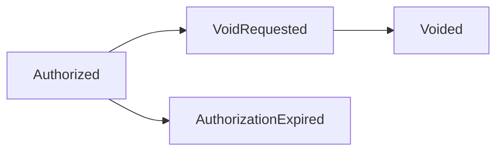

### 11.2 Reversal Karena Unknown Outcome

Misalnya provider timeout, lalu internal sempat menunggu. Provider kemudian mengirim reversal.

Reversal harus diproses sebagai evidence baru, bukan sekadar `status = failed`.

```text
Attempt: CAPTURE_UNKNOWN
Provider event: CAPTURE_REVERSED
Payment intent: may become FAILED or REQUIRES_PAYMENT_METHOD
Ledger: only reverse if previous journal had been posted
```

Rule penting:

> Reversal hanya boleh membalik efek yang benar-benar pernah dicatat.

Kalau tidak ada capture journal, jangan posting reversal capture journal.

---

## 12. Dispute dan Chargeback

Dispute adalah klaim bahwa transaksi bermasalah. Chargeback adalah mekanisme pembalikan dana dalam card scheme atau rail tertentu, dengan aturan, reason code, evidence, deadline, dan liability.

Dispute lifecycle:

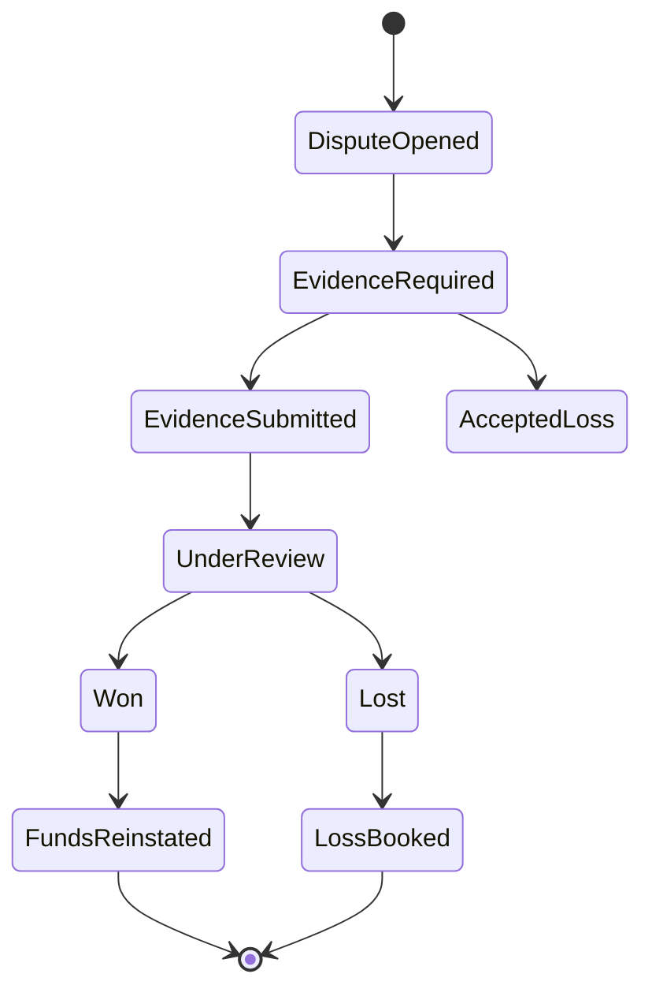

### 12.1 Dispute Bukan Refund

Refund adalah platform/merchant mengembalikan dana secara controlled.

Chargeback bisa dipaksakan oleh scheme/issuer/rail berdasarkan dispute process.

Efeknya:

- merchant payable bisa dikurangi.
- platform cash bisa berkurang.
- fee dispute bisa muncul.
- reserve bisa digunakan.
- risk score merchant berubah.
- evidence deadline harus dipantau.

### 12.2 Dispute State Tidak Boleh Menimpa Payment State Mentah

Payment bisa tetap `CAPTURED`, tetapi punya dispute aktif.

Jangan lakukan:

```text
payment.status = CHARGEBACK
```

Lebih sehat:

```text
PaymentIntent status: CAPTURED
Dispute status: EVIDENCE_REQUIRED
Ledger: dispute hold/loss exposure journal
```

Payment lifecycle dan dispute lifecycle adalah dimensi berbeda.

---

## 13. Payout

Payout adalah pemindahan dana dari platform ke pihak eksternal: merchant, seller, partner, driver, creator, atau customer.

Payout bukan kebalikan sederhana dari payment.

Payout lifecycle:

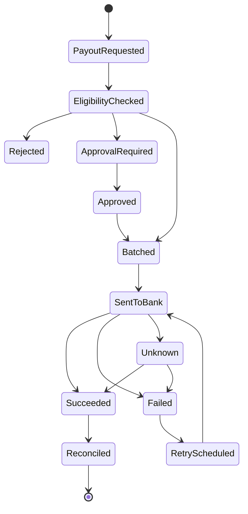

Payout harus membaca:

- available balance.
- risk hold.
- settlement availability.
- beneficiary validation.
- approval threshold.
- duplicate payout guard.

Payout error lebih sensitif daripada collection error karena dana keluar dari sistem.

---

## 14. Unknown State sebagai First-Class State

Unknown state bukan bug. Unknown state adalah fakta distributed systems.

Unknown terjadi ketika:

- provider API timeout.
- connection reset setelah provider memproses request.
- webhook belum datang.
- webhook datang tetapi signature invalid.
- provider report terlambat.
- provider mengirim status konflik.
- bank statement belum tersedia.
- payout file dikirim tetapi bank belum mengkonfirmasi.

### 14.1 Kenapa Unknown Tidak Boleh Disamakan dengan Failed?

Karena request bisa sukses di sisi provider walaupun client tidak menerima response.

Jika sistem menandai `FAILED`, user bisa retry. Jika retry membuat charge baru, double charge terjadi.

Lebih aman:

```text
Provider timeout -> AUTHORIZATION_UNKNOWN / CAPTURE_UNKNOWN
Client response -> PROCESSING
Background resolver -> poll provider / wait webhook / recon report
```

### 14.2 Unknown Resolution Flow

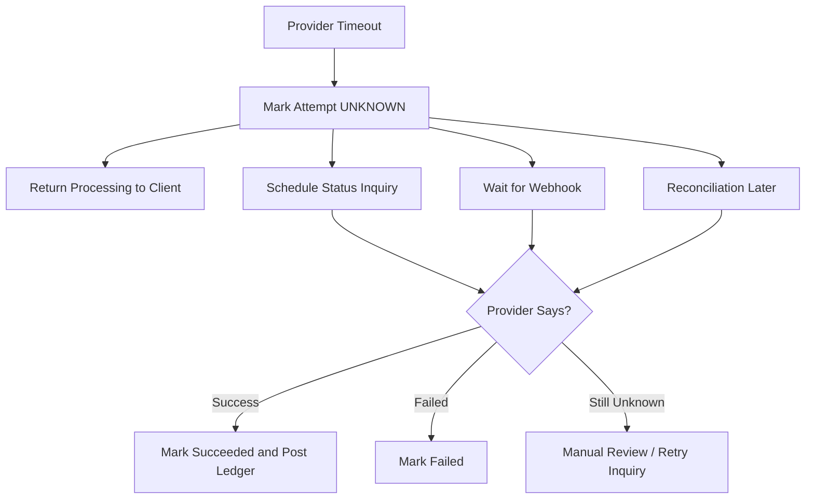

Unknown state harus punya SLA dan owner. Kalau tidak, ia menjadi kuburan transaksi.

---

## 15. Lifecycle per Payment Method

Tidak semua method mengikuti card lifecycle.

### 15.1 Card

Umumnya:

```text
Intent -> Authentication/3DS -> Authorization -> Capture -> Clearing -> Settlement -> Reconciliation
```

Dengan variasi:

- auth only.
- auth + capture.
- partial capture.
- void.
- refund.
- chargeback.

### 15.2 Bank Transfer / Virtual Account

Umumnya:

```text
Intent -> VA Created -> Customer Transfers -> Bank Notification/Webhook -> Match -> Confirmed -> Settlement/Reconciliation
```

Tidak selalu ada authorization. Customer melakukan transfer eksternal. Challenge utamanya adalah matching dan expiry.

State tambahan:

- `AWAITING_TRANSFER`.
- `TRANSFER_RECEIVED_UNMATCHED`.
- `TRANSFER_MATCHED`.
- `EXPIRED`.
- `OVERPAID`.
- `UNDERPAID`.

### 15.3 QR Payment

Umumnya:

```text
Intent -> QR Generated -> Customer Scans -> Issuer/Wallet Approves -> Provider Webhook -> Confirmed -> Settlement
```

Untuk dynamic QR, amount dan merchant reference biasanya tertanam/terhubung ke QR session. Untuk static QR, matching bisa lebih kompleks.

### 15.4 Wallet

Wallet bisa berupa external wallet atau internal stored value.

External wallet:

```text
Intent -> Redirect/Deep Link -> Customer Approves -> Wallet Debit -> Webhook -> Confirmed
```

Internal wallet:

```text
Balance Check -> Reserve/Debit Ledger -> Confirmed
```

Internal wallet lebih dekat ke ledger karena balance berada di platform.

### 15.5 Payout / Bank Disbursement

```text
Payout Request -> Eligibility -> Approval -> Bank Instruction -> Bank Processing -> Success/Failed/Unknown -> Reconciliation
```

Tidak ada customer checkout. Tetapi idempotency dan unknown state tetap penting.

---

## 16. Payment Intent State Machine Versi Awal

State machine intent yang akan kita gunakan sebagai baseline:

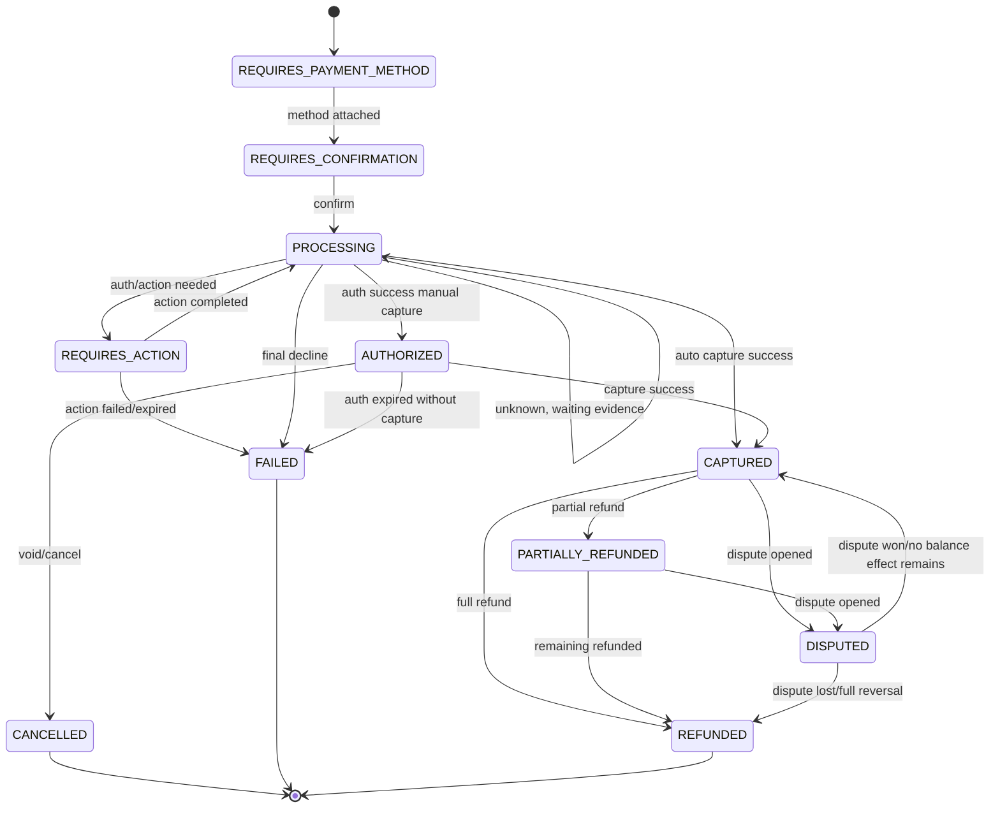

Catatan:

- `PROCESSING` dapat berarti active processing atau unknown waiting evidence.
- Dalam implementasi, kita bisa punya `processingReason` agar tidak ambigu.
- `DISPUTED` bisa juga menjadi separate aggregate, bukan state utama. Untuk awal, kita tampilkan sebagai state agar mental model terlihat.

---

## 17. Attempt State Machine Versi Awal

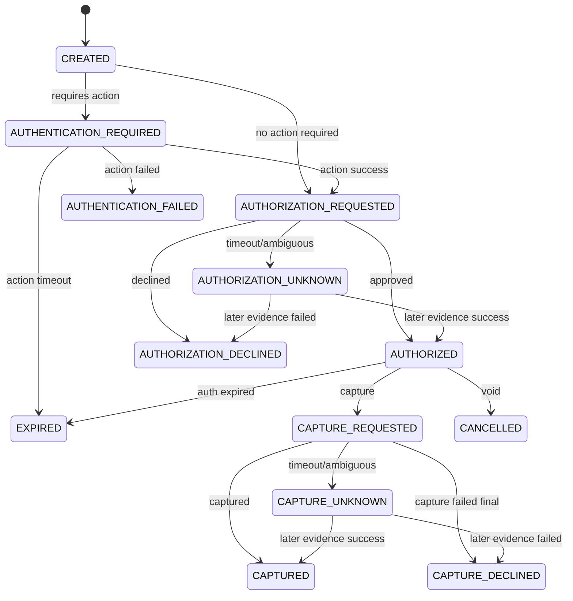

Attempt state lebih teknis karena berhubungan langsung dengan provider interaction.

---

## 18. Event yang Harus Dibedakan

Jangan membuat event generik `PaymentSuccess`. Buat event yang mencerminkan lifecycle.

| Event | Kapan dipakai |
|---|---|
| `PaymentIntentCreated` | intent dibuat |
| `PaymentAttemptStarted` | attempt konkret dimulai |
| `PaymentAuthenticationRequired` | customer perlu action |
| `PaymentAuthorizationSucceeded` | authorization berhasil |
| `PaymentAuthorizationDeclined` | authorization ditolak |
| `PaymentAuthorizationUnknown` | outcome authorization belum jelas |
| `PaymentCaptureSucceeded` | capture berhasil |
| `PaymentCaptureUnknown` | outcome capture belum jelas |
| `PaymentConfirmed` | domain menganggap payment cukup untuk fulfillment |
| `PaymentFailed` | final gagal |
| `RefundRequested` | refund dibuat |
| `RefundSucceeded` | refund berhasil |
| `DisputeOpened` | dispute aktif |
| `SettlementMatched` | settlement/recon cocok |
| `PayoutSucceeded` | payout berhasil |

Event harus membawa amount, currency, IDs, causation/correlation, dan reference ledger jika ada efek finansial.

---

## 19. Lifecycle dan Ledger Posting Points

Tidak semua state transition menghasilkan ledger posting.

| Transition | Ledger posting? | Catatan |
|---|---|---|
| Intent created | biasanya tidak | hanya niat bayar |
| Attempt started | tidak | belum ada efek uang |
| Authorization succeeded | bisa | jika model ledger mencatat hold/reservation |
| Capture succeeded | ya | merchant payable/revenue/receivable terbentuk |
| Void authorization | bisa | jika authorization hold dicatat |
| Refund succeeded | ya | membalik payable/revenue/customer liability |
| Dispute opened | bisa | hold/reserve/loss exposure |
| Chargeback lost | ya | loss/liability final |
| Settlement received | ya | cash/bank settlement |
| Payout sent | ya | mengurangi payable/cash |
| Payout failed | ya/bisa | reverse pending payout jika sudah posted |

Rule:

> Ledger posting harus mengikuti financial effect, bukan sekadar perubahan status.

---

## 20. Kapan Order Boleh Dianggap Paid?

Jawaban production-grade:

> Order boleh dianggap paid ketika payment domain telah mengeluarkan event `PaymentConfirmed` berdasarkan state transition yang valid dan ledger effect minimum yang diwajibkan berhasil dicatat.

Untuk automatic capture:

```text
Provider capture success + ledger capture journal posted -> PaymentConfirmed
```

Untuk manual capture:

```text
Authorization success -> order may be Authorized/Reserved
Capture success + ledger capture journal posted -> PaymentConfirmed/Paid
```

Untuk bank transfer:

```text
Bank notification/report matched + ledger collection journal posted -> PaymentConfirmed
```

Untuk QR:

```text
Provider webhook success + idempotency check + ledger journal posted -> PaymentConfirmed
```

Order tidak boleh membaca provider status langsung.

---

## 21. Kapan Merchant Balance Available?

Merchant balance available bukan sama dengan payment captured.

Dana bisa melalui dimensi:

```text
Captured -> Pending Settlement -> Settled -> Risk Hold/Reserve Applied -> Available -> In Payout -> Paid Out
```

Contoh:

| Kejadian | Pending | Available | In Payout | Paid Out |
|---|---:|---:|---:|---:|
| Capture 100, fee 3 | +97 | 0 | 0 | 0 |
| Settlement matched | -97 | +97 | 0 | 0 |
| Payout batch created | 0 | -97 | +97 | 0 |
| Payout succeeded | 0 | 0 | -97 | +97 |

Ini projection dari ledger, bukan field mutable asal.

---

## 22. Kapan Payment Final?

Finality berbeda per stakeholder.

| Stakeholder | “Final” berarti |
|---|---|
| Customer | pembayaran diterima atau dana dikembalikan |
| Merchant | order bisa dipenuhi dan dana akan dibayar |
| Finance | transaksi cocok di report dan settlement |
| Risk | tidak ada hold/dispute aktif |
| Platform | tidak ada unknown/recon break/material exposure |
| Regulator/Auditor | bukti lifecycle dan financial record lengkap |

Jadi jangan pernah bertanya “final belum?” tanpa konteks.

Gunakan istilah spesifik:

- customer-confirmed.
- provider-captured.
- ledger-posted.
- externally-reported.
- reconciled.
- settled.
- available.
- paid-out.
- dispute-closed.

---

## 23. Provider Status Mapping

Provider biasanya punya status sendiri. Kita harus normalize.

Contoh mapping:

| Provider Status | Provider Meaning | Domain Outcome |
|---|---|---|
| `00` | approved | authorization/capture succeeded tergantung operation |
| `05` | do not honor | declined |
| `51` | insufficient funds | declined, reason insufficient_funds |
| `PENDING` | processing | unknown/processing |
| `SUCCESS` | generic success | harus lihat operation: auth/capture/refund/payout |
| `FAILED` | generic failure | harus lihat final atau retriable |
| timeout | no response | unknown |
| HTTP 500 | server error | retriable/unknown tergantung idempotency |
| duplicate request | already processed | fetch original outcome |

Mapping tidak boleh hanya:

```java
if (providerStatus.equals("SUCCESS")) status = SUCCESS;
```

Harus mempertimbangkan operation, attempt, idempotency key, provider reference, dan previous state.

---

## 24. Lifecycle untuk Duplicate dan Retry

Retry terjadi di banyak tempat:

- client retry confirm.
- API gateway retry.
- service retry provider call.
- provider retry webhook.
- ops replay webhook.
- batch job retry settlement import.
- payout retry.

Setiap lifecycle command harus punya idempotency boundary.

Contoh confirm retry:

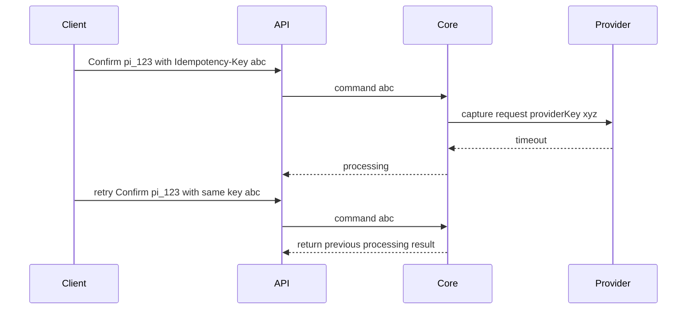

Tidak boleh membuat capture request baru sembarangan.

---

## 25. Expiry Semantics

Expiry muncul di banyak tempat:

| Object | Expiry meaning |
|---|---|
| Payment intent | customer tidak menyelesaikan pembayaran dalam waktu tertentu |
| Payment attempt | attempt spesifik tidak selesai |
| Authorization | hold/approval tidak bisa dicapture lagi |
| QR code | QR session tidak valid lagi |
| Virtual account | transfer setelah expiry perlu treatment khusus |
| Refund request | approval/processing window berakhir |
| Dispute evidence | deadline submit evidence lewat |
| Payout approval | approval kadaluwarsa |

Expiry harus menjadi domain event, bukan cron yang diam-diam update status.

Contoh:

```text
PaymentAttemptExpired
PaymentIntentExpired
AuthorizationExpired
DisputeEvidenceDeadlineMissed
```

---

## 26. Partial Amount Semantics

Payment platform harus memodelkan amount dengan hati-hati.

Untuk satu payment:

```text
authorized_amount
captured_amount
refunded_amount
disputed_amount
chargeback_amount
settled_amount
available_amount
paid_out_amount
```

Jangan menyimpan semua sebagai mutable summary tanpa journal. Summary boleh ada sebagai projection, tetapi truth tetap event/journal.

Rules:

```text
captured_amount <= authorized_amount       // untuk auth-capture flow
refunded_amount <= captured_amount - chargeback_amount? // tergantung policy
available_amount <= settled_amount - holds - reserves - payout_in_progress
```

Rule sebenarnya bisa lebih kompleks, tetapi invariant harus eksplisit.

---

## 27. Multi-Currency Lifecycle

Multi-currency membuat lifecycle lebih sulit karena amount bisa berubah representasi.

Contoh:

- customer membayar USD 10.
- merchant settlement IDR.
- provider fee USD.
- FX conversion memakai rate pada capture date atau settlement date.
- chargeback terjadi 30 hari kemudian dengan rate berbeda.

Minimal model:

```json
{
  "transactionAmount": { "currency": "USD", "minor": 1000 },
  "settlementAmount": { "currency": "IDR", "minor": 16500000 },
  "fxRate": {
    "base": "USD",
    "quote": "IDR",
    "rate": "16500.000000",
    "source": "PROVIDER_SETTLEMENT_REPORT",
    "asOf": "2026-07-02"
  }
}
```

Jangan konversi currency diam-diam di service berbeda.

---

## 28. Lifecycle Timeline sebagai Debugging Primitive

Setiap payment harus punya timeline.

Contoh:

```text
[10:00:00] PaymentIntentCreated amount=IDR 250000.00
[10:00:05] PaymentAttemptStarted method=CARD provider=ProviderA
[10:00:06] PaymentAuthenticationRequired type=3DS_CHALLENGE
[10:00:30] PaymentAuthenticationSucceeded
[10:00:31] AuthorizationRequested providerRef=req_abc
[10:00:32] AuthorizationSucceeded authCode=123456
[10:00:33] CaptureRequested amount=IDR 250000.00
[10:00:34] CaptureUnknown reason=PROVIDER_TIMEOUT
[10:01:10] ProviderWebhookReceived event=capture.succeeded
[10:01:11] CaptureSucceeded providerCaptureId=cap_xyz
[10:01:12] LedgerJournalPosted journalId=jrnl_001
[10:01:13] PaymentConfirmed emitted
```

Timeline harus menyatukan:

- domain events.
- provider interactions.
- webhook events.
- ledger journals.
- recon records.
- ops actions.

Support, finance, risk, dan engineer akan hidup dari timeline ini.

---

## 29. Lifecycle Table untuk Implementasi Awal

Kita akan mulai dari table konseptual ini:

```sql
payment_intent
payment_attempt
payment_event
provider_interaction
webhook_event
refund
refund_event
ledger_journal_ref
```

Belum masuk detail schema. Tetapi hubungan dasarnya:

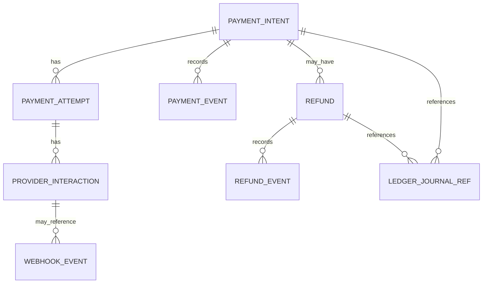

---

## 30. Java Domain Skeleton

```java
public enum PaymentIntentStatus {
    REQUIRES_PAYMENT_METHOD,
    REQUIRES_CONFIRMATION,
    REQUIRES_ACTION,
    PROCESSING,
    AUTHORIZED,
    CAPTURED,
    CANCELLED,
    FAILED,
    PARTIALLY_REFUNDED,
    REFUNDED,
    DISPUTED
}
```

```java
public enum PaymentAttemptStatus {
    CREATED,
    AUTHENTICATION_REQUIRED,
    AUTHENTICATION_FAILED,
    AUTHORIZATION_REQUESTED,
    AUTHORIZED,
    AUTHORIZATION_DECLINED,
    AUTHORIZATION_UNKNOWN,
    CAPTURE_REQUESTED,
    CAPTURED,
    CAPTURE_DECLINED,
    CAPTURE_UNKNOWN,
    EXPIRED,
    CANCELLED
}
```

```java
public enum ProviderOperation {
    AUTHENTICATE,
    AUTHORIZE,
    CAPTURE,
    VOID_AUTHORIZATION,
    REFUND,
    PAYOUT,
    STATUS_INQUIRY
}
```

```java
public enum NormalizedProviderOutcome {
    SUCCEEDED,
    DECLINED,
    FAILED_RETRIABLE,
    FAILED_FINAL,
    UNKNOWN,
    REQUIRES_ACTION
}
```

State enum ini bukan final. Tetapi cukup untuk menolak model `SUCCESS/FAILED` yang terlalu dangkal.

---

## 31. Transition Guard

State machine harus punya guard.

Contoh:

```java
public final class PaymentTransitionGuard {

    public void ensureCanCapture(PaymentIntent intent, Money captureAmount) {
        if (intent.status() != PaymentIntentStatus.AUTHORIZED) {
            throw new InvalidPaymentTransitionException(
                "Only AUTHORIZED payment can be captured"
            );
        }

        if (captureAmount.isGreaterThan(intent.remainingCapturableAmount())) {
            throw new InvalidPaymentAmountException(
                "Capture amount exceeds remaining capturable amount"
            );
        }
    }
}
```

Guard bukan hanya validasi input. Guard adalah perlindungan uang.

---

## 32. Lifecycle Failure Matrix

| Failure | Salah jika | Benar jika |
|---|---|---|
| Provider timeout saat capture | tandai failed final | tandai capture unknown, resolve later |
| Duplicate webhook success | post ledger dua kali | dedupe by provider event/reference + idempotent journal |
| Refund provider success, ledger fail | sembunyikan error | mark refund financial posting pending/failed, alert ops |
| Authorization expired | tetap bisa capture | prevent capture, require new attempt |
| Partial refund melebihi captured amount | izinkan | reject by invariant |
| Settlement missing transaction | abaikan | create reconciliation break |
| Payout timeout | retry blind | mark unknown, inquiry before retry |
| Dispute lost | cuma update status | post loss/chargeback journal |

---

## 33. Lifecycle dan Reconciliation

Lifecycle real-time tidak cukup. Reconciliation bisa mengubah pemahaman kita.

Contoh:

```text
Day 0: Provider API says capture succeeded.
Day 1: Settlement report does not include transaction.
Day 1: Reconciliation break created.
Day 2: Provider correction report includes reversal.
Day 2: Ledger correction required.
```

Payment state mungkin tetap `CAPTURED`, tetapi recon status `BREAK_OPEN`. Jangan memaksa semua dimensi masuk ke satu enum.

Better model:

```text
Payment lifecycle status: CAPTURED
Ledger status: JOURNAL_POSTED
Reconciliation status: BREAK_OPEN
Settlement status: NOT_SETTLED
Risk status: REVIEW_REQUIRED
```

Multi-dimensional status lebih jujur daripada satu status global palsu.

---

## 34. Lifecycle dan Reporting

Reporting harus jelas dimensi waktunya:

| Date | Meaning |
|---|---|
| created date | intent dibuat |
| authorized date | authorization berhasil |
| captured date | capture berhasil |
| provider reported date | muncul di report provider |
| settlement date | settlement terjadi |
| payout date | dana dikirim |
| reconciled date | match selesai |
| dispute opened date | dispute mulai |

Finance report yang salah biasanya memakai satu `created_at` untuk semua tujuan.

Jangan lakukan itu.

---

## 35. Lifecycle dan Customer Communication

Customer-facing status harus disederhanakan tanpa berbohong.

| Internal status | Customer message |
|---|---|
| `REQUIRES_ACTION` | “Please complete authentication.” |
| `PROCESSING` unknown | “Your payment is being processed. Please do not retry yet.” |
| `CAPTURED` | “Payment received.” |
| `FAILED` decline | “Payment was declined. Try another method.” |
| `REFUND_REQUESTED` | “Refund is being processed.” |
| `REFUNDED` | “Refund completed.” |

Customer tidak perlu tahu `CAPTURE_UNKNOWN`, tetapi sistem harus tahu.

---

## 36. Lifecycle dan Merchant Communication

Merchant-facing status juga berbeda:

| Internal state | Merchant view |
|---|---|
| Authorized manual capture | “Authorized, capture required before expiry.” |
| Captured not settled | “Payment successful, pending settlement.” |
| Settled, not available | “Settled, pending reserve/hold.” |
| Available | “Available for payout.” |
| Disputed | “Dispute opened, funds may be withheld.” |
| Chargeback lost | “Chargeback lost, balance adjusted.” |

Merchant status harus menjelaskan uang, bukan hanya checkout outcome.

---

## 37. Lifecycle Design Rules

Gunakan rules ini sepanjang seri:

1. Jangan gunakan `SUCCESS/FAILED` sebagai lifecycle lengkap.
2. Pisahkan intent dan attempt.
3. Pisahkan authentication, authorization, capture, settlement, refund, dispute, payout.
4. Unknown adalah state sah.
5. Provider status harus dinormalisasi berdasarkan operation.
6. Ledger posting mengikuti financial effect.
7. Reconciliation adalah dimensi terpisah dari payment lifecycle.
8. Settlement adalah dimensi terpisah dari capture.
9. Refund punya aggregate/lifecycle sendiri.
10. Dispute punya aggregate/lifecycle sendiri.
11. Payout punya aggregate/lifecycle sendiri.
12. Customer-facing status boleh sederhana, internal status tidak boleh miskin.
13. Timeline adalah debugging primitive.
14. Expiry adalah domain event.
15. Setiap transition harus punya guard dan audit metadata.

---

## 38. Latihan Desain

Coba desain lifecycle untuk kasus berikut:

1. Customer bayar dengan card, 3DS challenge sukses, authorization sukses, capture timeout, webhook capture sukses 2 menit kemudian.
2. Customer bayar QR, QR expired, tetapi customer membayar setelah expiry.
3. Bank transfer masuk lebih besar dari invoice amount.
4. Manual capture melewati authorization expiry.
5. Refund partial dilakukan setelah merchant payout selesai.
6. Payout ke merchant timeout, lalu bank statement menunjukkan dana terkirim.
7. Chargeback dibuka 20 hari setelah settlement dan merchant balance sudah nol.
8. Provider settlement report menunjukkan fee berbeda dari expected fee.

Untuk masing-masing, tentukan:

- intent state.
- attempt state.
- ledger effect.
- reconciliation status.
- settlement/payout effect.
- customer/merchant-facing message.
- operasi manual yang mungkin dibutuhkan.

---

## 39. Ringkasan

Payment lifecycle production-grade bukan linear sederhana.

Kita membutuhkan model yang membedakan:

- niat membayar: payment intent.
- percobaan konkret: payment attempt.
- pembuktian customer: authentication.
- persetujuan dana: authorization.
- pengambilan dana: capture.
- proses antar institusi: clearing.
- penyelesaian kewajiban: settlement.
- pengembalian dana: refund.
- pembatalan/koreksi: void/reversal.
- sengketa: dispute/chargeback.
- pengeluaran dana: payout.
- ketidakpastian: unknown state.

Lifecycle yang benar membuat sistem bisa menjawab pertanyaan paling penting:

> “Apa yang sudah benar-benar terjadi terhadap uang, apa yang baru kita yakini sementara, dan bukti apa yang mendukung keyakinan itu?”

Di part berikutnya, kita masuk ke **Core Invariants**: aturan yang tidak boleh dilanggar oleh payment system apa pun, bahkan ketika provider timeout, webhook duplikat, operator salah klik, atau settlement report datang terlambat.

---

## 40. Referensi Resmi dan Bacaan Lanjutan

- EMVCo — EMV 3-D Secure: https://www.emvco.com/emv-technologies/3-d-secure/
- EMVCo — EMV Specifications and Secure Payment Technologies: https://www.emvco.com/
- PCI Security Standards Council — PCI DSS v4.0.1: https://blog.pcisecuritystandards.org/just-published-pci-dss-v4-0-1
- Bank Indonesia — SNAP: https://www.bi.go.id/id/layanan/standar/snap/default.aspx
- Bank Indonesia — BI-FAST Infrastructure: https://www.bi.go.id/id/fungsi-utama/sistem-pembayaran/ritel/infrastruktur/default.aspx
- Swift — ISO 20022 for Financial Institutions: https://www.swift.com/standards/iso-20022/iso-20022-financial-institutions-focus-payments-instructions
