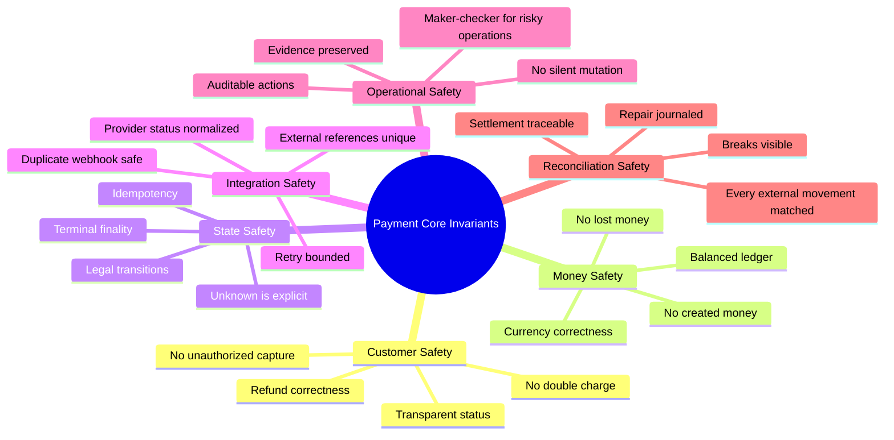
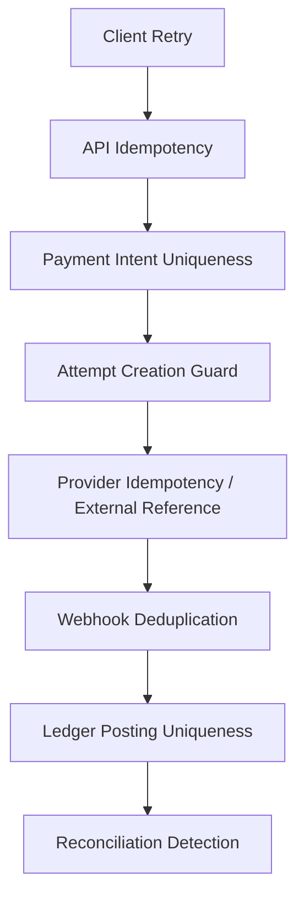
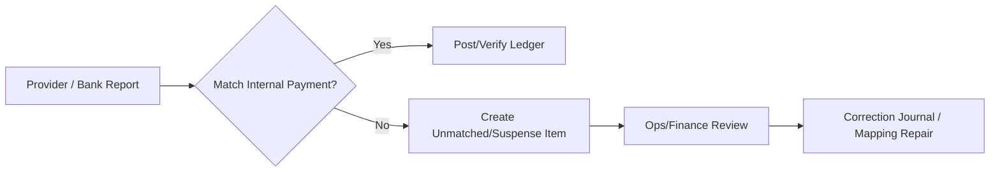
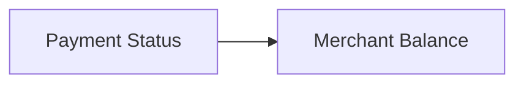
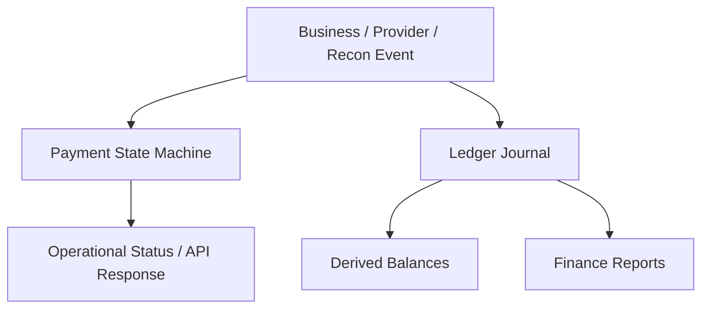
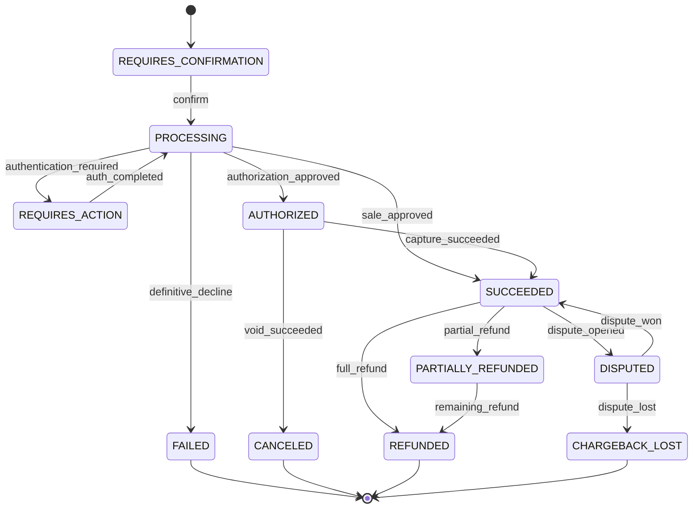
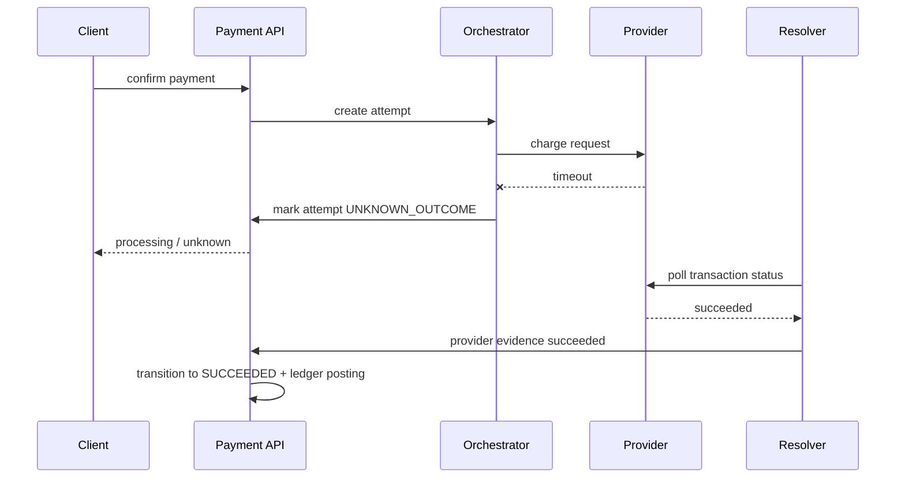
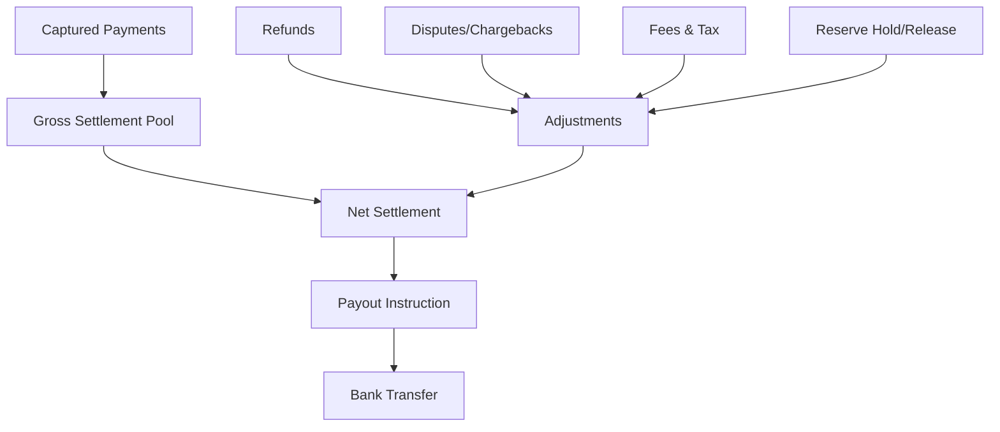
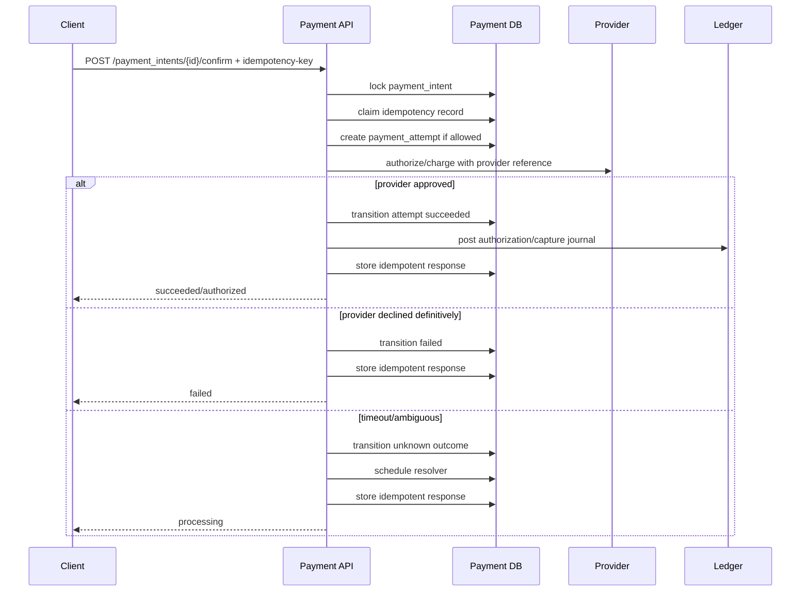

------
title: Build From Scratch: Large Production Grade Java Payment Systems - Part 005
description: Membangun invariant inti payment system enterprise: no double charge, no lost money, ledger-balanced, idempotent, auditable, reconcilable, dan safe under retries, webhook duplication, timeout, serta operator intervention.
series: learn-java-payment-systems
seriesTitle: Build From Scratch: Large Production Grade Java Payment Systems
order: 5
partTitle: Core Invariants
tags:
- java
- payments
- payment-systems
- invariants
- ledger
- idempotency
- reconciliation
- enterprise-architecture
date: 2026-07-02
---

# Part 005 — Core Invariants

Payment system production tidak boleh dirancang dari daftar endpoint.

Ia harus dirancang dari **invariant**.

Endpoint berubah. Provider berubah. Payment method bertambah. Format file settlement berubah. Tetapi invariant tidak boleh berubah, karena invariant adalah hukum internal yang menjaga sistem tetap benar ketika dunia luar tidak rapi.

Kalau kamu membangun sistem biasa, bug bisa berarti halaman error. Kalau kamu membangun payment system, bug bisa berarti:

- customer ditagih dua kali,
- merchant tidak menerima settlement,
- order dianggap paid padahal uang tidak pernah diterima,
- refund dikirim dua kali,
- dispute tidak dibukukan,
- finance tidak bisa menjelaskan saldo,
- auditor tidak bisa merekonstruksi keputusan,
- operator memperbaiki data dengan SQL manual dan menciptakan masalah baru.

Di part ini kita akan membangun daftar invariant yang harus memandu desain Java service, schema database, state machine, ledger, webhook ingestion, reconciliation, settlement, dan backoffice.

Gaya berpikirnya sederhana:

> jangan tanya dulu “endpoint apa yang perlu dibuat?”  
> tanya dulu “kondisi apa yang tidak boleh pernah dilanggar?”

---

## 1. Apa Itu Invariant?

Invariant adalah kondisi yang harus selalu benar pada sistem, terlepas dari urutan event, retry, timeout, duplicate message, crash, deployment, provider inconsistency, dan tindakan operator.

Contoh invariant yang lemah:

> payment yang sukses harus punya status `SUCCEEDED`.

Itu bukan invariant yang cukup. Status bisa terlambat, provider bisa timeout, webhook bisa datang belakangan, dan reconciliation bisa menemukan hasil berbeda.

Contoh invariant yang lebih kuat:

> setiap perubahan financial position harus direpresentasikan sebagai ledger journal immutable yang balanced, traceable ke business event, dan tidak boleh dihapus.

Invariant yang baik biasanya punya ciri:

1. **Tidak tergantung happy path.**
2. **Bisa diuji secara otomatis.**
3. **Bisa diaudit oleh manusia.**
4. **Tetap benar walau event datang terlambat.**
5. **Tetap benar walau external provider memberi jawaban ambigu.**
6. **Memisahkan fakta finansial dari status operasional.**

Payment system yang matang tidak mengandalkan “semoga provider benar”. Ia menganggap external world bisa noisy, delayed, duplicated, inconsistent, atau ambigu.

---

## 2. Peta Invariant Payment Platform

Kita akan memakai kelompok invariant berikut:



Daftar ini bukan dekorasi. Setiap invariant harus diterjemahkan ke:

- constraint database,
- transaction boundary,
- state transition guard,
- idempotency rule,
- event schema,
- log/audit model,
- reconciliation rule,
- test/property check,
- alert/SLO.

Kalau invariant hanya tertulis di dokumen arsitektur tapi tidak muncul di schema dan test, ia belum menjadi invariant. Ia baru menjadi harapan.

---

## 3. Invariant #1 — No Double Charge

### 3.1 Makna

Customer tidak boleh ditagih dua kali untuk kewajiban bisnis yang sama.

Ini terdengar mudah, tetapi dalam payment system, double charge bisa muncul dari banyak sisi:

- client mengirim request confirm dua kali karena timeout,
- API gateway retry otomatis,
- payment orchestrator retry setelah provider timeout,
- webhook duplicate mengubah status dua kali,
- operator manual retry tanpa melihat existing attempt,
- provider mengembalikan response timeout tapi sebenarnya berhasil,
- mobile app menekan tombol bayar lagi karena UI belum update,
- race antara scheduler reconciliation dan webhook ingestion,
- capture dipanggil dua kali untuk authorization yang sama.

### 3.2 Invariant Formal

Untuk satu payable obligation tertentu, sistem tidak boleh menghasilkan lebih dari satu successful external debit yang tidak dimaksudkan.

Dalam bentuk rule:

```text
For each business obligation O:
  successful_customer_debit_count(O, semantic_charge_scope) <= allowed_charge_count(O)
```

`allowed_charge_count` biasanya 1, tetapi ada kasus valid lebih dari 1:

- partial payment,
- split tender,
- subscription cycle berbeda,
- top-up berulang,
- installment,
- retry dengan attempt baru setelah previous attempt benar-benar failed.

Maka invariant tidak boleh terlalu naif. Yang dicegah bukan “lebih dari satu attempt”, tetapi lebih dari satu **successful charge untuk obligation yang sama tanpa intensi bisnis yang sah**.

### 3.3 Design Consequence

Sistem perlu membedakan:

| Konsep | Makna |
|---|---|
| `payment_intent_id` | niat bisnis untuk menagih sejumlah uang |
| `payment_attempt_id` | usaha konkret terhadap provider/method tertentu |
| `provider_transaction_id` | referensi transaksi di luar sistem |
| `business_reference` | referensi order/invoice/subscription cycle |
| `idempotency_key` | kunci deduplication request pada boundary tertentu |

Kesalahan umum adalah menjadikan `provider_transaction_id` sebagai identitas utama payment. Itu salah arah. Provider transaction id adalah external evidence, bukan model intensi bisnis internal.

### 3.4 Enforcement Layer

No double charge tidak cukup dijaga di service code. Ia perlu beberapa lapisan.



Lapisan minimal:

1. **API idempotency** untuk deduplicate request dari client.
2. **Business uniqueness** untuk mencegah dua active payment intent untuk obligation yang sama.
3. **Attempt guard** untuk mencegah dua charge request simultan pada intent yang sama.
4. **Provider idempotency/reference** jika provider mendukung.
5. **Webhook deduplication** berdasarkan event id/provider transaction id.
6. **Ledger uniqueness** agar journal financial tidak diposting dua kali untuk event yang sama.
7. **Reconciliation detection** sebagai safety net jika provider tetap menghasilkan duplicate debit.

### 3.5 Database Guard Example

Contoh constraint konseptual:

```sql
-- Hanya satu active payment intent untuk business obligation yang sama.
CREATE UNIQUE INDEX uq_active_payment_intent_obligation
ON payment_intent(merchant_id, business_type, business_id)
WHERE status IN ('REQUIRES_CONFIRMATION', 'PROCESSING', 'AUTHORIZED', 'SUCCEEDED');

-- Satu provider transaction external tidak boleh dipetakan ke banyak attempt.
CREATE UNIQUE INDEX uq_provider_transaction
ON payment_attempt(provider_code, provider_transaction_id)
WHERE provider_transaction_id IS NOT NULL;

-- Satu financial event tidak boleh menghasilkan journal dua kali.
CREATE UNIQUE INDEX uq_ledger_journal_source_event
ON ledger_journal(source_type, source_id, journal_type);
```

Catatan: nama status dan kolom akan kita detailkan di part implementasi. Yang penting di sini adalah pola: invariant harus masuk ke database, bukan hanya ke service.

### 3.6 Java Guard Example

Pseudocode service:

```java
public PaymentIntent confirmPayment(UUID intentId, ConfirmPaymentCommand command) {
    return transactionTemplate.execute(tx -> {
        PaymentIntent intent = paymentIntentRepository.lockById(intentId)
            .orElseThrow(() -> new NotFoundException("payment_intent_not_found"));

        if (!intent.canConfirm()) {
            return intent; // idempotent return if already confirmed/succeeded
        }

        IdempotencyRecord record = idempotencyService.claim(
            command.idempotencyKey(),
            "payment_intent.confirm",
            intentId.toString(),
            command.requestHash()
        );

        if (record.hasStoredResponse()) {
            return record.replayAs(PaymentIntent.class);
        }

        PaymentAttempt attempt = attemptService.createAttemptGuarded(intent, command.method());
        ProviderResult result = providerClient.authorizeOrCharge(attempt.toProviderRequest());
        PaymentIntent updated = transitionFromProviderResult(intent, attempt, result);

        idempotencyService.storeResponse(record, updated);
        return updated;
    });
}
```

Perhatikan dua hal:

1. lock dipasang pada aggregate yang mengontrol charge semantics;
2. idempotency record menyimpan request hash agar key yang sama tidak dipakai untuk payload berbeda.

---

## 4. Invariant #2 — No Lost Money

### 4.1 Makna

Setiap pergerakan uang yang terjadi di external world harus bisa ditemukan, dikaitkan, dijelaskan, dan dibukukan.

“Lost money” bukan hanya uang hilang secara literal. Dalam payment platform, uang dianggap hilang secara sistemik jika:

- provider sukses tetapi internal payment tetap failed,
- settlement diterima tetapi tidak match ke payment,
- refund berhasil tetapi ledger tidak berubah,
- payout dikirim tetapi merchant balance tidak berkurang,
- chargeback terjadi tetapi finance tidak membukukan loss,
- bank statement menunjukkan debit/credit yang tidak ada di ledger,
- fee provider dipotong tetapi tidak direkam,
- reserve ditahan tetapi tidak traceable ke policy.

### 4.2 Invariant Formal

```text
For every external money movement E:
  exists internal representation R
  such that R is traceable, classified, ledger-posted, and reconcilable.
```

Tidak semua external movement langsung punya payment match. Tetapi ia tetap harus masuk sebagai reconciliation break, suspense account, atau unmatched item. Yang tidak boleh terjadi adalah silent disappearance.

### 4.3 Suspense Is Better Than Silence

Dalam finance system, item tidak dikenal tidak boleh diabaikan. Ia harus ditempatkan sementara di area yang eksplisit.

Contoh:



Suspense bukan kegagalan. Suspense adalah mekanisme kontrol. Kegagalan sebenarnya adalah ketika external movement tidak pernah masuk sistem.

### 4.4 Design Consequence

Payment platform perlu menyimpan external evidence:

- raw webhook payload,
- provider response,
- provider transaction id,
- provider status history,
- settlement file line,
- bank statement line,
- reconciliation run id,
- matching decision,
- operator adjustment reason,
- audit record.

Evidence ini tidak selalu menjadi sumber kebenaran utama, tetapi ia membuat sistem bisa direkonstruksi.

---

## 5. Invariant #3 — No Created Money

### 5.1 Makna

Sistem tidak boleh menciptakan saldo dari udara.

Kalau merchant balance bertambah, harus ada sumber:

- successful capture,
- settled incoming transfer,
- wallet top-up confirmed,
- manual adjustment yang disetujui,
- correction journal yang punya alasan,
- promotion/subsidy yang punya funding account,
- migration opening balance yang tervalidasi.

Kalau customer balance bertambah, harus ada sumber yang sama jelasnya.

### 5.2 Ledger Balanced

Di sinilah double-entry ledger menjadi invariant inti.

Setiap journal harus balanced:

```text
sum(debit entries) == sum(credit entries)
within same currency and accounting book
```

Contoh posting sederhana saat payment captured:

| Account | Debit | Credit |
|---|---:|---:|
| PSP Receivable | 100.00 |  |
| Merchant Payable |  | 97.00 |
| Platform Fee Revenue |  | 3.00 |

Jumlah debit = jumlah credit = 100.00.

Kalau sistem hanya menyimpan `merchant_balance += amount`, ia rawan menciptakan uang tanpa sumber.

### 5.3 Constraint

Contoh enforcement:

```sql
-- Ledger journal immutable after posting.
ALTER TABLE ledger_journal
ADD CONSTRAINT chk_journal_status
CHECK (status IN ('DRAFT', 'POSTED', 'VOIDED_BY_REVERSAL'));

-- Di level aplikasi/transaction, sebelum status POSTED:
-- sum(debit) == sum(credit) per currency.
```

Database check untuk sum antar rows tidak trivial hanya dengan constraint biasa; biasanya butuh application transaction + database trigger/procedure + property tests. Yang penting: posting journal tidak boleh melewati balancing check.

---

## 6. Invariant #4 — Ledger Is Financial Truth, Status Is Operational Truth

### 6.1 Masalah Status-Centric Design

Banyak sistem payment pemula menyimpan:

```text
payment.status = PAID
```

Lalu seluruh bisnis percaya status itu.

Masalahnya:

- `PAID` tidak menjelaskan uang ada di mana,
- tidak menjelaskan fee,
- tidak menjelaskan settlement,
- tidak menjelaskan refund partial,
- tidak menjelaskan chargeback,
- tidak menjelaskan reserve,
- tidak menjelaskan apakah merchant sudah boleh payout,
- tidak menjelaskan external report mana yang mendukung status tersebut.

Status berguna untuk workflow. Tetapi status bukan catatan finansial.

### 6.2 Rule

> Status menjelaskan posisi operasional. Ledger menjelaskan posisi finansial.

Payment bisa `SUCCEEDED`, tetapi uang masih `pending settlement`.
Payment bisa `REFUNDED`, tetapi fee mungkin tidak dikembalikan.
Payment bisa `DISPUTED`, tetapi merchant payable perlu ditahan.
Payment bisa `CHARGEBACK_LOST`, tetapi loss harus dibukukan.

### 6.3 Design Consequence

Jangan desain sistem seperti ini:



Desain yang benar:



Balance berasal dari ledger, bukan dari status.

---

## 7. Invariant #5 — Legal State Transitions Only

### 7.1 Makna

Payment tidak boleh berpindah state sembarangan.

Contoh illegal transition:

- `FAILED -> CAPTURED` tanpa evidence baru,
- `REFUNDED -> CAPTURED`,
- `CANCELED -> SUCCEEDED`,
- `AUTHORIZED -> REFUNDED` tanpa capture,
- `SUCCEEDED -> PROCESSING` karena webhook terlambat,
- `CHARGEBACK_LOST -> REFUNDED` tanpa correction semantics.

### 7.2 State Transition Guard

State transition harus berupa fungsi yang memvalidasi:

- current state,
- event type,
- event source,
- event timestamp,
- event precedence,
- external evidence,
- idempotency key,
- financial posting requirement.

Contoh:

```java
public PaymentState transition(PaymentState current, PaymentEvent event) {
    return switch (current.status()) {
        case REQUIRES_CONFIRMATION -> handleRequiresConfirmation(current, event);
        case PROCESSING -> handleProcessing(current, event);
        case AUTHORIZED -> handleAuthorized(current, event);
        case SUCCEEDED -> handleSucceeded(current, event);
        case FAILED -> handleFailed(current, event);
        case CANCELED -> handleTerminal(current, event);
        case REFUNDED -> handleRefunded(current, event);
    };
}
```

Jangan biarkan banyak service melakukan `UPDATE payment SET status = ?` langsung.

### 7.3 Diagram Konseptual



Diagram di atas bukan final universal. Setiap payment rail punya variasi. Tetapi prinsipnya sama: state transition harus eksplisit.

---

## 8. Invariant #6 — Unknown Is a First-Class State

### 8.1 Masalah

External payment call bisa timeout.

Pertanyaan: apakah payment gagal?

Jawaban enterprise-grade: **belum tentu**.

Timeout berarti sistem kita tidak menerima jawaban tepat waktu. Timeout bukan bukti bahwa provider tidak mengeksekusi transaksi.

### 8.2 Rule

> Unknown outcome tidak boleh dipaksa menjadi failed hanya demi menyederhanakan UI.

Unknown harus menjadi state eksplisit:

- `PROCESSING`,
- `PENDING_PROVIDER_CONFIRMATION`,
- `UNKNOWN_OUTCOME`,
- `REQUIRES_RECONCILIATION`,
- atau nama lain yang konsisten.

### 8.3 Flow



Kalau sistem menandai timeout sebagai `FAILED`, customer bisa mencoba bayar lagi. Kalau provider pertama sebenarnya sukses, double charge terjadi.

### 8.4 UX Consequence

Unknown state perlu diterjemahkan ke UX/API response dengan hati-hati:

```json
{
  "paymentIntentId": "pi_123",
  "status": "processing",
  "message": "Payment result is being confirmed. Do not retry with a new payment unless this intent expires or fails definitively."
}
```

Untuk internal operator, status harus lebih detail:

```text
attempt_status = UNKNOWN_OUTCOME
resolution_strategy = POLL_PROVIDER_AND_WAIT_WEBHOOK
next_resolution_at = 2026-07-02T10:00:00+07:00
```

---

## 9. Invariant #7 — Idempotency Must Be Scoped

### 9.1 Kesalahan Umum

Banyak engineer berkata “pakai idempotency key” seolah itu menyelesaikan semua masalah.

Tidak.

Idempotency key tanpa scope bisa berbahaya.

Key yang sama untuk operation berbeda tidak boleh dianggap sama. Payload berbeda dengan key sama juga harus ditolak.

### 9.2 Rule

```text
idempotency identity = tenant + actor + operation + resource + key + request_hash
```

Contoh scope:

| Operation | Scope |
|---|---|
| create payment intent | merchant + idempotency key + request hash |
| confirm payment intent | merchant + intent id + idempotency key + request hash |
| capture authorization | merchant + authorization id + idempotency key + amount + request hash |
| refund payment | merchant + payment id + idempotency key + amount + reason + request hash |
| webhook event | provider + provider event id |
| ledger posting | source type + source id + journal type |

### 9.3 Expiration

Idempotency records bisa expire, tetapi financial idempotency tidak boleh hilang terlalu cepat.

Untuk API create intent, window bisa terbatas. Untuk ledger posting dan provider transaction mapping, uniqueness biasanya harus permanen atau mengikuti retention policy panjang.

---

## 10. Invariant #8 — External Evidence Is Immutable

### 10.1 Makna

Raw evidence dari provider, bank, scheme, atau operator tidak boleh diam-diam diubah.

Evidence termasuk:

- request ke provider,
- response provider,
- webhook body,
- signature verification result,
- settlement file line,
- bank statement line,
- dispute notification,
- operator decision,
- risk decision.

### 10.2 Why

Ketika terjadi dispute atau audit, pertanyaan bukan hanya “status sekarang apa?”

Pertanyaannya:

- kapan kita menerima event?
- dari siapa?
- payload aslinya apa?
- signature valid atau tidak?
- decision engine membaca data apa?
- operator melihat informasi apa saat approve?
- jurnal mana yang dibuat karena event tersebut?
- apakah ada replay/reprocessing?

Kalau evidence di-overwrite, sistem kehilangan kemampuan defensibility.

### 10.3 Storage Model

Pattern:

```text
provider_event_raw
  id
  provider_code
  event_id
  received_at
  headers_json
  payload_json
  payload_hash
  signature_valid
  processing_status
  processing_error
```

Kemudian normalized event:

```text
provider_event_normalized
  id
  raw_event_id
  event_type
  provider_transaction_id
  normalized_status
  amount
  currency
  occurred_at_provider
```

Raw evidence disimpan apa adanya. Normalized event bisa direprocess jika parser berubah, tetapi raw evidence tetap.

---

## 11. Invariant #9 — Reconciliation Is Mandatory, Not Optional Reporting

### 11.1 Makna

Payment system tidak boleh hanya percaya real-time API/webhook.

Reconciliation adalah mekanisme kontrol untuk membandingkan:

- internal payment state,
- internal ledger,
- provider report,
- bank statement,
- settlement file,
- scheme/acquirer report.

### 11.2 Rule

```text
Every financial movement must be reconcilable to at least one external evidence source or explicit internal adjustment source.
```

Tidak semua flow punya report yang sama. Tetapi untuk production, harus ada cara menjawab:

> “Dari mana kita tahu uang ini benar-benar terjadi?”

### 11.3 Recon Categories

| Category | Arti |
|---|---|
| matched | internal dan external cocok |
| amount mismatch | transaksi cocok, amount berbeda |
| missing internal | external ada, internal tidak ada |
| missing external | internal ada, external belum muncul |
| duplicate external | provider/bank report menunjukkan duplicate |
| duplicate internal | internal memposting lebih dari sekali |
| fee mismatch | gross cocok, net/fee berbeda |
| timing difference | muncul di report periode berbeda |
| unresolved | belum bisa diklasifikasi |

Reconciliation bukan job batch kosmetik. Ia adalah alat menemukan pelanggaran invariant.

---

## 12. Invariant #10 — Terminal Does Not Mean Forgotten

### 12.1 Makna

Status terminal bukan berarti data berhenti relevan.

Payment `SUCCEEDED` masih bisa:

- direfund,
- disengketakan,
- terkena chargeback,
- masuk settlement file,
- memiliki fee adjustment,
- terkena reserve policy,
- perlu evidence untuk audit.

Payment `FAILED` masih bisa:

- punya provider transaction yang belakangan ternyata succeeded,
- punya authorization reversal,
- punya duplicate webhook,
- menjadi input fraud analytics.

### 12.2 Rule

Terminal untuk satu state machine tidak selalu terminal untuk financial lifecycle.

Contoh:

```text
PaymentAttempt terminal: FAILED
PaymentIntent may still create another attempt.
PaymentCapture terminal: SUCCEEDED
PaymentSettlement still pending.
Dispute lifecycle may start months later.
```

Maka jangan desain satu status tunggal untuk menjelaskan semua lifecycle.

---

## 13. Invariant #11 — Refund Cannot Exceed Captured Amount

### 13.1 Rule

```text
sum(successful_refunds(payment)) <= captured_amount(payment) - chargeback_amount(payment adjusted by policy)
```

Namun ada detail:

- refund bisa pending,
- refund bisa failed,
- refund bisa partial,
- provider bisa menerima refund request lalu menolak belakangan,
- chargeback bisa menggantikan refund,
- fee refund bisa full/partial/not refunded tergantung agreement,
- FX refund bisa memakai rate berbeda.

### 13.2 Guard

Refund creation perlu lock dan available refundable amount.

```java
public Refund createRefund(UUID paymentId, Money amount, String idempotencyKey) {
    return tx.execute(() -> {
        Payment payment = paymentRepository.lockById(paymentId)
            .orElseThrow();

        Money refundable = refundPolicy.calculateRefundableAmount(payment);
        if (amount.isGreaterThan(refundable)) {
            throw new BusinessRuleViolation("refund_amount_exceeds_refundable_amount");
        }

        Refund refund = refundRepository.create(paymentId, amount, idempotencyKey);
        ledger.reserveRefundLiability(refund);
        return refund;
    });
}
```

Refund correctness bukan hanya provider call. Ia menyentuh ledger dan merchant payable.

---

## 14. Invariant #12 — Capture Cannot Exceed Authorization

### 14.1 Rule

```text
sum(successful_captures(authorization)) <= authorized_amount
```

Tergantung rail/provider, partial capture bisa:

- allowed single partial capture only,
- allowed multiple partial capture,
- not allowed,
- require final capture flag,
- have expiration window.

Maka authorization aggregate perlu menyimpan capture capability, bukan hanya amount.

### 14.2 Example

```text
authorization_amount = 100.00
captured_amount = 60.00
remaining_capturable = 40.00
capture_mode = MULTIPLE_PARTIAL_ALLOWED
expires_at = 2026-07-09T00:00:00Z
```

Jika capture request 50.00 datang, sistem harus menolak sebelum provider call.

---

## 15. Invariant #13 — Currency Must Never Be Ambiguous

### 15.1 Rule

Setiap amount harus membawa currency.

Jangan pernah menyimpan:

```java
BigDecimal amount;
```

Tanpa currency.

Minimal:

```java
record Money(BigDecimal amount, CurrencyUnit currency) {}
```

Atau untuk storage:

```text
amount_minor BIGINT
currency_code CHAR(3)
```

### 15.2 Minor Unit

Untuk payment system, sering lebih aman menyimpan amount sebagai integer minor unit, misalnya cents/sen.

Tetapi jangan anggap semua currency punya dua decimal. Beberapa currency punya minor unit berbeda. Sistem harus punya currency metadata.

```text
IDR minor unit commonly 0 in ISO currency exponent context
USD minor unit 2
JPY minor unit 0
KWD minor unit 3
```

Rule yang penting: jangan hardcode “divide by 100” di mana-mana.

### 15.3 FX

Kalau ada FX, invariant bertambah:

```text
source_amount + source_currency + target_amount + target_currency + fx_rate + fx_rate_source + timestamp must be preserved
```

Jangan hanya simpan target amount.

---

## 16. Invariant #14 — Audit Trail Must Explain Who, What, Why, Before, After

### 16.1 Rule

Setiap perubahan penting harus menjawab:

| Pertanyaan | Contoh |
|---|---|
| who | operator, service account, scheduler, provider event |
| what | approve refund, hold payout, force reconcile |
| when | timestamp immutable |
| why | reason code + free text jika perlu |
| before | state/value sebelum |
| after | state/value sesudah |
| evidence | ticket id, provider event, report line, approval id |

### 16.2 Operator Mutations

Operator tidak boleh langsung mengubah status payment tanpa business command.

Buruk:

```sql
UPDATE payment SET status = 'SUCCEEDED' WHERE id = '...';
```

Lebih baik:

```text
Command: ResolveUnknownPaymentAsSucceeded
Requires:
  - evidence type: provider dashboard screenshot/report/webhook replay/recon line
  - maker-checker approval
  - generated correction journal if needed
  - audit event
```

Operational tooling harus menjadi bagian dari architecture, bukan afterthought.

---

## 17. Invariant #15 — Provider Status Must Be Normalized With Lossless Raw Evidence

### 17.1 Masalah

Provider A punya status:

```text
AUTHORIZED, CAPTURED, DECLINED, VOIDED
```

Provider B punya status:

```text
SUCCESS, PENDING, EXPIRED, REVERSAL_PENDING
```

Provider C punya response code numerik.

Kalau semua status dicampur langsung ke payment core, state machine menjadi kacau.

### 17.2 Rule

Payment core menerima normalized event, tetapi raw provider status tetap disimpan.

```text
provider_status_raw = "00"
provider_status_description = "APPROVED"
normalized_event_type = AUTHORIZATION_APPROVED
```

Normalization harus lossless dalam arti evidence asli tidak hilang.

### 17.3 Normalization Table

| Provider Evidence | Normalized Meaning | Confidence |
|---|---|---|
| HTTP 200 + approved code | authorization approved | high |
| HTTP timeout | unknown outcome | high for unknown, not failed |
| webhook captured | capture succeeded | high if signature valid |
| report line settled | settlement confirmed | high |
| dashboard manual note | evidence only | medium/low |

---

## 18. Invariant #16 — Financial Repair Must Be Journaled, Not Mutated

### 18.1 Makna

Ketika ada kesalahan, jangan ubah ledger lama. Buat correction/reversal journal.

Buruk:

```sql
UPDATE ledger_entry SET amount = 9000 WHERE id = '...';
```

Benar:

```text
Original journal: debit 100.00 / credit 100.00
Correction journal: reverse 100.00
New journal: post 90.00
```

### 18.2 Why

Mutation menghancurkan auditability. Correction journal menjaga history.

Payment system harus bisa berkata:

> “Pada awalnya kita membukukan X karena evidence A. Pada tanggal B kita menemukan evidence C dan membuat correction D disetujui oleh E.”

---

## 19. Invariant #17 — Settlement Must Be Explainable from Gross to Net

### 19.1 Rule

Untuk setiap merchant settlement, sistem harus bisa menjelaskan:

```text
gross captured amount
- provider fee
- platform fee
- tax/withholding if any
- refund adjustment
- dispute debit
- chargeback debit
- reserve hold
- previous negative balance
+ release reserve
+ manual adjustment
= net payout
```

Jika settlement hanya menyimpan `amount_paid`, finance tidak bisa audit.

### 19.2 Settlement Trace



---

## 20. Invariant #18 — Risk Decisions Must Be Reproducible Enough

Risk engine tidak selalu deterministic jika memakai model eksternal/ML, tetapi decision record tetap harus cukup untuk menjelaskan:

- input signal version,
- rule version,
- model version,
- score,
- decision,
- reason code,
- action taken,
- override if any.

Rule:

```text
Risk decision that changes money flow must be persisted with reasons and versioned policy/model metadata.
```

Tanpa itu, kamu tidak bisa membela kenapa payment ditolak, payout ditahan, merchant dibatasi, atau transaksi masuk manual review.

---

## 21. Invariant #19 — Capability Must Be Explicit

Tidak semua merchant boleh memakai semua payment method.

Tidak semua method support refund.
Tidak semua provider support partial capture.
Tidak semua country support recurring.
Tidak semua merchant boleh payout instant.
Tidak semua risk tier boleh high amount.

Maka sistem butuh capability model.

```text
merchant_capability
  merchant_id
  capability_type
  status
  limit_profile_id
  enabled_methods
  effective_from
  effective_to
  reason
```

Rule:

```text
A payment operation is allowed only if merchant, customer, method, region, provider, and risk capability all allow it at decision time.
```

Jangan menyebar rule ini sebagai `if` acak di controller.

---

## 22. Invariant #20 — Time Must Be Modeled Explicitly

Payment system punya banyak waktu:

| Time | Makna |
|---|---|
| request received time | kapan sistem menerima request |
| provider occurred time | kapan provider mengatakan event terjadi |
| authorization expiry | batas capture |
| payment method expiry | VA/QR expiry |
| settlement cutoff | batas masuk batch settlement |
| report business date | tanggal laporan provider/bank |
| ledger posting time | kapan sistem membukukan |
| effective accounting date | tanggal akuntansi |
| dispute deadline | batas submit evidence |

Kesalahan umum: memakai satu `created_at` untuk semua.

Rule:

```text
Business time, provider time, processing time, and accounting time must not be collapsed into one timestamp.
```

---

## 23. Invariant Matrix

Berikut matrix ringkas yang bisa dipakai saat review architecture.

| Invariant | Primary Enforcement | Safety Net |
|---|---|---|
| No double charge | idempotency + uniqueness + attempt guard | reconciliation duplicate detection |
| No lost money | external evidence ingestion | suspense/unmatched queue |
| No created money | double-entry ledger | balance verification job |
| Legal transitions only | state machine guard | transition anomaly alert |
| Unknown explicit | timeout classification | resolver scheduler |
| Refund <= captured | aggregate lock + refundable calculation | refund recon |
| Capture <= auth | authorization lock + capture capability | provider report recon |
| Ledger balanced | posting validator | daily trial balance |
| Evidence immutable | append-only raw event store | payload hash verification |
| Operator auditable | command-based backoffice | audit review |
| Settlement explainable | settlement calculation trace | finance report recon |
| Risk reproducible | versioned decision record | model/rule audit |
| Currency explicit | money value object + DB columns | currency validation jobs |

---

## 24. Property-Based Test Thinking

Payment invariants cocok diuji dengan property-based testing.

Alih-alih menulis hanya test skenario happy path, kita generate urutan event acak:

- confirm repeated,
- provider timeout,
- webhook duplicate,
- webhook late,
- refund partial,
- refund duplicate,
- capture duplicate,
- reconciliation found success,
- operator resolve unknown,
- dispute opened,
- chargeback lost.

Lalu cek invariant tetap benar.

Pseudocode:

```java
@Property
void paymentNeverRefundsMoreThanCaptured(@ForAll("paymentEventSequences") List<Event> events) {
    PaymentWorld world = new PaymentWorld();

    for (Event event : events) {
        world.apply(event);
    }

    for (Payment payment : world.payments()) {
        assertThat(payment.successfulRefundAmount())
            .isLessThanOrEqualTo(payment.capturedAmount());
    }
}
```

Property penting:

```text
sum(successful_refunds) <= captured_amount
sum(captures) <= authorized_amount
journal.debits == journal.credits
no duplicate journal source
no two active successful charges for same obligation
unknown timeout never becomes failed without definitive evidence
balance == sum(posted ledger entries)
```

---

## 25. Implementation Checklist

Saat mulai membangun payment system, tanyakan ini sebelum coding endpoint:

1. Apa business obligation yang ditagih?
2. Apa identitas idempotency untuk setiap operation?
3. Apa aggregate yang harus dilock untuk mencegah race?
4. Apa event yang boleh mengubah state?
5. Apa external evidence yang harus disimpan raw?
6. Apa ledger journal yang dibuat oleh event ini?
7. Apa uniqueness constraint yang mencegah duplicate financial effect?
8. Apa status unknown jika provider timeout?
9. Apa reconciliation source untuk membuktikan hasil?
10. Apa operator command jika hasil perlu diperbaiki?
11. Apa audit trail yang menjelaskan before/after/reason?
12. Apa alert jika invariant dilanggar?
13. Apa property test yang membuktikan invariant?

Kalau jawabanmu “nanti saja”, berarti sistem belum siap production.

---

## 26. Kesalahan Desain yang Harus Ditolak

### 26.1 “Kita cukup pakai status dari provider”

Tidak cukup. Provider status adalah evidence, bukan seluruh domain state.

### 26.2 “Kalau timeout, anggap failed”

Salah untuk money movement. Timeout adalah unknown.

### 26.3 “Refund tinggal call API provider”

Tidak. Refund mengubah liability, merchant balance, settlement, dan reconciliation.

### 26.4 “Ledger nanti belakangan”

Berbahaya. Kalau ledger ditempel belakangan, kamu biasanya sudah punya status-centric system yang sulit direkonstruksi.

### 26.5 “Operator bisa update database langsung untuk emergency”

Emergency tetap perlu command, audit, reason, approval, dan correction journal jika berdampak finansial.

### 26.6 “Reconciliation hanya laporan finance”

Salah. Reconciliation adalah safety system untuk mendeteksi pelanggaran invariant.

---

## 27. Mini Design: Invariant-First Payment Confirmation

Flow minimal:



Invariant yang disentuh:

- idempotency scoped,
- single active attempt guard,
- provider reference unique,
- unknown explicit,
- ledger posting unique,
- response replayable.

---

## 28. Latihan Architecture Review

Ambil desain berikut:

```text
POST /pay
  - order_id
  - amount
  - card_token

Service:
  1. call provider charge
  2. if success, update order status = PAID
  3. if failed, update order status = PAYMENT_FAILED
  4. receive webhook and update order status again
```

Temukan minimal 12 pelanggaran invariant.

Jawaban yang seharusnya muncul:

1. Tidak ada payment intent.
2. Tidak ada attempt model.
3. Tidak ada idempotency key.
4. Tidak ada provider reference uniqueness.
5. Timeout diperlakukan seperti failed.
6. Webhook bisa duplicate.
7. Webhook bisa out-of-order.
8. Order status menjadi financial truth.
9. Tidak ada ledger.
10. Tidak ada reconciliation.
11. Tidak ada raw evidence.
12. Tidak ada audit trail.
13. Tidak ada refund/capture semantics.
14. Tidak ada separation antara business obligation dan payment execution.
15. Tidak ada handling partial/unknown state.
16. Tidak ada failure taxonomy.

Kalau kamu bisa melihat kesalahan ini cepat, kamu mulai berpikir seperti payment system engineer, bukan API integrator.

---

## 29. Ringkasan

Core invariant adalah fondasi desain payment platform.

Yang paling penting:

1. Customer tidak boleh double charged.
2. Uang tidak boleh hilang.
3. Sistem tidak boleh menciptakan uang.
4. Ledger adalah financial truth; status adalah operational truth.
5. State transition harus legal dan eksplisit.
6. Timeout berarti unknown, bukan failed.
7. Idempotency harus scoped.
8. External evidence harus immutable.
9. Reconciliation wajib, bukan nice-to-have.
10. Financial repair harus lewat journal, bukan mutation.
11. Settlement harus bisa dijelaskan dari gross ke net.
12. Risk, compliance, dan operator action harus auditable.

Dalam part berikutnya kita akan memperbaiki bahasa domain. Sebelum menulis schema dan API, kita harus membuat vocabulary yang presisi: `payment`, `payment intent`, `attempt`, `charge`, `authorization`, `capture`, `refund`, `reversal`, `settlement`, `payout`, `ledger journal`, `entry`, `balance`, dan istilah lain yang sering dicampur aduk.

---

## 30. Referensi

- PCI Security Standards Council — PCI DSS v4.0.1 publication and future-dated requirement timeline.
- EMVCo — EMV 3-D Secure overview and official specification materials.
- Swift — ISO 20022 for financial institutions and cross-border payment instruction migration.
- Bank Indonesia — Sistem Pembayaran, BI-FAST, QRIS, SNAP, and Blueprint Sistem Pembayaran Indonesia 2030 materials.
- Federal Reserve Financial Services — FedNow Service ISO 20022 usage for instant payments.
- General accounting principle: double-entry bookkeeping and immutable audit trails as applied to financial systems.
