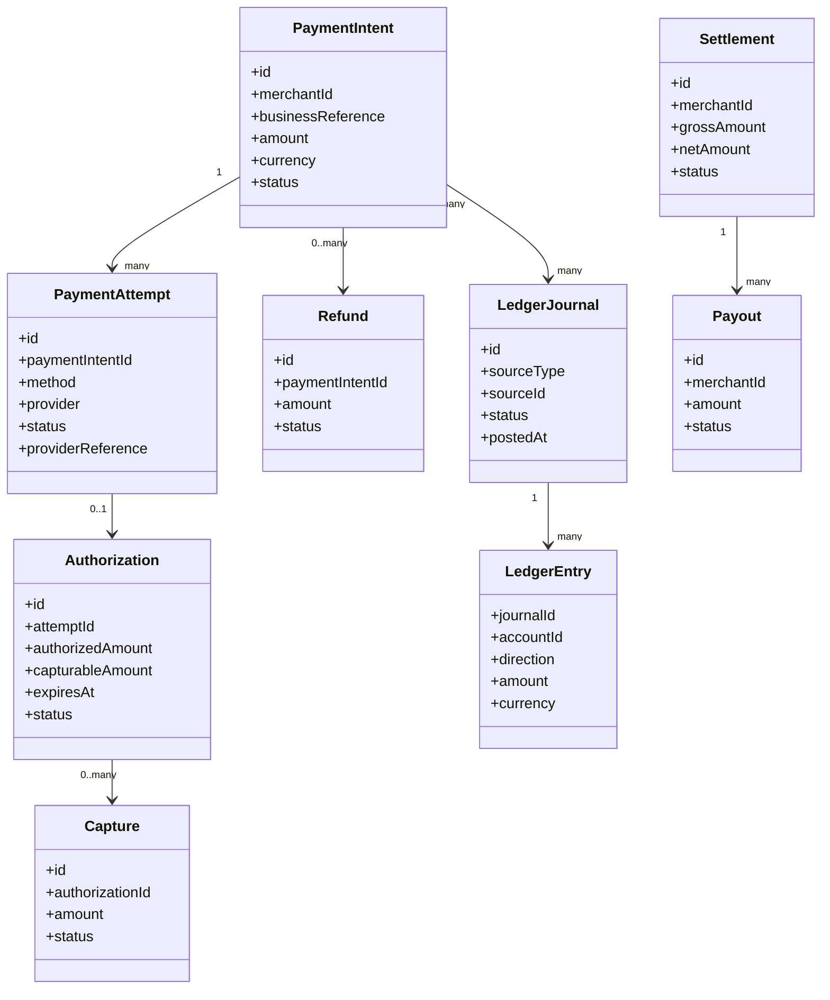
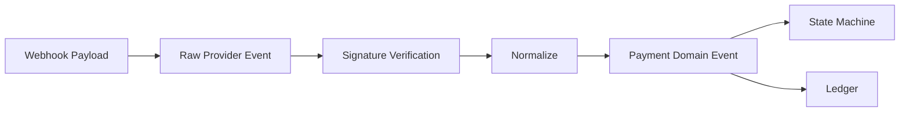
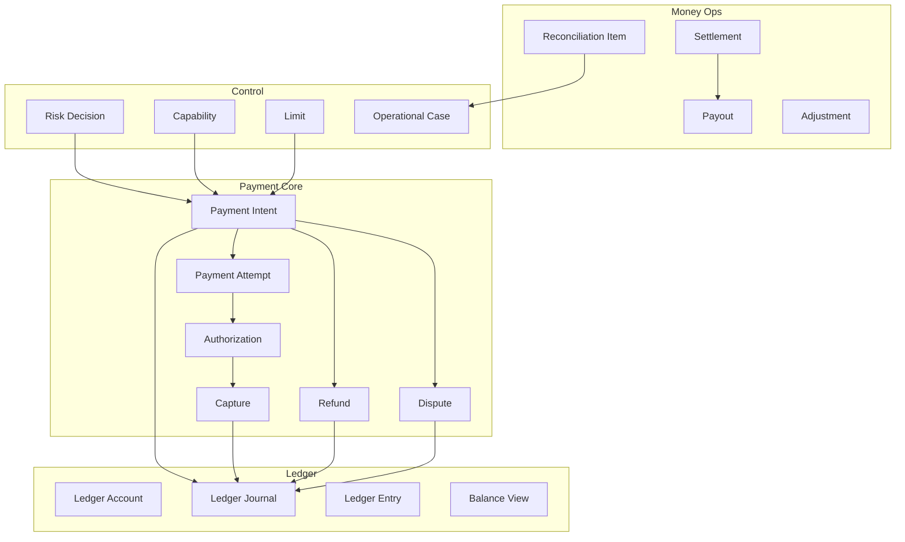
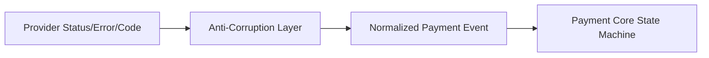
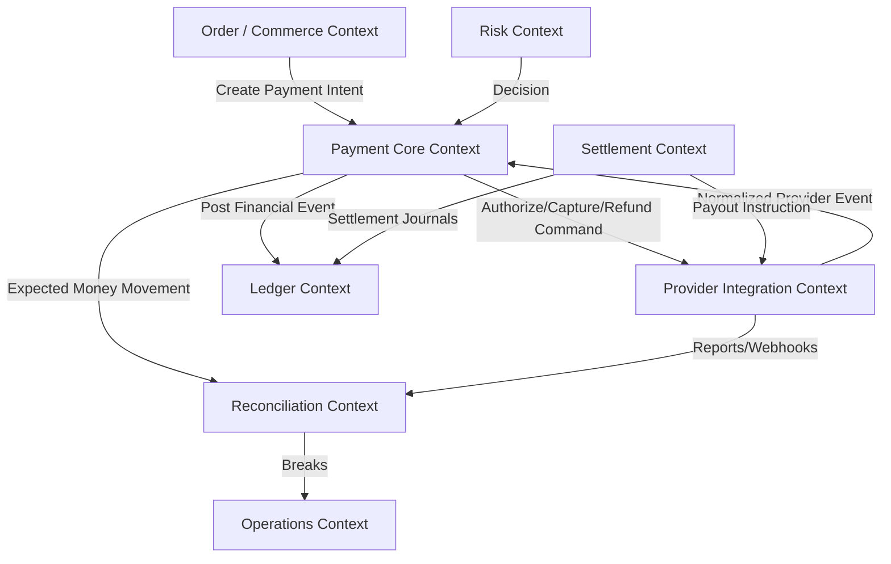

------
title: Build From Scratch: Large Production Grade Java Payment Systems - Part 006
description: Menyusun domain language dan ubiquitous model payment system enterprise: payment intent, attempt, charge, authorization, capture, refund, reversal, settlement, payout, ledger, balance, account, dispute, risk, dan reconciliation.
series: learn-java-payment-systems
seriesTitle: Build From Scratch: Large Production Grade Java Payment Systems
order: 6
partTitle: Domain Language and Ubiquitous Model
tags:
- java
- payments
- domain-driven-design
- payment-systems
- ledger
- ubiquitous-language
- enterprise-architecture
date: 2026-07-02
---

# Part 006 — Domain Language and Ubiquitous Model

Payment system sering gagal bukan karena engineer tidak bisa coding.

Ia gagal karena tim memakai kata yang sama untuk arti berbeda.

Contoh:

- “payment sudah sukses” maksudnya apa? Authorized? Captured? Settled? Order paid? Merchant payable bertambah?
- “refund sudah diproses” maksudnya apa? Request dibuat? Provider menerima? Uang kembali ke customer? Ledger sudah posting? Settlement sudah adjusted?
- “balance merchant” maksudnya apa? Pending? Available? Settled? Payoutable? Net of reserve? Net of dispute?
- “transaction” maksudnya apa? API request? payment attempt? provider transaction? ledger journal? bank transfer?

Di payment platform, bahasa yang kabur menghasilkan model yang kabur. Model yang kabur menghasilkan state machine yang salah. State machine yang salah menghasilkan uang yang sulit dijelaskan.

Part ini membangun vocabulary yang akan kita pakai sepanjang seri.

Targetnya bukan membuat kamus akademik. Targetnya membuat **bahasa kerja** yang presisi untuk desain API, schema, aggregate, event, state machine, ledger, reconciliation, dan backoffice.

---

## 1. Prinsip Ubiquitous Language untuk Payment

Dalam Domain-Driven Design, ubiquitous language adalah bahasa bersama antara engineer, product, risk, finance, operations, dan compliance.

Untuk payment system, bahasa ini harus memenuhi empat syarat:

1. **Financially precise** — jelas efeknya terhadap uang.
2. **Operationally useful** — bisa dipakai oleh support/ops untuk menangani kasus nyata.
3. **Technically enforceable** — bisa diterjemahkan menjadi schema, state transition, constraint, dan event.
4. **Auditable** — bisa dipakai menjelaskan kejadian kepada finance, auditor, regulator, atau partner.

Kalau istilah tidak bisa menjawab efek finansialnya, istilah itu belum cukup presisi.

---

## 2. Peta Model Besar

Kita mulai dari peta konseptual.



Diagram ini belum final schema. Ini adalah peta bahasa.

---

## 3. Business Obligation

### 3.1 Definisi

Business obligation adalah kewajiban bisnis yang menjadi alasan uang ditagih.

Contoh:

- order checkout,
- invoice,
- subscription cycle,
- top-up wallet,
- booking reservation,
- insurance premium,
- loan repayment,
- government fee,
- merchant service charge,
- penalty,
- donation.

Payment system tidak boleh kehilangan konteks “uang ini untuk apa”. Tanpa business obligation, payment menjadi transaksi liar.

### 3.2 Kenapa Penting

Business obligation adalah anchor untuk:

- no double charge,
- idempotency,
- order fulfillment,
- refund eligibility,
- dispute context,
- revenue recognition,
- customer support,
- reconciliation.

Contoh field:

```text
business_type = ORDER
business_id = ord_123
business_version = 4
merchant_id = mrc_456
amount = IDR 150000
```

Business service boleh menjadi owner dari obligation, tetapi payment platform harus menyimpan referensi yang cukup untuk menjaga payment semantics.

---

## 4. Payment Intent

### 4.1 Definisi

Payment Intent adalah intensi internal untuk mengumpulkan uang dari payer untuk business obligation tertentu.

Ia menjawab:

> “Kita ingin menagih siapa, berapa, dalam mata uang apa, untuk kewajiban apa, dengan aturan apa?”

Payment Intent bukan provider transaction. Payment Intent adalah konsep internal.

### 4.2 Isi Minimal

```text
payment_intent
  id
  merchant_id
  customer_id nullable
  business_type
  business_id
  amount_minor
  currency_code
  status
  capture_mode
  confirmation_method
  expires_at
  metadata
```

### 4.3 Status Contoh

```text
REQUIRES_PAYMENT_METHOD
REQUIRES_CONFIRMATION
PROCESSING
REQUIRES_ACTION
AUTHORIZED
SUCCEEDED
FAILED
CANCELED
PARTIALLY_REFUNDED
REFUNDED
DISPUTED
```

Tidak semua payment method memakai semua status. Tetapi intent membantu menyatukan lifecycle dari berbagai method.

### 4.4 Rule

Payment Intent sebaiknya tidak berarti “uang sudah pindah”. Ia berarti “niat dan lifecycle pembayaran”.

Efek uang ada di attempt/authorization/capture/ledger.

---

## 5. Payment Attempt

### 5.1 Definisi

Payment Attempt adalah satu usaha konkret untuk mengeksekusi Payment Intent menggunakan payment method dan provider tertentu.

Satu intent bisa punya banyak attempt karena:

- kartu pertama declined,
- customer mengganti method,
- provider timeout lalu resolved failed,
- routing fallback,
- virtual account expired lalu dibuat baru,
- payment retry untuk subscription.

### 5.2 Isi Minimal

```text
payment_attempt
  id
  payment_intent_id
  attempt_no
  payment_method_type
  provider_code
  provider_account_id
  provider_transaction_id nullable
  external_reference
  status
  amount_minor
  currency_code
  idempotency_key
  created_at
  last_provider_status
```

### 5.3 Status Contoh

```text
CREATED
SENT_TO_PROVIDER
REQUIRES_ACTION
AUTHORIZED
SUCCEEDED
DECLINED
FAILED
UNKNOWN_OUTCOME
EXPIRED
CANCELED
```

### 5.4 Rule

Attempt adalah tempat menyimpan external execution detail.

Payment Intent menjaga semantic obligation. Attempt menjaga provider execution.

---

## 6. Payment Method

### 6.1 Definisi

Payment Method adalah cara payer membayar.

Contoh:

- card,
- bank transfer,
- virtual account,
- QR,
- wallet,
- direct debit,
- buy-now-pay-later,
- cash over counter,
- instant payment,
- internal balance.

### 6.2 Payment Method Type vs Instrument

`payment_method_type` adalah kategori:

```text
CARD
VIRTUAL_ACCOUNT
QR
WALLET
BANK_TRANSFER
DIRECT_DEBIT
```

Payment instrument adalah instance spesifik:

```text
card token ending 4242
VA number 8808...
wallet account abc
bank account beneficiary xyz
```

Jangan campur type dan instrument.

### 6.3 Capability Differences

Setiap method punya kemampuan berbeda.

| Method | Auth/Capture | Refund | Expiry | Reversal | Settlement Timing |
|---|---|---|---|---|---|
| Card | often yes | yes | auth expiry | void/reversal | batch/scheme/acquirer |
| VA | no card-style auth | depends | yes | often limited | bank/provider report |
| QR | usually sale-like | depends | dynamic QR expiry | depends | acquirer/switch report |
| Wallet | provider-specific | yes/depends | depends | depends | wallet provider |
| Instant transfer | push payment | often separate return flow | no typical auth | limited | near real-time/rail rules |

Karena itu model payment tidak boleh mengasumsikan semua method seperti kartu.

---

## 7. Charge

### 7.1 Definisi

Charge adalah istilah yang sering ambigu. Dalam seri ini, `charge` berarti successful debit/customer collection effect yang membuat customer/payer dikenakan uang.

Namun dalam implementasi, kita akan lebih presisi menggunakan:

- authorization,
- capture,
- sale,
- transfer received,
- wallet debit,
- QR payment success.

### 7.2 Kenapa Tidak Menjadikan Charge Sebagai Semua Hal?

Karena card authorization bukan charge final.
Bank transfer masuk bukan card charge.
Wallet debit bisa langsung final tetapi settlement masih pending.
QR success berbeda dari capture.

Maka istilah `charge` boleh dipakai di API publik untuk kesederhanaan, tetapi internal domain harus lebih spesifik.

---

## 8. Authorization

### 8.1 Definisi

Authorization adalah persetujuan/hold dari issuer/provider bahwa sejumlah dana tersedia dan dapat ditangkap kemudian, tergantung aturan rail.

Authorization umum di card payment.

Ia bukan settlement.
Ia bukan payout.
Ia belum tentu revenue final.

### 8.2 Field Penting

```text
authorization
  id
  payment_attempt_id
  authorized_amount_minor
  currency_code
  capturable_amount_minor
  status
  expires_at
  approval_code
  retrieval_reference_number
  provider_authorization_id
```

### 8.3 Status

```text
AUTHORIZED
PARTIALLY_CAPTURED
CAPTURED
VOIDED
EXPIRED
REVERSED
```

### 8.4 Rule

Authorization memberi hak untuk capture dalam batas tertentu. Capture tidak boleh melebihi authorized amount/capability.

---

## 9. Capture

### 9.1 Definisi

Capture adalah instruksi untuk mengambil dana dari authorization yang sudah disetujui.

Dalam card payment, capture biasanya memulai proses clearing/settlement.

### 9.2 Field Penting

```text
capture
  id
  authorization_id
  amount_minor
  currency_code
  status
  provider_capture_id
  captured_at
  settlement_status
```

### 9.3 Status

```text
REQUESTED
PROCESSING
SUCCEEDED
FAILED
UNKNOWN_OUTCOME
REVERSED
```

### 9.4 Capture Mode

Payment Intent bisa punya capture mode:

```text
AUTOMATIC
MANUAL
```

Automatic: authorize dan capture terjadi segera atau sebagai sale.
Manual: authorization ditahan dulu, capture dipanggil belakangan.

### 9.5 Rule

Capture yang succeeded biasanya memicu ledger journal untuk receivable/payable, tetapi settlement external tetap bisa belum terjadi.

---

## 10. Sale

### 10.1 Definisi

Sale adalah payment execution yang authorization dan capture-nya dianggap terjadi dalam satu langkah dari sudut pandang merchant API.

Contoh:

```text
card sale = auth + capture immediate
wallet debit = immediate debit
QR payment success = customer paid via QR
```

### 10.2 Rule

Sale boleh muncul sebagai API abstraction, tetapi internal tetap perlu tahu rail semantics.

Jangan menganggap semua successful sale settled.

---

## 11. Void

### 11.1 Definisi

Void adalah pembatalan authorization/capture sebelum settlement atau sebelum financial finality tertentu, tergantung rail/provider.

Void sering dipakai untuk membatalkan card authorization.

### 11.2 Bedanya Dengan Refund

| Operation | Kapan | Efek |
|---|---|---|
| Void | sebelum capture/settlement final | membatalkan hold/instruction |
| Refund | setelah capture/payment success | mengembalikan dana ke customer |

Jangan menyamakan void dan refund.

### 11.3 Rule

Void tidak boleh dibuat jika authorization sudah fully captured, kecuali provider punya reversal semantics tertentu yang harus dimodelkan eksplisit.

---

## 12. Reversal

### 12.1 Definisi

Reversal adalah pembalikan transaksi/instruksi karena alasan teknis atau rail-specific, sering untuk membatalkan effect yang belum final atau memperbaiki unknown/partial outcome.

Reversal bisa berarti berbeda di rail berbeda.

Contoh:

- authorization reversal,
- capture reversal,
- transfer reversal,
- provider-initiated reversal,
- bank return.

### 12.2 Rule

Reversal harus dimodelkan sebagai event spesifik, bukan sekadar `status = canceled`.

Ia bisa punya ledger impact.

---

## 13. Refund

### 13.1 Definisi

Refund adalah pengembalian uang kepada payer/customer atas payment yang sudah berhasil ditagih/captured.

Refund bisa:

- full,
- partial,
- multiple partial,
- provider initiated,
- merchant initiated,
- system initiated,
- failed,
- unknown,
- pending settlement adjustment.

### 13.2 Field Penting

```text
refund
  id
  payment_intent_id
  capture_id nullable
  amount_minor
  currency_code
  reason_code
  status
  provider_refund_id
  idempotency_key
  requested_by
```

### 13.3 Status

```text
REQUESTED
PROCESSING
SUCCEEDED
FAILED
UNKNOWN_OUTCOME
CANCELED
```

### 13.4 Rule

Refund tidak boleh melebihi refundable amount.
Refund harus berdampak ke ledger dan settlement/payable.

---

## 14. Dispute

### 14.1 Definisi

Dispute adalah klaim dari customer/issuer/payer bahwa transaksi bermasalah.

Untuk card, dispute bisa berkembang menjadi chargeback.
Untuk rail lain, istilah dan mekanismenya berbeda.

### 14.2 Field Penting

```text
dispute
  id
  payment_intent_id
  provider_dispute_id
  amount_minor
  currency_code
  reason_code
  status
  evidence_due_at
  opened_at
  resolved_at
```

### 14.3 Status

```text
OPENED
EVIDENCE_REQUIRED
EVIDENCE_SUBMITTED
WON
LOST
ACCEPTED
EXPIRED
```

### 14.4 Rule

Dispute bukan refund.

Refund adalah merchant/system mengembalikan dana.
Dispute/chargeback adalah proses klaim melalui rail/scheme/provider yang bisa mengurangi settlement atau merchant payable.

---

## 15. Chargeback

### 15.1 Definisi

Chargeback adalah financial debit akibat dispute yang dimenangkan customer/issuer atau diterima merchant, biasanya pada card ecosystem.

### 15.2 Model

Chargeback harus punya ledger impact:

- mengurangi merchant payable,
- mencatat dispute loss,
- mencatat chargeback fee jika ada,
- mengubah settlement adjustment,
- mungkin mempengaruhi reserve/risk score.

### 15.3 Rule

Jangan hanya mengubah payment status menjadi `CHARGEBACK`. Buat entity dispute/chargeback dan journal.

---

## 16. Settlement

### 16.1 Definisi

Settlement adalah proses finalisasi/netting funds dari provider/acquirer/bank/scheme ke platform atau dari platform ke merchant, tergantung konteks.

Istilah settlement punya dua level:

1. **External settlement** — provider/acquirer/bank menyelesaikan dana ke platform/merchant.
2. **Merchant settlement** — platform menghitung net amount yang menjadi hak merchant.

Jangan campur dua level ini.

### 16.2 External Settlement

Contoh:

```text
Provider settlement report:
  captured payment gross
  refund
  dispute
  provider fee
  net settlement to platform bank account
```

### 16.3 Merchant Settlement

Contoh:

```text
Merchant settlement:
  gross sales
  - platform fee
  - provider fee pass-through
  - refunds
  - chargebacks
  - reserve hold
  + reserve release
  = net payoutable
```

### 16.4 Rule

Settlement bukan sekadar status `settled = true`. Settlement harus punya calculation trace.

---

## 17. Payout

### 17.1 Definisi

Payout adalah instruksi mengirim dana dari platform ke merchant/beneficiary.

Payout berbeda dari settlement.

Settlement menghitung hak/posisi.
Payout menggerakkan dana keluar.

### 17.2 Field Penting

```text
payout
  id
  merchant_id
  settlement_id nullable
  beneficiary_id
  amount_minor
  currency_code
  status
  provider_payout_id
  scheduled_at
  executed_at
```

### 17.3 Status

```text
CREATED
APPROVAL_REQUIRED
APPROVED
SENT
PROCESSING
SUCCEEDED
FAILED
RETURNED
CANCELED
UNKNOWN_OUTCOME
```

### 17.4 Rule

Payout tidak boleh melebihi payoutable balance.
Payout failure/return harus membalik posisi ledger dengan benar.

---

## 18. Transfer

### 18.1 Definisi

Transfer adalah movement uang antar account/institution/beneficiary.

Dalam platform, transfer bisa berarti:

- customer bank transfer masuk,
- platform payout keluar,
- internal wallet transfer,
- merchant split transfer,
- reserve transfer,
- treasury movement.

### 18.2 Rule

Jangan memakai satu entity `transfer` untuk semua tanpa subtype/context. Jika dipakai, ia harus punya direction dan purpose.

```text
transfer_direction = INBOUND | OUTBOUND | INTERNAL
transfer_purpose = COLLECTION | PAYOUT | RESERVE_MOVE | FEE_SWEEP | REFUND
```

---

## 19. Ledger Account

### 19.1 Definisi

Ledger Account adalah bucket akuntansi internal tempat debit/credit diposting.

Contoh account:

- Customer Cash/Receivable,
- PSP Receivable,
- Bank Cash,
- Merchant Payable,
- Platform Fee Revenue,
- Provider Fee Expense,
- Refund Liability,
- Dispute Loss,
- Reserve Liability,
- Suspense.

### 19.2 Account Type

```text
ASSET
LIABILITY
REVENUE
EXPENSE
EQUITY
```

Untuk payment platform, banyak saldo merchant adalah liability: platform berutang kepada merchant.

### 19.3 Rule

Balance merchant bukan angka yang berdiri sendiri. Ia adalah hasil dari ledger entries pada account terkait.

---

## 20. Ledger Journal

### 20.1 Definisi

Ledger Journal adalah satu transaksi akuntansi internal yang terdiri dari beberapa ledger entries dan harus balanced.

Contoh source:

- payment captured,
- refund succeeded,
- provider settlement confirmed,
- merchant payout sent,
- chargeback lost,
- reserve hold,
- manual adjustment.

### 20.2 Field Penting

```text
ledger_journal
  id
  journal_type
  source_type
  source_id
  status
  accounting_date
  posted_at
  description
```

### 20.3 Rule

Journal yang sudah posted tidak diubah. Jika salah, buat reversal/correction journal.

---

## 21. Ledger Entry

### 21.1 Definisi

Ledger Entry adalah satu baris debit atau credit dalam journal.

```text
ledger_entry
  id
  journal_id
  account_id
  direction
  amount_minor
  currency_code
```

### 21.2 Rule

Setiap journal harus balanced per currency/book.

```text
sum(debit) == sum(credit)
```

Ledger Entry tidak punya makna penuh tanpa Journal.

---

## 22. Balance

### 22.1 Definisi

Balance adalah hasil agregasi ledger entries, biasanya per account, merchant, currency, dan balance type.

Balance harus dianggap derived view dari ledger.

### 22.2 Balance Types

| Balance | Makna |
|---|---|
| pending | uang/posisi belum final atau belum settlement |
| available | bisa dipakai untuk operasi tertentu |
| payoutable | bisa dibayarkan ke merchant |
| reserved | ditahan karena risk/dispute/policy |
| settled | sudah melewati settlement confirmation |
| current | total accounting position |

### 22.3 Rule

Jangan bertanya “berapa balance merchant?” tanpa menyebut balance type.

Pertanyaan yang benar:

```text
Berapa payoutable balance merchant untuk currency IDR per accounting date 2026-07-02?
```

---

## 23. Hold and Reserve

### 23.1 Hold

Hold adalah penahanan sementara terhadap kemampuan menggunakan saldo.

Contoh:

- risk hold,
- refund reserve,
- dispute hold,
- payout pending hold,
- rolling reserve.

### 23.2 Reserve

Reserve adalah saldo yang ditahan berdasarkan policy untuk melindungi platform dari future loss.

Contoh rolling reserve:

```text
Hold 10% of merchant gross sales for 90 days.
```

### 23.3 Rule

Hold/reserve harus punya:

- amount,
- currency,
- reason,
- policy version,
- effective date,
- release condition,
- audit trail.

Hold yang tidak bisa dijelaskan adalah operational debt.

---

## 24. Fee

### 24.1 Definisi

Fee adalah biaya atau revenue terkait payment.

Jenis fee:

- platform fee,
- provider fee,
- scheme fee,
- acquirer fee,
- refund fee,
- chargeback fee,
- payout fee,
- FX markup,
- tax/withholding.

### 24.2 Rule

Fee harus punya owner dan ledger account.

Pertanyaan penting:

- fee ditagih ke merchant atau diserap platform?
- fee refundable atau tidak?
- fee dihitung dari gross atau net?
- fee dibukukan saat capture, settlement, atau invoice?
- fee berbeda per method/provider/merchant tier?

Jangan menaruh fee sebagai `amount - net_amount` tanpa breakdown.

---

## 25. Reconciliation Item

### 25.1 Definisi

Reconciliation Item adalah representasi internal dari baris external report atau internal expected movement yang perlu dicocokkan.

Contoh source:

- provider settlement line,
- bank statement line,
- scheme report line,
- internal ledger expected item,
- payout status report.

### 25.2 Field Penting

```text
reconciliation_item
  id
  source_type
  source_file_id
  external_reference
  amount_minor
  currency_code
  business_date
  item_type
  matching_status
```

### 25.3 Match Result

```text
MATCHED
UNMATCHED_EXTERNAL
UNMATCHED_INTERNAL
AMOUNT_MISMATCH
FEE_MISMATCH
DUPLICATE
TIMING_DIFFERENCE
MANUAL_MATCHED
```

### 25.4 Rule

Recon item bukan laporan pasif. Ia adalah object kerja untuk menemukan financial drift.

---

## 26. Provider Event

### 26.1 Definisi

Provider Event adalah event dari external provider, biasanya webhook atau report update.

Provider Event punya dua bentuk:

1. Raw event — payload asli.
2. Normalized event — event yang dipetakan ke bahasa internal.

### 26.2 Rule

Raw event immutable.
Normalized event boleh direprocess.



---

## 27. Payment Event vs Domain Event vs Integration Event

### 27.1 Payment Event

Event yang terjadi dalam lifecycle payment.

Contoh:

```text
PaymentIntentCreated
PaymentAttemptStarted
AuthorizationApproved
CaptureSucceeded
RefundSucceeded
DisputeOpened
```

### 27.2 Domain Event

Event bisnis internal yang sudah melewati validasi domain.

Contoh:

```text
PaymentSucceeded
MerchantBalanceUpdated
PayoutApproved
```

### 27.3 Integration Event

Event yang dikirim ke service lain.

Contoh:

```text
OrderPaymentSucceeded
InvoicePaymentFailed
MerchantPayoutCompleted
```

### 27.4 Rule

Jangan langsung broadcast raw provider webhook sebagai integration event bisnis.

Provider event harus dinormalisasi, divalidasi, dan diterjemahkan ke domain event.

---

## 28. Payer, Customer, Merchant, Beneficiary

### 28.1 Payer

Payer adalah pihak yang membayar.

### 28.2 Customer

Customer adalah entitas customer dalam sistem bisnis. Tidak semua payer punya customer account.

### 28.3 Merchant

Merchant adalah pihak yang menjual barang/jasa atau pihak yang menerima hasil collection.

### 28.4 Beneficiary

Beneficiary adalah penerima payout/transfer.

Satu merchant bisa punya banyak beneficiary.

### 28.5 Rule

Jangan menganggap customer selalu payer atau merchant selalu beneficiary tunggal.

Marketplace, platform, split payment, dan disbursement membuat relasi ini kompleks.

---

## 29. Mandate

### 29.1 Definisi

Mandate adalah persetujuan payer untuk pembayaran berulang atau merchant-initiated transaction.

Contoh:

- direct debit mandate,
- card-on-file consent,
- subscription recurring authorization,
- account linking consent.

### 29.2 Field Penting

```text
mandate
  id
  customer_id
  payment_method_id
  merchant_id
  status
  consent_reference
  valid_from
  valid_until
  usage_type
```

### 29.3 Rule

Recurring payment tidak boleh hanya “menyimpan token”. Harus ada consent/mandate semantics.

---

## 30. Capability

### 30.1 Definisi

Capability adalah izin operasional bahwa merchant/customer/method/provider boleh melakukan operasi tertentu.

Contoh capability:

```text
ACCEPT_CARD
ACCEPT_QR
CREATE_REFUND
USE_MANUAL_CAPTURE
CREATE_PAYOUT
INSTANT_PAYOUT
HIGH_VALUE_PAYMENT
RECURRING_PAYMENT
```

### 30.2 Rule

Capability harus explicit dan auditable. Jangan hardcode berdasarkan merchant id.

---

## 31. Limit

### 31.1 Definisi

Limit adalah batas kuantitatif terhadap operasi.

Contoh:

- max amount per transaction,
- daily volume,
- monthly volume,
- velocity count,
- payout limit,
- refund limit,
- risk-tier limit.

### 31.2 Rule

Limit harus punya window, scope, currency, dan enforcement point.

```text
limit_scope = MERCHANT
operation = PAYOUT
window = DAILY
amount = IDR 500000000
```

---

## 32. Risk Decision

### 32.1 Definisi

Risk Decision adalah hasil evaluasi risiko atas payment/merchant/customer/payout.

Possible decision:

```text
APPROVE
DECLINE
REVIEW
HOLD
STEP_UP_AUTHENTICATION
LIMIT
```

### 32.2 Rule

Risk decision yang mengubah money flow harus persist.

Minimal:

```text
risk_decision
  id
  subject_type
  subject_id
  decision
  reason_codes
  score
  rule_version
  model_version
  decided_at
```

---

## 33. Compliance Screening

### 33.1 Definisi

Compliance Screening adalah evaluasi terhadap pihak/transaksi berdasarkan aturan compliance, misalnya sanctions, AML, KYB/KYC policy, atau regulatory reporting.

### 33.2 Rule

Jangan campur risk fraud dan compliance. Fraud bertanya “apakah ini mencurigakan/merugikan?”. Compliance bertanya “apakah ini boleh secara aturan?”. Kadang overlap, tetapi lifecycle dan evidence berbeda.

---

## 34. Case

### 34.1 Definisi

Case adalah unit kerja operational untuk exception atau investigation.

Contoh:

- unknown payment resolution,
- unmatched reconciliation item,
- suspicious transaction review,
- refund approval,
- dispute evidence preparation,
- payout return investigation.

### 34.2 Rule

Backoffice case harus link ke domain object dan audit action.

```text
case
  id
  case_type
  subject_type
  subject_id
  status
  priority
  assignee
  opened_at
  due_at
```

Case management bukan fitur sampingan. Ia bagian dari sistem pembayaran enterprise.

---

## 35. Adjustment

### 35.1 Definisi

Adjustment adalah perubahan financial position yang dibuat bukan dari payment flow normal, tetapi dari koreksi, kebijakan, atau keputusan manual/system.

Contoh:

- goodwill credit,
- fee correction,
- settlement correction,
- migration adjustment,
- reserve correction,
- write-off.

### 35.2 Rule

Adjustment harus:

- punya reason code,
- punya approval jika material,
- membuat ledger journal,
- muncul di audit trail,
- muncul di settlement/reporting.

Adjustment tanpa journal adalah red flag.

---

## 36. Transaction: Kata yang Sebaiknya Dihindari Sendirian

`Transaction` adalah kata paling berbahaya dalam payment system karena bisa berarti terlalu banyak hal:

- database transaction,
- provider transaction,
- card transaction,
- ledger transaction/journal,
- business transaction/order,
- bank transaction,
- customer transaction shown in UI.

Rule:

> Jangan gunakan kata `transaction` tanpa qualifier.

Gunakan:

- `payment_attempt`,
- `provider_transaction`,
- `ledger_journal`,
- `bank_statement_line`,
- `business_order`,
- `customer_activity`.

Bahasa yang jelas mengurangi bug.

---

## 37. Status Naming Rules

Status harus menjelaskan state, bukan aksi.

Buruk:

```text
PAYMENT_DONE
REFUND_PROCESS
USER_PAID
```

Lebih baik:

```text
SUCCEEDED
PROCESSING
REQUIRES_ACTION
AUTHORIZED
FAILED
UNKNOWN_OUTCOME
```

Rule:

1. Gunakan past participle untuk terminal evidence: `SUCCEEDED`, `FAILED`, `CANCELED`.
2. Gunakan present state untuk ongoing: `PROCESSING`, `PENDING_REVIEW`.
3. Gunakan explicit unknown: `UNKNOWN_OUTCOME`.
4. Pisahkan status operation dari status aggregate.
5. Jangan memakai satu status untuk semua lifecycle.

---

## 38. Canonical Entity Boundary

Berikut boundary awal yang akan kita pakai:



Ini bukan berarti semua entity harus berada dalam satu service. Ini adalah bahasa lintas service.

---

## 39. API Vocabulary

API publik perlu sederhana, tetapi tidak boleh berbohong.

Contoh endpoint vocabulary:

```text
POST /payment-intents
POST /payment-intents/{id}/confirm
POST /payment-intents/{id}/capture
POST /payment-intents/{id}/cancel
POST /payment-intents/{id}/refunds
GET  /payment-intents/{id}
GET  /payment-attempts/{id}
GET  /refunds/{id}
POST /payouts
GET  /settlements/{id}
```

Hindari endpoint generik:

```text
POST /transaction
POST /pay-now
POST /callback/update-status
```

Endpoint generik biasanya menyembunyikan domain yang salah.

---

## 40. Event Vocabulary

Event harus bernama dari fakta yang sudah terjadi, bukan command.

Command:

```text
ConfirmPaymentIntent
CaptureAuthorization
CreateRefund
ApprovePayout
```

Event:

```text
PaymentIntentConfirmed
AuthorizationApproved
CaptureSucceeded
RefundRequested
RefundSucceeded
PayoutApproved
PayoutSent
PayoutSucceeded
```

Provider event normalized:

```text
ProviderAuthorizationApproved
ProviderCaptureSucceeded
ProviderRefundFailed
ProviderSettlementReported
```

Jangan beri nama event `ProcessPayment`. Itu command/procedure, bukan fakta.

---

## 41. Database Naming Conventions

Gunakan nama yang merepresentasikan domain.

```text
payment_intent
payment_attempt
authorization
capture
refund
dispute
ledger_account
ledger_journal
ledger_entry
settlement
settlement_line
payout
reconciliation_item
provider_event_raw
provider_event_normalized
risk_decision
merchant_capability
limit_profile
operational_case
```

Hindari:

```text
transaction
payment_log
callback_data
history
status_update
temp_payment
```

Nama tabel mempengaruhi cara tim berpikir.

---

## 42. Java Package Boundary

Contoh package awal:

```text
com.example.payment
  intent
  attempt
  authorization
  capture
  refund
  dispute
  provider
  webhook
  ledger
  settlement
  payout
  reconciliation
  risk
  limit
  capability
  backoffice
  audit
  money
```

Untuk project besar, boundary bisa menjadi service/module berbeda. Namun package naming tetap harus mencerminkan domain language.

---

## 43. Value Object: Money

Jangan sebarkan `BigDecimal` bebas.

Contoh value object:

```java
public record Money(long minorAmount, String currency) {
    public Money {
        if (currency == null || currency.length() != 3) {
            throw new IllegalArgumentException("currency must be ISO-like 3-letter code");
        }
    }

    public Money plus(Money other) {
        requireSameCurrency(other);
        return new Money(this.minorAmount + other.minorAmount, this.currency);
    }

    public Money minus(Money other) {
        requireSameCurrency(other);
        return new Money(this.minorAmount - other.minorAmount, this.currency);
    }

    private void requireSameCurrency(Money other) {
        if (!this.currency.equals(other.currency)) {
            throw new IllegalArgumentException("currency mismatch");
        }
    }
}
```

Ini bukan final implementation. Nanti kita akan bahas currency exponent, formatting, rounding, FX, dan database mapping.

---

## 44. Value Object: External Reference

External reference harus qualified.

Buruk:

```text
external_id = 12345
```

Lebih baik:

```text
provider_code = ADYEN
reference_type = PSP_REFERENCE
reference_value = ABC123
```

Atau object:

```java
public record ProviderReference(
    String providerCode,
    String referenceType,
    String referenceValue
) {}
```

Karena `12345` dari provider A dan `12345` dari provider B bukan referensi yang sama.

---

## 45. Value Object: Business Reference

```java
public record BusinessReference(
    String businessType,
    String businessId,
    Integer businessVersion
) {}
```

Gunanya:

- idempotency per obligation,
- trace ke order/invoice,
- prevent duplicate active intent,
- audit.

---

## 46. Anti-Corruption Language

Provider punya bahasa sendiri. Payment core punya bahasa sendiri.

Adapter harus menerjemahkan.



Contoh:

| Provider A | Provider B | Internal |
|---|---|---|
| `00 APPROVED` | `SUCCESS_AUTH` | `AUTHORIZATION_APPROVED` |
| `05 DO_NOT_HONOR` | `DECLINED` | `AUTHORIZATION_DECLINED` |
| HTTP timeout | no response | `UNKNOWN_OUTCOME` |
| `CAPTURED` | `SETTLED_PENDING` | depends on semantic mapping |

Adapter tidak boleh membiarkan provider vocabulary bocor ke core.

---

## 47. Context Map



Relasi penting:

- Order tidak boleh langsung bicara ke provider.
- Provider adapter tidak boleh langsung mengubah order.
- Ledger tidak boleh bergantung pada UI status.
- Reconciliation tidak boleh menjadi laporan pasif.
- Backoffice command harus masuk lewat domain service, bukan SQL manual.

---

## 48. Glossary Ringkas

| Term | Definisi Pendek |
|---|---|
| Business Obligation | alasan bisnis uang ditagih |
| Payment Intent | intensi internal untuk menagih kewajiban tertentu |
| Payment Attempt | usaha konkret mengeksekusi intent via method/provider |
| Payment Method | tipe/instrument pembayaran |
| Authorization | approval/hold sebelum capture |
| Capture | pengambilan dana atas authorization |
| Sale | auth+capture/immediate debit abstraction |
| Void | pembatalan sebelum finality tertentu |
| Reversal | pembalikan rail-specific |
| Refund | pengembalian dana setelah payment success/capture |
| Dispute | klaim customer/issuer terhadap transaksi |
| Chargeback | debit financial akibat dispute lost/accepted |
| Settlement | proses netting/finalisasi dana |
| Payout | pengiriman dana ke merchant/beneficiary |
| Ledger Account | bucket akuntansi internal |
| Ledger Journal | transaksi akuntansi balanced |
| Ledger Entry | baris debit/credit |
| Balance | agregasi ledger entries |
| Hold | penahanan sementara saldo/capability |
| Reserve | saldo ditahan berdasarkan policy |
| Fee | biaya/revenue terkait payment |
| Reconciliation Item | item yang harus dicocokkan dengan evidence lain |
| Provider Event | event external raw/normalized |
| Risk Decision | hasil evaluasi risiko |
| Capability | izin operasi/method |
| Limit | batas kuantitatif operasi |
| Case | unit kerja exception/ops |
| Adjustment | koreksi/penyesuaian financial |

---

## 49. Naming Decision Records

Untuk setiap istilah penting, buat keputusan eksplisit.

Contoh:

```mdx
## Decision: Payment Intent vs Payment

We use `PaymentIntent` to represent the business intention to collect funds.
We avoid using `Payment` as a catch-all aggregate because it hides differences between intent, attempt, authorization, capture, refund, and settlement.

Consequences:
- API create operation creates a PaymentIntent.
- Provider execution is stored as PaymentAttempt.
- Financial effect is represented in LedgerJournal.
- Public API may expose simplified `payment` terminology only through response DTOs.
```

Architecture decision seperti ini mencegah tim kembali memakai istilah ambigu.

---

## 50. Mini Exercise

Ubah kalimat ambigu berikut menjadi bahasa domain yang presisi.

### Kalimat 1

> Payment sudah sukses.

Pertanyaan:

- intent succeeded?
- attempt succeeded?
- authorization approved?
- capture succeeded?
- provider settlement confirmed?
- merchant payable posted?
- payout completed?

Versi presisi:

```text
PaymentIntent pi_123 reached SUCCEEDED because Capture cap_456 succeeded for IDR 150000, and ledger journal lj_789 posted merchant payable and platform fee. External settlement is still pending.
```

### Kalimat 2

> Refund sudah diproses.

Versi presisi:

```text
Refund rf_123 was requested and sent to provider. Provider outcome is UNKNOWN_OUTCOME. Refund liability is reserved, but successful refund journal has not been posted yet.
```

### Kalimat 3

> Saldo merchant kurang.

Versi presisi:

```text
Merchant m_123 payoutable balance for IDR on accounting date 2026-07-02 is lower than expected because IDR 5,000,000 is reserved by dispute hold dh_456 and IDR 2,000,000 is pending settlement.
```

---

## 51. Ringkasan

Domain language adalah alat keselamatan.

Dalam payment system enterprise:

1. Jangan memakai `transaction` tanpa qualifier.
2. Pisahkan business obligation, payment intent, dan attempt.
3. Pisahkan authorization, capture, sale, void, reversal, refund.
4. Pisahkan settlement dan payout.
5. Pisahkan status operasional dan ledger financial truth.
6. Balance harus punya type: pending, available, payoutable, reserved, settled.
7. Provider event harus disimpan raw dan dinormalisasi.
8. Risk, capability, limit, compliance, case, dan adjustment adalah domain object, bukan catatan sampingan.
9. Bahasa yang jelas harus terlihat di API, database, event, package, dan backoffice.

Part berikutnya akan masuk ke **money correctness**: currency, minor unit, rounding, FX, fee calculation, tax, precision, dan bagaimana Java harus memodelkan uang tanpa bug kecil yang menjadi kerugian besar.

---

## 52. Referensi

- EMVCo — EMV 3-D Secure and EMV payment technology materials for card-not-present authentication semantics.
- Swift — ISO 20022 payment instruction terminology and structured financial messaging.
- Bank Indonesia — QRIS, BI-FAST, SNAP, and Indonesian payment system infrastructure materials.
- PCI Security Standards Council — PCI DSS v4.0.1 for cardholder data security boundary considerations.
- Domain-Driven Design practice: ubiquitous language, bounded context, and anti-corruption layer patterns applied to financial/payment systems.
- General accounting practice: double-entry ledger terminology, journal, entry, account, debit, credit, balance, and adjustment.
