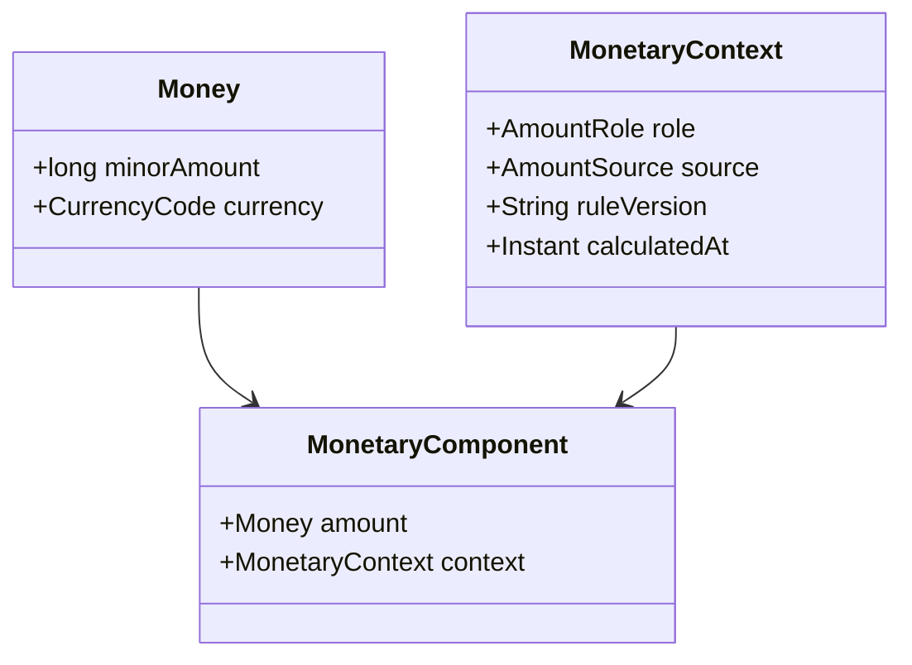
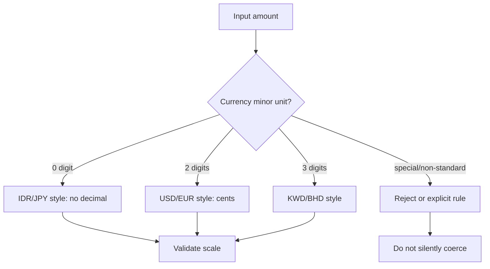
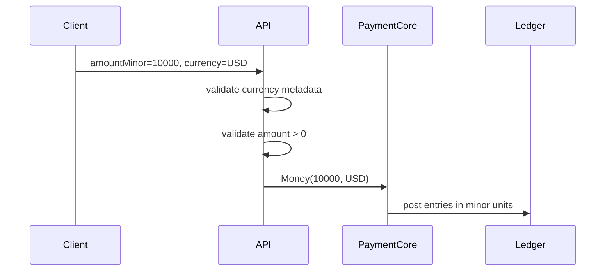
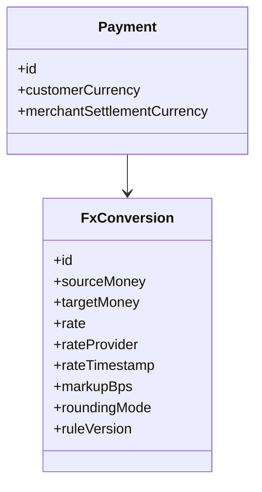
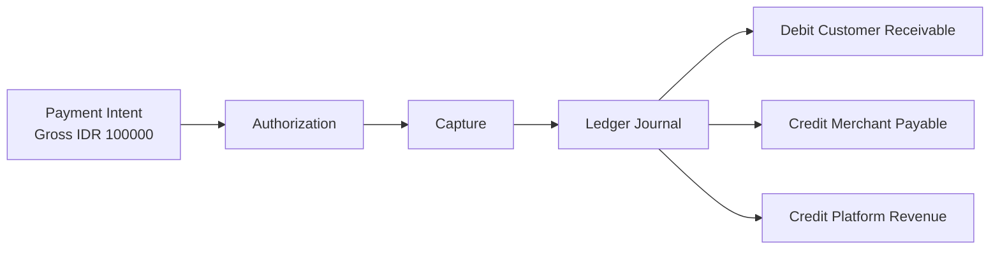
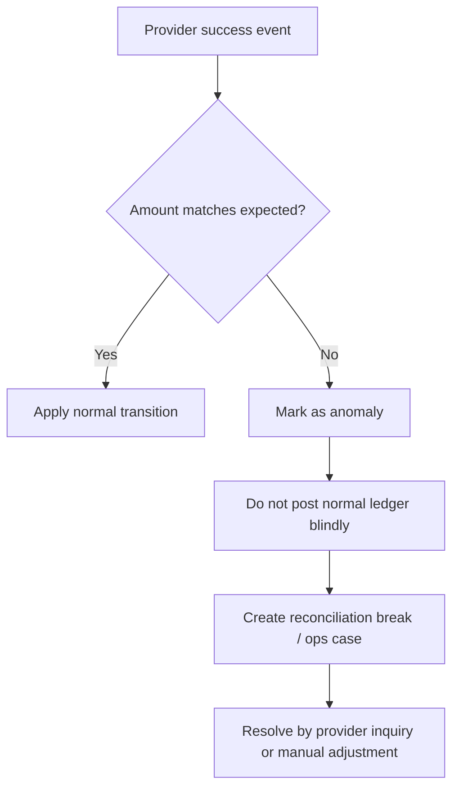

------
title: Build From Scratch: Large Production Grade Java Payment Systems - Part 007
description: Membahas money correctness untuk payment system enterprise: currency, minor unit, rounding, fee, tax, FX, immutable amount, PostgreSQL schema, Java value object, dan invariant finansial.
series: learn-java-payment-systems
seriesTitle: Build From Scratch: Large Production Grade Java Payment Systems
order: 7
partTitle: Money Correctness
tags:
- java
- payments
- money
- currency
- ledger
- payment-systems
- financial-correctness
date: 2026-07-02
---

# Part 007 — Money Correctness

Payment system bukan sistem angka biasa.

Di aplikasi biasa, angka salah beberapa digit mungkin hanya membuat dashboard jelek. Di payment system, angka salah berarti:

- customer ditagih terlalu besar,
- merchant menerima settlement terlalu kecil,
- platform kehilangan revenue,
- reconciliation tidak pernah balance,
- audit tidak bisa menjelaskan asal-usul uang,
- atau sistem terlihat “jalan” tetapi diam-diam menciptakan/menelan uang.

Materi ini membahas **money correctness**: cara memodelkan uang sehingga aman untuk payment platform enterprise.

Kita tidak akan mengulang teori `BigDecimal` dasar atau SQL numeric dasar. Fokus kita adalah bagaimana uang harus dimodelkan dalam sistem pembayaran yang punya payment intent, authorization, capture, refund, fee, tax, FX, ledger, settlement, dan reconciliation.

Kalimat paling penting di part ini:

> Uang bukan `number`. Uang adalah kombinasi amount, currency, scale, source, rule, dan invariant.

---

## 1. Masalah Utama: Engineer Sering Menganggap Amount Itu Satu Angka

Contoh sederhana:

```json
{
  "amount": 100000,
  "currency": "IDR"
}
```

Kelihatannya jelas.

Tapi dalam payment system, pertanyaan sebenarnya adalah:

1. `100000` ini minor unit atau major unit?
2. Kalau IDR tidak punya decimal minor unit, apakah `100000` berarti Rp100.000?
3. Kalau currency berubah menjadi USD, apakah `100000` berarti USD 1000.00?
4. Amount ini gross atau net?
5. Sudah termasuk tax?
6. Sudah termasuk fee?
7. Ini amount yang diminta merchant, amount authorized provider, amount captured, amount settled, atau amount payout?
8. Kalau ada partial capture, sisa capturable dihitung dari mana?
9. Kalau ada refund, refundable amount dihitung dari gross captured atau net settled?
10. Kalau ada FX, rate mana yang dipakai dan kapan dikunci?

Payment correctness dimulai dari menghilangkan ambiguity ini.

---

## 2. Mental Model: Amount Selalu Punya Dimensi

Uang dalam payment platform minimal memiliki dimensi berikut:

| Dimensi | Contoh | Kenapa penting |
|---|---|---|
| Currency | `IDR`, `USD`, `JPY` | Minor unit dan settlement rail berbeda |
| Unit | major/minor | Mencegah salah interpretasi Rp100.000 vs Rp1.000 |
| Scale | 0, 2, 3 | Setiap currency punya exponent berbeda |
| Sign | debit/credit atau positive/negative | Ledger harus jelas arah arus uang |
| Role | gross, fee, tax, net, reserve | Uang yang sama punya arti berbeda |
| Source | merchant request, provider response, ledger posting | Membantu audit dan reconciliation |
| Time | request time, authorization time, settlement time | FX dan fee rule bisa berubah |
| Rule version | pricing rule, tax rule, FX rule | Reproducibility untuk dispute/audit |

Jadi model `Money` tidak boleh berdiri sendirian sebagai angka mentah.



`Money` adalah primitive domain. `MonetaryComponent` adalah angka yang sudah diberi makna bisnis.

---

## 3. Jangan Gunakan Floating Point untuk Uang

Ini sudah sering dibahas, jadi kita tidak perlu panjang.

Yang penting:

```java
// Salah untuk uang
var amount = 0.1 + 0.2;
```

Floating point cocok untuk approximate computation, bukan monetary accounting.

Dalam payment system, pilihannya biasanya:

1. **integer minor unit** untuk amount operasional,
2. **BigDecimal** untuk kalkulasi rule, rate, fee, tax, dan FX,
3. **NUMERIC/DECIMAL** untuk penyimpanan tertentu yang memang membutuhkan decimal scale eksplisit,
4. **ledger entries dengan amount integer minor unit** jika semua posting wajib berada dalam currency minor unit final.

Prinsip yang aman:

> Simpan amount final dalam minor unit integer. Gunakan BigDecimal hanya untuk kalkulasi sebelum finalisasi, lalu quantize/round secara eksplisit.

---

## 4. Minor Unit: Uang Harus Disimpan Dalam Unit Terkecil Currency

Banyak payment API memakai integer minor unit.

Contoh:

| Currency | Major display | Minor unit integer |
|---|---:|---:|
| IDR | Rp100.000 | `100000` |
| USD | $100.00 | `10000` |
| JPY | ¥100 | `100` |
| KWD | KD 100.000 | `100000` |

Masalahnya, tidak semua currency punya 2 decimal digit.



Aturan penting:

1. API publik harus jelas menerima **minor amount** atau **decimal amount**. Jangan campur.
2. Internal payment core sebaiknya memakai **minor amount integer**.
3. Format display boleh decimal/locale-specific, tapi itu layer presentation.
4. Currency metadata harus versioned atau minimal auditable karena minor unit bisa berubah dalam sejarah currency.

---

## 5. Java Value Object untuk Money

Kita mulai dari value object kecil.

```java
package com.example.payment.money;

import java.util.Currency;
import java.util.Objects;

public final class Money implements Comparable<Money> {
    private final long minorAmount;
    private final String currency;

    private Money(long minorAmount, String currency) {
        this.currency = Objects.requireNonNull(currency, "currency");
        this.minorAmount = minorAmount;
        Currency.getInstance(currency); // validate ISO-like known currency in JVM
    }

    public static Money ofMinor(long minorAmount, String currency) {
        return new Money(minorAmount, currency);
    }

    public long minorAmount() {
        return minorAmount;
    }

    public String currency() {
        return currency;
    }

    public Money plus(Money other) {
        requireSameCurrency(other);
        return new Money(Math.addExact(this.minorAmount, other.minorAmount), currency);
    }

    public Money minus(Money other) {
        requireSameCurrency(other);
        return new Money(Math.subtractExact(this.minorAmount, other.minorAmount), currency);
    }

    public Money negate() {
        return new Money(Math.negateExact(minorAmount), currency);
    }

    public boolean isNegative() {
        return minorAmount < 0;
    }

    public boolean isZero() {
        return minorAmount == 0;
    }

    public boolean isPositive() {
        return minorAmount > 0;
    }

    private void requireSameCurrency(Money other) {
        Objects.requireNonNull(other, "other");
        if (!this.currency.equals(other.currency)) {
            throw new CurrencyMismatchException(this.currency, other.currency);
        }
    }

    @Override
    public int compareTo(Money other) {
        requireSameCurrency(other);
        return Long.compare(this.minorAmount, other.minorAmount);
    }
}
```

Perhatikan beberapa hal:

- `Money` immutable.
- Operasi beda currency dilarang.
- Arithmetic memakai `Math.addExact` / `Math.subtractExact` agar overflow tidak silent.
- `currency` divalidasi.
- Tidak ada operasi multiply/divide di `Money` dasar karena fee/tax/FX butuh rounding rule eksplisit.

Ini bukan class util. Ini boundary keamanan domain.

---

## 6. Jangan Menyimpan Currency Sebagai Enum Statis Tanpa Strategi Update

Kesalahan umum:

```java
public enum CurrencyCode {
    IDR, USD, EUR, JPY
}
```

Untuk playground cukup. Untuk payment platform enterprise, ini berbahaya kalau:

- platform masuk negara/currency baru,
- minor unit berubah,
- provider mendukung currency yang belum dimodelkan,
- historical transaction memakai currency lama,
- settlement file membawa code yang belum dikenali.

Lebih aman:

```sql
create table currency_metadata (
    currency_code char(3) primary key,
    numeric_code varchar(3),
    minor_unit smallint not null,
    is_active boolean not null,
    valid_from date not null,
    valid_to date,
    source varchar(100) not null,
    created_at timestamptz not null default now(),
    constraint currency_minor_unit_range check (minor_unit between 0 and 6)
);
```

Lalu application cache membaca metadata ini.

Trade-off:

| Pendekatan | Kelebihan | Risiko |
|---|---|---|
| Java enum | compile-time safe | sulit update, buruk untuk expansion |
| `java.util.Currency` | simple, mengikuti JVM data | tidak cukup untuk rule bisnis/platform |
| DB metadata | auditable, bisa versioned | butuh governance |
| external currency service | centralized | dependency runtime |

Untuk payment platform besar, currency metadata sebaiknya menjadi **managed reference data**.

---

## 7. API Amount Contract: Jangan Ambiguous

Desain buruk:

```json
{
  "amount": 100.00,
  "currency": "USD"
}
```

Kenapa buruk?

- JSON number tidak menjaga scale dengan aman di semua bahasa.
- Client bisa mengirim `100`, `100.0`, `100.000`.
- Parser bisa mengubah precision.
- Currency dengan 0 atau 3 minor unit jadi rawan salah.

Desain lebih aman:

```json
{
  "amountMinor": 10000,
  "currency": "USD"
}
```

Atau kalau harus decimal:

```json
{
  "amount": "100.00",
  "currency": "USD"
}
```

Tapi internal tetap normalisasi menjadi minor unit.



Rule:

> Boundary boleh fleksibel. Core harus ketat.

---

## 8. Gross, Fee, Tax, Net: Jangan Campur Dalam Satu Amount

Contoh payment sukses Rp100.000.

Platform fee 2% + Rp1.000.

Jika payment berhasil, amount yang muncul bisa:

| Komponen | Amount |
|---|---:|
| Gross payment | Rp100.000 |
| Percentage fee | Rp2.000 |
| Fixed fee | Rp1.000 |
| Total fee | Rp3.000 |
| Merchant net receivable | Rp97.000 |

Kalau sistem hanya punya `amount`, maka `amount` ini apa?

Production schema harus eksplisit:

```sql
create table payment_amount_component (
    id uuid primary key,
    payment_id uuid not null,
    component_type varchar(40) not null,
    amount_minor bigint not null,
    currency_code char(3) not null,
    calculation_rule varchar(100),
    rule_version varchar(50),
    created_at timestamptz not null default now(),
    constraint payment_amount_component_type check (
        component_type in (
            'GROSS',
            'PLATFORM_FEE',
            'PROCESSING_FEE',
            'TAX',
            'RESERVE_HOLD',
            'NET_MERCHANT_RECEIVABLE'
        )
    )
);
```

Ini bukan over-engineering. Ini membuat sistem bisa menjawab:

- kenapa merchant hanya menerima Rp97.000,
- fee dihitung dari rule versi mana,
- apakah tax termasuk fee atau terpisah,
- apa yang harus di-refund kalau customer refund penuh,
- apakah platform mengembalikan fee ketika refund.

---

## 9. Rounding Rule Harus Eksplisit, Bukan Kebiasaan Developer

Misal fee 2.9% dari USD 10.01.

```text
10.01 * 2.9% = 0.29029
```

Dalam cent, hasilnya harus menjadi 29 cent atau 30 cent?

Jawaban tidak boleh “tergantung BigDecimal default”. Jawaban harus dari pricing policy.

Contoh rule:

| Rule | Makna |
|---|---|
| `HALF_UP` | 0.5 ke atas naik |
| `HALF_EVEN` | banker rounding |
| `CEILING` | selalu naik untuk positive amount |
| `FLOOR` | selalu turun untuk positive amount |
| `TRUNCATE` | buang decimal |

Dalam payment, rounding bisa berbeda untuk:

- fee platform,
- tax,
- FX conversion,
- merchant settlement,
- revenue recognition,
- invoice display,
- statement export.

Jadi rounding bukan detail teknis. Rounding adalah **business rule**.

---

## 10. Java Monetary Calculator dengan Rule Eksplisit

```java
package com.example.payment.money;

import java.math.BigDecimal;
import java.math.RoundingMode;

public final class FeeCalculator {
    private final CurrencyMetadataRepository currencyMetadata;

    public FeeCalculator(CurrencyMetadataRepository currencyMetadata) {
        this.currencyMetadata = currencyMetadata;
    }

    public Money percentageFee(
            Money gross,
            BigDecimal rate,
            RoundingMode roundingMode,
            String ruleVersion
    ) {
        CurrencyMetadata metadata = currencyMetadata.get(gross.currency());

        BigDecimal major = metadata.toMajor(gross.minorAmount());
        BigDecimal feeMajor = major.multiply(rate);
        long feeMinor = metadata.toMinor(feeMajor, roundingMode);

        if (feeMinor < 0) {
            throw new IllegalStateException("fee must not be negative, rule=" + ruleVersion);
        }
        return Money.ofMinor(feeMinor, gross.currency());
    }
}
```

`CurrencyMetadata` bisa seperti ini:

```java
public record CurrencyMetadata(
        String code,
        int minorUnit
) {
    public BigDecimal toMajor(long minorAmount) {
        return BigDecimal.valueOf(minorAmount, minorUnit);
    }

    public long toMinor(BigDecimal majorAmount, RoundingMode roundingMode) {
        BigDecimal scaled = majorAmount.movePointRight(minorUnit);
        return scaled.setScale(0, roundingMode).longValueExact();
    }
}
```

`longValueExact()` sengaja dipakai supaya overflow atau fractional residue yang tidak terselesaikan tidak silent.

---

## 11. Fee Calculation Harus Reproducible

Fee tidak cukup disimpan hasilnya.

Minimal simpan:

```sql
create table payment_fee_calculation (
    id uuid primary key,
    payment_id uuid not null,
    gross_amount_minor bigint not null,
    currency_code char(3) not null,
    fee_type varchar(40) not null,
    fee_amount_minor bigint not null,
    rate_numeric numeric(20, 10),
    fixed_amount_minor bigint,
    rounding_mode varchar(30) not null,
    rule_code varchar(100) not null,
    rule_version varchar(50) not null,
    calculated_at timestamptz not null,
    constraint fee_amount_non_negative check (fee_amount_minor >= 0)
);
```

Kenapa?

Karena tiga bulan kemudian merchant bisa bertanya:

> “Kenapa payment ini kena fee Rp3.000, padahal pricing plan saya sekarang 1.8%?”

Jawaban yang benar:

> “Payment terjadi pada 2026-07-02 pukul 10:12:33, memakai rule `IDR_CARD_STANDARD` versi `2026-06-15`, rate 2%, fixed fee Rp1.000, rounding HALF_UP.”

Kalau tidak menyimpan rule version, sistem hanya bisa menebak.

Payment platform yang top-tier tidak menebak uang.

---

## 12. Tax: Jangan Diperlakukan Sama Dengan Fee

Tax bukan sekadar komponen amount.

Tax memiliki sifat:

- jurisdiction-specific,
- tergantung produk/merchant/customer,
- bisa inclusive atau exclusive,
- perlu invoice/reporting,
- bisa berubah secara regulasi,
- bisa punya rounding rule sendiri.

Contoh:

```text
Customer pays:      111.00
Base amount:        100.00
VAT 11%:             11.00
```

Atau inclusive:

```text
Customer pays:      111.00
Tax-inclusive base: 100.00
Tax portion:         11.00
```

Model tax minimal:

```sql
create table tax_component (
    id uuid primary key,
    payment_id uuid not null,
    tax_type varchar(40) not null,
    jurisdiction varchar(50) not null,
    taxable_amount_minor bigint not null,
    tax_amount_minor bigint not null,
    currency_code char(3) not null,
    tax_rate numeric(20, 10) not null,
    inclusive boolean not null,
    rounding_mode varchar(30) not null,
    rule_version varchar(50) not null,
    calculated_at timestamptz not null
);
```

Tax harus punya audit trail sendiri karena efeknya bukan hanya settlement, tapi juga reporting dan compliance.

---

## 13. FX: Conversion Bukan Perkalian Biasa

FX sering tampak sederhana:

```text
USD 100 * 16,250 = IDR 1,625,000
```

Tapi payment system butuh menjawab:

1. Source currency apa?
2. Target currency apa?
3. Rate dari provider mana?
4. Rate dikunci kapan?
5. Rate berlaku sampai kapan?
6. Ada markup?
7. Ada spread?
8. Rounding di source atau target?
9. Settlement currency sama atau berbeda?
10. Refund memakai rate awal atau rate baru?

FX harus dimodelkan sebagai object, bukan operasi inline.



Schema:

```sql
create table fx_conversion (
    id uuid primary key,
    source_amount_minor bigint not null,
    source_currency_code char(3) not null,
    target_amount_minor bigint not null,
    target_currency_code char(3) not null,
    fx_rate numeric(30, 15) not null,
    rate_provider varchar(100) not null,
    rate_timestamp timestamptz not null,
    markup_bps integer not null default 0,
    rounding_mode varchar(30) not null,
    rule_version varchar(50) not null,
    created_at timestamptz not null default now(),
    constraint fx_different_currency check (source_currency_code <> target_currency_code),
    constraint fx_amount_positive check (source_amount_minor > 0 and target_amount_minor > 0),
    constraint fx_rate_positive check (fx_rate > 0)
);
```

---

## 14. Refund Dengan FX: Salah Satu Area Paling Licin

Misal customer membayar USD 100. Merchant settlement IDR.

Pada payment time:

```text
USD 100.00 = IDR 1,625,000
```

Sebulan kemudian customer refund penuh. Rate berubah:

```text
USD 100.00 = IDR 1,590,000
```

Pertanyaan:

- customer harus menerima USD 100 atau IDR equivalent?
- merchant settlement dikurangi IDR 1,625,000 atau IDR 1,590,000?
- platform menanggung FX difference?
- provider/card network mengatur rate refund sendiri?
- ledger mencatat FX gain/loss?

Tidak ada jawaban universal. Jawabannya tergantung rail, kontrak, dan policy.

Yang penting secara desain:

> Payment system harus menyimpan FX context payment awal dan FX context refund, bukan menghitung ulang diam-diam.

---

## 15. Amount Mutability: Amount Final Tidak Boleh Diubah

Ada dua jenis amount:

1. **Proposed amount** — masih bisa berubah sebelum payment dikonfirmasi.
2. **Committed amount** — sudah menjadi bagian dari financial event.

Contoh:

| Stage | Amount bisa berubah? | Catatan |
|---|---|---|
| Cart estimate | Ya | belum financial instruction |
| Payment intent created | Tergantung design | bisa lock atau allow update |
| Payment confirmed | Umumnya tidak | sudah jadi instruction |
| Authorization approved | Tidak | provider sudah approve amount |
| Capture posted | Tidak | ledger harus immutable |
| Settlement completed | Tidak | hanya adjustment baru |

Rule:

> Jangan update row amount yang sudah dipakai sebagai basis financial event. Buat event/adjustment baru.

Buruk:

```sql
update payment
set amount_minor = 95000
where id = :payment_id;
```

Lebih baik:

```sql
insert into payment_adjustment (
    id,
    payment_id,
    adjustment_type,
    amount_minor,
    currency_code,
    reason_code,
    created_by,
    created_at
) values (
    :id,
    :payment_id,
    'MERCHANT_CREDIT_ADJUSTMENT',
    -5000,
    'IDR',
    'SUPPORT_APPROVED_COMPENSATION',
    :operator_id,
    now()
);
```

---

## 16. Payment Amount vs Ledger Amount

Payment amount adalah domain instruction.

Ledger amount adalah accounting truth.

Mereka terkait, tapi tidak sama.



Payment table boleh menyimpan gross amount.

Ledger table menyimpan entries yang menjelaskan distribusi uang.

Contoh:

| Account | Direction | Amount |
|---|---|---:|
| Customer/Provider Clearing | Debit | 100.000 |
| Merchant Payable | Credit | 97.000 |
| Platform Fee Revenue | Credit | 3.000 |

Ledger harus balance:

```text
sum(debit) = sum(credit)
```

Dalam satu currency yang sama.

Kalau multi-currency, balancing harus dilakukan per currency atau melalui explicit FX clearing accounts.

---

## 17. Multi-Currency Ledger Tidak Boleh Balance Secara Nominal Campur Currency

Salah:

```text
Debit  USD 100
Credit IDR 1,625,000
```

Lalu sistem menyatakan balance karena keduanya dianggap “setara”.

Ledger tidak boleh begitu.

Untuk multi-currency, biasanya ada dua journal atau journal dengan FX accounts:

```text
Journal A - Customer payment
Debit  USD Clearing           USD 100
Credit FX Position USD         USD 100

Journal B - FX conversion
Debit  FX Position IDR         IDR 1,625,000
Credit Merchant Payable IDR    IDR 1,625,000
```

Atau model lain sesuai accounting policy.

Yang penting:

> Setiap journal harus punya rule balance yang eksplisit. Jangan menjumlahkan USD dan IDR sebagai angka biasa.

---

## 18. PostgreSQL Schema untuk Money Columns

Untuk amount operasional:

```sql
amount_minor bigint not null,
currency_code char(3) not null
```

Constraint:

```sql
constraint amount_non_negative check (amount_minor >= 0)
```

Tapi tidak semua amount harus non-negative. Ledger entry mungkin memakai direction terpisah, bukan signed amount.

Lebih aman untuk ledger:

```sql
create table ledger_entry (
    id uuid primary key,
    journal_id uuid not null,
    account_id uuid not null,
    direction varchar(6) not null,
    amount_minor bigint not null,
    currency_code char(3) not null,
    created_at timestamptz not null,
    constraint ledger_entry_direction check (direction in ('DEBIT', 'CREDIT')),
    constraint ledger_entry_amount_positive check (amount_minor > 0)
);
```

Kenapa direction dipisah dari sign?

Karena:

- debit/credit adalah konsep accounting,
- positive/negative adalah konsep arithmetic,
- mencampur keduanya membuat laporan sulit dibaca,
- constraint lebih mudah: amount ledger entry selalu positive.

---

## 19. Amount Overflow: `long` Tidak Selalu Aman Kalau Tidak Dibatasi

`long` besar, tapi bukan berarti boleh tanpa batas.

Payment platform harus punya amount limits:

- per transaction,
- per merchant,
- per method,
- per currency,
- per rail,
- per day/month,
- per risk tier.

Contoh constraint sederhana:

```sql
create table payment_method_limit (
    id uuid primary key,
    method varchar(40) not null,
    currency_code char(3) not null,
    min_amount_minor bigint not null,
    max_amount_minor bigint not null,
    risk_tier varchar(30) not null,
    valid_from timestamptz not null,
    valid_to timestamptz,
    constraint limit_valid check (min_amount_minor >= 0 and max_amount_minor >= min_amount_minor)
);
```

Aplikasi tetap harus memakai `Math.addExact`, `Math.multiplyExact`, dan validation.

Jangan biarkan overflow menghasilkan amount negatif.

---

## 20. Allocation Problem: Membagi Uang Tidak Selalu Habis Rata

Misal Rp100.000 dibagi ke 3 seller.

```text
100000 / 3 = 33333.333...
```

Tidak ada minor unit pecahan.

Solusi harus deterministic.

Contoh algorithm largest remainder:

```java
public List<Money> allocateEvenly(Money total, int parts) {
    if (parts <= 0) throw new IllegalArgumentException("parts must be positive");

    long base = total.minorAmount() / parts;
    long remainder = total.minorAmount() % parts;

    List<Money> result = new ArrayList<>(parts);
    for (int i = 0; i < parts; i++) {
        long extra = i < remainder ? 1 : 0;
        result.add(Money.ofMinor(base + extra, total.currency()));
    }
    return result;
}
```

Invariant:

```text
sum(allocation) = total
```

Tidak boleh ada uang hilang karena rounding.

Untuk split payment, allocation rule harus disimpan:

```sql
create table split_allocation (
    id uuid primary key,
    payment_id uuid not null,
    beneficiary_id uuid not null,
    amount_minor bigint not null,
    currency_code char(3) not null,
    allocation_method varchar(50) not null,
    allocation_rank integer not null,
    created_at timestamptz not null
);
```

`allocation_rank` penting karena remainder distribution harus reproducible.

---

## 21. Partial Capture dan Capturable Amount

Authorization Rp100.000.

Merchant capture Rp60.000.

Sisa capturable Rp40.000.

Pertanyaan:

- apakah provider mendukung multiple partial capture?
- apakah capture kedua boleh Rp40.000?
- apakah ada expiry authorization?
- apakah final capture menutup authorization?
- apakah uncaptured amount harus void/release?

Model sederhana:

```sql
create table authorization_amount_state (
    authorization_id uuid primary key,
    authorized_amount_minor bigint not null,
    captured_amount_minor bigint not null default 0,
    voided_amount_minor bigint not null default 0,
    currency_code char(3) not null,
    version bigint not null,
    constraint authorization_amount_valid check (
        authorized_amount_minor >= 0
        and captured_amount_minor >= 0
        and voided_amount_minor >= 0
        and captured_amount_minor + voided_amount_minor <= authorized_amount_minor
    )
);
```

Invariant:

```text
captured + voided <= authorized
capturable = authorized - captured - voided
```

Update harus atomic.

```sql
update authorization_amount_state
set captured_amount_minor = captured_amount_minor + :capture_amount,
    version = version + 1
where authorization_id = :authorization_id
  and version = :expected_version
  and captured_amount_minor + voided_amount_minor + :capture_amount <= authorized_amount_minor;
```

Jika affected row = 0, jangan retry buta. Artinya bisa conflict, over-capture, atau state berubah.

---

## 22. Refundable Amount

Refundable bukan sekadar `captured - refunded`.

Tergantung policy:

- refund boleh sebelum settlement atau hanya setelah settlement?
- fee ikut dikembalikan atau tidak?
- refund boleh partial berkali-kali?
- refund boleh melebihi captured karena goodwill credit?
- dispute mengurangi refundable?
- chargeback membuat refund tidak legal?

Model minimal:

```text
base_refundable = captured_amount - successful_refunds - chargeback_amount
```

Tapi production rule bisa lebih kompleks.

Schema:

```sql
create table payment_refund_amount_state (
    payment_id uuid primary key,
    captured_amount_minor bigint not null,
    successful_refund_amount_minor bigint not null default 0,
    disputed_amount_minor bigint not null default 0,
    currency_code char(3) not null,
    version bigint not null,
    constraint refund_amount_valid check (
        captured_amount_minor >= 0
        and successful_refund_amount_minor >= 0
        and disputed_amount_minor >= 0
        and successful_refund_amount_minor + disputed_amount_minor <= captured_amount_minor
    )
);
```

Refund request harus reserve refundable capacity sebelum call provider, atau sistem bisa membuat dua refund paralel yang totalnya melebihi captured amount.

---

## 23. Unknown Outcome dan Amount Reservation

Kasus sulit:

1. Customer request refund Rp50.000.
2. Sistem call provider.
3. Timeout.
4. Provider mungkin menerima refund.
5. User retry.

Kalau sistem langsung mengizinkan refund kedua, bisa double refund.

Maka perlu amount reservation:

```text
captured = 100000
successful_refund = 0
pending_refund_reservation = 50000
available_refundable = 50000
```

Jika provider kemudian confirm sukses:

```text
successful_refund += 50000
pending_refund_reservation -= 50000
```

Jika provider confirm gagal:

```text
pending_refund_reservation -= 50000
```

Jika provider tetap unknown:

```text
reservation tetap sampai resolved by inquiry/reconciliation/manual review
```

Ini bukan UX detail. Ini invariant anti double refund.

---

## 24. Provider Amount Mismatch

Jangan percaya provider response begitu saja.

Contoh:

```json
{
  "providerTransactionId": "abc",
  "status": "SUCCESS",
  "amount": 99900,
  "currency": "IDR"
}
```

Internal expected amount Rp100.000.

Apa yang harus dilakukan?

Bukan langsung sukses.

Flow aman:



Policy bisa berbeda, tapi mismatch harus terlihat.

Amount mismatch adalah financial anomaly.

---

## 25. Money Invariants yang Harus Diuji

Minimal property tests:

1. Adding/subtracting same currency preserves currency.
2. Adding different currencies fails.
3. Allocation sum equals original amount.
4. Fee is never negative.
5. Net = gross - fee - tax - reserve for same currency.
6. Capture total never exceeds authorization.
7. Refund total never exceeds captured amount unless explicit adjustment type allows it.
8. Ledger journal balances per currency.
9. FX conversion stores source and target; never loses original source amount.
10. Rounding rule is deterministic for same input and same rule version.

Contoh property test sederhana dengan jqwik style:

```java
@Property
void allocationAlwaysSumsToOriginal(
        @ForAll @LongRange(min = 0, max = 1_000_000_000L) long amount,
        @ForAll @IntRange(min = 1, max = 100) int parts
) {
    Money total = Money.ofMinor(amount, "IDR");
    List<Money> allocations = allocator.allocateEvenly(total, parts);

    Money sum = allocations.stream()
            .reduce(Money.ofMinor(0, "IDR"), Money::plus);

    assertThat(sum).isEqualTo(total);
}
```

Property-based testing cocok untuk money correctness karena bug uang sering muncul dari edge case kecil: remainder, zero, max amount, partial operations, dan concurrency.

---

## 26. Anti-Pattern Payment Amount

### Anti-Pattern 1: `double amount`

```java
private double amount;
```

Tidak cocok untuk uang.

### Anti-Pattern 2: Currency tanpa amount semantic

```java
private BigDecimal amount;
private String currency;
```

Masih kurang jika tidak jelas gross/net/fee/tax/source.

### Anti-Pattern 3: Mengubah amount lama

```sql
update payment set amount_minor = :new_amount;
```

Berbahaya setelah financial event.

### Anti-Pattern 4: Rounding tersebar di banyak service

```java
amount.setScale(2, RoundingMode.HALF_UP);
```

Tanpa rule version, audit sulit.

### Anti-Pattern 5: Menjumlahkan multi-currency

```sql
select sum(amount_minor) from ledger_entry;
```

Tanpa group by currency, hasil tidak bermakna.

---

## 27. Minimal Production Checklist

Sebelum payment platform menerima uang sungguhan, cek ini:

- [ ] Semua amount internal memakai `amount_minor + currency_code`.
- [ ] Tidak ada `float`/`double` untuk uang.
- [ ] Currency metadata punya minor unit dan governance update.
- [ ] API contract jelas minor unit atau decimal string.
- [ ] Semua fee/tax/FX punya rule version.
- [ ] Rounding mode tidak implicit.
- [ ] Amount final immutable.
- [ ] Capture tidak bisa melebihi authorization.
- [ ] Refund tidak bisa melebihi captured/refundable capacity.
- [ ] Pending unknown operation melakukan reservation.
- [ ] Ledger balance check dilakukan per currency.
- [ ] Provider amount mismatch masuk anomaly flow.
- [ ] Allocation punya invariant sum equals total.
- [ ] Semua adjustment membuat event/journal baru, bukan edit history.

---

## 28. Mini Design Exercise

Desain endpoint refund:

```http
POST /payments/{paymentId}/refunds
```

Input:

```json
{
  "amountMinor": 50000,
  "currency": "IDR",
  "reason": "CUSTOMER_REQUEST",
  "idempotencyKey": "refund-123"
}
```

Tentukan:

1. Validasi currency harus dibandingkan dengan apa?
2. Amount reservation dilakukan sebelum atau setelah call provider?
3. Bagaimana jika provider timeout?
4. Bagaimana jika webhook success datang setelah API timeout?
5. Bagaimana jika client retry dengan idempotency key sama tapi amount berbeda?
6. Apa ledger event yang diposting saat refund requested vs refund succeeded?
7. Apa yang terjadi jika reconciliation menemukan refund sukses tetapi sistem masih unknown?

Jawaban production-grade:

- currency harus match captured payment currency atau explicit FX refund policy,
- reservation dilakukan sebelum external call,
- timeout menghasilkan `REFUND_UNKNOWN` atau `REFUND_PENDING_CONFIRMATION`, bukan failure final,
- webhook harus dedup dan resolve existing refund operation,
- idempotency key sama dengan payload berbeda harus conflict,
- ledger posting uang final hanya saat outcome cukup pasti sesuai policy,
- reconciliation bisa menjadi authoritative repair source dengan audit trail.

---

## 29. Kesimpulan

Money correctness bukan library choice.

Money correctness adalah kombinasi:

- value object yang ketat,
- API contract yang tidak ambiguous,
- currency metadata yang benar,
- rounding rule eksplisit,
- immutable amount setelah financial event,
- reservation untuk unknown operation,
- ledger balance per currency,
- fee/tax/FX reproducibility,
- dan property tests untuk invariant finansial.

Kalau payment system gagal di sini, arsitektur sebagus apa pun akan rapuh.

Part berikutnya akan membahas **Payment State Machines**: bagaimana status payment, authorization, capture, refund, reversal, settlement, dispute, dan payout dimodelkan sebagai transisi legal, bukan enum acak yang berubah sesuai mood integrasi provider.

---

## Referensi

- Java `java.util.Currency`: https://docs.oracle.com/javase/8/docs/api/java/util/Currency.html
- ISO 4217 overview and maintenance agency information: https://www.iso.org/standard/46121.html
- Java `BigDecimal`: https://docs.oracle.com/en/java/javase/21/docs/api/java.base/java/math/BigDecimal.html
- PCI DSS v4.0.1 publication note: https://blog.pcisecuritystandards.org/just-published-pci-dss-v4-0-1
- ISO 20022 for payment messages, Swift overview: https://www.swift.com/standards/iso-20022
