------
title: Build From Scratch: Large Production Grade Java Payment Systems - Part 008
description: Membahas payment state machines untuk sistem pembayaran enterprise: legal transition, sub-state, unknown outcome, idempotency, concurrency, provider event, ledger boundary, dan implementasi Java yang deterministik.
series: learn-java-payment-systems
seriesTitle: Build From Scratch: Large Production Grade Java Payment Systems
order: 8
partTitle: Payment State Machines
tags:
- java
- payments
- state-machine
- payment-lifecycle
- idempotency
- ledger
- enterprise-architecture
date: 2026-07-02
---

# Part 008 — Payment State Machines

Payment system yang buruk biasanya punya enum seperti ini:

```java
public enum PaymentStatus {
    PENDING,
    SUCCESS,
    FAILED
}
```

Untuk demo, cukup.

Untuk production payment platform, ini terlalu miskin.

Kenapa?

Karena pembayaran bukan hanya sukses/gagal. Payment bisa:

- dibuat tapi belum dikonfirmasi,
- menunggu authentication,
- authorized tapi belum captured,
- capture sedang dikirim ke provider,
- provider timeout dan outcome belum diketahui,
- captured tapi belum settled,
- partially refunded,
- disputed,
- reversed,
- settled net of fee,
- payout pending,
- atau sukses di provider tapi gagal diposting ke ledger.

Payment system bukan CRUD. Payment system adalah **state transition system**.

Tujuan part ini: membangun cara berpikir dan implementasi state machine yang cukup kuat untuk sistem pembayaran enterprise.

---

## 1. State Machine Bukan Diagram Cantik

State machine dalam payment system adalah financial control.

Ia menentukan:

1. operasi apa yang legal,
2. operasi apa yang harus ditolak,
3. kapan uang boleh dicatat di ledger,
4. kapan refund boleh dibuat,
5. kapan merchant balance boleh bertambah,
6. kapan unknown outcome harus direpair,
7. kapan ops boleh melakukan manual adjustment,
8. evidence apa yang wajib ada untuk setiap transisi.

Kalau state machine salah, sistem bisa melakukan:

- double capture,
- double refund,
- payout sebelum settlement,
- refund setelah chargeback tanpa policy,
- settlement untuk payment yang belum captured,
- atau ledger posting dari event provider palsu/duplikat.

---

## 2. Kesalahan Utama: Satu Status untuk Semua Hal

Banyak sistem menyimpan:

```sql
payment.status = 'SUCCESS'
```

Lalu semua tim menafsirkan berbeda:

- product: order boleh fulfilled,
- finance: uang sudah masuk,
- merchant: balance bertambah,
- ops: tidak perlu follow-up,
- customer: dana sudah terpotong,
- engineer: provider API return 200.

Ini berbahaya.

Payment platform harus memisahkan beberapa lifecycle:

| Lifecycle | Pertanyaan yang dijawab |
|---|---|
| Payment intent | Apakah customer/merchant punya instruction pembayaran? |
| Attempt | Apakah satu percobaan pembayaran ke provider berhasil/gagal/unknown? |
| Authentication | Apakah customer perlu/berhasil authentication? |
| Authorization | Apakah dana/limit disetujui issuer/provider? |
| Capture | Apakah authorization sudah dikonversi menjadi charge final? |
| Ledger posting | Apakah efek finansial sudah dicatat secara internal? |
| Settlement | Apakah provider/bank sudah settle ke platform/merchant? |
| Refund | Apakah pengembalian dana diminta/diproses/berhasil? |
| Dispute | Apakah ada sengketa/chargeback? |
| Payout | Apakah merchant payout sudah dikirim/diselesaikan? |

Satu enum tidak cukup.

---

## 3. Layered State Model

Kita butuh beberapa state machine kecil, bukan satu monster state machine.

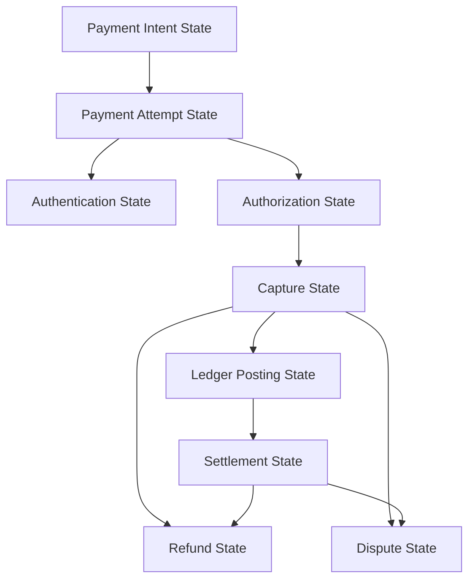

Prinsip:

> State machine harus mengikuti boundary domain, bukan mengikuti nama status provider.

Provider boleh punya `SUCCESS`, `PAID`, `SETTLED`, `COMPLETED`, `CAPTURED`. Internal platform harus punya status sendiri yang stabil.

---

## 4. Payment Intent State Machine

Payment intent mewakili niat/instruction pembayaran dari merchant/customer.

State dasar:

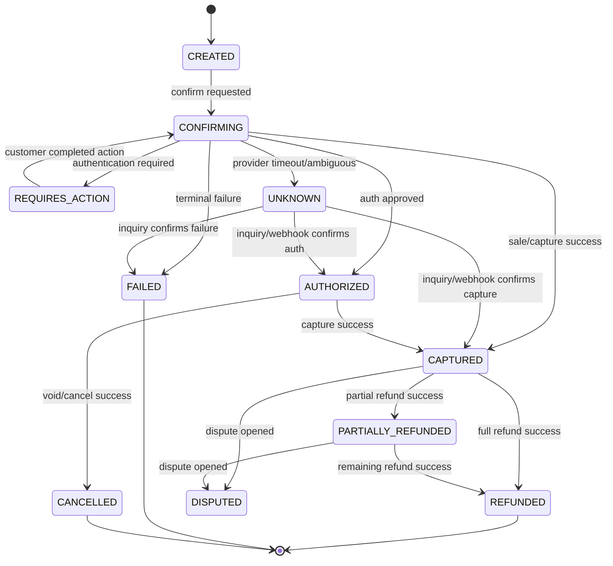

Ini masih simplified.

Perhatikan `UNKNOWN` adalah state kelas satu. Ia bukan `FAILED`.

Timeout bukan failure finansial. Timeout adalah ketidaktahuan sistem lokal.

---

## 5. Unknown State: State Paling Penting di Payment

Dalam sistem biasa:

```text
request timeout = failure
```

Dalam payment:

```text
request timeout = maybe succeeded, maybe failed, maybe still processing
```

Contoh:

1. Platform mengirim capture ke provider.
2. Provider memproses dan berhasil.
3. Network putus sebelum response diterima.
4. Platform melihat timeout.

Kalau platform menandai `FAILED`, lalu retry capture tanpa idempotency/provider reference, customer bisa double charged.

State yang benar:

```text
CAPTURE_UNKNOWN
```

Lalu resolution flow:

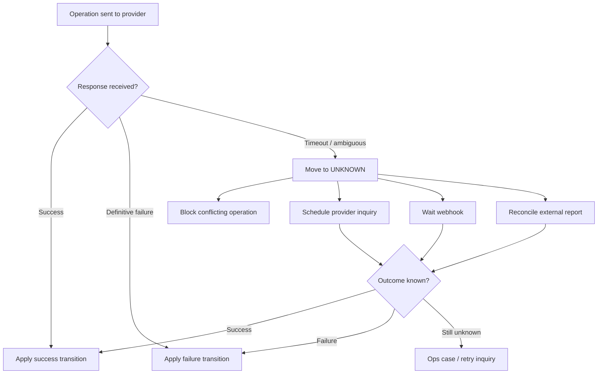

Unknown state harus punya:

- operation id,
- provider idempotency key,
- provider reference kalau ada,
- request timestamp,
- last inquiry timestamp,
- retry count,
- resolution deadline,
- blocked operations list,
- audit trail.

---

## 6. State Transition Harus Legal, Bukan Sekadar Update Status

Buruk:

```sql
update payment set status = :new_status where id = :id;
```

Ini membiarkan siapa pun mengubah `FAILED` menjadi `CAPTURED`, `REFUNDED` menjadi `AUTHORIZED`, atau `CANCELLED` menjadi `SETTLED`.

Lebih aman:

```sql
update payment
set status = :to_status,
    version = version + 1,
    updated_at = now()
where id = :payment_id
  and status = :from_status
  and version = :expected_version;
```

Tapi legalitas tetap harus dicek di domain layer.

```java
public final class PaymentStateMachine {
    private static final Map<PaymentStatus, Set<PaymentStatus>> LEGAL = Map.of(
            PaymentStatus.CREATED, Set.of(PaymentStatus.CONFIRMING, PaymentStatus.CANCELLED),
            PaymentStatus.CONFIRMING, Set.of(
                    PaymentStatus.REQUIRES_ACTION,
                    PaymentStatus.AUTHORIZED,
                    PaymentStatus.CAPTURED,
                    PaymentStatus.FAILED,
                    PaymentStatus.UNKNOWN),
            PaymentStatus.REQUIRES_ACTION, Set.of(PaymentStatus.CONFIRMING, PaymentStatus.FAILED),
            PaymentStatus.UNKNOWN, Set.of(PaymentStatus.AUTHORIZED, PaymentStatus.CAPTURED, PaymentStatus.FAILED),
            PaymentStatus.AUTHORIZED, Set.of(PaymentStatus.CAPTURED, PaymentStatus.CANCELLED, PaymentStatus.EXPIRED),
            PaymentStatus.CAPTURED, Set.of(PaymentStatus.PARTIALLY_REFUNDED, PaymentStatus.REFUNDED, PaymentStatus.DISPUTED),
            PaymentStatus.PARTIALLY_REFUNDED, Set.of(PaymentStatus.REFUNDED, PaymentStatus.DISPUTED),
            PaymentStatus.FAILED, Set.of(),
            PaymentStatus.CANCELLED, Set.of(),
            PaymentStatus.REFUNDED, Set.of(),
            PaymentStatus.EXPIRED, Set.of()
    );

    public void assertTransition(PaymentStatus from, PaymentStatus to) {
        if (!LEGAL.getOrDefault(from, Set.of()).contains(to)) {
            throw new IllegalPaymentTransitionException(from, to);
        }
    }
}
```

`LEGAL` sebaiknya tidak tersebar di banyak service.

---

## 7. Event yang Memicu Transition Harus Dibedakan Dari State

State:

```text
AUTHORIZED
```

Event:

```text
AuthorizationApproved
```

Command:

```text
AuthorizePayment
```

Jangan campur.

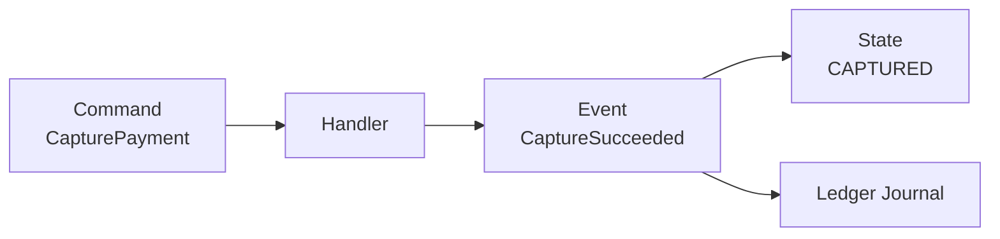

Perbedaannya:

| Konsep | Makna |
|---|---|
| Command | Permintaan melakukan sesuatu |
| Event | Fakta bahwa sesuatu terjadi |
| State | Ringkasan kondisi saat ini |

Dalam audit, event lebih penting daripada state.

State bisa direbuild dari event/history. Event tidak boleh hilang.

---

## 8. Transition Record: Evidence untuk Setiap Perubahan State

Setiap state transition harus meninggalkan jejak.

```sql
create table payment_state_transition (
    id uuid primary key,
    payment_id uuid not null,
    from_status varchar(50) not null,
    to_status varchar(50) not null,
    trigger_type varchar(50) not null,
    trigger_id varchar(150),
    actor_type varchar(50) not null,
    actor_id varchar(150),
    reason_code varchar(100),
    provider_reference varchar(150),
    metadata jsonb not null default '{}'::jsonb,
    occurred_at timestamptz not null,
    recorded_at timestamptz not null default now()
);
```

Contoh `trigger_type`:

- `API_COMMAND`,
- `PROVIDER_RESPONSE`,
- `WEBHOOK`,
- `PROVIDER_INQUIRY`,
- `RECONCILIATION_FILE`,
- `OPS_MANUAL_ACTION`,
- `SYSTEM_TIMEOUT`,
- `SCHEDULED_EXPIRY`.

Ini membuat sistem bisa menjawab:

> “Kenapa payment ini berubah dari UNKNOWN menjadi CAPTURED?”

Jawaban bukan “karena status diupdate”.

Jawaban yang benar:

> “Karena provider inquiry pada 2026-07-02 10:18:22 mengembalikan capture success dengan provider reference X, lalu transition rule `UNKNOWN -> CAPTURED` diterapkan.”

---

## 9. Authorization State Machine

Authorization bukan capture.

Authorization adalah persetujuan/hold/approval dari issuer/provider. Capture adalah finalisasi charge.

State authorization:

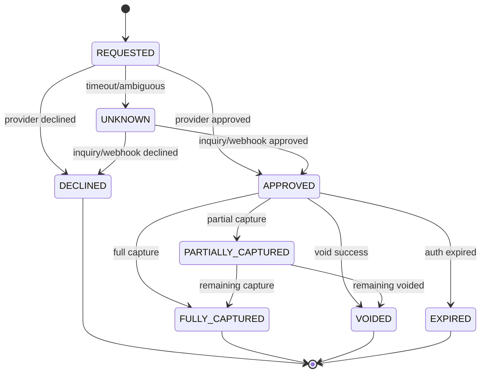

Important invariants:

```text
total_captured <= authorized_amount
total_voided + total_captured <= authorized_amount
capture allowed only when auth is APPROVED or PARTIALLY_CAPTURED
void allowed only for uncaptured amount
expired auth cannot be captured unless provider explicitly allows late capture
```

---

## 10. Capture State Machine

Capture adalah operation sendiri.

Satu authorization bisa punya beberapa capture kalau rail/provider mendukung partial capture.

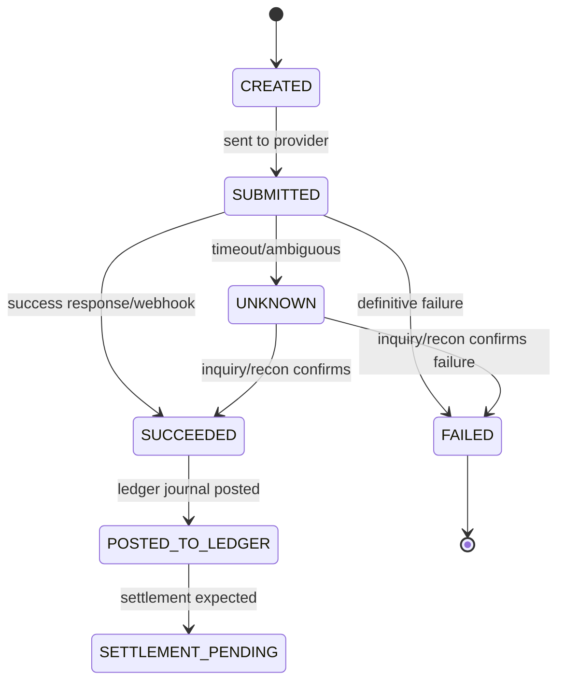

Kenapa `SUCCEEDED` dan `POSTED_TO_LEDGER` dipisah?

Karena provider success dan internal accounting success adalah dua fakta berbeda.

Jika provider capture sukses tapi ledger posting gagal, payment tidak boleh dianggap sehat.

State perlu memperlihatkan gap ini.

---

## 11. Ledger Posting Boundary

Payment state tidak boleh melompat ke financial truth tanpa ledger.

Contoh buruk:

```text
provider capture success -> payment status CAPTURED -> merchant balance bertambah by update balance
```

Lebih aman:

```text
provider capture success -> capture SUCCEEDED -> post ledger journal -> payment CAPTURED / ledger POSTED
```

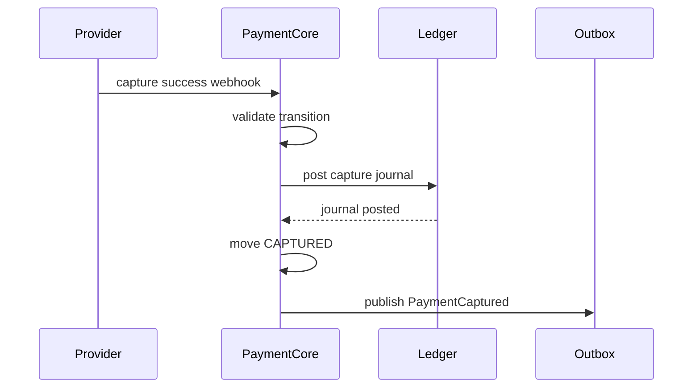

Rule:

> State yang memberi hak finansial harus bergantung pada ledger posting, bukan hanya provider status.

---

## 12. Refund State Machine

Refund punya lifecycle sendiri.

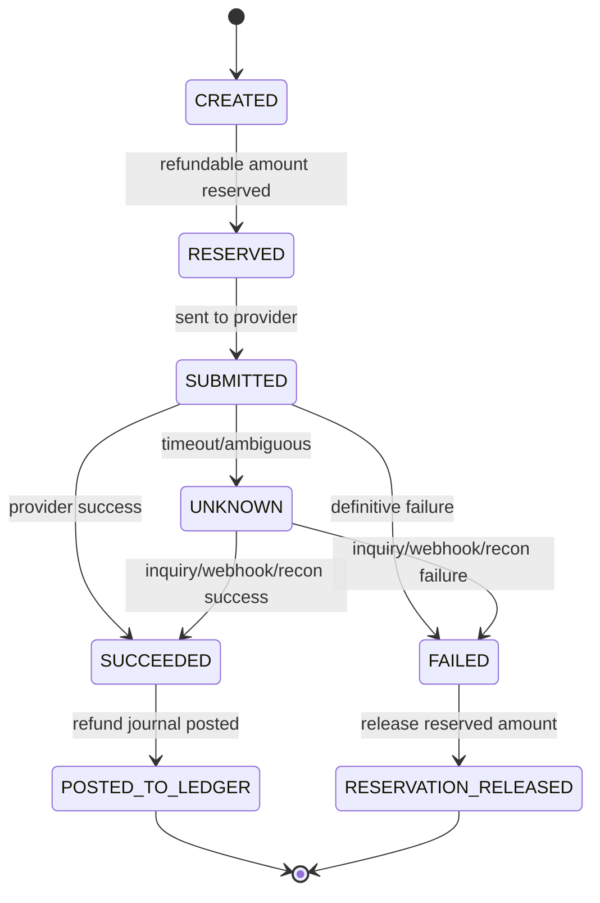

Refund state machine harus menjaga amount reservation.

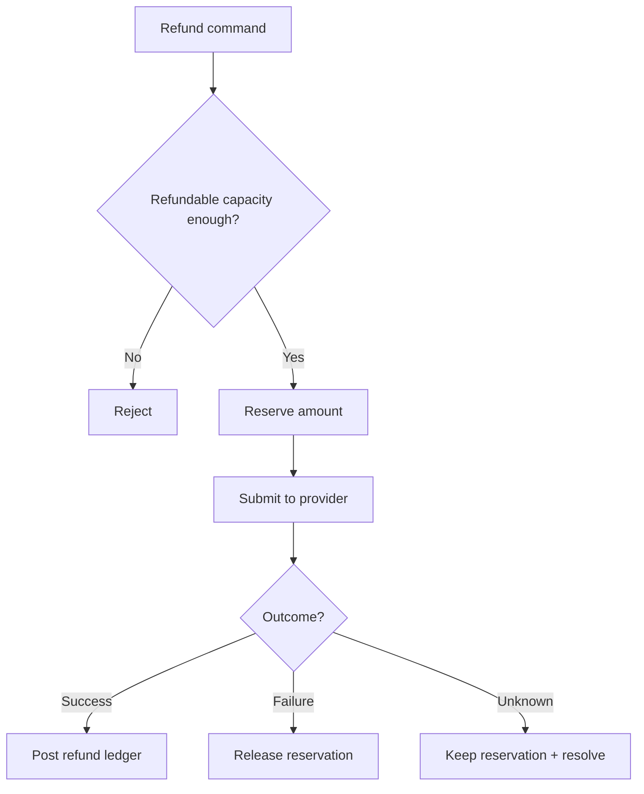

Unknown refund tidak boleh release reservation.

---

## 13. Settlement State Machine

Settlement bukan payment success.

Payment captured berarti customer/provider menyatakan charge berhasil. Settlement berarti dana sudah masuk/matang sesuai report/statement.

State settlement item:

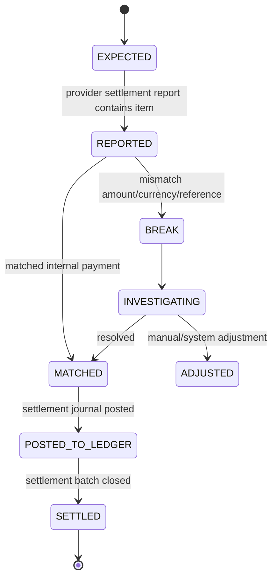

Jangan set `payment.status = SETTLED` hanya karena payment captured.

Settlement harus punya evidence:

- report id,
- batch id,
- settlement date,
- provider reference,
- gross/fee/net amount,
- bank statement reference jika ada,
- reconciliation match id.

---

## 14. Dispute/Chargeback State Machine

Dispute bukan refund.

Refund adalah pengembalian yang biasanya diinisiasi merchant/platform. Chargeback/dispute biasanya dipicu customer/issuer/scheme/bank.

State dispute:

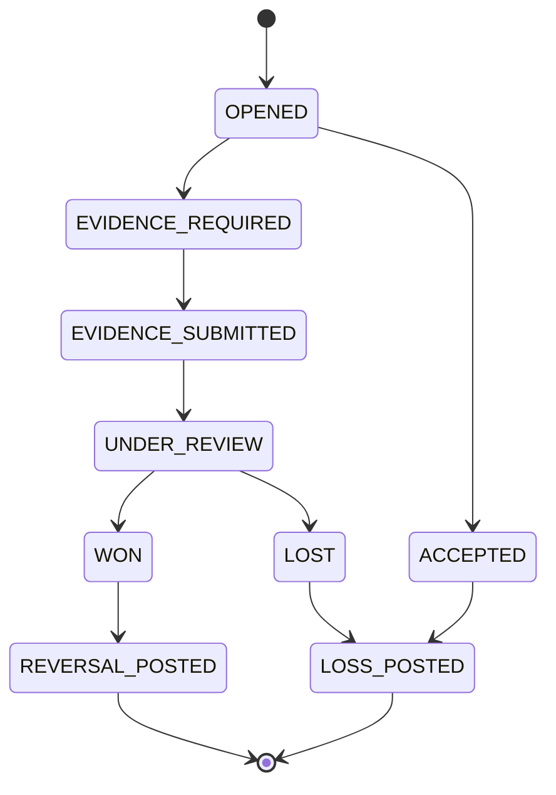

Dispute affects payment state, merchant balance, reserve, payout eligibility, and risk scoring.

Tapi dispute lifecycle jangan dipaksa masuk satu enum payment utama.

Payment boleh `CAPTURED` dan dispute `OPENED` secara bersamaan.

---

## 15. Payout State Machine

Merchant payout juga state machine.

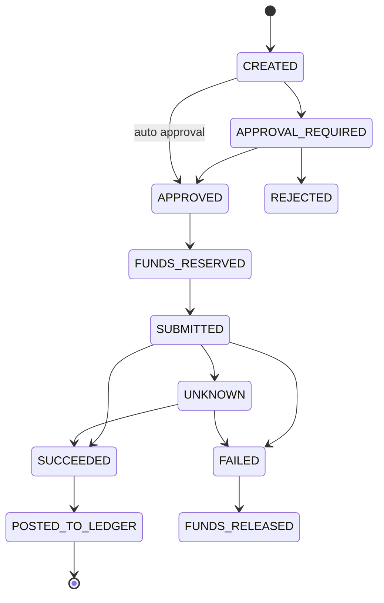

Payout sama berbahayanya dengan charge. Double payout bisa menghancurkan platform.

Maka payout juga butuh:

- idempotency,
- amount reservation,
- maker-checker untuk high amount,
- beneficiary verification,
- provider inquiry,
- reconciliation,
- ledger posting.

---

## 16. State Explosion: Cara Menghindari Monster Enum

Kalau semua kombinasi dimasukkan ke `PaymentStatus`, enum bisa menjadi seperti:

```text
AUTHORIZED_PARTIALLY_CAPTURED_PARTIALLY_REFUNDED_DISPUTED_SETTLEMENT_PENDING
```

Ini buruk.

Gunakan orthogonal states.

```sql
create table payment (
    id uuid primary key,
    intent_status varchar(50) not null,
    fulfillment_status varchar(50) not null,
    ledger_status varchar(50) not null,
    settlement_status varchar(50) not null,
    dispute_status varchar(50) not null,
    version bigint not null,
    created_at timestamptz not null,
    updated_at timestamptz not null
);
```

Atau pecah ke aggregate/table berbeda:

- `payment_intent`,
- `payment_attempt`,
- `authorization`,
- `capture`,
- `refund`,
- `settlement_item`,
- `dispute_case`,
- `payout`.

Pecahan aggregate lebih aman untuk sistem besar.

---

## 17. Mapping Provider Status ke Internal State

Provider A:

```text
PAID
```

Provider B:

```text
SUCCESS
```

Provider C:

```text
CAPTURED
```

Provider D:

```text
SETTLED
```

Jangan langsung simpan provider status sebagai internal state.

Buat normalization layer:

```java
public record ProviderStatusMapping(
        String provider,
        String providerStatus,
        ProviderOperation operation,
        InternalOutcome outcome,
        boolean terminal,
        boolean requiresInquiry
) {}
```

Contoh:

| Provider status | Operation | Internal outcome |
|---|---|---|
| `AUTHORIZED` | authorize | `AUTH_APPROVED` |
| `PAID` | sale | `CAPTURE_SUCCEEDED` |
| `SUCCESS` | refund | `REFUND_SUCCEEDED` |
| `PENDING` | bank transfer | `AWAITING_CUSTOMER_PAYMENT` |
| `PROCESSING` | payout | `PAYOUT_PENDING` |
| `ERROR` | any | depends on error code |
| timeout | any | `UNKNOWN` |

Mapping harus mempertimbangkan operation, bukan status text saja.

`SUCCESS` untuk authorization berbeda dari `SUCCESS` untuk refund.

---

## 18. Event Ordering: Webhook Bisa Datang Tidak Urut

Provider bisa mengirim:

```text
CAPTURED webhook
AUTHORIZED webhook
```

Atau settlement report datang sebelum webhook.

Atau duplicate webhook datang setelah manual repair.

State machine harus robust terhadap event ordering.

Prinsip:

1. Setiap provider event disimpan dulu sebagai raw event.
2. Dedup berdasarkan provider event id atau fingerprint.
3. Normalize event.
4. Apply jika transition legal.
5. Jika transition belum legal tetapi event plausible, parkir sebagai pending event.
6. Jika event kontradiktif, buat anomaly.

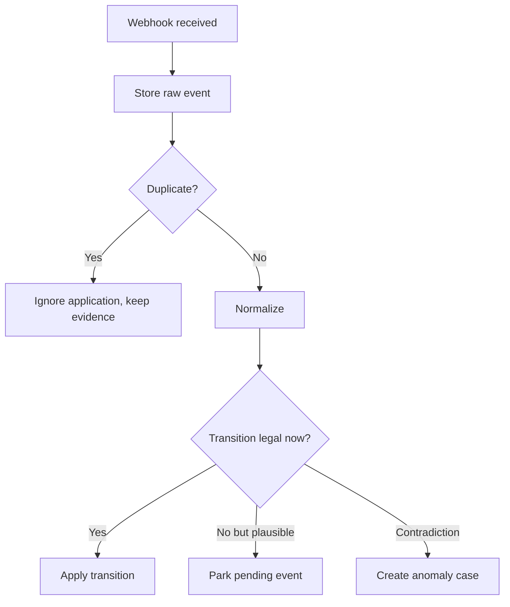

---

## 19. Idempotency dan State Machine

Idempotency bukan hanya “same request returns same response”.

Dalam state machine, idempotency menentukan apakah command boleh diterapkan ulang.

Contoh:

```text
CapturePayment(paymentId=123, amount=100000, idempotencyKey=k1)
```

Jika command pertama timeout setelah provider success, retry dengan `k1` harus mengembalikan operation yang sama, bukan membuat capture baru.

Idempotency record:

```sql
create table idempotency_record (
    id uuid primary key,
    scope varchar(100) not null,
    key varchar(200) not null,
    request_hash varchar(128) not null,
    operation_type varchar(50) not null,
    operation_id uuid not null,
    status varchar(50) not null,
    response_snapshot jsonb,
    created_at timestamptz not null,
    expires_at timestamptz not null,
    unique(scope, key)
);
```

Rule:

- same key + same payload = return same operation/result,
- same key + different payload = conflict,
- different key + conflicting state = reject by state/amount invariant,
- provider idempotency key should be derived from internal operation id where possible.

---

## 20. Concurrency: Two Legal Commands Can Become Illegal Together

Scenario:

- Captured amount = Rp100.000.
- Refund A = Rp70.000.
- Refund B = Rp50.000.
- Keduanya datang bersamaan.

Masing-masing terlihat valid jika membaca state lama.

Bersama-sama total refund Rp120.000, illegal.

Solusi:

- optimistic locking,
- amount reservation,
- unique operation keys,
- serializable transaction untuk area tertentu,
- domain-level invariant check dalam transaction.

```sql
update payment_refund_amount_state
set pending_refund_amount_minor = pending_refund_amount_minor + :refund_amount,
    version = version + 1
where payment_id = :payment_id
  and version = :expected_version
  and successful_refund_amount_minor + pending_refund_amount_minor + :refund_amount <= captured_amount_minor;
```

State machine tanpa concurrency control hanya diagram.

---

## 21. Terminal State Tidak Selalu Benar-Benar Terminal

`FAILED` biasanya terminal untuk satu attempt.

Tapi payment intent mungkin masih bisa punya attempt baru.

Contoh:

```text
Attempt 1: card declined
Payment intent: still requires new payment method
Attempt 2: wallet success
Payment intent: captured
```

Jadi bedakan terminal untuk:

| Object | Terminal meaning |
|---|---|
| Attempt | percobaan itu selesai |
| Authorization | approval itu selesai/expired/voided/captured |
| Capture | capture operation selesai |
| Payment intent | obligation pembayaran selesai atau tidak mungkin lanjut |
| Refund | refund operation selesai |

Jangan membuat `payment FAILED` hanya karena satu attempt gagal, kecuali policy memang single-attempt.

---

## 22. State Machine dan Order Fulfillment

Payment state sering dipakai oleh order system.

Tapi order fulfillment tidak boleh membaca status provider mentah.

Contoh policy:

| Payment condition | Order action |
|---|---|
| `AUTHORIZED` | reserve inventory, do not ship physical goods unless auth-only flow allows |
| `CAPTURED` + ledger posted | fulfill digital goods / mark paid |
| `CAPTURE_UNKNOWN` | hold fulfillment |
| `FAILED` | allow retry / release reservation |
| `REFUNDED` | trigger return/cancel policy |
| `DISPUTED` | freeze high-risk merchant operations if needed |

Order should subscribe to domain event:

```text
PaymentFinanciallyConfirmed
```

Not:

```text
ProviderWebhookSuccessReceived
```

---

## 23. Manual State Transition: Ops Tidak Boleh Bebas Mengubah Status

Backoffice biasanya butuh manual repair.

Tapi manual action harus tetap melewati state machine.

Contoh action:

- mark provider event as duplicate,
- force inquiry,
- resolve unknown as failed with evidence,
- link settlement item to payment,
- post adjustment journal,
- release stale reservation,
- create dispute loss entry.

Manual action tidak boleh:

```text
set payment.status = CAPTURED
```

Manual action harus berupa command:

```text
ResolveCaptureUnknown(paymentId, operationId, outcome, evidenceId, reasonCode)
```

Lalu state machine memvalidasi transition.

Maker-checker bisa diwajibkan untuk transition berisiko.

---

## 24. Expiry Transitions

Beberapa state punya expiry:

- payment intent expires,
- virtual account expires,
- QR expires,
- authorization expires,
- 3DS challenge expires,
- refund reservation expires only if safe,
- payout approval expires,
- dispute evidence deadline expires.

Expiry adalah transition juga.

```sql
create table scheduled_state_transition (
    id uuid primary key,
    aggregate_type varchar(50) not null,
    aggregate_id uuid not null,
    expected_from_status varchar(50) not null,
    to_status varchar(50) not null,
    reason_code varchar(100) not null,
    execute_after timestamptz not null,
    executed_at timestamptz,
    status varchar(30) not null,
    created_at timestamptz not null
);
```

Worker expiry harus idempotent:

```sql
update payment_authorization
set status = 'EXPIRED',
    version = version + 1
where id = :authorization_id
  and status = 'APPROVED'
  and expires_at <= now();
```

Jika status sudah berubah menjadi captured, expiry job tidak melakukan apa-apa.

---

## 25. Persistence Pattern: Current State + History

Production system biasanya menyimpan:

1. current state untuk query cepat,
2. transition history untuk audit,
3. domain events/outbox untuk integration,
4. raw provider events untuk evidence.

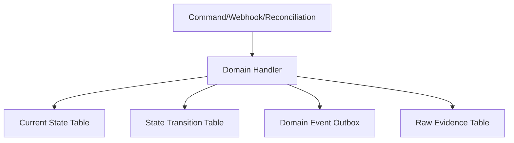

Jangan hanya simpan current state.

Tanpa history, debugging payment incident akan sangat mahal.

---

## 26. Java Implementation Pattern

Contoh command handler capture:

```java
public final class CapturePaymentHandler {
    private final PaymentRepository paymentRepository;
    private final AuthorizationRepository authorizationRepository;
    private final CaptureRepository captureRepository;
    private final PaymentStateMachine paymentStateMachine;
    private final LedgerService ledgerService;
    private final Outbox outbox;

    public CaptureResult handle(CapturePayment command) {
        return paymentRepository.inTransaction(() -> {
            Payment payment = paymentRepository.getForUpdate(command.paymentId());
            Authorization authorization = authorizationRepository.getForUpdate(command.authorizationId());

            paymentStateMachine.assertCaptureAllowed(payment, authorization, command.amount());

            Capture capture = captureRepository.createPending(command);
            authorization.reserveCapture(command.amount());

            paymentRepository.save(payment);
            authorizationRepository.save(authorization);
            captureRepository.save(capture);

            outbox.enqueue(new CaptureSubmissionRequested(capture.id()));

            return CaptureResult.accepted(capture.id());
        });
    }
}
```

External provider call sebaiknya tidak dilakukan di dalam DB transaction panjang.

Flow:

1. Reserve state/amount internal.
2. Commit.
3. Outbox worker submit ke provider.
4. Provider response/webhook/inquiry menggerakkan state berikutnya.

Ini menghindari transaction DB menggantung karena network call.

---

## 27. Provider Submission Worker

```java
public final class CaptureSubmissionWorker {
    private final CaptureRepository captureRepository;
    private final ProviderClient providerClient;
    private final Outbox outbox;

    public void submit(UUID captureId) {
        Capture capture = captureRepository.get(captureId);

        if (!capture.isSubmittable()) {
            return;
        }

        ProviderCaptureRequest request = ProviderCaptureRequest.from(capture);

        try {
            ProviderCaptureResponse response = providerClient.capture(request);
            outbox.enqueue(ProviderCaptureResponseReceived.from(captureId, response));
        } catch (ProviderTimeoutException e) {
            outbox.enqueue(new ProviderCaptureOutcomeUnknown(captureId, e.requestId()));
        } catch (ProviderDefinitiveDeclineException e) {
            outbox.enqueue(new ProviderCaptureFailed(captureId, e.reasonCode()));
        }
    }
}
```

Worker tidak langsung sembarang update. Ia menghasilkan event internal untuk handler state transition.

---

## 28. Transition Handler dengan Optimistic Locking

```java
public final class CaptureOutcomeHandler {
    private final CaptureRepository captureRepository;
    private final PaymentRepository paymentRepository;
    private final LedgerService ledgerService;
    private final StateTransitionRecorder recorder;

    public void on(CaptureSucceeded event) {
        captureRepository.inTransaction(() -> {
            Capture capture = captureRepository.getForUpdate(event.captureId());
            Payment payment = paymentRepository.getForUpdate(capture.paymentId());

            if (capture.isSucceeded()) {
                return; // idempotent duplicate event
            }

            capture.assertCanMoveTo(CaptureStatus.SUCCEEDED);
            payment.assertCanApplyCapture(capture.amount());

            LedgerJournal journal = ledgerService.postCapture(capture);

            capture.markSucceeded(event.providerReference(), journal.id());
            payment.markCapturedIfComplete(capture.amount());

            recorder.record(
                    payment.id(),
                    payment.previousStatus(),
                    payment.status(),
                    "PROVIDER_RESPONSE",
                    event.eventId(),
                    event.providerReference()
            );

            captureRepository.save(capture);
            paymentRepository.save(payment);
        });
    }
}
```

Duplicate event harus aman.

Contradictory event harus anomaly.

---

## 29. State Machine Test Matrix

State machine wajib dites sebagai matrix.

Contoh:

| From | To | Expected |
|---|---|---|
| CREATED | CONFIRMING | allowed |
| CREATED | CAPTURED | rejected |
| CONFIRMING | UNKNOWN | allowed |
| UNKNOWN | CAPTURED | allowed with evidence |
| FAILED | CAPTURED | rejected except explicit repair policy |
| CAPTURED | REFUNDED | allowed if amount invariant satisfied |
| REFUNDED | CAPTURED | rejected |

Test bukan hanya happy path.

Minimal test:

- all legal transitions pass,
- all illegal transitions fail,
- duplicate event idempotent,
- out-of-order plausible event parked,
- contradictory event creates anomaly,
- unknown blocks conflicting command,
- amount invariant enforced under concurrent commands,
- ledger posting failure prevents financial confirmation,
- manual action requires reason/evidence.

---

## 30. State Machine as Documentation

State machine yang baik harus dibaca oleh:

- engineer,
- product,
- finance,
- ops,
- compliance,
- support.

Karena itu, setiap status harus punya definisi operasional.

Contoh:

| Status | Definisi | Boleh fulfill order? | Boleh refund? | Boleh payout? |
|---|---|---:|---:|---:|
| `CREATED` | intent dibuat, belum ada attempt final | No | No | No |
| `AUTHORIZED` | dana/limit disetujui, belum captured | Depends | No | No |
| `CAPTURED` | charge sukses dan ledger posted | Yes | Yes | Not until settlement policy |
| `CAPTURE_UNKNOWN` | provider outcome ambiguous | No | No | No |
| `REFUNDED` | full refund succeeded and ledger posted | No | No | No |
| `DISPUTED` | dispute aktif | Depends | Depends | Maybe frozen |

Kalau tabel ini tidak bisa dibuat, state model belum jelas.

---

## 31. Anti-Pattern State Machine

### Anti-Pattern 1: Enum terlalu generik

```java
PENDING, SUCCESS, FAILED
```

Tidak cukup untuk payment.

### Anti-Pattern 2: Provider status menjadi internal state

```text
payment.status = provider.status
```

Membuat internal model bergantung pada provider.

### Anti-Pattern 3: Timeout dianggap failure

Timeout harus menjadi unknown sampai resolved.

### Anti-Pattern 4: State update tanpa transition history

Audit hilang.

### Anti-Pattern 5: Manual update langsung ke DB

Backoffice harus command-based dan evidence-based.

### Anti-Pattern 6: Ledger posting setelah publish event

Jika event keluar sebelum ledger posting, downstream bisa bertindak pada uang yang belum tercatat.

---

## 32. Minimal Production Checklist

- [ ] Payment intent, attempt, authorization, capture, refund, settlement, dispute, payout punya state terpisah.
- [ ] `UNKNOWN` adalah state eksplisit.
- [ ] Timeout tidak otomatis menjadi failed.
- [ ] Transition legal divalidasi di domain layer.
- [ ] DB update memakai expected state/version.
- [ ] Semua transition punya history/evidence.
- [ ] Provider status dinormalisasi, tidak langsung dipakai.
- [ ] Duplicate webhook/event idempotent.
- [ ] Out-of-order event bisa diparkir atau dianomali.
- [ ] State yang memberi hak finansial menunggu ledger posting.
- [ ] Manual action tetap melewati command/state machine.
- [ ] Expiry dimodelkan sebagai transition.
- [ ] State machine punya test matrix illegal/legal transition.

---

## 33. Mini Design Exercise

Desain flow berikut:

```text
Payment intent IDR 100000 dibuat.
Customer memilih card.
Provider authorization success.
Capture request dikirim.
Provider timeout.
Webhook capture success datang 5 menit kemudian.
Ledger posting success.
Settlement report datang besok dengan amount IDR 97000 net of fee.
```

Tentukan:

1. State payment intent setelah authorization?
2. State capture setelah timeout?
3. Operation apa yang diblokir selama capture unknown?
4. Apa yang dilakukan webhook capture success?
5. Kapan order boleh fulfilled?
6. Kapan merchant balance pending bertambah?
7. Kapan settlement status berubah?
8. Evidence apa saja yang harus tersimpan?

Jawaban ringkas:

- setelah authorization: `AUTHORIZED`,
- setelah capture timeout: capture `UNKNOWN`, payment financial confirmation belum final,
- refund/second capture/payout harus diblokir atau dibatasi,
- webhook success resolve capture unknown menjadi succeeded,
- order boleh fulfilled setelah capture success + ledger posted sesuai policy,
- merchant pending balance bertambah saat capture ledger journal posted,
- settlement berubah setelah settlement item matched dan settlement journal posted,
- evidence meliputi command id, provider request id, timeout event, webhook raw payload, provider reference, ledger journal id, settlement report id, reconciliation match id.

---

## 34. Kesimpulan

Payment state machine bukan aksesori desain.

Ia adalah pagar yang mencegah sistem melakukan operasi finansial yang salah.

State machine yang benar harus:

- memisahkan lifecycle berbeda,
- memperlakukan unknown sebagai state nyata,
- memvalidasi legal transition,
- menyimpan transition evidence,
- menormalisasi provider event,
- tahan duplicate dan out-of-order event,
- terkait erat dengan ledger boundary,
- dan bisa diuji sebagai matrix, bukan hanya happy path.

Part berikutnya akan masuk ke **Idempotency as a Financial Control**: bagaimana mendesain idempotency key, request hash, provider idempotency, replay window, conflict detection, dan idempotency under concurrency supaya retry tidak berubah menjadi double charge.

---

## Referensi

- EMVCo EMV 3-D Secure overview: https://www.emvco.com/emv-technologies/3-d-secure/
- PCI DSS v4.0.1 publication note: https://blog.pcisecuritystandards.org/just-published-pci-dss-v4-0-1
- ISO 20022 and payment message modernization, Swift overview: https://www.swift.com/standards/iso-20022
- FedNow ISO 20022 resource center: https://www.frbservices.org/financial-services/fednow/organizations/iso-20022
- Bank Indonesia SNAP: https://www.bi.go.id/id/fungsi-utama/sistem-pembayaran/standar/standar-nasional-open-api-pembayaran/default.aspx
