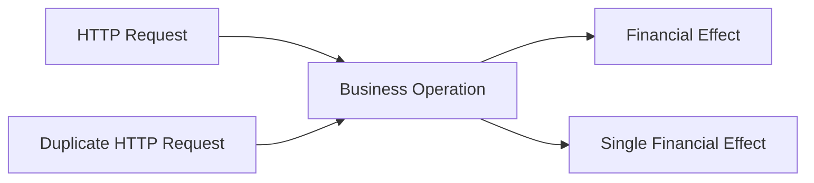
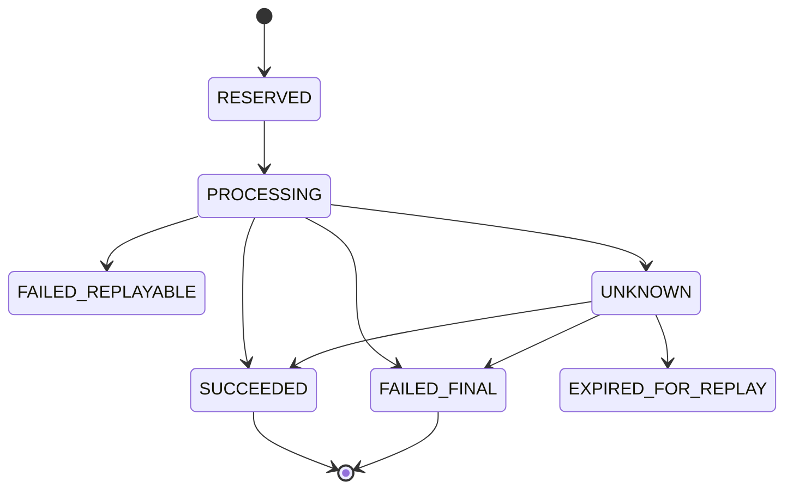
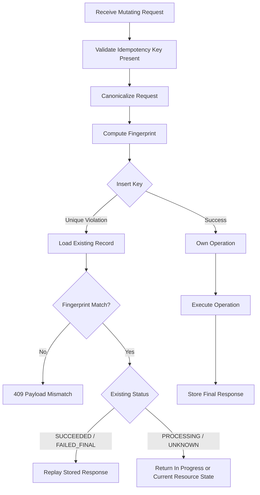
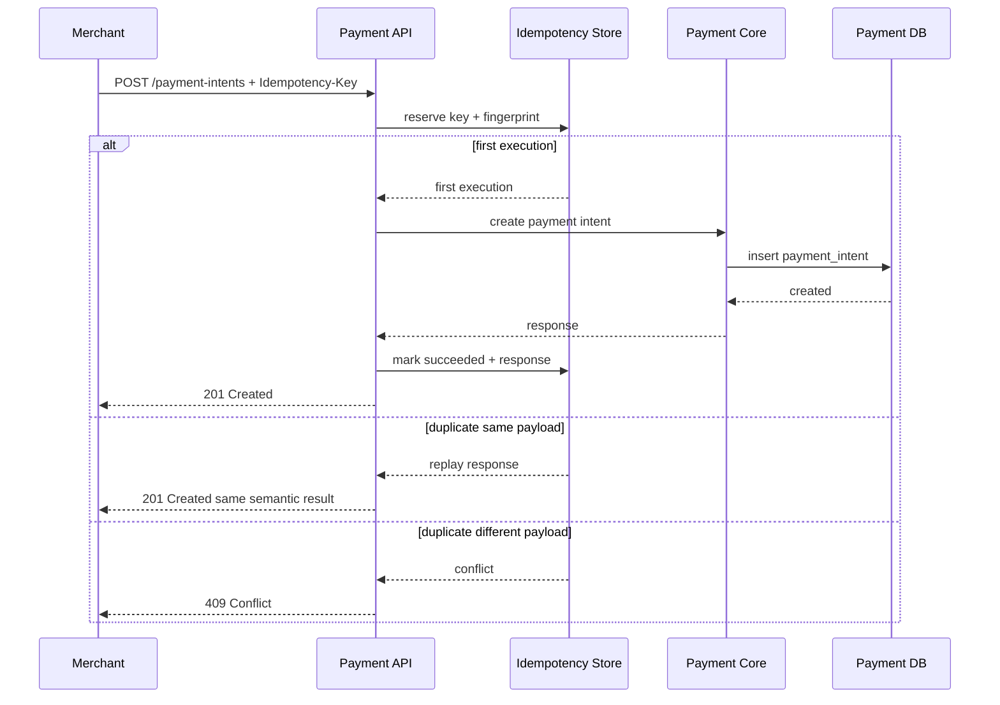
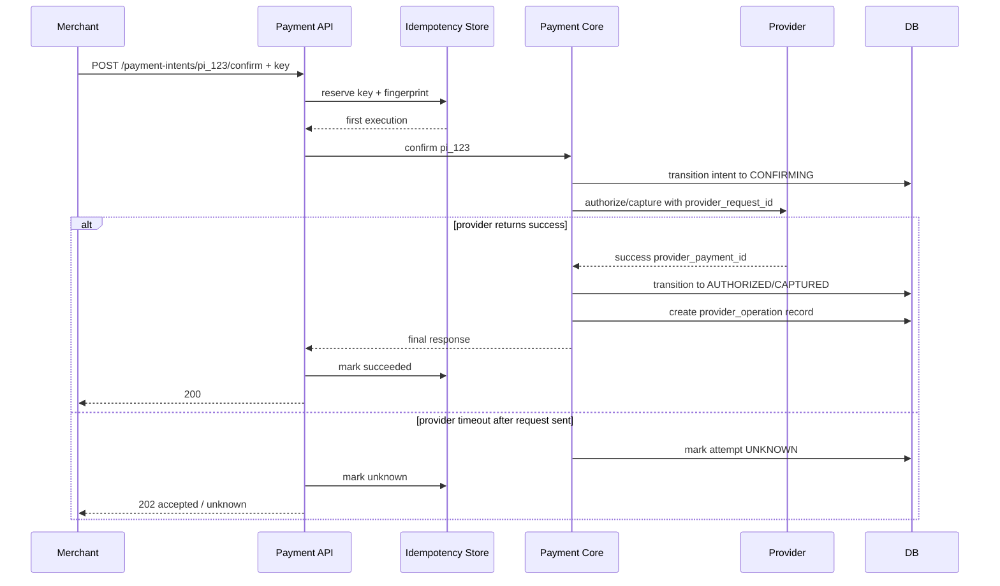

------
title: Build From Scratch: Large Production Grade Java Payment Systems - Part 009
description: Membahas idempotency sebagai financial control dalam sistem pembayaran enterprise: retry, duplicate request, request fingerprint, provider idempotency, webhook deduplication, ledger posting idempotency, concurrency, TTL, dan implementasi Java/PostgreSQL.
series: learn-java-payment-systems
seriesTitle: Build From Scratch: Large Production Grade Java Payment Systems
order: 9
partTitle: Idempotency as a Financial Control
tags:
- java
- payments
- idempotency
- financial-control
- concurrency
- ledger
- postgresql
- enterprise-architecture
date: 2026-07-02
---

# Part 009 — Idempotency as a Financial Control

Di banyak sistem backend, idempotency dipahami terlalu dangkal:

> "Kalau request dikirim dua kali, hasilnya sama."

Definisi itu tidak salah, tapi tidak cukup untuk payment system.

Dalam payment platform, idempotency bukan sekadar teknik retry. Ia adalah **financial control**.

Idempotency menentukan apakah sistem akan:

- menagih customer sekali atau dua kali,
- membuat refund sekali atau dua kali,
- mengirim payout sekali atau dua kali,
- mem-posting ledger sekali atau dua kali,
- memproses webhook duplikat secara aman,
- atau membuat operational chaos karena request timeout dianggap gagal padahal provider sudah sukses.

Payment system tidak boleh berpikir seperti ini:

```txt
HTTP 200 = sukses
HTTP 500 = gagal
HTTP timeout = gagal
```

Dalam pembayaran, timeout berarti:

```txt
sistem kita tidak tahu hasil akhirnya
```

Itu berbeda jauh dari gagal.

Karena itu, idempotency harus didesain sejak awal sebagai bagian dari correctness model, bukan ditempel belakangan sebagai middleware.

---

## 1. Masalah Nyata yang Ingin Diselesaikan

Bayangkan flow sederhana:

```txt
Customer klik Pay
Merchant backend memanggil Payment API
Payment API memanggil PSP/acquirer
Provider memproses charge
Koneksi timeout sebelum response kembali
Merchant backend retry
```

Pertanyaannya:

> Apakah retry itu membuat charge baru?

Jawaban production-grade harus:

> Tidak, selama retry tersebut merepresentasikan business operation yang sama.

Tapi kata "sama" harus didefinisikan secara ketat.

Request yang sama bukan hanya punya endpoint yang sama.

Request yang sama harus punya:

1. actor scope yang sama,
2. idempotency key yang sama,
3. operation type yang sama,
4. request fingerprint yang sama,
5. business target yang sama,
6. semantic amount/currency yang sama,
7. dan lifecycle boundary yang sama.

Tanpa itu, idempotency berubah menjadi bug.

---

## 2. Idempotency Bukan Exactly-Once Processing

Salah satu jebakan paling umum:

> "Kalau pakai idempotency, berarti proses terjadi exactly once."

Tidak.

Dalam distributed system, kita biasanya tidak mendapatkan exactly-once execution secara end-to-end. Yang lebih realistis adalah:

```txt
operation may be attempted multiple times,
but financial effect must be applied once.
```

Untuk payment system, target kita bukan "kode hanya berjalan sekali".

Target kita adalah:

```txt
financial side effect happens at most once per intended business operation,
while callers can safely retry until outcome is known.
```

Ini penting.

Karena dalam praktiknya:

- HTTP handler bisa dieksekusi dua kali,
- command consumer bisa menerima message dua kali,
- webhook bisa dikirim provider berkali-kali,
- outbox publisher bisa publish event lebih dari sekali,
- reconciliation job bisa membaca file yang sama dua kali,
- operator bisa klik tombol repair lebih dari sekali,
- provider bisa menerima retry dengan request id yang sama.

Idempotency tidak mencegah semua eksekusi ulang.

Idempotency mencegah **efek finansial ganda**.

---

## 3. Mental Model: Request, Operation, Effect

Pisahkan tiga hal ini:



Satu business operation bisa diwakili oleh banyak request.

Contoh:

```txt
Operation:
Capture authorization AUTH-123 sebesar IDR 100.000

Request attempts:
- request pertama timeout
- retry pertama HTTP 502
- retry kedua HTTP 200
- webhook datang 3 kali
```

Semua attempt itu harus terkumpul ke satu operation.

Financial effect-nya tetap satu.

```txt
Dr Customer Receivable / Provider Clearing
Cr Merchant Pending Settlement
```

atau bentuk ledger lain sesuai model yang kita bangun nanti.

Yang penting: posting ledger tidak boleh ganda.

---

## 4. Bentuk-Bentuk Idempotency di Payment Platform

Payment platform production-grade membutuhkan beberapa lapis idempotency.

Bukan satu tabel global yang dipakai semua.

| Layer | Contoh | Tujuan |
|---|---|---|
| Client API idempotency | `Idempotency-Key` saat create payment/refund/payout | Retry aman dari merchant/client |
| Internal command idempotency | `command_id` untuk async processing | Consumer boleh menerima message duplikat |
| Provider idempotency | `provider_request_id` atau equivalent | Retry ke PSP/acquirer tidak menciptakan charge baru |
| Webhook idempotency | provider event id + event fingerprint | Webhook duplikat tidak memicu transition ganda |
| Ledger idempotency | `journal_reference` unique | Posting jurnal tidak double |
| Reconciliation idempotency | file id + line id + provider ref | Import file/report aman diulang |
| Backoffice idempotency | action id + approval id | Operator action tidak double-execute |
| Settlement idempotency | settlement batch id + merchant id | Payout settlement tidak terkirim dua kali |

Setiap layer punya scope, TTL, dan failure mode berbeda.

Kesalahan umum adalah memakai satu idempotency mechanism untuk semua layer.

Hasilnya biasanya:

- terlalu longgar untuk ledger,
- terlalu mahal untuk webhook,
- terlalu pendek TTL-nya untuk payment dispute,
- atau terlalu global sehingga false conflict meningkat.

---

## 5. API Idempotency: Contract yang Harus Eksplisit

Untuk endpoint mutating, API contract harus menyatakan apakah idempotency key wajib.

Contoh endpoint yang sebaiknya mewajibkan key:

```txt
POST /payment-intents
POST /payment-intents/{id}/confirm
POST /authorizations/{id}/capture
POST /payments/{id}/refunds
POST /payouts
POST /transfers
POST /manual-adjustments
```

Endpoint read tidak butuh idempotency key:

```txt
GET /payment-intents/{id}
GET /payments/{id}
GET /refunds/{id}
```

Untuk mutating endpoint payment, aturan yang baik:

```txt
No idempotency key, no mutation.
```

Kenapa keras?

Karena client, load balancer, reverse proxy, mobile network, job scheduler, dan manusia akan melakukan retry.

Kalau retry tidak aman, masalahnya bukan apakah double charge akan terjadi.

Masalahnya kapan.

---

## 6. Idempotency Key Tidak Cukup

Misalkan request pertama:

```json
{
  "amount": 100000,
  "currency": "IDR",
  "paymentMethodId": "pm_card_abc"
}
```

dengan header:

```txt
Idempotency-Key: checkout-123
```

Lalu request kedua memakai key sama, tapi payload berbeda:

```json
{
  "amount": 150000,
  "currency": "IDR",
  "paymentMethodId": "pm_card_abc"
}
```

Apa yang harus dilakukan?

Jawaban yang aman:

```txt
409 Conflict / IdempotencyKeyPayloadMismatch
```

Bukan membuat payment baru.

Bukan menganggap request kedua sebagai replay valid.

Karena key sama tapi intent berbeda.

Itu indikasi bug client atau misuse.

Maka idempotency record harus menyimpan **request fingerprint**.

---

## 7. Request Fingerprint

Request fingerprint adalah hash dari canonical representation request.

Ia biasanya mencakup:

- HTTP method,
- route template,
- authenticated actor id,
- tenant/merchant id,
- operation type,
- normalized request body,
- business target id jika ada,
- amount dan currency,
- optional API version.

Ia tidak boleh mencakup field non-semantic seperti:

- header tracing,
- request timestamp,
- random nonce yang tidak mempengaruhi business operation,
- whitespace JSON,
- field order JSON,
- client IP.

Contoh conceptual fingerprint:

```txt
SHA256(
  method=POST
  route=/v1/payment-intents/{id}/confirm
  merchant=mrc_123
  operation=CONFIRM_PAYMENT_INTENT
  paymentIntent=pi_456
  amount=100000
  currency=IDR
  paymentMethod=pm_abc
  apiVersion=2026-07-02
)
```

Fingerprint menjawab pertanyaan:

> Apakah request retry ini benar-benar operation yang sama?

---

## 8. Scope Idempotency

Idempotency key harus punya scope.

Key `abc` milik merchant A tidak boleh conflict dengan key `abc` milik merchant B.

Scope minimal:

```txt
tenant_id / platform_id
merchant_id
api_operation
idempotency_key
```

Contoh unique constraint:

```sql
UNIQUE (tenant_id, merchant_id, operation_type, idempotency_key)
```

Jangan membuat key global kecuali Anda benar-benar butuh.

Global key akan menciptakan false conflict dan memperbesar blast radius.

---

## 9. State Idempotency Record

Idempotency record sebaiknya punya status eksplisit.



Makna status:

| Status | Makna |
|---|---|
| `RESERVED` | Key berhasil diklaim, belum mulai side effect |
| `PROCESSING` | Operation sedang berjalan |
| `SUCCEEDED` | Operation selesai dan response bisa direplay |
| `FAILED_FINAL` | Request gagal final; response bisa direplay |
| `FAILED_REPLAYABLE` | Gagal sebelum side effect; caller bisa mencoba ulang |
| `UNKNOWN` | Side effect mungkin terjadi, outcome belum diketahui |
| `EXPIRED_FOR_REPLAY` | Record terlalu lama untuk replay response penuh, tapi tombstone/operation masih ada |

Untuk payment, `UNKNOWN` adalah state kelas satu.

Jangan sembunyikan unknown sebagai failed.

---

## 10. Kapan Response Disimpan?

Idempotency biasanya menyimpan response untuk replay.

Tapi payment system harus hati-hati.

Ada tiga pilihan:

### 10.1 Simpan Response Setelah Validation Sukses dan Execution Dimulai

Jika request invalid sebelum operation dimulai, bisa saja tidak disimpan.

Contoh:

```txt
amount missing -> 400 -> tidak perlu reserve idempotency key
```

Namun setelah system mulai side effect, record wajib ada.

### 10.2 Simpan Response Final

Jika operation sukses:

```txt
201 Created
{
  "paymentIntentId": "pi_123",
  "status": "requires_confirmation"
}
```

retry dengan key sama mengembalikan response yang sama secara semantic.

### 10.3 Simpan Unknown Response

Jika call ke provider timeout setelah request dikirim:

```txt
202 Accepted / payment_unknown
```

atau:

```txt
409 OperationInProgress
```

tergantung desain API.

Yang tidak boleh:

```txt
500 Internal Server Error dan client disuruh coba lagi dengan key baru
```

Itu membuka pintu double charge.

---

## 11. PostgreSQL Schema untuk API Idempotency

Contoh schema:

```sql
CREATE TABLE api_idempotency_keys (
    id BIGSERIAL PRIMARY KEY,

    tenant_id UUID NOT NULL,
    merchant_id UUID NOT NULL,
    operation_type VARCHAR(80) NOT NULL,
    idempotency_key VARCHAR(160) NOT NULL,

    request_fingerprint CHAR(64) NOT NULL,
    request_summary JSONB NOT NULL,

    status VARCHAR(40) NOT NULL,
    locked_until TIMESTAMPTZ NULL,

    response_http_status INTEGER NULL,
    response_body JSONB NULL,
    resource_type VARCHAR(80) NULL,
    resource_id UUID NULL,

    error_code VARCHAR(120) NULL,
    error_message TEXT NULL,

    first_seen_at TIMESTAMPTZ NOT NULL DEFAULT now(),
    last_seen_at TIMESTAMPTZ NOT NULL DEFAULT now(),
    completed_at TIMESTAMPTZ NULL,
    expires_at TIMESTAMPTZ NOT NULL,

    version BIGINT NOT NULL DEFAULT 0,

    CONSTRAINT uq_api_idem UNIQUE (
        tenant_id,
        merchant_id,
        operation_type,
        idempotency_key
    ),

    CONSTRAINT ck_api_idem_status CHECK (
        status IN (
            'RESERVED',
            'PROCESSING',
            'SUCCEEDED',
            'FAILED_FINAL',
            'FAILED_REPLAYABLE',
            'UNKNOWN',
            'EXPIRED_FOR_REPLAY'
        )
    )
);

CREATE INDEX idx_api_idem_resource
ON api_idempotency_keys(resource_type, resource_id)
WHERE resource_id IS NOT NULL;

CREATE INDEX idx_api_idem_expiry
ON api_idempotency_keys(expires_at);
```

Catatan penting:

1. `idempotency_key` tidak unik sendirian.
2. `request_fingerprint` wajib untuk mismatch detection.
3. `resource_id` membuat retry bisa diarahkan ke resource yang sama.
4. `expires_at` mengontrol replay cache, bukan necessarily business operation lifecycle.
5. `version` membantu optimistic concurrency.

---

## 12. Tombstone Setelah TTL

Banyak API menyimpan idempotency key hanya beberapa waktu.

Itu masuk akal untuk biaya storage.

Tapi payment platform harus membedakan:

```txt
TTL replay response
vs
TTL financial duplicate protection
```

Response body bisa dihapus setelah periode tertentu.

Namun business operation/resource yang sudah dibuat tidak boleh hilang dari constraint.

Contoh:

```txt
Idempotency record expired,
tapi payment_intent dengan merchant_order_id yang sama masih ada.
```

Maka sistem tetap bisa mencegah double creation melalui business uniqueness:

```sql
UNIQUE (merchant_id, merchant_order_id)
```

atau:

```sql
UNIQUE (merchant_id, external_payment_reference)
```

Jangan menggantungkan seluruh duplicate protection hanya pada tabel idempotency yang di-prune.

---

## 13. Reserving the Key: Insert-Wins Pattern

Pattern umum:

```txt
1. Coba insert idempotency record status RESERVED.
2. Jika insert sukses, request ini adalah owner pertama.
3. Jika unique violation, load existing record.
4. Bandingkan fingerprint.
5. Jika fingerprint beda, return conflict.
6. Jika existing sudah final, replay response.
7. Jika existing masih processing, return in-progress atau wait bounded.
```

Diagram:



Insert-wins lebih aman daripada check-then-insert.

Check-then-insert rentan race.

---

## 14. Java Value Object untuk Idempotency

Contoh model ringkas:

```java
public record IdempotencyScope(
        String tenantId,
        String merchantId,
        OperationType operationType,
        String key
) {
    public IdempotencyScope {
        if (tenantId == null || tenantId.isBlank()) throw new IllegalArgumentException("tenantId required");
        if (merchantId == null || merchantId.isBlank()) throw new IllegalArgumentException("merchantId required");
        if (operationType == null) throw new IllegalArgumentException("operationType required");
        if (key == null || key.isBlank()) throw new IllegalArgumentException("idempotency key required");
        if (key.length() > 160) throw new IllegalArgumentException("idempotency key too long");
    }
}

public record RequestFingerprint(String sha256Hex) {
    public RequestFingerprint {
        if (sha256Hex == null || !sha256Hex.matches("[a-f0-9]{64}")) {
            throw new IllegalArgumentException("invalid sha256 fingerprint");
        }
    }
}
```

`IdempotencyScope` bukan sekadar string.

Ia adalah bagian dari domain model.

---

## 15. Canonical Request Fingerprint

Pseudocode:

```java
public final class PaymentIntentFingerprintBuilder {

    private final JsonCanonicalizer canonicalizer;
    private final Sha256 sha256;

    public RequestFingerprint forCreatePaymentIntent(
            String tenantId,
            String merchantId,
            CreatePaymentIntentRequest request,
            String apiVersion
    ) {
        var semantic = Map.of(
                "method", "POST",
                "route", "/v1/payment-intents",
                "tenantId", tenantId,
                "merchantId", merchantId,
                "operation", "CREATE_PAYMENT_INTENT",
                "amountMinor", request.amountMinor(),
                "currency", request.currency(),
                "merchantOrderId", request.merchantOrderId(),
                "captureMode", request.captureMode(),
                "apiVersion", apiVersion
        );

        String canonicalJson = canonicalizer.toCanonicalJson(semantic);
        return new RequestFingerprint(sha256.hex(canonicalJson));
    }
}
```

Perhatikan: fingerprint tidak menyimpan seluruh payload mentah.

Ia menyimpan semantic operation.

Kalau field metadata tidak mempengaruhi operation, Anda harus memutuskan apakah ia ikut fingerprint atau tidak.

Keputusan ini harus eksplisit.

---

## 16. Idempotency Service Contract

Contoh contract internal:

```java
public interface IdempotencyService {

    IdempotencyDecision begin(
            IdempotencyScope scope,
            RequestFingerprint fingerprint,
            RequestSummary summary
    );

    void markProcessing(IdempotencyRecordId id);

    void markSucceeded(
            IdempotencyRecordId id,
            int httpStatus,
            JsonNode responseBody,
            ResourceReference resource
    );

    void markFailedFinal(
            IdempotencyRecordId id,
            int httpStatus,
            String errorCode,
            JsonNode responseBody
    );

    void markUnknown(
            IdempotencyRecordId id,
            ResourceReference resource,
            String reason
    );
}
```

Decision object:

```java
public sealed interface IdempotencyDecision {

    record FirstExecution(IdempotencyRecordId recordId)
            implements IdempotencyDecision {}

    record ReplayStoredResponse(int httpStatus, JsonNode body)
            implements IdempotencyDecision {}

    record Conflict(String errorCode, String message)
            implements IdempotencyDecision {}

    record InProgress(ResourceReference resource, String message)
            implements IdempotencyDecision {}

    record Unknown(ResourceReference resource, String message)
            implements IdempotencyDecision {}
}
```

Tujuannya: application service tidak menebak-nebak.

Ia menerima keputusan eksplisit.

---

## 17. Flow Create Payment Intent

Create payment intent biasanya tidak langsung menghubungi provider.

Ia membuat business object internal.

Idempotency-nya relatif sederhana.



Key invariant:

```txt
Same idempotency key + same fingerprint => same resource.
Same idempotency key + different fingerprint => reject.
```

---

## 18. Flow Confirm Payment Intent

Confirm lebih sulit karena bisa memanggil provider.



Di sini idempotency API saja tidak cukup.

Harus ada provider operation record.

---

## 19. Provider Idempotency

Ketika payment platform memanggil provider, gunakan idempotency mechanism provider jika tersedia.

Contoh konsep:

```txt
internal command id: cmd_123
payment attempt id: pa_456
provider operation: AUTHORIZE
provider request id: prq_789
```

`provider_request_id` harus disimpan sebelum call keluar.

Mengapa?

Karena jika process mati setelah provider menerima request tapi sebelum DB update, recovery masih punya jejak operation yang pernah dikirim.

Schema:

```sql
CREATE TABLE provider_operations (
    id UUID PRIMARY KEY,
    payment_attempt_id UUID NOT NULL,
    provider_code VARCHAR(80) NOT NULL,
    operation_type VARCHAR(80) NOT NULL,
    provider_request_id VARCHAR(160) NOT NULL,
    provider_reference VARCHAR(160) NULL,
    request_fingerprint CHAR(64) NOT NULL,
    status VARCHAR(40) NOT NULL,
    last_error_code VARCHAR(120) NULL,
    created_at TIMESTAMPTZ NOT NULL DEFAULT now(),
    updated_at TIMESTAMPTZ NOT NULL DEFAULT now(),

    CONSTRAINT uq_provider_operation_request UNIQUE (
        provider_code,
        operation_type,
        provider_request_id
    )
);
```

Jika call ke provider timeout, retry internal harus memakai `provider_request_id` yang sama jika provider mendukung idempotency.

Jika provider tidak mendukung idempotency, retry otomatis harus lebih konservatif.

Biasanya: poll/status inquiry dulu, bukan langsung resend financial operation.

---

## 20. Webhook Idempotency

Provider bisa mengirim webhook lebih dari sekali.

Bahkan bisa:

- duplikat identik,
- event lama datang setelah event baru,
- event status intermediate datang setelah status final,
- event tanpa global event id,
- event dengan signature valid tapi sudah pernah diproses,
- event yang mengacu pada payment yang belum ada karena race.

Webhook ingestion harus punya deduplication sendiri.

Schema:

```sql
CREATE TABLE provider_webhook_events (
    id BIGSERIAL PRIMARY KEY,
    provider_code VARCHAR(80) NOT NULL,
    provider_event_id VARCHAR(200) NULL,
    event_fingerprint CHAR(64) NOT NULL,
    event_type VARCHAR(120) NOT NULL,
    provider_reference VARCHAR(200) NULL,
    received_at TIMESTAMPTZ NOT NULL DEFAULT now(),
    processed_at TIMESTAMPTZ NULL,
    processing_status VARCHAR(40) NOT NULL,
    raw_payload JSONB NOT NULL,
    signature_valid BOOLEAN NOT NULL,

    CONSTRAINT uq_provider_event_id UNIQUE (
        provider_code,
        provider_event_id
    ),

    CONSTRAINT uq_provider_event_fingerprint UNIQUE (
        provider_code,
        event_fingerprint
    )
);
```

Jika provider tidak memberi event id stabil, gunakan fingerprint dari raw semantic event.

Tapi jangan fingerprint seluruh payload kalau payload mengandung timestamp pengiriman yang selalu berubah.

---

## 21. Ledger Idempotency

Ledger harus punya idempotency paling ketat.

Setiap jurnal harus punya business reference unik.

Contoh:

```txt
journal_reference = CAPTURE:payment_attempt_id:capture_id
journal_reference = REFUND:payment_id:refund_id
journal_reference = SETTLEMENT:settlement_batch_id:merchant_id
journal_reference = CHARGEBACK:dispute_id:chargeback_stage
```

Schema conceptual:

```sql
CREATE TABLE ledger_journals (
    id UUID PRIMARY KEY,
    journal_reference VARCHAR(240) NOT NULL,
    journal_type VARCHAR(80) NOT NULL,
    business_date DATE NOT NULL,
    created_at TIMESTAMPTZ NOT NULL DEFAULT now(),

    CONSTRAINT uq_ledger_journal_reference UNIQUE (journal_reference)
);
```

Kalau command diproses dua kali, insert jurnal kedua harus gagal karena reference sama.

Ini bukan error fatal.

Ini adalah safety rail.

Application service harus bisa membaca existing journal dan menganggap operation sudah ter-posting jika semantic-nya cocok.

---

## 22. Idempotency dan Transaction Boundary

Prinsip:

```txt
Idempotency record dan business state transition harus commit dalam transaction boundary yang konsisten.
```

Untuk operation internal DB-only:

```txt
BEGIN
  reserve idempotency key
  create payment intent
  mark idempotency succeeded
COMMIT
```

Untuk operation yang memanggil provider external, tidak mungkin membungkus provider call dalam DB transaction.

Maka desainnya:

```txt
BEGIN
  reserve idempotency key
  create/lock payment attempt
  create provider_operation with provider_request_id
  mark attempt READY_TO_SEND
COMMIT

Call provider

BEGIN
  record provider response
  transition attempt
  mark idempotency final/unknown
  enqueue outbox event
COMMIT
```

Ini menghindari DB transaction menggantung selama network call.

---

## 23. Jangan Lock Database Saat Call Provider

Anti-pattern:

```java
@Transactional
public ConfirmResponse confirm(...) {
    var payment = repo.findForUpdate(paymentId);
    var response = providerClient.authorize(...); // network call inside DB transaction
    payment.markAuthorized(response.id());
    return response;
}
```

Masalah:

- lock terlalu lama,
- pool connection terkuras,
- deadlock lebih mudah,
- retry membuat pressure berlipat,
- provider latency menjadi DB latency,
- failure provider bisa memperpanjang transaction.

Pattern lebih sehat:

```txt
short DB transaction to prepare operation
external call outside DB transaction
short DB transaction to apply result
```

Tetap aman karena ada:

- provider operation id,
- state machine,
- idempotency record,
- unique constraints,
- recovery worker.

---

## 24. Handling Concurrent Same-Key Requests

Dua request identik bisa datang bersamaan.

Contoh:

```txt
T1: insert key succeeds
T2: insert key fails unique violation
```

T2 harus membaca existing record.

Jika status `PROCESSING`, ada tiga opsi:

### 24.1 Return `409 OperationInProgress`

Sederhana dan aman.

Client retry dengan key sama.

### 24.2 Wait Bounded

API menunggu sebentar, misalnya 200-500ms.

Jika T1 selesai cepat, replay response.

Jika tidak, return in-progress.

### 24.3 Return Current Resource State

Jika resource sudah diketahui, return status resource.

Contoh:

```json
{
  "paymentIntentId": "pi_123",
  "status": "processing"
}
```

Untuk payment, opsi 2 dan 3 sering lebih baik dari sekadar 409.

Tapi jangan menunggu terlalu lama.

---

## 25. Handling Same Key, Different Payload

Response harus tegas:

```http
HTTP/1.1 409 Conflict
Content-Type: application/json

{
  "error": {
    "code": "IDEMPOTENCY_KEY_PAYLOAD_MISMATCH",
    "message": "The idempotency key was already used for a different request. Use a new key for a new operation."
  }
}
```

Jangan mengembalikan response lama seolah-olah payload kedua diterima.

Itu akan menyembunyikan bug client.

---

## 26. Idempotency untuk Refund

Refund adalah tempat double effect sering muncul.

Contoh:

```txt
POST /payments/pay_123/refunds
Idempotency-Key: refund-order-778
amount: 50000
```

Retry harus menghasilkan refund yang sama.

Namun ada constraint tambahan:

```txt
sum(successful_refunds) + sum(pending_refunds) <= captured_amount - chargeback_reserved_amount
```

Idempotency key mencegah duplicate refund request yang sama.

Constraint refundable amount mencegah beberapa refund berbeda melebihi batas.

Keduanya perlu.

Idempotency bukan pengganti business invariant.

---

## 27. Idempotency untuk Capture

Authorization bisa captured sekali penuh atau beberapa kali tergantung provider/payment method.

Maka capture idempotency scope perlu memasukkan:

- authorization id,
- capture amount,
- final capture flag,
- capture sequence atau client capture reference.

Contoh:

```txt
operation_type = CAPTURE_AUTHORIZATION
target_id = auth_123
idempotency_key = capture-1
fingerprint = amount=70000,currency=IDR,final=false
```

Jika same key amount berbeda, reject.

Jika different key tapi amount membuat total capture melewati authorized amount, reject karena invariant.

---

## 28. Idempotency untuk Payout

Payout lebih berbahaya karena uang keluar dari platform.

Untuk payout, idempotency harus dikombinasikan dengan approval dan beneficiary validation.

Scope contoh:

```txt
merchant_id
payout_type
beneficiary_id
source_balance_account
idempotency_key
```

Tapi jangan memasukkan beneficiary saja sebagai unique operation.

Merchant boleh payout ke beneficiary yang sama berkali-kali.

Gunakan client-provided reference atau payout batch item id.

```sql
UNIQUE (merchant_id, merchant_payout_reference)
```

Payout retry ke bank harus memakai provider/bank instruction id yang stabil.

---

## 29. Idempotency untuk Backoffice Manual Action

Operator action juga harus idempotent.

Contoh:

- release hold,
- approve payout,
- create manual adjustment,
- mark reconciliation break resolved,
- reprocess webhook,
- retry settlement batch.

Setiap action harus punya action id.

```txt
manual_action_id = moa_123
approval_id = appr_456
operation = RELEASE_RISK_HOLD
resource = payment_attempt_789
```

Kalau operator refresh browser dan submit ulang, financial effect tidak boleh terjadi dua kali.

Maker-checker approval juga harus menghasilkan execution id tunggal.

---

## 30. Idempotency dan Outbox

Outbox event bisa dipublish lebih dari sekali.

Maka consumer harus idempotent.

Event harus membawa stable event id:

```json
{
  "eventId": "evt_123",
  "eventType": "payment.capture.succeeded",
  "aggregateType": "payment_attempt",
  "aggregateId": "pa_456",
  "version": 7,
  "occurredAt": "2026-07-02T08:00:00Z"
}
```

Consumer menyimpan processed event:

```sql
CREATE TABLE processed_events (
    consumer_name VARCHAR(120) NOT NULL,
    event_id UUID NOT NULL,
    processed_at TIMESTAMPTZ NOT NULL DEFAULT now(),
    PRIMARY KEY (consumer_name, event_id)
);
```

Tapi untuk financial consumer, processed event table saja tidak cukup.

Ledger tetap harus punya unique journal reference.

Defense in depth.

---

## 31. Retry Policy Harus Membaca Idempotency Semantics

Tidak semua error boleh retry dengan cara sama.

| Failure | Retry aman? | Syarat |
|---|---:|---|
| Client timeout sebelum request sampai API | Ya | key sama |
| API timeout setelah operation dimulai | Ya | key sama |
| Provider timeout sebelum request terkirim | Ya | provider request baru boleh dibuat jika terbukti belum terkirim |
| Provider timeout setelah request terkirim | Hati-hati | retry dengan provider request id sama atau inquiry dulu |
| HTTP 500 dari provider | Tergantung | provider semantics harus jelas |
| Decline insufficient funds | Tidak | final business decline |
| Fraud blocked | Tidak otomatis | butuh policy/manual review |
| Webhook duplicate | Ya | dedupe event |
| Reconciliation file duplicate | Ya | file/line idempotency |

Retry tanpa idempotency adalah gambling.

Retry dengan idempotency adalah control loop.

---

## 32. API Response Pattern

Untuk duplicate final request:

```http
HTTP/1.1 200 OK
Idempotency-Replayed: true
```

Untuk first execution:

```http
HTTP/1.1 200 OK
Idempotency-Replayed: false
```

Untuk in-progress:

```http
HTTP/1.1 409 Conflict
Retry-After: 2

{
  "error": {
    "code": "OPERATION_IN_PROGRESS",
    "message": "The same operation is still being processed. Retry using the same idempotency key."
  }
}
```

Untuk unknown:

```http
HTTP/1.1 202 Accepted

{
  "paymentIntentId": "pi_123",
  "status": "processing",
  "outcome": "unknown",
  "nextAction": "poll_payment_status"
}
```

Jangan memaksa semua unknown menjadi 500.

---

## 33. Idempotency Key Security

Idempotency key bukan authentication credential.

Jangan memperlakukan key sebagai secret.

Namun tetap validasi:

- panjang maksimal,
- karakter yang diterima,
- rate limit per merchant,
- tidak boleh menyimpan PII/card data dalam key,
- logging aman.

Buruk:

```txt
Idempotency-Key: customer-card-4111111111111111
```

Baik:

```txt
Idempotency-Key: 7f4a6c8a-9e3c-4c89-9131-b5dce5e31f2a
```

Atau business reference non-sensitive:

```txt
Idempotency-Key: order-20260702-000123-confirm-v1
```

---

## 34. Observability untuk Idempotency

Metric yang wajib ada:

```txt
idempotency.reserve.success.count
idempotency.reserve.conflict.count
idempotency.payload_mismatch.count
idempotency.replay.count
idempotency.in_progress.count
idempotency.unknown.count
idempotency.expired_replay.count
idempotency.lock_steal.count
provider_idempotency.retry.count
ledger_duplicate_journal_prevented.count
```

Log harus mengandung:

- idempotency scope hash,
- operation type,
- resource id,
- request fingerprint,
- decision,
- existing status,
- mismatch reason.

Jangan log raw sensitive payload.

Trace span sebaiknya membawa:

```txt
payment.idempotency_key_hash
payment.operation_type
payment.resource_id
payment.provider_request_id
```

---

## 35. Test Matrix

Minimal tests:

| Scenario | Expected |
|---|---|
| Same key, same payload, first request success | resource created once, replay same response |
| Same key, different amount | 409 mismatch |
| Two concurrent same-key requests | one executes, other waits/replays/in-progress |
| API process dies after resource created before idempotency final | recovery returns existing resource |
| Provider timeout after request sent | operation becomes unknown, no new request id on retry |
| Webhook duplicate | one state transition |
| Ledger posting duplicate command | one journal |
| Refund same key retried | one refund |
| Refund different keys exceed captured amount | reject by invariant |
| Expired replay record but existing merchant reference | no duplicate resource |

Payment idempotency must be tested with concurrency and crash points, not only happy path unit tests.

---

## 36. Property-Based Invariant

Contoh property:

```txt
Given arbitrary duplicate/retry/interleaving of equivalent requests,
there is at most one successful financial effect for one business operation.
```

Untuk refund:

```txt
For any sequence of refund commands, duplicate requests, webhook retries, and crashes,
successful_refund_total <= captured_amount - chargeback_reserved_amount.
```

Untuk ledger:

```txt
For any duplicated event delivery,
there is at most one journal per journal_reference,
and every journal balances to zero.
```

Ini level testing yang mulai membedakan toy payment project dari real payment platform.

---

## 37. Common Anti-Patterns

### 37.1 Idempotency Key Hanya Disimpan di Redis

Redis boleh dipakai untuk caching/fast path.

Tapi financial idempotency harus punya durable store.

Kalau Redis flush atau key expired terlalu cepat, duplicate financial effect bisa terjadi.

### 37.2 Key Tidak Di-scope per Merchant

Key global menyebabkan false conflict.

Merchant A dan B bisa sama-sama memakai `order-1`.

### 37.3 Tidak Ada Fingerprint

Same key different payload dianggap replay.

Bug client tersembunyi.

### 37.4 Menganggap Timeout sebagai Failed

Ini sumber double charge.

Timeout adalah unknown.

### 37.5 Ledger Tidak Punya Unique Reference

API idempotency aman, tapi async event duplicate masih bisa double posting.

### 37.6 Provider Retry Pakai Request ID Baru

Jika provider menerima request pertama tapi response timeout, request kedua dengan id baru bisa menjadi charge kedua.

### 37.7 Idempotency Middleware Generik

Middleware tidak tahu lifecycle payment, provider operation, ledger reference, atau refund invariant.

Idempotency payment harus domain-aware.

---

## 38. Checklist Desain

Sebelum menganggap idempotency siap production, jawab ini:

- Apakah semua endpoint mutating wajib idempotency key?
- Apakah key di-scope per tenant/merchant/operation?
- Apakah request fingerprint disimpan dan divalidasi?
- Apakah same key different payload menghasilkan conflict?
- Apakah concurrent same-key request aman?
- Apakah response final bisa direplay?
- Apakah unknown outcome dimodelkan eksplisit?
- Apakah provider request id durable sebelum call keluar?
- Apakah retry ke provider memakai id yang sama jika tersedia?
- Apakah webhook punya dedupe sendiri?
- Apakah ledger punya unique journal reference?
- Apakah reconciliation import idempotent?
- Apakah manual backoffice action idempotent?
- Apakah TTL replay berbeda dari duplicate financial protection?
- Apakah observability bisa membedakan replay, mismatch, in-progress, unknown?
- Apakah chaos test mencakup crash setelah provider call tapi sebelum DB update?

Kalau jawaban salah satu pertanyaan ini belum jelas, sistem belum aman.

---

## 39. Mini Design Decision Record

Gunakan format seperti ini untuk keputusan idempotency:

```md
# DDR: Idempotency for Payment Confirmation

## Context
Payment confirmation may call external providers. Clients may retry due to timeout.

## Decision
Require Idempotency-Key for POST /payment-intents/{id}/confirm.
Scope key by tenant, merchant, operation type, and payment intent id.
Store request fingerprint and reject mismatch.
Create provider_operation with stable provider_request_id before external call.
Represent provider timeout as UNKNOWN, not FAILED.

## Consequences
Clients must reuse key for retry.
Support must inspect idempotency record and provider_operation.
Storage retention must cover operational retry window.
```

Payment systems benefit from boring explicit decisions.

Implicit behavior becomes production incident.

---

## 40. Kesimpulan

Idempotency dalam payment system bukan dekorasi API.

Ia adalah pagar finansial.

Mental model yang harus dibawa:

```txt
A request may happen many times.
A command may be delivered many times.
A webhook may arrive many times.
A file may be imported many times.
An operator may click twice.

But the intended financial effect must happen once.
```

Untuk mencapai itu, payment platform butuh idempotency di banyak boundary:

- API,
- command,
- provider operation,
- webhook,
- ledger,
- reconciliation,
- settlement,
- backoffice.

Kunci desainnya:

1. scope yang benar,
2. fingerprint yang benar,
3. durable record,
4. explicit unknown state,
5. provider request id stabil,
6. ledger unique journal reference,
7. business invariant tetap independen,
8. test dengan duplicate, retry, concurrency, dan crash.

Kalau ini benar, retry menjadi alat reliability.

Kalau ini salah, retry menjadi mesin pengganda kerugian.

---

## Referensi

- Stripe API Reference — Idempotent Requests: https://docs.stripe.com/api/idempotent_requests
- Stripe Engineering — Designing Robust and Predictable APIs with Idempotency: https://stripe.com/blog/idempotency
- PayPal REST API — Idempotency: https://developer.paypal.com/api/rest/reference/idempotency/
- PayPal REST API Requests — `PayPal-Request-Id`: https://developer.paypal.com/api/rest/requests/
- AWS Builders' Library — Making Retries Safe with Idempotent APIs: https://aws.amazon.com/builders-library/making-retries-safe-with-idempotent-APIs/
- PCI SSC — PCI DSS v4.0.1 publication note: https://blog.pcisecuritystandards.org/just-published-pci-dss-v4-0-1
