------
title: Build From Scratch: Large Production Grade Java Payment Systems - Part 010
description: Membangun reference architecture untuk large production-grade Java payment platform: service boundaries, data ownership, payment core, orchestration, ledger, risk, reconciliation, settlement, payout, dispute, backoffice, audit, observability, deployment topology, dan flow end-to-end.
series: learn-java-payment-systems
seriesTitle: Build From Scratch: Large Production Grade Java Payment Systems
order: 10
partTitle: Reference Architecture
tags:
- java
- payments
- reference-architecture
- microservices
- ledger
- orchestration
- reconciliation
- enterprise-architecture
date: 2026-07-02
---

# Part 010 — Reference Architecture

Sekarang kita sudah punya fondasi:

- payment bukan CRUD,
- payment lifecycle punya state machine,
- uang harus direpresentasikan dengan benar,
- setiap financial effect perlu invariant,
- idempotency adalah financial control,
- timeout bukan failed, melainkan unknown.

Part ini menyatukan fondasi tersebut menjadi **reference architecture**.

Bukan arsitektur final untuk semua perusahaan.

Tapi baseline yang cukup kuat untuk membangun payment platform enterprise dari nol.

Tujuannya bukan membuat diagram ramai.

Tujuannya membangun batas tanggung jawab yang jelas:

```txt
siapa menerima command,
siapa menentukan state,
siapa memanggil provider,
siapa mencatat uang,
siapa merekonsiliasi,
siapa menyelesaikan settlement,
siapa boleh melakukan manual repair,
dan di mana truth berada.
```

---

## 1. Prinsip Utama Architecture

Payment reference architecture harus mengikuti beberapa prinsip keras.

### 1.1 Payment Core Owns Lifecycle

Payment Core adalah pemilik state payment internal.

Provider tidak boleh langsung mengubah state utama tanpa validasi.

Webhook tidak boleh langsung menulis ledger.

Backoffice tidak boleh langsung update status database secara bebas.

Semua perubahan state harus melewati command/transition yang legal.

### 1.2 Ledger Owns Financial Truth

Payment status mengatakan lifecycle.

Ledger mengatakan money effect.

Keduanya terkait, tapi tidak sama.

Payment `CAPTURED` tanpa ledger journal yang benar adalah data tidak lengkap.

Ledger journal tanpa payment transition yang dapat dijelaskan adalah audit risk.

### 1.3 Provider Adapter Does Not Own Domain

Provider adapter menerjemahkan request/response provider.

Ia tidak menentukan policy bisnis utama.

Adapter boleh tahu:

- endpoint provider,
- authentication provider,
- request format,
- response code,
- signature verification,
- provider status mapping.

Adapter tidak boleh menjadi tempat tersembunyi untuk:

- merchant settlement policy,
- refund eligibility,
- risk decision,
- ledger posting,
- payout approval,
- fee computation final.

### 1.4 Reconciliation Is Not Optional

Dalam payment system, source of truth eksternal selalu bisa berbeda dari internal.

Maka reconciliation bukan report tambahan.

Reconciliation adalah control system.

Tanpa reconciliation, sistem tidak tahu apakah uang benar-benar diterima, dikurangi fee, reversed, charged back, atau settled.

### 1.5 Operations Is a First-Class Product

Payment system akan punya unknown state, dispute, mismatched settlement, webhook duplicate, provider incident, dan manual exception.

Kalau tidak ada backoffice yang aman, orang akan memperbaiki data langsung di database.

Itu tanda architecture gagal.

---

## 2. High-Level Context

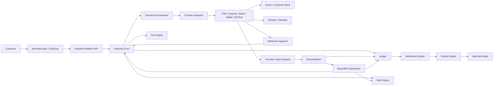

Diagram ini belum bicara teknologi.

Ini bicara ownership.

---

## 3. Komponen Utama

Reference architecture minimal:

| Komponen | Tanggung Jawab |
|---|---|
| API Edge | Auth, rate limit, idempotency ingress, request validation, response contract |
| Payment Core | Payment intent, attempt, authorization, capture, refund lifecycle |
| Orchestration Engine | Routing provider, retry policy, fallback, provider operation planning |
| Provider Adapter | Normalisasi provider request/response/webhook/status |
| Webhook Ingestion | Signature verification, dedupe, event storage, async dispatch |
| Risk Engine | Rule evaluation, velocity, risk decision, hold/release |
| Fee Engine | Fee plan, MDR, commission, tax, split fee computation |
| Ledger Service | Double-entry journal, account model, immutable posting, balance views |
| Reconciliation Service | Import report, matching, break detection, repair workflow |
| Settlement Engine | Cutoff, netting, reserve, merchant payable, settlement batch |
| Payout Engine | Beneficiary, payout instruction, bank transfer, payout status |
| Dispute Service | Chargeback, evidence, representment, liability, loss booking |
| Merchant Service | Merchant profile, capability, KYB status, limits, configuration |
| Backoffice | Case management, manual repair, approval, audit trail |
| Audit Service | Immutable operator/system event evidence |
| Reporting/Finance Data Mart | Read-optimized finance, ops, merchant reporting |
| Configuration/Policy Service | Routing rules, limits, feature flags, provider capability |

Jangan mulai dengan semua service sebagai microservice fisik.

Mulai dari boundary logical.

Deployability bisa berevolusi.

---

## 4. Logical Boundary vs Physical Deployment

Kesalahan umum:

> "Kalau production-grade berarti semua harus microservice dari hari pertama."

Tidak.

Production-grade berarti boundary jelas, invariant jelas, data ownership jelas, dan failure model jelas.

Physical deployment bisa dimulai sebagai modular monolith dengan database schema yang disiplin, lalu dipisah saat pressure organisasi/operasional membutuhkan.

Namun payment platform biasanya cepat membutuhkan isolasi untuk beberapa area:

- webhook ingestion karena traffic burst,
- provider adapter karena dependency eksternal volatile,
- ledger karena correctness dan audit,
- reconciliation karena batch workload berat,
- settlement/payout karena approval dan risk tinggi,
- backoffice karena security boundary berbeda.

Rule sederhana:

```txt
Split services when ownership, scaling, risk, deployment cadence, or failure isolation require it.
Do not split merely because diagram looks more enterprise.
```

---

## 5. Truth Hierarchy

Sistem pembayaran harus punya hierarki truth.

Kalau tidak, setiap incident berubah menjadi debat.

Contoh hierarchy:

```txt
1. Ledger journal = truth of internal financial accounting
2. Payment state = truth of lifecycle and allowed operations
3. Provider operation = evidence of external instruction/result
4. Provider/bank/scheme report = external settlement truth
5. Reconciliation result = comparison truth
6. Backoffice case = exception-handling truth
```

Ini bukan berarti ledger selalu sama dengan real bank balance.

Ledger adalah internal book.

Provider/bank report adalah external evidence.

Reconciliation menjelaskan gap.

---

## 6. Data Ownership

| Data | Owner | Tidak Boleh Diubah Langsung Oleh |
|---|---|---|
| Payment intent | Payment Core | Provider Adapter, Backoffice raw SQL |
| Payment attempt | Payment Core | Webhook Ingestion directly |
| Provider operation | Orchestration/Adapter | Ledger |
| Webhook raw event | Webhook Ingestion | Payment Core |
| Risk decision | Risk Engine | Provider Adapter |
| Fee calculation | Fee Engine | Ledger manual code |
| Ledger journal | Ledger Service | Payment Core direct table update |
| Ledger balance | Ledger Service | Settlement direct mutation |
| Reconciliation item | Reconciliation Service | Provider Adapter |
| Settlement batch | Settlement Engine | Payment Core |
| Payout instruction | Payout Engine | Settlement direct provider call |
| Dispute case | Dispute Service | Reconciliation direct mutation |
| Merchant capability | Merchant Service | Payment Core ad-hoc config |
| Manual adjustment | Backoffice + Ledger | Direct SQL |

Data ownership adalah salah satu pembeda payment platform matang dan sistem spaghetti.

---

## 7. Recommended Service Map

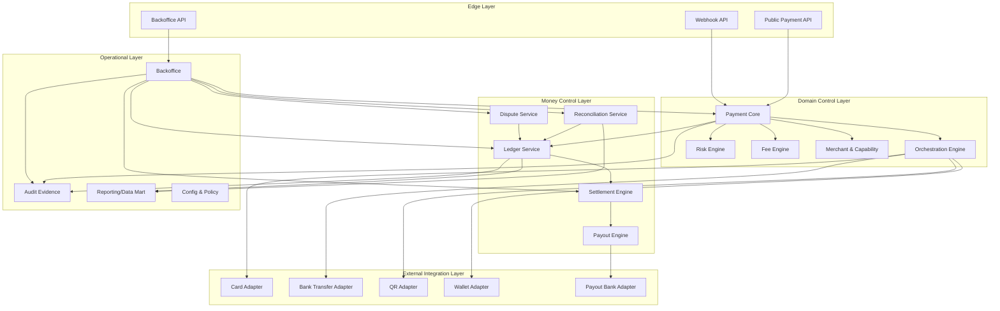

Layer ini bukan hierarchy birokrasi.

Ini failure containment.

---

## 8. API Edge

API Edge bertanggung jawab atas hal yang dekat dengan client:

- authentication,
- authorization,
- tenant resolution,
- merchant resolution,
- idempotency key validation,
- request schema validation,
- rate limit,
- API versioning,
- response envelope,
- correlation id,
- audit ingress event,
- error mapping.

API Edge tidak boleh:

- memutuskan provider routing secara langsung,
- menulis ledger,
- menjalankan reconciliation,
- melakukan manual override,
- menyimpan business status final tanpa Payment Core.

API Edge adalah pintu, bukan otak finansial.

---

## 9. Payment Core

Payment Core adalah pusat lifecycle.

Ia memiliki aggregate seperti:

```txt
PaymentIntent
PaymentAttempt
Authorization
Capture
Refund
PaymentMethodBinding
PaymentEvent
```

Payment Core menjawab:

- apakah payment boleh dikonfirmasi?
- apakah attempt baru boleh dibuat?
- apakah authorization boleh di-capture?
- apakah payment boleh di-refund?
- apakah state provider event legal untuk diterapkan?
- apakah transition membutuhkan ledger posting?
- apakah transition membutuhkan risk hold?
- apakah transition membutuhkan customer/merchant notification?

Payment Core tidak perlu tahu detail endpoint provider.

Ia memberi command ke Orchestrator:

```txt
Authorize this attempt using eligible route.
Capture this authorization.
Refund this captured payment.
```

Orchestrator memilih dan menjalankan external operation.

---

## 10. Orchestration Engine

Orchestration Engine mengubah payment command menjadi provider plan.

Input:

```txt
merchant capability
payment method
amount/currency
country/region
risk decision
provider health
routing rule
cost policy
success-rate policy
```

Output:

```txt
provider route
operation type
provider request id
retry policy
fallback policy
timeout policy
status inquiry policy
```

Contoh:

```txt
Payment method: card
Currency: IDR
Merchant: MRC-123
Risk: allow
Amount: 500000

Route:
1. Provider A card acquiring
2. fallback Provider B only if no provider_request was accepted
3. no fallback after unknown authorization
```

Orchestration bukan hanya load balancing.

Ia harus memahami financial semantics.

---

## 11. Provider Adapter

Provider Adapter melakukan translasi.

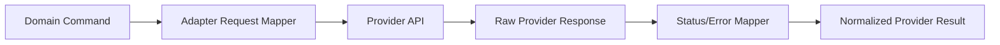

Adapter harus mengembalikan normalized result seperti:

```java
public sealed interface ProviderPaymentResult {
    record Succeeded(String providerReference, ProviderEvidence evidence) implements ProviderPaymentResult {}
    record Declined(String declineCode, ProviderEvidence evidence) implements ProviderPaymentResult {}
    record Pending(String providerReference, ProviderEvidence evidence) implements ProviderPaymentResult {}
    record Unknown(String reason, ProviderEvidence evidence) implements ProviderPaymentResult {}
    record FailedRetryable(String errorCode, ProviderEvidence evidence) implements ProviderPaymentResult {}
    record FailedFinal(String errorCode, ProviderEvidence evidence) implements ProviderPaymentResult {}
}
```

Jangan expose raw provider status ke domain core.

Domain core tidak boleh dipenuhi string seperti:

```txt
PENDING_001
CAPTURE_WAITING_ACK
00
05
R1
U9
```

Semua harus dinormalisasi.

Raw evidence tetap disimpan untuk audit/reconciliation.

---

## 12. Webhook Ingestion

Webhook Ingestion adalah boundary sendiri.

Tanggung jawab:

- menerima webhook cepat,
- validasi signature,
- simpan raw payload,
- dedupe event,
- return response ke provider,
- dispatch async untuk processing domain.

Jangan melakukan semua business processing synchronous di endpoint webhook.

Provider biasanya punya timeout pendek dan retry policy sendiri.

Webhook API sebaiknya:

```txt
receive -> authenticate/signature -> persist -> ack -> async process
```

Diagram:

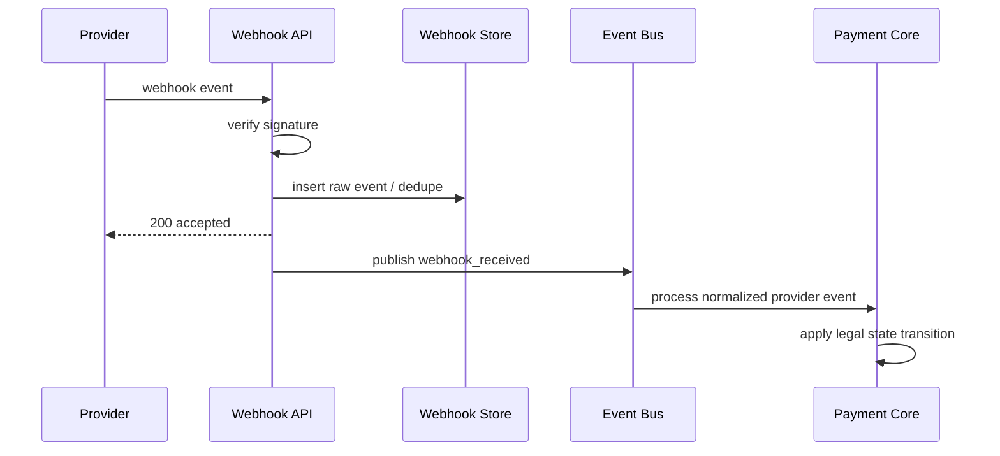

---

## 13. Ledger Service

Ledger Service harus dipisahkan secara konseptual dari Payment Core.

Payment Core boleh meminta:

```txt
post journal for capture succeeded
post journal for refund succeeded
post journal for fee recognized
post journal for chargeback loss
```

Tapi Ledger Service yang memvalidasi:

- double-entry balance,
- account existence,
- journal reference uniqueness,
- currency consistency,
- posting rule,
- period/business date,
- immutable journal.

Payment Core tidak boleh menulis langsung ke `ledger_entries`.

Ledger adalah sistem kontrol, bukan tabel helper.

---

## 14. Risk Engine

Risk Engine memberi decision, bukan sekadar score.

Decision contoh:

```txt
ALLOW
ALLOW_WITH_HOLD
REQUIRE_3DS
REVIEW
BLOCK
LIMIT_EXCEEDED
```

Risk Engine harus menyimpan evidence:

- rules evaluated,
- signals used,
- score/version,
- decision timestamp,
- operator override jika ada,
- policy version.

Payment Core memakai decision untuk menentukan transition.

Contoh:

```txt
Payment authorized + risk ALLOW_WITH_HOLD
=> captured funds masuk pending balance tapi tidak available untuk settlement sampai hold release.
```

---

## 15. Fee Engine

Fee Engine menghitung fee sebelum ledger posting.

Ia harus mendukung:

- fixed fee,
- percentage fee,
- minimum fee,
- maximum fee,
- MDR by payment method,
- provider cost,
- platform commission,
- tax/VAT jika applicable,
- split payment,
- promotion/subsidy,
- rounding policy.

Fee calculation harus versioned.

Jika fee plan berubah besok, payment kemarin tetap dapat dijelaskan dengan fee plan versi kemarin.

---

## 16. Reconciliation Service

Reconciliation Service membandingkan:

```txt
internal payment state
internal ledger
provider transaction report
bank statement
scheme settlement file
payout report
```

Ia menghasilkan:

- matched,
- missing internal,
- missing external,
- amount mismatch,
- currency mismatch,
- fee mismatch,
- duplicate external,
- duplicate internal,
- late settlement,
- reversal detected,
- chargeback detected.

Reconciliation tidak boleh hanya report Excel.

Ia harus menghasilkan actionable break yang bisa diproses backoffice.

---

## 17. Settlement Engine

Settlement Engine mengubah merchant receivable/payable menjadi payout batch.

Ia mempertimbangkan:

- settlement schedule,
- cutoff time,
- provider settlement availability,
- fee deduction,
- reserve,
- risk hold,
- dispute hold,
- minimum payout amount,
- negative balance offset,
- bank holiday,
- merchant payout configuration.

Settlement bukan sekadar:

```txt
sum successful payments today
```

Settlement adalah financial obligation calculation.

---

## 18. Payout Engine

Payout Engine mengirim instruksi uang keluar.

Ia harus punya kontrol lebih kuat daripada collection/payment-in.

Tanggung jawab:

- beneficiary management,
- bank account validation,
- payout approval,
- payout instruction idempotency,
- batch payout,
- status inquiry,
- reversal handling,
- failed payout recovery,
- ledger posting untuk payout sent/succeeded/failed.

Payout harus mempunyai maker-checker untuk high-risk operation.

---

## 19. Dispute Service

Dispute Service mengelola:

- retrieval request,
- chargeback,
- representment,
- pre-arbitration,
- arbitration,
- evidence submission,
- deadline,
- liability assignment,
- fee/loss booking.

Dispute mempengaruhi ledger dan settlement.

Chargeback bukan sekadar status customer service.

Ia adalah financial event.

---

## 20. Backoffice Operations

Backoffice harus menjadi platform operasi aman.

Minimum capability:

- search payment by multiple identifiers,
- timeline event view,
- provider evidence view,
- ledger journal view,
- reconciliation break view,
- retry webhook processing,
- trigger status inquiry,
- create manual adjustment,
- approve/reject payout,
- release risk hold,
- escalate dispute,
- attach evidence,
- maker-checker workflow,
- immutable audit trail.

Backoffice bukan admin CRUD.

Backoffice adalah exception handling system.

---

## 21. Communication Pattern

Gunakan sync untuk:

- request validation,
- create intent,
- return current status,
- short command acceptance,
- user-facing operations yang butuh immediate answer.

Gunakan async untuk:

- webhook processing,
- provider retry/status inquiry,
- ledger projection,
- reconciliation import,
- settlement batch,
- payout status polling,
- notification,
- reporting.

Tapi ingat:

```txt
Async does not remove consistency requirements.
It only changes where you enforce them.
```

---

## 22. Event Bus

Event bus membawa domain event, bukan raw database row.

Contoh event:

```json
{
  "eventId": "evt_01",
  "eventType": "payment.capture.succeeded",
  "aggregateType": "payment_attempt",
  "aggregateId": "pa_123",
  "aggregateVersion": 8,
  "occurredAt": "2026-07-02T08:30:00Z",
  "data": {
    "paymentId": "pay_123",
    "captureId": "cap_123",
    "amountMinor": 100000,
    "currency": "IDR"
  }
}
```

Rules:

1. Event id stable.
2. Event type versioned.
3. Consumer idempotent.
4. Outbox used for publishing.
5. Event does not replace source database.
6. Event should not contain sensitive card data.

---

## 23. Database Strategy

Untuk production architecture, hindari satu shared schema bebas antar service.

Pilihan bertahap:

### Phase 1 — Modular Monolith Database Discipline

```txt
same database cluster
separate schemas per module
no cross-schema writes
read via views/API where possible
```

### Phase 2 — Service-Owned Databases

```txt
Payment Core DB
Ledger DB
Webhook DB
Reconciliation DB
Settlement DB
Backoffice DB
Reporting warehouse
```

### Phase 3 — Specialized Storage

```txt
PostgreSQL for transactional truth
Object storage for settlement/reconciliation files
Search index for backoffice lookup
Warehouse/lakehouse for analytics
Redis for ephemeral cache/locks only
Kafka/Pulsar/etc for durable event streaming
```

Do not put financial truth only in cache.

---

## 24. Suggested Bounded Contexts

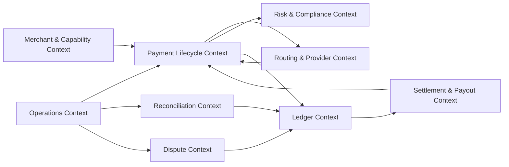

Bounded context bukan sekadar package name.

Ia menentukan bahasa, data ownership, dan allowed dependency.

---

## 25. End-to-End Flow: Card Authorization + Capture

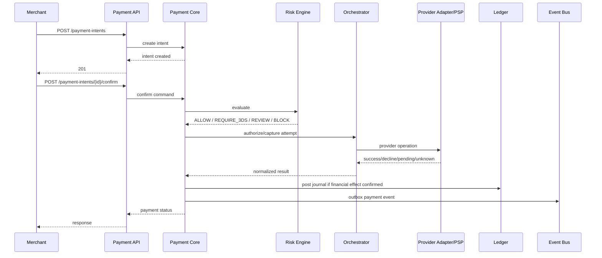

Payment Core decides transition.

Ledger validates posting.

Provider Adapter only normalizes external result.

---

## 26. End-to-End Flow: Webhook Repair

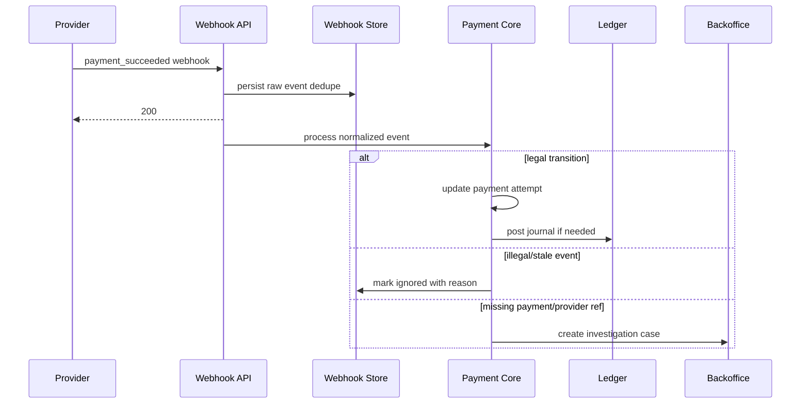

Webhook tidak boleh dipercaya membabi buta.

Ia evidence, bukan command dari Tuhan.

---

## 27. End-to-End Flow: Reconciliation to Settlement

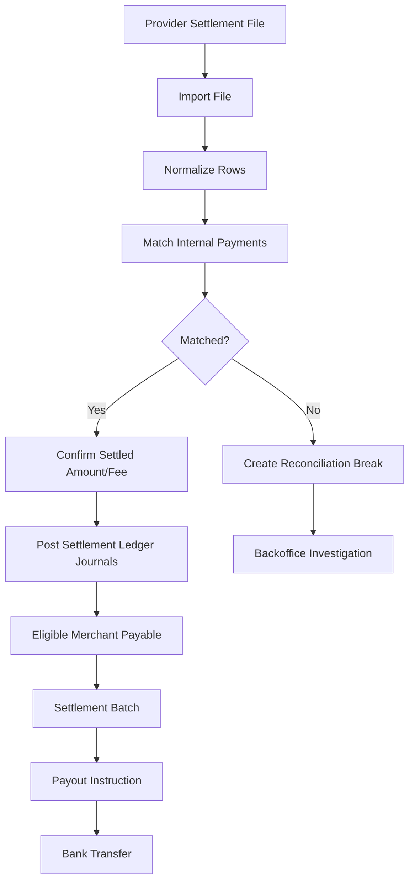

Settlement harus bergantung pada reconciliation/settlement evidence, bukan hanya payment success internal.

---

## 28. Deployment Topology Baseline

Baseline production topology:

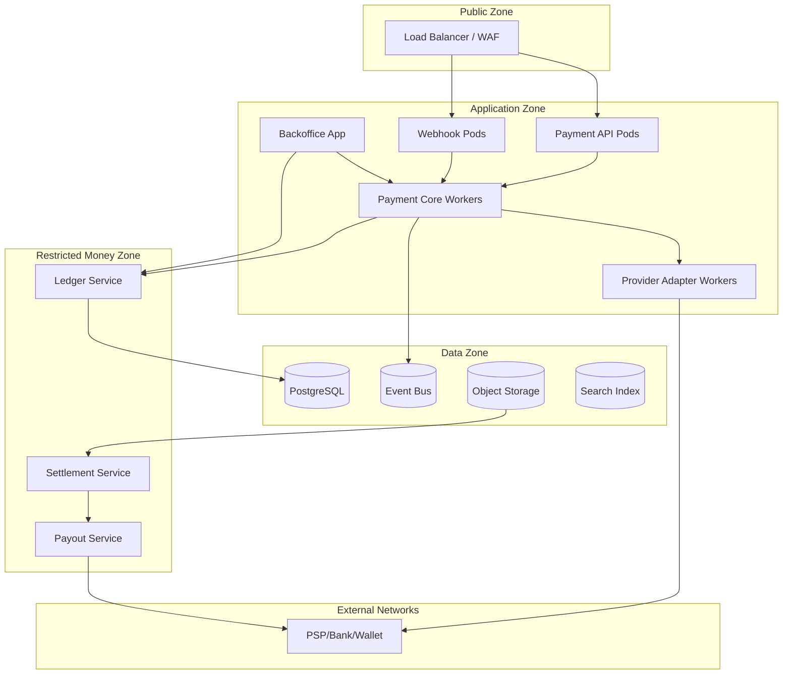

Ini konseptual.

Detail cloud/Kubernetes tidak dibahas ulang di seri ini, kecuali payment-specific constraints.

---

## 29. Security Zones

Payment platform harus memisahkan zona keamanan:

| Zone | Isi | Kontrol |
|---|---|---|
| Public Edge | API gateway, webhook endpoint | WAF, rate limit, TLS, request validation |
| App Zone | Payment core, orchestration, adapter | service auth, network policy, secrets management |
| Cardholder Data Environment | vault/tokenization jika menyentuh PAN | PCI segmentation, strict logging, access control |
| Money Control Zone | ledger, settlement, payout | least privilege, maker-checker, strong audit |
| Ops Zone | backoffice | role-based access, approval, session control |
| Data Zone | DB, object storage, event bus | encryption, backup, access logs, retention |

Kalau platform tidak menyimpan/memproses PAN, scope PCI bisa jauh lebih kecil.

Namun tetap perlu security discipline karena payment data sensitif.

---

## 30. PCI Boundary Awareness

Jika sistem menyentuh cardholder data seperti PAN, expiry, atau sensitive authentication data, PCI boundary menjadi sangat penting.

Reference architecture sebaiknya berusaha:

```txt
avoid raw PAN when possible
use hosted fields / redirect / tokenization
store tokens, not PAN
isolate vault if PAN unavoidable
prevent card data from entering logs/events/search
```

PCI DSS v4.0.1 adalah versi PCI DSS yang dipublikasikan PCI SSC pada Juni 2024 sebagai limited revision terhadap v4.0, dengan klarifikasi dan tanpa penambahan/penghapusan requirement menurut publikasi PCI SSC.

Implikasi architecture:

- jangan biarkan card data bocor ke event bus,
- jangan masukkan PAN ke idempotency key,
- jangan index raw payment method details di search,
- jangan kirim card data ke service yang tidak perlu,
- lakukan segmentation untuk komponen yang masuk scope.

---

## 31. Configuration and Policy Service

Routing, limits, fee, settlement schedule, risk rule, dan provider capability tidak boleh hardcoded.

Tapi juga tidak boleh bebas berubah tanpa governance.

Configuration harus punya:

- version,
- effective date,
- approval flow,
- audit trail,
- rollback,
- dry-run/simulation,
- blast radius preview,
- environment promotion.

Contoh configuration:

```yaml
routingPolicy:
  id: card-idr-standard-v12
  effectiveFrom: 2026-07-01T00:00:00+07:00
  merchantSegment: standard
  paymentMethod: CARD
  currency: IDR
  routes:
    - provider: ACQUIRER_A
      weight: 80
    - provider: ACQUIRER_B
      weight: 20
  fallback:
    enabled: true
    onlyBeforeProviderAcceptance: true
```

Payment system buruk sering gagal bukan karena code bug, tapi config berubah tanpa kontrol.

---

## 32. Observability Architecture

Observability harus mencakup technical dan business signals.

Technical:

- latency per endpoint,
- error rate,
- DB contention,
- event lag,
- provider timeout,
- queue depth,
- worker retry,
- saturation.

Business/payment:

- authorization success rate,
- decline rate by provider/payment method,
- unknown outcome count,
- duplicate idempotency replay count,
- reconciliation break count,
- settlement delay,
- payout failure count,
- ledger imbalance attempt,
- manual adjustment volume,
- chargeback ratio.

Diagram observability:

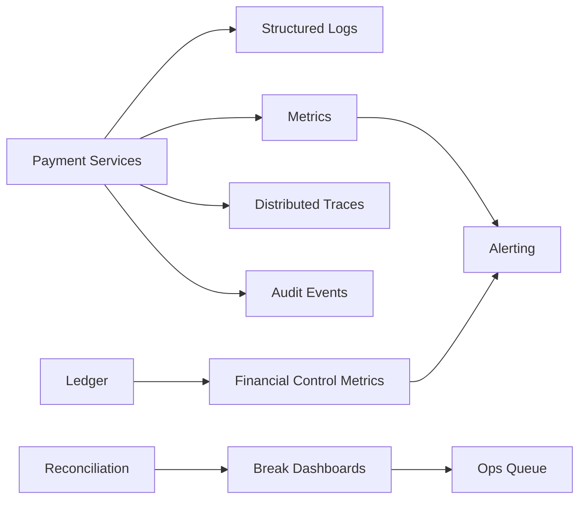

SRE alert saja tidak cukup.

Finance control alert juga wajib.

---

## 33. Failure Isolation

Setiap dependency eksternal harus dianggap tidak stabil.

Provider bisa:

- timeout,
- return 500,
- return malformed response,
- process request but fail response,
- send webhook late,
- send duplicate webhook,
- change error code semantics,
- delay settlement file,
- produce report mismatch.

Architecture harus punya:

- timeout budget,
- circuit breaker,
- retry policy,
- idempotency,
- provider health state,
- status inquiry,
- fallback only when safe,
- reconciliation repair,
- ops visibility.

Fallback tidak selalu aman.

Jika authorization outcome unknown di Provider A, jangan langsung charge Provider B.

---

## 34. Internal Package Shape for Java

Jika dimulai sebagai modular monolith, package shape bisa seperti:

```txt
com.company.payments
  api
    publicapi
    backofficeapi
    webhookapi
  core
    intent
    attempt
    authorization
    capture
    refund
    state
  orchestration
    routing
    provideroperation
    retry
    health
  adapter
    providerx
    providery
    bank
    qris
  ledger
    account
    journal
    posting
    balance
  risk
    decision
    velocity
    rules
  fees
    plan
    calculation
  reconciliation
    importfile
    matching
    breaks
  settlement
    cutoff
    batch
    reserve
  payout
    beneficiary
    instruction
    status
  dispute
    casefile
    evidence
    liability
  ops
    caseworkflow
    approval
    adjustment
  audit
    evidence
    trail
  shared
    money
    time
    ids
    errors
```

`shared` harus kecil.

Kalau semua masuk `shared`, boundary hilang.

---

## 35. Dependency Rules

Aturan dependency contoh:

```txt
api -> application service
application -> domain
application -> ports
infrastructure -> ports
adapter -> orchestration ports
ledger domain tidak bergantung pada payment core
payment core bergantung pada ledger port, bukan ledger table
backoffice memanggil command service, bukan update repository internal sembarang
```

Diagram:

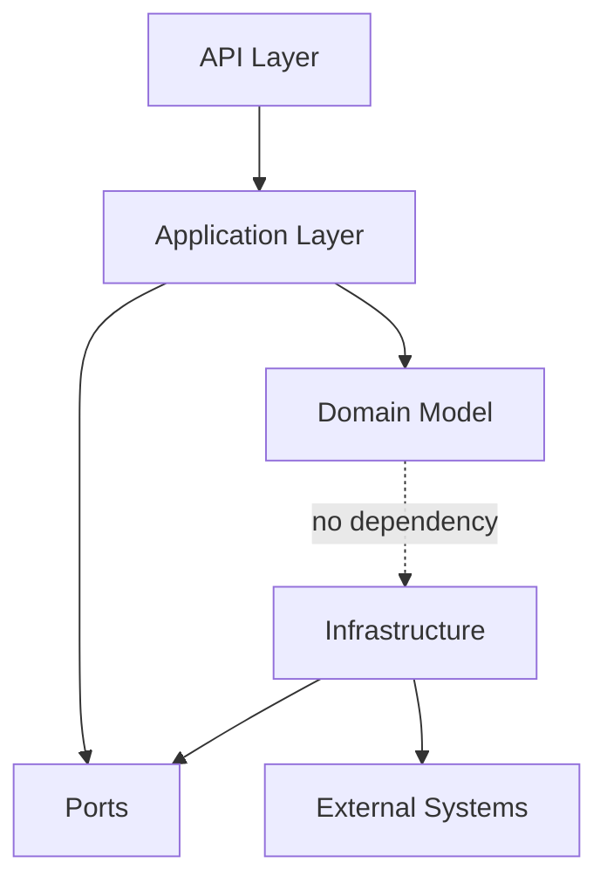

Ini bukan clean architecture sebagai dogma.

Ini untuk mencegah provider detail dan database detail merusak domain payment.

---

## 36. Command Model

Commands harus eksplisit:

```java
public record ConfirmPaymentIntentCommand(
        String tenantId,
        String merchantId,
        String paymentIntentId,
        String paymentMethodId,
        Money amount,
        IdempotencyScope idempotencyScope,
        RequestFingerprint fingerprint,
        Actor actor,
        Instant requestedAt
) {}
```

Jangan gunakan `Map<String,Object>` untuk command financial.

Command adalah audit object.

Ia harus jelas siapa melakukan apa, terhadap resource apa, dengan amount berapa, kapan, dan dengan idempotency apa.

---

## 37. Event Model

Events harus merepresentasikan fakta yang sudah terjadi.

Baik:

```txt
PaymentCaptureSucceeded
RefundCreated
LedgerJournalPosted
SettlementBatchClosed
PayoutInstructionSent
ReconciliationBreakCreated
```

Buruk:

```txt
ProcessPaymentEvent
DoRefundEvent
HandleStatusEvent
```

Event bukan command terselubung.

Event adalah evidence perubahan state.

---

## 38. Read Models

Payment platform membutuhkan read model terpisah untuk operasi.

Core transactional tables tidak ideal untuk semua search.

Read model contoh:

```txt
payment_search_index
merchant_payment_summary
ledger_balance_snapshot
reconciliation_break_queue
settlement_batch_view
payout_status_view
dispute_case_queue
```

Read model boleh eventually consistent.

Tapi layar backoffice harus menunjukkan timestamp dan source.

Jangan membuat operator mengira read model adalah ledger truth.

---

## 39. Reporting and Finance Data Mart

Finance membutuhkan data yang berbeda dari API.

Mereka perlu:

- daily payment volume,
- fee revenue,
- provider cost,
- settlement payable,
- aging receivable,
- reserve balance,
- dispute loss,
- reconciliation break aging,
- merchant statement.

Reporting data mart dibangun dari ledger, settlement, reconciliation, dan payment lifecycle events.

Jangan membangun finance report langsung dari payment status `SUCCESS`.

Itu hampir selalu salah.

---

## 40. Build Order yang Disarankan

Jangan membangun semua sekaligus.

Urutan build dari scratch:

```txt
1. Money value object + identifiers
2. Payment intent + attempt lifecycle
3. API idempotency
4. Provider simulator
5. Provider operation record
6. Webhook ingestion + dedupe
7. Ledger minimal double-entry
8. Capture/refund ledger posting
9. Reconciliation import minimal
10. Settlement calculation minimal
11. Payout instruction minimal
12. Backoffice case and audit
13. Risk/limits basic
14. Routing/fallback
15. Dispute
16. Advanced reconciliation/settlement/reporting
```

Kenapa provider simulator begitu awal?

Karena payment platform tidak bisa dites serius jika provider selalu real dan nondeterministic.

---

## 41. Minimum Viable Production Slice

MVP production-grade bukan berarti semua feature.

MVP production-grade berarti feature kecil tapi control lengkap.

Contoh slice:

```txt
Payment method: one card provider or one VA/QR provider
Currency: IDR only
Operation: payment intent -> confirm -> paid
Refund: full refund only
Ledger: capture + refund journals
Webhook: signature + dedupe
Reconciliation: provider report import basic
Backoffice: payment search + timeline + manual investigation case
Idempotency: API + provider + webhook + ledger
Observability: success rate, unknown, reconciliation break, ledger invariant
```

Lebih baik scope kecil tapi benar daripada banyak payment method tapi tidak bisa diaudit.

---

## 42. Architecture Fitness Functions

Gunakan fitness function untuk menjaga architecture tidak membusuk.

Contoh:

```txt
No payment state transition without audit event.
No ledger journal without balanced entries.
No mutating public endpoint without idempotency requirement.
No provider call without provider_operation record.
No webhook processing without raw event persistence.
No settlement payout without settlement batch id.
No manual adjustment without approval evidence.
No PAN in logs/events/search index.
```

Fitness function ini bisa menjadi automated test, static check, migration check, atau operational control.

---

## 43. Architecture Review Questions

Sebelum lanjut membangun detail service, tanyakan:

- Di mana payment lifecycle truth disimpan?
- Di mana financial truth disimpan?
- Siapa boleh mengubah payment state?
- Siapa boleh mem-posting ledger?
- Apa yang terjadi jika provider timeout setelah menerima request?
- Bagaimana webhook duplikat diproses?
- Bagaimana refund double-click dicegah?
- Bagaimana settlement amount dijelaskan ke merchant?
- Bagaimana reconciliation break dibuat dan diselesaikan?
- Bagaimana manual adjustment dikontrol?
- Bagaimana audit evidence dicari saat dispute/regulatory review?
- Apa yang terjadi jika event bus publish duplicate?
- Apa yang terjadi jika reporting terlambat 10 menit?
- Apa yang terjadi jika provider report datang terlambat 1 hari?
- Apa yang terjadi jika settlement payout gagal setelah ledger debit?

Jika architecture tidak bisa menjawab pertanyaan ini, diagramnya belum cukup.

---

## 44. Kesimpulan

Reference architecture payment system bukan tentang banyak service.

Ia tentang boundary dan truth.

Payment platform enterprise harus punya:

- Payment Core untuk lifecycle,
- Orchestration untuk provider planning,
- Adapter untuk translasi eksternal,
- Webhook Ingestion untuk event eksternal,
- Ledger untuk financial truth,
- Risk untuk decision/control,
- Fee Engine untuk economic calculation,
- Reconciliation untuk membandingkan internal vs external evidence,
- Settlement untuk merchant payable,
- Payout untuk money-out instruction,
- Dispute untuk chargeback/loss lifecycle,
- Backoffice untuk exception handling aman,
- Audit untuk defensibility,
- Observability untuk health teknis dan finansial.

Arsitektur yang baik membuat failure menjadi visible dan repairable.

Arsitektur yang buruk membuat failure tampak seperti data aneh yang harus dibetulkan langsung di database.

Target kita adalah yang pertama.

---

## Referensi

- PCI SSC — PCI DSS v4.0.1 publication note: https://blog.pcisecuritystandards.org/just-published-pci-dss-v4-0-1
- PCI SSC — Document Library: https://www.pcisecuritystandards.org/document_library/
- AWS Builders' Library — Making Retries Safe with Idempotent APIs: https://aws.amazon.com/builders-library/making-retries-safe-with-idempotent-APIs/
- Stripe API Reference — Idempotent Requests: https://docs.stripe.com/api/idempotent_requests
- PayPal REST API — Idempotency: https://developer.paypal.com/api/rest/reference/idempotency/
