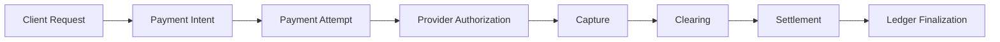
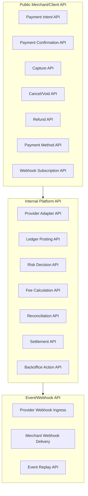
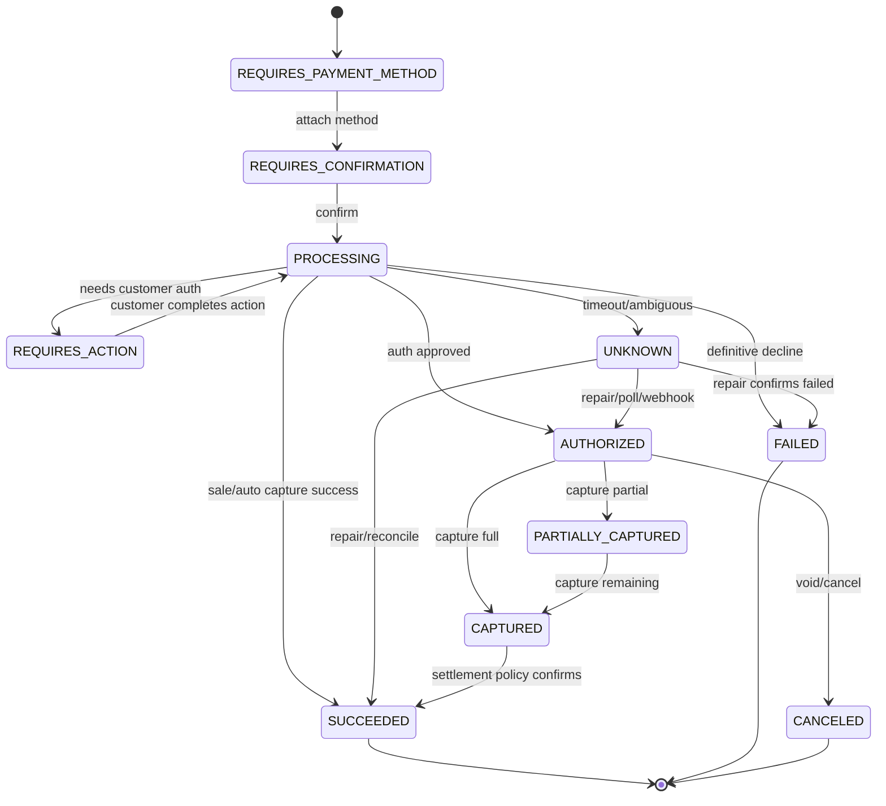
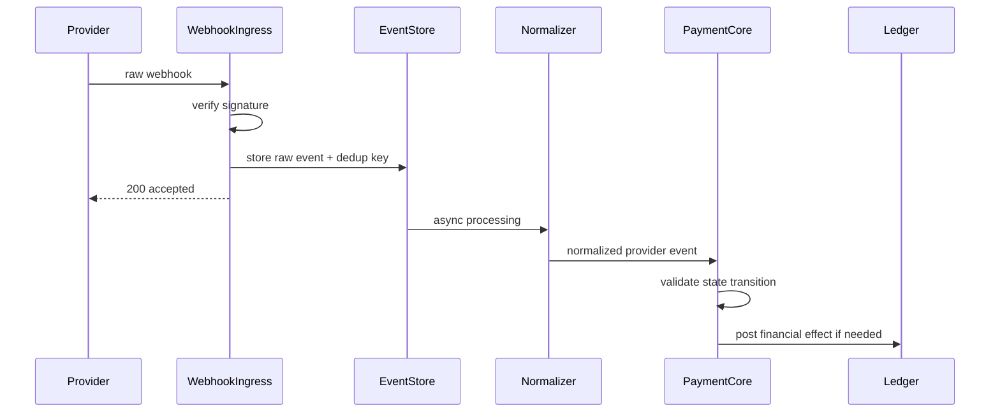
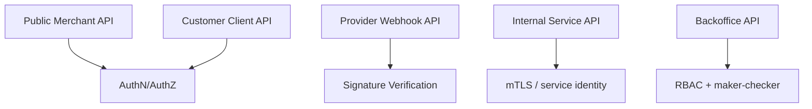

------
title: Build From Scratch: Large Production Grade Java Payment Systems - Part 011
description: Mendesain API surface payment platform enterprise: resource model, command semantics, idempotency, versioning, error contract, state exposure, webhook contract, async operation, HATEOAS-light, security boundary, dan invariant yang harus dijaga agar API tidak menciptakan double charge atau financial ambiguity.
series: learn-java-payment-systems
seriesTitle: Build From Scratch: Large Production Grade Java Payment Systems
order: 11
partTitle: API Surface Design
tags:
- java
- payments
- api-design
- payment-intent
- idempotency
- openapi
- enterprise-architecture
date: 2026-07-02
---

# Part 011 — API Surface Design

API payment bukan sekadar kumpulan endpoint.

API payment adalah **kontrak risiko** antara client, merchant, payment platform, provider, finance, risk, operations, dan regulator.

Di aplikasi biasa, API yang buruk mungkin menghasilkan duplikasi data, UI error, atau request gagal.

Di payment system, API yang buruk bisa menghasilkan:

- customer tertagih dua kali,
- merchant menerima settlement yang salah,
- refund melebihi captured amount,
- reconciliation tidak bisa menjelaskan asal transaksi,
- customer support tidak tahu status pembayaran,
- finance tidak bisa menutup pembukuan,
- fraud/risk tidak punya titik intervensi,
- audit trail tidak defensible.

Karena itu API surface payment harus didesain seperti **financial control plane**, bukan seperti CRUD API.

Part ini membahas bagaimana mendesain API surface untuk large production-grade Java payment platform.

Kita belum menulis implementasi penuh.

Kita sedang menentukan bentuk kontrak yang nanti akan menjadi dasar:

- OpenAPI schema,
- service boundary,
- idempotency behavior,
- state machine enforcement,
- ledger posting,
- webhook processing,
- reconciliation,
- backoffice operations.

---

## 1. Mental Model: API Payment Mengontrol Intent, Bukan Langsung Menggerakkan Uang

Kesalahan umum engineer ketika pertama kali membuat payment API adalah membuat endpoint seperti ini:

```http
POST /pay
POST /refund
POST /transfer
```

Secara tampilan sederhana.

Secara operasional berbahaya.

Kenapa?

Karena nama endpoint seperti `/pay` menyiratkan bahwa uang langsung berpindah saat request diterima.

Padahal dalam payment system, request API hanya memulai atau mengubah **business intent**.

Uang aktual bisa melalui beberapa tahap:



API yang benar harus memisahkan:

| Layer | Pertanyaan | Contoh |
|---|---|---|
| Intent | Apa yang merchant/customer ingin lakukan? | ingin membayar invoice 100000 IDR |
| Attempt | Dengan metode/provider apa dicoba? | kartu Visa via acquirer A |
| Provider Interaction | Apa hasil eksternal? | authorized, declined, timeout |
| Financial Effect | Apa dampak ke ledger? | hold, capture, refund, fee |
| Settlement | Apakah uang benar-benar diterima/dibayarkan? | settled batch 2026-07-02 |

API surface yang baik membuat perbedaan ini eksplisit.

---

## 2. API Surface Minimum untuk Payment Platform Enterprise

Payment platform enterprise biasanya membutuhkan API surface seperti ini:



Dalam seri ini, kita akan mulai dari API publik yang paling penting:

- create payment intent,
- retrieve payment intent,
- confirm payment intent,
- capture authorization,
- cancel/void authorization,
- create refund,
- retrieve refund,
- list payment events,
- receive provider webhook,
- deliver merchant webhook.

API internal akan dibahas bertahap di part orchestration, ledger, risk, reconciliation, settlement, dan backoffice.

---

## 3. Resource Utama: Payment Intent

`PaymentIntent` adalah resource yang merepresentasikan **keinginan bisnis untuk menerima pembayaran**.

Ia bukan attempt.

Ia bukan authorization.

Ia bukan capture.

Ia adalah aggregate yang menjawab:

> “Untuk order/invoice ini, apakah kewajiban pembayaran customer sudah terpenuhi?”

Contoh create payment intent:

```http
POST /v1/payment-intents
Idempotency-Key: pi_create_order_20260702_0001
Content-Type: application/json
```

```json
{
  "merchantId": "mrc_01JZ8X1A2B3C4D5E6F7G8H9J0K",
  "referenceType": "ORDER",
  "referenceId": "ord_20260702_0001",
  "amount": {
    "currency": "IDR",
    "valueMinor": 15000000
  },
  "captureMethod": "AUTOMATIC",
  "allowedPaymentMethods": ["CARD", "BANK_TRANSFER", "QRIS"],
  "expiresAt": "2026-07-02T15:00:00+07:00",
  "metadata": {
    "cartId": "cart_abc123"
  }
}
```

Response:

```json
{
  "id": "pi_01JZ8X9FG2Z9V6VX4M1K8XJ5R2",
  "status": "REQUIRES_PAYMENT_METHOD",
  "amount": {
    "currency": "IDR",
    "valueMinor": 15000000
  },
  "amountCapturable": {
    "currency": "IDR",
    "valueMinor": 0
  },
  "amountReceived": {
    "currency": "IDR",
    "valueMinor": 0
  },
  "captureMethod": "AUTOMATIC",
  "createdAt": "2026-07-02T08:00:01.123+07:00",
  "expiresAt": "2026-07-02T15:00:00+07:00",
  "links": {
    "self": "/v1/payment-intents/pi_01JZ8X9FG2Z9V6VX4M1K8XJ5R2",
    "confirm": "/v1/payment-intents/pi_01JZ8X9FG2Z9V6VX4M1K8XJ5R2/confirm"
  }
}
```

Perhatikan hal penting:

- amount menggunakan minor unit,
- status awal tidak mengatakan `PAID`,
- capture/cancel/refund bukan field yang bisa diubah sembarangan,
- link action bergantung status,
- idempotency diperlukan saat create.

---

## 4. Kenapa Bukan `POST /payments` Saja?

Bisa saja memakai `/payments`.

Tapi `payment` sering ambigu.

Dalam domain payment, kata payment bisa berarti:

- niat membayar,
- percobaan pembayaran,
- transaksi kartu,
- settlement item,
- ledger movement,
- customer-visible payment,
- provider transaction,
- bank transfer instruction.

Untuk enterprise-grade system, ambiguity seperti ini mahal.

Kita butuh naming yang memisahkan lifecycle.

| Nama | Makna yang lebih presisi |
|---|---|
| `PaymentIntent` | kewajiban pembayaran bisnis |
| `PaymentAttempt` | satu percobaan menggunakan method/provider tertentu |
| `Authorization` | approval hold dari card issuer/acquirer |
| `Capture` | perintah mengambil dana authorized |
| `Refund` | pengembalian dana ke customer |
| `Payout` | pengiriman dana ke merchant/beneficiary |
| `Settlement` | finalisasi net movement setelah clearing/report |
| `LedgerJournal` | kebenaran internal finansial |

Jika nama domain salah, API akan memaksa implementasi salah.

---

## 5. Payment Intent Status

Status intent harus merepresentasikan lifecycle bisnis, bukan status provider mentah.

Contoh status:

```text
REQUIRES_PAYMENT_METHOD
REQUIRES_CONFIRMATION
REQUIRES_ACTION
PROCESSING
AUTHORIZED
PARTIALLY_CAPTURED
CAPTURED
SUCCEEDED
CANCELED
FAILED
EXPIRED
UNKNOWN
```

Namun jangan asal banyak status.

Status harus menjawab pertanyaan operasional.

| Status | Arti | Financial effect |
|---|---|---|
| `REQUIRES_PAYMENT_METHOD` | belum ada method valid | none |
| `REQUIRES_CONFIRMATION` | method ada, belum dikirim ke provider | none |
| `REQUIRES_ACTION` | perlu 3DS/OTP/redirect/customer action | none atau auth pending |
| `PROCESSING` | provider/bank sedang memproses | reservation/none tergantung rail |
| `AUTHORIZED` | dana di-hold, belum captured | pending receivable/hold |
| `PARTIALLY_CAPTURED` | sebagian auth sudah captured | partial receivable |
| `CAPTURED` | capture berhasil, settlement belum final | receivable dari provider/acquirer |
| `SUCCEEDED` | pembayaran bisnis terpenuhi | settled/recognized sesuai policy |
| `CANCELED` | intent dibatalkan sebelum final | release hold jika ada |
| `FAILED` | tidak bisa diproses lagi | none atau reversal needed |
| `EXPIRED` | melewati expiry | release hold/reservation |
| `UNKNOWN` | outcome tidak pasti | must repair/reconcile |

Status `UNKNOWN` harus eksplisit.

Dalam payment, timeout tidak boleh otomatis dianggap gagal.

---

## 6. Legal Action Berdasarkan Status

API harus membatasi action berdasarkan status.

Tidak semua endpoint boleh dipanggil kapan saja.



API action matrix:

| Action | Allowed statuses | Not allowed when |
|---|---|---|
| attach payment method | `REQUIRES_PAYMENT_METHOD`, `REQUIRES_CONFIRMATION` | succeeded, canceled, failed |
| confirm | `REQUIRES_CONFIRMATION`, sometimes `REQUIRES_ACTION` | already processing unless idempotent replay |
| capture | `AUTHORIZED`, `PARTIALLY_CAPTURED` | not authorized, canceled, failed |
| cancel/void | `AUTHORIZED`, some `PROCESSING` rails | captured, settled, succeeded |
| refund | `CAPTURED`, `SUCCEEDED`, sometimes partially captured | uncaptured, voided, failed |
| retry attempt | failed attempt but open intent | terminal intent |
| manual repair | `UNKNOWN`, reconciliation break | normal happy path |

If an action is not legal, return a domain error, not generic 500.

---

## 7. Confirm API

`confirm` adalah action yang mengirim intent ke payment rail/provider.

```http
POST /v1/payment-intents/{paymentIntentId}/confirm
Idempotency-Key: pi_confirm_order_20260702_0001
Content-Type: application/json
```

```json
{
  "paymentMethod": {
    "type": "CARD",
    "token": "tok_card_01JZ8YCDEF",
    "billingDetails": {
      "email": "customer@example.com"
    }
  },
  "returnUrl": "https://merchant.example.com/payment/return",
  "clientContext": {
    "ipAddress": "203.0.113.10",
    "userAgent": "Mozilla/5.0",
    "deviceId": "dev_abc"
  }
}
```

Possible response:

```json
{
  "id": "pi_01JZ8X9FG2Z9V6VX4M1K8XJ5R2",
  "status": "REQUIRES_ACTION",
  "nextAction": {
    "type": "REDIRECT",
    "redirectUrl": "https://acs.example.com/3ds/challenge/abc"
  },
  "latestAttempt": {
    "id": "pa_01JZ8YXYZ",
    "status": "REQUIRES_ACTION",
    "provider": "acquirer_a",
    "providerReference": "auth_123"
  }
}
```

Atau:

```json
{
  "id": "pi_01JZ8X9FG2Z9V6VX4M1K8XJ5R2",
  "status": "SUCCEEDED",
  "amountReceived": {
    "currency": "IDR",
    "valueMinor": 15000000
  },
  "latestAttempt": {
    "id": "pa_01JZ8YXYZ",
    "status": "CAPTURED"
  }
}
```

Atau timeout:

```json
{
  "id": "pi_01JZ8X9FG2Z9V6VX4M1K8XJ5R2",
  "status": "UNKNOWN",
  "latestAttempt": {
    "id": "pa_01JZ8YXYZ",
    "status": "UNKNOWN"
  },
  "resolution": {
    "strategy": "POLL_AND_RECONCILE",
    "nextCheckAfter": "2026-07-02T08:01:00+07:00"
  }
}
```

Jangan return 504 lalu meninggalkan client tanpa resource status.

Jika provider call ambiguous, resource harus mencatat unknown state.

---

## 8. Capture API

Capture hanya valid untuk authorization yang belum captured.

```http
POST /v1/payment-intents/{paymentIntentId}/capture
Idempotency-Key: pi_capture_order_20260702_0001
Content-Type: application/json
```

```json
{
  "amountToCapture": {
    "currency": "IDR",
    "valueMinor": 10000000
  },
  "finalCapture": false,
  "captureReference": "shipment_001"
}
```

Response:

```json
{
  "id": "pi_01JZ8X9FG2Z9V6VX4M1K8XJ5R2",
  "status": "PARTIALLY_CAPTURED",
  "amountCapturable": {
    "currency": "IDR",
    "valueMinor": 5000000
  },
  "captures": [
    {
      "id": "cap_01JZ8Z111",
      "amount": {
        "currency": "IDR",
        "valueMinor": 10000000
      },
      "status": "SUCCEEDED"
    }
  ]
}
```

Capture invariant:

```text
sum(successful_captures) <= authorized_amount
```

Jika `finalCapture=true`, sisa authorized amount harus dilepas atau tidak boleh dicapture lagi, tergantung payment rail/provider.

---

## 9. Cancel/Void API

Cancel/void membatalkan intent atau authorization sebelum capture final.

```http
POST /v1/payment-intents/{paymentIntentId}/cancel
Idempotency-Key: pi_cancel_order_20260702_0001
Content-Type: application/json
```

```json
{
  "reason": "CUSTOMER_REQUESTED",
  "comment": "Customer changed payment method before capture"
}
```

Response:

```json
{
  "id": "pi_01JZ8X9FG2Z9V6VX4M1K8XJ5R2",
  "status": "CANCELED",
  "canceledAt": "2026-07-02T08:10:00+07:00",
  "cancellationReason": "CUSTOMER_REQUESTED"
}
```

Jangan mencampur `cancel`, `void`, dan `refund`.

| Operation | Digunakan ketika | Money effect |
|---|---|---|
| cancel | intent belum authorized/captured | no charge |
| void | authorization ada, capture belum settled | release authorization |
| refund | capture/sale sudah terjadi | money returned |
| reversal | provider/bank membalik transaksi tertentu | depends on rail |

API boleh memakai nama `cancel`, tetapi internal domain tetap harus tahu apakah efeknya cancel, void, atau reversal.

---

## 10. Refund API

Refund bukan sekadar negative payment.

Refund punya lifecycle sendiri.

```http
POST /v1/refunds
Idempotency-Key: refund_order_20260702_0001
Content-Type: application/json
```

```json
{
  "paymentIntentId": "pi_01JZ8X9FG2Z9V6VX4M1K8XJ5R2",
  "amount": {
    "currency": "IDR",
    "valueMinor": 5000000
  },
  "reason": "REQUESTED_BY_CUSTOMER",
  "referenceId": "return_001",
  "metadata": {
    "rma": "RMA-2026-0001"
  }
}
```

Response:

```json
{
  "id": "rf_01JZ90123",
  "paymentIntentId": "pi_01JZ8X9FG2Z9V6VX4M1K8XJ5R2",
  "status": "PROCESSING",
  "amount": {
    "currency": "IDR",
    "valueMinor": 5000000
  },
  "createdAt": "2026-07-02T08:20:00+07:00"
}
```

Refund invariant:

```text
sum(successful_refunds) + sum(processing_refund_reservations) <= refundable_amount
```

Refund should reserve refundable balance before provider call.

Otherwise two concurrent refund requests can both pass validation and over-refund.

---

## 11. Payment Attempt Resource

Payment attempt merepresentasikan satu percobaan teknis.

Satu intent bisa punya banyak attempt.

Contoh:

- attempt pertama card gagal karena insufficient funds,
- attempt kedua QRIS expired,
- attempt ketiga virtual account berhasil.

Endpoint:

```http
GET /v1/payment-intents/{paymentIntentId}/attempts
```

Response:

```json
{
  "data": [
    {
      "id": "pa_01JZ8Y001",
      "paymentMethodType": "CARD",
      "provider": "acquirer_a",
      "status": "FAILED",
      "failureCode": "INSUFFICIENT_FUNDS",
      "createdAt": "2026-07-02T08:00:10+07:00"
    },
    {
      "id": "pa_01JZ8Y999",
      "paymentMethodType": "QRIS",
      "provider": "qris_switch_a",
      "status": "SUCCEEDED",
      "createdAt": "2026-07-02T08:03:44+07:00"
    }
  ]
}
```

Payment attempt perlu diekspos untuk debugging dan customer support, tapi hati-hati dengan data sensitif.

Jangan tampilkan:

- PAN,
- CVV,
- raw provider credential,
- full bank account number,
- internal risk score detail,
- raw sanction match data.

---

## 12. Payment Method API

Payment method bisa ephemeral atau reusable.

| Jenis | Contoh | Penyimpanan |
|---|---|---|
| Ephemeral | one-time QR, VA number, redirect session | biasanya hanya untuk intent tertentu |
| Reusable token | card token, wallet mandate | token/vault, consent, lifecycle |
| External instruction | bank transfer destination | instruction + expiry |

Contoh attach tokenized card:

```http
POST /v1/payment-intents/{paymentIntentId}/payment-methods
Idempotency-Key: attach_pm_order_20260702_0001
```

```json
{
  "type": "CARD",
  "token": "tok_card_01JZ8YABC",
  "saveForFutureUse": false
}
```

Untuk production system, payment method API harus mempertimbangkan PCI boundary.

Jika sistem tidak ingin masuk scope card data environment yang berat, API tidak boleh menerima PAN/CVV secara langsung.

Ia harus menerima token dari hosted fields, hosted checkout, network token, atau vault yang memenuhi kontrol keamanan.

---

## 13. API untuk Instruction-Based Payment

Tidak semua payment method langsung menghasilkan authorization.

Bank transfer, virtual account, dan QR sering menghasilkan **instruction**.

Contoh confirm VA:

```json
{
  "id": "pi_01JZ8X9FG2Z9V6VX4M1K8XJ5R2",
  "status": "PROCESSING",
  "nextAction": {
    "type": "DISPLAY_BANK_TRANSFER_INSTRUCTION",
    "bankTransfer": {
      "bankCode": "BCA",
      "virtualAccountNumber": "1234567890123456",
      "amount": {
        "currency": "IDR",
        "valueMinor": 15000000
      },
      "expiresAt": "2026-07-02T15:00:00+07:00"
    }
  }
}
```

Contoh QR:

```json
{
  "id": "pi_01JZ8X9FG2Z9V6VX4M1K8XJ5R2",
  "status": "REQUIRES_ACTION",
  "nextAction": {
    "type": "DISPLAY_QR_CODE",
    "qr": {
      "format": "EMVCO",
      "payload": "000201010212...",
      "imageUrl": "https://pay.example.com/qris/pi_.../qr.png",
      "expiresAt": "2026-07-02T08:15:00+07:00"
    }
  }
}
```

Instruction API harus punya expiry jelas.

Jika tidak, sistem akan memiliki “ghost payment” yang tidak jelas apakah masih bisa dibayar atau tidak.

---

## 14. `nextAction` sebagai Interface untuk Flow Berbeda

Payment rail berbeda punya user journey berbeda.

Daripada membuat endpoint berbeda untuk setiap flow, API bisa memakai `nextAction`.

```json
{
  "nextAction": {
    "type": "REDIRECT",
    "redirectUrl": "https://..."
  }
}
```

```json
{
  "nextAction": {
    "type": "DISPLAY_QR_CODE",
    "qr": {
      "payload": "000201..."
    }
  }
}
```

```json
{
  "nextAction": {
    "type": "DISPLAY_BANK_TRANSFER_INSTRUCTION",
    "bankTransfer": {
      "virtualAccountNumber": "..."
    }
  }
}
```

```json
{
  "nextAction": {
    "type": "NONE"
  }
}
```

Ini membuat API surface stabil, walaupun payment methods bertambah.

Namun jangan jadikan `nextAction` tempat membuang segala macam field tanpa schema.

Setiap action type harus punya schema spesifik.

---

## 15. Idempotency Contract di API Surface

Idempotency harus menjadi bagian eksplisit dari API contract.

Header:

```http
Idempotency-Key: refund_order_20260702_0001
```

Tapi header saja tidak cukup.

Kontrak harus menjawab:

| Pertanyaan | Keputusan desain |
|---|---|
| Apakah key required? | Required untuk command yang punya financial effect |
| Scope key apa? | merchant + endpoint + key |
| Berapa TTL? | tergantung operation; payment/refund biasanya panjang |
| Request beda dengan key sama? | reject dengan idempotency conflict |
| Response pertama gagal 500? | simpan hanya jika side effect sudah dimulai atau kebijakan eksplisit |
| Concurrent same key? | satu menang, lainnya wait/replay/409 |

Contoh error conflict:

```json
{
  "error": {
    "type": "IDEMPOTENCY_ERROR",
    "code": "IDEMPOTENCY_KEY_REUSED_WITH_DIFFERENT_REQUEST",
    "message": "The same idempotency key was used with a different request fingerprint.",
    "requestId": "req_01JZ9ABCDE"
  }
}
```

Rule praktis:

```text
Every externally-triggered command that can create or change a financial effect must require idempotency.
```

Termasuk:

- create payment intent,
- confirm payment intent,
- capture,
- cancel/void,
- refund,
- payout,
- backoffice adjustment,
- settlement approval,
- manual repair action.

---

## 16. API Error Contract

Payment API tidak boleh mengembalikan error asal-asalan.

Error harus membantu client dan operations mengambil tindakan yang benar.

Contoh base structure:

```json
{
  "error": {
    "type": "INVALID_REQUEST",
    "code": "AMOUNT_CURRENCY_MISMATCH",
    "message": "Refund currency must match the original payment currency.",
    "field": "amount.currency",
    "requestId": "req_01JZ9ABCDE",
    "paymentIntentId": "pi_01JZ8X9FG2Z9V6VX4M1K8XJ5R2"
  }
}
```

Error taxonomy:

| Type | HTTP | Meaning | Retry? |
|---|---:|---|---|
| `INVALID_REQUEST` | 400 | request salah secara syntactic/semantic | no |
| `AUTHENTICATION_ERROR` | 401 | API key/token invalid | no until fixed |
| `AUTHORIZATION_ERROR` | 403 | merchant tidak punya permission/capability | no until enabled |
| `RESOURCE_NOT_FOUND` | 404 | resource tidak ditemukan atau tidak accessible | no |
| `IDEMPOTENCY_ERROR` | 409 | key conflict/concurrent command | depends |
| `STATE_CONFLICT` | 409 | action tidak legal untuk status saat ini | no or refresh |
| `RATE_LIMIT_ERROR` | 429 | terlalu banyak request | yes after delay |
| `PROVIDER_UNAVAILABLE` | 503 | dependency external bermasalah | yes if safe |
| `UNKNOWN_OUTCOME` | 202/409/500 depending contract | outcome belum pasti | poll/retrieve |

Payment-specific error code:

```text
CARD_DECLINED
INSUFFICIENT_FUNDS
AUTHENTICATION_REQUIRED
AUTHORIZATION_EXPIRED
AMOUNT_EXCEEDS_AUTHORIZED
AMOUNT_EXCEEDS_REFUNDABLE
PAYMENT_INTENT_EXPIRED
PAYMENT_METHOD_NOT_ALLOWED
PROVIDER_TIMEOUT_UNKNOWN_OUTCOME
DUPLICATE_PROVIDER_EVENT
SETTLEMENT_NOT_READY
MERCHANT_CAPABILITY_DISABLED
RISK_REJECTED
COMPLIANCE_HOLD
```

Jangan mengekspos raw provider code sebagai contract utama.

Provider code boleh ada sebagai diagnostic field internal atau normalized detail.

---

## 17. HTTP Status Code: Jangan Salah Makna

HTTP code bukan payment status.

Contoh:

| HTTP | Payment status | Meaning |
|---:|---|---|
| 200 | `SUCCEEDED` | request valid dan payment selesai |
| 200 | `REQUIRES_ACTION` | request valid, customer perlu lanjut |
| 200 | `FAILED` | request valid, provider decline definitif |
| 202 | `PROCESSING` | request diterima, outcome async |
| 400 | unchanged | request invalid |
| 409 | unchanged | illegal transition/idempotency conflict |
| 500 | unknown maybe | internal error; jangan sembunyikan side effect |
| 503 | unknown maybe | dependency unavailable |

Jangan berpikir:

```text
HTTP 200 = paid
HTTP 500 = not paid
```

Itu asumsi berbahaya.

HTTP hanya menjelaskan hasil komunikasi API, bukan finalitas uang.

---

## 18. Retrieve API Harus Menjadi Source untuk Client Recovery

Client harus bisa recover dari timeout dengan retrieve.

```http
GET /v1/payment-intents/{paymentIntentId}
```

Response harus cukup informatif:

```json
{
  "id": "pi_01JZ8X9FG2Z9V6VX4M1K8XJ5R2",
  "status": "PROCESSING",
  "amount": {
    "currency": "IDR",
    "valueMinor": 15000000
  },
  "latestAttempt": {
    "id": "pa_01JZ8YXYZ",
    "status": "PROCESSING",
    "paymentMethodType": "BANK_TRANSFER"
  },
  "nextAction": {
    "type": "DISPLAY_BANK_TRANSFER_INSTRUCTION",
    "bankTransfer": {
      "bankCode": "BCA",
      "virtualAccountNumber": "1234567890123456",
      "expiresAt": "2026-07-02T15:00:00+07:00"
    }
  },
  "createdAt": "2026-07-02T08:00:01.123+07:00",
  "updatedAt": "2026-07-02T08:00:02.456+07:00"
}
```

Retrieve API harus stabil, cache-aware, dan aman untuk polling.

Tetapi jangan mendorong client polling brutal.

Berikan hints:

```json
{
  "polling": {
    "recommendedAfterSeconds": 5,
    "maxRecommendedFrequencySeconds": 3
  }
}
```

---

## 19. Event API dan Merchant Webhook

Payment API tidak lengkap tanpa event delivery.

Merchant perlu tahu ketika payment berubah karena:

- webhook provider datang setelah client redirect,
- bank transfer dibayar beberapa menit kemudian,
- settlement selesai di batch malam,
- refund sukses async,
- dispute dibuat oleh issuer/customer,
- payout gagal.

Contoh event:

```json
{
  "id": "evt_01JZ9EVENT",
  "type": "payment_intent.succeeded",
  "createdAt": "2026-07-02T08:05:10+07:00",
  "data": {
    "object": {
      "id": "pi_01JZ8X9FG2Z9V6VX4M1K8XJ5R2",
      "status": "SUCCEEDED",
      "amountReceived": {
        "currency": "IDR",
        "valueMinor": 15000000
      }
    }
  }
}
```

Webhook delivery headers:

```http
Payment-Event-Id: evt_01JZ9EVENT
Payment-Signature: t=1782960310,v1=...
Payment-Delivery-Attempt: 1
```

Webhook contract:

| Requirement | Reason |
|---|---|
| signed payload | mencegah spoofing |
| event id unique | deduplication |
| event type versioned | compatibility |
| retry with backoff | merchant endpoint bisa down |
| event replay API | recovery |
| ordering not guaranteed globally | distributed reality |
| resource retrieval recommended | event payload bisa stale/partial |

Webhook bukan source of truth untuk merchant.

Webhook adalah notification.

Merchant sebaiknya retrieve resource setelah menerima event penting.

---

## 20. Provider Webhook Ingress API

Provider webhook berbeda dari merchant webhook.

Provider webhook masuk ke platform kita.

Endpoint biasanya:

```http
POST /internal/provider-webhooks/{providerCode}
```

Atau public but protected:

```http
POST /v1/provider-webhooks/acquirer-a
```

Design requirement:

- verifikasi signature,
- simpan raw payload secara aman,
- deduplicate provider event,
- normalize ke internal event,
- jangan langsung percaya urutan,
- jangan langsung finalize tanpa state validation,
- jangan expose endpoint terlalu luas,
- buat replay path yang diaudit.

Flow:



Important:

Return 200/202 ke provider setelah event diterima dan disimpan, bukan setelah semua downstream berhasil.

Kalau tidak, provider akan retry agresif dan menciptakan duplikasi.

---

## 21. Pagination, Filtering, and Search

Payment API perlu list/search untuk merchant, backoffice, dan support.

Contoh:

```http
GET /v1/payment-intents?merchantId=mrc_...&createdFrom=2026-07-01T00:00:00+07:00&createdTo=2026-07-02T00:00:00+07:00&status=SUCCEEDED&limit=50
```

Response:

```json
{
  "data": [
    {
      "id": "pi_...",
      "status": "SUCCEEDED",
      "amount": {
        "currency": "IDR",
        "valueMinor": 15000000
      },
      "createdAt": "2026-07-02T08:00:00+07:00"
    }
  ],
  "page": {
    "nextCursor": "cur_abc",
    "hasMore": true
  }
}
```

Gunakan cursor pagination, bukan offset untuk data besar.

Payment table akan besar, mutable pada beberapa kolom status, dan sering difilter berdasarkan waktu/merchant/status.

Offset pagination mahal dan bisa menghasilkan missing/duplicate item ketika data berubah.

---

## 22. Versioning

Payment API harus dirancang untuk kompatibilitas jangka panjang.

Ada beberapa level versioning:

| Level | Contoh | Digunakan untuk |
|---|---|---|
| URL version | `/v1/payment-intents` | major API surface |
| media type version | `application/vnd.company.payment.v1+json` | advanced compatibility |
| event version | `payment_intent.succeeded.v1` | webhook evolution |
| schema version | `schemaVersion: "2026-07-01"` | payload evolution |
| provider adapter version | `acquirer_a:v3` | internal integration |

Prinsip compatibility:

- menambah optional field biasanya aman,
- menghapus field breaking,
- mengubah enum bisa breaking untuk client strict,
- mengubah makna status sangat breaking,
- mengubah idempotency semantics sangat breaking,
- mengubah rounding/amount representation catastrophic.

Untuk enum, sediakan strategi unknown enum.

Client yang kuat harus bisa menangani value baru.

---

## 23. Security Boundary di API Surface

Payment API harus memisahkan audience.



Audience berbeda punya kontrol berbeda.

| Audience | Auth model | Risk |
|---|---|---|
| Merchant server | API key/OAuth/mTLS | unauthorized charge/refund |
| Customer browser/mobile | ephemeral client secret/session | tampering, replay |
| Provider webhook | signature/IP allowlist/mTLS if available | spoofed event |
| Internal service | workload identity/mTLS | lateral movement |
| Backoffice operator | SSO/RBAC/MFA/maker-checker | manual financial damage |

Jangan menggunakan merchant secret di browser.

Untuk customer-side confirmation, gunakan client secret terbatas:

```json
{
  "clientSecret": "pi_..._secret_...",
  "expiresAt": "2026-07-02T09:00:00+07:00",
  "allowedActions": ["CONFIRM", "COMPLETE_ACTION"]
}
```

Client secret tidak boleh bisa refund, capture, payout, atau membaca data merchant lain.

---

## 24. Amount Mutability Rules

API harus menentukan kapan amount boleh berubah.

| Stage | Amount mutable? | Reason |
|---|---|---|
| intent draft | yes, with idempotent update | order masih berubah |
| requires payment method | usually yes | belum ada provider instruction |
| instruction generated | usually no | VA/QR amount sudah ditampilkan |
| authorized | no for auth amount; capture amount can vary | issuer approved specific amount |
| captured | no | financial effect posted |
| settled | never | accounting finality |

Jika amount berubah setelah instruction dibuat, lebih aman membuat intent baru atau attempt baru, bukan mengubah instruction lama.

---

## 25. Update API: Hati-Hati dengan PATCH

`PATCH /payment-intents/{id}` terlihat nyaman.

Tapi payment resource tidak boleh bebas diubah.

Update harus dibatasi.

Contoh allowed update sebelum confirm:

```http
PATCH /v1/payment-intents/{paymentIntentId}
Idempotency-Key: pi_update_order_20260702_0001
```

```json
{
  "metadata": {
    "cartId": "cart_abc123",
    "campaign": "july-sale"
  },
  "expiresAt": "2026-07-02T16:00:00+07:00"
}
```

Jangan allow:

```json
{
  "status": "SUCCEEDED"
}
```

Status bukan field updateable.

Status berubah melalui command legal atau event verified.

---

## 26. API Boundary dengan Ledger

External API tidak boleh expose primitive ledger posting langsung.

Jangan buat:

```http
POST /v1/ledger-entries
```

untuk merchant/client umum.

Ledger posting harus dipicu oleh domain command:

- capture succeeded,
- refund initiated/succeeded,
- fee recognized,
- payout created/succeeded,
- adjustment approved.

Kenapa?

Karena ledger entry tanpa domain context tidak cukup untuk menjelaskan uang.

Benar:

```text
Refund approved -> Refund domain event -> Ledger posting rule -> Journal entries
```

Salah:

```text
Operator/API directly inserts ledger debit/credit without domain control
```

Backoffice adjustment boleh ada, tetapi harus:

- punya reason code,
- maker-checker,
- attachment/evidence,
- limit,
- audit trail,
- reconciliation link,
- ledger posting rule.

---

## 27. Java API Model: Jangan Biarkan DTO Bocor ke Domain

Dalam Java implementation, pisahkan API DTO dan domain model.

Contoh DTO:

```java
public record CreatePaymentIntentRequest(
    String merchantId,
    String referenceType,
    String referenceId,
    MoneyJson amount,
    CaptureMethod captureMethod,
    List<PaymentMethodType> allowedPaymentMethods,
    OffsetDateTime expiresAt,
    Map<String, String> metadata
) {}

public record MoneyJson(
    String currency,
    long valueMinor
) {}
```

Domain command:

```java
public record CreatePaymentIntentCommand(
    MerchantId merchantId,
    BusinessReference reference,
    Money amount,
    CaptureMethod captureMethod,
    Set<PaymentMethodType> allowedPaymentMethods,
    Instant expiresAt,
    Metadata metadata,
    IdempotencyContext idempotency
) {}
```

Mapping layer:

```java
public final class PaymentIntentApiMapper {
    public CreatePaymentIntentCommand toCommand(
        CreatePaymentIntentRequest request,
        RequestContext context
    ) {
        return new CreatePaymentIntentCommand(
            new MerchantId(request.merchantId()),
            new BusinessReference(request.referenceType(), request.referenceId()),
            Money.ofMinor(request.amount().currency(), request.amount().valueMinor()),
            request.captureMethod(),
            Set.copyOf(request.allowedPaymentMethods()),
            request.expiresAt().toInstant(),
            Metadata.from(request.metadata()),
            context.idempotency()
        );
    }
}
```

DTO bisa mengikuti OpenAPI.

Domain model harus menjaga invariant.

---

## 28. Request Context

Setiap API command harus membawa request context.

```java
public record RequestContext(
    RequestId requestId,
    MerchantId merchantId,
    Actor actor,
    IdempotencyContext idempotency,
    Instant receivedAt,
    String remoteIp,
    String userAgent,
    CorrelationId correlationId
) {}
```

Context ini penting untuk:

- audit trail,
- idempotency scope,
- risk scoring,
- debugging,
- trace correlation,
- rate limiting,
- legal evidence.

Jangan hanya melewatkan `HttpServletRequest` ke domain service.

Ambil data relevan, normalisasi, lalu pass sebagai immutable context.

---

## 29. API Endpoint Sketch dengan JAX-RS

Contoh skeleton JAX-RS/Jersey:

```java
@Path("/v1/payment-intents")
@Consumes(MediaType.APPLICATION_JSON)
@Produces(MediaType.APPLICATION_JSON)
public final class PaymentIntentResource {

    private final PaymentIntentApplicationService service;
    private final RequestContextFactory contextFactory;
    private final PaymentIntentApiMapper mapper;

    public PaymentIntentResource(
        PaymentIntentApplicationService service,
        RequestContextFactory contextFactory,
        PaymentIntentApiMapper mapper
    ) {
        this.service = service;
        this.contextFactory = contextFactory;
        this.mapper = mapper;
    }

    @POST
    public Response create(CreatePaymentIntentRequest request) {
        RequestContext context = contextFactory.fromCurrentRequest();
        CreatePaymentIntentCommand command = mapper.toCommand(request, context);
        PaymentIntentView view = service.create(command);
        return Response.status(Response.Status.CREATED).entity(view).build();
    }

    @GET
    @Path("/{id}")
    public Response get(@PathParam("id") String id) {
        RequestContext context = contextFactory.fromCurrentRequest();
        PaymentIntentView view = service.get(new PaymentIntentId(id), context);
        return Response.ok(view).build();
    }

    @POST
    @Path("/{id}/confirm")
    public Response confirm(
        @PathParam("id") String id,
        ConfirmPaymentIntentRequest request
    ) {
        RequestContext context = contextFactory.fromCurrentRequest();
        ConfirmPaymentIntentCommand command = mapper.toConfirmCommand(id, request, context);
        PaymentIntentView view = service.confirm(command);
        return Response.ok(view).build();
    }
}
```

Resource layer tipis.

Ia tidak melakukan business logic.

Ia melakukan:

- parse request,
- build request context,
- call application service,
- map response/error.

---

## 30. Error Mapping di Java

Domain exception harus dimapping konsisten.

```java
public final class PaymentExceptionMapper implements ExceptionMapper<PaymentException> {
    @Override
    public Response toResponse(PaymentException exception) {
        ApiError error = ApiError.from(exception);
        return Response
            .status(exception.httpStatus())
            .entity(new ErrorResponse(error))
            .type(MediaType.APPLICATION_JSON_TYPE)
            .build();
    }
}
```

Contoh domain exception:

```java
public final class IllegalPaymentStateTransitionException extends PaymentException {
    public IllegalPaymentStateTransitionException(
        PaymentIntentId id,
        PaymentIntentStatus currentStatus,
        PaymentAction attemptedAction
    ) {
        super(
            409,
            "STATE_CONFLICT",
            "PAYMENT_ACTION_NOT_ALLOWED",
            "Action " + attemptedAction + " is not allowed when payment intent is " + currentStatus,
            Map.of("paymentIntentId", id.value())
        );
    }
}
```

Error mapping bukan kosmetik.

Ia menentukan apakah client akan retry, refresh, contact support, atau berhenti.

---

## 31. Rate Limit dan Abuse Control

Payment API bisa diserang dengan:

- card testing,
- refund abuse,
- payout abuse,
- webhook replay,
- brute force client secret,
- merchant integration bug yang retry agresif.

Rate limit harus berbeda per operation.

| Operation | Rate limit strategy |
|---|---|
| create intent | merchant-level + order reference uniqueness |
| confirm card | merchant + card fingerprint + IP/device velocity |
| retrieve | higher limit, cacheable |
| refund | lower limit, strong idempotency |
| payout | approval/limit-based, not simple QPS |
| webhook ingress | provider-specific allowlist/signature + dedup |

Rate limit response:

```json
{
  "error": {
    "type": "RATE_LIMIT_ERROR",
    "code": "TOO_MANY_CONFIRM_ATTEMPTS",
    "message": "Too many confirmation attempts for this payment intent.",
    "retryAfterSeconds": 60,
    "requestId": "req_..."
  }
}
```

---

## 32. API Observability Contract

Setiap response harus punya request id.

```http
Payment-Request-Id: req_01JZ9ABCDE
```

Dalam payload error:

```json
{
  "error": {
    "requestId": "req_01JZ9ABCDE"
  }
}
```

Correlation fields penting:

| Field | Purpose |
|---|---|
| request id | debugging satu API call |
| idempotency key | duplicate/replay analysis |
| payment intent id | business flow |
| attempt id | provider interaction |
| provider reference | external lookup |
| trace id | distributed tracing |
| merchant reference | merchant support |

Support engineer harus bisa menjawab:

> “Customer bilang sudah bayar, kenapa order belum paid?”

Tanpa correlation model yang kuat, pertanyaan sederhana ini menjadi investigasi manual berjam-jam.

---

## 33. API Design Anti-Patterns

### Anti-pattern 1: `POST /pay` yang langsung charge

Masalah:

- tidak ada intent resource,
- client timeout tidak recoverable,
- retry bisa double charge,
- support sulit mencari status.

Lebih baik:

```text
POST /payment-intents
POST /payment-intents/{id}/confirm
GET  /payment-intents/{id}
```

### Anti-pattern 2: status provider langsung diekspos

Masalah:

- provider A dan B punya status berbeda,
- client merchant jadi tergantung provider,
- migration sulit.

Lebih baik normalize ke status internal.

### Anti-pattern 3: refund sebagai update amount negatif

Masalah:

- refund punya lifecycle sendiri,
- bisa async,
- bisa partial,
- bisa gagal,
- butuh ledger entries sendiri.

Lebih baik resource `Refund`.

### Anti-pattern 4: endpoint admin bisa mengubah status

Masalah:

- audit buruk,
- ledger tidak sinkron,
- reconciliation rusak.

Lebih baik command spesifik: `approve_adjustment`, `resolve_unknown`, `mark_reconciled_with_evidence`.

### Anti-pattern 5: response tidak menyimpan unknown outcome

Masalah:

- client menganggap gagal,
- customer bisa membayar ulang,
- provider ternyata berhasil.

Lebih baik explicit `UNKNOWN` dan resolution workflow.

---

## 34. Minimal API Contract untuk Capstone

Untuk capstone nanti, kita akan membangun API minimal seperti ini:

```text
POST   /v1/payment-intents
GET    /v1/payment-intents/{id}
POST   /v1/payment-intents/{id}/confirm
POST   /v1/payment-intents/{id}/capture
POST   /v1/payment-intents/{id}/cancel
GET    /v1/payment-intents/{id}/attempts
POST   /v1/refunds
GET    /v1/refunds/{id}
POST   /v1/provider-webhooks/{provider}
GET    /v1/events
POST   /v1/webhook-endpoints
```

Internal later:

```text
POST   /internal/ledger/postings
POST   /internal/risk/evaluate
POST   /internal/reconciliation/imports
POST   /internal/settlement/batches
POST   /internal/backoffice/actions
```

Tapi internal API akan dijaga dengan service identity dan tidak diekspos ke merchant.

---

## 35. Checklist API Surface Design

Gunakan checklist ini sebelum menganggap API payment siap:

- Apakah command financial effect punya idempotency key required?
- Apakah request fingerprint disimpan dan dibandingkan?
- Apakah timeout menghasilkan recoverable resource status?
- Apakah retrieve API cukup untuk client recovery?
- Apakah HTTP status tidak dicampur dengan payment status?
- Apakah state transition dibatasi oleh domain, bukan UI?
- Apakah refund/capture/cancel punya resource/action sendiri?
- Apakah provider raw status dinormalisasi?
- Apakah API tidak menerima card PAN/CVV jika tidak sengaja masuk PCI scope?
- Apakah webhook signed dan deduplicated?
- Apakah error code memberi instruksi retry yang benar?
- Apakah event delivery punya replay path?
- Apakah amount immutable setelah financial effect?
- Apakah API punya request id dan correlation id?
- Apakah backoffice action tidak bisa bypass ledger invariant?
- Apakah enum evolution dipikirkan?
- Apakah pagination memakai cursor?
- Apakah rate limit berbeda per operation risk?

---

## 36. What We Built in This Part

Kita belum menulis OpenAPI spec penuh.

Tapi kita sudah menentukan API surface yang masuk akal untuk production-grade payment platform:

- `PaymentIntent` sebagai resource utama,
- `PaymentAttempt` sebagai percobaan teknis,
- `Refund` sebagai resource lifecycle sendiri,
- command API untuk confirm/capture/cancel,
- explicit `nextAction`,
- idempotency contract,
- error taxonomy,
- webhook contract,
- provider webhook ingestion,
- retrieve API untuk recovery,
- security boundary,
- Java resource skeleton.

Part berikutnya akan mengubah desain ini menjadi **OpenAPI & Schema-First Payment APIs**.

Kita akan membuat contract yang bisa dipakai untuk:

- code generation,
- request validation,
- contract testing,
- API governance,
- backward compatibility,
- merchant documentation,
- simulator.

---

## References

- OpenAPI Specification v3.1.1 — https://spec.openapis.org/oas/v3.1.1.html
- OpenAPI Initiative announcement for 3.1.1 and 3.0.4 — https://www.openapis.org/blog/2024/10/25/announcing-openapi-specification-patch-releases
- JSON Schema Draft 2020-12 — https://json-schema.org/draft/2020-12
- PCI SSC: PCI DSS v4.0.1 publication — https://blog.pcisecuritystandards.org/just-published-pci-dss-v4-0-1
- EMVCo 3-D Secure overview — https://www.emvco.com/emv-technologies/3-d-secure/
