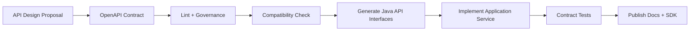
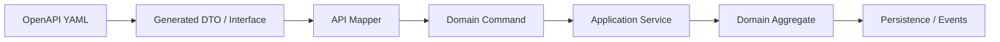
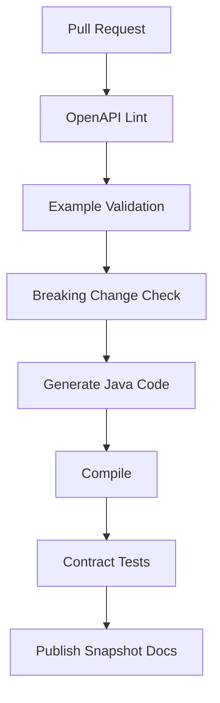

------
title: Build From Scratch: Large Production Grade Java Payment Systems - Part 012
description: Membangun OpenAPI dan schema-first contract untuk payment APIs: contract governance, schema composition, error model, idempotency headers, reusable components, enum evolution, request/response validation, generated Java interfaces, contract testing, linting, dan compatibility policy.
series: learn-java-payment-systems
seriesTitle: Build From Scratch: Large Production Grade Java Payment Systems
order: 12
partTitle: OpenAPI & Schema-First Payment APIs
tags:
- java
- payments
- openapi
- schema-first
- contract-testing
- jax-rs
- api-governance
date: 2026-07-02
---

# Part 012 — OpenAPI & Schema-First Payment APIs

Di part sebelumnya kita mendesain API surface.

Sekarang kita membuat kontraknya eksplisit.

Untuk payment system enterprise, API contract bukan dokumentasi tambahan.

API contract adalah **control artifact**.

Ia dipakai oleh:

- merchant integration team,
- frontend/mobile team,
- backend service team,
- QA/contract testing,
- security review,
- audit/compliance,
- SRE/on-call,
- provider simulator,
- SDK generation,
- API gateway validation,
- backward compatibility governance.

Jika contract hanya dibuat setelah code selesai, contract akan menjadi cermin kebetulan implementasi.

Dalam payment system, itu lemah.

Kita ingin kebalikannya:

```text
contract -> generated interfaces/models -> implementation -> contract tests -> runtime validation
```

Bukan:

```text
implementation -> guessed documentation -> broken merchant integration
```

---

## 1. Kenapa Schema-First Penting untuk Payment

Payment API harus tahan terhadap:

- integrasi merchant yang long-lived,
- SDK yang tersebar di banyak versi,
- webhook payload yang diproses asynchronous,
- audit yang membutuhkan bukti contract saat transaksi terjadi,
- provider/rail baru yang ditambahkan tanpa memecahkan client lama,
- field sensitif yang tidak boleh bocor,
- enum status yang bisa berevolusi,
- idempotency behavior yang harus konsisten.

Schema-first membuat semua itu bisa dikontrol.

Manfaat praktis:

| Area | Dampak schema-first |
|---|---|
| API design | endpoint, request, response disepakati sebelum coding |
| correctness | amount/currency/status/error tervalidasi konsisten |
| security | field sensitif bisa dilarang di schema publik |
| generated code | Java interface/model bisa dibuat dari contract |
| tests | contract tests bisa dijalankan tanpa full production stack |
| docs | merchant documentation tidak divergen dari implementation |
| governance | breaking change bisa dideteksi di CI |

---

## 2. OpenAPI Version Choice

Untuk project baru, gunakan OpenAPI 3.1.x.

OpenAPI 3.1 menyelaraskan schema object dengan JSON Schema 2020-12 secara jauh lebih baik dibanding 3.0.x.

Per current reference yang dipakai materi ini:

- OpenAPI Specification v3.1.1 tersedia sebagai specification resmi.
- OpenAPI Initiative mengumumkan 3.1.1 sebagai versi terbaru dan recommended untuk project baru pada release announcement Oktober 2024.
- JSON Schema menyatakan current version adalah Draft 2020-12.

Konsekuensi desain:

- pakai `$schema` bila perlu,
- hati-hati dengan tooling yang belum sempurna mendukung 3.1,
- jika generator internal lebih stabil di 3.0.4, bisa gunakan 3.0.4 untuk codegen sambil menjaga source-of-truth 3.1.1,
- jangan memakai fitur schema terlalu canggih jika tooling payment pipeline belum siap.

Pragmatic policy:

```text
Author canonical contract in OpenAPI 3.1.1.
Validate tooling compatibility.
If a generator requires 3.0.x, generate a downgraded artifact from canonical spec, not hand-maintain two specs.
```

---

## 3. Repository Layout untuk Contract

Jangan simpan OpenAPI file sebagai satu YAML raksasa tanpa struktur.

Contoh layout:

```text
payment-api-contracts/
  openapi/
    public-v1.yaml
    internal-v1.yaml
    provider-webhook-v1.yaml
    merchant-webhook-v1.yaml
  components/
    schemas/
      money.yaml
      errors.yaml
      payment-intent.yaml
      payment-attempt.yaml
      refund.yaml
      next-action.yaml
      pagination.yaml
    parameters/
      idempotency-key.yaml
      request-id.yaml
      pagination.yaml
    responses/
      errors.yaml
  examples/
    payment-intent-create-request.json
    payment-intent-succeeded-response.json
    refund-processing-response.json
  rules/
    spectral.yaml
  compatibility/
    breaking-change-policy.md
```

Monorepo atau multi-repo bebas.

Yang penting contract punya lifecycle sendiri:



---

## 4. Root OpenAPI File

Contoh `public-v1.yaml`:

```yaml
openapi: 3.1.1
info:
  title: Payment Platform Public API
  version: 1.0.0
  description: Public merchant-facing payment API for payment intent, capture, cancellation, refund, and event retrieval.
servers:
  - url: https://api.payment.example.com/v1
    description: Production
  - url: https://sandbox-api.payment.example.com/v1
    description: Sandbox
security:
  - ApiKeyAuth: []
tags:
  - name: PaymentIntents
  - name: Refunds
  - name: Events
paths:
  /payment-intents:
    post:
      tags: [PaymentIntents]
      operationId: createPaymentIntent
      summary: Create a payment intent
      parameters:
        - $ref: '#/components/parameters/IdempotencyKey'
      requestBody:
        required: true
        content:
          application/json:
            schema:
              $ref: '#/components/schemas/CreatePaymentIntentRequest'
      responses:
        '201':
          description: Payment intent created
          content:
            application/json:
              schema:
                $ref: '#/components/schemas/PaymentIntent'
        '400':
          $ref: '#/components/responses/InvalidRequestError'
        '409':
          $ref: '#/components/responses/ConflictError'
components:
  securitySchemes:
    ApiKeyAuth:
      type: apiKey
      in: header
      name: Authorization
  parameters:
    IdempotencyKey:
      name: Idempotency-Key
      in: header
      required: true
      schema:
        type: string
        minLength: 8
        maxLength: 255
      description: Required for commands that may create or change financial effects.
```

Catatan:

- `operationId` wajib stabil; generator dan SDK bergantung padanya.
- idempotency key ditaruh sebagai parameter reusable.
- error response direferensikan sebagai reusable response.
- schema request/response tidak inline terlalu banyak.

---

## 5. Money Schema

Money adalah schema paling berbahaya jika salah.

Jangan pakai floating point.

```yaml
Money:
  type: object
  required:
    - currency
    - valueMinor
  additionalProperties: false
  properties:
    currency:
      type: string
      minLength: 3
      maxLength: 3
      pattern: '^[A-Z]{3}$'
      description: ISO 4217 currency code.
      examples: [IDR, USD, EUR]
    valueMinor:
      type: integer
      format: int64
      minimum: 0
      description: Amount in the currency minor unit. For IDR this is the amount without decimal fraction.
  examples:
    - currency: IDR
      valueMinor: 15000000
```

Kenapa `minimum: 0`?

Karena money amount di command API seperti payment/refund/capture tidak boleh negatif.

Debit/credit direction tidak direpresentasikan dengan negative amount di API publik.

Untuk ledger internal, direction direpresentasikan oleh account/debit/credit posting, bukan amount negatif random.

Jika perlu adjustment negatif, buat operation domain-specific.

---

## 6. PaymentIntent Schema

Contoh schema response:

```yaml
PaymentIntent:
  type: object
  required:
    - id
    - object
    - status
    - amount
    - amountCapturable
    - amountReceived
    - captureMethod
    - createdAt
    - updatedAt
  additionalProperties: false
  properties:
    id:
      type: string
      pattern: '^pi_[A-Za-z0-9]+$'
    object:
      type: string
      const: payment_intent
    status:
      $ref: '#/components/schemas/PaymentIntentStatus'
    amount:
      $ref: '#/components/schemas/Money'
    amountCapturable:
      $ref: '#/components/schemas/Money'
    amountReceived:
      $ref: '#/components/schemas/Money'
    captureMethod:
      $ref: '#/components/schemas/CaptureMethod'
    latestAttempt:
      anyOf:
        - $ref: '#/components/schemas/PaymentAttemptSummary'
        - type: 'null'
    nextAction:
      anyOf:
        - $ref: '#/components/schemas/NextAction'
        - type: 'null'
    createdAt:
      type: string
      format: date-time
    updatedAt:
      type: string
      format: date-time
```

Catatan penting:

- `object` membantu event/webhook polymorphism.
- `additionalProperties: false` membuat public contract ketat.
- nullable di OpenAPI 3.1 bisa menggunakan union dengan `null`.
- `latestAttempt` summary, bukan raw provider payload.

---

## 7. Enum Evolution

Enum di payment berbahaya.

Kalau client generated code tidak siap menerima enum baru, penambahan status bisa memecahkan integrasi.

Schema:

```yaml
PaymentIntentStatus:
  type: string
  enum:
    - REQUIRES_PAYMENT_METHOD
    - REQUIRES_CONFIRMATION
    - REQUIRES_ACTION
    - PROCESSING
    - AUTHORIZED
    - PARTIALLY_CAPTURED
    - CAPTURED
    - SUCCEEDED
    - CANCELED
    - FAILED
    - EXPIRED
    - UNKNOWN
```

Policy:

```text
Server may add new enum values in a minor version only if client SDKs and docs define unknown enum handling.
```

Java generated enum sering tidak suka unknown value.

Untuk public SDK, pertimbangkan wrapper:

```java
public final class PaymentIntentStatusValue {
    private final String value;

    public boolean isKnown() {
        return known().contains(value);
    }

    public Optional<KnownPaymentIntentStatus> asKnown() {
        return KnownPaymentIntentStatus.from(value);
    }
}
```

Untuk internal domain, enum boleh strict.

Untuk external client compatibility, unknown handling harus lebih lembut.

---

## 8. Create Payment Intent Request Schema

```yaml
CreatePaymentIntentRequest:
  type: object
  required:
    - merchantId
    - referenceType
    - referenceId
    - amount
    - captureMethod
    - allowedPaymentMethods
  additionalProperties: false
  properties:
    merchantId:
      type: string
      pattern: '^mrc_[A-Za-z0-9]+$'
    referenceType:
      type: string
      enum: [ORDER, INVOICE, SUBSCRIPTION, CUSTOM]
    referenceId:
      type: string
      minLength: 1
      maxLength: 128
    amount:
      $ref: '#/components/schemas/Money'
    captureMethod:
      $ref: '#/components/schemas/CaptureMethod'
    allowedPaymentMethods:
      type: array
      minItems: 1
      uniqueItems: true
      items:
        $ref: '#/components/schemas/PaymentMethodType'
    expiresAt:
      type: string
      format: date-time
    metadata:
      $ref: '#/components/schemas/Metadata'
```

Schema bisa validasi bentuk.

Tapi tidak semua invariant bisa divalidasi schema.

Contoh yang butuh domain validation:

- merchant capability untuk QRIS aktif atau tidak,
- currency didukung merchant atau tidak,
- amount di bawah limit merchant atau tidak,
- expiry terlalu jauh atau tidak,
- reference duplicate atau tidak,
- risk policy merchant.

Jangan memaksa semua aturan bisnis masuk OpenAPI.

OpenAPI adalah contract layer, bukan policy engine.

---

## 9. Metadata Schema

Metadata berguna untuk merchant.

Tapi tanpa batas, metadata menjadi tempat menyimpan data sensitif.

```yaml
Metadata:
  type: object
  additionalProperties:
    type: string
    maxLength: 500
  maxProperties: 50
  description: Merchant-defined key-value data. Do not store PAN, CVV, password, government identifiers, or sensitive authentication data.
```

Runtime juga harus scan/block field tertentu:

```text
pan
card_number
cvv
password
pin
otp
secret
private_key
nik
ssn
```

Schema description saja tidak cukup.

Butuh runtime guard dan security review.

---

## 10. NextAction Schema dengan Discriminator

`nextAction` perlu polymorphic schema.

```yaml
NextAction:
  oneOf:
    - $ref: '#/components/schemas/RedirectNextAction'
    - $ref: '#/components/schemas/DisplayQrCodeNextAction'
    - $ref: '#/components/schemas/DisplayBankTransferInstructionNextAction'
  discriminator:
    propertyName: type
    mapping:
      REDIRECT: '#/components/schemas/RedirectNextAction'
      DISPLAY_QR_CODE: '#/components/schemas/DisplayQrCodeNextAction'
      DISPLAY_BANK_TRANSFER_INSTRUCTION: '#/components/schemas/DisplayBankTransferInstructionNextAction'

RedirectNextAction:
  type: object
  required: [type, redirectUrl]
  additionalProperties: false
  properties:
    type:
      type: string
      const: REDIRECT
    redirectUrl:
      type: string
      format: uri

DisplayQrCodeNextAction:
  type: object
  required: [type, qr]
  additionalProperties: false
  properties:
    type:
      type: string
      const: DISPLAY_QR_CODE
    qr:
      $ref: '#/components/schemas/QrInstruction'
```

Payment API perlu polymorphism, tapi jangan biarkan polymorphism menjadi `Map<String,Object>` liar.

---

## 11. Error Schema

Satu error contract untuk semua endpoint.

```yaml
ErrorResponse:
  type: object
  required: [error]
  additionalProperties: false
  properties:
    error:
      $ref: '#/components/schemas/ApiError'

ApiError:
  type: object
  required:
    - type
    - code
    - message
    - requestId
  additionalProperties: false
  properties:
    type:
      $ref: '#/components/schemas/ErrorType'
    code:
      type: string
      pattern: '^[A-Z0-9_]+$'
    message:
      type: string
      maxLength: 1000
    field:
      type: [string, 'null']
    requestId:
      type: string
      pattern: '^req_[A-Za-z0-9]+$'
    paymentIntentId:
      type: [string, 'null']
    retryAfterSeconds:
      type: [integer, 'null']
      minimum: 0
    details:
      type: object
      additionalProperties: true
```

Error type:

```yaml
ErrorType:
  type: string
  enum:
    - INVALID_REQUEST
    - AUTHENTICATION_ERROR
    - AUTHORIZATION_ERROR
    - RESOURCE_NOT_FOUND
    - IDEMPOTENCY_ERROR
    - STATE_CONFLICT
    - RATE_LIMIT_ERROR
    - PROVIDER_UNAVAILABLE
    - UNKNOWN_OUTCOME
    - INTERNAL_ERROR
```

Rule:

```text
Error message is for humans.
Error code is for machines.
Error type is for broad handling.
HTTP status is transport semantics.
Payment resource status is financial lifecycle.
```

Jangan campur.

---

## 12. Idempotency Header Component

```yaml
IdempotencyKey:
  name: Idempotency-Key
  in: header
  required: true
  schema:
    type: string
    minLength: 8
    maxLength: 255
    pattern: '^[A-Za-z0-9._:-]+$'
  description: |
    A unique key supplied by the client to safely retry commands.
    The same key with the same request fingerprint returns the original result.
    The same key with a different request fingerprint returns an idempotency error.
```

Header ini dipakai di command endpoint:

- create payment intent,
- confirm,
- capture,
- cancel,
- refund,
- payout,
- webhook endpoint creation,
- backoffice actions.

Retrieve endpoint tidak perlu idempotency key.

---

## 13. Request ID Header

```yaml
RequestId:
  name: Payment-Request-Id
  in: header
  required: false
  schema:
    type: string
    maxLength: 128
  description: Optional client-supplied correlation id. The platform always returns its own request id in response headers.
```

Response header:

```yaml
headers:
  Payment-Request-Id:
    schema:
      type: string
    description: Unique request id generated by the payment platform.
```

Jangan percaya request id client sebagai unique internal id.

Gunakan internal request id sendiri.

Client-supplied id hanya correlation hint.

---

## 14. Full Endpoint Example: Confirm

```yaml
/payment-intents/{paymentIntentId}/confirm:
  post:
    tags: [PaymentIntents]
    operationId: confirmPaymentIntent
    summary: Confirm a payment intent
    parameters:
      - name: paymentIntentId
        in: path
        required: true
        schema:
          type: string
          pattern: '^pi_[A-Za-z0-9]+$'
      - $ref: '#/components/parameters/IdempotencyKey'
    requestBody:
      required: true
      content:
        application/json:
          schema:
            $ref: '#/components/schemas/ConfirmPaymentIntentRequest'
    responses:
      '200':
        description: Payment intent confirmed or current idempotent result returned
        content:
          application/json:
            schema:
              $ref: '#/components/schemas/PaymentIntent'
      '400':
        $ref: '#/components/responses/InvalidRequestError'
      '409':
        $ref: '#/components/responses/ConflictError'
      '503':
        $ref: '#/components/responses/ProviderUnavailableError'
```

`ConfirmPaymentIntentRequest`:

```yaml
ConfirmPaymentIntentRequest:
  type: object
  required:
    - paymentMethod
  additionalProperties: false
  properties:
    paymentMethod:
      $ref: '#/components/schemas/PaymentMethodInput'
    returnUrl:
      type: string
      format: uri
    clientContext:
      $ref: '#/components/schemas/ClientContext'
```

---

## 15. PaymentMethodInput Schema

Payment method input perlu hati-hati dengan PCI boundary.

```yaml
PaymentMethodInput:
  oneOf:
    - $ref: '#/components/schemas/CardTokenPaymentMethodInput'
    - $ref: '#/components/schemas/BankTransferPaymentMethodInput'
    - $ref: '#/components/schemas/QrisPaymentMethodInput'
  discriminator:
    propertyName: type
    mapping:
      CARD: '#/components/schemas/CardTokenPaymentMethodInput'
      BANK_TRANSFER: '#/components/schemas/BankTransferPaymentMethodInput'
      QRIS: '#/components/schemas/QrisPaymentMethodInput'

CardTokenPaymentMethodInput:
  type: object
  required: [type, token]
  additionalProperties: false
  properties:
    type:
      type: string
      const: CARD
    token:
      type: string
      pattern: '^tok_[A-Za-z0-9]+$'
    saveForFutureUse:
      type: boolean
      default: false
```

Tidak ada field `cardNumber`.

Tidak ada field `cvv`.

Kalau platform memang memproses raw card data, itu harus berada di card data environment yang didesain khusus dan dibahas di part PCI/tokenization.

Untuk API publik general, tokenized input lebih aman.

---

## 16. Capture Schema

```yaml
CapturePaymentIntentRequest:
  type: object
  required:
    - amountToCapture
    - finalCapture
  additionalProperties: false
  properties:
    amountToCapture:
      $ref: '#/components/schemas/Money'
    finalCapture:
      type: boolean
      description: Whether this capture should release any remaining uncaptured authorization amount.
    captureReference:
      type: string
      minLength: 1
      maxLength: 128
```

Schema tidak bisa memastikan:

```text
amountToCapture <= amountCapturable
```

Itu domain validation.

Tetapi schema bisa memastikan amount berbentuk benar dan tidak negatif.

---

## 17. Refund Schema

```yaml
CreateRefundRequest:
  type: object
  required:
    - paymentIntentId
    - amount
    - reason
  additionalProperties: false
  properties:
    paymentIntentId:
      type: string
      pattern: '^pi_[A-Za-z0-9]+$'
    amount:
      $ref: '#/components/schemas/Money'
    reason:
      $ref: '#/components/schemas/RefundReason'
    referenceId:
      type: string
      maxLength: 128
    metadata:
      $ref: '#/components/schemas/Metadata'

RefundReason:
  type: string
  enum:
    - REQUESTED_BY_CUSTOMER
    - DUPLICATE
    - FRAUDULENT
    - PRODUCT_UNAVAILABLE
    - MERCHANT_REQUESTED
    - OTHER
```

Refund response:

```yaml
Refund:
  type: object
  required:
    - id
    - object
    - paymentIntentId
    - status
    - amount
    - createdAt
    - updatedAt
  additionalProperties: false
  properties:
    id:
      type: string
      pattern: '^rf_[A-Za-z0-9]+$'
    object:
      type: string
      const: refund
    paymentIntentId:
      type: string
    status:
      $ref: '#/components/schemas/RefundStatus'
    amount:
      $ref: '#/components/schemas/Money'
    failureCode:
      type: [string, 'null']
    createdAt:
      type: string
      format: date-time
    updatedAt:
      type: string
      format: date-time
```

---

## 18. Pagination Schema

```yaml
CursorPage:
  type: object
  required:
    - hasMore
  additionalProperties: false
  properties:
    nextCursor:
      type: [string, 'null']
    hasMore:
      type: boolean

PaymentIntentList:
  type: object
  required: [data, page]
  additionalProperties: false
  properties:
    data:
      type: array
      items:
        $ref: '#/components/schemas/PaymentIntent'
    page:
      $ref: '#/components/schemas/CursorPage'
```

Cursor harus opaque.

Jangan expose internal timestamp/id secara langsung jika itu bisa menciptakan coupling.

Contoh:

```text
cur_eyJjcmVhdGVkQXQiOiIyMDI2LTA3LTAyVDA4OjAwOjAwWiIsImlkIjoicGlfLi4uIn0
```

---

## 19. Merchant Webhook Contract

Merchant webhook sebaiknya punya spec sendiri.

Contoh event schema:

```yaml
MerchantEvent:
  type: object
  required:
    - id
    - object
    - type
    - apiVersion
    - createdAt
    - data
  additionalProperties: false
  properties:
    id:
      type: string
      pattern: '^evt_[A-Za-z0-9]+$'
    object:
      type: string
      const: event
    type:
      $ref: '#/components/schemas/MerchantEventType'
    apiVersion:
      type: string
      examples: ['2026-07-02']
    createdAt:
      type: string
      format: date-time
    data:
      $ref: '#/components/schemas/MerchantEventData'

MerchantEventData:
  type: object
  required: [object]
  additionalProperties: false
  properties:
    object:
      oneOf:
        - $ref: '#/components/schemas/PaymentIntent'
        - $ref: '#/components/schemas/Refund'
```

Event type:

```yaml
MerchantEventType:
  type: string
  enum:
    - payment_intent.created
    - payment_intent.requires_action
    - payment_intent.processing
    - payment_intent.authorized
    - payment_intent.succeeded
    - payment_intent.failed
    - payment_intent.canceled
    - refund.created
    - refund.processing
    - refund.succeeded
    - refund.failed
```

Webhook schema harus versioned karena merchant menyimpan parser event selama bertahun-tahun.

---

## 20. Provider Webhook Contract: Jangan Samakan dengan Merchant Event

Provider webhook raw payload tidak selalu bisa dijelaskan fully dalam public OpenAPI.

Namun ingress contract tetap bisa didefinisikan minimal:

```yaml
/provider-webhooks/{providerCode}:
  post:
    tags: [ProviderWebhooks]
    operationId: ingestProviderWebhook
    summary: Ingest a provider webhook payload
    parameters:
      - name: providerCode
        in: path
        required: true
        schema:
          type: string
          pattern: '^[a-z0-9_]+$'
      - name: Payment-Provider-Signature
        in: header
        required: false
        schema:
          type: string
    requestBody:
      required: true
      content:
        application/json:
          schema:
            type: object
            additionalProperties: true
    responses:
      '202':
        description: Webhook accepted for processing
```

Kenapa `additionalProperties: true`?

Karena provider payload bisa berbeda-beda.

Tetapi raw payload tidak boleh langsung masuk domain.

Setelah ingress, provider adapter harus normalize ke internal schema:

```yaml
NormalizedProviderEvent:
  type: object
  required:
    - providerCode
    - providerEventId
    - providerReference
    - eventType
    - observedAt
    - rawPayloadReference
  additionalProperties: false
  properties:
    providerCode:
      type: string
    providerEventId:
      type: string
    providerReference:
      type: string
    eventType:
      type: string
    normalizedStatus:
      type: string
    observedAt:
      type: string
      format: date-time
    rawPayloadReference:
      type: string
```

---

## 21. Contract and Domain Boundary

OpenAPI model tidak boleh menjadi domain model mentah.



Generated DTO useful untuk:

- request parsing,
- response serialization,
- docs,
- SDK.

Tapi domain model harus tetap:

- invariant-rich,
- immutable where possible,
- bebas dari JSON annotation noise,
- tidak tergantung generator,
- tidak mengikuti compromise schema publik.

---

## 22. Java Code Generation Strategy

Dengan OpenAPI Generator, ada generator Java dan generator JAX-RS/Jersey.

Pilihan umum:

| Strategy | Kelebihan | Kekurangan |
|---|---|---|
| Generate models only | domain tetap bebas | harus tulis resource interface manual |
| Generate JAX-RS interface | contract enforcement kuat | generated code bisa noisy |
| Generate client SDK | merchant/internal clients mudah | compatibility harus dijaga |
| Generate server stub penuh | cepat awal | sering kurang cocok untuk architecture bersih |

Rekomendasi untuk seri ini:

```text
Generate API interfaces + DTOs.
Implement interfaces manually in resource adapter.
Map DTOs to domain commands.
Never put business logic in generated classes.
```

Contoh target structure:

```text
payment-api-generated/
  src/main/java/com/example/payment/api/generated/
    model/
    resource/
payment-api-server/
  src/main/java/com/example/payment/api/resource/
    PaymentIntentResourceImpl.java
    RefundResourceImpl.java
  src/main/java/com/example/payment/api/mapper/
    PaymentIntentApiMapper.java
payment-domain/
  src/main/java/com/example/payment/domain/
```

---

## 23. Maven Build Sketch

Contoh build lifecycle:

```xml
<plugin>
  <groupId>org.openapitools</groupId>
  <artifactId>openapi-generator-maven-plugin</artifactId>
  <version>${openapi.generator.version}</version>
  <executions>
    <execution>
      <goals>
        <goal>generate</goal>
      </goals>
      <configuration>
        <inputSpec>${project.basedir}/../contracts/openapi/public-v1.yaml</inputSpec>
        <generatorName>jaxrs-jersey</generatorName>
        <apiPackage>com.example.payment.api.generated.resource</apiPackage>
        <modelPackage>com.example.payment.api.generated.model</modelPackage>
        <generateSupportingFiles>false</generateSupportingFiles>
        <configOptions>
          <sourceFolder>src/gen/java</sourceFolder>
          <dateLibrary>java8</dateLibrary>
          <interfaceOnly>true</interfaceOnly>
          <useJakartaEe>true</useJakartaEe>
        </configOptions>
      </configuration>
    </execution>
  </executions>
</plugin>
```

Catatan:

- nama option bisa berubah antar generator/version; pin version dan test di CI,
- jangan upgrade generator diam-diam,
- commit generated code atau generate saat build tergantung policy repo,
- untuk regulated systems, reproducibility lebih penting dari convenience.

---

## 24. Generated Interface Implementation

Generated interface mungkin seperti:

```java
public interface PaymentIntentsApi {
    Response createPaymentIntent(
        String idempotencyKey,
        CreatePaymentIntentRequest request
    );

    Response getPaymentIntent(String paymentIntentId);

    Response confirmPaymentIntent(
        String paymentIntentId,
        String idempotencyKey,
        ConfirmPaymentIntentRequest request
    );
}
```

Implementation:

```java
public final class PaymentIntentsResource implements PaymentIntentsApi {
    private final PaymentIntentApplicationService service;
    private final PaymentIntentApiMapper mapper;
    private final RequestContextFactory contextFactory;

    @Override
    public Response createPaymentIntent(String idempotencyKey, CreatePaymentIntentRequest request) {
        RequestContext context = contextFactory.create(idempotencyKey);
        var command = mapper.toCreateCommand(request, context);
        var result = service.create(command);
        return Response.status(201).entity(mapper.toApi(result)).build();
    }

    @Override
    public Response confirmPaymentIntent(
        String paymentIntentId,
        String idempotencyKey,
        ConfirmPaymentIntentRequest request
    ) {
        RequestContext context = contextFactory.create(idempotencyKey);
        var command = mapper.toConfirmCommand(paymentIntentId, request, context);
        var result = service.confirm(command);
        return Response.ok(mapper.toApi(result)).build();
    }
}
```

Generated interface memastikan signature sesuai contract.

Domain service memastikan behavior benar.

---

## 25. Request Validation

Ada tiga level validation:

| Level | Contoh | Tempat |
|---|---|---|
| Schema validation | required field, type, pattern | API gateway/JAX-RS filter |
| Semantic validation | currency supported, amount limit | application service/domain policy |
| Financial invariant validation | refundable amount, capturable amount | domain aggregate/ledger control |

Jangan campur.

Contoh schema valid tapi domain invalid:

```json
{
  "amount": {
    "currency": "USD",
    "valueMinor": 1000
  }
}
```

Schema valid.

Tapi merchant hanya boleh IDR.

Maka error domain:

```json
{
  "error": {
    "type": "INVALID_REQUEST",
    "code": "CURRENCY_NOT_SUPPORTED_FOR_MERCHANT",
    "message": "Merchant mrc_... does not support USD payments.",
    "requestId": "req_..."
  }
}
```

---

## 26. Response Validation

Request validation saja tidak cukup.

Payment API juga harus memvalidasi response terhadap schema di test.

Kenapa?

Karena bug serialization bisa membocorkan:

- raw provider payload,
- risk score,
- internal ledger account id,
- email/phone yang tidak perlu,
- credential fragment,
- null field yang tidak diizinkan,
- enum internal.

Contract test harus memastikan response publik sesuai schema.

Pseudo-test:

```java
@Test
void createPaymentIntentResponseMustMatchOpenApiSchema() {
    var response = client.createPaymentIntent(validRequest());

    assertThat(response.statusCode()).isEqualTo(201);
    openApiValidator.assertResponseMatches(
        "createPaymentIntent",
        201,
        response.body()
    );
}
```

---

## 27. Contract Testing Matrix

Minimal matrix:

| Test | Purpose |
|---|---|
| OpenAPI lint | style, naming, required fields |
| schema validation | request/response valid |
| negative request contract | invalid amount/currency/status rejected |
| idempotency header required | financial commands cannot omit it |
| generated code compilation | contract compatible with Java stack |
| backward compatibility check | no accidental breaking changes |
| webhook signature examples | merchant can verify |
| example payload validation | docs examples always valid |
| enum unknown test | SDK/client behavior safe |
| error response consistency | all errors match `ErrorResponse` |

CI flow:



---

## 28. API Linting Rules

Governance rules contoh:

```yaml
rules:
  operation-operationId-required: true
  operation-tags: true
  path-params-defined: true
  no-ambiguous-payment-status:
    description: Payment status must reference PaymentIntentStatus schema.
  idempotency-required-for-financial-commands:
    description: POST commands that create financial effects must include Idempotency-Key.
  no-float-money:
    description: Money schemas must use integer valueMinor, never number/double.
  error-response-required:
    description: 4xx and 5xx responses must use ErrorResponse.
  no-additional-properties-public-response:
    description: Public response schemas must set additionalProperties false.
```

Tools seperti Spectral sering dipakai untuk linting OpenAPI, tetapi rule penting adalah rule domain payment, bukan hanya style REST umum.

---

## 29. Breaking Change Policy

Breaking changes untuk payment API:

- menghapus endpoint,
- mengganti path,
- mengganti operationId,
- menghapus response field required,
- menjadikan optional field required,
- mengubah type field,
- mengubah amount representation,
- mengubah enum tanpa unknown handling policy,
- mengubah status semantics,
- mengubah idempotency semantics,
- mengubah webhook signature algorithm tanpa migration,
- mengubah event payload shape tanpa versioning.

Non-breaking biasanya:

- menambah optional response field,
- menambah endpoint baru,
- menambah optional request field,
- menambah error code baru dalam type yang sama,
- menambah webhook event type jika consumer contract siap unknown event.

Payment-specific warning:

```text
A technically non-breaking schema change can still be financially breaking if it changes meaning.
```

Contoh:

- `SUCCEEDED` dulu berarti captured, sekarang berarti settled.
- `amountReceived` dulu gross, sekarang net after fee.
- `availableAt` dulu local time, sekarang UTC.

Schema diff tidak cukup.

Butuh semantic review.

---

## 30. API Examples as Tests

Setiap example di docs harus valid.

Contoh example file:

```json
{
  "merchantId": "mrc_01JZ8X1A2B3C4D5E6F7G8H9J0K",
  "referenceType": "ORDER",
  "referenceId": "ord_20260702_0001",
  "amount": {
    "currency": "IDR",
    "valueMinor": 15000000
  },
  "captureMethod": "AUTOMATIC",
  "allowedPaymentMethods": ["CARD", "QRIS"]
}
```

CI harus validate:

```text
example payload -> schema validation -> pass
```

Jika docs example invalid, merchant akan copy-paste bug.

---

## 31. Schema-First untuk Webhook Signature

Webhook signature bukan hanya security detail.

Ia bagian dari contract.

Dokumentasikan canonical signing string:

```text
signed_payload = timestamp + "." + raw_body
signature = HMAC_SHA256(endpoint_secret, signed_payload)
```

Headers:

```yaml
PaymentSignature:
  name: Payment-Signature
  in: header
  required: true
  schema:
    type: string
  description: HMAC signature over timestamp and raw request body.

PaymentEventId:
  name: Payment-Event-Id
  in: header
  required: true
  schema:
    type: string
```

Signature verification pseudo-code:

```java
public boolean verify(String header, String rawBody, String secret, Clock clock) {
    SignatureHeader parsed = SignatureHeader.parse(header);
    Instant timestamp = parsed.timestamp();

    if (Duration.between(timestamp, clock.instant()).abs().toMinutes() > 5) {
        return false;
    }

    String signedPayload = parsed.timestampEpochSeconds() + "." + rawBody;
    String expected = hmacSha256Hex(secret, signedPayload);
    return constantTimeEquals(expected, parsed.signature());
}
```

Important:

- sign raw body, not parsed JSON,
- use constant-time comparison,
- reject old timestamp,
- support key rotation with multiple active secrets,
- document retry behavior.

---

## 32. Public vs Internal Contract

Jangan satu OpenAPI untuk semua.

Pisahkan:

| Contract | Audience | Stability |
|---|---|---|
| public merchant API | external merchants | very stable |
| customer client API | browser/mobile | stable but limited |
| merchant webhook API | external merchant receivers | very stable |
| provider webhook ingress | external providers but internal semantics | provider-specific |
| internal service API | internal services | can evolve faster |
| backoffice API | internal operators | controlled with RBAC/audit |

Public contract harus lebih konservatif.

Internal contract boleh lebih cepat berubah, tetapi tetap butuh compatibility jika service deployment tidak atomic.

---

## 33. Contract Ownership

Contract harus punya owner jelas.

Minimal ownership matrix:

| Artifact | Owner | Reviewer wajib |
|---|---|---|
| public payment API | payment platform team | merchant integration, security, SRE |
| money schema | ledger/finance engineering | finance, reconciliation |
| payment status enum | payment core | support, operations |
| refund schema | payment core + finance | risk, support |
| webhook event schema | platform integration | merchant success, SRE |
| error taxonomy | API platform | support, SDK team |
| idempotency policy | payment core | SRE, architecture |
| provider webhook schema | provider integration | reconciliation, risk |

API contract change tanpa owner akan menghasilkan entropy.

---

## 34. Schema-First Does Not Mean Big Design Upfront Forever

Schema-first bukan berarti semua harus sempurna sebelum coding.

Artinya setiap change melalui contract loop:

```text
hypothesis -> contract proposal -> example -> review -> generated code -> implementation -> tests -> release
```

Untuk payment, loop ini menyelamatkan kita dari bug mahal.

Contoh change kecil:

> Tambahkan `payment_intent.authorized` webhook event.

Checklist:

- event type ditambah,
- example payload dibuat,
- docs update,
- SDK unknown event behavior aman,
- webhook delivery test ditambah,
- merchant integration note dibuat,
- event ordering semantics jelas.

---

## 35. Contract for Sandbox and Simulator

Payment platform enterprise butuh sandbox.

Sandbox behavior harus documented di contract.

Contoh deterministic test tokens:

```yaml
x-payment-sandbox-behavior:
  testCards:
    - token: tok_card_success
      result: SUCCEEDED
    - token: tok_card_requires_3ds
      result: REQUIRES_ACTION
    - token: tok_card_declined
      result: FAILED
    - token: tok_card_timeout_unknown
      result: UNKNOWN
```

Atau docs table:

| Token | Result |
|---|---|
| `tok_card_success` | immediate success |
| `tok_card_requires_3ds` | requires redirect action |
| `tok_card_declined` | definitive decline |
| `tok_card_timeout_unknown` | unknown outcome requiring repair/polling |

Simulator bukan mainan.

Simulator adalah alat untuk menguji merchant integration, retry behavior, webhook dedup, dan reconciliation repair.

---

## 36. Payment Contract Invariants

Beberapa invariant harus muncul sebagai contract rule, bukan hanya implementation:

```text
Money.valueMinor must be integer.
Currency must be uppercase ISO 4217 code.
Financial commands require Idempotency-Key.
HTTP error response must use ErrorResponse.
Payment status must be from normalized internal lifecycle.
Provider raw status must not be exposed as primary status.
Sensitive authentication data must not appear in public payload.
Webhook events must have id, type, apiVersion, createdAt, data.object.
Retrieve endpoints must be safe and idempotent.
Command endpoints must document legal state conflict behavior.
```

Invariants ini nanti masuk ke:

- OpenAPI lint rules,
- unit tests,
- integration tests,
- architecture tests,
- code review checklist.

---

## 37. Compatibility with Java/Jakarta/JAX-RS

Karena seri ini Java payment system, contract harus cocok dengan runtime Java.

Perhatikan:

- `date-time` mapping ke `OffsetDateTime` atau `Instant`,
- `int64` mapping ke `Long`/`long`,
- nullable handling,
- enum unknown handling,
- oneOf/discriminator support generator,
- Jakarta namespace vs Javax namespace,
- Bean Validation annotation generation,
- Jackson configuration,
- BigDecimal hanya untuk rate/FX/tax calculation, bukan API minor amount.

Pragmatic rule:

```text
Do not use an OpenAPI feature in public contract unless your validation, codegen, documentation, and SDK pipeline all support it correctly.
```

Spec expressive power tidak berguna jika toolchain salah generate.

---

## 38. Architecture Decision Record

Untuk contract choice, buat ADR.

Contoh:

```md
# ADR-001: Use OpenAPI 3.1.1 as Canonical Payment API Contract

## Status
Accepted

## Context
Payment APIs require stable, machine-readable, auditable contracts for merchant integration, generated Java interfaces, schema validation, and compatibility governance.

## Decision
Use OpenAPI 3.1.1 as canonical source-of-truth. Generate Java JAX-RS interfaces and DTOs from this contract. Domain model remains separate from generated DTOs.

## Consequences
- API changes require contract review.
- Generator version must be pinned.
- CI must validate examples and breaking changes.
- Some advanced JSON Schema features may be avoided if tooling support is weak.
```

ADR membuat keputusan bisa diaudit.

Payment platform butuh jejak keputusan, bukan hanya kode.

---

## 39. Minimum Contract Files for Our Build

Untuk capstone nanti, minimal kita akan punya:

```text
contracts/
  public-v1.yaml
  merchant-webhook-v1.yaml
  provider-webhook-v1.yaml
  examples/
    create-payment-intent-request.json
    payment-intent-response-succeeded.json
    confirm-payment-intent-requires-action.json
    create-refund-request.json
    merchant-webhook-payment-succeeded.json
```

Minimal schemas:

```text
Money
Metadata
PaymentIntent
PaymentIntentStatus
PaymentAttemptSummary
PaymentMethodInput
NextAction
Refund
RefundStatus
ApiError
ErrorResponse
CursorPage
MerchantEvent
```

Minimal generated Java:

```text
PaymentIntentsApi
RefundsApi
EventsApi
PaymentIntent model
Refund model
ErrorResponse model
```

---

## 40. What We Built in This Part

Kita sudah mengubah API design menjadi schema-first contract strategy:

- memilih OpenAPI 3.1.1 sebagai canonical contract,
- menyusun repository layout contract,
- mendefinisikan Money schema,
- mendefinisikan PaymentIntent schema,
- mendesain enum evolution,
- mendefinisikan create/confirm/capture/refund schema,
- membuat error model,
- membuat idempotency header component,
- membedakan public, internal, provider webhook, dan merchant webhook contract,
- menentukan Java code generation strategy,
- membuat validation/testing/governance matrix,
- membuat breaking change policy,
- menyiapkan simulator contract.

Part berikutnya masuk ke **Payment Orchestration Engine**.

Di sana kita akan membangun otak yang memilih provider, menjalankan attempt, menangani retry/fallback, menjaga idempotency, dan mengubah provider response menjadi state transition yang aman.

---

## References

- OpenAPI Specification v3.1.1 — https://spec.openapis.org/oas/v3.1.1.html
- OpenAPI Initiative: Announcing OpenAPI Specification versions 3.0.4 and 3.1.1 — https://www.openapis.org/blog/2024/10/25/announcing-openapi-specification-patch-releases
- JSON Schema Draft 2020-12 — https://json-schema.org/draft/2020-12
- JSON Schema specification overview — https://json-schema.org/specification
- OpenAPI Generator JAX-RS Jersey generator documentation — https://openapi-generator.tech/docs/generators/jaxrs-jersey/
- OpenAPI Generator templating documentation — https://openapi-generator.tech/docs/templating/
