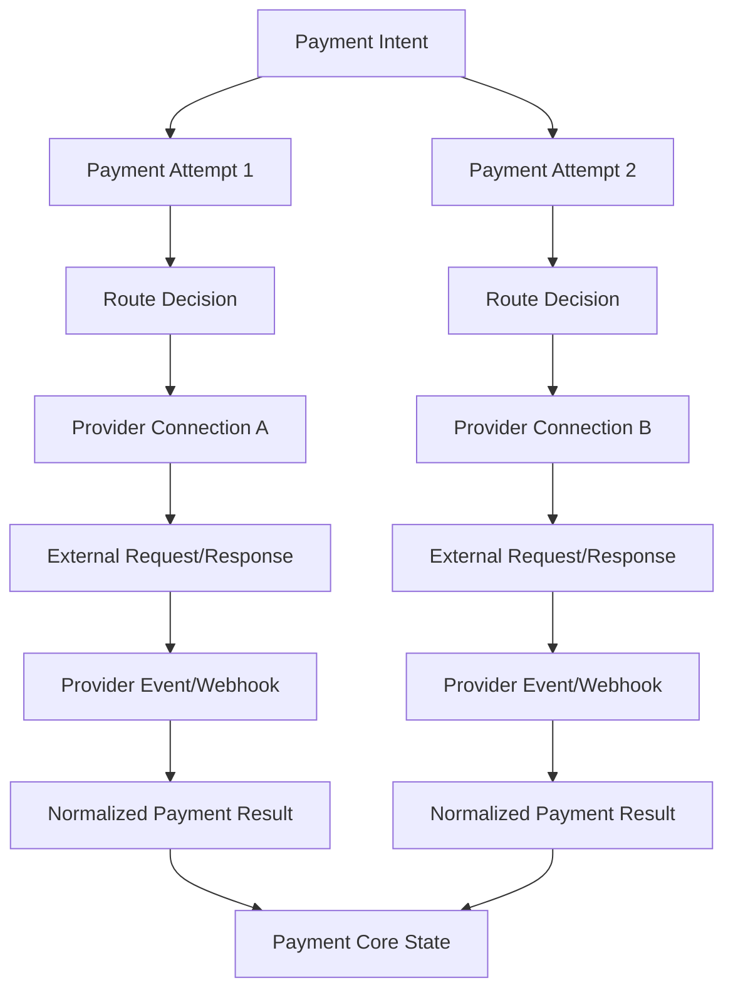
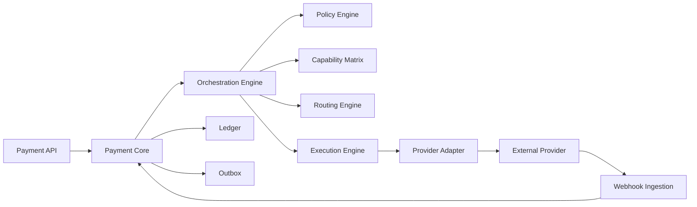
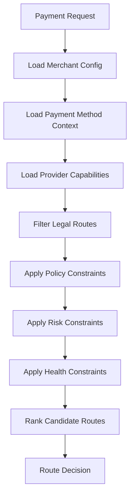
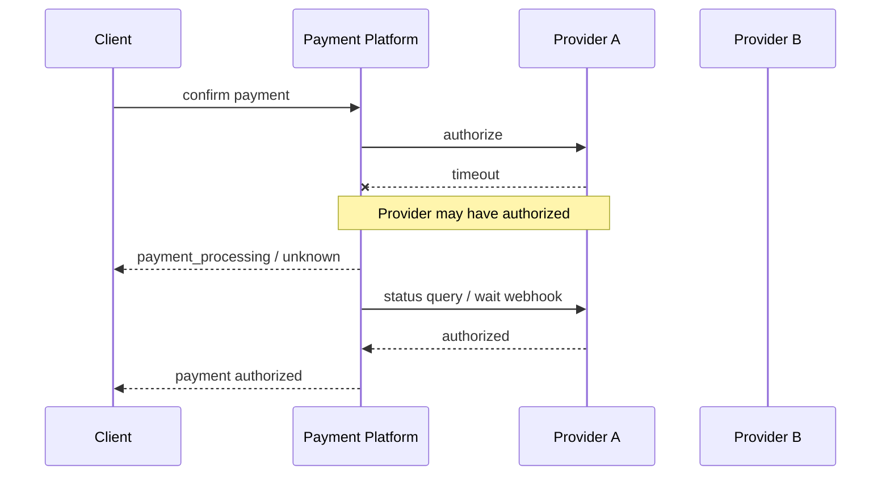
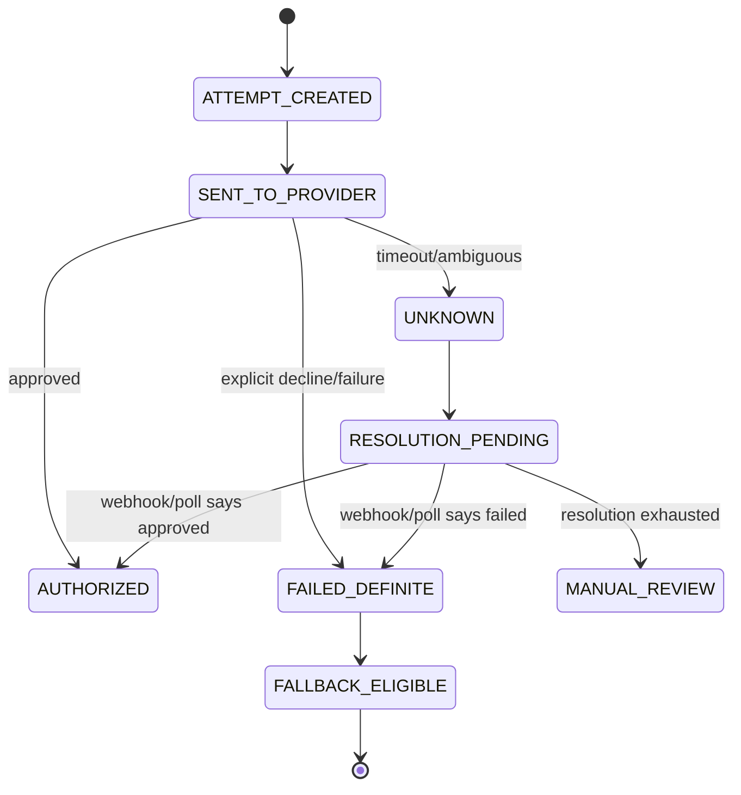
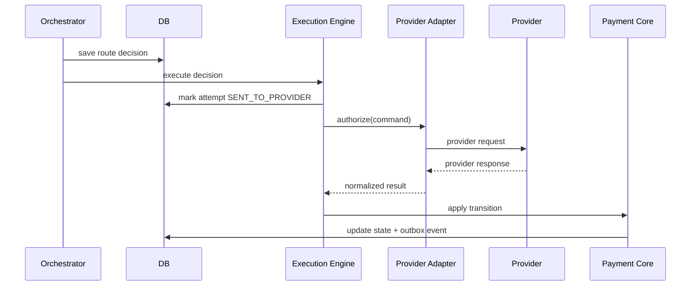
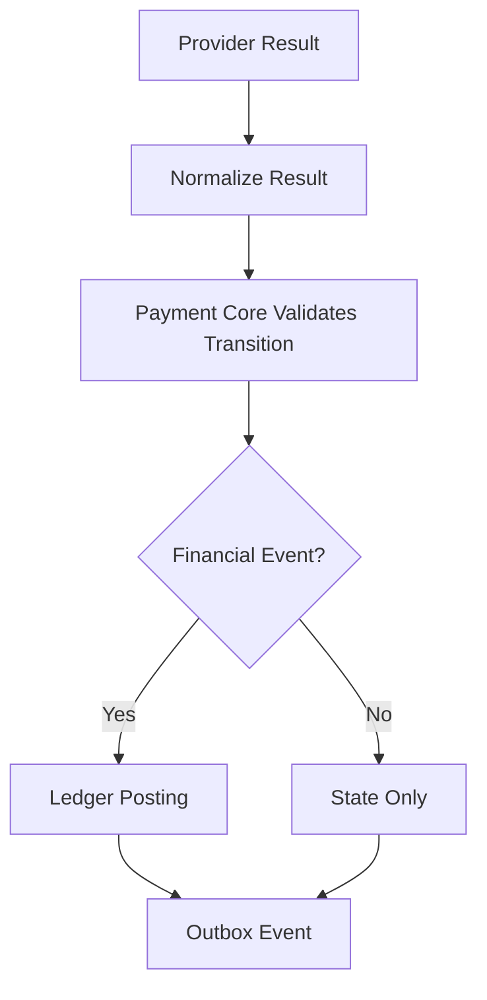

------
title: Build From Scratch: Large Production Grade Java Payment Systems - Part 013
description: Membangun payment orchestration engine yang production-grade: routing, provider selection, retry, fallback, unknown outcome handling, capability matrix, policy evaluation, idempotency boundary, provider abstraction, dan failure-safe execution model.
series: learn-java-payment-systems
seriesTitle: Build From Scratch: Large Production Grade Java Payment Systems
order: 13
partTitle: Payment Orchestration Engine
tags:
- java
- payments
- payment-orchestration
- routing
- retry
- fallback
- provider-adapter
- enterprise-architecture
date: 2026-07-02
---

# Part 013 — Payment Orchestration Engine

Di part sebelumnya kita sudah membuat API contract.

Sekarang kita masuk ke mesin yang menggerakkan payment platform: **payment orchestration engine**.

Ini bukan sekadar class bernama `PaymentService` yang memanggil provider.

Payment orchestration engine adalah lapisan yang menjawab pertanyaan:

> Untuk kewajiban pembayaran ini, dengan payment method ini, merchant ini, customer ini, amount ini, currency ini, risk context ini, dan kondisi provider saat ini, jalur pembayaran mana yang paling aman, legal, ekonomis, dan mungkin berhasil?

Dalam sistem sederhana, routing payment sering terlihat seperti ini:

```java
provider.charge(request);
```

Dalam sistem production, pertanyaannya jauh lebih kompleks:

- provider mana yang support currency ini?
- provider mana yang support partial capture?
- provider mana yang support refund setelah settlement?
- provider mana yang eligible untuk merchant ini?
- provider mana yang sedang degraded?
- apakah retry aman?
- apakah fallback akan menyebabkan double charge?
- apakah decline ini soft decline atau hard decline?
- apakah transaksi ini membutuhkan 3DS?
- apakah unknown outcome harus dipoll, ditunggu webhook, atau masuk manual review?
- apakah provider ini harus dipilih karena cost lebih rendah, success rate lebih tinggi, atau mandate regulator?

Orchestration engine adalah tempat semua keputusan itu dibuat secara eksplisit.

---

## 1. Apa Itu Payment Orchestration

Payment orchestration adalah lapisan yang mengoordinasikan end-to-end payment flow di atas banyak provider, payment method, channel, rail, dan policy.

Ia tidak hanya memilih provider.

Ia mengatur:

- payment method selection,
- provider capability matching,
- routing,
- retry,
- fallback,
- provider request construction,
- timeout handling,
- result normalization,
- state transition,
- event emission,
- ledger boundary coordination,
- webhook correlation,
- reconciliation hint,
- operational visibility.

Dalam bahasa arsitektur:

```text
Payment Core owns business truth.
Orchestration Engine owns execution decision.
Provider Adapter owns external protocol detail.
Ledger owns financial truth.
Reconciliation owns external truth repair.
```

Jangan campur semua di satu service.

Kalau dicampur, setiap provider baru akan merusak core domain.

---

## 2. Kenapa Orchestration Tidak Boleh Menjadi Provider Wrapper

Provider wrapper biasanya hanya mengubah request internal menjadi request provider:

```text
POST /payments -> Stripe charge
POST /refunds  -> Stripe refund
```

Payment orchestration berbeda.

Ia tidak bertanya:

> Bagaimana memanggil Stripe/Adyen/Xendit/Midtrans?

Ia bertanya:

> Jalur mana yang harus dipakai untuk menghasilkan outcome finansial yang benar?

Wrapper berpikir endpoint.

Orchestrator berpikir decision, state, dan invariant.

| Wrapper | Orchestrator |
|---|---|
| memanggil satu provider | memilih dan mengoordinasikan banyak provider |
| thin integration | decision engine |
| fokus request/response | fokus lifecycle |
| error provider diekspos langsung | error dinormalisasi |
| retry ad hoc | retry dikontrol policy |
| fallback rawan double charge | fallback dibatasi outcome safety |
| tidak punya capability model | punya capability matrix |
| tidak punya operational explainability | setiap keputusan bisa diaudit |

Jika sistem enterprise hanya punya wrapper, maka complexity akan bocor ke merchant, backoffice, finance, dan on-call.

---

## 3. Core Mental Model

Satu payment intent bisa memiliki beberapa attempt.

Satu attempt memilih satu route.

Satu route memilih satu provider connection.

Satu provider connection menghasilkan external interaction.

Satu external interaction bisa menghasilkan beberapa event.



Orchestrator tidak boleh mengubah history.

Ia hanya menambahkan execution record baru.

Payment yang gagal di provider A tidak dihapus ketika fallback ke provider B.

History-nya harus tetap ada:

```text
intent pi_123
  attempt att_001 -> provider_a -> failed_soft_decline
  attempt att_002 -> provider_b -> authorized
```

Kalau attempt lama dihapus, audit dan reconciliation akan rusak.

---

## 4. Boundary Utama

Kita pecah orchestration menjadi beberapa boundary.



Pembagian tanggung jawab:

| Komponen | Tanggung jawab |
|---|---|
| Payment Core | lifecycle, invariant, state transition |
| Orchestration Engine | execution planning dan decision |
| Policy Engine | rule merchant/risk/compliance |
| Capability Matrix | apa yang bisa dilakukan provider/method/region |
| Routing Engine | memilih route terbaik |
| Execution Engine | menjalankan route secara reliable |
| Provider Adapter | protocol provider spesifik |
| Webhook Ingestion | menerima external async event |
| Ledger | posting finansial immutable |

Orchestration Engine tidak boleh menjadi tempat seluruh aturan bisnis platform.

Ia harus menggunakan policy dan capability sebagai input.

---

## 5. Data Model Minimal

Kita mulai dari model yang cukup untuk production thinking.

```sql
create table payment_route_decision (
    id uuid primary key,
    payment_intent_id uuid not null,
    payment_attempt_id uuid not null,
    merchant_id uuid not null,
    selected_provider text not null,
    selected_provider_account_id uuid not null,
    selected_payment_method_type text not null,
    decision_reason jsonb not null,
    candidate_routes jsonb not null,
    policy_snapshot jsonb not null,
    capability_snapshot jsonb not null,
    risk_snapshot jsonb,
    created_at timestamptz not null default now(),
    unique(payment_attempt_id)
);
```

Kenapa `decision_reason` harus disimpan?

Karena payment routing adalah keputusan finansial.

Saat ada incident, merchant bertanya:

> Kenapa transaksi ini masuk provider B yang fee-nya lebih mahal?

Sistem harus bisa menjawab:

```json
{
  "selected": "provider_b",
  "reason": [
    "provider_a_degraded",
    "provider_b_supports_currency_IDR",
    "merchant_enabled_for_provider_b",
    "risk_score_below_threshold",
    "card_bin_preferred_provider_b"
  ]
}
```

Tanpa decision snapshot, routing sulit diaudit.

---

## 6. Payment Attempt sebagai Execution Unit

Jangan jadikan `PaymentIntent` sebagai unit eksekusi provider.

`PaymentIntent` adalah business obligation.

`PaymentAttempt` adalah usaha konkret untuk memenuhi obligation.

```sql
create table payment_attempt (
    id uuid primary key,
    payment_intent_id uuid not null,
    attempt_no int not null,
    status text not null,
    provider text,
    provider_account_id uuid,
    provider_reference text,
    amount_minor bigint not null,
    currency char(3) not null,
    payment_method_type text not null,
    failure_code text,
    failure_category text,
    unknown_reason text,
    created_at timestamptz not null default now(),
    updated_at timestamptz not null default now(),
    unique(payment_intent_id, attempt_no),
    unique(provider, provider_reference)
);
```

Contoh status attempt:

```text
CREATED
ROUTE_SELECTED
SENT_TO_PROVIDER
REQUIRES_ACTION
AUTHORIZED
CAPTURED
FAILED
CANCELLED
UNKNOWN
EXPIRED
```

Attempt bisa gagal.

Intent belum tentu gagal.

```text
attempt failed_soft_decline -> intent may retry
attempt failed_hard_decline -> intent failed
attempt unknown -> intent pending_resolution
```

Ini perbedaan penting.

---

## 7. Capability Matrix

Routing tidak boleh hanya berdasarkan nama provider.

Provider punya capability yang berbeda.

Payment method punya capability yang berbeda.

Merchant punya entitlement yang berbeda.

Region punya constraint yang berbeda.

Capability matrix menjawab:

> Apakah route ini legal dan bisa digunakan?

Contoh capability:

| Capability | Contoh |
|---|---|
| `supports_authorize_capture` | card authorization lalu capture belakangan |
| `supports_sale` | authorize+capture langsung |
| `supports_partial_capture` | capture sebagian |
| `supports_multiple_capture` | capture berkali-kali dari satu auth |
| `supports_void` | cancel authorization sebelum capture |
| `supports_refund` | refund setelah capture |
| `supports_partial_refund` | refund sebagian |
| `supports_async_confirmation` | VA/QR/bank transfer |
| `supports_webhook` | external event callback |
| `supports_polling` | status query |
| `supports_3ds` | card authentication |
| `supports_tokenization` | reusable payment method token |
| `supports_payout` | disbursement |
| `supports_fx` | multi currency / conversion |

Schema sederhana:

```sql
create table provider_capability (
    id uuid primary key,
    provider text not null,
    provider_account_id uuid not null,
    payment_method_type text not null,
    country char(2),
    currency char(3),
    capability text not null,
    enabled boolean not null,
    config jsonb not null default '{}',
    valid_from timestamptz not null default now(),
    valid_until timestamptz,
    unique(provider_account_id, payment_method_type, country, currency, capability, valid_from)
);
```

Production note:

Capability harus versioned atau historized.

Jika capability berubah hari ini, audit transaksi kemarin tetap harus tahu capability saat keputusan dibuat.

Itulah kenapa route decision menyimpan `capability_snapshot`.

---

## 8. Candidate Route Generation

Sebelum memilih route terbaik, sistem harus menghasilkan candidate route.

Candidate route adalah semua jalur yang mungkin.

Input:

```text
merchant
payment method
currency
country
amount
customer context
risk context
requested operation
provider health
merchant configuration
regulatory constraints
```

Output:

```text
candidate routes: [
  provider_a / account_1 / card / auth_capture,
  provider_b / account_3 / card / auth_capture,
  provider_c / account_2 / card / sale
]
```

Pipeline:



Filtering harus dilakukan sebelum ranking.

Jangan ranking route ilegal.

---

## 9. Route Eligibility Rules

Eligibility rule adalah rule biner: route boleh atau tidak.

Contoh:

```text
provider supports currency?
provider supports payment method?
merchant enabled for provider?
merchant has valid provider credential?
transaction amount within provider limit?
country allowed?
MCC allowed?
risk decision allows this provider?
provider not in hard outage?
card BIN allowed?
operation supported?
```

Java sketch:

```java
public interface RouteEligibilityRule {
    RouteEligibilityResult evaluate(RouteCandidate candidate, OrchestrationContext context);
}

public record RouteEligibilityResult(
        boolean eligible,
        String reasonCode,
        String explanation
) {}
```

Route yang tidak eligible tetap bisa disimpan di `candidate_routes` dengan alasan penolakan.

Kenapa?

Karena saat incident, kita perlu tahu:

> Apakah sistem mempertimbangkan provider A?

Jawaban ideal:

```text
Ya, provider A dipertimbangkan, tetapi dieliminasi karena provider A tidak support partial_capture untuk merchant category ini.
```

Bukan:

```text
Tidak tahu.
```

---

## 10. Route Ranking

Setelah route eligible, baru ranking.

Ranking bukan hanya success rate.

Faktor umum:

| Faktor | Penjelasan |
|---|---|
| authorization success rate | probabilitas pembayaran berhasil |
| cost | fee provider, scheme, FX, platform margin |
| latency | waktu response provider |
| reliability | error rate, timeout rate |
| risk preference | provider tertentu lebih baik untuk risk pattern tertentu |
| merchant preference | merchant memilih provider prioritas |
| regulatory/local routing | local acquiring, local rail, data residency |
| payment method experience | 3DS friction, redirect quality, QR availability |
| settlement speed | T+0, T+1, T+2 |
| reconciliation quality | laporan provider lengkap atau sering mismatch |
| operational burden | dispute/reporting lebih mudah atau sulit |

Model ranking sederhana:

```java
public record RouteScore(
        RouteCandidate candidate,
        BigDecimal authorizationScore,
        BigDecimal costScore,
        BigDecimal latencyScore,
        BigDecimal riskScore,
        BigDecimal reliabilityScore,
        BigDecimal merchantPreferenceScore,
        BigDecimal totalScore,
        List<String> reasons
) {}
```

Jangan mulai dari ML.

Mulai dari weighted deterministic scoring.

Kenapa?

Karena payment routing harus explainable.

Model deterministic lebih mudah diaudit, diuji, dan di-debug.

ML bisa masuk belakangan sebagai signal, bukan sebagai satu-satunya decision maker.

---

## 11. Routing Strategy

Beberapa strategi routing umum:

### 11.1 Static Priority

```text
merchant_a card IDR:
  1. provider_x
  2. provider_y
  3. provider_z
```

Kelebihan:

- mudah dipahami,
- predictable,
- cocok untuk fase awal.

Kelemahan:

- tidak adaptif terhadap outage,
- tidak optimize cost/success,
- manual tuning tinggi.

### 11.2 Weighted Routing

```text
provider_x 70%
provider_y 30%
```

Cocok untuk:

- gradual migration,
- A/B testing,
- capacity distribution,
- provider warm-up.

Perlu hati-hati dengan idempotency.

Retry request yang sama tidak boleh reroute acak kalau route decision sudah dibuat.

### 11.3 Rule-Based Routing

```text
if amount > 10_000_000 IDR -> provider_a
if card_bin in premium_bins -> provider_b
if merchant_risk_tier = high -> provider_c
```

Kelebihan:

- explainable,
- mudah audit,
- cocok untuk compliance.

Kelemahan:

- bisa menjadi rule jungle,
- butuh governance.

### 11.4 Dynamic Health-Based Routing

```text
if provider_a timeout_rate > threshold -> reduce traffic
if provider_a hard_down -> exclude
```

Ini penting untuk reliability.

Namun jangan terlalu reaktif.

Provider yang error selama 30 detik tidak selalu harus langsung di-off-kan untuk semua traffic.

Gunakan circuit breaker dan dampening.

### 11.5 Cost-Aware Routing

Pilih route dengan cost lebih rendah jika risk dan success rate sebanding.

Bahaya:

- mengejar cost bisa menurunkan approval rate,
- provider murah bisa punya reconciliation buruk,
- settlement delay bisa berdampak ke cash flow merchant.

### 11.6 Success-Rate-Aware Routing

Pilih provider dengan historical authorization success lebih tinggi.

Bahaya:

- data bisa bias,
- traffic rendah membuat statistik tidak stabil,
- fraud pattern bisa berubah,
- provider lama terlihat lebih baik karena menerima traffic lebih mudah.

Production architecture biasanya memakai kombinasi:

```text
eligibility -> policy -> health -> deterministic ranking -> optional optimization signal
```

---

## 12. Execution Plan

Route decision harus diubah menjadi execution plan.

Contoh:

```json
{
  "paymentAttemptId": "att_123",
  "operation": "AUTHORIZE",
  "provider": "provider_a",
  "providerAccountId": "acct_1",
  "steps": [
    {
      "type": "BUILD_PROVIDER_REQUEST"
    },
    {
      "type": "SEND_AUTHORIZE",
      "timeoutMs": 8000
    },
    {
      "type": "NORMALIZE_RESULT"
    },
    {
      "type": "APPLY_STATE_TRANSITION"
    },
    {
      "type": "EMIT_DOMAIN_EVENT"
    }
  ]
}
```

Execution plan harus immutable setelah dimulai.

Kalau route berubah di tengah eksekusi, history kacau.

Retry harus melanjutkan plan yang sama kecuali sistem membuat attempt baru.

---

## 13. Unknown Outcome adalah First-Class Result

Payment provider call bisa menghasilkan:

```text
success
business failure
technical failure
unknown
```

Unknown terjadi ketika:

- request timeout setelah provider mungkin menerima request,
- connection reset,
- provider response tidak bisa diparse,
- provider async flow belum selesai,
- webhook belum datang,
- provider duplicate response conflict,
- client disconnect tetapi backend masih memproses.

Unknown bukan failure biasa.

Kalau provider mungkin sudah memproses charge, fallback langsung ke provider lain bisa menyebabkan double charge.



Safe rule:

```text
If external outcome may have succeeded, do not create another money-moving attempt until outcome is resolved or risk is explicitly accepted.
```

Ini invariant penting.

---

## 14. Retry Taxonomy

Retry tidak boleh generik.

Payment retry dibagi:

| Retry Type | Contoh | Aman? |
|---|---|---|
| client retry to platform | merchant retry confirm API | aman jika idempotency benar |
| platform retry to same provider | timeout sebelum response | aman hanya jika provider idempotency/external ref benar |
| platform retry to different provider | fallback/cascade | aman hanya jika previous attempt definite failure |
| webhook processing retry | handler gagal setelah persist event | aman jika inbox idempotency benar |
| ledger posting retry | posting event sama | aman jika journal idempotency benar |
| reconciliation retry | file diproses ulang | aman jika matching idempotent |

Jangan tulis:

```java
retryTemplate.execute(() -> provider.authorize(request));
```

Tanpa memahami outcome class, retry itu berbahaya.

---

## 15. Decline Taxonomy

Provider decline harus dinormalisasi.

Minimal kategori:

```text
APPROVED
SOFT_DECLINE
HARD_DECLINE
RISK_DECLINE
AUTHENTICATION_REQUIRED
INSUFFICIENT_FUNDS
EXPIRED_PAYMENT_METHOD
INVALID_PAYMENT_METHOD
PROVIDER_ERROR
PROVIDER_TIMEOUT
UNKNOWN
DUPLICATE
```

Contoh mapping:

```java
public enum NormalizedPaymentOutcome {
    APPROVED,
    REQUIRES_ACTION,
    DECLINED_SOFT,
    DECLINED_HARD,
    DECLINED_RISK,
    FAILED_PROVIDER,
    UNKNOWN
}
```

Perbedaan soft dan hard decline penting.

Soft decline mungkin bisa dicoba lagi.

Hard decline biasanya tidak.

Namun hati-hati:

`insufficient_funds` mungkin soft untuk kartu tertentu, tetapi tidak otomatis safe untuk fallback provider.

Fallback ke acquirer lain bisa saja meningkatkan approval, tapi juga bisa memperburuk risk/compliance jika dilakukan agresif.

---

## 16. Fallback Semantics

Fallback hanya boleh terjadi jika previous attempt punya **definite non-money-moving outcome**.

Aman:

```text
provider_a returned hard technical unavailable before accepting request
provider_a returned explicit decline without authorization
provider_a rejected request validation before any authorization
```

Tidak aman:

```text
provider_a timeout after request sent
provider_a returned ambiguous error
provider_a accepted async payment and pending
provider_a webhook delayed
```

State machine:



Rule:

```text
FAILED_DEFINITE can produce new attempt.
UNKNOWN cannot produce new attempt by default.
```

---

## 17. Provider Idempotency Boundary

Banyak provider mendukung idempotency key.

Namun platform tidak boleh menganggap semua provider sama.

Modelkan provider idempotency sebagai capability:

```text
provider supports idempotency key?
provider idempotency scope endpoint/account/global?
provider idempotency TTL?
provider returns same response or conflict?
provider requires merchant reference uniqueness?
```

Schema:

```sql
create table provider_idempotency_profile (
    provider text not null,
    operation text not null,
    supports_idempotency_key boolean not null,
    key_header_name text,
    key_ttl_hours int,
    uniqueness_scope text not null,
    conflict_behavior text not null,
    primary key(provider, operation)
);
```

Provider external reference harus deterministik:

```text
platform_attempt_id -> provider_reference
```

Jangan gunakan random baru pada retry provider.

Salah:

```text
attempt att_001 retry 1 -> provider_ref random_a
attempt att_001 retry 2 -> provider_ref random_b
```

Benar:

```text
attempt att_001 retry 1 -> provider_ref platform-att-001
attempt att_001 retry 2 -> provider_ref platform-att-001
```

---

## 18. Java Design: Orchestration Engine

Interface utama:

```java
public interface PaymentOrchestrationEngine {
    OrchestrationResult execute(OrchestrationCommand command);
}
```

Command:

```java
public sealed interface OrchestrationCommand
        permits AuthorizeCommand, CaptureCommand, RefundCommand, CancelCommand {
    PaymentIntentId paymentIntentId();
    PaymentAttemptId paymentAttemptId();
    MerchantId merchantId();
    Money amount();
    PaymentMethodContext paymentMethod();
    IdempotencyKey idempotencyKey();
}
```

Context:

```java
public record OrchestrationContext(
        PaymentIntentSnapshot intent,
        PaymentAttemptSnapshot attempt,
        MerchantProfile merchant,
        PaymentMethodContext paymentMethod,
        RiskDecision riskDecision,
        List<ProviderCapability> capabilities,
        ProviderHealthSnapshot providerHealth,
        Clock clock
) {}
```

Route candidate:

```java
public record RouteCandidate(
        ProviderCode provider,
        ProviderAccountId providerAccountId,
        PaymentMethodType paymentMethodType,
        Operation operation,
        Set<Capability> capabilities,
        MoneyLimits limits,
        RouteCost cost,
        RouteHealth health
) {}
```

Engine flow:

```java
public final class DefaultPaymentOrchestrationEngine implements PaymentOrchestrationEngine {

    private final OrchestrationContextLoader contextLoader;
    private final CandidateRouteGenerator candidateRouteGenerator;
    private final RouteEligibilityEvaluator eligibilityEvaluator;
    private final RouteRanker routeRanker;
    private final RouteDecisionRepository decisionRepository;
    private final PaymentExecutionEngine executionEngine;

    @Override
    public OrchestrationResult execute(OrchestrationCommand command) {
        OrchestrationContext context = contextLoader.load(command);

        List<RouteCandidate> candidates = candidateRouteGenerator.generate(context);

        EligibilityReport eligibility = eligibilityEvaluator.evaluate(candidates, context);

        if (eligibility.eligibleRoutes().isEmpty()) {
            return OrchestrationResult.noRoute(eligibility);
        }

        RouteDecision decision = routeRanker.rank(eligibility.eligibleRoutes(), context);

        decisionRepository.save(decision);

        return executionEngine.execute(decision, context);
    }
}
```

Ini simplified.

Dalam production, save decision dan execution harus mengikuti transactional boundary yang aman.

---

## 19. Execution Engine

Execution engine menjalankan route.

Ia tidak memilih route.

```java
public interface PaymentExecutionEngine {
    OrchestrationResult execute(RouteDecision decision, OrchestrationContext context);
}
```

Flow:



Kunci:

- status attempt harus berubah sebelum external call atau dengan execution record yang jelas,
- provider reference harus tersimpan,
- timeout menghasilkan UNKNOWN,
- normalized result tidak langsung mengubah ledger tanpa Payment Core.

---

## 20. Transaction Boundary yang Aman

Masalah klasik:

```text
1. update DB attempt SENT_TO_PROVIDER
2. call provider
3. update DB AUTHORIZED
```

Jika crash setelah step 2 sebelum step 3:

```text
provider may have authorized
platform still sees SENT_TO_PROVIDER
```

Solusi bukan distributed transaction.

Solusi adalah state repairability:

- simpan provider reference sebelum/saat call,
- gunakan deterministic external reference,
- status `SENT_TO_PROVIDER` dianggap resolvable,
- webhook bisa memperbaiki state,
- polling/resolution job bisa memperbaiki state,
- reconciliation bisa memperbaiki state,
- operation log membuat evidence.

External side effect tidak bisa dibungkus sempurna oleh database transaction lokal.

Karena itu payment architecture harus didesain untuk **recoverable uncertainty**.

---

## 21. Provider Health

Routing tanpa provider health akan mengirim traffic ke provider yang sedang rusak.

Provider health tidak boleh hanya `UP/DOWN`.

Gunakan beberapa signal:

```text
timeout rate
5xx rate
business error rate
latency p95/p99
webhook delay
status API availability
settlement report delay
reconciliation break rate
manual incident flag
```

Health model:

```java
public enum ProviderHealthState {
    HEALTHY,
    DEGRADED,
    BROWNOUT,
    HARD_DOWN,
    DISABLED_MANUALLY
}
```

Routing behavior:

| Health | Behavior |
|---|---|
| HEALTHY | normal |
| DEGRADED | reduce score |
| BROWNOUT | route only if no better option |
| HARD_DOWN | exclude new attempts |
| DISABLED_MANUALLY | exclude unless break-glass override |

Jangan biarkan automated health system melakukan flip-flop.

Gunakan cooldown, minimum sample, dan manual override.

---

## 22. Policy Snapshot

Policy bisa berubah.

Contoh:

- merchant limit dinaikkan,
- provider disabled,
- country blocked,
- risk threshold berubah,
- fallback disabled untuk method tertentu.

Kalau policy berubah setelah transaksi, audit harus tetap bisa menjelaskan keputusan lama.

Maka route decision menyimpan policy snapshot.

```json
{
  "policyVersion": "2026-07-02T09:00:00Z",
  "merchantRiskTier": "standard",
  "maxAmountMinor": 500000000,
  "allowedProviders": ["provider_a", "provider_b"],
  "fallbackEnabled": true,
  "threeDsRequired": false
}
```

Policy snapshot bukan replacement untuk policy table.

Ia evidence.

---

## 23. Orchestration and Ledger Boundary

Orchestrator tidak boleh langsung posting ledger berdasarkan optimism.

Contoh buruk:

```text
provider call sent -> debit customer / credit merchant
```

Itu salah.

Ledger posting harus mengikuti confirmed financial event.

Untuk card authorization, mungkin ledger posting berupa hold/reservation.

Untuk capture, ledger posting bisa move dari authorized receivable ke captured receivable.

Untuk async bank transfer, ledger posting terjadi saat external confirmation diterima.

Boundary:

```text
orchestrator -> external execution result
payment core -> legal state transition
ledger -> financial posting for confirmed transition
```



---

## 24. Asynchronous Payment Methods

Tidak semua payment method menghasilkan immediate success/failure.

Contoh:

- virtual account,
- bank transfer,
- QR payment,
- wallet redirect,
- open banking redirect,
- 3DS challenge,
- cash retail payment.

Untuk method async, orchestrator menghasilkan instruction atau next action.

```json
{
  "paymentIntentId": "pi_123",
  "status": "requires_customer_action",
  "nextAction": {
    "type": "DISPLAY_QR_CODE",
    "expiresAt": "2026-07-02T10:00:00Z",
    "qrPayload": "..."
  }
}
```

Atau:

```json
{
  "status": "requires_payment",
  "nextAction": {
    "type": "DISPLAY_VIRTUAL_ACCOUNT",
    "bankCode": "BCA",
    "accountNumber": "1234567890",
    "expiresAt": "2026-07-02T10:00:00Z"
  }
}
```

Orchestrator tidak boleh menganggap response instruction sebagai paid.

State-nya:

```text
REQUIRES_PAYMENT / PENDING_CUSTOMER_ACTION
```

Paid hanya setelah confirmation event.

---

## 25. Orchestration for Capture

Authorization dan capture berbeda.

Capture orchestration harus melihat:

```text
authorization status
authorized amount
captured amount
remaining capturable amount
authorization expiry
provider support partial capture
provider support multiple capture
merchant settlement model
risk hold
```

State rule:

```text
capture_amount <= authorized_amount - captured_amount
```

Jika provider tidak support partial capture:

```text
capture amount must equal remaining authorized amount
```

Jika provider tidak support multiple capture:

```text
only first capture allowed
```

Capture route biasanya harus mengikuti provider authorization yang sama.

Jangan authorize di provider A lalu capture di provider B.

---

## 26. Orchestration for Refund

Refund bisa lebih rumit dari charge.

Refund orchestration harus melihat:

```text
captured amount
already refunded amount
disputed amount
settlement status
provider refund window
partial refund support
original provider
merchant balance availability
reserve policy
risk/compliance hold
```

Refund biasanya harus dikirim ke provider original.

Kalau refund provider gagal, jangan otomatis mengirim payout manual tanpa ledger dan audit policy.

Refund bisa memiliki state sendiri:

```text
REFUND_CREATED
REFUND_SENT
REFUND_SUCCEEDED
REFUND_FAILED
REFUND_UNKNOWN
```

---

## 27. Orchestration for Payout

Payout berbeda dari inbound payment.

Inbound payment menerima uang.

Payout mengeluarkan uang.

Payout orchestration perlu kontrol lebih ketat:

- beneficiary validation,
- maker-checker,
- balance availability,
- AML/sanctions screening,
- payout limit,
- batch approval,
- bank cutoff,
- retry window,
- reversal handling,
- duplicate beneficiary/reference prevention.

Payout fallback juga berbahaya.

Jika bank A timeout, mengirim payout yang sama ke bank B bisa menghasilkan double disbursement.

Unknown outcome rule tetap berlaku.

---

## 28. Outbox Events

Orchestrator harus menghasilkan event untuk downstream.

Contoh event:

```text
payment.route_selected
payment.attempt.sent_to_provider
payment.attempt.requires_action
payment.attempt.authorized
payment.attempt.failed
payment.attempt.unknown
payment.intent.succeeded
payment.intent.failed
```

Event harus mengandung cukup context tapi tidak bocor data sensitif.

Contoh:

```json
{
  "eventId": "evt_123",
  "eventType": "payment.attempt.authorized",
  "paymentIntentId": "pi_123",
  "paymentAttemptId": "att_001",
  "merchantId": "m_001",
  "amount": {"currency": "IDR", "minor": 100000},
  "provider": "provider_a",
  "occurredAt": "2026-07-02T09:00:00Z"
}
```

Jangan masukkan PAN, CVV, raw auth data sensitif, atau full provider payload ke event umum.

---

## 29. Observability untuk Orchestration

Metric penting:

```text
payment_route_decision_total{provider,method,currency,merchant_segment}
payment_route_excluded_total{reason}
payment_attempt_total{provider,outcome}
payment_unknown_total{provider,operation}
payment_fallback_total{from_provider,to_provider,reason}
payment_provider_timeout_total{provider,operation}
payment_soft_decline_total{provider,method}
payment_hard_decline_total{provider,method}
payment_authorization_rate{provider,method,currency}
payment_orchestration_latency_ms{operation}
```

Trace harus punya correlation:

```text
payment_intent_id
payment_attempt_id
route_decision_id
provider
provider_reference
idempotency_key_hash
merchant_id
```

Jangan log full idempotency key jika dianggap sensitif.

Hash cukup untuk korelasi.

---

## 30. Operational Explainability

Backoffice harus bisa melihat:

```text
payment intent
attempt list
route decision
candidate routes
excluded routes
provider request id/reference
provider response summary
webhook events
state transition history
ledger impact
reconciliation status
manual actions
```

Operator tidak boleh harus membaca log mentah untuk menjawab status payment.

Production payment platform membutuhkan **payment timeline**.

Contoh timeline:

```text
09:00:01 intent created
09:00:02 attempt 1 created
09:00:02 route selected provider_a reason=lowest_cost_healthy
09:00:03 sent authorize to provider_a ref=att_001
09:00:11 provider timeout -> attempt unknown
09:00:20 webhook received provider_a authorized
09:00:21 state transitioned authorized
09:00:21 ledger authorization hold posted
```

Timeline adalah alat incident response.

---

## 31. Anti-Pattern

### Anti-Pattern 1: Random Provider Selection on Retry

Client retry confirm API, sistem memilih provider berbeda.

Risiko:

- double charge,
- inconsistent UX,
- reconciliation sulit.

### Anti-Pattern 2: Fallback on Timeout

Provider timeout dianggap gagal, lalu fallback provider lain.

Risiko:

- provider pertama ternyata sukses,
- customer double charged.

### Anti-Pattern 3: Exposing Provider Error Directly

Response API mengembalikan error mentah provider.

Risiko:

- contract tidak stabil,
- informasi sensitif bocor,
- merchant harus memahami semua provider.

### Anti-Pattern 4: No Route Decision Audit

Sistem hanya menyimpan provider final.

Risiko:

- tidak bisa menjelaskan kenapa route dipilih,
- sulit audit cost dan compliance.

### Anti-Pattern 5: Capability Hardcoded in Code

```java
if (provider.equals("X")) {
    supportsPartialRefund = true;
}
```

Risiko:

- provider config berubah harus deploy,
- audit capability historis hilang,
- testing sulit.

---

## 32. Build Order

Implementasi dari scratch sebaiknya bertahap.

Urutan aman:

1. buat `PaymentIntent` dan `PaymentAttempt`,
2. buat capability model sederhana,
3. buat route candidate generator,
4. buat deterministic routing priority,
5. simpan route decision snapshot,
6. buat provider adapter contract,
7. buat execution engine,
8. buat unknown outcome handling,
9. buat webhook correlation,
10. buat retry/fallback policy,
11. tambah health-based routing,
12. tambah cost/success scoring,
13. tambah backoffice explanation.

Jangan mulai dari smart routing.

Mulai dari correctness.

---

## 33. Minimal Database Set

Untuk fase awal:

```text
payment_intent
payment_attempt
payment_route_decision
provider_account
provider_capability
provider_operation_log
provider_webhook_event
outbox_event
```

Provider operation log:

```sql
create table provider_operation_log (
    id uuid primary key,
    payment_attempt_id uuid not null,
    provider text not null,
    provider_account_id uuid not null,
    operation text not null,
    provider_reference text not null,
    request_hash text not null,
    response_summary jsonb,
    normalized_outcome text,
    error_category text,
    started_at timestamptz not null,
    finished_at timestamptz,
    created_at timestamptz not null default now(),
    unique(provider, operation, provider_reference)
);
```

`request_hash` membantu audit tanpa menyimpan payload sensitif penuh.

---

## 34. Testing Orchestration

Test tidak boleh hanya happy path.

Test matrix:

| Scenario | Expected |
|---|---|
| provider A eligible and healthy | route A selected |
| provider A disabled | route B selected |
| no eligible provider | no_route error |
| provider timeout | attempt UNKNOWN, no fallback |
| soft decline definite | fallback allowed if policy says yes |
| hard decline | intent failed or no retry |
| client retry same idempotency key | same route decision returned |
| provider webhook after timeout | state repaired |
| duplicate webhook | no duplicate state/ledger effect |
| capability changed after decision | old decision still explainable |
| weighted routing retry | retry uses original route |

Property test idea:

```text
For any sequence of retries/webhooks/timeouts,
a single payment intent must never create more than one successful money-moving authorization unless explicitly allowed by business model.
```

---

## 35. Orchestration Checklist

Sebelum lanjut, pastikan desain orchestration menjawab:

- Apakah route decision disimpan immutable?
- Apakah candidate dan excluded route bisa dijelaskan?
- Apakah retry client tidak membuat route baru?
- Apakah provider timeout masuk UNKNOWN, bukan FAILED?
- Apakah fallback hanya terjadi dari definite failure?
- Apakah provider capability tidak hardcoded?
- Apakah provider health masuk ranking/filtering?
- Apakah ledger posting tidak dilakukan oleh adapter?
- Apakah webhook bisa memperbaiki state?
- Apakah provider reference deterministik?
- Apakah idempotency key internal dan provider dipisahkan?
- Apakah operator bisa melihat payment timeline?

Jika belum, payment platform belum aman untuk production.

---

## 36. Kesimpulan

Payment orchestration engine adalah decision layer.

Ia bukan wrapper.

Ia mengubah payment request menjadi route decision yang:

- eligible,
- explainable,
- auditable,
- retry-safe,
- fallback-safe,
- compatible dengan provider capability,
- aware terhadap health dan policy,
- tidak merusak ledger truth.

Mental model terpenting:

```text
A payment attempt is an execution.
A route decision is an audit artifact.
A provider timeout is unknown, not failure.
A fallback is only safe after definite non-money-moving outcome.
```

Di part berikutnya kita akan memperdalam **Provider Adapter Architecture**.

Kita akan desain boundary agar integrasi provider tidak mencemari domain core, tidak membocorkan error mentah, tetap testable, dan tetap aman saat provider punya behavior aneh.

---

## Referensi

- Stripe Docs — Payment Intents API: https://docs.stripe.com/payments/payment-intents
- Stripe API Reference — Idempotent Requests: https://docs.stripe.com/api/idempotent_requests
- Checkout.com Docs — Route Payments: https://www.checkout.com/docs/payments/manage-payments/route-payments
- Adyen Docs — Webhooks: https://docs.adyen.com/development-resources/webhooks
- EMVCo — EMV 3-D Secure: https://www.emvco.com/emv-technologies/3-d-secure/
