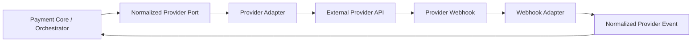
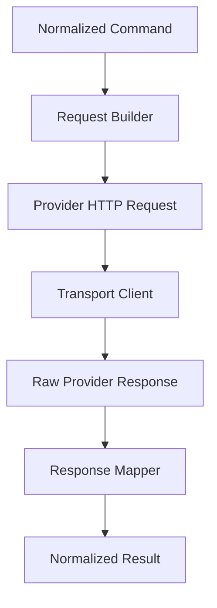

------
title: Build From Scratch: Large Production Grade Java Payment Systems - Part 014
description: Mendesain provider adapter architecture untuk payment platform: anti-corruption layer, normalized command/result, provider capability, protocol isolation, credential boundary, idempotency, webhook correlation, simulator, testing, dan adapter governance.
series: learn-java-payment-systems
seriesTitle: Build From Scratch: Large Production Grade Java Payment Systems
order: 14
partTitle: Provider Adapter Architecture
tags:
- java
- payments
- provider-adapter
- anti-corruption-layer
- integration
- payment-gateway
- webhooks
- enterprise-architecture
date: 2026-07-02
---

# Part 014 — Provider Adapter Architecture

Di part sebelumnya kita membuat orchestration engine.

Sekarang kita masuk ke boundary paling berbahaya dalam payment platform: **provider adapter**.

Provider adapter terlihat sederhana:

```java
provider.authorize(request);
```

Padahal di production, provider adapter adalah tempat sistem internal bertemu dunia luar yang:

- tidak sepenuhnya bisa dipercaya,
- tidak konsisten antar provider,
- punya SLA berbeda,
- punya error code berbeda,
- punya webhook format berbeda,
- punya authentication berbeda,
- punya idempotency behavior berbeda,
- bisa timeout setelah memproses transaksi,
- bisa mengubah API behavior antar versi,
- bisa mengirim event terlambat, duplikat, atau out of order.

Jika provider adapter didesain buruk, seluruh payment core akan tercemar provider-specific behavior.

Target kita:

> Provider boleh berbeda. Core domain tidak boleh ikut menjadi berbeda.

---

## 1. Adapter adalah Anti-Corruption Layer

Provider adapter adalah anti-corruption layer antara model internal dan model provider.



Adapter mencegah domain internal bergantung pada:

- nama field provider,
- error code provider,
- status provider,
- authentication provider,
- signature provider,
- retry/idempotency behavior provider,
- transport details provider,
- raw webhook payload provider.

Payment core tidak boleh tahu bahwa provider X menyebut authorization sebagai `preauth`, provider Y menyebut capture sebagai `settle`, dan provider Z menyebut refund sebagai `reverse`.

Core hanya boleh tahu:

```text
authorize
capture
cancel
refund
query status
```

---

## 2. Port yang Stabil

Mulai dari interface internal.

```java
public interface PaymentProviderPort {
    ProviderAuthorizeResult authorize(ProviderAuthorizeCommand command);
    ProviderCaptureResult capture(ProviderCaptureCommand command);
    ProviderCancelResult cancel(ProviderCancelCommand command);
    ProviderRefundResult refund(ProviderRefundCommand command);
    ProviderStatusResult queryStatus(ProviderStatusCommand command);
}
```

Port ini milik platform internal.

Bukan copy dari API provider.

Command internal:

```java
public record ProviderAuthorizeCommand(
        PaymentAttemptId attemptId,
        MerchantId merchantId,
        ProviderAccountId providerAccountId,
        Money amount,
        PaymentMethodSnapshot paymentMethod,
        CustomerSnapshot customer,
        OrderSnapshot order,
        ThreeDsContext threeDsContext,
        String providerReference,
        IdempotencyKey providerIdempotencyKey,
        Map<String, String> metadata
) {}
```

Result internal:

```java
public sealed interface ProviderAuthorizeResult
        permits ProviderAuthorizeApproved,
                ProviderAuthorizeRequiresAction,
                ProviderAuthorizeDeclined,
                ProviderAuthorizeFailed,
                ProviderAuthorizeUnknown {
    ProviderCode provider();
    String providerReference();
    Instant occurredAt();
}
```

Kenapa result sealed?

Agar semua outcome eksplisit.

Tidak ada `null`, tidak ada `throw Exception` untuk outcome bisnis.

---

## 3. Jangan Mengekspor Raw Provider Status

Provider status bisa berbeda:

```text
AUTHORIZED
APPROVED
PAID
CAPTURED
SETTLED
PENDING
RECEIVED
SUCCESS
COMPLETE
DECLINED
FAILED
ERROR
CANCELLED
EXPIRED
```

Jika status ini bocor ke core, core akan penuh `if provider == X`.

Adapter harus melakukan mapping ke normalized outcome.

```java
public enum NormalizedProviderOutcome {
    APPROVED,
    REQUIRES_ACTION,
    DECLINED_SOFT,
    DECLINED_HARD,
    DECLINED_RISK,
    FAILED_PROVIDER,
    UNKNOWN
}
```

Mapping harus tersimpan dan bisa dites.

```java
public final class ProviderXStatusMapper {
    public NormalizedProviderOutcome map(ProviderXResponse response) {
        return switch (response.status()) {
            case "APPROVED" -> NormalizedProviderOutcome.APPROVED;
            case "PENDING_3DS" -> NormalizedProviderOutcome.REQUIRES_ACTION;
            case "DO_NOT_HONOR" -> NormalizedProviderOutcome.DECLINED_SOFT;
            case "INVALID_CARD" -> NormalizedProviderOutcome.DECLINED_HARD;
            case "FRAUD_REJECTED" -> NormalizedProviderOutcome.DECLINED_RISK;
            default -> NormalizedProviderOutcome.UNKNOWN;
        };
    }
}
```

Default ke `UNKNOWN` lebih aman daripada default ke `FAILED`.

Kenapa?

Karena unknown menjaga kemungkinan provider sudah memproses.

---

## 4. Adapter Tidak Boleh Mengambil Keputusan Routing

Provider adapter hanya menjalankan operation terhadap provider tertentu.

Ia tidak boleh memilih provider lain.

Salah:

```java
class ProviderAAdapter {
    Result authorize(Command command) {
        try {
            return callProviderA(command);
        } catch (TimeoutException e) {
            return providerB.authorize(command); // salah
        }
    }
}
```

Benar:

```text
orchestrator decides route
adapter executes route
core applies transition
```

Kalau adapter melakukan fallback sendiri:

- route decision tidak tercatat,
- policy bypass,
- audit rusak,
- idempotency kacau,
- provider B bisa menerima request tanpa eligibility check.

---

## 5. Adapter Tidak Boleh Posting Ledger

Adapter hanya tahu external result.

Ia tidak tahu accounting model internal.

Salah:

```java
if (providerResponse.approved()) {
    ledger.postAuthorization(...); // salah di adapter
}
```

Benar:

```text
adapter -> normalized result
payment core -> state transition
ledger service -> posting berdasarkan domain event
```

Adapter bisa menyimpan operation log, tetapi bukan ledger entry.

---

## 6. Provider Account dan Credential Boundary

Satu provider bisa punya banyak account.

Contoh:

```text
provider_x merchant_category retail account
provider_x merchant_category travel account
provider_x IDR account
provider_x SGD account
provider_x high_risk account
provider_x marketplace account
```

Provider adapter tidak boleh hardcode credential.

Gunakan provider account abstraction:

```sql
create table provider_account (
    id uuid primary key,
    provider text not null,
    account_name text not null,
    country char(2),
    currency char(3),
    environment text not null,
    status text not null,
    credential_ref text not null,
    config jsonb not null default '{}',
    created_at timestamptz not null default now(),
    updated_at timestamptz not null default now(),
    unique(provider, account_name, environment)
);
```

`credential_ref` menunjuk ke secret manager/HSM/KMS, bukan menyimpan secret di database biasa.

Adapter menerima `providerAccountId`, lalu mengambil credential dari secure credential provider.

```java
public interface ProviderCredentialResolver {
    ProviderCredential resolve(ProviderAccountId accountId, ProviderOperation operation);
}
```

Credential resolution harus diaudit.

Namun secret-nya tidak boleh dilog.

---

## 7. Request Builder

Adapter perlu request builder per operation.

```java
public interface ProviderRequestBuilder<C, R> {
    R build(C command, ProviderCredential credential, ProviderAdapterConfig config);
}
```

Tugas request builder:

- map amount ke format provider,
- map currency,
- map payment method,
- map customer/order data,
- menambahkan provider reference,
- menambahkan idempotency key,
- menambahkan callback URL,
- menambahkan authentication/signature,
- enforce provider-specific required field.

Request builder harus pure sebisa mungkin.

Artinya input sama menghasilkan output sama.

Ini membuat testing jauh lebih mudah.

---

## 8. Transport Client

Pisahkan request builder dari transport client.



Transport client bertanggung jawab untuk:

- HTTP method,
- timeout,
- connection pooling,
- TLS,
- retry transport yang aman,
- response status handling,
- low-level error classification,
- metrics,
- tracing.

Jangan campur business mapping di transport client.

---

## 9. Timeout Design

Timeout harus explicit per provider dan operation.

```json
{
  "authorizeTimeoutMs": 8000,
  "captureTimeoutMs": 10000,
  "refundTimeoutMs": 15000,
  "queryStatusTimeoutMs": 5000
}
```

Timeout bukan bukti gagal.

Timeout menghasilkan `UNKNOWN` jika request mungkin sudah dikirim.

Classifier:

```java
public enum TransportOutcome {
    RESPONSE_RECEIVED,
    NOT_SENT,
    MAY_HAVE_BEEN_SENT,
    RESPONSE_UNREADABLE
}
```

Mapping:

| Transport Outcome | Normalized Result |
|---|---|
| NOT_SENT | FAILED_PROVIDER atau retry internal aman |
| MAY_HAVE_BEEN_SENT | UNKNOWN |
| RESPONSE_UNREADABLE | UNKNOWN |
| RESPONSE_RECEIVED 4xx validation | FAILED/DECLINED sesuai mapping |
| RESPONSE_RECEIVED 2xx | map provider body |

Yang sulit adalah membedakan `NOT_SENT` dan `MAY_HAVE_BEEN_SENT`.

Jika tidak yakin, pilih `UNKNOWN`.

---

## 10. Provider Idempotency

Adapter harus tahu cara provider menerima idempotency.

Contoh variasi:

```text
provider uses Idempotency-Key header
provider uses merchantReference field
provider uses requestId field
provider uses orderId uniqueness
provider has no idempotency support
provider idempotency key valid for 24 hours
provider idempotency key valid forever per account
```

Jangan buat satu asumsi global.

Gunakan strategy:

```java
public interface ProviderIdempotencyStrategy {
    ProviderIdempotencyMaterial create(
            ProviderOperation operation,
            PaymentAttemptId attemptId,
            String providerReference
    );
}
```

Material:

```java
public record ProviderIdempotencyMaterial(
        Optional<String> headerName,
        Optional<String> headerValue,
        Optional<String> bodyFieldName,
        Optional<String> bodyFieldValue,
        String uniquenessScope
) {}
```

Jika provider tidak support idempotency, risiko unknown/fallback lebih tinggi.

Capability matrix harus tahu hal ini.

---

## 11. Response Mapper

Response mapper harus menghasilkan normalized result yang kaya.

```java
public record ProviderDecline(
        NormalizedDeclineCategory category,
        String normalizedCode,
        String providerCode,
        String providerMessageSafe,
        boolean retriable,
        boolean fallbackEligible
) {}
```

Bedakan:

```text
message untuk log internal
message aman untuk merchant
message aman untuk customer
```

Raw provider message kadang berisi detail sensitif atau tidak user-friendly.

Jangan tampilkan langsung.

---

## 12. Raw Payload Storage

Haruskah raw provider request/response disimpan?

Jawabannya: tergantung sensitivitas, regulasi, dan kebutuhan audit.

Minimal simpan:

```text
request hash
response hash
provider reference
HTTP status
normalized outcome
safe response summary
redacted raw payload jika diizinkan
```

Jangan simpan:

- PAN penuh,
- CVV,
- authentication secret,
- bearer token,
- private key,
- sensitive customer data berlebih,
- raw payload tanpa redaction.

Pattern:

```java
public interface PayloadRedactor {
    String redact(String rawPayload, ProviderCode provider, ProviderOperation operation);
}
```

Redaction harus dites.

Jangan percaya regex tunggal untuk semua provider.

---

## 13. Webhook Adapter

Webhook adalah arah sebaliknya.

Provider mengirim event ke platform.

Webhook adapter bertugas:

- verify signature,
- parse payload,
- identify provider account,
- extract provider reference,
- map event type,
- normalize status,
- classify event idempotency key,
- produce `NormalizedProviderEvent`.

```java
public interface ProviderWebhookAdapter {
    WebhookVerificationResult verify(RawWebhookRequest request);
    NormalizedProviderEvent normalize(RawWebhookRequest request);
}
```

Webhook adapter tidak boleh langsung mengubah payment state.

Flow benar:

```text
raw webhook -> verify -> persist inbox -> normalize -> correlate -> apply transition via Payment Core
```

---

## 14. Webhook Signature Verification

Setiap provider punya signature scheme berbeda.

Contoh variasi:

```text
HMAC over raw body
HMAC over timestamp + body
RSA signature
shared secret in header
basic auth + IP allowlist
no signature, only mTLS/IP allowlist
```

Adapter harus memverifikasi berdasarkan raw body, bukan body hasil parse ulang.

Kesalahan umum:

```text
parse JSON -> serialize lagi -> verify signature
```

Ini bisa gagal karena whitespace/order field berubah.

Signature verification harus menggunakan byte/body asli yang diterima.

---

## 15. Webhook Correlation

Webhook harus dikorelasikan ke internal entity.

Kemungkinan key:

```text
provider_reference
provider_payment_id
merchant_reference
payment_attempt_id encoded in reference
external transaction id
virtual account number
QR reference
bank statement reference
```

Best practice internal:

```text
include deterministic platform reference in provider request whenever possible
```

Contoh:

```text
providerReference = payatt_018f...
```

Webhook mapping:

```sql
create table provider_reference_mapping (
    id uuid primary key,
    provider text not null,
    provider_account_id uuid not null,
    provider_reference text not null,
    internal_entity_type text not null,
    internal_entity_id uuid not null,
    created_at timestamptz not null default now(),
    unique(provider, provider_account_id, provider_reference)
);
```

Kalau provider tidak mengembalikan reference kita, simpan provider transaction id begitu response diterima.

---

## 16. Duplicate and Out-of-Order Events

Webhook bisa datang:

- duplikat,
- terlambat,
- out of order,
- sebelum API response selesai diproses,
- setelah manual repair,
- setelah reconciliation sudah memperbaiki state.

Jangan proses webhook hanya berdasarkan asumsi urutan.

Gunakan inbox table:

```sql
create table provider_webhook_event (
    id uuid primary key,
    provider text not null,
    provider_account_id uuid,
    provider_event_id text,
    provider_reference text,
    event_type text not null,
    raw_payload_hash text not null,
    normalized_payload jsonb,
    verification_status text not null,
    processing_status text not null,
    received_at timestamptz not null default now(),
    processed_at timestamptz,
    unique(provider, provider_account_id, provider_event_id)
);
```

Jika provider tidak punya event id, gunakan kombinasi hash dan reference dengan hati-hati.

Webhook duplicate harus idempotent.

Out-of-order event harus melewati Payment Core state machine.

Core yang menentukan transisi legal.

---

## 17. Provider Adapter Package Structure

Contoh struktur Java:

```text
payment-provider-spi/
  PaymentProviderPort.java
  ProviderAuthorizeCommand.java
  ProviderAuthorizeResult.java
  ProviderWebhookAdapter.java
  NormalizedProviderEvent.java

payment-provider-common/
  MoneyMapper.java
  ProviderErrorClassifier.java
  PayloadRedactor.java
  SignatureVerifier.java
  ProviderOperationLogger.java

payment-provider-stripe/
  StripePaymentProviderAdapter.java
  StripeAuthorizeRequestBuilder.java
  StripeResponseMapper.java
  StripeWebhookAdapter.java
  StripeSignatureVerifier.java

payment-provider-adyen/
  AdyenPaymentProviderAdapter.java
  AdyenAuthorizeRequestBuilder.java
  AdyenResponseMapper.java
  AdyenWebhookAdapter.java

payment-provider-simulator/
  SimulatorPaymentProviderAdapter.java
  SimulatorWebhookScheduler.java
```

SPI internal membuat provider baru bisa ditambahkan tanpa mengubah core.

Namun jangan over-abstract sampai semua provider feature hilang.

Abstraction harus menutupi variasi yang tidak penting bagi core, bukan menyembunyikan capability nyata.

---

## 18. Capability via Adapter Metadata

Setiap adapter bisa mengekspor capability metadata.

```java
public interface ProviderCapabilityDescriptor {
    ProviderCode provider();
    Set<ProviderOperation> supportedOperations();
    Set<PaymentMethodType> supportedPaymentMethods();
    Set<Capability> capabilities();
    ProviderIdempotencyProfile idempotencyProfile(ProviderOperation operation);
}
```

Namun runtime capability tetap sebaiknya ada di database/config.

Kenapa?

Karena capability bisa berbeda antar account/region/currency/merchant.

Adapter descriptor menjawab:

> Secara teknis adapter ini bisa apa?

Capability config menjawab:

> Untuk provider account dan merchant ini, apa yang boleh dipakai?

---

## 19. Error Classification

Jangan biarkan `IOException` naik sampai Payment Core.

Adapter harus mengubah error teknis menjadi outcome yang bermakna.

```java
public enum ProviderErrorCategory {
    VALIDATION_ERROR,
    AUTHENTICATION_ERROR,
    AUTHORIZATION_ERROR,
    RATE_LIMITED,
    PROVIDER_5XX,
    NETWORK_TIMEOUT,
    CONNECTION_REFUSED,
    TLS_ERROR,
    RESPONSE_PARSE_ERROR,
    UNKNOWN_TRANSPORT_ERROR
}
```

Mapping ke result:

| Error | Result |
|---|---|
| validation error before provider accepts payment | failed definite |
| authentication error | failed provider/config issue |
| rate limited | failed provider/retriable or deferred |
| network timeout after send | unknown |
| parse error with 200 response | unknown |
| provider 5xx | maybe failed or unknown depending semantics |

`5xx` tidak otomatis berarti payment gagal.

Jika request sudah diterima provider, outcome bisa unknown.

---

## 20. Provider Operation Log

Setiap external call harus punya operation log.

```sql
create table provider_operation_log (
    id uuid primary key,
    provider text not null,
    provider_account_id uuid not null,
    operation text not null,
    internal_entity_type text not null,
    internal_entity_id uuid not null,
    provider_reference text not null,
    idempotency_key_hash text,
    request_hash text,
    response_hash text,
    http_status int,
    transport_outcome text not null,
    normalized_outcome text,
    provider_error_code text,
    safe_error_message text,
    started_at timestamptz not null,
    finished_at timestamptz,
    created_at timestamptz not null default now(),
    unique(provider, provider_account_id, operation, provider_reference)
);
```

Operation log bukan sekadar logging.

Ia adalah evidence.

Ketika dispute operational terjadi, kita perlu tahu:

```text
apakah request dikirim?
kapan dikirim?
provider reference apa?
status HTTP apa?
apakah response diterima?
hash request/response apa?
outcome internal apa?
```

---

## 21. Adapter Configuration

Provider config harus typed, bukan map bebas di seluruh code.

```java
public record ProviderAdapterConfig(
        URI baseUrl,
        Duration authorizeTimeout,
        Duration captureTimeout,
        Duration refundTimeout,
        Duration statusTimeout,
        boolean enableIdempotencyHeader,
        boolean enableWebhookSignatureVerification,
        String webhookSecretRef,
        String apiVersion,
        Map<String, String> providerSpecificFlags
) {}
```

`providerSpecificFlags` boleh ada, tapi jangan menjadi tempat semua logic.

Kalau flag penting, naikkan menjadi field typed.

---

## 22. Simulator sebagai Adapter Pertama

Sebelum mengintegrasikan provider nyata, bangun simulator.

Simulator harus mengikuti SPI yang sama:

```java
public final class SimulatorPaymentProviderAdapter implements PaymentProviderPort {
    @Override
    public ProviderAuthorizeResult authorize(ProviderAuthorizeCommand command) {
        // deterministic scenario based on amount, metadata, or configured script
    }
}
```

Simulator harus bisa menghasilkan:

- approved,
- requires action,
- soft decline,
- hard decline,
- provider error,
- timeout,
- unknown,
- delayed webhook,
- duplicate webhook,
- out-of-order webhook,
- settlement report mismatch.

Kenapa simulator penting?

Karena provider sandbox sering tidak cukup untuk chaos testing.

Kita butuh deterministic failure.

---

## 23. Contract Test untuk Adapter

Setiap adapter harus melewati test contract yang sama.

```java
public interface PaymentProviderContractTest {
    void authorizeApprovedReturnsApproved();
    void authorizeSoftDeclineReturnsDeclinedSoft();
    void timeoutAfterSendReturnsUnknown();
    void duplicateRequestUsesSameProviderReference();
    void webhookSignatureInvalidRejected();
    void duplicateWebhookIsIdempotent();
}
```

Dengan ini, provider baru tidak boleh masuk production sebelum memenuhi behavior minimal.

Test bukan hanya unit test mapper.

Test harus mencakup:

- request builder,
- signature/auth,
- transport classification,
- response mapping,
- webhook verification,
- redaction,
- operation log,
- idempotency material.

---

## 24. Golden File Testing

Provider payload sering kompleks.

Gunakan golden file:

```text
src/test/resources/provider-x/authorize-approved-response.json
src/test/resources/provider-x/authorize-soft-decline-response.json
src/test/resources/provider-x/webhook-authorized.json
src/test/resources/provider-x/webhook-refunded.json
```

Test:

```java
@Test
void mapsApprovedResponse() {
    String raw = load("authorize-approved-response.json");
    ProviderXResponse response = parser.parse(raw);
    ProviderAuthorizeResult result = mapper.map(response);
    assertThat(result).isInstanceOf(ProviderAuthorizeApproved.class);
}
```

Golden file melindungi dari accidental mapping regression.

---

## 25. Provider Versioning

Provider API bisa punya versi.

Jangan upgrade diam-diam.

Modelkan versi:

```text
provider_code
adapter_version
provider_api_version
mapping_version
webhook_version
```

Simpan versi di operation log.

```sql
alter table provider_operation_log
add column adapter_version text,
add column provider_api_version text,
add column mapping_version text;
```

Ketika ada incident, kita bisa tahu transaksi diproses dengan mapper versi mana.

---

## 26. Rollout Provider Baru

Provider baru jangan langsung menerima 100% traffic.

Rollout:

1. adapter implemented,
2. simulator contract test pass,
3. sandbox integration pass,
4. shadow mode for non-money-moving calls,
5. canary merchant internal,
6. limited traffic percentage,
7. monitor authorization/timeout/unknown/reconciliation,
8. expand merchant/currency/method,
9. enable fallback only after evidence cukup.

Provider adapter readiness checklist:

- auth works,
- idempotency understood,
- webhook verified,
- status query works,
- refund works,
- reconciliation report understood,
- settlement report understood,
- failure modes tested,
- runbook written.

---

## 27. Sensitive Data Boundary

Provider adapter sering bersentuhan dengan data sensitif.

Prinsip:

```text
collect less
store less
log less
expose less
encrypt what remains
```

Jika card data diproses, PCI boundary harus jelas.

Jika platform tidak ingin masuk PCI scope besar, gunakan hosted fields/tokenization/provider vault agar PAN tidak lewat core payment services.

Adapter harus tahu mana data tokenized dan mana raw.

```java
public sealed interface PaymentMethodSnapshot
        permits CardTokenPaymentMethod,
                WalletPaymentMethod,
                BankTransferPaymentMethod,
                QrPaymentMethod {
}

public record CardTokenPaymentMethod(
        String token,
        String brand,
        String last4,
        String expiryMonth,
        String expiryYear
) implements PaymentMethodSnapshot {}
```

Jangan membawa raw PAN ke domain object umum.

---

## 28. Adapter Metrics

Metric per adapter:

```text
provider_request_total{provider,operation,outcome}
provider_latency_ms{provider,operation}
provider_timeout_total{provider,operation}
provider_unknown_total{provider,operation}
provider_response_parse_error_total{provider,operation}
provider_webhook_received_total{provider,event_type}
provider_webhook_verification_failed_total{provider}
provider_mapping_unknown_total{provider,operation,raw_status}
provider_redaction_failure_total{provider}
```

Metric `provider_mapping_unknown_total` sangat penting.

Jika raw status baru muncul dan mapper tidak mengenalnya, itu early warning.

---

## 29. Runbook untuk Adapter

Setiap adapter harus punya runbook.

Minimal:

```text
provider dashboard URL
credential rotation procedure
webhook secret rotation procedure
known provider status codes
timeout behavior
idempotency behavior
how to query payment status
how to replay webhook safely
how to disable provider account
how to enable maintenance mode
how to reconcile provider report
common failure signatures
escalation contact
```

Adapter tanpa runbook belum production-ready.

---

## 30. Code Skeleton

Contoh adapter sederhana:

```java
public final class ProviderXPaymentProviderAdapter implements PaymentProviderPort {

    private final ProviderXRequestBuilder requestBuilder;
    private final ProviderXClient client;
    private final ProviderXResponseMapper responseMapper;
    private final ProviderOperationLogger operationLogger;
    private final ProviderCredentialResolver credentialResolver;
    private final Clock clock;

    @Override
    public ProviderAuthorizeResult authorize(ProviderAuthorizeCommand command) {
        Instant startedAt = clock.instant();
        ProviderCredential credential = credentialResolver.resolve(
                command.providerAccountId(),
                ProviderOperation.AUTHORIZE
        );

        ProviderXAuthorizeRequest request = requestBuilder.build(command, credential);

        try {
            ProviderXAuthorizeResponse response = client.authorize(request, credential);
            ProviderAuthorizeResult result = responseMapper.mapAuthorize(response, command);
            operationLogger.logSuccess(command, request, response, result, startedAt, clock.instant());
            return result;
        } catch (ProviderTransportException e) {
            ProviderAuthorizeResult result = responseMapper.mapTransportError(e, command, startedAt);
            operationLogger.logTransportFailure(command, request, e, result, startedAt, clock.instant());
            return result;
        } catch (RuntimeException e) {
            ProviderAuthorizeResult result = new ProviderAuthorizeUnknown(
                    ProviderCode.of("provider_x"),
                    command.providerReference(),
                    clock.instant(),
                    "UNHANDLED_ADAPTER_ERROR"
            );
            operationLogger.logUnexpectedFailure(command, request, e, result, startedAt, clock.instant());
            return result;
        }
    }
}
```

Catatan:

- exception tidak langsung bocor,
- transport error diklasifikasi,
- unexpected error cenderung unknown,
- operation selalu dilog,
- provider reference tetap sama.

---

## 31. Anti-Pattern

### Anti-Pattern 1: Adapter Mengembalikan Raw JSON

```java
JsonNode authorize(Command command);
```

Core dipaksa memahami provider.

### Anti-Pattern 2: Satu Adapter Raksasa

```java
class UniversalProviderAdapter {}
```

Biasanya berakhir penuh `if provider == ...`.

Lebih baik SPI stabil + adapter spesifik.

### Anti-Pattern 3: Provider Error sebagai Exception Bisnis

Decline normal bukan exception.

Decline adalah outcome bisnis.

### Anti-Pattern 4: Webhook Langsung Update DB

Webhook harus masuk inbox dan state machine.

Langsung update status rawan duplicate/out-of-order.

### Anti-Pattern 5: Credential di Config File

Credential payment provider adalah secret kritis.

Gunakan secret manager, rotation, audit.

### Anti-Pattern 6: Tidak Ada Redaction Test

Log bocor data sensitif sering terjadi dari payload debugging.

Redaction harus menjadi test wajib.

---

## 32. Adapter Readiness Checklist

Adapter siap production jika:

- port internal stabil,
- request builder deterministic,
- response mapper lengkap,
- unknown outcome aman,
- provider idempotency dipahami,
- provider reference deterministic,
- webhook signature verified,
- webhook duplicate idempotent,
- webhook out-of-order aman,
- status query tersedia atau limitation eksplisit,
- raw payload redacted,
- operation log lengkap,
- metric tersedia,
- runbook tersedia,
- simulator scenario tersedia,
- sandbox test pass,
- canary rollout plan ada,
- kill switch/provider disable tersedia.

Jika salah satu belum ada, jangan aktifkan untuk uang nyata.

---

## 33. Kesimpulan

Provider adapter adalah boundary antara sistem internal yang harus deterministik dan dunia eksternal yang tidak selalu deterministik.

Adapter yang baik:

- melindungi core dari detail provider,
- menormalisasi command/result/event,
- mengklasifikasi error dengan aman,
- menjaga unknown outcome,
- memverifikasi webhook,
- menjaga credential boundary,
- menyimpan operation evidence,
- mendukung test contract,
- bisa diobservasi dan dioperasikan.

Mental model paling penting:

```text
Provider adapter executes.
It does not decide route.
It does not decide financial truth.
It does not post ledger.
It translates the outside world into safe internal facts.
```

Di part berikutnya kita akan memperdalam **Connector Contracts and Normalization**.

Kita akan membahas bagaimana menyusun kontrak normalized status, error, provider event, timeout, dan webhook agar semua provider bisa masuk ke platform tanpa membuat core domain rusak.

---

## Referensi

- Stripe Docs — Payment Intents API: https://docs.stripe.com/payments/payment-intents
- Stripe API Reference — Idempotent Requests: https://docs.stripe.com/api/idempotent_requests
- Adyen Docs — Webhooks: https://docs.adyen.com/development-resources/webhooks
- Adyen API Explorer — Webhooks and payment status updates: https://docs.adyen.com/api-explorer/
- Checkout.com Docs — Route Payments: https://www.checkout.com/docs/payments/manage-payments/route-payments
- PCI SSC — PCI DSS v4.0.1 publication: https://blog.pcisecuritystandards.org/just-published-pci-dss-v4-0-1
