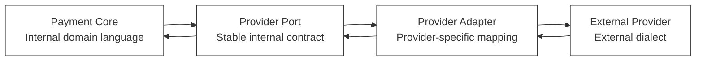
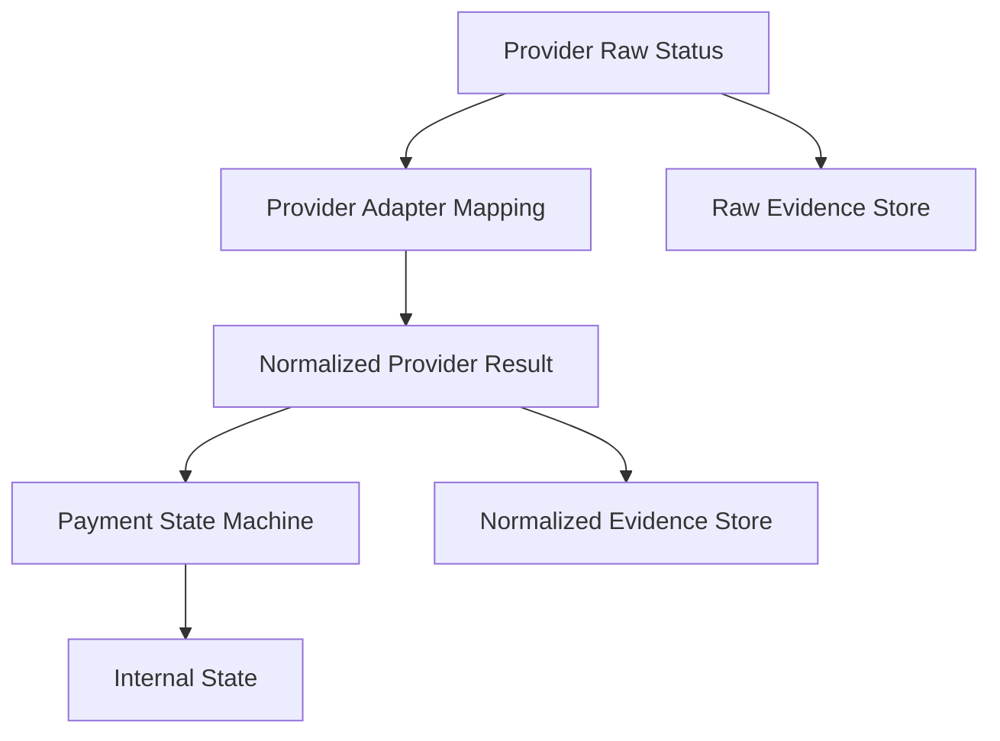
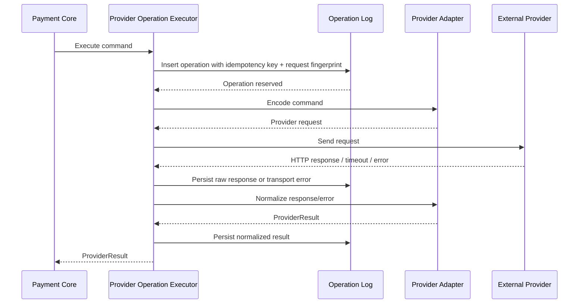
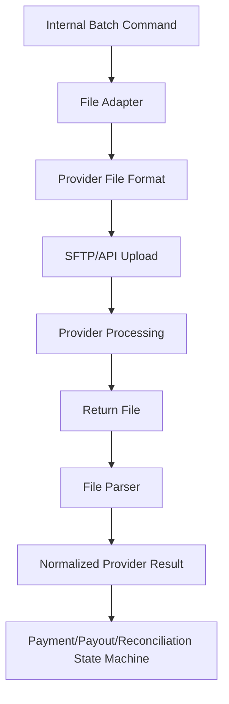
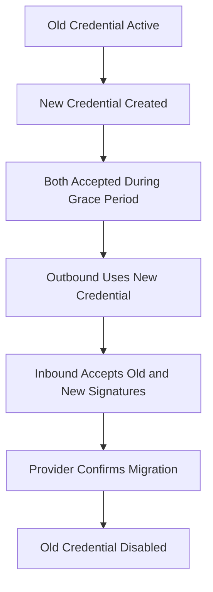

------
title: Build From Scratch: Large Production Grade Java Payment Systems - Part 015
description: Designing provider connector contracts and normalization rules so a Java payment platform can integrate many PSPs, acquirers, banks, wallets, and payment rails without leaking external semantics into the core domain.
series: learn-java-payment-systems
seriesTitle: Build From Scratch: Large Production Grade Java Payment Systems
order: 15
partTitle: Connector Contracts and Normalization
tags:
- java
- payments
- payment-systems
- provider-adapter
- anti-corruption-layer
- orchestration
- fintech
- enterprise-architecture
date: 2026-07-02
---

# Part 015 — Connector Contracts and Normalization

Production payment systems fail less often because the code is “clever”, and more often because the boundaries are honest.

A payment provider never returns your domain model.

A bank does not speak your lifecycle.

A card acquirer does not use your error taxonomy.

A wallet provider may call a state `SUCCESS`, another may call it `CAPTURED`, another may say `COMPLETED`, another may say `SETTLED`, and all four may mean different things.

The job of the provider connector is not to hide HTTP calls behind a Java interface.

The job of the provider connector is to protect the payment core from semantic contamination.

This part builds the contract layer between your internal payment platform and external payment providers.

We are not building a demo `PaymentGatewayClient`.

We are building the place where ambiguity is converted into controlled, auditable, deterministic internal facts.

---

## 1. The Core Problem

Most beginner payment integrations look like this:

```java
ProviderResponse response = providerClient.charge(request);
if (response.status().equals("SUCCESS")) {
    payment.markPaid();
} else {
    payment.markFailed();
}
```

This is not a payment system.

This is a future incident.

A production connector must answer harder questions:

1. Did the provider receive the request?
2. Did the provider create an external transaction object?
3. Is the outcome final or still pending?
4. Is the payment authorized, captured, settled, or merely accepted for processing?
5. Can the request be retried safely?
6. Is this error caused by customer action, merchant configuration, provider outage, invalid request, risk rejection, insufficient funds, authentication failure, or unknown network failure?
7. Does the provider reference map to a payment attempt, authorization, capture, refund, payout, or dispute?
8. Is the response trustworthy enough to mutate internal state?
9. Does the provider amount/currency match the internal command?
10. Does the response require webhook confirmation before finalization?

The connector must not simply expose external payloads.

It must convert external ambiguity into a normalized internal result.

---

## 2. Payment Core Must Not Speak Provider Dialect

The payment core should not contain conditions like:

```java
if (provider.equals("adyen") && eventCode.equals("AUTHORISATION") && success.equals("true")) {
    // ...
}

if (provider.equals("stripe") && status.equals("requires_capture")) {
    // ...
}

if (provider.equals("bank_x") && responseCode.equals("00")) {
    // ...
}
```

That design creates three long-term problems.

First, every provider integration becomes a distributed conditional spread across the system.

Second, state machine reasoning becomes impossible because internal transitions depend on external vocabulary.

Third, replacing or adding a provider becomes risky because the external provider becomes embedded in business logic, ledger logic, analytics, risk rules, and backoffice behavior.

The provider connector is an anti-corruption layer.



The core speaks stable domain language.

The adapter speaks provider language.

The contract between them must be explicit.

---

## 3. What the Connector Contract Owns

A provider connector contract owns five major responsibilities.

| Responsibility | Meaning |
|---|---|
| Command normalization | Convert internal command into provider request payload. |
| Response normalization | Convert provider response into internal result. |
| Error normalization | Convert provider errors, declines, and transport failures into canonical error categories. |
| Reference mapping | Map internal payment objects to provider references. |
| Evidence preservation | Store enough raw and normalized evidence for audit, support, reconciliation, and dispute analysis. |

A connector contract does not own final business truth.

The ledger owns financial truth.

The payment state machine owns lifecycle truth.

The connector owns external interaction truth.

That distinction matters.

A provider can say “success”.

Your system must still decide what that success means.

---

## 4. The Boundary Is a Financial Safety Boundary

A connector boundary is not merely a code architecture boundary.

It is a financial safety boundary.

A bad mapping can cause:

- double charge,
- false success,
- false failure,
- missed refund,
- duplicate payout,
- wrong merchant settlement,
- reconciliation break,
- invalid chargeback evidence,
- audit trail gap,
- support misdiagnosis.

The connector must therefore be designed like a control point.

Every external response should be normalized, persisted, traceable, and explainable.

---

## 5. Internal Command Model

The internal command model should be stable across providers.

A provider-specific adapter may transform it, but the orchestration engine should not.

Example commands:

```java
public sealed interface ProviderCommand
        permits AuthorizeCommand,
                CaptureCommand,
                SaleCommand,
                CancelAuthorizationCommand,
                RefundCommand,
                PayoutCommand,
                InquiryCommand {

    ProviderOperationId operationId();
    PaymentRail rail();
    ProviderAccountRef providerAccount();
    IdempotencyKey idempotencyKey();
    Instant requestedAt();
}
```

Authorization command:

```java
public record AuthorizeCommand(
        ProviderOperationId operationId,
        PaymentAttemptId attemptId,
        ProviderAccountRef providerAccount,
        PaymentRail rail,
        Money amount,
        MerchantRef merchant,
        CustomerRef customer,
        PaymentMethodRef paymentMethod,
        PaymentContext context,
        IdempotencyKey idempotencyKey,
        Instant requestedAt
) implements ProviderCommand {}
```

Capture command:

```java
public record CaptureCommand(
        ProviderOperationId operationId,
        AuthorizationId authorizationId,
        ProviderAuthorizationRef providerAuthorizationRef,
        ProviderAccountRef providerAccount,
        Money amount,
        CaptureMode captureMode,
        IdempotencyKey idempotencyKey,
        Instant requestedAt
) implements ProviderCommand {}
```

Refund command:

```java
public record RefundCommand(
        ProviderOperationId operationId,
        CaptureId captureId,
        ProviderCaptureRef providerCaptureRef,
        ProviderAccountRef providerAccount,
        Money amount,
        RefundReason reason,
        IdempotencyKey idempotencyKey,
        Instant requestedAt
) implements ProviderCommand {}
```

The command must carry everything necessary to create a provider request without reading random application state.

That makes the operation replayable, testable, and auditable.

---

## 6. Internal Result Model

A provider result should not be a raw HTTP response.

It should be a normalized semantic result.

```java
public sealed interface ProviderResult
        permits ProviderAccepted,
                ProviderAuthorized,
                ProviderCaptured,
                ProviderPending,
                ProviderRejected,
                ProviderFailed,
                ProviderUnknown,
                ProviderDuplicate {

    ProviderOperationId operationId();
    ProviderName provider();
    ProviderRawEvidence evidence();
    Instant observedAt();
}
```

Examples:

```java
public record ProviderAuthorized(
        ProviderOperationId operationId,
        ProviderName provider,
        ProviderAuthorizationRef authorizationRef,
        Money authorizedAmount,
        AuthorizationHoldPolicy holdPolicy,
        ProviderRawEvidence evidence,
        Instant observedAt
) implements ProviderResult {}
```

```java
public record ProviderCaptured(
        ProviderOperationId operationId,
        ProviderName provider,
        ProviderCaptureRef captureRef,
        Money capturedAmount,
        SettlementExpectation settlementExpectation,
        ProviderRawEvidence evidence,
        Instant observedAt
) implements ProviderResult {}
```

```java
public record ProviderPending(
        ProviderOperationId operationId,
        ProviderName provider,
        ProviderExternalRef externalRef,
        PendingReason reason,
        NextAction nextAction,
        ProviderRawEvidence evidence,
        Instant observedAt
) implements ProviderResult {}
```

```java
public record ProviderUnknown(
        ProviderOperationId operationId,
        ProviderName provider,
        UnknownReason reason,
        RetrySafety retrySafety,
        ProviderRawEvidence evidence,
        Instant observedAt
) implements ProviderResult {}
```

The important result is `ProviderUnknown`.

If your connector cannot represent unknown outcome, it will eventually lie.

And in payment systems, lying usually means money moves incorrectly.

---

## 7. Provider Status Is Not Internal State

External provider status should never be directly used as internal state.

Provider status is evidence.

Internal state is a decision.

Example:

| Provider status | Possible internal interpretation |
|---|---|
| `SUCCESS` | Could be authorized, captured, completed, accepted, settled, or only request accepted. |
| `PENDING` | Could need customer action, bank confirmation, asynchronous clearing, risk review, or provider processing. |
| `FAILED` | Could be final decline, retryable provider error, invalid request, expired payment, or unknown. |
| `CANCELLED` | Could mean customer cancelled, merchant voided, provider expired, or authorization released. |
| `SETTLED` | Could mean provider settled to merchant, scheme cleared, bank transfer credited, or internal payout completed. |

A connector must normalize the status into a canonical result and retain raw status separately.



The state machine should consume normalized results, not raw provider strings.

---

## 8. Canonical Provider Result Taxonomy

A useful normalized result taxonomy includes:

| Canonical result | Meaning | Can mutate state? |
|---|---|---|
| `ACCEPTED` | Provider accepted the request but final payment result is not known. | Usually move attempt to processing/pending. |
| `AUTHORIZED` | Funds were authorized or reserved. | Yes, create authorization. |
| `CAPTURED` | Funds were captured or sale completed. | Yes, create capture and ledger postings. |
| `PENDING` | Waiting on asynchronous action or confirmation. | Yes, but not final success/failure. |
| `REJECTED` | Provider/customer/issuer rejected request in a final way. | Yes, fail attempt with reason. |
| `FAILED_RETRYABLE` | Provider operation failed, retry may be safe depending on operation/idempotency. | Usually no final payment failure. |
| `FAILED_FINAL` | Operation failed definitively and should not be retried. | Yes, final failure. |
| `UNKNOWN` | Outcome cannot be determined from current evidence. | Move to investigation/unknown. |
| `DUPLICATE` | Provider recognized the request as duplicate/idempotent replay. | Use prior stored result. |

This taxonomy should be small enough to reason about, but expressive enough not to collapse critical differences.

---

## 9. Error Normalization

Provider error codes are not stable enough to use directly in core logic.

You need a canonical error taxonomy.

Example:

| Canonical category | Meaning | Example operational response |
|---|---|---|
| `CUSTOMER_ACTION_REQUIRED` | Customer must authenticate, choose another method, or complete off-session step. | Return `nextAction`. |
| `INSUFFICIENT_FUNDS` | Issuer/bank/wallet says funds unavailable. | Final decline or allow customer retry with another method. |
| `CARD_EXPIRED` | Payment credential no longer valid. | Ask for new method. |
| `AUTHENTICATION_FAILED` | 3DS/SCA/PIN/OTP failed. | Fail attempt or retry customer action. |
| `RISK_REJECTED` | Provider or internal risk rejected. | Block or manual review. |
| `INVALID_REQUEST` | Our request was malformed or violates provider contract. | Engineering/config incident, not customer decline. |
| `MERCHANT_CONFIGURATION_ERROR` | Merchant/provider account not configured correctly. | Operational fix. |
| `PROVIDER_RATE_LIMITED` | Provider throttled us. | Retry with backoff or route elsewhere. |
| `PROVIDER_UNAVAILABLE` | Provider outage or 5xx. | Retry/fallback/unknown. |
| `NETWORK_TIMEOUT` | Transport timeout with unknown provider receipt. | Unknown outcome handling. |
| `DUPLICATE_REQUEST` | Provider recognized duplicate idempotency key. | Load previous operation result. |
| `AMOUNT_MISMATCH` | Provider returned amount different from command. | Freeze, investigate, do not post ledger blindly. |
| `CURRENCY_UNSUPPORTED` | Provider cannot process selected currency. | Routing/config fix. |
| `COMPLIANCE_BLOCKED` | Sanctions/AML/regulatory restriction. | Block and record evidence. |
| `UNKNOWN_PROVIDER_ERROR` | No safe classification available. | Conservative unknown/failure path. |

A good taxonomy supports engineering, support, risk, finance, and product.

A bad taxonomy supports only “success or fail”.

---

## 10. Retry Safety Is a First-Class Field

Every normalized error should carry retry safety.

```java
public enum RetrySafety {
    SAFE_TO_RETRY_SAME_IDEMPOTENCY_KEY,
    SAFE_TO_RETRY_NEW_OPERATION,
    DO_NOT_RETRY,
    RETRY_ONLY_AFTER_INQUIRY,
    UNKNOWN
}
```

Why?

Because retry is not a generic infrastructure decision.

In payments, retry can create money movement.

A timeout during `GET /status` is different from a timeout during `POST /capture`.

A timeout before provider receives the request is different from a timeout after provider processed the request but before your service received the response.

Your connector rarely knows which happened.

So it must model uncertainty.

---

## 11. Unknown Outcome Is Not Failure

A common bad connector maps timeout to failure:

```java
catch (SocketTimeoutException e) {
    return ProviderFailed.finalFailure(...);
}
```

This is dangerous.

Timeout means your system did not receive a response in time.

It does not prove the provider did not process the request.

Correct behavior:

```java
catch (SocketTimeoutException e) {
    return new ProviderUnknown(
            command.operationId(),
            providerName,
            UnknownReason.TRANSPORT_TIMEOUT_AFTER_SEND,
            RetrySafety.RETRY_ONLY_AFTER_INQUIRY,
            evidenceFromException(e),
            clock.instant()
    );
}
```

An unknown outcome should trigger inquiry, webhook wait, reconciliation, or controlled manual review.

It should not become final failure unless later evidence proves failure.

---

## 12. Provider Operation Log

Every outbound provider call should have a durable operation record.

This record is not optional.

It is how you answer:

- What did we ask the provider to do?
- When did we ask?
- With which idempotency key?
- Which payload did we send?
- Which response did we get?
- Was the response normalized correctly?
- Did we retry?
- Did retry use the same idempotency key?
- Which internal entity did the operation belong to?
- Which ledger postings eventually resulted?

Schema sketch:

```sql
create table provider_operation_log (
    id uuid primary key,
    provider_name text not null,
    provider_account_id text not null,
    operation_type text not null,
    internal_entity_type text not null,
    internal_entity_id uuid not null,
    idempotency_key text not null,
    request_fingerprint text not null,
    request_payload jsonb not null,
    request_headers jsonb not null,
    http_method text,
    endpoint text,
    attempt_no integer not null default 1,
    sent_at timestamptz,
    received_at timestamptz,
    transport_status text not null,
    http_status integer,
    response_payload jsonb,
    response_headers jsonb,
    provider_reference text,
    normalized_result_type text,
    normalized_error_category text,
    retry_safety text,
    unknown_reason text,
    created_at timestamptz not null default now(),
    updated_at timestamptz not null default now(),
    unique (provider_name, provider_account_id, idempotency_key)
);

create index idx_provider_operation_entity
    on provider_operation_log (internal_entity_type, internal_entity_id);

create index idx_provider_operation_reference
    on provider_operation_log (provider_name, provider_reference);
```

The `unique` constraint is part of your financial control.

Application code should not be the only protection against duplicate provider calls.

---

## 13. Provider Reference Mapping

Provider references are not all the same.

A provider may have:

- payment id,
- transaction id,
- authorization id,
- capture id,
- refund id,
- dispute id,
- payout id,
- batch id,
- settlement id,
- webhook event id,
- merchant account id,
- customer token id.

Do not store them all in one vague column called `external_id`.

Use explicit mapping.

```sql
create table provider_reference_map (
    id uuid primary key,
    provider_name text not null,
    provider_account_id text not null,
    provider_reference_type text not null,
    provider_reference_value text not null,
    internal_entity_type text not null,
    internal_entity_id uuid not null,
    first_seen_operation_id uuid,
    first_seen_event_id uuid,
    created_at timestamptz not null default now(),
    unique (
        provider_name,
        provider_account_id,
        provider_reference_type,
        provider_reference_value
    )
);

create index idx_provider_reference_internal
    on provider_reference_map (internal_entity_type, internal_entity_id);
```

This protects correlation.

Correlation is the foundation of webhook processing, inquiry, reconciliation, and support.

---

## 14. Amount and Currency Normalization

A connector must not silently accept amount mismatch.

Example command:

```json
{
  "amount": {
    "currency": "IDR",
    "minor": 12500000
  }
}
```

Provider response:

```json
{
  "status": "SUCCESS",
  "amount": 125000,
  "currency": "IDR"
}
```

Is `125000` major units or minor units?

Is this provider returning rupiah as whole units?

Is this amount equal or 100x smaller?

Never guess inside the payment core.

Each adapter must explicitly own provider amount representation.

```java
public interface ProviderAmountCodec {
    ProviderAmount encode(Money internalMoney);
    Money decode(ProviderAmount providerAmount);
}
```

Provider amount conversion must be tested with golden cases for every supported currency.

Especially currencies with unusual minor units.

---

## 15. Time Normalization

Provider timestamps can differ in:

- timezone,
- precision,
- event time vs processing time,
- settlement date vs transaction date,
- business date vs calendar date,
- provider-created time vs provider-updated time,
- file cutoff date.

Your connector should normalize time fields explicitly.

```java
public record ProviderTimeEvidence(
        Instant providerCreatedAt,
        Instant providerUpdatedAt,
        LocalDate providerBusinessDate,
        ZoneId providerBusinessZone,
        Instant observedAt
) {}
```

Do not use provider timestamp as the only ordering mechanism.

Webhook delivery order is not a reliable source of truth.

State transitions must be guarded by legal transition rules.

---

## 16. Identifier Normalization

A connector should distinguish identifiers by type.

Bad:

```java
String externalId;
```

Better:

```java
public record ProviderPaymentRef(String value) {}
public record ProviderAuthorizationRef(String value) {}
public record ProviderCaptureRef(String value) {}
public record ProviderRefundRef(String value) {}
public record ProviderPayoutRef(String value) {}
public record ProviderDisputeRef(String value) {}
public record ProviderEventRef(String value) {}
```

The compiler cannot prevent every financial bug.

But it can prevent some very expensive confusion.

---

## 17. Provider Capability Matrix

Not every provider supports every operation.

Even if a provider supports an operation, it may support it only for certain:

- countries,
- currencies,
- payment methods,
- merchant categories,
- merchant accounts,
- transaction types,
- amount ranges,
- authentication modes,
- capture modes,
- settlement models.

Represent this explicitly.

```sql
create table provider_capability (
    id uuid primary key,
    provider_name text not null,
    provider_account_id text not null,
    rail text not null,
    payment_method_type text not null,
    operation_type text not null,
    country_code text,
    currency text,
    min_amount_minor bigint,
    max_amount_minor bigint,
    capture_mode text,
    enabled boolean not null default true,
    effective_from timestamptz not null,
    effective_to timestamptz,
    created_at timestamptz not null default now()
);
```

The orchestration engine should route based on capability.

The connector should fail safely if the command violates provider capability.

---

## 18. Request Fingerprint

Idempotency key alone is insufficient.

If the same idempotency key is reused with a different payload, your system must detect it.

```java
public record RequestFingerprint(String sha256) {
    public static RequestFingerprint ofCanonicalJson(String canonicalJson) {
        return new RequestFingerprint(Sha256.hex(canonicalJson));
    }
}
```

Store:

- command type,
- amount,
- currency,
- internal entity id,
- merchant id,
- provider account,
- operation type,
- normalized payload.

A reused idempotency key with a different fingerprint is not a retry.

It is a conflict.

---

## 19. Connector Execution Flow

A robust connector execution flow looks like this:



The key detail: operation reservation happens before sending the external request.

If your service crashes after sending but before storing response, you still have a durable record that an operation may have reached the provider.

That record can be repaired by inquiry, webhook, or reconciliation.

---

## 20. Java Provider Port

The provider port should be boring.

Boring is good.

```java
public interface PaymentProviderPort {

    ProviderResult authorize(AuthorizeCommand command);

    ProviderResult capture(CaptureCommand command);

    ProviderResult sale(SaleCommand command);

    ProviderResult cancelAuthorization(CancelAuthorizationCommand command);

    ProviderResult refund(RefundCommand command);

    ProviderResult payout(PayoutCommand command);

    ProviderInquiryResult inquire(InquiryCommand command);
}
```

Do not return provider-specific SDK objects.

Do not throw provider-specific exceptions across the boundary.

Do not let provider-specific enums leak into the payment core.

---

## 21. Adapter Implementation Pattern

Each adapter can be structured as:

```text
provider-adapter-<provider>/
  src/main/java/...
    ProviderXPaymentAdapter.java
    ProviderXRequestMapper.java
    ProviderXResponseNormalizer.java
    ProviderXErrorNormalizer.java
    ProviderXWebhookNormalizer.java
    ProviderXAmountCodec.java
    ProviderXSignatureVerifier.java
    ProviderXCapabilityReader.java
    ProviderXConfig.java
  src/test/resources/golden/
    authorize-success.json
    authorize-timeout.json
    capture-success.json
    refund-pending.json
    webhook-captured.json
    webhook-failed.json
```

Keep mapping code explicit.

Avoid magical generic mappers for financial semantics.

A mapping bug in a payment adapter is not just a serialization bug.

It can move money incorrectly.

---

## 22. Response Normalizer Example

```java
public final class ProviderXResponseNormalizer {

    public ProviderResult normalizeAuthorize(
            AuthorizeCommand command,
            ProviderXHttpResponse response,
            ProviderRawEvidence evidence,
            Instant observedAt
    ) {
        if (response.httpStatus() >= 500) {
            return new ProviderUnknown(
                    command.operationId(),
                    ProviderName.PROVIDER_X,
                    UnknownReason.PROVIDER_SERVER_ERROR_AFTER_SEND,
                    RetrySafety.RETRY_ONLY_AFTER_INQUIRY,
                    evidence,
                    observedAt
            );
        }

        ProviderXBody body = response.body();

        return switch (body.status()) {
            case "AUTHORIZED" -> new ProviderAuthorized(
                    command.operationId(),
                    ProviderName.PROVIDER_X,
                    new ProviderAuthorizationRef(body.authorizationId()),
                    amountCodec.decode(body.amount()),
                    AuthorizationHoldPolicy.fromProvider(body.holdExpiresAt()),
                    evidence,
                    observedAt
            );
            case "PENDING_3DS" -> new ProviderPending(
                    command.operationId(),
                    ProviderName.PROVIDER_X,
                    new ProviderExternalRef(body.paymentId()),
                    PendingReason.CUSTOMER_AUTHENTICATION_REQUIRED,
                    NextAction.redirect(body.redirectUrl()),
                    evidence,
                    observedAt
            );
            case "DECLINED" -> new ProviderRejected(
                    command.operationId(),
                    ProviderName.PROVIDER_X,
                    errorNormalizer.normalize(body.errorCode()),
                    evidence,
                    observedAt
            );
            default -> new ProviderUnknown(
                    command.operationId(),
                    ProviderName.PROVIDER_X,
                    UnknownReason.UNMAPPED_PROVIDER_STATUS,
                    RetrySafety.RETRY_ONLY_AFTER_INQUIRY,
                    evidence,
                    observedAt
            );
        };
    }
}
```

Notice the default case.

Unmapped status becomes unknown.

It does not become failure.

It does not become success.

It becomes a controlled problem.

---

## 23. Error Normalizer Example

```java
public final class ProviderXErrorNormalizer {

    public NormalizedProviderError normalize(String code) {
        return switch (code) {
            case "05" -> decline("ISSUER_DECLINED", RetrySafety.DO_NOT_RETRY);
            case "51" -> decline("INSUFFICIENT_FUNDS", RetrySafety.DO_NOT_RETRY);
            case "14" -> decline("INVALID_CARD", RetrySafety.DO_NOT_RETRY);
            case "3DS_FAILED" -> customerAction("AUTHENTICATION_FAILED");
            case "RATE_LIMIT" -> provider("PROVIDER_RATE_LIMITED", RetrySafety.SAFE_TO_RETRY_SAME_IDEMPOTENCY_KEY);
            case "TIMEOUT" -> unknown("PROVIDER_TIMEOUT", RetrySafety.RETRY_ONLY_AFTER_INQUIRY);
            default -> unknown("UNMAPPED_PROVIDER_ERROR", RetrySafety.UNKNOWN);
        };
    }
}
```

The normalizer should be data-backed where possible, but not blindly dynamic.

A payment error catalog is configuration with safety impact.

It needs review, testing, and rollout control.

---

## 24. Provider Error Catalog

Schema sketch:

```sql
create table provider_error_catalog (
    id uuid primary key,
    provider_name text not null,
    provider_error_code text not null,
    provider_error_message_pattern text,
    operation_type text,
    canonical_category text not null,
    canonical_reason text not null,
    retry_safety text not null,
    customer_visible boolean not null default false,
    internal_remediation text,
    active boolean not null default true,
    version integer not null,
    created_at timestamptz not null default now(),
    unique (provider_name, provider_error_code, operation_type, version)
);
```

Do not allow arbitrary production edits without audit.

Changing error mapping can change retry behavior, customer experience, provider cost, and financial correctness.

---

## 25. Raw Evidence Preservation

The adapter should preserve raw evidence.

```java
public record ProviderRawEvidence(
        String providerName,
        String endpoint,
        String httpMethod,
        Integer httpStatus,
        Map<String, String> headers,
        String rawRequestBody,
        String rawResponseBody,
        String transportErrorClass,
        String transportErrorMessage,
        Instant sentAt,
        Instant receivedAt
) {}
```

Redact secrets.

Do not log PAN, CVV, full auth credentials, private keys, or bearer tokens.

But keep enough evidence for support, audit, and reconciliation.

Evidence should be immutable after creation.

If you need correction, append another record.

---

## 26. Normalized Evidence Preservation

Raw evidence is not enough.

You also need normalized evidence.

```sql
create table provider_normalized_result (
    id uuid primary key,
    operation_id uuid not null references provider_operation_log(id),
    result_type text not null,
    canonical_error_category text,
    canonical_error_reason text,
    retry_safety text,
    provider_reference_type text,
    provider_reference_value text,
    amount_currency char(3),
    amount_minor bigint,
    pending_reason text,
    next_action jsonb,
    normalized_payload jsonb not null,
    created_at timestamptz not null default now()
);
```

This lets you answer:

- What did the adapter believe the provider response meant?
- Which version of mapping created that interpretation?
- Did the interpretation later change?

For highly regulated systems, mapping version should also be recorded.

---

## 27. Mapping Versioning

Provider mappings change.

Provider docs change.

Provider behavior changes.

Your adapter must treat mapping as versioned behavior.

```java
public record NormalizationMetadata(
        ProviderName provider,
        String adapterVersion,
        String mappingVersion,
        Instant normalizedAt
) {}
```

This is useful when investigating incidents.

Example question:

> Why did transactions between 09:00 and 09:17 get marked as failed even though provider later settled them?

You may discover that mapping version `2026.07.02-1` classified provider code `PENDING_SETTLEMENT` incorrectly.

Without mapping version, you have only guesswork.

---

## 28. Provider SDKs Are Not Your Domain Boundary

Using a provider SDK is fine.

Letting the SDK become your domain boundary is not.

SDK objects often encode provider-specific assumptions:

- enum names,
- request field names,
- exception types,
- retry behavior,
- auth configuration,
- response object structure,
- logging behavior,
- hidden defaults.

Wrap SDK usage inside the adapter.

The rest of the platform should not know whether the adapter uses:

- raw HTTP,
- generated OpenAPI client,
- official SDK,
- message queue,
- file upload,
- host-to-host protocol.

---

## 29. File-Based Providers

Not all provider integrations are synchronous HTTP.

Some payment rails depend on files:

- settlement files,
- bank statements,
- clearing files,
- payout batch files,
- return files,
- dispute files,
- remittance files.

The same contract principles apply.



A file parser is also a provider adapter.

It must preserve raw evidence, normalize results, map references, and handle unknowns.

---

## 30. Asynchronous Provider Contracts

Some provider commands do not return final result.

Example:

```text
POST /bank-transfer-collection
-> 202 Accepted
-> customer pays later
-> webhook or statement confirms payment
```

The normalized result should be `ProviderAccepted` or `ProviderPending`, not `ProviderCaptured`.

```java
public record ProviderAccepted(
        ProviderOperationId operationId,
        ProviderName provider,
        ProviderExternalRef externalRef,
        AcceptanceMeaning meaning,
        ProviderRawEvidence evidence,
        Instant observedAt
) implements ProviderResult {}
```

`Accepted` means provider has accepted the instruction.

It does not mean money moved.

This distinction prevents false success.

---

## 31. Synchronous Provider Contracts

Some provider commands may return final result immediately.

Example:

```text
POST /card-sale
-> 200 OK
-> approved and captured
```

Even then, connector should not bypass the state machine.

The response becomes normalized evidence.

The state machine decides the internal transition.

Ledger posting should happen through internal rules, not directly inside the adapter.

---

## 32. Connector Should Not Post Ledger Entries

This is a hard rule.

Provider adapter should not post ledger entries.

Why?

Because the adapter only knows external interaction.

It does not own:

- merchant balance model,
- fee model,
- reserve policy,
- settlement rules,
- platform revenue accounting,
- risk hold policy,
- correction policy.

The adapter can say:

> Provider X confirms capture of ID C for IDR 125,000.

The payment core and ledger decide:

> Debit customer receivable, credit merchant pending, credit fee revenue, etc.

Keep money accounting in one place.

---

## 33. Connector Should Not Decide Product UX

Provider adapter should not return provider-native error messages directly to customer.

Provider messages can be:

- too technical,
- inconsistent,
- misleading,
- unsafe,
- non-localized,
- compliance-sensitive,
- exposing risk logic.

Return normalized customer action.

```java
public record CustomerActionHint(
        CustomerActionType type,
        String userSafeCode,
        Map<String, String> parameters
) {}
```

Example:

| Provider error | Internal category | Customer safe message key |
|---|---|---|
| `05 Do not honor` | `ISSUER_DECLINED` | `payment_method_declined` |
| `51 Insufficient funds` | `INSUFFICIENT_FUNDS` | `insufficient_funds` |
| `3DS_AUTH_FAILED` | `AUTHENTICATION_FAILED` | `authentication_failed` |
| `MERCHANT_NOT_ENABLED` | `MERCHANT_CONFIGURATION_ERROR` | no customer message; internal incident |

---

## 34. Connector Configuration

Provider configuration should be explicit and environment-scoped.

```sql
create table provider_account (
    id uuid primary key,
    provider_name text not null,
    merchant_id uuid,
    environment text not null,
    account_reference text not null,
    settlement_currency char(3),
    country_code char(2),
    enabled boolean not null default true,
    created_at timestamptz not null default now(),
    unique (provider_name, environment, account_reference)
);
```

Secrets should not live in this table.

Store secret references, not secret values.

```sql
create table provider_credential_ref (
    id uuid primary key,
    provider_account_id uuid not null references provider_account(id),
    credential_type text not null,
    secret_manager_path text not null,
    key_version text,
    active boolean not null default true,
    created_at timestamptz not null default now()
);
```

---

## 35. Credential Rotation

Connector contracts must support credential rotation.

Do not design an adapter that assumes one static API key forever.

Provider integrations may require rotation of:

- API keys,
- HMAC secrets,
- OAuth client secrets,
- mTLS certificates,
- PGP keys,
- SFTP keys,
- signing keys,
- encryption keys.

Rotation design:



Webhook signature verification often needs dual-key validation during rotation.

Part 016 will go deeper into webhook verification.

---

## 36. Connector Health

Provider health is not just HTTP uptime.

Payment provider health includes:

- authorization success rate,
- timeout rate,
- p95/p99 latency,
- webhook delay,
- settlement file delay,
- reconciliation break rate,
- decline rate by reason,
- unknown outcome count,
- duplicate response count,
- provider error code distribution,
- retry success rate,
- capture/refund/payout failure rate.

The adapter should emit normalized metrics.

```text
payment.provider.operation.count{provider,operation,result}
payment.provider.operation.latency{provider,operation}
payment.provider.unknown.count{provider,operation,reason}
payment.provider.error.count{provider,canonical_category}
payment.provider.webhook.delay{provider,event_type}
payment.provider.mapping.unmapped_status.count{provider,status}
```

A provider can be technically reachable but financially unhealthy.

---

## 37. Adapter Contract Tests

Every provider adapter should have contract tests.

The tests should verify:

- request encoding,
- amount encoding,
- idempotency header propagation,
- auth/signature logic,
- success response mapping,
- pending response mapping,
- final decline mapping,
- retryable error mapping,
- timeout mapping,
- unknown status mapping,
- provider reference extraction,
- raw evidence preservation,
- redaction,
- webhook normalization,
- duplicate event handling.

Golden file example:

```text
src/test/resources/golden/provider-x/authorize-success/
  command.json
  provider-request.json
  provider-response.json
  normalized-result.json
```

Golden files make adapter behavior reviewable.

They also help detect accidental mapping changes.

---

## 38. Simulator-Backed Testing

A provider simulator should be part of your platform.

Not a fake mock.

A simulator.

It should support:

- deterministic success,
- deterministic decline,
- delayed response,
- timeout after processing,
- timeout before processing,
- duplicate response,
- out-of-order webhook,
- missing webhook,
- incorrect amount response,
- unknown provider status,
- provider rate limit,
- malformed payload,
- settlement file mismatch.

Adapters should be tested against this simulator before production provider certification.

Part 059 will build this more completely.

---

## 39. Provider Onboarding Checklist

Before enabling a provider in production, require answers to these questions.

### 39.1 Lifecycle

- Which operations are supported?
- Which operations are synchronous?
- Which operations are asynchronous?
- Which provider statuses are final?
- Which statuses are intermediate?
- Which statuses are ambiguous?
- Does capture require prior authorization?
- Does void differ from refund?
- Does refund support partial amount?
- Does refund support multiple partial refunds?
- Does payout support reversal?

### 39.2 Idempotency

- Does provider support idempotency key?
- What is the idempotency retention period?
- What happens if the same key is reused with a different payload?
- Which operations are idempotent?
- Which operations are not?
- Does provider return same response for replay?

### 39.3 Webhook

- Does provider send webhooks?
- Are webhooks retried?
- How long are they retried?
- Is delivery ordered?
- Is there an event id?
- Is there a signature?
- Can events be replayed manually?
- Is there a dashboard for failed webhook delivery?

### 39.4 Reconciliation

- Are settlement reports available?
- What file format?
- What timezone?
- What cutoff?
- What identifiers are included?
- Are fees included gross or net?
- Are chargebacks included?
- Are refunds included by original transaction reference?
- How are reversals represented?

### 39.5 Operational

- Is sandbox behavior equivalent to production?
- Are error codes documented?
- Are test cards/accounts available?
- Is there rate limiting?
- Is there maintenance notification?
- Is there incident communication?
- Is there support escalation?

---

## 40. Provider Mapping Review

Provider mapping should be reviewed like business logic, not like glue code.

Reviewers should include:

- payment engineer,
- backend engineer,
- risk/compliance representative when needed,
- finance/reconciliation representative when needed,
- support/operations representative when customer-visible statuses change.

Mapping errors usually surface outside engineering first.

Finance sees settlement mismatch.

Support sees confused customers.

Risk sees blocked legitimate payments.

Operations sees manual repair queues increasing.

Design the review process accordingly.

---

## 41. Common Anti-Patterns

### 41.1 One `status` Field to Rule Them All

Bad:

```sql
provider_status text
```

Better:

```sql
provider_raw_status text,
normalized_result_type text,
internal_state_after_processing text
```

Keep raw evidence, normalized interpretation, and internal decision separate.

### 41.2 Treating Timeout as Failure

Timeout is unknown.

Failure requires evidence.

### 41.3 Provider SDK Types in Core

If your core imports `com.providerx.PaymentIntent`, your boundary has leaked.

### 41.4 Logging Raw Secrets

Provider payloads may contain sensitive fields.

Redaction is part of adapter implementation.

### 41.5 Mapping Unknown Status to Failed

Unknown status should trigger investigation or inquiry.

Default failure is not safe.

### 41.6 Ignoring Amount Mismatch

If the provider confirms a different amount than requested, freeze and investigate.

Do not “fix” it silently.

### 41.7 No Operation Log

Without operation log, you cannot distinguish:

- request never sent,
- request sent but timed out,
- provider processed but response lost,
- retry created duplicate,
- webhook confirmed later.

---

## 42. Failure Model

| Failure | Bad behavior | Correct connector behavior |
|---|---|---|
| Provider timeout after request sent | Mark failed | Mark unknown and schedule inquiry. |
| Provider returns new status | Default to success/fail | Mark unknown/unmapped and alert. |
| Provider returns amount mismatch | Accept provider response | Freeze operation and require investigation. |
| Provider returns duplicate request | Create second attempt | Load prior operation result. |
| Provider SDK throws exception | Leak exception to core | Normalize transport/provider error. |
| Provider webhook references unknown transaction | Drop event | Store raw event and attempt correlation repair. |
| Provider changes error code meaning | Continue old behavior silently | Version mapping and detect distribution anomaly. |
| Credential expires | All operations fail as customer declines | Classify as merchant/provider configuration incident. |

---

## 43. Production-Grade Connector Invariants

A connector is production-grade when these invariants hold:

1. Raw provider payload is preserved with safe redaction.
2. Provider statuses never directly become internal payment states.
3. Every outbound operation has an idempotency key.
4. Every outbound operation has a request fingerprint.
5. Every outbound operation has a durable operation log.
6. Timeout is represented as unknown unless proven otherwise.
7. Amount and currency mismatch is not silently accepted.
8. Provider reference type is explicit.
9. Retry safety is explicit.
10. Unknown statuses are surfaced, not hidden.
11. Mapping version is traceable.
12. Adapter tests cover success, failure, pending, unknown, duplicate, and malformed cases.
13. Provider-specific objects do not leak into the payment core.
14. Webhook processing uses the same normalization philosophy.
15. Ledger posting is never done inside the provider adapter.

---

## 44. Minimal Implementation Order

Build provider contracts in this order:

1. Define internal commands.
2. Define normalized result taxonomy.
3. Define canonical error taxonomy.
4. Define operation log schema.
5. Define provider reference mapping schema.
6. Implement one adapter using explicit mapping.
7. Build golden file tests.
8. Build simulator tests.
9. Add metrics for unknowns, failures, retries, and unmapped statuses.
10. Add provider onboarding checklist.
11. Add mapping versioning.
12. Add operations dashboard.

Do not start with twenty providers.

Start with one provider and make the boundary correct.

Then add the second provider.

The second provider will reveal whether your abstraction is real or accidental.

---

## 45. Mental Model

A provider connector is a translator, witness, and guardrail.

It translates external dialect into internal language.

It witnesses what happened at the boundary.

It guards the core from unsafe assumptions.

A bad connector says:

> Provider returned success, so payment succeeded.

A good connector says:

> Provider returned code X with reference Y for operation Z at time T. Under mapping version M, this means authorized amount A, not captured, retry not needed, and the state machine may now evaluate transition from `AUTHORIZING` to `AUTHORIZED`.

That is the level of precision required for enterprise payment systems.

---

## 46. Exercises

1. Pick one real provider API and list all statuses for authorization, capture, refund, and payout.
2. Classify each provider status into canonical result taxonomy.
3. Identify at least five statuses that are ambiguous without operation context.
4. Design a `provider_reference_map` for card, bank transfer, QR, wallet, refund, payout, and dispute.
5. Write golden tests for timeout, duplicate idempotency, final decline, pending authentication, and unknown provider status.
6. Add a mapping version to normalized result records.
7. Build a small Java adapter that maps raw JSON payloads into sealed `ProviderResult` records.

---

## 47. Part 015 Summary

The connector contract is where external payment ambiguity becomes controlled internal evidence.

Do not let provider language leak into the core.

Do not collapse unknown into failure.

Do not collapse accepted into paid.

Do not collapse provider status into internal state.

Keep raw evidence, normalized interpretation, and internal decision separate.

That separation is one of the main differences between a demo integration and a production payment platform.

In the next part, we will apply the same discipline to webhook ingestion.

Webhooks are where providers push truth back into your system.

They are also where duplicates, replay attacks, out-of-order delivery, delayed events, signature failures, and correlation gaps appear.

---

## References

- Stripe Docs — Idempotent requests: https://docs.stripe.com/api/idempotent_requests
- Stripe Docs — Receive Stripe events in your webhook endpoint: https://docs.stripe.com/webhooks
- Adyen Docs — Webhooks: https://docs.adyen.com/development-resources/webhooks
- Adyen Docs — Handle webhook events: https://docs.adyen.com/development-resources/webhooks/handle-webhook-events
- Adyen Docs — API idempotency: https://docs.adyen.com/development-resources/api-idempotency
- AWS Builders Library — Making retries safe with idempotent APIs: https://aws.amazon.com/builders-library/making-retries-safe-with-idempotent-APIs/
- PayPal Developer — Webhooks guide: https://developer.paypal.com/api/rest/webhooks/
