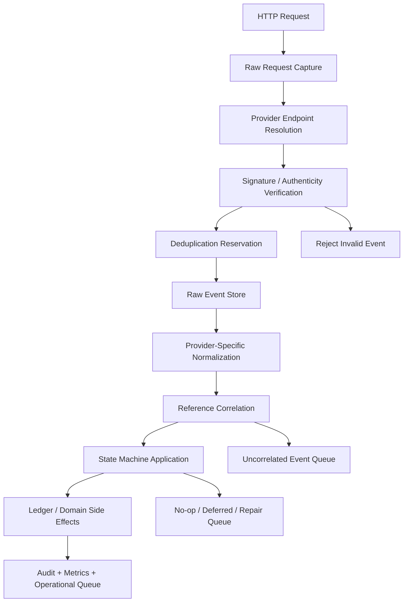
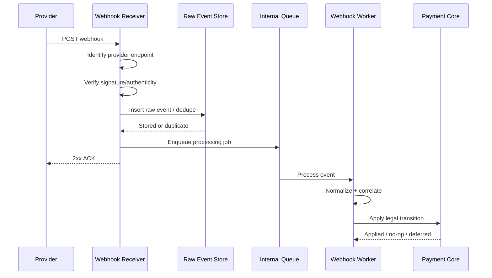
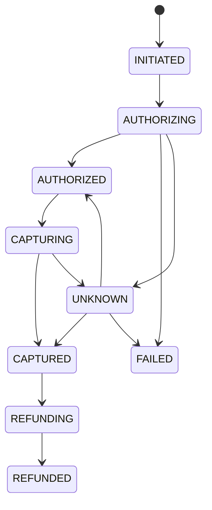
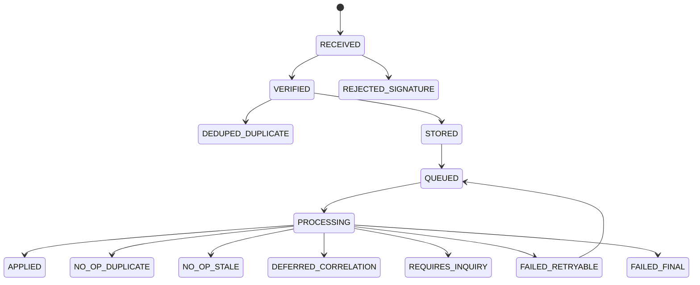
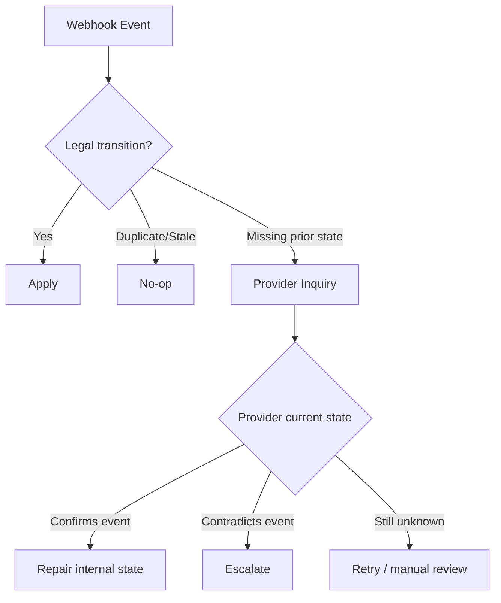
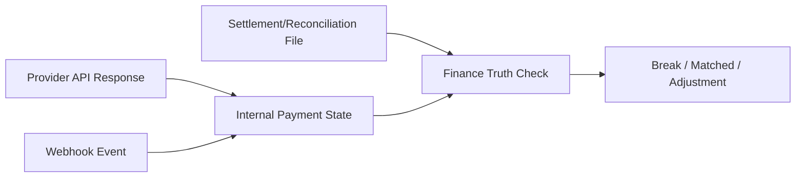

------
title: Build From Scratch: Large Production Grade Java Payment Systems - Part 016
description: Building a production-grade webhook ingestion engine for Java payment systems with raw event durability, signature verification, deduplication, ordering tolerance, correlation, replay protection, state-machine application, and operational repair.
series: learn-java-payment-systems
seriesTitle: Build From Scratch: Large Production Grade Java Payment Systems
order: 16
partTitle: Webhook Ingestion Engine
tags:
- java
- payments
- webhooks
- event-ingestion
- idempotency
- provider-adapter
- payment-systems
- fintech
date: 2026-07-02
---

# Part 016 — Webhook Ingestion Engine

A webhook is not a notification.

In payment systems, a webhook is often late-arriving financial evidence.

It may confirm that money was authorized.

It may confirm that money was captured.

It may tell you a bank transfer arrived.

It may tell you a refund failed.

It may tell you a payout was rejected.

It may tell you a dispute opened.

It may also be duplicate, out of order, forged, delayed, malformed, or impossible to correlate.

A production webhook ingestion engine must assume hostile conditions.

Not because providers are bad.

Because networks, retries, async systems, dashboards, manual replays, and long-running financial processes make perfect delivery impossible.

This part designs the webhook pipeline from raw HTTP request to safe internal state transition.

---

## 1. The Core Problem

Most beginner webhook handlers look like this:

```java
@POST
@Path("/webhooks/provider-x")
public Response handle(String body) {
    ProviderEvent event = parse(body);

    if (event.status().equals("SUCCESS")) {
        paymentService.markPaid(event.paymentId());
    }

    return Response.ok().build();
}
```

This is dangerous.

It assumes:

- the event is authentic,
- the event is not duplicated,
- the event is in order,
- the event maps to an internal payment,
- the provider status means internal success,
- processing succeeds atomically,
- returning HTTP 200 means your domain state is safe,
- no one will replay an old event,
- no provider will send a new event type,
- the same event will never arrive after manual repair.

Production webhook design starts from the opposite assumptions.

Assume the event may be real but duplicate.

Assume it may be real but old.

Assume it may be real but not enough to transition state.

Assume it may be real but impossible to correlate yet.

Assume it may be fake.

Assume your own service may crash halfway.

---

## 2. Webhook Ingestion Is a Pipeline, Not a Handler

A webhook handler should be a small entry point into a durable pipeline.



Do not try to finish all domain processing synchronously inside the HTTP request.

Durability first.

Verification second.

Deduplication third.

Domain processing after that.

---

## 3. Webhook Truth Is Evidence, Not Final Truth

A webhook is evidence from a provider.

It is not automatically internal truth.

Internal truth still requires:

- authenticity check,
- deduplication,
- normalization,
- correlation,
- legal state transition,
- amount/currency validation,
- ledger posting rules,
- audit trail.

Provider event:

```json
{
  "eventType": "payment.captured",
  "paymentId": "pay_123",
  "amount": 125000,
  "currency": "IDR"
}
```

Internal interpretation:

```text
Provider event pay_123 says capture succeeded.
This event is authentic.
This event has not been processed before.
pay_123 maps to internal capture C.
Amount and currency match capture command.
Capture C is currently CAPTURING.
Transition CAPTURING -> CAPTURED is legal.
Ledger postings for capture have not been posted before.
Apply transition and post ledger entries idempotently.
```

That is the difference between a webhook handler and a webhook ingestion engine.

---

## 4. Acknowledgement Semantics

HTTP acknowledgement is a contract with the provider.

Returning `2xx` usually tells the provider:

> We received this event. You do not need to retry this delivery.

Returning non-`2xx` usually tells the provider:

> Delivery failed. Retry later if your retry policy allows.

This creates an important design question:

When should your system return `2xx`?

A practical rule:

Return `2xx` only after the event has passed minimal authenticity checks and has been durably recorded or intentionally classified as duplicate/no-op.

Do not require all downstream business processing to finish before acknowledgement.

Why?

Because a slow ledger posting, downstream lock, or temporary domain failure should not cause the provider to hammer your endpoint with duplicates if you have already safely captured the event.

But do not return `2xx` before durable storage.

If you acknowledge and then crash before storing the event, the provider may not retry, and you may lose financial evidence.

---

## 5. Recommended HTTP Flow



This design separates provider delivery from domain processing.

The receiver is optimized for safe capture.

The worker is optimized for correct interpretation.

---

## 6. Raw Event Store

Raw event storage is mandatory.

Schema sketch:

```sql
create table provider_webhook_raw_event (
    id uuid primary key,
    provider_name text not null,
    provider_account_id text,
    endpoint_id text not null,
    received_at timestamptz not null default now(),
    http_method text not null,
    request_path text not null,
    query_string text,
    headers jsonb not null,
    raw_body bytea not null,
    raw_body_sha256 text not null,
    remote_ip inet,
    signature_status text not null,
    signature_key_version text,
    provider_event_id text,
    provider_event_type text,
    provider_event_time timestamptz,
    dedupe_key text not null,
    duplicate_of uuid,
    processing_status text not null,
    processing_attempts integer not null default 0,
    last_processing_error text,
    created_at timestamptz not null default now(),
    unique (provider_name, endpoint_id, dedupe_key)
);

create index idx_webhook_processing_status
    on provider_webhook_raw_event (processing_status, received_at);

create index idx_webhook_provider_event
    on provider_webhook_raw_event (provider_name, provider_event_id);
```

Store the raw body as bytes.

Do not parse and re-serialize before signature verification.

Many webhook signatures depend on the exact raw payload bytes.

---

## 7. Signature Verification

Signature verification answers:

> Was this event probably sent by the provider and not modified in transit?

Providers use different verification schemes.

Common forms include:

- HMAC over raw payload or selected fields,
- timestamped signatures,
- asymmetric signature using certificate/public key,
- basic authentication plus HMAC,
- mTLS,
- IP allowlisting as secondary control.

Verification belongs at the connector boundary.

Do not let unverified webhook data reach the payment core.

---

## 8. Preserve Raw Payload Before Mutation

Bad:

```java
JsonNode parsed = objectMapper.readTree(body);
String normalized = objectMapper.writeValueAsString(parsed);
verifySignature(normalized, signature);
```

This can break verification.

Whitespace, field order, escaping, and byte representation can matter.

Better:

```java
byte[] rawBody = request.readAllBytes();
boolean valid = verifier.verify(rawBody, headers);
JsonNode parsed = objectMapper.readTree(rawBody);
```

Verify the bytes that the provider signed.

---

## 9. Verification Result Model

```java
public sealed interface SignatureVerificationResult
        permits SignatureValid,
                SignatureInvalid,
                SignatureMissing,
                SignatureExpired,
                SignatureKeyNotFound,
                SignatureVerificationError {}
```

Example:

```java
public record SignatureValid(
        String providerName,
        String keyVersion,
        Instant signedAt
) implements SignatureVerificationResult {}
```

```java
public record SignatureInvalid(
        String providerName,
        String reason
) implements SignatureVerificationResult {}
```

Do not collapse all signature failures into a generic error.

You need to distinguish:

- missing signature,
- invalid signature,
- expired timestamp,
- unknown key version,
- verification system failure.

These cases have different operational meanings.

---

## 10. Dual-Key Verification During Rotation

During credential rotation, your receiver may need to accept signatures from old and new keys.

```java
public final class RotatingWebhookVerifier {

    public SignatureVerificationResult verify(byte[] rawBody, Map<String, String> headers) {
        for (WebhookSecret secret : activeSecrets()) {
            SignatureVerificationResult result = verifyWithSecret(secret, rawBody, headers);
            if (result instanceof SignatureValid) {
                return result;
            }
        }
        return new SignatureInvalid(providerName, "no_active_secret_matched");
    }
}
```

Record the key version used.

This helps prove that rotation behaved correctly.

---

## 11. Replay Protection

A valid signature does not always mean the event is safe.

Someone may replay an old valid event.

Replay protection usually combines:

- timestamp tolerance,
- event id deduplication,
- payload hash deduplication,
- provider transmission id deduplication,
- state machine legality checks,
- already-processed ledger idempotency.

If provider signature includes a timestamp, enforce a tolerance window unless provider documentation requires otherwise.

But do not rely only on timestamp tolerance.

Some legitimate payment events may arrive late depending on rail and provider.

Replay protection must also live in dedupe and state transition rules.

---

## 12. Deduplication Strategy

Webhook duplicates are normal.

They can happen because:

- provider retry after timeout,
- your endpoint returned non-`2xx`,
- provider did not receive acknowledgement,
- provider manual replay,
- provider retry policy,
- internal queue retry,
- your own backfill process,
- settlement/reconciliation import duplicates.

Deduplication should happen at multiple layers.

### 12.1 Delivery Dedupe

Detect same provider event delivery.

Possible keys:

```text
provider_name + endpoint_id + provider_event_id
provider_name + transmission_id
provider_name + raw_body_sha256
```

### 12.2 Semantic Dedupe

Detect same business event with different delivery ids.

Possible keys:

```text
provider_name + provider_reference + event_type + event_effective_time
provider_name + provider_reference + normalized_event_type + amount + currency
```

### 12.3 Domain Idempotency

Even if event dedupe fails, domain mutation should still be safe.

Examples:

```text
capture_id unique ledger posting id
refund_id unique ledger posting id
payment_attempt transition guard
provider_reference_map uniqueness
```

Do not depend on one dedupe layer.

---

## 13. Dedupe Key Builder

```java
public interface WebhookDedupeKeyBuilder {
    WebhookDedupeKey build(
            ProviderName provider,
            EndpointId endpointId,
            Map<String, String> headers,
            byte[] rawBody,
            Optional<ParsedWebhookEnvelope> parsed
    );
}
```

Example implementation:

```java
public final class ProviderXDedupeKeyBuilder implements WebhookDedupeKeyBuilder {

    @Override
    public WebhookDedupeKey build(
            ProviderName provider,
            EndpointId endpointId,
            Map<String, String> headers,
            byte[] rawBody,
            Optional<ParsedWebhookEnvelope> parsed
    ) {
        return parsed
                .flatMap(ParsedWebhookEnvelope::eventId)
                .map(eventId -> WebhookDedupeKey.of(provider, endpointId, eventId))
                .orElseGet(() -> WebhookDedupeKey.of(
                        provider,
                        endpointId,
                        Sha256.hex(rawBody)
                ));
    }
}
```

If provider has a stable event id, use it.

If not, use a carefully designed composite key.

---

## 14. Insert-First Deduplication

Use a database uniqueness constraint to reserve the event.

```sql
insert into provider_webhook_raw_event (
    id,
    provider_name,
    endpoint_id,
    headers,
    raw_body,
    raw_body_sha256,
    signature_status,
    dedupe_key,
    processing_status
) values (
    :id,
    :providerName,
    :endpointId,
    :headers::jsonb,
    :rawBody,
    :rawBodySha256,
    :signatureStatus,
    :dedupeKey,
    'RECEIVED'
)
on conflict (provider_name, endpoint_id, dedupe_key)
do update set duplicate_of = provider_webhook_raw_event.id
returning id, duplicate_of;
```

Application-level check-then-insert is race-prone.

Let the database enforce uniqueness.

---

## 15. Normalized Webhook Event Model

After raw event capture, normalize provider event into internal evidence.

```java
public sealed interface NormalizedWebhookEvent
        permits PaymentAuthorizedEvent,
                PaymentCapturedEvent,
                PaymentFailedEvent,
                PaymentPendingEvent,
                RefundSucceededEvent,
                RefundFailedEvent,
                PayoutSucceededEvent,
                PayoutFailedEvent,
                DisputeOpenedEvent,
                UnknownProviderWebhookEvent {

    ProviderName provider();
    ProviderEventRef providerEventRef();
    ProviderReference subjectReference();
    Instant providerEventTime();
    ProviderRawEventId rawEventId();
}
```

Example:

```java
public record PaymentCapturedEvent(
        ProviderName provider,
        ProviderEventRef providerEventRef,
        ProviderCaptureRef captureRef,
        ProviderPaymentRef paymentRef,
        Money amount,
        Instant providerEventTime,
        ProviderRawEventId rawEventId
) implements NormalizedWebhookEvent {

    @Override
    public ProviderReference subjectReference() {
        return captureRef;
    }
}
```

Unknown event types must be representable.

Do not drop what you do not understand.

---

## 16. Webhook Normalizer

```java
public interface ProviderWebhookNormalizer {

    NormalizedWebhookEvent normalize(
            ProviderRawEventId rawEventId,
            byte[] rawBody,
            Map<String, String> headers
    );
}
```

Provider-specific implementation:

```java
public final class ProviderXWebhookNormalizer implements ProviderWebhookNormalizer {

    @Override
    public NormalizedWebhookEvent normalize(
            ProviderRawEventId rawEventId,
            byte[] rawBody,
            Map<String, String> headers
    ) {
        ProviderXWebhookPayload payload = parse(rawBody);

        return switch (payload.eventType()) {
            case "payment.authorized" -> new PaymentAuthorizedEvent(
                    ProviderName.PROVIDER_X,
                    new ProviderEventRef(payload.eventId()),
                    new ProviderAuthorizationRef(payload.authorizationId()),
                    new ProviderPaymentRef(payload.paymentId()),
                    amountCodec.decode(payload.amount()),
                    payload.eventTime(),
                    rawEventId
            );
            case "payment.captured" -> new PaymentCapturedEvent(
                    ProviderName.PROVIDER_X,
                    new ProviderEventRef(payload.eventId()),
                    new ProviderCaptureRef(payload.captureId()),
                    new ProviderPaymentRef(payload.paymentId()),
                    amountCodec.decode(payload.amount()),
                    payload.eventTime(),
                    rawEventId
            );
            default -> new UnknownProviderWebhookEvent(
                    ProviderName.PROVIDER_X,
                    new ProviderEventRef(payload.eventId()),
                    payload.eventType(),
                    rawEventId
            );
        };
    }
}
```

The normalizer does not mutate payment state.

It only interprets provider evidence.

---

## 17. Correlation

Correlation maps provider references to internal entities.

Examples:

| Provider event | Correlation target |
|---|---|
| payment authorized | payment attempt / authorization |
| payment captured | capture / payment intent |
| bank transfer credited | payment intent / virtual account instruction |
| refund succeeded | refund object |
| payout failed | payout instruction |
| dispute opened | payment / capture / merchant case |
| settlement report ready | settlement batch |

Correlation should use `provider_reference_map`, not ad-hoc search.

```java
public interface ProviderReferenceResolver {
    Optional<InternalEntityRef> resolve(
            ProviderName provider,
            ProviderReference reference
    );
}
```

Uncorrelated events must be stored and retried.

Do not drop them.

---

## 18. Uncorrelated Event Queue

An event can be authentic and valid but not yet correlatable.

Causes:

- webhook arrived before synchronous response was persisted,
- provider reference mapping failed,
- manual provider action created event outside normal flow,
- provider sent settlement/dispute event for historical transaction,
- migration/backfill gap,
- bug in adapter reference extraction.

Schema:

```sql
create table provider_webhook_uncorrelated_event (
    id uuid primary key,
    raw_event_id uuid not null references provider_webhook_raw_event(id),
    provider_name text not null,
    provider_reference_type text,
    provider_reference_value text,
    normalized_event_type text not null,
    reason text not null,
    first_seen_at timestamptz not null default now(),
    last_attempted_at timestamptz,
    attempts integer not null default 0,
    status text not null,
    assigned_case_id uuid
);
```

Uncorrelated does not mean useless.

It means correlation is a deferred problem.

---

## 19. Ordering Is Not Guaranteed

Never assume webhook order.

You may receive:

```text
payment.captured
payment.authorized
```

Or:

```text
refund.succeeded
payment.captured
```

Or:

```text
payment.failed
payment.captured
```

This can happen due to retries, provider internal queues, manual replays, or multiple event channels.

Your state machine must guard transitions.



An event should not blindly set state.

It should request a transition.

The state machine decides whether the transition is legal, duplicate, stale, or requires inquiry.

---

## 20. Event Application Result

```java
public sealed interface WebhookApplicationResult
        permits AppliedTransition,
                DuplicateNoOp,
                StaleNoOp,
                DeferredPendingCorrelation,
                DeferredPendingEarlierState,
                RequiresInquiry,
                RejectedInvalidEvent {}
```

Examples:

```java
public record AppliedTransition(
        InternalEntityRef entity,
        String fromState,
        String toState,
        UUID transitionId
) implements WebhookApplicationResult {}
```

```java
public record StaleNoOp(
        InternalEntityRef entity,
        String currentState,
        String eventType,
        String reason
) implements WebhookApplicationResult {}
```

Do not treat every no-op as failure.

Some no-ops are correct duplicates.

Some are stale events.

Some are suspicious.

Classify them.

---

## 21. Webhook Processing Table

Keep processing status separate from raw event receipt.

```sql
create table provider_webhook_processing_attempt (
    id uuid primary key,
    raw_event_id uuid not null references provider_webhook_raw_event(id),
    attempt_no integer not null,
    started_at timestamptz not null default now(),
    finished_at timestamptz,
    result_type text,
    internal_entity_type text,
    internal_entity_id uuid,
    transition_id uuid,
    error_class text,
    error_message text,
    worker_id text,
    unique (raw_event_id, attempt_no)
);
```

This gives operational visibility.

When support asks why a payment is stuck, you can see whether the webhook was received, verified, normalized, correlated, and applied.

---

## 22. Domain Idempotency

Even after webhook dedupe, domain side effects must be idempotent.

Example ledger posting:

```sql
create table ledger_journal (
    id uuid primary key,
    journal_type text not null,
    idempotency_scope text not null,
    idempotency_key text not null,
    created_at timestamptz not null default now(),
    unique (idempotency_scope, idempotency_key)
);
```

For a capture webhook:

```text
idempotency_scope = "capture-ledger-posting"
idempotency_key = provider_name + provider_capture_ref
```

If the same capture event arrives twice, the ledger posting should not duplicate.

Deduplication should not only be at the event layer.

---

## 23. Applying a Webhook to State Machine

```java
public final class PaymentWebhookApplicationService {

    public WebhookApplicationResult apply(NormalizedWebhookEvent event) {
        return switch (event) {
            case PaymentAuthorizedEvent authorized -> applyAuthorized(authorized);
            case PaymentCapturedEvent captured -> applyCaptured(captured);
            case PaymentFailedEvent failed -> applyFailed(failed);
            case RefundSucceededEvent refund -> applyRefundSucceeded(refund);
            case RefundFailedEvent refundFailed -> applyRefundFailed(refundFailed);
            case UnknownProviderWebhookEvent unknown -> recordUnknown(unknown);
            default -> throw new IllegalStateException("Unhandled event " + event);
        };
    }

    private WebhookApplicationResult applyCaptured(PaymentCapturedEvent event) {
        InternalEntityRef ref = resolver.resolve(event.provider(), event.captureRef())
                .orElseThrow(() -> new CorrelationMissingException(event.captureRef()));

        return paymentStateMachine.apply(
                ref,
                PaymentSignal.providerCaptureSucceeded(
                        event.captureRef(),
                        event.amount(),
                        event.providerEventTime(),
                        event.rawEventId()
                )
        );
    }
}
```

The application service routes event to domain logic.

It does not overwrite state directly.

---

## 24. Amount Validation

When a webhook says capture succeeded, validate amount and currency.

```java
if (!event.amount().equals(expectedCapture.amount())) {
    return new RequiresInquiry(
            expectedCapture.id(),
            "amount_mismatch",
            event.amount(),
            expectedCapture.amount()
    );
}
```

Do not silently accept mismatch.

Do not silently adjust internal amount to provider amount.

A mismatch may indicate:

- provider amount format bug,
- partial capture,
- fee included/excluded confusion,
- wrong reference mapping,
- provider bug,
- fraudulent event,
- adapter decoding bug.

Freeze and investigate.

---

## 25. Webhook Worker Retry

Internal worker retry is different from provider delivery retry.

Provider delivery retry handles HTTP endpoint failure.

Internal worker retry handles your domain processing failure after raw event capture.

Use a retry policy like:

| Error | Retry? | Notes |
|---|---|---|
| Temporary database deadlock | Yes | Backoff. |
| Payment row locked | Yes | Short backoff. |
| Missing correlation | Yes, then queue | Retry because mapping may arrive later. |
| Invalid signature | No | Reject/quarantine. |
| Unknown event type | No automatic domain retry | Store and alert. |
| Amount mismatch | No blind retry | Requires inquiry/manual review. |
| State transition illegal | Depends | Stale duplicate vs suspicious conflict. |
| Ledger idempotency conflict | No if same semantic posting | Treat as duplicate/no-op. |

---

## 26. Webhook Processing State Machine



This is not the payment state machine.

This is the webhook processing state machine.

Keep them separate.

---

## 27. Webhook Endpoint Design

Endpoint examples:

```text
POST /internal/webhooks/providers/{providerName}/{endpointId}
POST /internal/webhooks/stripe/{accountRef}
POST /internal/webhooks/adyen/{merchantAccount}
POST /internal/webhooks/paypal/{webhookId}
```

Endpoint design should help identify:

- provider,
- provider account,
- environment,
- merchant account,
- expected signature secret,
- expected event types.

Do not use one universal endpoint unless you have strong routing logic.

Provider-specific endpoint resolution reduces ambiguity.

---

## 28. JAX-RS Receiver Sketch

```java
@Path("/webhooks/{provider}/{endpointId}")
public final class ProviderWebhookResource {

    private final WebhookReceiverService receiver;

    @POST
    @Consumes(MediaType.WILDCARD)
    public Response receive(
            @PathParam("provider") String provider,
            @PathParam("endpointId") String endpointId,
            @Context HttpHeaders headers,
            byte[] rawBody
    ) {
        WebhookReceiveResult result = receiver.receive(
                new ProviderName(provider),
                new EndpointId(endpointId),
                headers.getRequestHeaders(),
                rawBody
        );

        return switch (result) {
            case WebhookAccepted accepted -> Response.status(202).build();
            case WebhookDuplicate duplicate -> Response.ok().build();
            case WebhookRejected rejected -> Response.status(400).build();
            case WebhookReceiverUnavailable unavailable -> Response.status(503).build();
        };
    }
}
```

Note: status code policy may vary by provider.

Some providers expect exact response bodies or codes.

The adapter should own those provider-specific acknowledgement requirements.

---

## 29. Receiver Service Sketch

```java
public final class WebhookReceiverService {

    public WebhookReceiveResult receive(
            ProviderName provider,
            EndpointId endpointId,
            MultivaluedMap<String, String> headers,
            byte[] rawBody
    ) {
        EndpointConfig config = endpointRegistry.resolve(provider, endpointId);

        SignatureVerificationResult signature = config.verifier()
                .verify(rawBody, flatten(headers));

        if (signature instanceof SignatureInvalid || signature instanceof SignatureExpired) {
            rawEventRepository.storeRejected(provider, endpointId, headers, rawBody, signature);
            return new WebhookRejected("invalid_signature");
        }

        WebhookDedupeKey dedupeKey = config.dedupeKeyBuilder()
                .build(provider, endpointId, flatten(headers), rawBody, Optional.empty());

        RawEventInsertResult insert = rawEventRepository.insertOrDetectDuplicate(
                provider,
                endpointId,
                headers,
                rawBody,
                signature,
                dedupeKey
        );

        if (insert.duplicate()) {
            return new WebhookDuplicate(insert.existingEventId());
        }

        internalQueue.enqueue(new ProcessWebhookCommand(insert.rawEventId()));
        return new WebhookAccepted(insert.rawEventId());
    }
}
```

In some providers, dedupe key requires parsing the payload.

If so, parse only after signature verification.

---

## 30. Worker Service Sketch

```java
public final class WebhookProcessingWorker {

    public void process(ProviderRawEventId rawEventId) {
        ProviderWebhookRawEvent raw = rawEventRepository.get(rawEventId);
        ProviderWebhookAdapter adapter = adapterRegistry.forProvider(raw.providerName());

        NormalizedWebhookEvent event = adapter.normalizer().normalize(
                raw.id(),
                raw.rawBody(),
                raw.headers()
        );

        normalizedEventRepository.save(event);

        WebhookApplicationResult result = applicationService.apply(event);

        processingAttemptRepository.record(raw.id(), result);
        rawEventRepository.markProcessed(raw.id(), result);
    }
}
```

The worker can be retried.

Because raw event is durable, processing is repeatable.

Because domain side effects are idempotent, retry is safe.

---

## 31. Handling Unknown Event Types

Unknown event type must be stored and visible.

Do not ignore it.

```java
case UnknownProviderWebhookEvent unknown -> {
    unknownEventRepository.save(unknown);
    metrics.increment("payment.webhook.unknown_event_type", tags(unknown));
    alerting.raiseIfHighSeverity(unknown);
    yield new DeferredPendingManualClassification(unknown.rawEventId());
}
```

An unknown event type can mean:

- provider added a new lifecycle event,
- your integration missed documentation,
- provider account enabled new feature,
- wrong endpoint received event,
- malicious/fake payload bypassed earlier controls,
- parser version is outdated.

Unknown is a first-class operational state.

---

## 32. Handling Duplicate Events

Duplicate events should usually return success to provider after recognition.

But internally, duplicates should still be observable.

Metrics:

```text
payment.webhook.duplicate.count{provider,event_type}
payment.webhook.duplicate.delay{provider,event_type}
payment.webhook.duplicate.after_processed.count{provider,event_type}
```

A sudden spike in duplicates may indicate:

- your endpoint is slow,
- your endpoint is returning wrong status,
- provider retry behavior changed,
- network issue,
- manual replay,
- incident recovery.

Duplicates are not always a problem.

But duplicate spikes are a signal.

---

## 33. Handling Out-of-Order Events

Suppose current state is `INITIATED`, and webhook says `CAPTURED`.

Possible responses:

1. Apply if capture implies authorization and all required data exists.
2. Defer until authorization reference exists.
3. Run provider inquiry to reconstruct current provider state.
4. Create missing intermediate internal records if policy allows.
5. Queue for manual repair.

Do not blindly fail.

Out-of-order is normal in distributed systems.

But do not blindly accept either.

Use policy.

---

## 34. Provider Inquiry as Repair

When webhook conflicts with internal state, inquiry can resolve ambiguity.



Inquiry is especially important for unknown outcomes and out-of-order webhooks.

---

## 35. Webhook Security Controls

Webhook security should include layered controls.

| Control | Purpose |
|---|---|
| TLS | Protect transport. |
| Signature/HMAC verification | Verify authenticity and integrity. |
| Timestamp tolerance | Reduce replay window. |
| Event id dedupe | Prevent repeated processing. |
| Raw payload preservation | Support verification and audit. |
| Secret rotation | Reduce credential exposure risk. |
| Endpoint-specific secrets | Limit blast radius. |
| IP allowlisting | Optional defense-in-depth, not sole proof. |
| Rate limiting | Protect receiver from abuse. |
| Payload size limit | Prevent memory/resource attacks. |
| Schema validation | Reject malformed events safely. |
| Redaction | Avoid leaking sensitive data. |

Do not rely on IP allowlisting alone.

Cloud provider IPs, proxies, provider changes, and operational exceptions make it too brittle as the only control.

---

## 36. Payload Size and Resource Protection

Webhook endpoints are public attack surfaces.

Set:

- max body size,
- read timeout,
- header size limit,
- connection timeout,
- rate limit per provider endpoint,
- burst limit,
- concurrent request limit,
- queue backpressure policy.

A malicious or misconfigured sender should not be able to exhaust memory by sending huge payloads.

---

## 37. Poison Event Handling

A poison event is an event that repeatedly fails processing.

Examples:

- parser bug,
- impossible state transition,
- amount mismatch,
- missing required field,
- unknown provider status,
- database constraint conflict,
- adapter mapping bug.

Design:

```text
RECEIVED -> QUEUED -> PROCESSING -> FAILED_RETRYABLE -> QUEUED
                                      -> FAILED_FINAL
                                      -> REQUIRES_MANUAL_REVIEW
```

Do not retry poison events forever.

After threshold, move them to a repair queue with evidence.

---

## 38. Operational Dashboard

A payment webhook dashboard should show:

- received events by provider/event type,
- signature failures,
- duplicates,
- processing lag,
- unprocessed events,
- failed processing attempts,
- uncorrelated events,
- unknown event types,
- amount mismatches,
- illegal transitions,
- provider inquiry repair outcomes,
- oldest pending event,
- events by endpoint/account,
- replay actions and operator id.

The dashboard is not cosmetic.

It is how operations prevents silent money drift.

---

## 39. Replay Tool

You need an internal replay tool.

It should support:

- replay by raw event id,
- replay by provider event id,
- replay by provider reference,
- dry-run normalization,
- dry-run transition evaluation,
- reprocess with current mapping version,
- compare old normalized result vs new normalized result,
- operator note,
- approval workflow for high-risk replay.

Never allow arbitrary raw payload injection into production replay without controls.

Replay can mutate money state if domain idempotency is wrong.

Treat it as an operationally dangerous action.

---

## 40. Backfill and Manual Replay

Providers sometimes allow manual webhook replay from dashboard.

Your system should handle it like any other delivery.

Manual replay can arrive long after original processing.

Therefore:

- dedupe must still work,
- stale event detection must work,
- ledger idempotency must work,
- operator audit should record replay if initiated internally,
- provider manual replay should be distinguishable if headers allow.

Backfill processing should use the same normalized event pipeline, not a special bypass path.

---

## 41. Webhook and Reconciliation Relationship

Webhook is near-real-time evidence.

Reconciliation is delayed external truth comparison.

They are complementary.

Webhook can say capture succeeded.

Settlement file later proves whether money settled.

Bank statement later proves whether funds arrived.

Do not treat webhook as replacement for reconciliation.



Webhook updates lifecycle.

Reconciliation validates external financial records against internal ledger.

---

## 42. Webhook Observability

Essential metrics:

```text
payment.webhook.received.count{provider,event_type,endpoint}
payment.webhook.signature_invalid.count{provider,endpoint,reason}
payment.webhook.duplicate.count{provider,event_type}
payment.webhook.processing.latency{provider,event_type}
payment.webhook.processing.failure.count{provider,event_type,reason}
payment.webhook.uncorrelated.count{provider,event_type}
payment.webhook.unknown_event_type.count{provider,event_type}
payment.webhook.illegal_transition.count{provider,event_type,current_state}
payment.webhook.amount_mismatch.count{provider,event_type}
payment.webhook.oldest_unprocessed.age{provider}
```

Essential trace attributes:

```text
provider.name
provider.endpoint_id
provider.event_id
provider.event_type
provider.reference_type
provider.reference_value
webhook.raw_event_id
webhook.dedupe_key
payment.intent_id
payment.attempt_id
capture.id
refund.id
payout.id
```

Do not log secrets or raw sensitive payload fields.

---

## 43. Alerting

Alert on:

- high invalid signature rate,
- sudden drop to zero webhook events for active provider,
- old unprocessed events above SLA,
- growing uncorrelated queue,
- repeated unknown event type,
- high amount mismatch count,
- illegal transition spike,
- provider webhook delay spike,
- worker retry exhaustion,
- raw event store insert failure,
- queue publish failure after raw event insert.

A webhook system can fail silently.

Silent failure creates financial drift.

---

## 44. Provider-Specific ACK Requirements

Some providers require a particular response body or status code.

Do not hardcode one global behavior.

```java
public interface ProviderWebhookAckPolicy {
    Response toHttpResponse(WebhookReceiveResult result);
}
```

Example:

```java
public final class ProviderXAckPolicy implements ProviderWebhookAckPolicy {
    public Response toHttpResponse(WebhookReceiveResult result) {
        return switch (result) {
            case WebhookAccepted ignored -> Response.ok("[accepted]").build();
            case WebhookDuplicate ignored -> Response.ok("[accepted]").build();
            case WebhookRejected ignored -> Response.status(401).build();
            case WebhookReceiverUnavailable ignored -> Response.status(503).build();
        };
    }
}
```

Provider-specific acknowledgement is part of the adapter contract.

---

## 45. Transaction Boundaries

The receiver should use a small transaction:

```text
verify -> insert raw event -> enqueue processing command -> commit -> ack
```

But queue publishing and database commit need careful design.

Options:

1. Insert raw event and let a poller process pending rows.
2. Insert raw event and write outbox message in same transaction.
3. Insert raw event then publish to queue, with repair poller for stuck events.

The safest simple approach:

```text
insert raw event with status RECEIVED
commit
background poller picks RECEIVED events
```

This avoids losing events if queue publish fails after database commit.

An outbox is also valid.

---

## 46. Poller-Based Processing

```sql
select id
from provider_webhook_raw_event
where processing_status in ('RECEIVED', 'FAILED_RETRYABLE')
  and next_attempt_at <= now()
order by received_at
limit 100
for update skip locked;
```

This pattern supports multiple workers.

Use backoff and max attempts.

Record every processing attempt.

---

## 47. Concurrency

Two workers must not process the same event concurrently.

Use:

- `FOR UPDATE SKIP LOCKED`,
- processing lease,
- unique transition id,
- ledger idempotency key,
- optimistic locking on payment state,
- unique constraints on provider reference mapping.

Webhook dedupe prevents duplicate raw event processing.

Concurrency control prevents duplicate side effects.

They are different protections.

---

## 48. Testing Strategy

Test webhook ingestion with:

### 48.1 Signature Tests

- valid signature,
- invalid signature,
- missing signature,
- expired timestamp,
- old key during rotation,
- payload mutated after signature,
- wrong endpoint secret.

### 48.2 Dedupe Tests

- same event id twice,
- same payload twice,
- different delivery id same semantic event,
- concurrent duplicate delivery,
- manual replay after processed.

### 48.3 Ordering Tests

- capture before authorization,
- refund before capture,
- failure after success,
- success after unknown,
- dispute after refund.

### 48.4 Correlation Tests

- known provider reference,
- unknown provider reference,
- mapping arrives after event,
- wrong reference type,
- duplicate provider reference conflict.

### 48.5 Domain Idempotency Tests

- duplicate capture event posts ledger once,
- duplicate refund event posts ledger once,
- duplicate payout event posts ledger once,
- stale event does not revert final state.

### 48.6 Operational Tests

- poison event moves to repair queue,
- replay tool reprocesses event safely,
- worker crash after normalization,
- worker crash after state transition,
- database deadlock retry.

---

## 49. Failure Model

| Failure | Correct behavior |
|---|---|
| Invalid signature | Store rejected evidence, return reject code, alert if spike. |
| Duplicate event | Return success/no-op, increment duplicate metric. |
| Raw store unavailable | Return non-2xx so provider retries. |
| Queue unavailable after store | Use poller/outbox repair; do not lose event. |
| Unknown event type | Store, alert, do not mutate domain. |
| Event cannot correlate | Store in uncorrelated queue and retry. |
| Event out of order | State machine decides apply/defer/inquiry/no-op. |
| Amount mismatch | Freeze/inquiry/manual review. |
| Worker crashes after applying transition | Domain idempotency prevents duplicate side effects on retry. |
| Provider sends old event after final state | Stale no-op with evidence. |
| Provider sends contradictory event | Inquiry and manual review, not blind overwrite. |

---

## 50. Anti-Patterns

### 50.1 Processing Before Verification

Never let unverified webhook data touch domain state.

### 50.2 Acknowledging Before Durable Store

If you return success before storing, a crash can lose the event permanently.

### 50.3 One Big Synchronous Handler

Slow synchronous processing increases provider retries and duplicate events.

### 50.4 Trusting Event Order

Out-of-order delivery must be expected.

### 50.5 Dropping Unknown Events

Unknown events are evidence.

Store and surface them.

### 50.6 Updating State Directly

Webhook event should request a legal transition.

It should not directly set `payment.status = PAID`.

### 50.7 No Replay Tool

Without replay, repair becomes database surgery.

Database surgery is how payment platforms accumulate unexplainable drift.

---

## 51. Minimal Build Order

Build webhook ingestion in this order:

1. Provider-specific endpoint registry.
2. Raw body capture.
3. Signature verification.
4. Raw event store.
5. Dedupe key builder.
6. Insert-first dedupe.
7. Poller/outbox processing.
8. Provider-specific normalizer.
9. Provider reference resolver.
10. State machine application service.
11. Ledger idempotency integration.
12. Uncorrelated event queue.
13. Unknown event queue.
14. Replay tool.
15. Operational dashboard.
16. Alerting.
17. Provider simulator scenarios.

Do not begin with a fancy event streaming architecture.

Begin with durable evidence and correct semantics.

---

## 52. Mental Model

A webhook receiver is not a controller.

It is an evidence intake desk.

A webhook worker is not a callback function.

It is a legal interpreter.

A webhook event is not a command.

It is a claim from an external system.

Your platform must decide whether the claim is authentic, new, relevant, legal, complete, and safe to apply.

A weak payment system says:

> Webhook says success, mark paid.

A strong payment system says:

> Authentic provider event E states that provider capture C succeeded for amount A at time T. Event E is not duplicate. Capture C maps to internal capture ID K. Amount and currency match. Current state allows `CAPTURING -> CAPTURED`. Ledger posting idempotency key has not been used. Apply transition, post ledger, record evidence, and acknowledge processing.

That is the level required for production-grade payment systems.

---

## 53. Exercises

1. Design a raw webhook event schema for three providers with different signature mechanisms.
2. Implement a dedupe key builder for a provider with stable event id.
3. Implement a fallback dedupe key for a provider without stable event id.
4. Write a test where two duplicate events arrive concurrently.
5. Write a test where `payment.captured` arrives before `payment.authorized`.
6. Write a test where a duplicate capture webhook attempts to post ledger twice but fails due to ledger idempotency.
7. Build a replay command that reprocesses a raw event in dry-run mode.
8. Design dashboard cards for invalid signature spike, uncorrelated queue, unknown event type, and oldest unprocessed event.

---

## 54. Part 016 Summary

Webhook ingestion is one of the highest-risk boundaries in a payment platform.

It receives external claims about money movement.

Those claims can be duplicated, delayed, forged, malformed, out of order, or impossible to correlate.

A production webhook ingestion engine must separate:

- raw event receipt,
- authenticity verification,
- deduplication,
- durable storage,
- normalization,
- correlation,
- legal state transition,
- idempotent side effects,
- repair and replay.

Do not build webhook handlers.

Build a webhook ingestion system.

In the next part, we will connect command processing, provider events, and ledger boundaries so the platform has a clear model of where truth lives.

---

## References

- Stripe Docs — Receive Stripe events in your webhook endpoint: https://docs.stripe.com/webhooks
- Stripe Docs — Resolve webhook signature verification errors: https://docs.stripe.com/webhooks/signature
- Adyen Docs — Webhooks: https://docs.adyen.com/development-resources/webhooks
- Adyen Docs — Handle webhook events: https://docs.adyen.com/development-resources/webhooks/handle-webhook-events
- Adyen Docs — Verify HMAC signatures: https://docs.adyen.com/development-resources/webhooks/secure-webhooks/verify-hmac-signatures
- PayPal Developer — Webhooks guide: https://developer.paypal.com/api/rest/webhooks/
- PayPal Developer — Webhooks API: https://developer.paypal.com/docs/api/webhooks/v1/
- AWS Builders Library — Making retries safe with idempotent APIs: https://aws.amazon.com/builders-library/making-retries-safe-with-idempotent-APIs/
