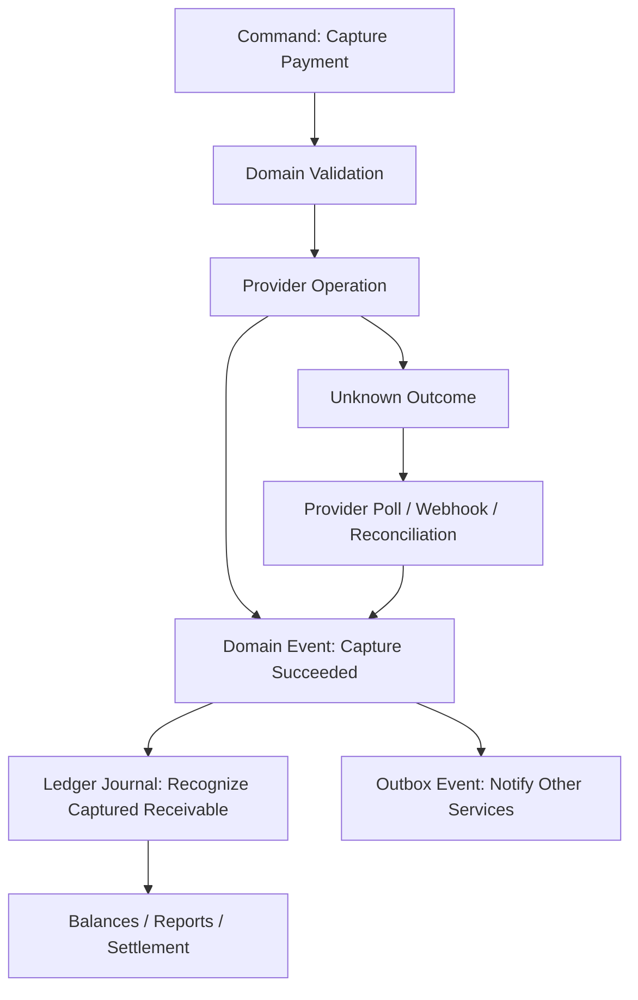
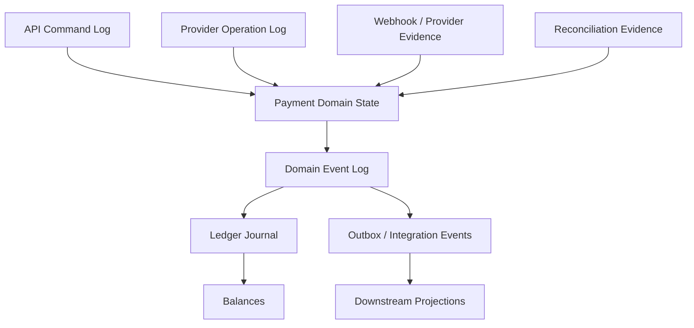
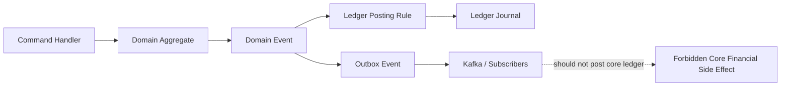
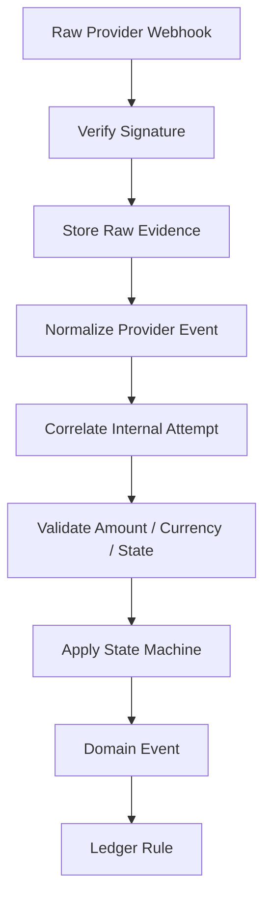
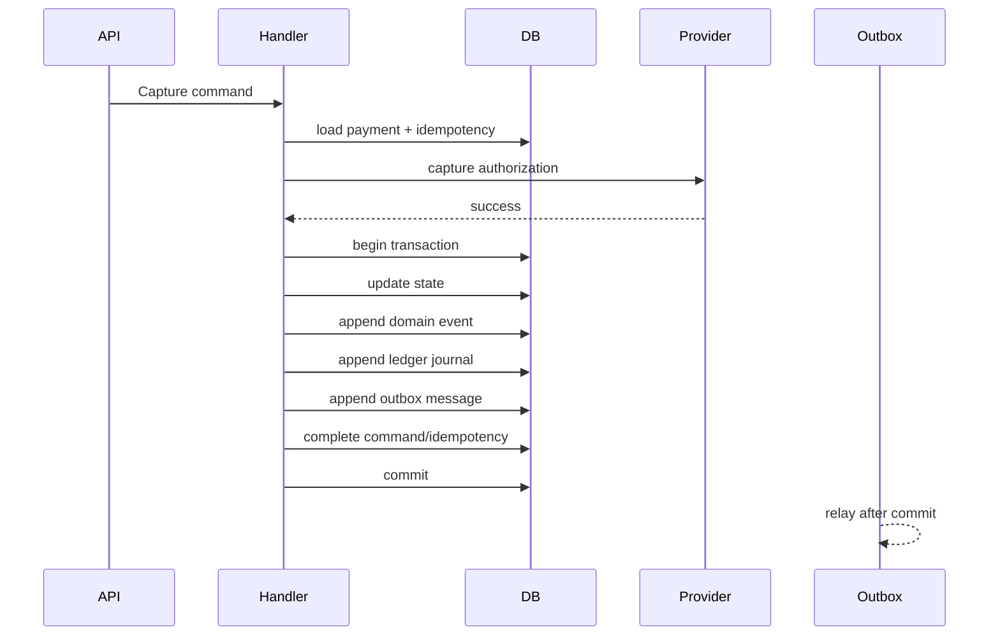
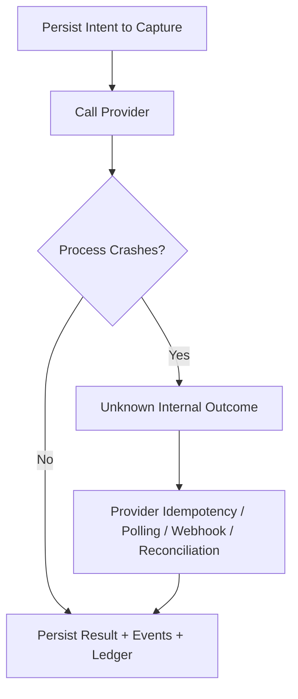
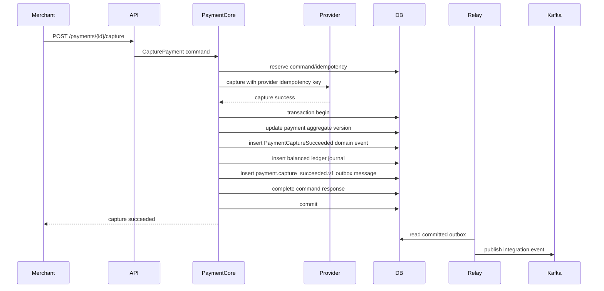
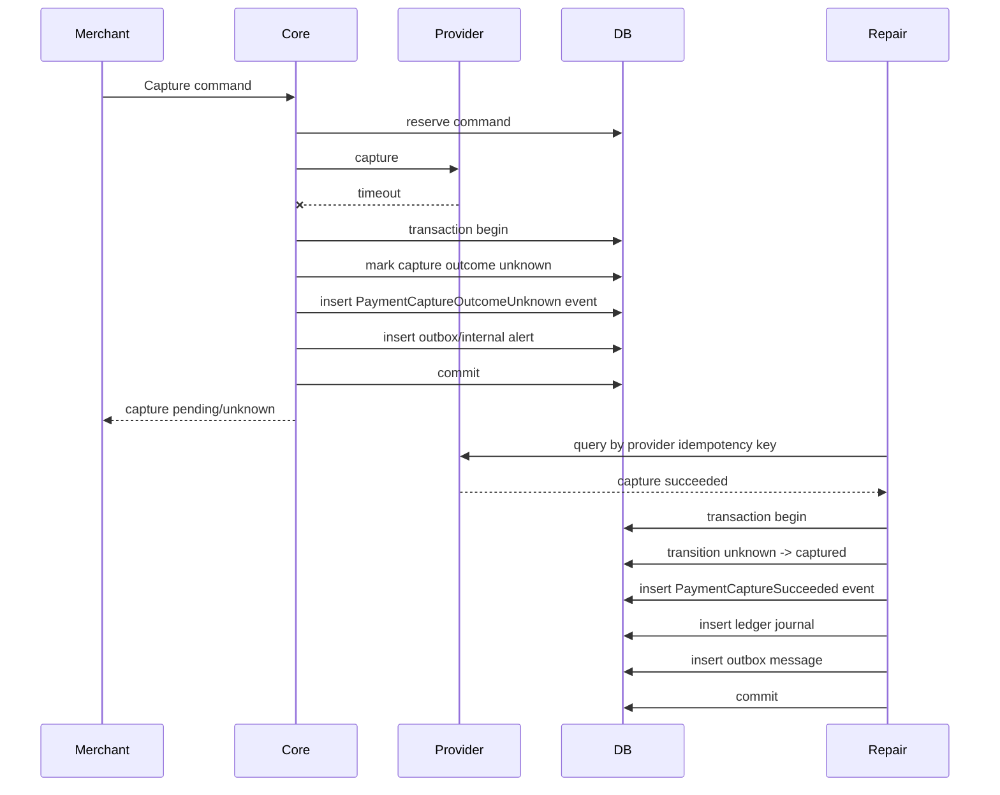
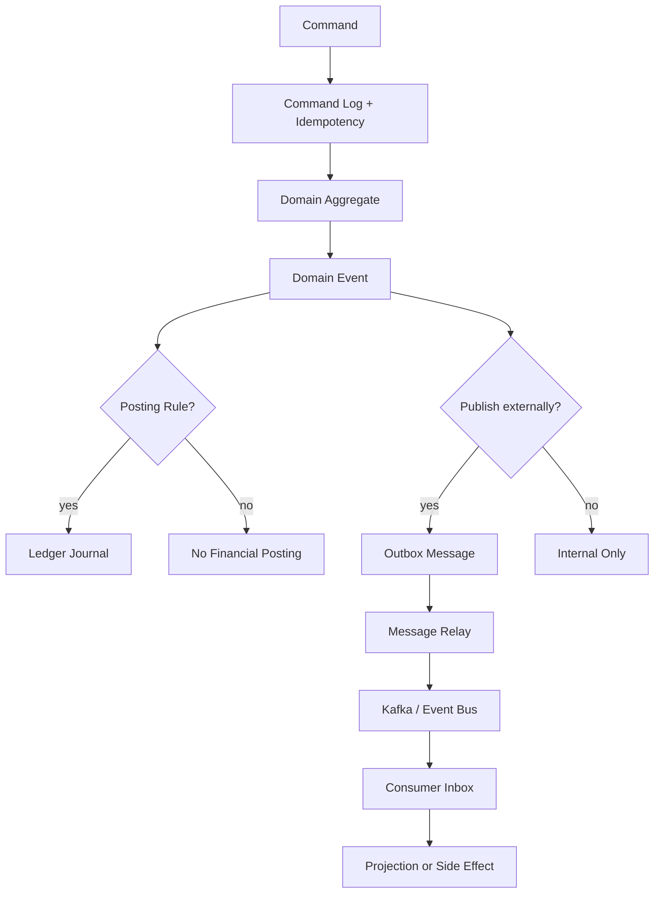

------
title: Build From Scratch: Large Production Grade Java Payment Systems - Part 017
description: Designing the boundaries between commands, events, and ledger truth in a production-grade Java payment platform, including transaction boundaries, event semantics, replay safety, projections, and financial correctness.
series: learn-java-payment-systems
seriesTitle: Build From Scratch: Large Production Grade Java Payment Systems
order: 17
partTitle: Command, Event, and Ledger Boundaries
tags:
- java
- payments
- payment-systems
- ledger
- events
- domain-modeling
- architecture
- fintech
date: 2026-07-02
---

# Part 017 — Command, Event, and Ledger Boundaries

A payment system is not correct because it emits events.

A payment system is correct because every accepted command has a bounded meaning, every emitted event is a durable fact, and every money-impacting fact is explainable through ledger postings.

That sentence is the core of this part.

Most distributed systems tutorials blur three very different things:

- a request to do something,
- a fact that something happened,
- a financial record that proves money moved or became payable.

In payment systems, mixing these concepts creates subtle production failures.

A `PaymentCaptured` event is not the same thing as a command to capture.

A ledger entry is not the same thing as an event.

A Kafka message is not the same thing as financial truth.

A provider webhook is not automatically a domain event.

A state transition is not automatically a ledger posting.

This part builds the boundary model that keeps a payment platform sane when retries, timeouts, duplicate webhooks, provider drift, reconciliation, settlement, and manual operations happen at the same time.

---

## 1. The Three Objects You Must Never Confuse

A production payment platform has three fundamental object categories.

| Category | Question Answered | Example | Mutable? | Source of Truth? |
|---|---|---|---|---|
| Command | What do we want to do? | `CapturePayment` | Request is immutable, processing state changes | No |
| Event | What happened? | `PaymentCaptureSucceeded` | No | Domain truth for state history |
| Ledger Posting | What financial effect was recognized? | Debit receivable, credit merchant payable | No | Financial truth |

They are related, but not interchangeable.

A command may produce zero, one, or many events.

An event may produce zero, one, or many ledger postings.

A ledger posting may be caused by a command, webhook, reconciliation break repair, settlement batch, dispute event, or manual approved adjustment.

The same user-visible payment may have many commands, many provider events, many domain events, and many ledger journals.



The key design principle:

> Commands express intent. Events express facts. Ledger postings express accountable financial consequences.

If you remember only one thing from this part, remember that.

---

## 2. Why This Boundary Matters More in Payments Than in Generic Microservices

In a generic ecommerce system, a duplicate event may send two emails.

Bad, but repairable.

In a payment system, a duplicate event may:

- double-capture an authorization,
- double-post merchant payable,
- release a hold twice,
- mark a payout paid when the bank rejected it,
- reverse a refund that never settled,
- create money in the ledger,
- settle a merchant more than owed,
- hide a provider mismatch until month-end finance close.

The blast radius is bigger because money systems accumulate truth over time.

You cannot simply overwrite the last row and call it fixed.

You need history.

You need explainability.

You need a way to answer:

- who requested this operation,
- what system accepted it,
- what external provider said,
- what state transition happened,
- what financial effect was recorded,
- what event was published,
- what downstream system consumed it,
- what operator later repaired it,
- why the final balance is what it is.

That requires clean boundaries.

---

## 3. Payment Truth Is Layered

Do not design a single truth table called `payments` and put everything there.

Production payment truth is layered.



A simplified hierarchy:

| Layer | Owns | Used For |
|---|---|---|
| Command log | accepted requests | idempotency, audit, replay reasoning |
| Provider evidence | raw provider responses/webhooks/files | external truth capture |
| Domain state | current lifecycle state | API responses, operational decisioning |
| Domain event log | historical state facts | replay, audit, downstream publication |
| Ledger journal | immutable financial postings | money correctness |
| Projections | derived views | search, dashboards, analytics |

The ledger is not a projection of `payments.status`.

The ledger is the accounting record of recognized financial effects.

A projection may be rebuilt.

A ledger journal must not be casually rebuilt.

A domain event may explain why a ledger journal exists.

A command may explain why a domain event was attempted.

---

## 4. Command: A Request with a Contract

A command is a request to perform an operation.

It may come from:

- merchant API,
- checkout UI,
- internal service,
- scheduled job,
- reconciliation repair,
- backoffice operator,
- risk engine,
- settlement process.

A command must have a stable contract.

Example command:

```json
{
  "commandId": "cmd_01JZ...",
  "type": "CapturePayment",
  "paymentId": "pay_01JZ...",
  "authorizationId": "auth_01JZ...",
  "amount": {
    "currency": "IDR",
    "minor": 15000000
  },
  "idempotencyKey": "merchant-123:order-456:capture:1",
  "requestedBy": {
    "actorType": "MERCHANT_API",
    "actorId": "mch_123"
  },
  "reason": "ORDER_FULFILLED",
  "requestedAt": "2026-07-02T09:30:00Z"
}
```

A command is not just a method call.

It should be auditable.

For a payment platform, every command should answer:

- who requested it,
- on whose behalf,
- with what idempotency scope,
- against which aggregate,
- with which amount/currency,
- under which capability and limit,
- whether it was accepted or rejected,
- which state/version it observed,
- which external operation was triggered,
- which domain event resulted.

A command may be rejected before it becomes a state transition.

That rejection is still useful audit evidence.

---

## 5. Command Acceptance Is Not Command Success

A common design bug is treating HTTP `200` as payment success.

Wrong.

The API response only tells the caller what the platform accepted or already knows.

For many payment methods, command acceptance only means:

> The platform accepted responsibility for processing the requested operation under an idempotency contract.

Possible outcomes:

| Command | Accepted? | Final Success Known Immediately? |
|---|---:|---:|
| Create payment intent | usually yes | no |
| Confirm card payment | yes | maybe |
| Capture authorization | yes | maybe |
| Refund payment | yes | maybe |
| Create VA instruction | yes | no |
| Initiate payout | yes | no |
| Submit dispute evidence | yes | no |

Command processing can land in:

- `REJECTED`: invalid request, illegal state, exceeded limit,
- `ACCEPTED`: operation started,
- `SUCCEEDED`: success known synchronously,
- `FAILED`: failure known synchronously,
- `UNKNOWN`: provider/network outcome unclear,
- `DEFERRED`: waiting for async provider/webhook/batch/reconciliation.

Do not force everything into synchronous success/failure.

Payment systems live in delayed truth.

---

## 6. Event: A Fact, Not an Instruction

An event records that something happened.

Good event names are past tense:

- `PaymentIntentCreated`
- `PaymentAttemptStarted`
- `PaymentAuthorizationSucceeded`
- `PaymentAuthorizationFailed`
- `PaymentCaptureRequested`
- `PaymentCaptureSucceeded`
- `PaymentCaptureOutcomeUnknown`
- `RefundSucceeded`
- `PayoutRejected`
- `DisputeOpened`
- `SettlementBatchClosed`

Bad event names often sound like commands:

- `CapturePayment`
- `ProcessRefund`
- `DoSettlement`
- `SendPayout`

An event should not tell consumers what to do.

It should tell them what happened.

Consumers decide what that fact means for them.

Example:

```json
{
  "eventId": "evt_01JZ...",
  "eventType": "PaymentCaptureSucceeded",
  "aggregateType": "payment",
  "aggregateId": "pay_01JZ...",
  "aggregateVersion": 7,
  "occurredAt": "2026-07-02T09:30:02Z",
  "causationId": "cmd_01JZ...",
  "correlationId": "req_01JZ...",
  "payload": {
    "captureId": "cap_01JZ...",
    "authorizationId": "auth_01JZ...",
    "amount": {
      "currency": "IDR",
      "minor": 15000000
    },
    "provider": "provider_a",
    "providerCaptureReference": "pcap_987"
  }
}
```

Important fields:

| Field | Purpose |
|---|---|
| `eventId` | global dedupe |
| `eventType` | schema and business meaning |
| `aggregateId` | ordering key |
| `aggregateVersion` | state history ordering |
| `causationId` | which command/evidence caused this |
| `correlationId` | traces the business flow |
| `occurredAt` | domain time |
| `recordedAt` | platform persistence time |
| `payload` | immutable event facts |

Events are not database triggers with prettier names.

They are public facts inside a bounded context.

---

## 7. Ledger Posting: A Financial Fact

A ledger posting is an accounting movement.

It says which accounts were debited and credited.

Example capture journal:

```json
{
  "journalId": "jrnl_01JZ...",
  "sourceEventId": "evt_01JZ...",
  "journalType": "CAPTURE_RECOGNIZED",
  "currency": "IDR",
  "entries": [
    {
      "account": "platform:provider_receivable:provider_a:IDR",
      "direction": "DEBIT",
      "amountMinor": 15000000
    },
    {
      "account": "merchant:mch_123:pending_payable:IDR",
      "direction": "CREDIT",
      "amountMinor": 14550000
    },
    {
      "account": "platform:revenue:mdr:IDR",
      "direction": "CREDIT",
      "amountMinor": 450000
    }
  ]
}
```

The journal must balance.

Total debit equals total credit per currency.

Ledger entries are immutable.

Corrections are new journals.

A ledger posting should never be represented only as `payment.status = CAPTURED`.

Status is a lifecycle summary.

Ledger is financial truth.

---

## 8. The Boundary Rule

The most practical boundary rule is this:

> A command may change domain state. A domain state transition may emit events. Only specific events may produce ledger journals. Published integration events must not be the source of financial posting.

Why?

Because integration events can be consumed multiple times, delayed, compacted, replayed, filtered, transformed, or routed differently.

Your ledger should not depend on a downstream consumer interpreting an externalized event correctly.

The ledger should be written inside the payment platform boundary, under the same business decision that recognized the financial effect.



Downstream consumers may maintain projections.

They may create analytics.

They may trigger notifications.

They may prepare invoices.

But the core payment ledger should be posted by the system that owns the payment lifecycle.

---

## 9. Domain Events vs Integration Events

A domain event is internal to the owning bounded context.

An integration event is published to other systems.

They may look similar.

They are not the same.

| Dimension | Domain Event | Integration Event |
|---|---|---|
| Audience | Payment Core internals | Other services |
| Stability | can evolve with domain | must be versioned carefully |
| Payload | rich internal meaning | stable external contract |
| Timing | inside transaction/log | via outbox/relay |
| Security | internal | sanitized |
| Example | `AuthorizationStateTransitioned` | `PaymentAuthorizedV1` |

Do not publish every internal event.

Do not expose provider secrets, raw card metadata, risk signals, internal rule IDs, or sensitive failure details.

A domain event may be mapped into an integration event.

Example:

```java
public interface IntegrationEventMapper {
    Optional<OutboxMessage> toOutbox(DomainEvent event);
}

public final class PaymentEventMapper implements IntegrationEventMapper {
    public Optional<OutboxMessage> toOutbox(DomainEvent event) {
        if (event instanceof PaymentCaptureSucceeded e) {
            return Optional.of(OutboxMessage.of(
                "payment.captured.v1",
                e.paymentId().value(),
                Map.of(
                    "paymentId", e.paymentId().value(),
                    "merchantId", e.merchantId().value(),
                    "amount", e.amount().toJson(),
                    "capturedAt", e.occurredAt().toString()
                )
            ));
        }
        return Optional.empty();
    }
}
```

The integration event is a product contract.

Treat it like an API.

---

## 10. Provider Events Are Not Domain Events

A provider webhook is external evidence.

It is not automatically your domain event.

Provider says:

```json
{
  "event": "payment.success",
  "id": "wh_999",
  "payment_id": "abc123",
  "amount": 150000,
  "currency": "IDR"
}
```

Your domain may decide:

- event is duplicate, no-op,
- event is authentic but stale,
- event is authentic but mismatched amount,
- event is authentic but maps to unknown attempt,
- event confirms an `UNKNOWN` authorization,
- event confirms a capture that was already reconciled,
- event conflicts with current state and needs manual review.

Only after normalization, correlation, validation, and state transition should you emit domain events.



Never let raw provider status directly update the ledger.

---

## 11. Why Event Sourcing Is Not Automatically a Ledger

Event sourcing can be useful.

But a domain event stream is not the same thing as a double-entry ledger.

A domain event stream says:

- payment was authorized,
- capture succeeded,
- refund requested,
- dispute opened.

A ledger says:

- debit provider receivable,
- credit merchant pending payable,
- debit merchant payable,
- credit refund liability,
- debit chargeback loss,
- credit provider settlement account.

The ledger has accounting invariants that generic event streams do not enforce.

| Concern | Domain Event Stream | Ledger Journal |
|---|---|---|
| Business lifecycle | primary | secondary/contextual |
| Accounting balance | not guaranteed | mandatory |
| Multi-account effects | optional | mandatory |
| Currency balancing | rarely enforced | mandatory |
| Correction style | append new event | append reversal/adjustment journal |
| Reporting | operational | financial |

Do not say, “we use event sourcing, therefore we have a ledger.”

You have a ledger only if you model accounts, journals, entries, directions, currencies, posting rules, reversals, and balance integrity.

We will build that deeply in Part 020 and Part 021.

---

## 12. Transaction Boundary: The Unit of Financial Decision

A command handler should persist all facts created by one financial decision in one database transaction.

For example, when a capture is confirmed synchronously:

- update payment attempt state,
- append domain event,
- append ledger journal,
- append outbox message,
- record provider operation result,
- update idempotency record.

All commit together.

Or none commit.



This is not always possible if provider call must happen inside/outside DB transaction.

Usually you should not hold a DB transaction open while waiting on a remote provider.

A safer pattern:

1. reserve command/idempotency,
2. create provider operation attempt,
3. call provider outside the transaction,
4. persist provider result and domain effects in a short transaction,
5. if the process crashes after provider call but before persistence, resolve through operation log, provider idempotency, polling, webhook, or reconciliation.

That is why provider operation logs and unknown-state repair exist.

---

## 13. The Remote Call Gap

The remote call gap is unavoidable.



The dangerous version:

```java
provider.capture(...);
paymentRepository.markCaptured(paymentId);
ledger.postCapture(...);
```

If the JVM dies after `provider.capture` but before `markCaptured`, your database says not captured while provider may have captured.

The correct model is not “make this impossible.”

The correct model is “make this detectable and repairable.”

That requires:

- provider idempotency keys,
- durable provider operation records,
- command log,
- webhook ingestion,
- polling repair,
- reconciliation,
- ledger posting idempotency,
- manual review for conflicts.

Financially serious systems are not designed around perfect synchronous control.

They are designed around bounded uncertainty and repair.

---

## 14. Command Log Schema

A minimal command log:

```sql
create table payment_command (
    id uuid primary key,
    command_type text not null,
    aggregate_type text not null,
    aggregate_id uuid not null,
    idempotency_scope text not null,
    idempotency_key text not null,
    request_hash text not null,
    requested_by_type text not null,
    requested_by_id text not null,
    status text not null,
    rejection_code text,
    response_snapshot jsonb,
    created_at timestamptz not null,
    completed_at timestamptz,

    constraint uq_payment_command_idempotency
        unique (idempotency_scope, idempotency_key)
);

create index idx_payment_command_aggregate
    on payment_command (aggregate_type, aggregate_id, created_at);
```

This table is not the only idempotency mechanism.

It is the audit-friendly command record.

It should preserve enough context to explain why a command was accepted, rejected, replayed, or deduplicated.

PostgreSQL unique constraints are a practical way to enforce that duplicate scoped idempotency keys cannot create multiple accepted commands.

---

## 15. Domain Event Schema

A minimal domain event table:

```sql
create table payment_domain_event (
    id uuid primary key,
    aggregate_type text not null,
    aggregate_id uuid not null,
    aggregate_version bigint not null,
    event_type text not null,
    schema_version int not null,
    causation_id uuid,
    correlation_id text,
    occurred_at timestamptz not null,
    recorded_at timestamptz not null default now(),
    payload jsonb not null,

    constraint uq_payment_domain_event_version
        unique (aggregate_type, aggregate_id, aggregate_version)
);

create index idx_payment_domain_event_aggregate
    on payment_domain_event (aggregate_type, aggregate_id, aggregate_version);

create index idx_payment_domain_event_type_time
    on payment_domain_event (event_type, recorded_at);
```

`aggregate_version` is not cosmetic.

It is how you know the event order for one payment, refund, payout, or settlement batch.

If two service instances try to transition the same aggregate from the same version, one should lose.

That is a financial safety feature.

---

## 16. Ledger Journal Schema Preview

We will go deeper later, but the boundary needs a preview.

```sql
create table ledger_journal (
    id uuid primary key,
    journal_type text not null,
    source_event_id uuid not null,
    source_type text not null,
    source_id uuid not null,
    currency char(3) not null,
    created_at timestamptz not null,

    constraint uq_ledger_journal_source_event
        unique (source_event_id)
);

create table ledger_entry (
    id uuid primary key,
    journal_id uuid not null references ledger_journal(id),
    account_id uuid not null,
    direction text not null check (direction in ('DEBIT', 'CREDIT')),
    amount_minor bigint not null check (amount_minor > 0),
    currency char(3) not null
);
```

The `source_event_id` uniqueness matters.

If `PaymentCaptureSucceeded` is replayed, the ledger should not post the capture twice.

Replay should be safe.

---

## 17. Aggregate Versioning and Legal State Transitions

Commands should not blindly write status.

They should transition aggregates.

Example Java model:

```java
public final class PaymentAggregate {
    private final PaymentId id;
    private final long version;
    private final PaymentState state;
    private final Money authorizedAmount;
    private final Money capturedAmount;

    public TransitionResult capture(CapturePayment command, ProviderCaptureResult result) {
        if (!state.canCapture()) {
            return TransitionResult.rejected("PAYMENT_NOT_CAPTURABLE");
        }

        if (!authorizedAmount.currency().equals(command.amount().currency())) {
            return TransitionResult.rejected("CURRENCY_MISMATCH");
        }

        Money newCaptured = capturedAmount.plus(command.amount());
        if (newCaptured.isGreaterThan(authorizedAmount)) {
            return TransitionResult.rejected("CAPTURE_EXCEEDS_AUTHORIZATION");
        }

        PaymentCaptureSucceeded event = new PaymentCaptureSucceeded(
            id,
            version + 1,
            command.commandId(),
            command.amount(),
            result.providerReference(),
            command.requestedAt()
        );

        return TransitionResult.accepted(event);
    }
}
```

The aggregate does not call Kafka.

The aggregate does not update projections.

The aggregate does not call providers.

The aggregate enforces domain rules and produces facts.

That separation keeps testing sharp.

---

## 18. Ledger Posting Rules

A ledger posting rule maps a domain event into one or more journal entries.

Example:

```java
public interface LedgerPostingRule<E extends DomainEvent> {
    boolean supports(DomainEvent event);
    LedgerJournal post(E event, PostingContext context);
}
```

Capture rule:

```java
public final class CaptureSucceededPostingRule
        implements LedgerPostingRule<PaymentCaptureSucceeded> {

    @Override
    public boolean supports(DomainEvent event) {
        return event instanceof PaymentCaptureSucceeded;
    }

    @Override
    public LedgerJournal post(PaymentCaptureSucceeded event, PostingContext context) {
        Money gross = event.amount();
        Money fee = context.feePolicy().calculateMdr(event.merchantId(), gross);
        Money net = gross.minus(fee);

        return LedgerJournal.builder()
            .journalType("CAPTURE_RECOGNIZED")
            .sourceEventId(event.eventId())
            .currency(gross.currency())
            .debit(context.accounts().providerReceivable(event.provider(), gross.currency()), gross)
            .credit(context.accounts().merchantPendingPayable(event.merchantId(), gross.currency()), net)
            .credit(context.accounts().platformRevenueMdr(gross.currency()), fee)
            .buildBalanced();
    }
}
```

`buildBalanced()` should fail if debit and credit do not match.

That is not a unit test preference.

That is a system invariant.

---

## 19. Outbox Is Not the Domain Event Store

You may store domain events and outbox messages in one table, but conceptually they differ.

Domain event store:

- internal truth,
- complete enough for audit and replay,
- may contain sensitive internal fields,
- ordered by aggregate version,
- owned by payment service.

Outbox:

- integration delivery queue,
- sanitized payload,
- targeted topic/routing key,
- delivery metadata,
- consumer-facing version contract,
- may be retained differently.

Do not let downstream event shape dictate internal domain model.

That is backwards.

The outbox is a publication mechanism, not your domain.

---

## 20. The Event Publication Illusion

Developers often write:

```java
paymentRepository.save(payment);
kafkaProducer.send(new PaymentCaptured(...));
```

This has the classic dual-write problem.

If the database commit succeeds and Kafka send fails, consumers miss the event.

If Kafka send succeeds and database commit fails, consumers see an event for a state that does not exist.

That is why Part 018 is dedicated to outbox/inbox.

For now, the boundary rule is:

> Events that must leave the service boundary should be stored transactionally with the state change, then published by a relay.

---

## 21. Kafka Exactly-Once Does Not Replace Payment Idempotency

Kafka has strong delivery and processing guarantees when configured and used correctly.

But broker-level exactly-once semantics do not automatically make your payment side effects exactly once.

Payment correctness spans:

- HTTP client retries,
- database writes,
- provider operations,
- provider idempotency,
- webhooks,
- ledger posting,
- downstream consumption,
- manual replay,
- reconciliation repair.

Kafka can help with stream processing guarantees.

It cannot prove that your provider did not capture twice.

It cannot prove that your ledger posting rule is balanced.

It cannot decide whether a late webhook is stale or authoritative.

It cannot validate merchant settlement.

Use Kafka as a transport/log.

Do not outsource financial correctness to it.

---

## 22. Consumer Boundary: Projections Are Disposable, Effects Are Not

Event consumers fall into two categories.

| Consumer Type | Example | Failure Strategy |
|---|---|---|
| Projection consumer | search index, dashboard, reporting view | rebuildable |
| Side-effect consumer | email, payout trigger, risk action, account update | idempotent effect tracking |

Projection consumers can often be replayed.

Side-effect consumers need inbox/deduplication.

Example:

```sql
create table consumed_message (
    consumer_name text not null,
    message_id uuid not null,
    consumed_at timestamptz not null default now(),
    result text not null,
    primary key (consumer_name, message_id)
);
```

A side-effect consumer should insert into `consumed_message` in the same transaction as its side effect.

If the insert conflicts, it already processed the message.

This is the mirror image of idempotency on the API side.

---

## 23. Payment Event Classification

Not all events have the same consequences.

| Event Class | Example | Ledger? | Publish? | Needs Operator Visibility? |
|---|---|---:|---:|---:|
| Lifecycle | `PaymentIntentCreated` | no | maybe | low |
| Financial recognition | `CaptureSucceeded` | yes | yes | medium |
| Failure | `AuthorizationFailed` | maybe no | yes | low/medium |
| Unknown | `CaptureOutcomeUnknown` | no until resolved | yes/internal | high |
| Risk | `PaymentHeldForReview` | maybe hold journal | yes/internal | high |
| Reconciliation | `ProviderSettlementMatched` | maybe | internal | medium |
| Repair | `PaymentStateManuallyCorrected` | maybe adjustment | internal/high | high |
| Dispute | `ChargebackOpened` | yes | yes | high |

This classification helps you define posting rules, outbox mapping, alerting, and retention.

---

## 24. Naming Rules

Use names that encode semantics.

Command names:

- imperative,
- user/system intent,
- not necessarily successful.

Examples:

- `CreatePaymentIntent`
- `ConfirmPayment`
- `CaptureAuthorization`
- `CancelAuthorization`
- `RequestRefund`
- `ResolveUnknownCapture`
- `ApplyManualLedgerAdjustment`

Domain event names:

- past tense,
- fact-based,
- business-specific.

Examples:

- `PaymentIntentCreated`
- `PaymentAuthorizationSucceeded`
- `PaymentCaptureOutcomeUnknown`
- `RefundRejectedByProvider`
- `LedgerAdjustmentApproved`

Integration event names:

- stable,
- versioned,
- consumer-oriented.

Examples:

- `payment.authorized.v1`
- `payment.capture_succeeded.v1`
- `payment.refund_failed.v1`
- `payout.paid.v1`

Ledger journal types:

- accounting meaning,
- not transport meaning.

Examples:

- `AUTHORIZATION_HOLD_CREATED`
- `CAPTURE_RECOGNIZED`
- `REFUND_LIABILITY_CREATED`
- `MERCHANT_SETTLEMENT_PAID`
- `CHARGEBACK_LOSS_RECOGNIZED`

---

## 25. Example: Capture Flow with All Boundaries



What happens if the relay fails?

The domain state and ledger are still correct.

The outbox message remains pending.

What happens if the merchant retries?

The command idempotency record returns the same result.

What happens if Kafka publishes twice?

Consumers use inbox/deduplication.

What happens if provider sends a duplicate webhook later?

Webhook ingestion normalizes it, detects already captured, and records no-op evidence.

---

## 26. Example: Unknown Capture Flow



Notice the ledger is not posted when the outcome is unknown.

You may reserve operational state.

But you should not recognize final financial effect until evidence is strong enough according to your posting policy.

Different products may use different policies, but the policy must be explicit.

---

## 27. Failure Matrix

| Failure | Bad Boundary Result | Correct Boundary Result |
|---|---|---|
| API retry | duplicate capture | same command result |
| Provider timeout | random failed status | unknown state with repair path |
| Duplicate webhook | duplicate ledger posting | no-op evidence + idempotent transition |
| Out-of-order webhook | state regression | legal transition rejects/defer |
| Kafka publish fail | lost integration event | committed outbox pending |
| Kafka duplicate | duplicate side effect | consumer inbox dedupe |
| Ledger rule bug | unbalanced money | transaction fails before commit |
| Manual repair | silent overwrite | approved event + adjustment journal |
| Projection lag | false business state | API reads owned state, not projection |

A good architecture makes dangerous failures boring.

Boring means detected, bounded, and repairable.

---

## 28. Java Package Boundary

One practical layout:

```txt
payment-core/
  domain/
    command/
    event/
    aggregate/
    state/
    money/
    rule/
  application/
    handler/
    transaction/
    idempotency/
    orchestration/
  ledger/
    posting/
    journal/
    account/
  provider/
    port/
    operationlog/
  outbox/
    mapper/
    message/
  infrastructure/
    postgres/
    kafka/
    jaxrs/
```

Avoid package names like:

```txt
service/
manager/
processor/
utils/
```

Those hide boundaries.

Use names that express ownership and consequence.

---

## 29. Command Handler Skeleton

```java
public final class CapturePaymentHandler {
    private final CommandLog commandLog;
    private final PaymentRepository paymentRepository;
    private final ProviderCapturePort providerCapturePort;
    private final TransactionRunner tx;
    private final LedgerPostingService ledgerPostingService;
    private final OutboxMapper outboxMapper;

    public CaptureResponse handle(CapturePayment command) {
        IdempotencyReservation reservation = commandLog.reserve(command);
        if (reservation.isReplay()) {
            return reservation.previousResponseAs(CaptureResponse.class);
        }

        Payment payment = paymentRepository.getForCommand(command.paymentId());
        payment.validateCapturable(command.amount());

        ProviderCaptureResult providerResult = providerCapturePort.capture(command.toProviderCommand());

        return tx.run(() -> {
            Payment locked = paymentRepository.lock(command.paymentId());

            DomainTransition transition = locked.applyCaptureResult(command, providerResult);

            paymentRepository.save(transition.newState());
            paymentRepository.appendEvents(transition.events());

            ledgerPostingService.postAll(transition.events());

            outboxMapper.map(transition.events()).forEach(paymentRepository::appendOutbox);

            CaptureResponse response = CaptureResponse.from(transition.newState(), providerResult);
            commandLog.complete(command.commandId(), response);

            return response;
        });
    }
}
```

This skeleton hides many details, but the shape matters:

- reserve idempotency first,
- separate provider operation from domain transition,
- lock/reload before applying final transition,
- append events,
- post ledger from events,
- append outbox in same transaction,
- complete command with stable response.

---

## 30. What Should Be Inside One Transaction?

Inside one transaction:

- aggregate state change,
- aggregate version increment,
- domain event append,
- ledger journal append for recognized financial effects,
- outbox message append,
- idempotency response completion,
- provider operation result persistence if available,
- audit log for the decision.

Outside the transaction:

- remote provider call,
- Kafka publication,
- email sending,
- webhook HTTP response after durable capture,
- analytics indexing,
- dashboard projection updates.

This is not dogma.

It is a way to minimize inconsistent dual writes while keeping transactions short.

---

## 31. Anti-Patterns

### Anti-Pattern 1: Event Means Command

```json
{ "type": "CapturePayment" }
```

A consumer receives it and performs capture.

This creates unclear ownership.

Who is responsible if the capture fails?

Who owns idempotency?

Who posts ledger?

Use commands for directed requests and events for facts.

### Anti-Pattern 2: Ledger from Kafka Consumer

Payment core publishes `PaymentCaptured`.

A separate ledger service consumes it and posts money.

This can work only if the ledger service has a very strong inbox, ordering, idempotency, schema, replay, and reconciliation design.

But for a first production-grade platform, it is safer to keep core ledger posting in the same transactional boundary as the payment state transition.

Split later only if organizational and technical maturity justify it.

### Anti-Pattern 3: Provider Status as Internal State

```java
payment.status = providerResponse.status();
```

Provider status is not your state machine.

Normalize it.

Validate it.

Map it through legal transitions.

### Anti-Pattern 4: One Event Type for Everything

```json
{ "type": "PaymentUpdated" }
```

This forces consumers to diff payloads.

Use meaningful event types.

### Anti-Pattern 5: Update Instead of Append

Overwriting financial history makes audit and reconciliation hard.

Append events.

Append journals.

Append repair evidence.

Use current-state tables as derived summaries, not the only truth.

---

## 32. Boundary Tests

You should test the boundaries, not only the happy path.

### Command Tests

- duplicate idempotency key returns same response,
- same key with different payload is rejected,
- illegal state transition does not call provider,
- exceeded amount is rejected before provider call,
- command rejection is auditable.

### Event Tests

- event version increments monotonically,
- duplicate event ID cannot be inserted,
- aggregate version conflict fails,
- event payload schema is compatible,
- sensitive fields are not mapped to integration event.

### Ledger Tests

- posting rule creates balanced journal,
- replay of same event does not post second journal,
- unsupported event does not post,
- multi-currency journal is rejected unless explicitly modeled,
- correction is append-only.

### Boundary Tests

- database commit failure leaves no outbox message,
- outbox relay duplicate does not duplicate consumer effect,
- provider timeout creates unknown state not failed state,
- webhook after manual repair is no-op or review, not regression.

---

## 33. Operational Questions Your System Must Answer

For any payment, an operator should be able to see:

- commands received,
- idempotency decisions,
- provider operations attempted,
- raw provider evidence,
- normalized provider events,
- domain state transitions,
- domain events,
- ledger journals,
- outbox publication status,
- downstream delivery status when available,
- reconciliation status,
- manual actions.

A payment platform without this timeline is hard to operate.

Build the timeline early.

It will save you during incidents.

---

## 34. A Practical Truth Hierarchy

When data disagrees, use a hierarchy.

Example:

1. ledger journal for recognized financial effects,
2. domain event log for lifecycle facts,
3. current aggregate state for API response,
4. provider evidence for external facts,
5. reconciliation reports for settlement facts,
6. projections for search/reporting convenience.

This hierarchy is not universal.

You must define your own.

But you must define one.

Without a truth hierarchy, incidents become opinion battles.

---

## 35. What We Have Built Conceptually

We now have a boundary model:



This model is the foundation for Part 018.

Part 018 will focus on the outbox/inbox mechanism that makes event publication and consumption reliable without pretending distributed transactions are easy.

---

## 36. Production Checklist

Before moving on, check whether your design can answer yes to these:

- Can commands be accepted, rejected, replayed, and audited separately from final success?
- Are domain events past-tense facts?
- Are provider webhooks stored as evidence before becoming domain events?
- Are ledger journals posted only through explicit posting rules?
- Is each ledger journal tied to a source event or approved adjustment?
- Can the same event be replayed without double-posting ledger?
- Are integration events sanitized and versioned?
- Are outbox messages stored in the same transaction as state changes?
- Are downstream side effects protected by inbox/deduplication?
- Can an operator reconstruct the complete payment timeline?

If not, fix the boundary before adding more features.

Payment complexity compounds quickly.

Boundary mistakes become expensive later.

---

## 37. References

- Apache Kafka Documentation — Introduction and event streaming guarantees: https://kafka.apache.org/documentation/
- Confluent Documentation — Kafka message delivery semantics: https://docs.confluent.io/kafka/design/delivery-semantics.html
- PostgreSQL Documentation — Unique Constraints: https://www.postgresql.org/docs/current/ddl-constraints.html
- Microservices.io — Transactional Outbox Pattern: https://microservices.io/patterns/data/transactional-outbox.html
- Debezium Documentation — Outbox Event Router: https://debezium.io/documentation/reference/stable/transformations/outbox-event-router.html

---

## 38. Closing Mental Model

Payment systems should not be built around the question:

> Which event do I publish?

They should be built around the question:

> What command was accepted, what fact became true, what money effect was recognized, and how can we prove it later?

That is the difference between an event-driven demo and a production payment platform.
