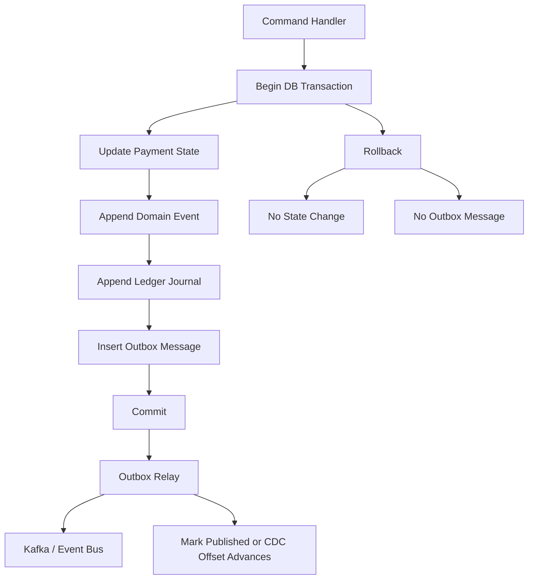
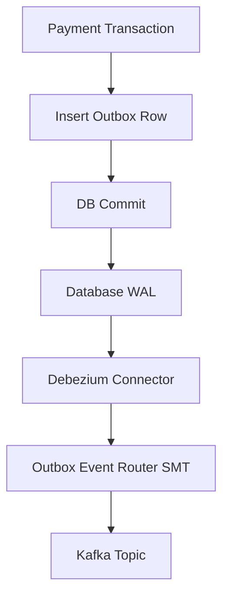
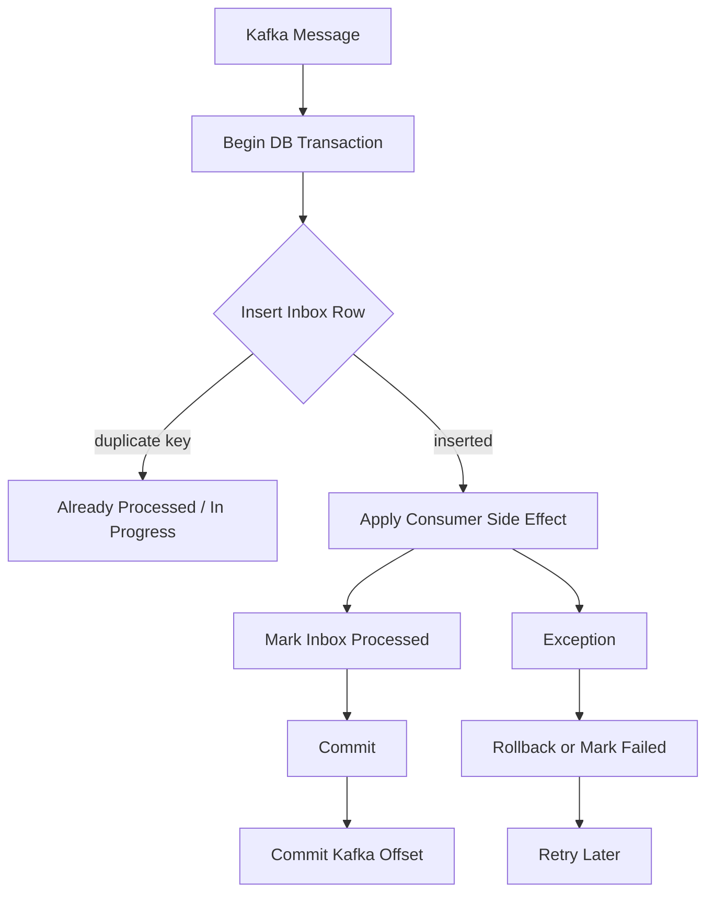
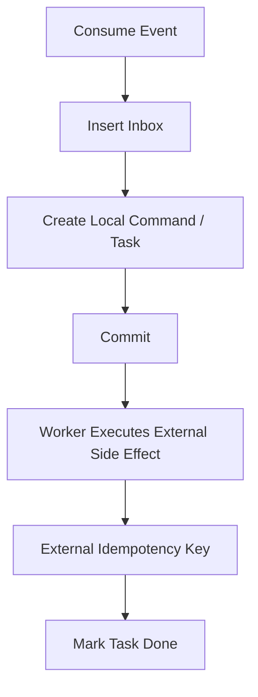
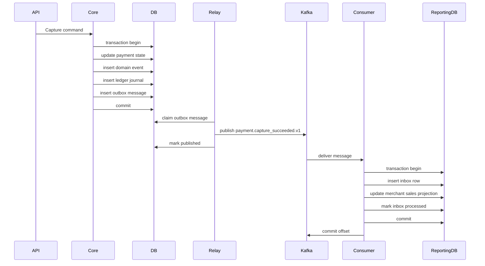

------
title: Build From Scratch: Large Production Grade Java Payment Systems - Part 018
description: Building reliable outbox and inbox mechanisms for Java payment systems to avoid dual-write failures, support idempotent event publication and consumption, and protect financial workflows from duplicate or lost side effects.
series: learn-java-payment-systems
seriesTitle: Build From Scratch: Large Production Grade Java Payment Systems
order: 18
partTitle: Transactional Outbox and Inbox for Payment Flows
tags:
- java
- payments
- outbox
- inbox
- kafka
- debezium
- idempotency
- reliability
- fintech
date: 2026-07-02
---

# Part 018 — Transactional Outbox and Inbox for Payment Flows

Payment systems fail in the space between two writes.

Write to the database, then publish to Kafka.

Call the provider, then update the payment.

Consume an event, then send an email.

Process a webhook, then post ledger.

Insert payout batch, then notify treasury.

Every “then” is a potential split-brain moment.

The transactional outbox and inbox patterns exist because distributed systems do not give you one magical transaction across your database, message broker, provider, bank, and downstream consumers.

This part focuses on one specific problem:

> How do we reliably publish and consume payment events without losing them, duplicating financial effects, or pretending that exactly-once delivery solves every business problem?

---

## 1. The Dual-Write Problem

The naive implementation:

```java
paymentRepository.markCaptured(paymentId);
kafkaProducer.send("payment.captured", event);
```

Looks harmless.

It is not.

There are four outcomes:

| DB Write | Kafka Publish | Result |
|---|---|---|
| fail | fail | safe failure |
| fail | success | ghost event |
| success | fail | lost event |
| success | success | happy path |

Only one row is the happy path.

Two rows are dangerous.

A payment platform cannot tolerate ghost events or lost events when the event drives customer notification, order fulfillment, merchant reporting, settlement readiness, risk review, or downstream ledger projection.

The outbox pattern changes the shape:

```java
transaction {
    paymentRepository.markCaptured(paymentId);
    outboxRepository.insert(eventToPublish);
}

// later, independently
outboxRelay.publishPendingMessages();
```

Now the payment state and the intent to publish commit together.

The external publish becomes retryable.

---

## 2. Transactional Outbox in One Diagram



The important property:

> If the state change commits, the outbox message exists. If the state change rolls back, the outbox message does not exist.

The relay may publish late.

The relay may publish twice.

The relay may crash.

But the message is not lost because it is stored in the same durable database transaction as the business fact.

---

## 3. Transactional Outbox Is Not Optional for Payment Events

You can sometimes skip outbox for low-value telemetry.

You should not skip it for payment lifecycle events.

Use outbox for events that affect:

- order fulfillment,
- merchant reporting,
- risk review,
- settlement readiness,
- reconciliation workflow,
- customer notification,
- payout approval,
- dispute operations,
- regulatory audit,
- downstream financial projections.

Do not rely on “Kafka is reliable” if the failure is before Kafka receives the message.

The broker cannot deliver a message you never successfully wrote.

---

## 4. Outbox Table Design

A practical relational outbox table:

```sql
create table payment_outbox_message (
    id uuid primary key,
    aggregate_type text not null,
    aggregate_id text not null,
    aggregate_version bigint,
    event_type text not null,
    schema_version int not null,
    destination text not null,
    message_key text not null,
    headers jsonb not null default '{}'::jsonb,
    payload jsonb not null,
    causation_id uuid,
    correlation_id text,
    occurred_at timestamptz not null,
    created_at timestamptz not null default now(),
    available_at timestamptz not null default now(),
    published_at timestamptz,
    publish_attempts int not null default 0,
    last_publish_error text,
    status text not null default 'PENDING',

    constraint ck_payment_outbox_status
        check (status in ('PENDING', 'PUBLISHING', 'PUBLISHED', 'FAILED', 'DISCARDED'))
);

create index idx_payment_outbox_pending
    on payment_outbox_message (status, available_at, created_at)
    where status in ('PENDING', 'FAILED');

create index idx_payment_outbox_aggregate
    on payment_outbox_message (aggregate_type, aggregate_id, aggregate_version);
```

Design choices:

| Column | Why It Exists |
|---|---|
| `id` | global dedupe/event ID |
| `aggregate_type` | route/filter by domain object |
| `aggregate_id` | partition key / ordering key |
| `aggregate_version` | causal order for one aggregate |
| `event_type` | consumer contract |
| `schema_version` | safe evolution |
| `destination` | topic/routing target |
| `message_key` | Kafka key or broker routing key |
| `headers` | metadata without polluting payload |
| `payload` | public integration payload |
| `causation_id` | command/event that caused message |
| `correlation_id` | trace across systems |
| `available_at` | delayed/retry publishing |
| `status` | relay control |

For CDC-based outbox, the relay may not update `published_at` in the same table. That is acceptable if operational monitoring comes from connector offsets and topic delivery metrics.

For polling-based outbox, status fields matter more.

---

## 5. Domain Event to Outbox Mapping

Do not insert outbox messages from random services.

Map domain events to outbox messages through explicit policy.

```java
public final class PaymentOutboxPolicy {
    public List<OutboxMessage> map(DomainEvent event) {
        return switch (event) {
            case PaymentCaptureSucceeded e -> List.of(paymentCaptured(e));
            case PaymentRefundSucceeded e -> List.of(paymentRefunded(e));
            case PaymentCaptureOutcomeUnknown e -> List.of(internalOpsAlert(e));
            default -> List.of();
        };
    }

    private OutboxMessage paymentCaptured(PaymentCaptureSucceeded e) {
        return OutboxMessage.builder()
            .id(EventId.newId())
            .aggregateType("payment")
            .aggregateId(e.paymentId().value())
            .aggregateVersion(e.aggregateVersion())
            .eventType("payment.capture_succeeded.v1")
            .schemaVersion(1)
            .destination("payments.public.events")
            .messageKey(e.paymentId().value())
            .correlationId(e.correlationId())
            .causationId(e.eventId())
            .occurredAt(e.occurredAt())
            .payload(Map.of(
                "paymentId", e.paymentId().value(),
                "merchantId", e.merchantId().value(),
                "amount", e.amount().toJson(),
                "capturedAt", e.occurredAt().toString()
            ))
            .build();
    }
}
```

This policy is where you sanitize.

Do not publish:

- raw provider response,
- card PAN,
- sensitive risk scores,
- internal fraud rule IDs,
- HSM/key metadata,
- operator private notes,
- bank account details beyond contract need,
- customer PII unless explicitly required and allowed.

Integration events are external contracts.

Treat them like APIs.

---

## 6. Outbox Insert Must Be in the Same Transaction

Example command handler boundary:

```java
public CaptureResponse completeCapture(CapturePayment command, ProviderCaptureResult result) {
    return transactionRunner.run(() -> {
        Payment payment = paymentRepository.lock(command.paymentId());

        DomainTransition transition = payment.applyCaptureResult(command, result);

        paymentRepository.save(payment);
        domainEventRepository.appendAll(transition.events());
        ledgerService.postAll(transition.events());

        List<OutboxMessage> outbox = outboxPolicy.mapAll(transition.events());
        outboxRepository.insertAll(outbox);

        CaptureResponse response = CaptureResponse.from(payment);
        commandLog.complete(command.commandId(), response);

        return response;
    });
}
```

If the transaction rolls back, no outbox message exists.

If the transaction commits, the relay can eventually publish.

This gives you atomicity between your database facts and your intent to publish.

It does not give exactly-once side effects everywhere.

That is why inbox exists.

---

## 7. Polling Relay vs CDC Relay

There are two common outbox relay styles.

| Relay Style | How It Works | Strength | Trade-Off |
|---|---|---|---|
| Polling publisher | app scans pending rows and sends to broker | simple, explicit status | DB polling load, lock contention |
| CDC relay | Debezium reads WAL/binlog and emits messages | lower app complexity, preserves commit order | connector ops complexity, offset monitoring |

Both are valid.

For learning/build-from-scratch, implement polling first.

For high-throughput production, evaluate CDC-based outbox.

Debezium’s Outbox Event Router is specifically designed to route records from an outbox table into event messages and uses fields such as aggregate ID as the emitted message key, which is important for maintaining ordering in Kafka partitions.

---

## 8. Polling Relay Design

A robust polling relay needs more than `select * from outbox where status = 'PENDING'`.

It needs claiming.

```sql
with candidate as (
    select id
    from payment_outbox_message
    where status in ('PENDING', 'FAILED')
      and available_at <= now()
    order by created_at
    limit 100
    for update skip locked
)
update payment_outbox_message o
set status = 'PUBLISHING',
    publish_attempts = publish_attempts + 1
from candidate c
where o.id = c.id
returning o.*;
```

`skip locked` allows multiple relay workers to claim different rows.

After publish success:

```sql
update payment_outbox_message
set status = 'PUBLISHED',
    published_at = now(),
    last_publish_error = null
where id = :id;
```

After publish failure:

```sql
update payment_outbox_message
set status = 'FAILED',
    available_at = now() + (:backoffSeconds * interval '1 second'),
    last_publish_error = :error
where id = :id;
```

The relay is allowed to publish the same message twice if it crashes after broker publish but before marking the row published.

Consumers must handle duplicates.

---

## 9. Polling Relay Java Sketch

```java
public final class OutboxRelay implements Runnable {
    private final OutboxRepository outboxRepository;
    private final MessagePublisher publisher;
    private final BackoffPolicy backoffPolicy;

    @Override
    public void run() {
        List<OutboxMessage> batch = outboxRepository.claimBatch(100);

        for (OutboxMessage message : batch) {
            try {
                publisher.publish(message.destination(), message.messageKey(), message.headers(), message.payload());
                outboxRepository.markPublished(message.id());
            } catch (Exception ex) {
                Duration backoff = backoffPolicy.next(message.publishAttempts());
                outboxRepository.markFailed(message.id(), ex.getMessage(), backoff);
            }
        }
    }
}
```

Do not make the batch transaction wrap all publishes.

A broker publish is remote I/O.

Claim rows in a DB transaction.

Publish individually.

Mark outcome.

Accept that duplicate publish can happen.

Inbox will protect consumers.

---

## 10. CDC Relay Design

With CDC, your application only writes the outbox row.

The database write-ahead log is captured by a connector such as Debezium and routed to Kafka.



Advantages:

- no application polling loop,
- commit order can be preserved more naturally,
- app does not need to mark rows published,
- less risk that a developer forgets relay status logic.

Operational responsibilities:

- connector availability,
- replication slot health,
- Kafka Connect monitoring,
- schema evolution,
- topic routing config,
- lag alerting,
- replay strategy,
- outbox table retention.

CDC is not “set and forget.”

It moves operational complexity from application code to data platform operations.

---

## 11. Message Key and Ordering

Ordering in payment systems is usually per aggregate, not global.

You usually need all events for one `paymentId` to go to the same partition.

Use message key:

```txt
message_key = paymentId
```

For refund events:

```txt
message_key = paymentId
```

or, if refund lifecycle is independent:

```txt
message_key = refundId
```

Choose based on ordering need.

If consumers must process payment captured before refund succeeded, key by payment ID.

If refund is separate and high-volume, key by refund ID but include causal references.

Ordering is not free.

Global ordering kills scalability.

Per-aggregate ordering is usually enough.

---

## 12. Outbox Event Types

Define event names intentionally.

Examples:

| Event Type | Audience | Notes |
|---|---|---|
| `payment.intent_created.v1` | order/checkout | may not mean money movement |
| `payment.authorization_succeeded.v1` | order/risk | hold or authorization exists |
| `payment.capture_succeeded.v1` | order/merchant/reporting | money recognized as captured |
| `payment.capture_unknown.v1` | ops/internal | requires repair path |
| `payment.refund_succeeded.v1` | customer support/order | refund accepted/confirmed |
| `payout.created.v1` | treasury/ops | payout instruction created |
| `payout.paid.v1` | merchant/reporting | payout completed |
| `dispute.opened.v1` | risk/ops | evidence deadline starts |

Avoid generic `payment.updated.v1` for important lifecycle changes.

Consumers should not have to infer meaning from a diff.

---

## 13. Inbox Pattern

Outbox protects publishing.

Inbox protects consumption.

A consumer may receive the same message more than once because:

- broker redelivery,
- consumer crash before offset commit,
- relay duplicate publish,
- manual replay,
- topic replay,
- retry topic reprocessing,
- consumer group rebalance.

The inbox records that a consumer has processed a message.

```sql
create table consumer_inbox_message (
    consumer_name text not null,
    message_id uuid not null,
    message_type text not null,
    message_key text not null,
    received_at timestamptz not null default now(),
    processed_at timestamptz,
    status text not null,
    error text,
    payload_hash text not null,

    primary key (consumer_name, message_id),

    constraint ck_consumer_inbox_status
        check (status in ('PROCESSING', 'PROCESSED', 'FAILED', 'IGNORED'))
);
```

The primary key is the dedupe control.

Each consumer has its own namespace.

`merchant-reporting-service` processing `evt_123` is different from `notification-service` processing `evt_123`.

---

## 14. Inbox Consumer Flow



The safest pattern:

1. begin database transaction,
2. insert inbox row,
3. perform local side effect,
4. mark inbox processed,
5. commit database transaction,
6. commit broker offset.

If the process crashes after DB commit but before offset commit, the broker may redeliver.

The inbox primary key prevents duplicate local side effect.

---

## 15. Inbox Java Sketch

```java
public final class PaymentCapturedConsumer {
    private final TransactionRunner tx;
    private final InboxRepository inbox;
    private final MerchantReportingProjection projection;

    public void onMessage(IntegrationMessage message) {
        tx.run(() -> {
            InboxReservation reservation = inbox.reserve(
                "merchant-reporting-service",
                message.messageId(),
                message.type(),
                message.key(),
                message.payloadHash()
            );

            if (reservation.isDuplicateProcessed()) {
                return null;
            }

            PaymentCapturedV1 event = PaymentCapturedV1.parse(message.payload());

            projection.applyPaymentCaptured(event);

            inbox.markProcessed("merchant-reporting-service", message.messageId());
            return null;
        });
    }
}
```

The projection update and inbox status commit together.

If projection update fails, the inbox does not incorrectly say processed.

If message is redelivered after success, it becomes a no-op.

---

## 16. Inbox for Side Effects

Some consumers do external side effects:

- send email,
- call Slack/webhook,
- trigger fulfillment,
- call another provider,
- create payout instruction.

External side effects cannot always be wrapped in the same DB transaction.

You need another level of idempotency.

Pattern:



Do not send the email directly inside the Kafka consumer if you need strong operational control.

Create a durable local task.

Execute it with idempotency.

Track result.

This is especially important for payout initiation and provider operations.

---

## 17. Ledger Consumers: Be Extremely Careful

If your architecture puts ledger posting in a separate consumer, that consumer must be treated as a financial system, not a projection.

It needs:

- inbox deduplication,
- strict event schema validation,
- source event uniqueness,
- aggregate ordering guarantees,
- posting rule versioning,
- balanced journal enforcement,
- replay strategy,
- correction strategy,
- reconciliation against payment core,
- operational alerting.

For this series, the preferred initial architecture is:

> Payment Core posts its own core ledger journals in the same transaction as the domain transition.

Later, you may split ledger into an independent service if you deliberately design the contract and operational model.

Do not split it because “microservices.”

Money boundaries should be split slower than code boundaries.

---

## 18. Why Exactly-Once Messaging Is Not Enough

Kafka can provide strong exactly-once processing guarantees for specific read-process-write pipelines when transactions are configured correctly.

But payment flows include external systems outside Kafka:

- card networks,
- banks,
- PSPs,
- webhooks,
- settlement files,
- manual operations,
- relational database side effects,
- ledger constraints.

A Kafka transaction cannot roll back a card capture.

A Kafka transaction cannot make a bank webhook arrive once.

A Kafka transaction cannot prove a ledger entry balanced.

A Kafka transaction cannot prevent an operator from replaying a file.

Use broker guarantees, but still design application idempotency.

The payment rule is:

> Assume at-least-once delivery at every boundary. Make every money-impacting handler idempotent by business key.

---

## 19. Idempotency Keys by Boundary

| Boundary | Idempotency Key |
|---|---|
| Merchant API command | merchant + operation + idempotency key |
| Provider operation | provider + operation type + provider idempotency key |
| Webhook ingestion | provider + webhook event ID or payload hash fallback |
| Domain event append | aggregate + version / event ID |
| Ledger posting | source event ID / posting key |
| Outbox publish | outbox message ID |
| Consumer processing | consumer name + message ID |
| External side effect task | target system + task ID / business key |
| Reconciliation import | report ID + row ID / file hash + row number |

Do not reuse one idempotency key for all layers.

Each boundary has a different duplicate risk.

---

## 20. Outbox Failure Matrix

| Failure | What Happens | Required Protection |
|---|---|---|
| DB transaction rolls back | no outbox row | atomic insert with business change |
| Relay crashes before publish | row remains pending/publishing | stuck row recovery |
| Relay publishes then crashes before mark published | duplicate publish later | consumer inbox |
| Broker unavailable | row marked failed/retry | backoff + alerting |
| Bad payload schema | publish rejected or consumer fails | contract test + DLQ |
| Huge backlog | delayed downstream state | lag metrics + scaling |
| Poison message | repeated failure | quarantine/discard policy |
| CDC connector down | WAL lag grows | connector monitoring |
| Outbox retention too aggressive | replay impossible | retention policy |

No design eliminates all failure modes.

A good design makes each failure visible and bounded.

---

## 21. Inbox Failure Matrix

| Failure | What Happens | Required Protection |
|---|---|---|
| Consumer crashes before DB commit | message redelivered | retry safe |
| Consumer crashes after DB commit before offset commit | message redelivered | inbox dedupe |
| Duplicate message delivered | duplicate insert conflict | no-op |
| Payload changed with same ID | hash mismatch | alert/security issue |
| Side effect succeeds but DB update fails | uncertain side effect | local task + external idempotency |
| Message schema unknown | cannot process | DLQ/quarantine |
| Out-of-order events | projection wrong | version check/defer |
| Long retry loop | consumer blocked | retry topic / poison queue |

Inbox is not just a table.

It is an operational policy.

---

## 22. Stuck `PUBLISHING` Rows

Polling relays can leave rows stuck in `PUBLISHING` if a worker dies after claiming.

Add lease fields:

```sql
alter table payment_outbox_message
add column locked_by text,
add column locked_until timestamptz;
```

Claim query:

```sql
with candidate as (
    select id
    from payment_outbox_message
    where (
        status in ('PENDING', 'FAILED')
        or (status = 'PUBLISHING' and locked_until < now())
    )
    and available_at <= now()
    order by created_at
    limit 100
    for update skip locked
)
update payment_outbox_message o
set status = 'PUBLISHING',
    locked_by = :workerId,
    locked_until = now() + interval '2 minutes',
    publish_attempts = publish_attempts + 1
from candidate c
where o.id = c.id
returning o.*;
```

A lease makes worker death recoverable.

The price is possible duplicate publish.

Again: inbox handles it.

---

## 23. Backoff and Retry Policy

Not all publish failures are equal.

| Failure | Retry? | Policy |
|---|---:|---|
| broker timeout | yes | exponential backoff |
| auth/config error | no/slow | alert immediately |
| invalid topic | no | deployment/config rollback |
| payload too large | no | schema fix/quarantine |
| serialization error | no | contract bug |
| broker throttling | yes | backoff + scaling |

Do not infinitely retry poison messages every second.

You will create noise and hide real incidents.

Use:

- max attempts,
- exponential backoff,
- quarantine status,
- operator replay after fix,
- metrics by failure class.

---

## 24. Dead Letter and Quarantine

A dead-letter queue is not a trash bin.

It is an operational work queue.

For payment systems, a quarantined message should include:

- message ID,
- aggregate ID,
- event type,
- schema version,
- first failure time,
- last failure time,
- failure reason,
- payload hash,
- replay eligibility,
- business criticality,
- owner team.

Never store sensitive payment data in a DLQ without applying the same security controls as the source topic.

DLQs often become accidental data leaks.

---

## 25. Event Versioning and Compatibility

Outbox events are integration contracts.

You need compatibility rules.

Safe changes:

- add optional field,
- add enum value only if consumers tolerate unknown,
- add new event type,
- add new header,
- publish v2 alongside v1.

Unsafe changes:

- rename field,
- change amount unit,
- remove required field,
- change meaning of status,
- reuse event type with different semantics,
- change keying/order contract.

Payment event schemas should be tested before deployment.

A broken event can stall downstream settlement or order fulfillment.

---

## 26. Payload Hashing

Store payload hash in both outbox and inbox.

Why?

If the same `message_id` appears with different payloads, something is wrong.

Possible causes:

- producer bug,
- manual replay corruption,
- schema evolution mistake,
- topic compaction misuse,
- malicious injection,
- environment mixup.

Consumer behavior:

```java
if (inbox.exists(messageId)) {
    if (!inbox.payloadHashMatches(messageId, incomingHash)) {
        throw new SecurityException("Message ID reused with different payload");
    }
    return;
}
```

Duplicate with same payload is fine.

Duplicate with different payload is not a duplicate.

It is an incident.

---

## 27. Outbox Retention

Outbox rows cannot grow forever.

But deleting too early destroys operational evidence.

Retention depends on:

- audit requirements,
- replay needs,
- consumer recovery windows,
- incident investigation windows,
- data sensitivity,
- storage cost.

A common strategy:

| Status | Hot Retention | Archive |
|---|---:|---:|
| `PENDING` | until published | no delete |
| `FAILED` | until resolved | no delete |
| `PUBLISHED` | 7-30 days hot | archive metadata/payload hash |
| `DISCARDED` | until reviewed | archive reason |

For payment systems, do not delete evidence merely because the relay is done.

At least preserve message metadata and hash.

---

## 28. Replay Tooling

You need controlled replay.

Replay is not “run a SQL update.”

Replay should be an audited operation:

```txt
Replay outbox message
- operator: ops_user_123
- message_id: evt_123
- reason: consumer bug fixed, republish required
- approval: required for financial events
- target: original topic or repair topic
- payload: original payload only
```

Rules:

- replay original payload, not regenerated payload,
- preserve original event ID,
- add replay metadata in headers,
- require maker-checker for financial-critical events,
- log operator action,
- rate-limit replay,
- alert affected consumers.

Replay without controls can create more damage than the original incident.

---

## 29. Monitoring

Outbox metrics:

- pending message count,
- oldest pending age,
- publish success rate,
- publish failure rate by reason,
- stuck publishing rows,
- relay throughput,
- CDC connector lag,
- topic publish latency,
- payload serialization failures.

Inbox metrics:

- duplicate message rate,
- processing success rate,
- processing failure rate,
- oldest failed message age,
- schema rejection count,
- payload hash mismatch count,
- consumer lag,
- out-of-order/deferred count.

Business metrics:

- payment captured but order not fulfilled,
- payout paid but merchant report not updated,
- refund succeeded but customer notification missing,
- reconciliation matched but settlement projection lagging.

Technical metrics are not enough.

Payment observability must include business lag.

---

## 30. Outbox Dashboard

A useful operator dashboard has:

| Panel | Question Answered |
|---|---|
| Oldest pending message | Are consumers getting stale truth? |
| Pending by event type | Which flow is blocked? |
| Failures by destination | Is a topic/broker/config broken? |
| Failures by schema version | Did deployment break compatibility? |
| Replay queue | What needs operator decision? |
| CDC lag | Is WAL/topic propagation healthy? |
| Publish latency P95/P99 | How delayed are downstream systems? |

Do not make operators query JSON manually during incidents.

Build the dashboard early.

---

## 31. Payment-Specific Outbox Examples

### Capture Succeeded

```json
{
  "id": "evt_01JZCAPTURED",
  "eventType": "payment.capture_succeeded.v1",
  "messageKey": "pay_01JZPAYMENT",
  "payload": {
    "paymentId": "pay_01JZPAYMENT",
    "merchantId": "mch_123",
    "captureId": "cap_456",
    "amount": {
      "currency": "IDR",
      "minor": 15000000
    },
    "capturedAt": "2026-07-02T10:00:00Z"
  }
}
```

Consumers:

- order service may fulfill,
- merchant reporting may update sales,
- notification service may notify customer,
- risk service may update customer velocity.

### Capture Unknown

```json
{
  "id": "evt_01JZUNKNOWN",
  "eventType": "payment.capture_unknown.v1",
  "messageKey": "pay_01JZPAYMENT",
  "payload": {
    "paymentId": "pay_01JZPAYMENT",
    "merchantId": "mch_123",
    "operationId": "op_789",
    "reason": "PROVIDER_TIMEOUT",
    "nextRepairAfter": "2026-07-02T10:05:00Z"
  }
}
```

Consumers:

- ops repair queue,
- merchant-facing dashboard may show pending,
- fulfillment should usually wait.

The event type matters.

`capture_unknown` is not `capture_failed`.

---

## 32. Idempotent Projection Update

Example merchant reporting projection:

```sql
create table merchant_payment_sale (
    merchant_id uuid not null,
    payment_id uuid not null,
    capture_id uuid not null,
    currency char(3) not null,
    amount_minor bigint not null,
    captured_at timestamptz not null,
    source_message_id uuid not null,

    primary key (merchant_id, capture_id),
    constraint uq_merchant_payment_sale_source_message
        unique (source_message_id)
);
```

Consumer transaction:

```sql
insert into consumer_inbox_message (...)
values (...);

insert into merchant_payment_sale (...)
values (...)
on conflict (merchant_id, capture_id) do nothing;

update consumer_inbox_message
set status = 'PROCESSED', processed_at = now()
where consumer_name = :consumer and message_id = :messageId;
```

The projection has its own natural uniqueness too.

Do not rely only on the inbox table.

Business keys protect against replay from different message IDs.

---

## 33. Out-of-Order Consumer Handling

Even with per-key ordering, consumers should be defensive.

Projection table:

```sql
create table payment_projection_checkpoint (
    aggregate_type text not null,
    aggregate_id text not null,
    last_version bigint not null,
    updated_at timestamptz not null,
    primary key (aggregate_type, aggregate_id)
);
```

Consumer rule:

- if incoming version = last_version + 1, apply,
- if incoming version <= last_version, duplicate/stale no-op,
- if incoming version > last_version + 1, defer and alert.

Not every event stream includes aggregate version.

For payment systems, include it when ordering matters.

---

## 34. Outbox and Reconciliation

Reconciliation should also use outbox.

Example events:

- `reconciliation.report_imported.v1`
- `reconciliation.payment_matched.v1`
- `reconciliation.break_detected.v1`
- `reconciliation.break_resolved.v1`

These events can drive:

- finance dashboard,
- settlement release,
- merchant reserve review,
- operations case creation,
- risk investigation.

A reconciliation break event should never be lost.

If provider says settled but internal ledger has no matching capture, that is an incident.

Publish it reliably.

---

## 35. Outbox and Settlement

Settlement events are financial-control events.

Examples:

- `settlement.batch_opened.v1`
- `settlement.batch_closed.v1`
- `settlement.merchant_payable_calculated.v1`
- `settlement.payout_instruction_created.v1`
- `settlement.payout_paid.v1`
- `settlement.payout_rejected.v1`

These events often feed finance, treasury, reporting, and merchant statements.

They need:

- strict schema,
- no duplicate payable creation,
- idempotent statement generation,
- replay control,
- retention.

A duplicate customer email is annoying.

A duplicate settlement statement is financially dangerous.

Classify event criticality.

---

## 36. Build Order

Build outbox/inbox in this order:

1. define integration event envelope,
2. create outbox table,
3. map domain events to outbox messages,
4. insert outbox inside payment transaction,
5. build polling relay,
6. add relay leases and retry,
7. create inbox table,
8. make one projection consumer idempotent,
9. add dashboards,
10. add replay tooling,
11. add schema compatibility checks,
12. evaluate CDC relay when needed.

Do not start with CDC if your team cannot yet operate basic outbox semantics.

Architecture maturity is earned.

---

## 37. Testing Strategy

### Unit Tests

- domain event maps to correct outbox event,
- sensitive fields are excluded,
- message key is stable,
- schema version is correct,
- payload hash is deterministic.

### Transaction Tests

- rollback removes state change and outbox insert,
- commit persists both state and outbox,
- duplicate outbox ID is rejected,
- ledger posting and outbox insert commit together.

### Relay Tests

- relay publishes pending messages,
- failure marks retry,
- crashed lease can be reclaimed,
- publish success but mark-published failure causes duplicate publish,
- duplicate publish is tolerated by test consumer.

### Consumer Tests

- duplicate message is no-op,
- same message ID with different hash alerts,
- crash after DB commit before offset commit is safe,
- out-of-order aggregate version is deferred,
- poison message goes to quarantine.

### End-to-End Tests

- payment capture creates outbox event,
- relay publishes event,
- consumer updates projection once,
- duplicate relay publish does not duplicate projection,
- consumer replay rebuilds projection,
- ledger remains unchanged by projection replay.

---

## 38. Property Tests

For payment eventing, property tests are powerful.

Properties:

- publishing the same outbox message N times creates one consumer side effect,
- applying messages in legal order creates the same projection as replay,
- duplicate messages do not change balances,
- out-of-order messages are deferred not applied incorrectly,
- every committed financial domain event has either a ledger journal or an explicit no-ledger classification,
- every public event has a schema version,
- every consumed message is either processed, ignored, failed, or quarantined.

Do not only test examples.

Test invariants.

---

## 39. Security Considerations

Outbox and inbox contain business data.

They need security controls:

- encrypt sensitive payloads or avoid storing sensitive fields,
- restrict direct table access,
- audit replay actions,
- mask payloads in dashboards,
- validate event producer identity,
- protect Kafka topics with ACLs,
- separate public and internal topics,
- avoid sending secrets in headers,
- apply retention and deletion policy.

Payment events can leak revenue, customer behavior, merchant volume, or risk decisions.

Treat them as sensitive operational data.

---

## 40. Common Mistakes

### Mistake 1: “Kafka Never Loses Messages, So We Are Fine”

Kafka cannot publish a message your app failed to write.

Outbox solves the app-to-broker gap.

### Mistake 2: “Outbox Gives Exactly Once”

Outbox gives reliable eventual publication.

It may still publish duplicates.

Inbox handles duplicate consumption.

### Mistake 3: “Consumer Offset Is Enough”

Offsets track broker progress.

They do not prove your database side effect committed exactly once.

Use inbox.

### Mistake 4: “PaymentUpdated Is Flexible”

It is flexible for producers and painful for consumers.

Use precise event types.

### Mistake 5: “Replay Is Just Republish”

Replay is an audited operational action.

Add approvals and evidence.

---

## 41. Complete Flow: Capture to Consumer Projection



If Kafka redelivers after the final step fails, inbox protects the projection.

If relay republishes, inbox protects the projection.

If consumer rebuilds from the beginning, inbox/projection keys protect side effects.

---

## 42. Reference Implementation Interfaces

```java
public record OutboxMessage(
    UUID id,
    String aggregateType,
    String aggregateId,
    long aggregateVersion,
    String eventType,
    int schemaVersion,
    String destination,
    String messageKey,
    Map<String, String> headers,
    JsonObject payload,
    UUID causationId,
    String correlationId,
    Instant occurredAt
) {}

public interface OutboxRepository {
    void insertAll(List<OutboxMessage> messages);
    List<OutboxMessage> claimBatch(int size, String workerId, Duration lease);
    void markPublished(UUID id);
    void markFailed(UUID id, String reason, Duration backoff);
}

public interface InboxRepository {
    InboxReservation reserve(String consumerName, UUID messageId, String messageType, String key, String payloadHash);
    void markProcessed(String consumerName, UUID messageId);
    void markFailed(String consumerName, UUID messageId, String error);
}
```

Keep these interfaces boring.

Reliability code should be boring.

The interesting part is the failure policy.

---

## 43. Production Checklist

Before using event-driven payment flows in production, verify:

- State change and outbox insert commit in one transaction.
- Relay can recover stuck claimed messages.
- Relay failure uses backoff, not tight loops.
- Duplicate publishes are expected and tested.
- Every side-effect consumer has inbox/deduplication.
- Consumer side effects use business-level idempotency keys.
- Event payloads are sanitized.
- Event schemas are versioned and compatibility-tested.
- Outbox and inbox have dashboards.
- Replay is audited and permissioned.
- DLQ/quarantine has owner and resolution workflow.
- Retention policy preserves enough evidence.
- Ledger posting is not accidentally driven twice by event replay.

If any answer is no, your eventing layer is not ready for money workflows.

---

## 44. References

- Microservices.io — Transactional Outbox Pattern: https://microservices.io/patterns/data/transactional-outbox.html
- Debezium Documentation — Outbox Event Router: https://debezium.io/documentation/reference/stable/transformations/outbox-event-router.html
- Apache Kafka Documentation — Introduction and event streaming guarantees: https://kafka.apache.org/documentation/
- Confluent Documentation — Message Delivery Semantics for Apache Kafka: https://docs.confluent.io/kafka/design/delivery-semantics.html
- Spring for Apache Kafka Documentation — Exactly Once Semantics: https://docs.spring.io/spring-kafka/reference/kafka/exactly-once.html
- PostgreSQL Documentation — Unique Constraints: https://www.postgresql.org/docs/current/ddl-constraints.html

---

## 45. Closing Mental Model

Outbox and inbox are not fancy patterns.

They are financial seatbelts.

Outbox says:

> If the business fact committed, the intent to publish committed with it.

Inbox says:

> If the message arrives again, the consumer will not repeat the side effect.

Together they turn unreliable distributed delivery into reliable, observable, retryable payment workflows.

They do not remove the need for idempotency, reconciliation, ledger controls, or operational repair.

They make those controls possible.
