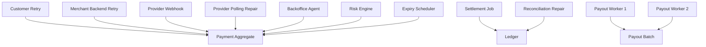
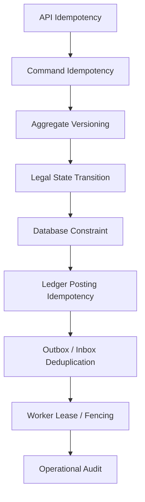
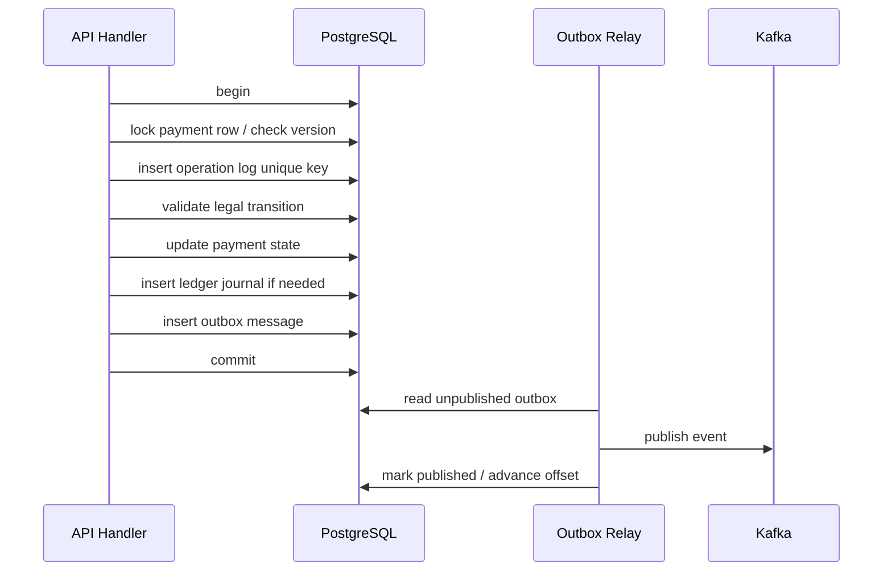
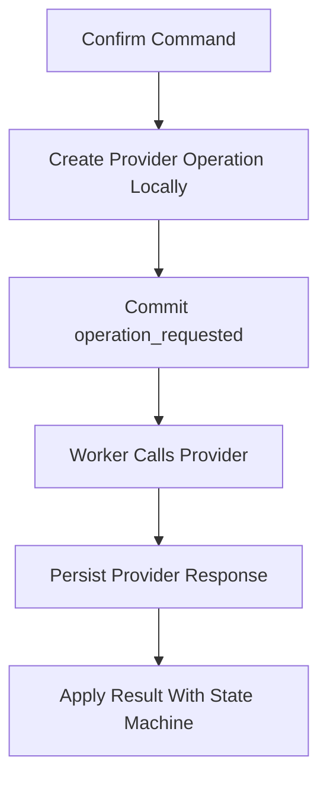
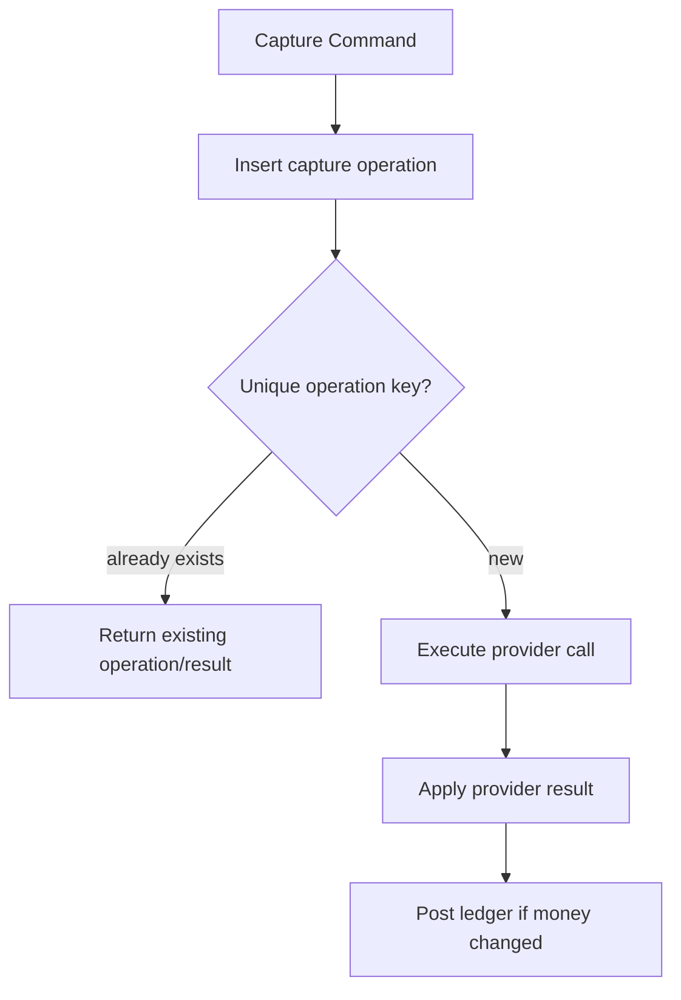
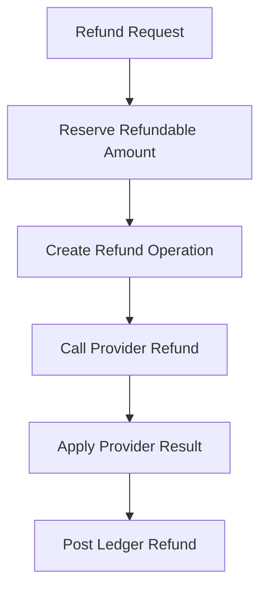
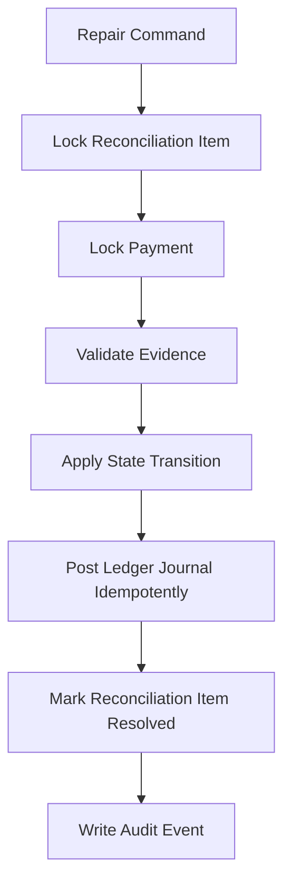

------
title: Build From Scratch: Large Production Grade Java Payment Systems - Part 019
description: Designing concurrency control for Java payment systems so duplicate commands, webhooks, retries, workers, balance reservations, captures, refunds, payouts, and ledger postings cannot create double charges, lost money, or inconsistent financial state.
series: learn-java-payment-systems
seriesTitle: Build From Scratch: Large Production Grade Java Payment Systems
order: 19
partTitle: Concurrency Control for Money Movement
tags:
- java
- payments
- concurrency
- transactions
- postgresql
- idempotency
- ledger
- fintech
date: 2026-07-02
---

# Part 019 — Concurrency Control for Money Movement

Payment bugs are often concurrency bugs wearing business names.

Double charge.

Double capture.

Refund larger than captured amount.

Webhook flips a payment back to an older state.

Two payout workers send the same merchant payout file.

Reconciliation repair posts the same settlement adjustment twice.

A customer clicks pay twice. A mobile client retries after timeout. A provider sends duplicate webhook. A scheduler restarts mid-batch. A support agent retries an operation while an automated repair job is running.

In ordinary CRUD systems, these are annoying bugs.

In payment systems, they are financial control failures.

This part answers one practical question:

> How do we design concurrency control so multiple commands, webhooks, jobs, and operators can act on the same financial object without corrupting money movement?

We will not repeat basic Java threading or generic database isolation theory. The focus is payment-specific correctness.

---

## 1. Payment Concurrency Is Not Just Multi-Threading

A beginner thinks concurrency means two Java threads access the same object.

A payment engineer thinks in a wider model:



The same financial object can be modified by many actors:

| Actor | Example Race |
|---|---|
| Customer client | retries `confirm payment` after network timeout |
| Merchant server | sends same create/confirm request with same idempotency key |
| Provider webhook | says authorization succeeded while API thread is still waiting |
| Polling repair | checks provider status while webhook is being processed |
| Expiry scheduler | expires pending payment while webhook arrives late |
| Backoffice agent | manually marks unknown payment as succeeded |
| Settlement job | posts settlement while reconciliation repair is active |
| Payout worker | picks same batch as another worker |
| Risk system | blocks payment while provider authorization returns |

Concurrency control is not one feature.

It is a layered design:



Each layer catches a different class of duplicate or race.

No single lock solves everything.

---

## 2. The Core Rule: Serialize Per Financial Decision, Not Globally

A payment system cannot run one global lock.

That would be correct and useless.

The real rule:

> Serialize the smallest unit whose invariant would be broken by concurrent mutation.

Examples:

| Invariant | Serialization Boundary |
|---|---|
| A payment cannot be captured twice beyond authorized amount | `payment_intent_id` or `authorization_id` |
| A refund cannot exceed captured amount | captured payment or charge ledger account |
| A merchant available balance cannot go negative | merchant balance/account bucket |
| A payout batch must be sent once | payout batch id |
| A settlement file row must be matched once | provider settlement item id |
| A webhook must not apply twice | provider event id + provider name |
| A ledger journal must post once | journal idempotency key |
| A provider operation must not be called twice accidentally | provider operation idempotency key |

The granularity matters.

Too broad:

```text
lock all payments
```

Correct but destroys throughput.

Too narrow:

```text
lock each row independently without understanding business invariant
```

Fast but unsafe.

Correct payment concurrency starts from invariants, not from database features.

---

## 3. Payment Race Catalogue

Before choosing locks, catalogue the races.

### 3.1 Duplicate Create

Two identical create requests arrive.

```text
POST /payment-intents
Idempotency-Key: checkout-123
```

Possible bug:

```text
payment_intent pi_1 created
payment_intent pi_2 created
customer can be charged twice
```

Control:

- idempotency record
- unique business reference per merchant/order when applicable
- request fingerprint validation
- stable response replay

### 3.2 Duplicate Confirm

Two confirm commands arrive for the same payment intent.

Possible bug:

```text
provider authorize called twice
```

Control:

- per-payment operation lock or compare-and-set transition
- operation log unique key
- provider idempotency key
- state machine transition guard

### 3.3 API Response vs Webhook Race

Thread A calls provider.

Thread B receives webhook for the same provider operation before Thread A commits.

Possible bug:

```text
API thread marks payment processing
webhook marks payment authorized
API thread overwrites payment back to processing
```

Control:

- monotonic state transition
- optimistic versioning
- event application through state machine
- provider event persisted before business application
- no blind overwrite

### 3.4 Polling vs Webhook Race

Repair job polls provider because payment is unknown.

Webhook arrives at the same time.

Possible bug:

```text
both post same ledger journal
```

Control:

- ledger idempotency key derived from provider operation/result
- provider reference map uniqueness
- state transition compare-and-set
- inbox dedupe

### 3.5 Capture vs Cancel Race

Merchant sends capture.

Scheduler or merchant sends cancel.

Possible bug:

```text
capture succeeds at provider
local payment cancelled
```

Control:

- state transition lock
- provider operation sequencing
- operation conflict detection
- unknown outcome repair

### 3.6 Refund vs Chargeback Race

Merchant issues refund.

Cardholder dispute/chargeback arrives.

Possible bug:

```text
merchant loses amount twice
```

Control:

- ledger account-level invariant
- dispute reserve account
- refundable amount derived from ledger, not stale payment row
- reconciliation repair rules

### 3.7 Payout Worker Race

Two workers pick the same payout batch.

Possible bug:

```text
same bank file transmitted twice
```

Control:

- leasing with fencing token
- `FOR UPDATE SKIP LOCKED`
- unique external batch reference
- downstream bank/provider idempotency where available
- approval state machine

---

## 4. The Concurrency Stack

A production-grade payment system uses multiple mechanisms together.

| Layer | Mechanism | Protects Against |
|---|---|---|
| API | Idempotency key + request fingerprint | client retry duplicate |
| Command | operation log | repeated internal command |
| Aggregate | optimistic version or row lock | concurrent state mutation |
| State machine | legal transition guard | stale/invalid transition |
| Database | unique constraints/check constraints | impossible duplicate facts |
| Provider | provider idempotency reference | accidental repeated external call |
| Ledger | journal idempotency key + balanced entries | duplicate financial posting |
| Eventing | outbox/inbox dedupe | duplicate publish/consume |
| Worker | lease + fencing token | competing job executors |
| Operations | maker-checker + audit | unsafe manual mutation |

The mistake is choosing one row from the table and calling it done.

Payment systems need defense in depth because each failure enters through a different door.

---

## 5. Database Transaction Boundary

The safest local financial mutation is usually one database transaction that performs:

1. load/lock the current aggregate or decision row
2. validate current state and invariant
3. insert operation/idempotency marker
4. update state using version or lock
5. insert ledger journal if money changes
6. insert outbox event
7. commit



This transaction does **not** include the remote provider call.

Remote calls cannot participate in your PostgreSQL transaction.

That means the design usually separates:

- local decision to start an operation
- external provider call
- local application of provider result

For example:



You can still do synchronous provider calls for latency-sensitive flows, but you must treat the remote call as outside your DB transaction and protect the local apply step.

---

## 6. Optimistic Locking

Optimistic locking is useful when collisions are uncommon but dangerous.

Schema:

```sql
create table payment_intent (
    id uuid primary key,
    merchant_id uuid not null,
    amount_minor bigint not null,
    currency char(3) not null,
    status text not null,
    authorized_amount_minor bigint not null default 0,
    captured_amount_minor bigint not null default 0,
    refunded_amount_minor bigint not null default 0,
    version bigint not null default 0,
    created_at timestamptz not null default now(),
    updated_at timestamptz not null default now(),

    constraint payment_amount_positive check (amount_minor > 0),
    constraint payment_capture_not_above_authorized
        check (captured_amount_minor <= authorized_amount_minor),
    constraint payment_refund_not_above_captured
        check (refunded_amount_minor <= captured_amount_minor)
);
```

Update with compare-and-set:

```sql
update payment_intent
set
    status = :new_status,
    captured_amount_minor = captured_amount_minor + :capture_amount_minor,
    version = version + 1,
    updated_at = now()
where id = :payment_intent_id
  and version = :expected_version
  and status in ('AUTHORIZED', 'PARTIALLY_CAPTURED')
  and captured_amount_minor + :capture_amount_minor <= authorized_amount_minor;
```

If affected rows = 0, do not guess.

Reload the row and classify:

| Reloaded Condition | Interpretation |
|---|---|
| already captured with same operation id | idempotent replay |
| status changed to cancelled | command conflict |
| captured amount would exceed authorized | business rejection |
| version changed but still capturable | retry transaction |
| payment not found | invalid reference |

Optimistic locking is not just `@Version`.

For payment systems, the `WHERE` clause must encode business invariants.

Bad:

```sql
where id = :id and version = :version
```

Better:

```sql
where id = :id
  and version = :version
  and status in ('AUTHORIZED', 'PARTIALLY_CAPTURED')
  and captured_amount_minor + :amount <= authorized_amount_minor
```

The second query protects the money invariant even if application code has a bug.

---

## 7. Pessimistic Locking

Pessimistic locking is useful when the cost of conflict is high or the operation is naturally serialized.

Example:

```sql
select *
from payment_intent
where id = :payment_intent_id
for update;
```

This locks the selected row until transaction end.

PostgreSQL row-level locks block writers/lockers to the same row, not ordinary readers.

Use pessimistic locks when:

- applying provider result to a payment aggregate
- calculating and updating merchant available balance cache
- selecting payout batch for processing
- applying reconciliation repair to a settlement item
- changing a dispute state with financial posting

Do not hold the lock while calling an external provider.

Bad:

```java
transactionTemplate.execute(tx -> {
    PaymentIntent pi = repo.lock(paymentIntentId);
    ProviderResult result = provider.capture(...); // bad: remote call inside lock
    repo.applyCapture(pi, result);
});
```

Better:

```java
// transaction 1: reserve operation
transactionTemplate.execute(tx -> {
    PaymentIntent pi = repo.lock(paymentIntentId);
    operationRepo.createCaptureOperation(pi.id(), command.idempotencyKey());
});

// outside DB transaction
ProviderResult result = provider.capture(...);

// transaction 2: apply result safely
transactionTemplate.execute(tx -> {
    CaptureOperation op = operationRepo.lock(operationId);
    paymentService.applyProviderCaptureResult(op, result);
});
```

The external call can hang.

Your database lock should not.

---

## 8. Unique Constraints Are Financial Controls

Application code is not enough.

The database must reject impossible duplicates.

### 8.1 API Idempotency

```sql
create table api_idempotency_key (
    merchant_id uuid not null,
    idempotency_key text not null,
    request_fingerprint text not null,
    response_status int,
    response_body jsonb,
    status text not null,
    created_at timestamptz not null default now(),
    expires_at timestamptz not null,
    primary key (merchant_id, idempotency_key)
);
```

### 8.2 Provider Operation

```sql
create table provider_operation (
    id uuid primary key,
    payment_intent_id uuid not null references payment_intent(id),
    operation_type text not null,
    operation_key text not null,
    provider_name text not null,
    provider_idempotency_key text not null,
    provider_reference text,
    status text not null,
    fencing_token bigint not null default 0,
    created_at timestamptz not null default now(),

    constraint uq_provider_operation_key
        unique (payment_intent_id, operation_type, operation_key),

    constraint uq_provider_idempotency_key
        unique (provider_name, provider_idempotency_key),

    constraint uq_provider_reference
        unique (provider_name, provider_reference)
);
```

`provider_reference` may be nullable before the provider returns. In PostgreSQL, normal unique constraints allow multiple nulls. If you need stricter behavior for a nullable field, use partial unique indexes.

```sql
create unique index uq_provider_reference_present
on provider_operation(provider_name, provider_reference)
where provider_reference is not null;
```

### 8.3 Provider Event Dedupe

```sql
create table provider_event_raw (
    id uuid primary key,
    provider_name text not null,
    provider_event_id text not null,
    received_at timestamptz not null default now(),
    payload jsonb not null,
    signature_valid boolean not null,
    processing_status text not null,

    constraint uq_provider_event unique (provider_name, provider_event_id)
);
```

### 8.4 Ledger Journal Idempotency

```sql
create table ledger_journal (
    id uuid primary key,
    journal_type text not null,
    idempotency_key text not null,
    business_reference_type text not null,
    business_reference_id uuid not null,
    currency char(3) not null,
    status text not null,
    created_at timestamptz not null default now(),

    constraint uq_ledger_journal_idempotency unique (idempotency_key)
);
```

The database is your last line of defense.

If duplicate money movement can be created by a race, there should be a unique constraint that makes it impossible or at least immediately visible.

---

## 9. Operation Log as the Concurrency Gate

For payment commands, a dedicated operation log is often safer than directly mutating the payment row.



Example schema:

```sql
create table payment_operation (
    id uuid primary key,
    payment_intent_id uuid not null references payment_intent(id),
    operation_type text not null,
    operation_key text not null,
    request_payload jsonb not null,
    status text not null,
    result_payload jsonb,
    error_code text,
    created_at timestamptz not null default now(),
    updated_at timestamptz not null default now(),

    constraint uq_payment_operation
        unique (payment_intent_id, operation_type, operation_key)
);
```

The `operation_key` is not always the public idempotency key.

It can be derived from:

```text
merchant_id + payment_intent_id + operation_type + capture_sequence
merchant_id + payment_intent_id + operation_type + refund_request_id
provider + provider_reference + event_type
settlement_file_id + line_number + adjustment_type
```

The operation log gives you:

- dedupe
- audit
- replay
- repair
- state visibility
- error investigation
- safe retries

It also prevents the common bug where the same command is invisible after partial failure.

---

## 10. State Transition Must Be Monotonic

Provider events do not always arrive in business order.

Example:

```text
10:00:01 webhook: payment captured
10:00:03 webhook: payment authorized
```

If your code blindly assigns status, the second event can regress the payment.

Bad:

```java
payment.setStatus(mapProviderStatus(event.status()));
```

Better:

```java
PaymentTransition transition = stateMachine.decide(
    payment.currentStatus(),
    normalizedProviderEvent
);

if (transition.isNoop()) {
    event.markIgnored("stale_or_duplicate_event");
    return;
}

if (transition.isIllegal()) {
    event.markNeedsReview("illegal_transition");
    return;
}

payment.apply(transition);
```

A payment state machine should classify every event as one of:

| Classification | Meaning |
|---|---|
| apply | valid transition to newer business fact |
| noop duplicate | event already reflected |
| noop stale | event is older than current state |
| conflict | event contradicts current state |
| review | cannot decide automatically |

This is not just clean design.

It prevents old webhook data from overwriting newer financial truth.

---

## 11. Compare-and-Set State Transition

One robust pattern is a transition table plus compare-and-set update.

```sql
create table payment_transition_rule (
    from_status text not null,
    event_type text not null,
    to_status text not null,
    priority int not null,
    posts_ledger boolean not null,
    primary key (from_status, event_type)
);
```

Apply:

```sql
update payment_intent
set
    status = :to_status,
    version = version + 1,
    updated_at = now()
where id = :payment_intent_id
  and status = :expected_from_status
  and version = :expected_version;
```

But status alone is insufficient for money amounts.

For capture:

```sql
update payment_intent
set
    status = case
        when captured_amount_minor + :amount = authorized_amount_minor then 'CAPTURED'
        else 'PARTIALLY_CAPTURED'
    end,
    captured_amount_minor = captured_amount_minor + :amount,
    version = version + 1,
    updated_at = now()
where id = :payment_intent_id
  and status in ('AUTHORIZED', 'PARTIALLY_CAPTURED')
  and captured_amount_minor + :amount <= authorized_amount_minor;
```

This pattern is useful because the database update itself guards the invariant.

---

## 12. Ledger Posting Under Concurrency

A payment state can be duplicated by accident.

A ledger posting must not.

Ledger journal creation should always be idempotent by business key.

Example capture journal idempotency key:

```text
capture:{provider_name}:{provider_operation_reference}:{capture_amount}:{currency}
```

Refund journal idempotency key:

```text
refund:{payment_intent_id}:{merchant_refund_id}:{amount}:{currency}
```

Settlement line journal idempotency key:

```text
settlement:{provider}:{settlement_file_id}:{line_number}:{entry_type}
```

Example posting algorithm:

```java
public PostedJournal postCapture(CaptureApplied event) {
    String key = LedgerKeys.capture(
        event.providerName(),
        event.providerOperationReference(),
        event.amount()
    );

    return transaction.execute(() -> {
        Optional<LedgerJournal> existing = ledgerJournalRepo.findByIdempotencyKey(key);
        if (existing.isPresent()) {
            return PostedJournal.replayed(existing.get().id());
        }

        LedgerJournal journal = LedgerJournal.capture(
            key,
            event.paymentIntentId(),
            event.amount()
        );

        journal.validateBalanced();
        ledgerJournalRepo.insert(journal);
        outbox.insert(LedgerJournalPosted.from(journal));
        return PostedJournal.created(journal.id());
    });
}
```

Important:

```text
state idempotency != ledger idempotency
```

A payment row may already be in `CAPTURED` state but the ledger journal may be missing due to a bug, migration issue, or manual repair.

That should be visible and repairable.

Do not hide ledger correctness behind payment status.

---

## 13. Balance Reservation Concurrency

Balance systems are dangerous because they look simple.

Naive payout check:

```java
BigDecimal balance = balanceRepo.getAvailableBalance(merchantId);
if (balance.compareTo(payoutAmount) >= 0) {
    balanceRepo.decreaseAvailableBalance(merchantId, payoutAmount);
    payoutRepo.create(...);
}
```

Two workers can both see the same balance.

Correct shape:

```sql
update merchant_balance
set
    available_minor = available_minor - :amount,
    reserved_minor = reserved_minor + :amount,
    version = version + 1,
    updated_at = now()
where merchant_id = :merchant_id
  and currency = :currency
  and available_minor >= :amount;
```

If affected rows = 1, reservation succeeded.

If affected rows = 0, insufficient available balance or conflict.

A balance reservation should also have its own record:

```sql
create table balance_reservation (
    id uuid primary key,
    merchant_id uuid not null,
    currency char(3) not null,
    amount_minor bigint not null,
    reservation_type text not null,
    business_reference_type text not null,
    business_reference_id uuid not null,
    status text not null,
    created_at timestamptz not null default now(),

    constraint uq_balance_reservation_ref
        unique (business_reference_type, business_reference_id, reservation_type),
    constraint amount_positive check (amount_minor > 0)
);
```

Why both balance row and reservation row?

| Object | Purpose |
|---|---|
| `merchant_balance` | fast current bucket value |
| `balance_reservation` | audit and idempotency for why money was reserved |
| ledger journal | financial truth behind reservation/release |

The balance row is a projection/cache with guarded updates.

The ledger explains the money.

---

## 14. Worker Leasing and Fencing Tokens

Some payment workflows are executed by background workers:

- webhook processor
- provider operation executor
- reconciliation matcher
- settlement batch creator
- payout file sender
- report generator
- expiry scheduler

A queue may redeliver the same item.

A worker may pause due to GC, network stall, or deployment interruption.

A simple `locked_by` column is not enough unless stale workers are fenced.

### 14.1 Lease Table Pattern

```sql
create table worker_lease (
    lease_name text primary key,
    owner_id text not null,
    fencing_token bigint not null,
    lease_until timestamptz not null,
    updated_at timestamptz not null default now()
);
```

Acquire or renew:

```sql
insert into worker_lease (lease_name, owner_id, fencing_token, lease_until)
values (:lease_name, :owner_id, 1, now() + interval '30 seconds')
on conflict (lease_name)
do update set
    owner_id = excluded.owner_id,
    fencing_token = worker_lease.fencing_token + 1,
    lease_until = excluded.lease_until,
    updated_at = now()
where worker_lease.lease_until < now()
returning fencing_token;
```

The `where worker_lease.lease_until < now()` prevents stealing an active lease.

The fencing token increments each time a new owner takes over.

### 14.2 Why Fencing Matters

Imagine:

```text
T1 worker A gets lease token 7
T2 worker A pauses for 60 seconds
T3 worker B gets lease token 8
T4 worker B sends payout file
T5 worker A wakes up and sends payout file too
```

Without fencing, worker A still thinks it owns the job.

With fencing, every side-effect checks token freshness:

```sql
update payout_batch
set status = 'SENT', sent_at = now()
where id = :batch_id
  and lease_fencing_token = :worker_token
  and status = 'SENDING';
```

If worker A uses token 7 after token 8 exists, the update fails.

For external side effects like bank file transmission, also use:

- unique external batch reference
- provider/bank idempotency when available
- transmission log unique key
- maker-checker approval
- reconciliation detection

Fencing reduces stale-worker damage.

It does not magically make external systems transactional.

---

## 15. `FOR UPDATE SKIP LOCKED` for Work Distribution

When many workers process pending rows, PostgreSQL `FOR UPDATE SKIP LOCKED` is useful.

Example webhook processor:

```sql
with picked as (
    select id
    from provider_event_raw
    where processing_status = 'PENDING'
    order by received_at
    for update skip locked
    limit 100
)
update provider_event_raw e
set processing_status = 'PROCESSING', updated_at = now()
from picked
where e.id = picked.id
returning e.*;
```

Workers skip rows locked by other workers instead of waiting.

Good for:

- webhook processing
- outbox publishing
- reconciliation tasks
- settlement row matching
- retry jobs

Bad for:

- preserving strict order across all events
- operations requiring global ordering
- silently ignoring starvation

Payment-specific rule:

> `SKIP LOCKED` is fine for picking work. It is not enough to protect the financial mutation performed by that work.

You still need aggregate/ledger idempotency when applying the work.

---

## 16. Advisory Locks: Use Carefully

PostgreSQL advisory locks can serialize by arbitrary key.

Example conceptual usage:

```sql
select pg_advisory_xact_lock(hashtext(:payment_intent_id));
```

This can be convenient when no single row exists yet or when the lock is logical.

Potential uses:

- serialize create by merchant order reference before row exists
- serialize migration/backfill per merchant
- serialize reconciliation repair per settlement file

Risks:

- invisible to normal row lock inspection unless you know what to check
- easy to use inconsistent lock key derivation
- can create deadlocks if multiple advisory locks are acquired in inconsistent order
- not a replacement for unique constraints

Use advisory locks only when row locks or unique constraints are not enough.

And always keep the database constraint anyway.

---

## 17. Isolation Level Is Not a Design Substitute

Serializable isolation can prevent classes of anomalies.

But using `SERIALIZABLE` everywhere in a high-throughput payment system may create retries and operational complexity.

Common practical approach:

| Use Case | Typical Approach |
|---|---|
| Single payment state transition | row lock or optimistic compare-and-set |
| Insert unique operation | unique constraint + transaction |
| Balance reservation | guarded atomic update |
| Work queue picking | `FOR UPDATE SKIP LOCKED` |
| Complex cross-row invariant | explicit locks or serializable transaction |
| Ledger posting | unique idempotency key + balanced entries in one transaction |

The key is not “always serializable” or “never serializable”.

The key is knowing which invariant needs which protection.

---

## 18. Java Implementation Sketch

### 18.1 Payment Lock Port

```java
public interface PaymentConcurrencyGateway {
    LockedPaymentIntent lockPaymentIntent(PaymentIntentId id);
    boolean transitionByVersion(PaymentIntentId id, long expectedVersion, PaymentTransition transition);
}
```

### 18.2 Command Handler Shape

```java
public final class CapturePaymentHandler {
    private final TransactionRunner tx;
    private final PaymentOperationRepository operationRepo;
    private final PaymentIntentRepository paymentRepo;
    private final LedgerPostingService ledgerPostingService;
    private final OutboxRepository outbox;

    public CaptureResponse handle(CaptureCommand command) {
        return tx.run(() -> {
            LockedPaymentIntent payment = paymentRepo.lock(command.paymentIntentId());

            PaymentOperation existing = operationRepo.findByBusinessKey(
                payment.id(),
                PaymentOperationType.CAPTURE,
                command.operationKey()
            ).orElse(null);

            if (existing != null) {
                return CaptureResponse.fromExisting(existing);
            }

            payment.assertCapturable(command.amount());

            PaymentOperation operation = PaymentOperation.captureRequested(
                payment.id(),
                command.operationKey(),
                command.amount(),
                command.providerRoute()
            );

            operationRepo.insert(operation);
            payment.markCaptureRequested(operation.id());
            paymentRepo.save(payment);
            outbox.insert(CaptureRequestedEvent.from(operation));

            return CaptureResponse.accepted(operation.id());
        });
    }
}
```

This handler does not call the provider.

It records a durable operation request.

A worker executes the provider call and applies the result with another transaction.

### 18.3 Applying Provider Result

```java
public final class ApplyCaptureResultHandler {
    private final TransactionRunner tx;
    private final PaymentOperationRepository operationRepo;
    private final PaymentIntentRepository paymentRepo;
    private final LedgerPostingService ledger;
    private final OutboxRepository outbox;

    public void handle(ProviderCaptureResultReceived event) {
        tx.run(() -> {
            PaymentOperation operation = operationRepo.lock(event.operationId());

            if (operation.isTerminal()) {
                return null;
            }

            LockedPaymentIntent payment = paymentRepo.lock(operation.paymentIntentId());

            CaptureDecision decision = payment.applyCaptureResult(operation, event.result());

            operation.markApplied(event.result());
            operationRepo.save(operation);
            paymentRepo.save(payment);

            if (decision.postsLedger()) {
                ledger.postCapture(decision.ledgerCommand());
            }

            outbox.insert(PaymentEvent.from(decision));
            return null;
        });
    }
}
```

Important properties:

- operation row locked
- payment row locked
- terminal operation is no-op
- state machine decides transition
- ledger posting is idempotent
- outbox emits after local state commits

---

## 19. Lock Ordering

Deadlocks happen when transactions acquire locks in different order.

Payment services should define lock ordering rules.

Example:

```text
1. merchant/account configuration
2. payment intent
3. payment operation
4. ledger account rows
5. balance projection rows
6. outbox rows
```

Or another order, as long as it is consistent.

Bad:

```text
capture flow: lock payment -> lock merchant balance
refund flow: lock merchant balance -> lock payment
```

This can deadlock.

Better:

```text
all flows: lock payment -> lock merchant balance
```

For multi-payment operations, sort IDs before locking.

```java
List<PaymentIntentId> ordered = ids.stream()
    .sorted()
    .toList();

for (PaymentIntentId id : ordered) {
    paymentRepo.lock(id);
}
```

Payment systems need lock discipline because operational jobs often touch many rows.

---

## 20. Concurrency in Refunds

Refunds are a classic race surface.

Assume captured amount is 100.

Two refund requests of 70 arrive concurrently.

Bad implementation:

```text
Thread A reads refundable = 100
Thread B reads refundable = 100
Thread A creates refund 70
Thread B creates refund 70
Total refund = 140
```

Correct guarded insert/update:

```sql
update payment_intent
set
    refunded_amount_minor = refunded_amount_minor + :refund_amount,
    version = version + 1,
    updated_at = now()
where id = :payment_intent_id
  and captured_amount_minor - refunded_amount_minor >= :refund_amount;
```

Then insert refund record in same transaction:

```sql
insert into refund (
    id,
    payment_intent_id,
    merchant_refund_reference,
    amount_minor,
    currency,
    status
) values (
    :id,
    :payment_intent_id,
    :merchant_refund_reference,
    :amount_minor,
    :currency,
    'REQUESTED'
);
```

With unique key:

```sql
create unique index uq_refund_merchant_reference
on refund(payment_intent_id, merchant_refund_reference);
```

For stronger auditability, treat refund amount reservation separately from provider refund execution:



The moment you accept a refund request, reserve the refundable amount locally.

Do not wait until provider result to discover that another thread consumed the amount.

---

## 21. Concurrency in Captures

Captures can be full, partial, multiple, or final depending on provider and payment method.

Invariant:

```text
sum(successful captures) <= authorized amount
```

If provider supports multiple partial captures, capture concurrency must be explicit.

Options:

| Strategy | Behavior |
|---|---|
| single capture only | first accepted capture wins; later capture rejected |
| sequential partial capture | one capture operation at a time |
| concurrent partial capture with reservation | each capture reserves part of auth amount |

For most platforms, sequential partial capture is safer:

```sql
select *
from payment_intent
where id = :id
for update;

-- reject if any capture operation is REQUESTED or PROCESSING
select count(*)
from payment_operation
where payment_intent_id = :id
  and operation_type = 'CAPTURE'
  and status in ('REQUESTED', 'PROCESSING')
for update;
```

Then create a new capture operation.

Reason:

Remote provider capture behavior varies.

Some providers do not like overlapping capture requests for the same authorization.

Your platform should serialize unless the provider contract proves concurrent partial capture is safe.

---

## 22. Concurrency in Webhook Processing

Webhook ingestion has two stages:

1. raw event persistence
2. business application

Raw persistence should dedupe by provider event id.

Business application should dedupe by provider operation/result id.

Why both?

Provider may send:

```text
event evt_1: capture succeeded for cap_123
event evt_2: payment updated, includes capture cap_123
```

Different event IDs may carry the same business fact.

So the ledger posting key cannot be only the webhook event id.

Better:

```text
ledger idempotency key = provider + business_fact_type + provider_business_reference
```

Example:

```text
stripe:capture_succeeded:ch_123
adyen:capture_succeeded:psp_reference_456
bank:va_payment_received:statement_id:line_no
```

Webhook event dedupe protects ingestion.

Business fact dedupe protects money.

---

## 23. Concurrency in Reconciliation Repair

Reconciliation repair is dangerous because it can override system history.

Example:

- provider report says payment settled
- local system says payment unknown
- operator/job wants to repair local state

Controls:

- reconciliation item unique key
- repair case id
- maker-checker for high-risk repair
- ledger idempotency key
- before/after snapshot
- no destructive update
- explicit reason code

Repair should be modeled as a command:

```text
RepairPaymentFromSettlementEvidence
```

Not as direct SQL update.

Repair transaction:



A repair job should be able to run twice and produce the same final ledger.

---

## 24. Concurrency in Payouts

Payouts are high-risk because they create external money movement.

Invariant:

```text
one approved payout instruction must produce at most one external payout transmission
```

Controls:

- payout state machine
- approval workflow
- balance reservation
- batch idempotency key
- worker lease/fencing
- external file/reference uniqueness
- transmission log
- bank/provider acknowledgement tracking
- reconciliation

Schema sketch:

```sql
create table payout_batch (
    id uuid primary key,
    merchant_id uuid not null,
    currency char(3) not null,
    amount_minor bigint not null,
    status text not null,
    external_batch_reference text not null,
    lease_fencing_token bigint,
    approved_by text,
    approved_at timestamptz,
    sent_at timestamptz,
    created_at timestamptz not null default now(),

    constraint uq_external_batch_reference unique (external_batch_reference),
    constraint payout_amount_positive check (amount_minor > 0)
);
```

Transmission log:

```sql
create table payout_transmission (
    id uuid primary key,
    payout_batch_id uuid not null references payout_batch(id),
    external_batch_reference text not null,
    attempt_no int not null,
    status text not null,
    request_hash text not null,
    response_payload jsonb,
    created_at timestamptz not null default now(),

    constraint uq_payout_transmission_attempt
        unique (payout_batch_id, attempt_no),

    constraint uq_payout_transmission_external_ref
        unique (external_batch_reference)
);
```

Even if a worker races, the database refuses duplicate external references.

Even if the database is correct, the bank may still process duplicate files if your reference strategy is bad.

Concurrency control must extend to external identifiers.

---

## 25. When to Prefer Append-Only Over Update

For financial facts, append-only is often safer.

Bad:

```sql
update ledger_balance set amount = amount + 100;
```

By itself, this loses explanation.

Better:

```text
append journal entry
then update balance projection under guard
```

Use updates for operational state:

- payment status
- operation processing status
- webhook processing status
- payout batch status
- balance projection cache

Use append-only records for financial facts:

- ledger journals
- ledger entries
- provider raw events
- reconciliation evidence
- settlement file rows
- operator actions
- adjustment records

Updates answer “where is the workflow now?”

Append-only facts answer “why is the money here?”

---

## 26. Failure Matrix

| Failure | Without Control | Required Control |
|---|---|---|
| client retries create payment | duplicate payment intent | API idempotency + unique business reference |
| client retries confirm | double provider authorization | operation log + provider idempotency |
| webhook arrives before API response | state regression | monotonic state machine + version guard |
| duplicate webhook | duplicate ledger posting | raw event dedupe + ledger idempotency |
| two refunds concurrently | over-refund | guarded update or row lock |
| capture and cancel race | contradictory state | operation conflict policy + lock |
| two payout workers | duplicate payout file | lease + fencing + external reference uniqueness |
| worker resumes after lease expiry | stale side effect | fencing token validation |
| reconciliation repair reruns | duplicate adjustment | repair command idempotency + ledger key |
| outbox publishes twice | duplicate downstream effect | consumer inbox/idempotency |
| manual SQL fix | audit gap | backoffice command + maker-checker + audit trail |

---

## 27. Testing Concurrency

Do not test only the happy path.

### 27.1 Concurrent Refund Test

```java
@Test
void concurrentRefundsMustNotExceedCapturedAmount() throws Exception {
    PaymentIntentId paymentId = givenCapturedPayment(100_00, "USD");

    ExecutorService pool = Executors.newFixedThreadPool(2);

    Callable<RefundResult> task1 = () -> refundService.requestRefund(
        new RefundCommand(paymentId, Money.usd(70_00), "refund-a")
    );
    Callable<RefundResult> task2 = () -> refundService.requestRefund(
        new RefundCommand(paymentId, Money.usd(70_00), "refund-b")
    );

    List<Future<RefundResult>> results = pool.invokeAll(List.of(task1, task2));

    PaymentIntent payment = paymentRepository.get(paymentId);

    assertThat(payment.refundedAmount()).isLessThanOrEqualTo(Money.usd(100_00));
    assertThat(ledger.sumRefundJournals(paymentId)).isLessThanOrEqualTo(Money.usd(100_00));
}
```

Expected result:

```text
one refund accepted, one refund rejected
```

or:

```text
one refund accepted, one retry sees insufficient refundable amount
```

Never:

```text
two refunds accepted for total 140
```

### 27.2 Duplicate Webhook Property

```text
Given a provider business fact F
When F is delivered N times through M different webhook envelopes
Then ledger journal for F exists exactly once
And payment state is not regressed
```

### 27.3 Random Event Ordering

Generate permutations:

```text
authorized
capture_requested
captured
settled
refund_requested
refunded
chargeback_opened
```

Feed them in random order.

Assert:

- illegal transitions are quarantined
- stale transitions are ignored
- ledger remains balanced
- captured amount never exceeds authorized
- refunded amount never exceeds captured
- settled amount never exceeds captured minus reversals according to policy

### 27.4 Worker Crash Test

Simulate:

```text
worker picks payout batch
worker sends provider request
worker crashes before marking sent
job retries
```

Assert:

- same external reference reused when safe
- duplicate external transmission prevented or detected
- payout state becomes unknown if provider outcome cannot be proven
- reconciliation can resolve final state

---

## 28. Observability for Concurrency Controls

Concurrency failures should be visible before customers complain.

Metrics:

| Metric | Meaning |
|---|---|
| `payment.idempotency.replay.count` | client retry volume |
| `payment.operation.duplicate.count` | duplicate command attempts |
| `payment.transition.conflict.count` | compare-and-set/state conflicts |
| `webhook.duplicate.count` | provider event duplicates |
| `ledger.idempotency.replay.count` | duplicate financial fact attempts |
| `worker.lease.stolen.count` | worker takeover frequency |
| `db.deadlock.count` | lock order/design issue |
| `db.lock_wait.duration` | contention |
| `payout.duplicate_external_reference.count` | severe payout safety signal |

Logs should include:

- payment id
- merchant id
- operation id
- provider reference
- idempotency key hash
- transition from/to
- version before/after
- lock wait duration
- ledger journal id
- worker owner/fencing token

Do not log PAN, CVV, sensitive authentication data, or secrets.

---

## 29. Anti-Patterns

### Anti-Pattern 1: Check Then Insert Without Unique Constraint

```java
if (!repo.exists(key)) {
    repo.insert(row);
}
```

Two threads can both pass `exists`.

Use unique constraint and handle duplicate key.

### Anti-Pattern 2: Blind Status Assignment

```java
payment.status = provider.status;
```

This allows state regression.

Use state machine transition.

### Anti-Pattern 3: Remote Call Inside Row Lock

```java
select for update;
provider.call();
commit;
```

This causes lock amplification and operational fragility.

Persist operation first, call provider outside the lock, apply result safely.

### Anti-Pattern 4: Ledger Entry Without Idempotency Key

```java
ledger.post(...);
```

If the caller retries, money is posted twice.

Every ledger journal must have a business idempotency key.

### Anti-Pattern 5: Worker Lock Without Fencing

```text
locked_by = worker-a
```

A paused worker can resume after a new worker owns the lease.

Use fencing token for stale-owner protection.

### Anti-Pattern 6: Balance From Stale Read

```java
if (balance.available() >= amount) createPayout();
```

Use guarded atomic update or locked balance row.

### Anti-Pattern 7: Trusting Queue Exactly-Once

Even if your broker has strong producer semantics, your business handler may still run twice.

Use inbox and business idempotency.

---

## 30. Practical Design Rules

1. Every external command needs an idempotency strategy.
2. Every provider operation needs a unique operation record.
3. Every provider business fact needs dedupe independent of webhook envelope.
4. Every state transition must be legal from current state.
5. Every financial posting must be idempotent and balanced.
6. Every balance reservation must be atomic.
7. Every worker lease that can create external side effects needs fencing.
8. Every duplicate must be classified as safe replay, stale event, conflict, or incident.
9. Every manual repair must be a command, not ad-hoc mutation.
10. Every concurrency control must be testable under forced race.

---

## 31. Readiness Checklist

Use this checklist before calling a payment flow production-grade.

### API and Command

- [ ] Public mutation endpoints require idempotency key where appropriate.
- [ ] Idempotency key is scoped by merchant/account.
- [ ] Request fingerprint prevents key reuse with different payload.
- [ ] Operation log exists for provider-impacting commands.
- [ ] Duplicate operation returns existing result or safe in-progress response.

### Database

- [ ] Unique constraints exist for business idempotency keys.
- [ ] State updates use lock or compare-and-set.
- [ ] Money constraints are enforced in SQL, not only Java.
- [ ] Lock ordering is documented.
- [ ] Deadlock retry policy exists for safe transactions.

### Provider

- [ ] Provider idempotency key is stable across retry.
- [ ] Provider reference mapping is unique.
- [ ] Unknown outcome is first-class.
- [ ] Webhook and polling can both apply the same fact safely.

### Ledger

- [ ] Ledger journal has idempotency key.
- [ ] Journal entries balance to zero per currency.
- [ ] Duplicate posting attempts are safe replays.
- [ ] Ledger posting does not depend only on mutable payment status.

### Workers

- [ ] Work picking is safe under multiple workers.
- [ ] External side-effect workers use lease/fencing.
- [ ] Retried jobs are idempotent.
- [ ] Poison items are quarantined, not retried forever.

### Operations

- [ ] Repair commands are audited.
- [ ] Manual actions have maker-checker for risky flows.
- [ ] Concurrency conflict metrics are monitored.
- [ ] Duplicate external transmission is a page-worthy signal.

---

## 32. Mental Model

Payment concurrency control is not about making every operation single-threaded.

It is about ensuring that every concurrent actor hits a guardrail before it can break a financial invariant.

The strongest systems do not rely on one mechanism.

They combine:

```text
idempotency
+ operation log
+ legal state machine
+ version/row lock
+ database constraints
+ ledger idempotency
+ worker fencing
+ reconciliation
+ audit
```

The goal is not to prevent all retries, duplicates, and races.

The goal is to make them boring.

A duplicate command should become a replay.

A stale webhook should become a no-op.

A conflicting event should become a review case.

A worker crash should become a retry.

A ledger duplicate should become an idempotent journal lookup.

That is what production-grade payment concurrency looks like.

---

## References

- PostgreSQL Documentation — Explicit Locking: https://www.postgresql.org/docs/current/explicit-locking.html
- PostgreSQL Documentation — Transaction Isolation: https://www.postgresql.org/docs/current/transaction-iso.html
- PostgreSQL Documentation — Numeric Types: https://www.postgresql.org/docs/current/datatype-numeric.html
- Stripe API Reference — Idempotent Requests: https://docs.stripe.com/api/idempotent_requests
- Martin Fowler — Accounting Transaction: https://martinfowler.com/eaaDev/AccountingTransaction.html
