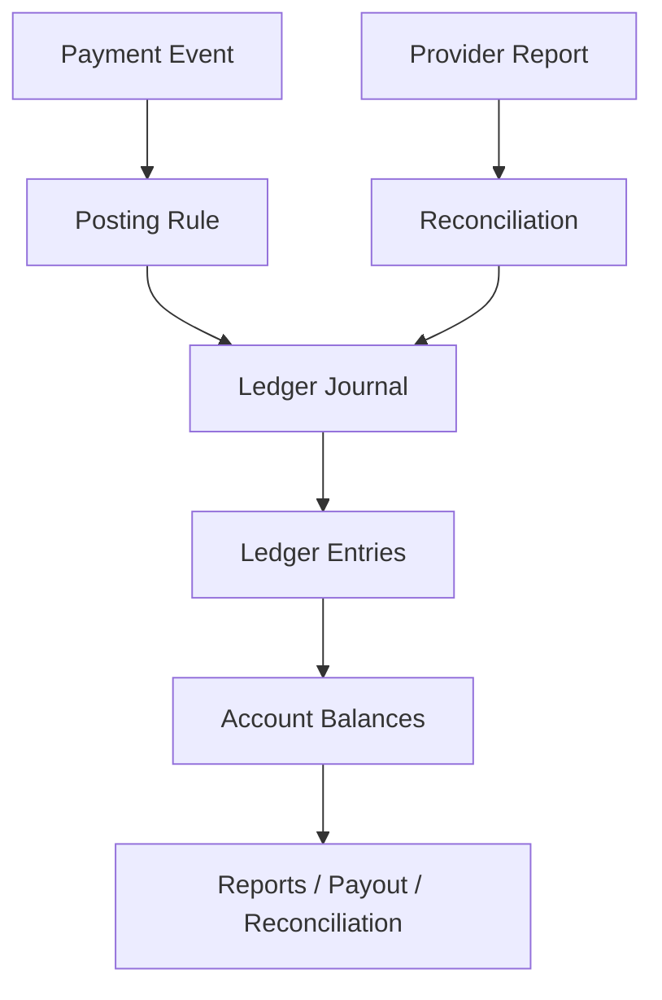
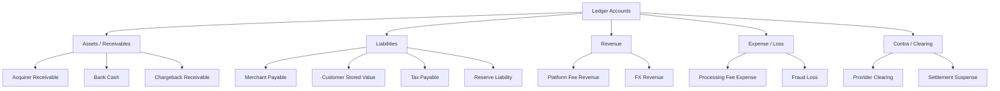
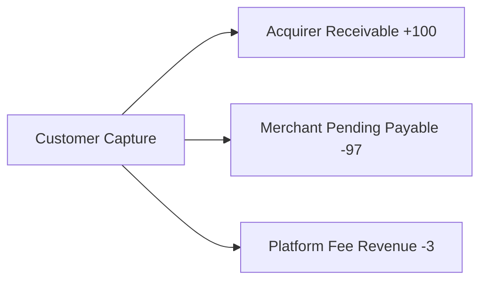
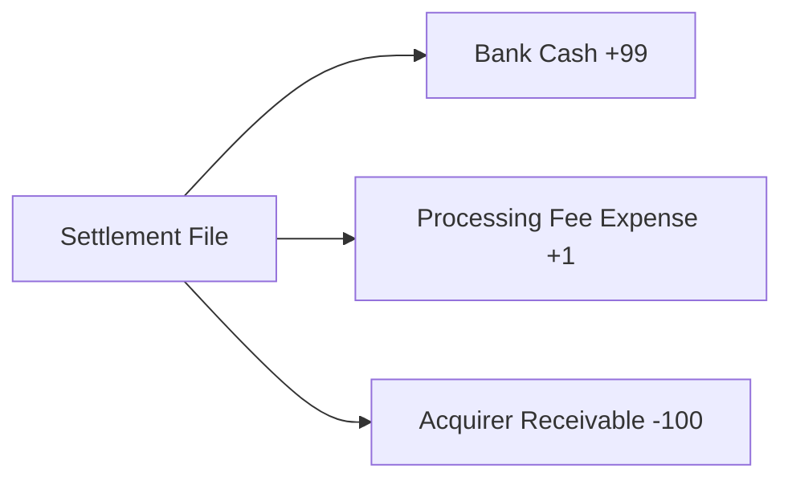
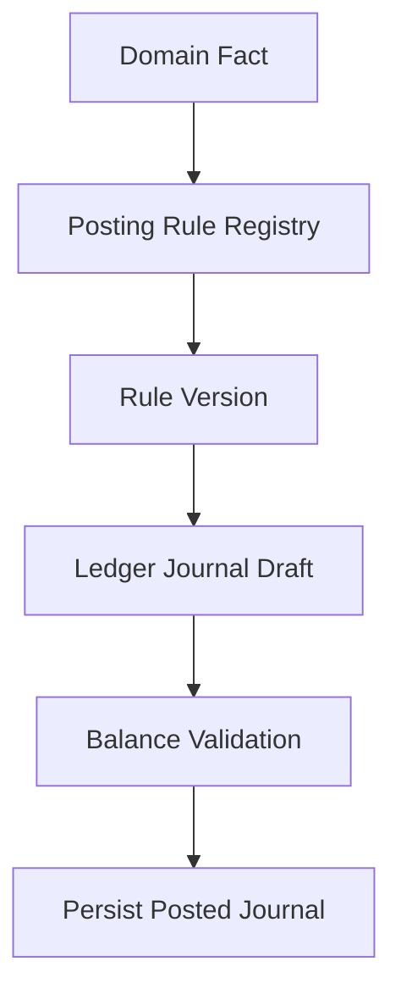
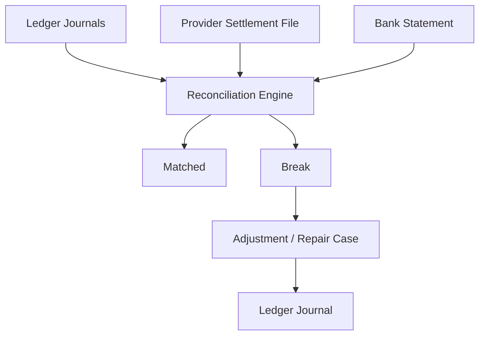
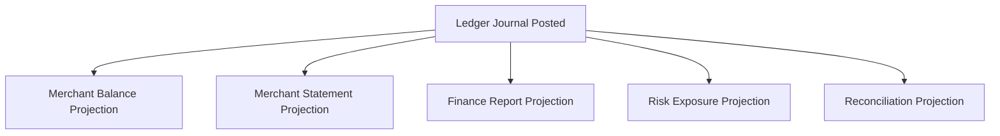
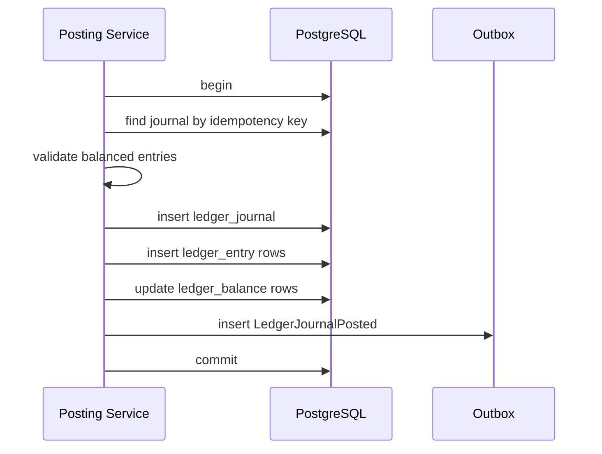

------
title: Build From Scratch: Large Production Grade Java Payment Systems - Part 020
description: Building the double-entry ledger foundation for a Java payment system, including accounts, journals, entries, posting rules, balance integrity, idempotency, reversals, corrections, and payment-specific accounting flows.
series: learn-java-payment-systems
seriesTitle: Build From Scratch: Large Production Grade Java Payment Systems
order: 20
partTitle: Double-Entry Ledger Foundation
tags:
- java
- payments
- ledger
- accounting
- double-entry
- fintech
- postgresql
- reconciliation
date: 2026-07-02
---

# Part 020 — Double-Entry Ledger Foundation

A payment table tells you what the workflow thinks happened.

A ledger tells you where the money is.

That distinction is one of the dividing lines between toy payment projects and production payment systems.

A toy system has fields like this:

```text
payment.status = SUCCESS
payment.amount = 100.00
```

A real payment platform asks harder questions:

```text
Was the customer charged?
Has the provider settled the funds?
How much is owed to the merchant?
How much fee did the platform earn?
How much is held in reserve?
How much is available for payout?
Was a refund funded by the merchant balance or by unsettled receivable?
Did a chargeback reverse revenue, principal, or both?
Can finance explain this number three months later?
```

A single payment row cannot answer those questions safely.

This part builds the foundation of a double-entry ledger for a Java payment platform.

The aim is not to turn you into an accountant.

The aim is to make you dangerous enough to build money systems without inventing fake accounting.

---

## 1. The Ledger Mental Model

Payment systems have many states:

- authorized
- captured
- settled
- refunded
- disputed
- paid out
- reversed
- charged back

But money correctness comes from balances and entries.



A ledger is not just an audit log.

An audit log says:

```text
payment captured
```

A ledger says:

```text
Debit  Acquirer Receivable        100.00
Credit Merchant Payable            97.00
Credit Platform Fee Revenue         3.00
```

The ledger explains how the financial position changed.

---

## 2. The Conservation Rule

The core double-entry invariant:

> Every journal must balance to zero per currency.

In signed-entry form:

```text
sum(entries.amount_minor) = 0
```

Example:

```text
+100.00 Acquirer Receivable
 -97.00 Merchant Payable
  -3.00 Platform Fee Revenue
--------------------------------
   0.00
```

This is the payment-platform version of “money is conserved”.

A journal can have two entries or many entries.

Two-legged journal:

```text
+100 Customer Cash Clearing
-100 Merchant Payable
```

Multi-legged journal:

```text
+100 Acquirer Receivable
 -97 Merchant Payable
  -2 Platform Fee Revenue
  -1 Tax Payable
```

The sum must still be zero.

If a journal does not balance, it must not be posted.

---

## 3. Why Double-Entry Matters in Payment Systems

Without double-entry, systems often store only one side:

```text
merchant_balance += 97
platform_fee += 3
```

That looks fine until reality arrives:

- provider settles only 99.50 because of fee adjustment
- refund happens before settlement
- chargeback happens after payout
- merchant reserve holds 10%
- FX conversion creates gain/loss
- provider report contains an unmatched settlement row
- operator manually adjusts merchant payable
- tax withholding applies to specific merchants

Double-entry gives you a stable way to model all of these without special-case spaghetti.

It forces every financial mutation to answer:

```text
Which account increased?
Which account decreased?
What business event caused it?
Is the total conserved?
Can it be reversed?
Can it be reconciled?
```

---

## 4. Ledger Is Not the Payment State Machine

Do not confuse these two models.

| Concept | Purpose |
|---|---|
| Payment state machine | controls lifecycle and legal workflow transition |
| Ledger | records financial impact of accepted facts |
| Reconciliation | compares internal truth to external evidence |
| Settlement | moves payable/receivable into bank/payout reality |
| Reporting | projects ledger into business views |

Example:

```text
payment.status = CAPTURED
```

Does not necessarily mean:

```text
merchant has available payout balance
```

Why?

Captured card funds may not be settled yet.

A provider may settle later.

A risk engine may hold funds.

A rolling reserve may apply.

A platform fee may be withheld.

The ledger makes those distinctions explicit.

---

## 5. Ledger Vocabulary

### Account

A bucket representing a financial position.

Examples:

- acquirer receivable
- provider clearing
- merchant payable
- merchant available balance
- merchant pending balance
- platform fee revenue
- tax payable
- reserve liability
- chargeback receivable
- bank cash

### Journal

A single balanced financial transaction caused by one business fact.

Example:

```text
journal_type = PAYMENT_CAPTURED
business_reference = payment_intent_id
```

### Entry

One leg inside a journal.

Example:

```text
account = merchant_payable
amount = -9700 minor units
currency = USD
```

### Posting Rule

A deterministic rule that converts a domain fact into ledger entries.

Example:

```text
When capture succeeds:
  Debit acquirer receivable gross amount
  Credit merchant payable net amount
  Credit platform fee revenue fee amount
```

### Balance

A derived or cached sum of posted entries for an account.

Balances should be explainable by entries.

---

## 6. Signed Amount Convention

There are two common ledger entry styles:

### Debit/Credit Columns

```text
entry.debit_amount
entry.credit_amount
```

### Signed Amount

```text
entry.amount_minor
```

For engineering simplicity, this series uses signed amounts.

Convention:

```text
positive amount  = debit-like increase for asset/receivable accounts
negative amount  = credit-like increase for liability/revenue accounts
```

But the most important rule is not the name debit or credit.

The important rule is:

```text
sum of all entries in a journal per currency must be zero
```

If your finance/accounting team requires explicit debit/credit columns, adapt the schema. The invariant remains the same.

---

## 7. Account Taxonomy for a Payment Platform

A payment platform ledger usually needs account classes.



The exact chart of accounts depends on your business model.

But the pattern is stable.

### 7.1 Assets / Receivables

Money owed to the platform or held by the platform.

Examples:

| Account | Meaning |
|---|---|
| `ACQUIRER_RECEIVABLE` | provider/acquirer owes funds after capture |
| `BANK_CASH` | money actually received in bank account |
| `CHARGEBACK_RECEIVABLE` | merchant owes platform due to dispute/chargeback |
| `PROCESSOR_FEE_RECEIVABLE` | provider owes fee rebate/adjustment |

### 7.2 Liabilities

Money the platform owes to someone else.

Examples:

| Account | Meaning |
|---|---|
| `MERCHANT_PAYABLE` | amount owed to merchant |
| `MERCHANT_AVAILABLE` | amount available for payout |
| `CUSTOMER_STORED_VALUE` | wallet balance owed to customer |
| `RESERVE_LIABILITY` | money withheld but still owed subject to policy |
| `TAX_PAYABLE` | tax/withholding owed to tax authority |

### 7.3 Revenue

Money earned by the platform.

Examples:

| Account | Meaning |
|---|---|
| `PLATFORM_FEE_REVENUE` | MDR/platform commission |
| `FX_REVENUE` | spread/gain from FX pricing |
| `SUBSCRIPTION_FEE_REVENUE` | SaaS/platform fee charged to merchant |

### 7.4 Expense / Loss

Cost or loss borne by the platform.

Examples:

| Account | Meaning |
|---|---|
| `PROCESSING_FEE_EXPENSE` | processor cost absorbed by platform |
| `FRAUD_LOSS` | unrecoverable fraud amount |
| `CHARGEBACK_FEE_EXPENSE` | scheme/provider dispute fee |

### 7.5 Clearing and Suspense

Temporary accounts used when evidence is incomplete.

Examples:

| Account | Meaning |
|---|---|
| `PROVIDER_CLEARING` | temporary provider-side movement |
| `SETTLEMENT_SUSPENSE` | unmatched settlement amount |
| `RECONCILIATION_BREAK` | unresolved mismatch requiring investigation |

Suspense accounts are not a place to hide mistakes.

They are a controlled parking lot for unresolved evidence.

---

## 8. Core Schema

A minimal production ledger has at least:

- ledger account
- ledger journal
- ledger entry
- posting rule metadata
- balance projection
- idempotency key
- audit metadata

### 8.1 Ledger Account

```sql
create table ledger_account (
    id uuid primary key,
    account_code text not null,
    account_type text not null,
    owner_type text not null,
    owner_id uuid,
    currency char(3),
    normal_side text not null,
    status text not null,
    created_at timestamptz not null default now(),

    constraint uq_ledger_account_code unique (account_code),
    constraint chk_account_type check (
        account_type in ('ASSET', 'LIABILITY', 'REVENUE', 'EXPENSE', 'CLEARING')
    ),
    constraint chk_normal_side check (normal_side in ('DEBIT', 'CREDIT'))
);
```

`owner_type` and `owner_id` allow account ownership:

```text
platform account
merchant account
customer wallet account
provider account
bank account
```

Examples:

```text
platform:acquirer_receivable:USD
merchant:{merchant_id}:payable:USD
merchant:{merchant_id}:reserve:USD
platform:fee_revenue:USD
bank:{bank_account_id}:cash:USD
```

### 8.2 Ledger Journal

```sql
create table ledger_journal (
    id uuid primary key,
    journal_type text not null,
    idempotency_key text not null,
    business_reference_type text not null,
    business_reference_id uuid not null,
    source_system text not null,
    source_event_id text,
    status text not null,
    description text,
    created_at timestamptz not null default now(),
    posted_at timestamptz,
    created_by text not null,

    constraint uq_ledger_journal_idempotency unique (idempotency_key),
    constraint chk_journal_status check (status in ('DRAFT', 'POSTED', 'VOIDED'))
);
```

In most payment systems, posted journals should not be modified.

If correction is needed, post a reversal or adjustment journal.

### 8.3 Ledger Entry

```sql
create table ledger_entry (
    id uuid primary key,
    journal_id uuid not null references ledger_journal(id),
    account_id uuid not null references ledger_account(id),
    currency char(3) not null,
    amount_minor bigint not null,
    entry_sequence int not null,
    created_at timestamptz not null default now(),

    constraint uq_ledger_entry_sequence unique (journal_id, entry_sequence),
    constraint chk_entry_non_zero check (amount_minor <> 0)
);
```

Use integer minor units for entries when possible.

For currencies or assets that need non-standard precision, use a precision-aware amount model. PostgreSQL `numeric` can store arbitrary precision and is recommended by PostgreSQL documentation for monetary amounts requiring exactness. But `bigint minor units` is simpler and faster when currency precision is known and fixed.

### 8.4 Journal Balance Validation

PostgreSQL check constraints cannot easily validate “sum of child rows equals zero” across rows.

So you usually enforce this in the posting transaction:

```sql
select currency, sum(amount_minor)
from ledger_entry
where journal_id = :journal_id
group by currency
having sum(amount_minor) <> 0;
```

If any row returns, reject posting.

In Java:

```java
public void validateBalanced(List<LedgerEntryDraft> entries) {
    Map<CurrencyUnit, Long> totals = new HashMap<>();

    for (LedgerEntryDraft entry : entries) {
        totals.merge(entry.currency(), entry.amountMinor(), Long::sum);
    }

    List<Map.Entry<CurrencyUnit, Long>> nonZero = totals.entrySet().stream()
        .filter(e -> e.getValue() != 0L)
        .toList();

    if (!nonZero.isEmpty()) {
        throw new UnbalancedJournalException(nonZero);
    }
}
```

Do not post first and validate later.

---

## 9. Balance Projection

A ledger can compute balance by summing entries:

```sql
select account_id, currency, sum(amount_minor)
from ledger_entry
group by account_id, currency;
```

This is correct but expensive for hot paths.

Production systems usually maintain a balance projection:

```sql
create table ledger_balance (
    account_id uuid not null references ledger_account(id),
    currency char(3) not null,
    posted_balance_minor bigint not null,
    pending_balance_minor bigint not null default 0,
    version bigint not null default 0,
    updated_at timestamptz not null default now(),
    primary key (account_id, currency)
);
```

Update balance in the same transaction as journal posting:

```sql
update ledger_balance
set
    posted_balance_minor = posted_balance_minor + :amount_minor,
    version = version + 1,
    updated_at = now()
where account_id = :account_id
  and currency = :currency;
```

If the row does not exist, insert it.

But remember:

> The balance table is a projection. The journal entries are the explainable source of financial movement.

You should be able to rebuild balances from entries.

---

## 10. Payment Capture Posting

Suppose:

```text
customer pays        100.00 USD
platform fee          3.00 USD
merchant net         97.00 USD
```

At capture, the provider/acquirer owes the platform the gross amount, and the platform owes merchant the net amount.

Journal:

```text
PAYMENT_CAPTURED
+100.00 Acquirer Receivable
 -97.00 Merchant Pending Payable
  -3.00 Platform Fee Revenue
```

Why pending payable?

Because the provider has not settled cash to the platform yet.

The merchant should not necessarily be paid out before settlement/risk policy allows it.

Mermaid:



Java posting rule:

```java
public LedgerJournalDraft paymentCaptured(PaymentCaptured event) {
    Money gross = event.amount();
    Money fee = feePolicy.calculate(event);
    Money merchantNet = gross.minus(fee);

    return LedgerJournalDraft.builder()
        .journalType("PAYMENT_CAPTURED")
        .idempotencyKey("capture:" + event.providerReference())
        .businessReference("payment_intent", event.paymentIntentId())
        .entry(acquirerReceivable(event.currency()), gross.positive())
        .entry(merchantPendingPayable(event.merchantId(), event.currency()), merchantNet.negative())
        .entry(platformFeeRevenue(event.currency()), fee.negative())
        .build()
        .validateBalanced();
}
```

The signs are a convention.

The invariant is zero-sum.

---

## 11. Settlement Posting

Later, provider settlement file says the platform received cash.

Assume the provider settles gross amount less processor fee:

```text
captured gross       100.00
processor fee          1.00
cash received          99.00
```

One possible journal:

```text
SETTLEMENT_RECEIVED
 +99.00 Bank Cash
  +1.00 Processing Fee Expense
-100.00 Acquirer Receivable
```

This clears the receivable.



Now the platform has evidence that provider settled.

A separate availability posting may move merchant pending payable to available payable depending on your policy.

```text
MERCHANT_FUNDS_AVAILABLE
 +97.00 Merchant Pending Payable
 -97.00 Merchant Available Payable
```

This does not create new money.

It changes the bucket/type of liability.

---

## 12. Merchant Payout Posting

When the platform pays the merchant:

```text
merchant payout      97.00
```

Journal:

```text
MERCHANT_PAYOUT_SENT
 +97.00 Merchant Available Payable
 -97.00 Bank Cash
```

Interpretation:

- merchant liability decreases
- cash decreases

The payment table alone cannot express that.

The ledger can.

Payout completion may involve multiple states:

```text
created -> approved -> submitted -> accepted -> settled -> failed/returned
```

Ledger posting timing depends on bank rail semantics.

Options:

| Moment | Posting Meaning |
|---|---|
| payout submitted | cash expected to leave, merchant liability reduced |
| payout accepted by bank | stronger evidence but still may return |
| bank statement confirms debit | final cash movement |

A conservative ledger may use clearing accounts:

```text
PAYOUT_SUBMITTED
 +97.00 Merchant Available Payable
 -97.00 Payout Clearing

BANK_DEBIT_CONFIRMED
 +97.00 Payout Clearing
 -97.00 Bank Cash
```

This creates better reconciliation visibility.

---

## 13. Refund Posting

Assume captured payment:

```text
gross 100
fee 3
merchant net 97
```

Customer gets full refund 100.

Depending on policy, the platform may reverse fee or keep fee.

### 13.1 Fee Reversed

```text
PAYMENT_REFUNDED
-100.00 Acquirer/Refund Clearing
 +97.00 Merchant Payable
  +3.00 Platform Fee Revenue
```

But settlement mechanics can vary.

A clearer conceptual model:

```text
Refund creates obligation to return money to customer.
Merchant payable/revenue is reduced accordingly.
```

If provider pulls refund from platform balance:

```text
CUSTOMER_REFUND_FUNDED
 +97.00 Merchant Payable
  +3.00 Platform Fee Revenue
-100.00 Provider Refund Clearing
```

Then bank/provider settlement clears the refund clearing account.

### 13.2 Fee Not Reversed

```text
CUSTOMER_REFUND_FUNDED
+100.00 Merchant Payable / Receivable From Merchant
-100.00 Provider Refund Clearing
```

This means merchant bears the full refund while platform keeps fee.

The ledger must reflect policy.

Do not hardcode refund entries without fee policy.

---

## 14. Chargeback Posting

Chargeback is not just refund.

A refund is merchant/platform initiated return.

A chargeback is dispute-rail reversal or claim process.

Possible chargeback journal:

```text
CHARGEBACK_OPENED
 +100.00 Chargeback Receivable From Merchant
 -100.00 Provider Chargeback Clearing
```

If merchant balance is available, you may reserve or debit it:

```text
CHARGEBACK_DEBIT_MERCHANT
 +100.00 Merchant Available Payable
 -100.00 Chargeback Receivable From Merchant
```

If chargeback is lost and provider debits cash:

```text
CHARGEBACK_SETTLED_LOST
+100.00 Provider Chargeback Clearing
-100.00 Bank Cash
```

If won:

```text
CHARGEBACK_WON_REVERSAL
+100.00 Provider Chargeback Clearing
-100.00 Chargeback Receivable From Merchant
```

Actual postings depend on processor reports and business policy.

The important design rule:

> Dispute lifecycle should not mutate previous capture journal. It should post new journals that explain the dispute effect.

---

## 15. Reserve Posting

Payment platforms often hold reserves for merchant risk.

Example:

```text
merchant net = 97
reserve 10% = 9.70
available = 87.30
```

At availability time:

```text
MERCHANT_FUNDS_AVAILABLE_WITH_RESERVE
 +97.00 Merchant Pending Payable
 -87.30 Merchant Available Payable
  -9.70 Merchant Reserve Payable
```

Later reserve release:

```text
RESERVE_RELEASED
 +9.70 Merchant Reserve Payable
 -9.70 Merchant Available Payable
```

Again, no money created.

Only liability bucket changes.

---

## 16. Wallet / Stored Value Posting

If the platform operates a stored value wallet, ledger correctness becomes even more important.

Customer top-up:

```text
WALLET_TOPUP_CAPTURED
+100.00 Acquirer Receivable
-100.00 Customer Stored Value Liability
```

Customer spends wallet balance at merchant:

```text
WALLET_PAYMENT_TO_MERCHANT
+100.00 Customer Stored Value Liability
 -97.00 Merchant Payable
  -3.00 Platform Fee Revenue
```

Customer wallet liability decreases.

Merchant payable and platform revenue increase.

Wallet systems must be especially strict: customer balance is a liability. Losing track of it is not just a UX bug.

---

## 17. Multi-Currency Ledger

A journal must balance per currency.

Bad:

```text
+100 USD
-100 EUR
```

This does not balance.

For FX, model both currencies and an FX clearing/revenue account.

Example:

Customer pays USD 100.

Merchant settles in EUR 90.

Simplified conceptual posting:

```text
PAYMENT_CAPTURED_USD
+100.00 USD Acquirer Receivable
-100.00 USD FX Clearing

FX_CONVERSION
+100.00 USD FX Clearing
 -90.00 EUR Merchant Payable
  ... FX spread/revaluation accounts depending on accounting policy
```

Real FX accounting is more nuanced.

The engineering invariant remains:

- do not pretend different currencies sum together
- each currency ledger must balance
- store FX rate source and timestamp
- store quoted amount and executed amount separately
- reconcile provider FX amounts against internal quote

---

## 18. Posting Rule Engine

Hardcoding ledger entries inside random service methods creates drift.

Prefer explicit posting rules.



Posting rule interface:

```java
public interface PostingRule<E extends DomainFinancialEvent> {
    JournalType journalType();
    RuleVersion version();
    LedgerJournalDraft createJournal(E event, PostingContext context);
}
```

Registry:

```java
public final class PostingRuleRegistry {
    private final Map<Class<?>, PostingRule<?>> rules;

    public <E extends DomainFinancialEvent> LedgerJournalDraft post(E event, PostingContext context) {
        PostingRule<E> rule = findRule(event);
        LedgerJournalDraft draft = rule.createJournal(event, context);
        draft.validateBalanced();
        return draft.withRuleVersion(rule.version());
    }
}
```

Why version rules?

Because fee policies, reserve policies, tax policies, and account mapping evolve.

A journal posted last month must remain explainable under the rule version used last month.

---

## 19. Idempotent Ledger Posting

Ledger posting must be idempotent.

A duplicate provider event must not create duplicate money movement.

Examples:

| Event | Ledger Idempotency Key |
|---|---|
| capture success | `capture:{provider}:{capture_reference}` |
| settlement line | `settlement:{provider}:{file_id}:{line_number}:{type}` |
| refund success | `refund:{provider}:{refund_reference}` |
| payout submitted | `payout_submitted:{payout_batch_id}` |
| reserve release | `reserve_release:{merchant_id}:{reserve_id}` |
| manual adjustment | `manual_adjustment:{case_id}:{approval_id}` |

Repository shape:

```java
public PostedJournal post(LedgerJournalDraft draft) {
    return tx.run(() -> {
        Optional<LedgerJournal> existing = journalRepo.findByIdempotencyKey(draft.idempotencyKey());
        if (existing.isPresent()) {
            return PostedJournal.replayed(existing.get().id());
        }

        draft.validateBalanced();
        LedgerJournal journal = journalRepo.insertPosted(draft);
        balanceProjector.apply(journal);
        outbox.insert(LedgerJournalPosted.from(journal));
        return PostedJournal.created(journal.id());
    });
}
```

The unique constraint is not optional.

```sql
create unique index uq_ledger_journal_idempotency_key
on ledger_journal(idempotency_key);
```

Application-level check alone is unsafe under concurrency.

---

## 20. Immutability and Corrections

Posted ledger entries should be immutable.

Do not fix an incorrect journal by editing amounts.

Bad:

```sql
update ledger_entry set amount_minor = -9700 where id = ...;
```

Better:

```text
1. post reversal journal
2. post corrected journal
3. link both to correction case
```

Schema support:

```sql
alter table ledger_journal
add column reverses_journal_id uuid references ledger_journal(id),
add column correction_case_id uuid;
```

Reversal journal:

```text
Original:
+100 Acquirer Receivable
 -97 Merchant Payable
  -3 Fee Revenue

Reversal:
-100 Acquirer Receivable
 +97 Merchant Payable
  +3 Fee Revenue
```

Corrected journal:

```text
+100 Acquirer Receivable
 -96 Merchant Payable
  -4 Fee Revenue
```

The history is now honest:

```text
wrong fact posted
wrong fact reversed
correct fact posted
```

This is defensible.

Silent mutation is not.

---

## 21. Pending vs Posted Journals

Some systems use pending ledger entries for authorized but not captured money.

Example authorization hold:

```text
AUTHORIZATION_HELD
+100 Customer Authorization Hold
-100 Authorization Clearing
```

Then capture converts pending to posted.

Other systems do not ledger authorizations because no final money movement occurred.

Both can be valid depending on product.

Rule of thumb:

| Event | Ledger? | Reason |
|---|---|---|
| payment intent created | usually no | no money movement |
| authorization approved | maybe pending ledger | reserved funds / hold visibility |
| capture succeeded | yes | financial receivable/liability created |
| settlement received | yes | cash/receivable changed |
| refund requested | maybe reservation | protect refundable amount |
| refund succeeded | yes | money returned / obligation changed |
| dispute opened | yes/maybe | risk/liability/receivable changes |
| payout submitted | yes/maybe | liability/cash/clearing changes |

Do not ledger every workflow event.

Ledger financial facts.

---

## 22. Account Mapping

Posting rules need account resolution.

Example:

```java
public interface AccountResolver {
    LedgerAccountId acquirerReceivable(ProviderName provider, CurrencyUnit currency);
    LedgerAccountId merchantPendingPayable(MerchantId merchantId, CurrencyUnit currency);
    LedgerAccountId merchantAvailablePayable(MerchantId merchantId, CurrencyUnit currency);
    LedgerAccountId merchantReserve(MerchantId merchantId, CurrencyUnit currency);
    LedgerAccountId platformFeeRevenue(CurrencyUnit currency);
    LedgerAccountId bankCash(BankAccountId bankAccountId, CurrencyUnit currency);
}
```

Account creation should be controlled.

Do not create random accounts on the fly during posting without policy.

Safer:

- merchant onboarding creates required accounts
- provider onboarding creates clearing accounts
- bank account setup creates cash accounts
- currency enablement creates currency-specific accounts
- missing account causes posting failure/quarantine

A missing account is a configuration problem.

It should not silently create accounting structure in production.

---

## 23. Ledger and Reconciliation

Reconciliation compares ledger facts to external evidence.



Ledger design should make reconciliation easy.

Store references:

| Field | Purpose |
|---|---|
| provider name | match to provider file |
| provider transaction reference | match settlement row |
| payment intent id | internal trace |
| merchant id | merchant reporting |
| settlement file id | batch-level trace |
| bank statement line id | cash trace |
| journal type | matching category |
| idempotency key | duplicate detection |

If a ledger journal cannot be traced to business evidence, operations will suffer.

---

## 24. Ledger Read Models

Do not make every product query hit raw ledger entries.

Create read models:

- merchant balance summary
- merchant transaction statement
- payout availability view
- settlement report
- provider receivable aging
- fee revenue report
- dispute exposure report
- reserve schedule
- reconciliation breaks

But read models must be rebuildable.



The ledger is the source for projections.

Projection bugs should be repairable by replay.

---

## 25. Java Domain Model Sketch

### 25.1 Money

```java
public record Money(String currency, long minorUnits) {
    public Money {
        Objects.requireNonNull(currency);
        if (currency.length() != 3) {
            throw new IllegalArgumentException("currency must be ISO-like 3-letter code");
        }
    }

    public Money plus(Money other) {
        requireSameCurrency(other);
        return new Money(currency, Math.addExact(minorUnits, other.minorUnits));
    }

    public Money minus(Money other) {
        requireSameCurrency(other);
        return new Money(currency, Math.subtractExact(minorUnits, other.minorUnits));
    }

    public Money negate() {
        return new Money(currency, Math.negateExact(minorUnits));
    }

    private void requireSameCurrency(Money other) {
        if (!currency.equals(other.currency)) {
            throw new IllegalArgumentException("currency mismatch");
        }
    }
}
```

### 25.2 Ledger Entry Draft

```java
public record LedgerEntryDraft(
    LedgerAccountId accountId,
    String currency,
    long amountMinor,
    int sequence
) {
    public LedgerEntryDraft {
        if (amountMinor == 0) {
            throw new IllegalArgumentException("ledger entry cannot be zero");
        }
    }
}
```

### 25.3 Journal Draft

```java
public final class LedgerJournalDraft {
    private final JournalType journalType;
    private final String idempotencyKey;
    private final BusinessReference businessReference;
    private final List<LedgerEntryDraft> entries;

    public LedgerJournalDraft validateBalanced() {
        Map<String, Long> totals = new HashMap<>();
        for (LedgerEntryDraft entry : entries) {
            totals.merge(entry.currency(), entry.amountMinor(), Math::addExact);
        }

        List<String> unbalanced = totals.entrySet().stream()
            .filter(e -> e.getValue() != 0L)
            .map(e -> e.getKey() + "=" + e.getValue())
            .toList();

        if (!unbalanced.isEmpty()) {
            throw new UnbalancedJournalException(unbalanced);
        }

        return this;
    }
}
```

### 25.4 Posting Service

```java
public final class LedgerPostingService {
    private final TransactionRunner tx;
    private final LedgerJournalRepository journalRepo;
    private final LedgerBalanceRepository balanceRepo;
    private final OutboxRepository outbox;

    public PostedJournal post(LedgerJournalDraft draft) {
        return tx.run(() -> {
            draft.validateBalanced();

            Optional<LedgerJournal> existing = journalRepo.findByIdempotencyKey(draft.idempotencyKey());
            if (existing.isPresent()) {
                return PostedJournal.replayed(existing.get().id());
            }

            LedgerJournal journal = journalRepo.insertPosted(draft);

            for (LedgerEntry entry : journal.entries()) {
                balanceRepo.applyEntry(entry);
            }

            outbox.insert(LedgerJournalPosted.from(journal));
            return PostedJournal.created(journal.id());
        });
    }
}
```

---

## 26. Posting Transaction Boundary

A ledger posting transaction should usually include:

1. check idempotency key
2. validate journal balances to zero per currency
3. insert journal
4. insert entries
5. update balance projection
6. insert outbox event
7. commit



Do not publish an event before the journal commits.

Do not update balance without journal entry.

Do not insert entries and forget balance unless balance is intentionally derived asynchronously and monitored.

---

## 27. Ledger Invariants

A production ledger should enforce these invariants:

| Invariant | Enforcement |
|---|---|
| journal idempotency key unique | DB unique constraint |
| posted journal immutable | application + DB permissions/triggers |
| entry amount non-zero | DB check |
| journal balances to zero per currency | posting service validation |
| entry currency matches account policy | posting validation |
| account exists and active | foreign key + validation |
| balance projection equals sum entries | reconciliation/rebuild check |
| no direct balance mutation | permissions/service boundary |
| corrections are append-only | reversal/adjustment journal |
| every journal has business reference | schema requirement |

Some invariants are hard to express as basic SQL constraints.

That does not make them optional.

It means your posting service, database permissions, and periodic integrity checks must work together.

---

## 28. Integrity Check Jobs

Run integrity checks continuously.

### 28.1 Unbalanced Journal Check

```sql
select journal_id, currency, sum(amount_minor) as total
from ledger_entry
group by journal_id, currency
having sum(amount_minor) <> 0;
```

This should always return zero rows.

If it returns rows, stop the world for that ledger path.

### 28.2 Balance Projection Check

```sql
select
    b.account_id,
    b.currency,
    b.posted_balance_minor,
    coalesce(sum(e.amount_minor), 0) as recomputed_balance
from ledger_balance b
left join ledger_entry e
  on e.account_id = b.account_id
 and e.currency = b.currency
group by b.account_id, b.currency, b.posted_balance_minor
having b.posted_balance_minor <> coalesce(sum(e.amount_minor), 0);
```

This detects projection drift.

### 28.3 Missing Ledger for Financial State

Example:

```sql
select p.id
from payment_intent p
where p.status in ('CAPTURED', 'PARTIALLY_CAPTURED')
  and not exists (
      select 1
      from ledger_journal j
      where j.business_reference_type = 'payment_intent'
        and j.business_reference_id = p.id
        and j.journal_type = 'PAYMENT_CAPTURED'
        and j.status = 'POSTED'
  );
```

This detects state-ledger mismatch.

Payment state and ledger should reconcile internally before external reconciliation even starts.

---

## 29. Backdated and Effective Dates

Ledger systems often need multiple dates:

| Date | Meaning |
|---|---|
| `created_at` | when system created the journal |
| `posted_at` | when journal became posted |
| `effective_at` | business/accounting effective time |
| `source_event_at` | when provider/bank says event happened |
| `settlement_date` | provider/bank settlement date |

Do not overload one timestamp.

Example:

```sql
alter table ledger_journal
add column effective_at timestamptz,
add column source_event_at timestamptz,
add column settlement_date date;
```

Why it matters:

- finance reports by accounting period
- reconciliation reports by provider settlement date
- operations investigates by ingestion time
- merchant statement may use local business date

Time is part of financial meaning.

---

## 30. Partitioning and Scale

Ledger entries can grow fast.

Partitioning options:

| Partition Key | Pros | Cons |
|---|---|---|
| `created_at` monthly | simple retention/reporting | account queries span partitions |
| `merchant_id` hash | merchant queries fast | global reports harder |
| `journal_type` | operational separation | uneven volume |
| hybrid date + hash | scalable | more complex |

Do not start with exotic partitioning unless volume demands it.

But design IDs and indexes so partitioning later is possible.

Useful indexes:

```sql
create index idx_ledger_journal_business_ref
on ledger_journal(business_reference_type, business_reference_id);

create index idx_ledger_journal_created_at
on ledger_journal(created_at);

create index idx_ledger_entry_account_created
on ledger_entry(account_id, created_at);

create index idx_ledger_entry_journal
on ledger_entry(journal_id);
```

For merchant statements, you may denormalize merchant id onto journal or entry metadata to avoid expensive joins.

But keep source-of-truth relationships clear.

---

## 31. Ledger Security Boundary

Ledger write access should be extremely narrow.

Rules:

- only posting service can insert posted journals
- no service updates ledger entries directly
- backoffice cannot edit posted entries
- manual adjustments go through approved adjustment command
- database roles restrict write access
- all posting commands require reason/source
- high-risk adjustments require maker-checker

The ledger is not a shared table for every service to mutate.

It is a financial control boundary.

---

## 32. Common Anti-Patterns

### Anti-Pattern 1: Balance as Source of Truth

```text
merchant_balance = merchant_balance + amount
```

Without entries, the number is unexplained.

Use ledger entries as explainable source and balance as projection.

### Anti-Pattern 2: One Ledger Account Per Payment

This can explode account cardinality and make reporting difficult.

Usually, accounts are per owner/bucket/currency, not per transaction.

Per-payment trace belongs in journal metadata.

### Anti-Pattern 3: Editing Posted Entries

Silent mutation destroys auditability.

Use reversals and corrections.

### Anti-Pattern 4: Mixing Currencies in One Balance

Never sum USD and EUR as if they are the same asset.

Balance per currency.

### Anti-Pattern 5: Posting From Provider Webhook ID Only

Different webhooks can describe the same business fact.

Use provider business reference for idempotency when possible.

### Anti-Pattern 6: Ledger Without Reconciliation Hooks

If entries cannot be matched to provider/bank evidence, reconciliation becomes manual archaeology.

### Anti-Pattern 7: Over-Ledgering Workflow Noise

Not every state transition is financial.

Ledger real financial facts, not every internal step.

---

## 33. Build Order

When building from scratch, implement ledger in this order:

1. `Money` value object and currency rules
2. chart of accounts model
3. account resolver
4. journal draft and entry draft
5. balance validation per currency
6. journal idempotency
7. append-only journal/entry persistence
8. balance projection
9. payment capture posting rule
10. settlement posting rule
11. refund posting rule
12. payout posting rule
13. reversal/correction support
14. integrity check jobs
15. merchant statement read model
16. reconciliation integration

Do not begin with complex accounting UI.

Begin with correct journal posting.

---

## 34. Testing Ledger Correctness

### 34.1 Balanced Journal Test

```java
@Test
void captureJournalMustBalance() {
    PaymentCaptured event = fixtures.paymentCaptured(100_00, "USD");

    LedgerJournalDraft journal = postingRules.paymentCaptured(event);

    assertThat(journal.sumByCurrency("USD")).isZero();
}
```

### 34.2 Idempotency Test

```java
@Test
void duplicateCaptureEventPostsOneJournal() {
    PaymentCaptured event = fixtures.paymentCaptured("provider-capture-123", 100_00, "USD");

    PostedJournal first = ledger.post(postingRules.paymentCaptured(event));
    PostedJournal second = ledger.post(postingRules.paymentCaptured(event));

    assertThat(second.isReplay()).isTrue();
    assertThat(ledger.countJournalsByIdempotencyKey("capture:provider-capture-123")).isEqualTo(1);
}
```

### 34.3 Rebuild Balance Test

```java
@Test
void balanceProjectionMustEqualRecomputedEntries() {
    MerchantId merchant = fixtures.merchant();

    fixtures.postSeveralPaymentAndRefundJournals(merchant);

    Money projected = balanceRepository.get(merchantPayable(merchant, "USD"));
    Money recomputed = ledgerEntryRepository.sum(merchantPayable(merchant, "USD"));

    assertThat(projected).isEqualTo(recomputed);
}
```

### 34.4 Property Test

Generate random sequences:

```text
capture
settle
make_available
reserve
release_reserve
refund
chargeback_opened
chargeback_won
payout
payout_returned
manual_adjustment
```

Assert:

- every posted journal balances per currency
- no account balance projection drifts
- merchant available never goes below allowed policy
- duplicate event never creates duplicate journal
- reversal exactly negates original journal

---

## 35. Minimal Ledger API Surface

Internal API, not public merchant API:

```http
POST /internal/ledger/journals
GET  /internal/ledger/journals/{journalId}
GET  /internal/ledger/journals?businessReferenceType=payment_intent&businessReferenceId=...
GET  /internal/ledger/accounts/{accountId}/balance
GET  /internal/ledger/accounts/{accountId}/entries
POST /internal/ledger/adjustments
POST /internal/ledger/journals/{journalId}/reversal
```

Public merchant-facing API should expose curated views:

```http
GET /merchant/balance
GET /merchant/transactions
GET /merchant/payouts/{id}/statement
```

Do not expose raw internal accounting accounts unless your product intentionally supports that.

---

## 36. Mental Model

A payment platform without a ledger is guessing.

A payment platform with a weak ledger is accumulating hidden debt.

A strong ledger gives you:

- conservation of money
- explainable balances
- safe correction
- idempotent financial posting
- settlement traceability
- merchant statements
- finance reporting
- reconciliation foundation
- operational confidence

The core design is simple:

```text
business fact
-> posting rule
-> balanced journal
-> immutable entries
-> balance projection
-> reports and reconciliation
```

The difficulty is discipline.

Do not mutate financial history.

Do not post unbalanced journals.

Do not treat status as money.

Do not create balances that cannot be explained.

A top-tier payment engineer thinks in ledger movements, not just API responses.

---

## References

- Martin Fowler — Accounting Transaction: https://martinfowler.com/eaaDev/AccountingTransaction.html
- Martin Fowler — Patterns for Accounting: https://martinfowler.com/eaaDev/AccountingNarrative.html
- PostgreSQL Documentation — Numeric Types: https://www.postgresql.org/docs/current/datatype-numeric.html
- PostgreSQL Documentation — Explicit Locking: https://www.postgresql.org/docs/current/explicit-locking.html
- Stripe API Reference — Balance Transactions: https://docs.stripe.com/api/balance_transactions/list
