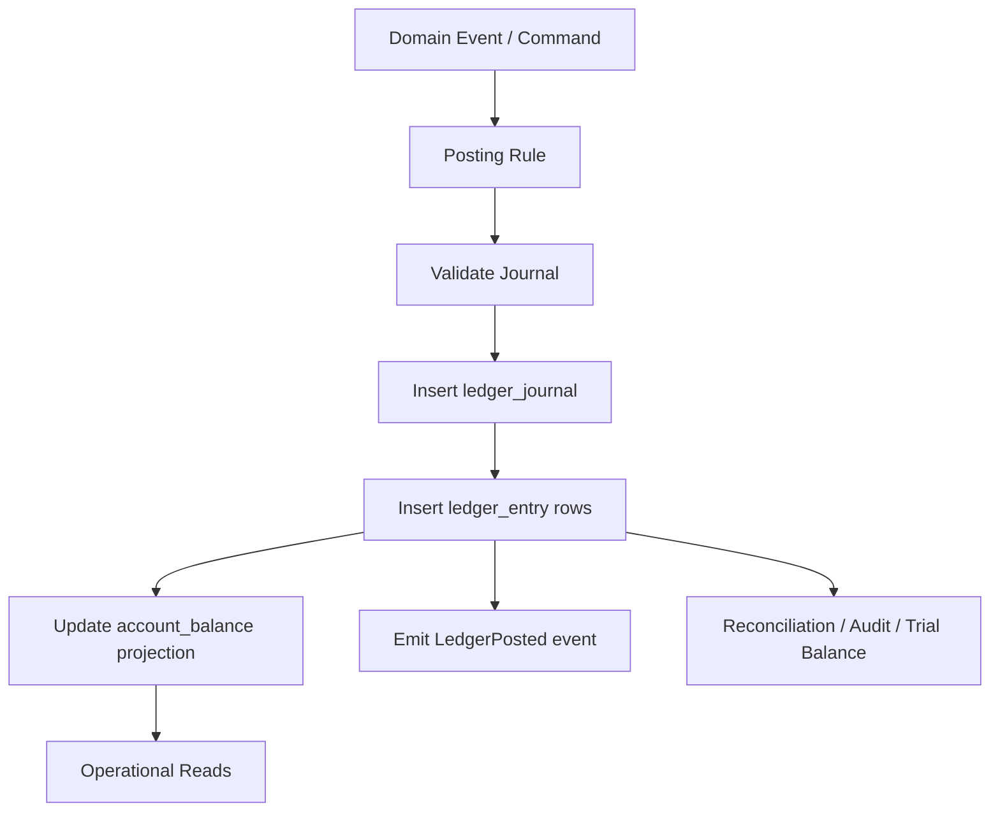

------
title: Build From Scratch: Large Production Grade Java Payment Systems - Part 021
description: Designing an immutable double-entry ledger schema for a Java payment platform, including accounts, journals, entries, posting rules, idempotent posting, balance projections, snapshots, integrity checks, and migration strategy.
series: learn-java-payment-systems
seriesTitle: Build From Scratch: Large Production Grade Java Payment Systems
order: 21
partTitle: Ledger Schema Design
tags:
- java
- payments
- ledger
- postgresql
- accounting
- double-entry
- schema-design
- fintech
date: 2026-07-02
---

# Part 021 — Ledger Schema Design

A payment ledger is not a table where we store `balance = 100000`.

A payment ledger is a financial evidence system.

It must answer:

```text
What changed?
Why did it change?
Which business event caused it?
Which accounts were affected?
Was money conserved?
Can we replay it?
Can we explain it after six months?
Can an operator repair it without hiding history?
```

A toy project writes this:

```sql
update merchant_balance
set balance = balance + 100000
where merchant_id = 'm_123';
```

A production payment platform writes this:

```text
Journal: capture-posted-for-payment-attempt-X
Entry 1: debit  Provider Receivable      100000 IDR
Entry 2: credit Merchant Pending Payable 100000 IDR
```

Then it updates a projection in a controlled way.

The ledger entries are the truth.

The balance table is a read model.

That distinction controls the entire schema design.

---

## 1. The Schema Goal

The goal is not merely to store accounting rows.

The goal is to make invalid money movement difficult.

A good ledger schema should make these failures hard or impossible:

- posting the same payment capture twice
- posting entries that do not balance
- mixing currencies inside one balanced journal
- editing financial history silently
- deleting evidence after settlement
- creating a balance projection that cannot be traced to entries
- letting provider event duplication create duplicate money
- allowing a refund larger than the captured/refundable amount
- allowing payout against pending money
- allowing manual adjustment without approval and reason

A payment ledger schema is therefore a combination of:

```text
immutable data model
+ database constraints
+ posting transaction boundary
+ idempotency keys
+ account taxonomy
+ balance projections
+ integrity checks
+ operational repair workflow
```

Do not expect one SQL table to solve all of this.

---

## 2. Core Principle: Ledger First, Projection Second

There are two kinds of ledger data:

| Data | Purpose | Mutability |
|---|---|---|
| `ledger_journal` | One financial event | append-only |
| `ledger_entry` | Debit/credit lines inside journal | append-only |
| `account_balance` | Fast current balance read model | mutable but derived |
| `balance_snapshot` | Point-in-time reconstruction anchor | append-only |
| `posting_rule` | How a domain event becomes entries | versioned |
| `ledger_integrity_check` | Audit result | append-only |

The most important boundary:

```text
A balance table may be wrong temporarily.
A posted balanced journal must never be wrong.
```

That is why ledger posting must be stricter than balance projection.



---

## 3. Amount Representation

For the core ledger, prefer integer minor units.

```text
IDR 100,000.00 is stored as 10000000 if scale=2.
IDR 100,000 with zero decimal minor unit may be stored as 100000 if currency exponent=0.
USD 10.25 is stored as 1025 when exponent=2.
```

But be careful: not all payment systems operate only with ISO minor units.

You may need separate representations for:

| Use Case | Recommended Representation |
|---|---|
| customer-facing amount | minor-unit integer + currency |
| ledger posting | minor-unit integer + currency + scale/exponent snapshot |
| fee calculation before rounding | decimal calculation model |
| FX quote | high precision decimal |
| settlement report import | raw provider amount + normalized amount |
| tax calculation | decimal intermediate + rounded booked amount |

For the ledger entry itself:

```sql
amount_minor bigint not null,
currency_code char(3) not null,
currency_exponent smallint not null
```

Why snapshot `currency_exponent`?

Because financial history should not depend on a future metadata lookup.

If a currency minor unit changes, old postings must remain explainable under the rule used when they were created.

### Avoid PostgreSQL `money` Type for Ledger Core

A payment platform should not rely on database locale-specific money formatting.

Use either:

```sql
amount_minor bigint
```

or, when truly necessary:

```sql
amount numeric(38, 12)
```

For booked ledger entries, integer minor units are usually easier to reason about.

For calculation stages, decimal values are acceptable, but the final posted amount should be rounded and explicit.

---

## 4. Signed Amount Convention

There are two common designs:

### Option A — Debit/Credit Columns

```sql
entry_side varchar(6) not null check (entry_side in ('DEBIT', 'CREDIT')),
amount_minor bigint not null check (amount_minor > 0)
```

### Option B — Signed Amount

```sql
signed_amount_minor bigint not null
```

With option B, you still need account normal balance rules to interpret the sign.

For payment systems, I prefer explicit side + positive amount.

It prevents accidental negative amount tricks.

```text
Do not encode a reversal by inserting a negative debit.
Encode it by posting the opposite side.
```

That makes ledger analysis and fraud review easier.

---

## 5. Account Model

A ledger entry must post into an account.

An account is not always a bank account.

An account is a named bucket of financial meaning.

Example payment platform accounts:

```text
ASSET: Provider Receivable
ASSET: Bank Settlement Cash
ASSET: Processor Clearing Receivable
LIABILITY: Merchant Pending Payable
LIABILITY: Merchant Available Payable
LIABILITY: Merchant Payout Pending
LIABILITY: Customer Wallet Balance
LIABILITY: Chargeback Payable
REVENUE: Platform Processing Fee Revenue
EXPENSE: Scheme Fee Expense
CONTRA_REVENUE: Refund Fee Reversal
RESERVE: Merchant Reserve Held
SUSPENSE: Unmatched Provider Settlement
```

A generic `merchant_balance` table is too weak.

You need an account per owner, bucket, currency, and sometimes rail/provider.

```sql
create table ledger_account (
    account_id uuid primary key,
    account_code varchar(120) not null,
    account_name varchar(240) not null,

    account_type varchar(32) not null check (
        account_type in (
            'ASSET',
            'LIABILITY',
            'REVENUE',
            'EXPENSE',
            'EQUITY',
            'SUSPENSE',
            'RESERVE',
            'CONTRA_REVENUE',
            'CONTRA_ASSET',
            'CONTRA_LIABILITY'
        )
    ),

    normal_side varchar(6) not null check (normal_side in ('DEBIT', 'CREDIT')),

    owner_type varchar(64) not null,
    owner_id varchar(120),

    currency_code char(3) not null,
    currency_exponent smallint not null,

    provider_code varchar(64),
    payment_method_type varchar(64),
    balance_bucket varchar(64),

    status varchar(32) not null check (status in ('ACTIVE', 'SUSPENDED', 'CLOSED')),

    metadata jsonb not null default '{}'::jsonb,

    created_at timestamptz not null default now(),
    updated_at timestamptz not null default now(),

    unique (account_code),
    unique (
        owner_type,
        owner_id,
        account_type,
        currency_code,
        provider_code,
        payment_method_type,
        balance_bucket
    )
);
```

### Why So Many Dimensions?

Because this question must be easy to answer:

```text
How much USD wallet liability do we owe customer C?
How much IDR available payable do we owe merchant M?
How much IDR is pending settlement from provider P?
How much is held as reserve for merchant M?
How much settlement cash was received in bank account B?
```

If the account model cannot represent those distinctions, the reporting layer will invent them later with fragile filters.

That is a smell.

---

## 6. Journal Model

A journal is one financial transaction.

It has business meaning.

Examples:

```text
PAYMENT_CAPTURE_POSTED
PAYMENT_SETTLEMENT_RECEIVED
MERCHANT_FEE_RECOGNIZED
REFUND_POSTED
CHARGEBACK_OPENED
CHARGEBACK_WON
CHARGEBACK_LOST
MERCHANT_PAYOUT_CREATED
MERCHANT_PAYOUT_SETTLED
MANUAL_ADJUSTMENT_POSTED
```

Schema:

```sql
create table ledger_journal (
    journal_id uuid primary key,

    journal_type varchar(80) not null,
    journal_status varchar(32) not null check (
        journal_status in ('POSTED', 'VOIDED_BY_REVERSAL')
    ),

    source_type varchar(80) not null,
    source_id varchar(160) not null,
    source_event_id varchar(160),

    posting_rule_code varchar(120) not null,
    posting_rule_version integer not null,

    idempotency_key varchar(240) not null,

    business_date date not null,
    occurred_at timestamptz not null,
    posted_at timestamptz not null default now(),

    created_by_type varchar(64) not null check (
        created_by_type in ('SYSTEM', 'OPERATOR', 'MIGRATION', 'RECONCILIATION_JOB')
    ),
    created_by_id varchar(120),

    reversal_of_journal_id uuid references ledger_journal(journal_id),
    reason_code varchar(120),
    reason_text text,

    metadata jsonb not null default '{}'::jsonb,

    created_at timestamptz not null default now(),

    unique (idempotency_key),
    unique (source_type, source_id, posting_rule_code, source_event_id)
);
```

### Business Date vs Posted At

`posted_at` is when your system recorded the journal.

`business_date` is the accounting/reporting date.

They are not the same.

Example:

```text
Provider settlement file arrives on 2026-07-02 01:10.
The settlement date inside the file is 2026-07-01.
The journal is posted_at = 2026-07-02T01:10.
The business_date = 2026-07-01.
```

If you do not separate these, finance reports become fragile around cutoff windows.

---

## 7. Entry Model

Each journal has at least two entries.

```sql
create table ledger_entry (
    entry_id uuid primary key,
    journal_id uuid not null references ledger_journal(journal_id),
    account_id uuid not null references ledger_account(account_id),

    entry_side varchar(6) not null check (entry_side in ('DEBIT', 'CREDIT')),
    amount_minor bigint not null check (amount_minor > 0),
    currency_code char(3) not null,
    currency_exponent smallint not null,

    entry_sequence integer not null,

    counterparty_account_id uuid references ledger_account(account_id),

    source_line_id varchar(160),
    description text,
    metadata jsonb not null default '{}'::jsonb,

    created_at timestamptz not null default now(),

    unique (journal_id, entry_sequence)
);

create index idx_ledger_entry_account_time
on ledger_entry (account_id, created_at, entry_id);

create index idx_ledger_entry_journal
on ledger_entry (journal_id);
```

The `entry_sequence` is not only cosmetic.

It gives deterministic ordering inside a journal.

That matters for:

- reproducible exports
- golden-file tests
- audit review
- replay comparison
- hash-chain calculation if you add tamper evidence later

---

## 8. Enforcing Balanced Journals

The hardest part is that SQL row constraints cannot check the sum of all entries inside a journal by themselves.

You need a controlled posting path.

At minimum, implement all journal posting through one transaction:

```text
begin transaction
  validate command idempotency
  build journal lines
  assert per-currency debit total == credit total
  insert ledger_journal
  insert ledger_entry rows
  update account_balance projection
  insert outbox event
commit
```

In Java:

```java
public PostedJournal post(PostingCommand command) {
    return transactionTemplate.execute(tx -> {
        existingJournal(command.idempotencyKey()).ifPresent(j -> {
            return j;
        });

        PostingRule rule = postingRuleCatalog.resolve(
            command.ruleCode(),
            command.ruleVersion()
        );

        DraftJournal draft = rule.build(command);

        journalValidator.assertBalanced(draft);
        journalValidator.assertSingleCurrencyPerBalanceGroup(draft);
        journalValidator.assertAccountsActive(draft);
        journalValidator.assertNoNegativeLineAmount(draft);
        journalValidator.assertBusinessDateAllowed(draft);

        PostedJournal posted = ledgerRepository.insertJournalAndEntries(draft);
        balanceProjection.apply(posted);
        outbox.publish(LedgerEvents.journalPosted(posted));

        return posted;
    });
}
```

### Per-Currency Balance Check

A journal can include multiple currencies, but each currency group must balance independently.

Bad:

```text
Debit  Provider Receivable  100 USD
Credit Merchant Payable     100 EUR
```

That is not balanced.

Correct multi-currency FX journal:

```text
Debit  Provider Receivable USD      100 USD
Credit FX Clearing USD              100 USD
Debit  FX Clearing EUR               92 EUR
Credit Merchant Payable EUR          92 EUR
```

The FX conversion is not hidden inside a cross-currency equality.

It is explicitly modeled through FX clearing accounts.

---

## 9. Immutability Controls

Append-only is a design rule.

It should also be a database rule.

Use permissions and triggers.

```sql
create or replace function prevent_ledger_update_delete()
returns trigger as $$
begin
    raise exception 'ledger rows are immutable; use reversal/correction journal';
end;
$$ language plpgsql;

create trigger trg_no_update_ledger_journal
before update or delete on ledger_journal
for each row execute function prevent_ledger_update_delete();

create trigger trg_no_update_ledger_entry
before update or delete on ledger_entry
for each row execute function prevent_ledger_update_delete();
```

A trigger is not a substitute for access control.

It is a last line of defense.

Also make sure application roles cannot bypass it casually.

A production design usually uses separate roles:

| Role | Capability |
|---|---|
| `payment_app` | insert journals through controlled path |
| `ledger_reader` | read only |
| `recon_job` | read + insert reconciliation journals |
| `migration_role` | controlled migration scripts |
| `dba_breakglass` | emergency only, audited |

---

## 10. Reversal and Correction

Do not update ledger history.

Post reversing entries.

Original:

```text
Journal J1: Capture Posted
Debit  Provider Receivable        100000 IDR
Credit Merchant Pending Payable   100000 IDR
```

Reversal:

```text
Journal J2: Capture Reversal
Debit  Merchant Pending Payable   100000 IDR
Credit Provider Receivable        100000 IDR
reversal_of_journal_id = J1
```

Correction is two-step:

```text
1. Reverse incorrect journal.
2. Post correct journal.
```

Do not mutate J1.

The audit question is not only:

```text
What is the current balance?
```

It is also:

```text
Why did the balance temporarily become wrong?
Who corrected it?
Which evidence supported the correction?
Was the correction approved?
```

---

## 11. Posting Rule Schema

A posting rule converts business facts into ledger entries.

Do not scatter posting logic across service methods.

Model it.

```sql
create table posting_rule (
    posting_rule_id uuid primary key,
    rule_code varchar(120) not null,
    rule_version integer not null,
    description text not null,
    status varchar(32) not null check (status in ('DRAFT', 'ACTIVE', 'RETIRED')),

    source_event_type varchar(120) not null,
    expected_currency_mode varchar(32) not null check (
        expected_currency_mode in ('SINGLE_CURRENCY', 'MULTI_CURRENCY')
    ),

    rule_definition jsonb not null,

    effective_from timestamptz not null,
    effective_to timestamptz,

    created_at timestamptz not null default now(),
    created_by varchar(120) not null,

    unique (rule_code, rule_version)
);
```

A simple rule definition may look like this:

```json
{
  "lines": [
    {
      "side": "DEBIT",
      "accountSelector": "PROVIDER_RECEIVABLE",
      "amountExpression": "capture.grossAmount"
    },
    {
      "side": "CREDIT",
      "accountSelector": "MERCHANT_PENDING_PAYABLE",
      "amountExpression": "capture.grossAmount"
    }
  ]
}
```

But do not rush into a fully dynamic accounting DSL.

In early versions, a versioned Java posting rule catalog is safer:

```java
public interface PostingRule {
    RuleCode code();
    int version();
    DraftJournal build(PostingContext context);
}
```

The database `posting_rule` table can record the version and metadata even if the executable rule lives in code.

The invariant is:

```text
Every journal must say which posting rule version produced it.
```

---

## 12. Account Selector Pattern

Posting rules should not hardcode account IDs.

They should use selectors.

Example:

```java
AccountId merchantPendingPayable = accountResolver.resolve(
    AccountSelector.builder()
        .ownerType("MERCHANT")
        .ownerId(capture.merchantId())
        .accountType(AccountType.LIABILITY)
        .bucket("PENDING_PAYABLE")
        .currency(capture.currency())
        .providerCode(capture.providerCode())
        .build()
);
```

This makes rules reusable across merchants and currencies.

A posting rule says:

```text
Credit merchant pending payable.
```

The account resolver says:

```text
For merchant M, currency IDR, provider ADYEN, the account is A-123.
```

Do not mix the two concerns.

---

## 13. Idempotent Posting

A ledger posting must be idempotent.

A duplicate provider event must not create duplicate money.

Use an idempotency key built from the financial cause:

```text
ledger:<posting-rule-code>:<source-type>:<source-id>:<source-event-id>
```

Examples:

```text
ledger:PAYMENT_CAPTURE_POSTED:payment_attempt:pa_123:provider_event_evt_777
ledger:REFUND_POSTED:refund:r_456:provider_refund_rf_888
ledger:SETTLEMENT_RECEIVED:settlement_line:sl_999:file_20260701_line_1002
```

The uniqueness belongs on `ledger_journal`.

```sql
create unique index uq_ledger_journal_idempotency
on ledger_journal (idempotency_key);
```

The application should also return the existing journal if the idempotency key already exists.

```java
try {
    return ledgerRepository.insertJournalAndEntries(draft);
} catch (DuplicateKeyException duplicate) {
    return ledgerRepository.findByIdempotencyKey(draft.idempotencyKey())
        .orElseThrow(() -> duplicate);
}
```

This is not a UX feature.

It is a financial safety control.

---

## 14. Balance Projection

A ledger with only entries is correct but slow for operational queries.

You need a projection.

```sql
create table account_balance (
    account_id uuid primary key references ledger_account(account_id),
    currency_code char(3) not null,
    currency_exponent smallint not null,

    debit_posted_minor bigint not null default 0,
    credit_posted_minor bigint not null default 0,
    normal_balance_minor bigint not null default 0,

    last_journal_id uuid,
    last_entry_id uuid,
    last_posted_at timestamptz,

    version bigint not null default 0,
    updated_at timestamptz not null default now(),

    check (debit_posted_minor >= 0),
    check (credit_posted_minor >= 0)
);
```

For normal balance:

```text
Asset and expense accounts normally increase with debit.
Liability, revenue, and equity accounts normally increase with credit.
```

Projection update logic:

```java
long signedNormalDelta(Account account, LedgerEntry entry) {
    boolean entryIncreasesNormalBalance = account.normalSide() == entry.side();
    return entryIncreasesNormalBalance
        ? entry.amountMinor()
        : -entry.amountMinor();
}
```

SQL update:

```sql
update account_balance
set
    debit_posted_minor = debit_posted_minor + :debit_delta,
    credit_posted_minor = credit_posted_minor + :credit_delta,
    normal_balance_minor = normal_balance_minor + :normal_delta,
    last_journal_id = :journal_id,
    last_entry_id = :entry_id,
    last_posted_at = :posted_at,
    version = version + 1,
    updated_at = now()
where account_id = :account_id;
```

### Projection Is Derived

Never let business code directly alter `account_balance`.

Only the ledger posting path can update it.

If projection is corrupted, rebuild it from entries.

That is why entries must be immutable and complete.

---

## 15. Projection Consistency Strategy

There are two options.

### Option A — Synchronous Projection

Inside the same transaction:

```text
insert journal
insert entries
update account_balance
commit
```

This gives strong read-after-write behavior.

Use this for critical balances such as:

- wallet balance
- merchant available balance
- payout-eligible balance
- reserve balance

### Option B — Async Projection

Inside transaction:

```text
insert journal
insert entries
insert outbox event
commit
```

Then consumer updates read models.

Use this for:

- dashboards
- reporting aggregates
- search views
- analytics
- finance exports that tolerate slight delay

For payment money movement, prefer synchronous projection for balances used to authorize further movement.

Do not authorize a payout from an eventually consistent projection unless you also reserve funds through a strongly consistent path.

---

## 16. Balance Snapshot

A balance snapshot is not the source of truth.

It is a reconstruction accelerator and audit checkpoint.

```sql
create table account_balance_snapshot (
    snapshot_id uuid primary key,
    account_id uuid not null references ledger_account(account_id),
    currency_code char(3) not null,
    currency_exponent smallint not null,

    as_of_business_date date not null,
    as_of_posted_at timestamptz not null,
    as_of_entry_id uuid,

    debit_posted_minor bigint not null,
    credit_posted_minor bigint not null,
    normal_balance_minor bigint not null,

    entry_count bigint not null,
    snapshot_reason varchar(80) not null check (
        snapshot_reason in ('DAILY_CLOSE', 'MONTHLY_CLOSE', 'REBUILD', 'MIGRATION', 'AUDIT')
    ),

    created_at timestamptz not null default now(),
    created_by varchar(120) not null,

    unique (account_id, as_of_business_date, snapshot_reason)
);
```

Snapshot use cases:

- daily close
- month-end report
- fast rebuild from checkpoint
- audit evidence
- migration verification
- incident repair comparison

Do not create snapshots to hide poor indexing.

Create snapshots because financial systems need close points.

---

## 17. Trial Balance

Trial balance is the simplest integrity check.

Across a ledger scope, total debits must equal total credits.

```sql
select
    currency_code,
    sum(case when entry_side = 'DEBIT' then amount_minor else 0 end) as debit_total,
    sum(case when entry_side = 'CREDIT' then amount_minor else 0 end) as credit_total
from ledger_entry
where created_at < :as_of
 group by currency_code
having sum(case when entry_side = 'DEBIT' then amount_minor else 0 end)
    <> sum(case when entry_side = 'CREDIT' then amount_minor else 0 end);
```

This query should return zero rows.

If it returns rows, the ledger is broken.

Do not continue payout processing until you understand why.

---

## 18. Journal-Level Integrity Check

You also need per-journal checks.

```sql
select
    journal_id,
    currency_code,
    sum(case when entry_side = 'DEBIT' then amount_minor else 0 end) as debit_total,
    sum(case when entry_side = 'CREDIT' then amount_minor else 0 end) as credit_total
from ledger_entry
group by journal_id, currency_code
having sum(case when entry_side = 'DEBIT' then amount_minor else 0 end)
    <> sum(case when entry_side = 'CREDIT' then amount_minor else 0 end);
```

This must also return zero rows.

Run it:

- after deployment
- after migration
- after backfill
- after incident repair
- before daily close
- before month-end close

Then store the result.

```sql
create table ledger_integrity_check (
    check_id uuid primary key,
    check_type varchar(80) not null,
    scope_type varchar(80) not null,
    scope_id varchar(160),
    status varchar(32) not null check (status in ('PASSED', 'FAILED')),
    checked_from timestamptz,
    checked_to timestamptz,
    finding_count integer not null,
    findings jsonb not null default '[]'::jsonb,
    created_at timestamptz not null default now(),
    created_by varchar(120) not null
);
```

---

## 19. Preventing Orphan Journals

A posted journal with no entries is nonsense.

A journal with one entry is nonsense.

A journal with unbalanced entries is nonsense.

Because this is cross-row validation, enforce it in the posting transaction.

Additionally, create an integrity job:

```sql
select j.journal_id
from ledger_journal j
left join ledger_entry e on e.journal_id = j.journal_id
group by j.journal_id
having count(e.entry_id) < 2;
```

If it finds a result, treat it as a severe bug.

---

## 20. Append-Only With Hash Chain

For stricter tamper evidence, add hashes.

```sql
alter table ledger_journal
add column previous_journal_hash text,
add column journal_hash text;
```

Hash input can include:

```text
journal_id
journal_type
source_type
source_id
posted_at
ordered entry lines
previous_journal_hash
```

This does not replace database security.

It creates evidence if someone mutates history outside the normal path.

In many teams, this is introduced later after the basic ledger is stable.

Do not implement cryptographic ceremony before you can even keep entries balanced.

---

## 21. Partitioning Strategy

Ledger tables grow forever.

Partitioning is usually necessary eventually.

But choose partition keys based on query and retention realities.

Common options:

| Partition Key | Strength | Risk |
|---|---|---|
| `posted_at` monthly | good for time-range reporting | account history scans cross partitions |
| `business_date` monthly | good for close/reporting | late postings require older partition writes |
| hash `account_id` | good for account-level scale | harder finance reporting |
| tenant/merchant | isolation | many partitions if uncontrolled |

For most first enterprise builds:

```text
ledger_journal: partition by posted_at or business_date
ledger_entry: partition aligned with journal posted_at/business_date
account_balance: not partitioned initially, indexed by account_id
snapshots: partition by as_of_business_date
```

Do not partition because it looks advanced.

Partition because query plans and operational maintenance require it.

---

## 22. Indexing for Payment Ledger Queries

Common queries:

```text
Find journal by idempotency key.
Find journals for payment attempt.
Find entries for account between dates.
Find all journals from settlement file.
Find all entries affecting merchant payable.
Find balance by account.
Find reversal of journal.
Find journals posted by an operator.
```

Indexes:

```sql
create unique index uq_ledger_journal_idempotency
on ledger_journal (idempotency_key);

create index idx_ledger_journal_source
on ledger_journal (source_type, source_id);

create index idx_ledger_journal_source_event
on ledger_journal (source_event_id)
where source_event_id is not null;

create index idx_ledger_journal_business_date
on ledger_journal (business_date, journal_type);

create index idx_ledger_journal_reversal
on ledger_journal (reversal_of_journal_id)
where reversal_of_journal_id is not null;

create index idx_ledger_entry_account_created
on ledger_entry (account_id, created_at, entry_id);

create index idx_ledger_entry_account_journal
on ledger_entry (account_id, journal_id);
```

Use partial indexes for sparse fields like `reversal_of_journal_id`.

This is cleaner than indexing many mostly-null columns blindly.

---

## 23. Outbox Event from Ledger

When a journal is posted, other services may need to know:

- payout service
- reconciliation service
- reporting service
- risk monitoring
- merchant notification
- audit/event store

Publish from outbox, not directly from the ledger transaction.

```sql
create table ledger_outbox (
    outbox_id uuid primary key,
    aggregate_type varchar(80) not null,
    aggregate_id varchar(160) not null,
    event_type varchar(120) not null,
    event_version integer not null,
    event_key varchar(160) not null,
    payload jsonb not null,
    status varchar(32) not null check (status in ('NEW', 'PUBLISHING', 'PUBLISHED', 'FAILED')),
    attempt_count integer not null default 0,
    next_attempt_at timestamptz not null default now(),
    created_at timestamptz not null default now(),
    published_at timestamptz
);
```

The event key should usually be account ID, merchant ID, or journal ID depending on required ordering.

For balance-affecting consumers, account-level ordering is often more useful than global ordering.

---

## 24. Manual Adjustment Schema

Manual adjustments are dangerous.

They are sometimes necessary.

Make them explicit.

```sql
create table ledger_adjustment_request (
    adjustment_request_id uuid primary key,
    requested_by varchar(120) not null,
    request_status varchar(32) not null check (
        request_status in ('DRAFT', 'PENDING_APPROVAL', 'APPROVED', 'REJECTED', 'POSTED', 'CANCELLED')
    ),
    reason_code varchar(120) not null,
    reason_text text not null,
    evidence_uri text,
    risk_level varchar(32) not null check (risk_level in ('LOW', 'MEDIUM', 'HIGH', 'CRITICAL')),
    created_at timestamptz not null default now(),
    approved_by varchar(120),
    approved_at timestamptz,
    posted_journal_id uuid references ledger_journal(journal_id)
);
```

Manual adjustment must still post a balanced journal.

No special shortcut.

No direct balance update.

No silent correction.

---

## 25. Migration Strategy

Ledger schema changes are high-risk.

Use additive migration.

Safe changes:

- add nullable metadata column
- add new posting rule version
- add new account bucket
- add new read model
- add new index concurrently

Risky changes:

- changing amount representation
- changing account identity uniqueness
- changing journal idempotency key
- changing meaning of existing account bucket
- rewriting historical entries
- replacing posting rule semantics without versioning

Golden rule:

```text
Never change what an old journal meant.
Add a new rule version.
```

---

## 26. Java Package Boundary

A clean ledger module may look like:

```text
com.company.payment.ledger
  api
    LedgerPostingService.java
    LedgerQueryService.java
  domain
    LedgerAccount.java
    LedgerJournal.java
    LedgerEntry.java
    PostingRule.java
    DraftJournal.java
    PostedJournal.java
    AccountSelector.java
    MoneyAmount.java
  application
    DefaultLedgerPostingService.java
    PostingRuleCatalog.java
    AccountResolver.java
    JournalValidator.java
    BalanceProjectionService.java
  infrastructure
    JdbcLedgerRepository.java
    JdbcAccountRepository.java
    LedgerOutboxRepository.java
  integrity
    TrialBalanceJob.java
    JournalBalanceCheck.java
    ProjectionRebuildJob.java
```

The important rule:

```text
Payment Core may request a posting.
Payment Core may not insert ledger entries directly.
```

Ledger owns its own invariants.

---

## 27. Minimal Posting Service Interface

```java
public interface LedgerPostingService {
    PostedJournal post(PostingCommand command);
}

public record PostingCommand(
    String idempotencyKey,
    String sourceType,
    String sourceId,
    String sourceEventId,
    String postingRuleCode,
    int postingRuleVersion,
    LocalDate businessDate,
    Instant occurredAt,
    Actor actor,
    Map<String, Object> facts
) {}
```

The `facts` map can become typed command records later.

For critical flows, prefer typed commands:

```java
public record CapturePostedCommand(
    PaymentAttemptId attemptId,
    ProviderEventId providerEventId,
    MerchantId merchantId,
    ProviderCode providerCode,
    MoneyAmount grossAmount,
    Instant capturedAt
) {}
```

Typed commands are safer.

Generic facts are flexible.

A production system usually starts typed for critical flows and uses generic only for limited internal tools.

---

## 28. Schema Anti-Patterns

Avoid these designs:

### Anti-Pattern 1 — Balance as Truth

```sql
merchant_balance(balance)
```

without entries.

You cannot explain how the balance got there.

### Anti-Pattern 2 — One Ledger Row Per Payment

```sql
payment_ledger(payment_id, amount, fee, status)
```

This is not double-entry.

It cannot model reserve, settlement, payout, dispute, and reversal correctly.

### Anti-Pattern 3 — Updating Entries

```sql
update ledger_entry set amount = ...
```

This destroys evidence.

### Anti-Pattern 4 — Cross-Currency Balancing

```text
Debit USD, Credit EUR, pretend they offset.
```

They do not.

Use FX clearing accounts.

### Anti-Pattern 5 — Manual Adjustment Without Workflow

```sql
insert into ledger_entry ...
```

by admin console.

Manual action must be maker-checker, reasoned, and audited.

### Anti-Pattern 6 — Posting Rule Hidden in Controller

```java
if (payment.status == SUCCESS) {
    // insert debit/credit here
}
```

Posting logic belongs in a ledger application service, not a REST resource.

---

## 29. Failure Model

| Failure | Correct Handling |
|---|---|
| duplicate posting command | return existing journal by idempotency key |
| DB commit succeeds but API timeout | retry returns existing journal |
| journal inserted but entries missing | should be impossible in one transaction; integrity check detects if corruption exists |
| entries inserted but projection update fails | transaction rolls back, or rebuild projection if async |
| projection corrupted | rebuild from ledger entries |
| posting rule bug | reverse incorrect journals and post correction with new rule version |
| wrong account selected | reverse/correct; fix account resolver/rule version |
| provider duplicate webhook | same source event/idempotency key prevents duplicate journal |
| operator mistake | correction journal + audit trail |

---

## 30. Test Strategy

Ledger schema needs more than unit tests.

### Unit Tests

- posting rule builds expected lines
- account resolver selects correct account
- balance delta calculation is correct
- reversal rule mirrors original lines

### Database Tests

- duplicate idempotency key rejected
- immutable table trigger blocks update/delete
- account uniqueness works
- partial index works for sparse references
- projection update is atomic with posting

### Property Tests

Generate random balanced journals.

Assert:

```text
sum(debits) == sum(credits) per currency
projection == sum(entries)
reversal returns balance to original value
idempotent replay does not change balance
```

### Replay Tests

Rebuild account balances from scratch.

Compare with projection.

```text
projection.normal_balance_minor == reconstructed.normal_balance_minor
```

If this fails, the ledger projection is untrustworthy.

---

## 31. Production Readiness Checklist

Before using this ledger for real payment movement, verify:

- [ ] all ledger entries are append-only
- [ ] all journals have at least two entries
- [ ] every journal balances per currency
- [ ] every journal has idempotency key
- [ ] posting rule code/version is stored
- [ ] source type/source ID is stored
- [ ] duplicate provider events cannot duplicate ledger postings
- [ ] account identity is deterministic
- [ ] account balance projection is derived only from entries
- [ ] projection can be rebuilt
- [ ] daily trial balance job exists
- [ ] manual adjustment requires approval and reason
- [ ] reversal and correction flows exist
- [ ] migration/backfill scripts include integrity checks
- [ ] finance can export journal and entry reports
- [ ] engineers can trace payment -> event -> journal -> entries -> balance

---

## 32. Mental Model to Keep

A ledger schema is not a storage problem.

It is a correctness boundary.

The schema should make the correct path boring and the dangerous path difficult.

The correct path is:

```text
business event
-> posting rule
-> balanced draft journal
-> immutable posted journal
-> immutable entries
-> derived balance projection
-> integrity checks
-> explainable reports
```

If someone asks:

```text
Can we just update the balance?
```

The answer is:

```text
No. We post a journal that explains why the balance changed.
```

That one sentence is the difference between a demo payment system and a financial platform.

---

## References

- PostgreSQL Documentation — Numeric Types: https://www.postgresql.org/docs/current/datatype-numeric.html
- PostgreSQL Documentation — Constraints: https://www.postgresql.org/docs/current/ddl-constraints.html
- PostgreSQL Documentation — Partial Indexes: https://www.postgresql.org/docs/current/indexes-partial.html
- PostgreSQL Documentation — Generated Columns: https://www.postgresql.org/docs/current/ddl-generated-columns.html
- PostgreSQL Documentation — Transaction Isolation: https://www.postgresql.org/docs/current/transaction-iso.html
- Martin Fowler — Accounting Transaction: https://martinfowler.com/eaaDev/AccountingTransaction.html
- Martin Fowler — Accounting Narrative: https://martinfowler.com/eaaDev/AccountingNarrative.html
