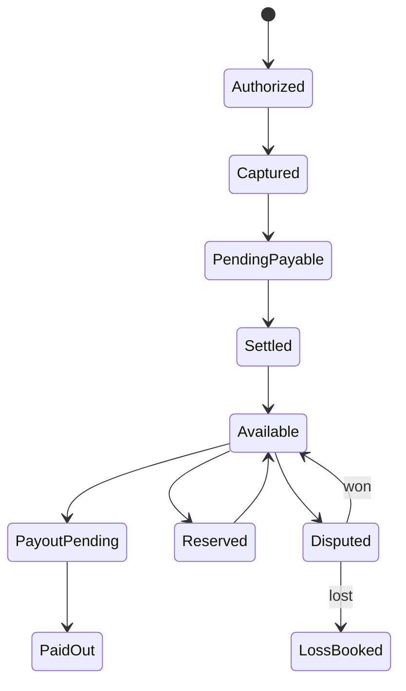
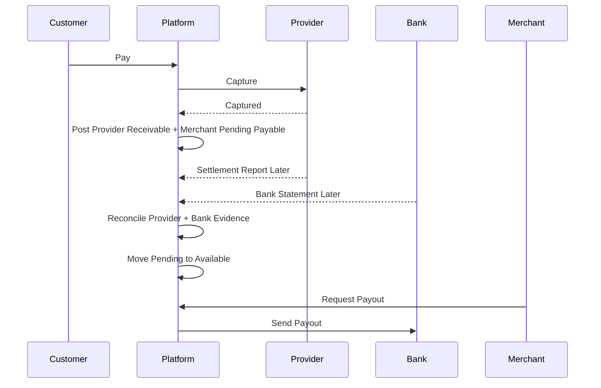

------
title: Build From Scratch: Large Production Grade Java Payment Systems - Part 022
description: Modeling available, pending, settled, reserved, and payout balances in a production Java payment system using double-entry ledger accounts, holds, reservations, settlement transitions, and strongly consistent balance controls.
series: learn-java-payment-systems
seriesTitle: Build From Scratch: Large Production Grade Java Payment Systems
order: 22
partTitle: Available, Pending, Settled Balances
tags:
- java
- payments
- ledger
- balances
- settlement
- payout
- fintech
- postgresql
date: 2026-07-02
---

# Part 022 — Available, Pending, Settled Balances

A production payment platform does not have one balance.

It has many balances that answer different questions.

```text
How much has the customer authorized?
How much has the provider captured?
How much has the provider settled to us?
How much do we owe the merchant?
How much can the merchant withdraw now?
How much must be held in reserve?
How much is payout pending?
How much is disputed?
How much is frozen by risk?
```

If your system only has:

```sql
merchant.balance
```

then it is not yet a payment ledger.

It is a number waiting to become an incident.

This part builds the mental model and implementation design for available, pending, settled, reserved, and payout balances.

---

## 1. The Core Misunderstanding

Many engineers model balance like this:

```text
balance = total successful payments - refunds - payouts
```

That is dangerously incomplete.

A successful payment does not always mean cash is settled.

A captured card payment may still be waiting for settlement.

A bank transfer may be received before it is matched.

A QR payment may be paid but not yet included in provider settlement report.

A merchant may be owed money but not allowed to withdraw it yet.

A fraud hold may block payout even though the ledger says funds are payable.

A chargeback may arrive after payout and create recoverable debt.

So we need multiple financial buckets.

---

## 2. Balance Buckets

At minimum, a payment platform needs these concepts:

| Bucket | Meaning |
|---|---|
| authorized | customer approved but not captured/posted as receivable |
| pending | expected money or merchant payable not yet eligible for payout |
| settled | funds confirmed by settlement/cash movement |
| available | funds eligible for next action, such as payout or spend |
| reserved | funds held for risk, rolling reserve, disputes, or obligations |
| payout pending | funds already locked for payout instruction |
| disputed | funds affected by chargeback/dispute lifecycle |
| frozen | administratively blocked due to risk/compliance |
| suspense | unmatched or unexplained funds |

The most important distinction:

```text
pending is about expectation.
settled is about confirmed money movement.
available is about permission to use.
```

They are related but not equal.

---

## 3. Do Not Store Buckets as Status Flags Only

This is weak:

```sql
merchant_balance(
  merchant_id,
  pending_amount,
  available_amount,
  settled_amount
)
```

It may work for a dashboard.

It is weak as financial truth.

Better:

```text
Each bucket is represented by ledger accounts.
```

Example merchant accounts:

```text
Merchant Pending Payable
Merchant Available Payable
Merchant Reserve Held
Merchant Payout Pending
Merchant Dispute Held
Merchant Negative Receivable
```

A movement between buckets is a journal.

```text
Move pending -> available
Debit  Merchant Pending Payable
Credit Merchant Available Payable
```

That transfer is explainable.

A naked field update is not.

---

## 4. Balance as Account Meaning

A balance is not just an amount.

It is:

```text
owner + account type + bucket + currency + rail/provider + constraints
```

Example account identity:

```text
owner_type: MERCHANT
owner_id: m_123
account_type: LIABILITY
bucket: AVAILABLE_PAYABLE
currency: IDR
provider_code: ADYEN
payment_method_type: CARD
```

This lets you answer:

```text
How much IDR card settlement from provider ADYEN is available for merchant m_123?
```

Not all businesses need provider-level balance segmentation.

But many payment platforms eventually do because settlement files, provider reserves, fees, and disputes are provider-specific.

Design the account model so the dimension can exist.

---

## 5. Lifecycle of Merchant Funds

A simplified card capture flow:



But remember:

```text
payment state machine != ledger account movement
```

Payment state explains workflow.

Ledger movement explains money.

They must correlate, but they are not the same table.

---

## 6. Example: Capture Creates Pending Payable

When a payment is captured, the platform may not yet have received settlement cash.

But it now expects money from the provider and owes the merchant after conditions are met.

Journal:

```text
PAYMENT_CAPTURE_POSTED

Debit  Provider Receivable          100000 IDR
Credit Merchant Pending Payable     100000 IDR
```

Meaning:

```text
We expect to receive 100000 from provider.
We owe merchant 100000, but not available yet.
```

This is not yet available.

Why?

Because provider settlement can fail, be delayed, be netted, or include adjustments.

---

## 7. Example: Settlement Moves Receivable to Cash

When settlement file or bank statement confirms receipt:

```text
PAYMENT_SETTLEMENT_RECEIVED

Debit  Bank Settlement Cash         100000 IDR
Credit Provider Receivable          100000 IDR
```

This says:

```text
Expected provider money became actual cash/settlement cash.
```

It still does not automatically make merchant balance available.

Availability may depend on:

- settlement confirmation
- risk window
- merchant settlement schedule
- rolling reserve
- refund reserve
- dispute exposure
- compliance hold
- payout minimum
- business cutoff

---

## 8. Example: Pending Becomes Available

After settlement and eligibility checks:

```text
MERCHANT_FUNDS_RELEASED

Debit  Merchant Pending Payable     95000 IDR
Credit Merchant Available Payable   95000 IDR
```

If a 5% reserve is held:

```text
MERCHANT_FUNDS_RELEASED_WITH_RESERVE

Debit  Merchant Pending Payable     100000 IDR
Credit Merchant Available Payable    95000 IDR
Credit Merchant Reserve Held          5000 IDR
```

This journal still balances because all entries are liabilities and debit/credit sides reduce/increase the normal balance according to account type.

Operational meaning:

```text
Merchant can withdraw 95000.
Platform still owes 5000 but it is reserved.
```

---

## 9. Available Is a Permissioned Balance

Available balance is not merely settled balance.

```text
available = settled - reserved - payout_pending - frozen - operational holds
```

But in a ledger design, we do not compute this from one formula every time.

We move money between explicit accounts:

```text
Merchant Available Payable
Merchant Reserve Held
Merchant Payout Pending
Merchant Dispute Held
Merchant Frozen Payable
```

The available account itself is the answer.

This is more auditable than dynamic subtraction across multiple tables.

---

## 10. Reserve Balance

A reserve is money owed to the merchant but held by the platform.

Common reasons:

- rolling reserve
- fraud risk
- new merchant probation
- high chargeback rate
- compliance review
- refund exposure
- dispute buffer

Posting reserve at release time:

```text
Debit  Merchant Pending Payable
Credit Merchant Available Payable
Credit Merchant Reserve Held
```

Releasing reserve later:

```text
Debit  Merchant Reserve Held
Credit Merchant Available Payable
```

Reserve is not revenue.

It is still a liability.

Do not treat reserve as platform income.

---

## 11. Payout Reservation

When merchant requests payout, do not immediately reduce available balance and hope the transfer succeeds.

Move funds into payout pending.

```text
MERCHANT_PAYOUT_RESERVED

Debit  Merchant Available Payable   95000 IDR
Credit Merchant Payout Pending      95000 IDR
```

Then create payout instruction.

If payout succeeds:

```text
MERCHANT_PAYOUT_SETTLED

Debit  Merchant Payout Pending      95000 IDR
Credit Bank Settlement Cash         95000 IDR
```

If payout fails and funds should return:

```text
MERCHANT_PAYOUT_FAILED_RELEASED

Debit  Merchant Payout Pending      95000 IDR
Credit Merchant Available Payable   95000 IDR
```

This prevents double payout.

The moment funds move from available to payout pending, another payout request cannot use them.

---

## 12. Strongly Consistent Reservation

Reservation must be atomic.

```text
check available balance
move available -> payout pending
create payout record
commit
```

In SQL terms, lock the balance row or use conditional update.

Pessimistic approach:

```sql
select normal_balance_minor
from account_balance
where account_id = :available_account_id
for update;
```

Then verify amount.

Conditional update approach:

```sql
update account_balance
set
    normal_balance_minor = normal_balance_minor - :amount,
    version = version + 1,
    updated_at = now()
where account_id = :available_account_id
  and normal_balance_minor >= :amount;
```

If affected rows = 0, insufficient available balance.

But remember:

```text
The actual financial movement should still be represented as a journal.
```

Do not let conditional balance update bypass the ledger.

The safe path is one transaction:

```text
lock/read balance
validate sufficient available
post reservation journal
update balance projection from journal
insert payout instruction
commit
```

---

## 13. Balance Projection Table for Buckets

The account model from Part 021 already supports bucketed balance.

For convenient reads, expose a balance view:

```sql
create view merchant_balance_view as
select
    a.owner_id as merchant_id,
    a.currency_code,
    sum(case when a.balance_bucket = 'PENDING_PAYABLE'
        then b.normal_balance_minor else 0 end) as pending_minor,
    sum(case when a.balance_bucket = 'AVAILABLE_PAYABLE'
        then b.normal_balance_minor else 0 end) as available_minor,
    sum(case when a.balance_bucket = 'RESERVE_HELD'
        then b.normal_balance_minor else 0 end) as reserve_minor,
    sum(case when a.balance_bucket = 'PAYOUT_PENDING'
        then b.normal_balance_minor else 0 end) as payout_pending_minor,
    sum(case when a.balance_bucket = 'DISPUTE_HELD'
        then b.normal_balance_minor else 0 end) as dispute_minor
from ledger_account a
join account_balance b on b.account_id = a.account_id
where a.owner_type = 'MERCHANT'
group by a.owner_id, a.currency_code;
```

This view is derived.

It is not the write model.

---

## 14. Negative Balance Policy

Some accounts must never go negative.

Examples:

```text
customer wallet available balance
merchant available payable before payout
merchant reserve held
payout pending
```

Some accounts can become negative by business design:

```text
merchant negative receivable after chargeback
platform fee receivable
provider receivable during timing gap
suspense during unmatched imports
```

Do not use one universal rule.

Model it at account policy level.

```sql
alter table ledger_account
add column allow_negative boolean not null default false;
```

Then the ledger posting service checks projected balances for constrained accounts before committing.

```java
for (ProjectedAccountDelta delta : draft.projectedDeltas()) {
    Account account = accountRepository.get(delta.accountId());
    Balance current = balanceRepository.getForUpdate(delta.accountId());
    Balance next = current.apply(delta);

    if (!account.allowNegative() && next.normalBalanceMinor() < 0) {
        throw new InsufficientBalanceException(account.accountId(), current, delta);
    }
}
```

This is payment-specific concurrency control.

---

## 15. Pending Does Not Always Mean Same Thing

Pending is overloaded.

Avoid one global `PENDING` bucket.

Separate meanings:

| Pending Type | Meaning |
|---|---|
| provider receivable pending | provider owes platform but not settled |
| merchant pending payable | platform owes merchant but not available |
| payout pending | payout instruction created but not settled |
| refund pending | refund initiated but not confirmed |
| dispute pending | dispute open, outcome unknown |
| reconciliation pending | provider/bank evidence not matched |

Use specific account buckets.

```text
PENDING_PAYABLE
PAYOUT_PENDING
DISPUTE_HELD
UNMATCHED_SETTLEMENT_SUSPENSE
REFUND_PENDING_CLEARING
```

Generic names hide financial meaning.

---

## 16. Refund From Available vs Pending

Refunds are subtle.

Suppose merchant has captured payment, but funds are not yet available.

Refund before settlement:

```text
REFUND_POSTED_BEFORE_RELEASE

Debit  Merchant Pending Payable     100000 IDR
Credit Provider Receivable          100000 IDR
```

Meaning:

```text
We no longer expect the provider to settle this amount.
We no longer owe the merchant this pending amount.
```

Refund after merchant funds became available:

```text
REFUND_POSTED_AFTER_RELEASE

Debit  Merchant Available Payable   100000 IDR
Credit Refund Clearing Payable      100000 IDR
```

Then provider/bank confirms refund movement:

```text
REFUND_SETTLED

Debit  Refund Clearing Payable      100000 IDR
Credit Bank Settlement Cash         100000 IDR
```

If merchant already withdrew the money, the refund may create merchant negative receivable:

```text
REFUND_FUNDED_BY_PLATFORM

Debit  Merchant Negative Receivable 100000 IDR
Credit Bank Settlement Cash         100000 IDR
```

Do not force all refunds into one posting rule.

The funding source matters.

---

## 17. Partial Capture and Available Amount

Authorization amount is not the same as captured amount.

Example:

```text
Authorized: 100000 IDR
Captured:    70000 IDR
Cancelled:   30000 IDR
```

Ledger should only post captured financial receivable/payable.

Do not create merchant pending payable from full authorization unless your business genuinely owes it.

A card authorization is often a permission/hold, not final payable money.

Represent authorization in payment state and optionally operational hold records.

Represent captured/settled money in ledger entries.

---

## 18. Customer Wallet Balances

Wallets are stricter because the available balance is customer-facing stored value.

Top up initiated:

```text
No wallet liability yet if funds are not confirmed.
```

Top up confirmed:

```text
WALLET_TOPUP_CONFIRMED

Debit  Bank Settlement Cash         100000 IDR
Credit Customer Wallet Available    100000 IDR
```

Spend from wallet:

```text
WALLET_PAYMENT_RESERVED

Debit  Customer Wallet Available    100000 IDR
Credit Customer Wallet Hold         100000 IDR
```

Capture spend:

```text
WALLET_PAYMENT_CAPTURED

Debit  Customer Wallet Hold         100000 IDR
Credit Merchant Pending Payable     100000 IDR
```

Release failed reservation:

```text
WALLET_HOLD_RELEASED

Debit  Customer Wallet Hold         100000 IDR
Credit Customer Wallet Available    100000 IDR
```

Wallet balance must not go negative unless you intentionally support credit.

Most payment wallets should not.

---

## 19. Holds vs Ledger Reservations

A hold can be represented in two ways.

### Option A — Operational Hold Table

```sql
create table balance_hold (
    hold_id uuid primary key,
    account_id uuid not null references ledger_account(account_id),
    amount_minor bigint not null check (amount_minor > 0),
    currency_code char(3) not null,
    reason_code varchar(120) not null,
    status varchar(32) not null check (status in ('ACTIVE', 'RELEASED', 'CONSUMED', 'EXPIRED')),
    expires_at timestamptz,
    created_at timestamptz not null default now(),
    released_at timestamptz
);
```

Then available is calculated:

```text
available = balance - active holds
```

### Option B — Ledger Account Movement

```text
Debit  Available
Credit Hold
```

For payment-critical reservations, prefer ledger account movement.

For temporary operational UI holds, a hold table may be acceptable.

Rule of thumb:

```text
If the hold controls money movement, represent it in the ledger.
If the hold is purely operational metadata, it may live outside but must be auditable.
```

---

## 20. Settlement Lag Model

Payment platforms live in timing gaps.



Each delay needs explicit state.

Do not pretend capture means settlement.

Do not pretend settlement means availability.

Do not pretend availability means payout already happened.

---

## 21. Balance Read API

A payment platform should expose balances with explicit semantics.

Bad response:

```json
{
  "merchantId": "m_123",
  "balance": 95000
}
```

Better:

```json
{
  "merchantId": "m_123",
  "currency": "IDR",
  "pending": {
    "amountMinor": 100000,
    "meaning": "Captured or expected funds not eligible for payout"
  },
  "available": {
    "amountMinor": 95000,
    "meaning": "Eligible for payout subject to final operational controls"
  },
  "reserve": {
    "amountMinor": 5000,
    "meaning": "Merchant-owned funds held by platform policy"
  },
  "payoutPending": {
    "amountMinor": 0,
    "meaning": "Funds locked for payout instructions not yet settled"
  },
  "asOf": "2026-07-02T09:00:00Z"
}
```

Never expose ambiguous balance semantics to merchants or operators.

Ambiguity becomes support tickets, disputes, and financial mistakes.

---

## 22. Balance Mutation API

External clients should not mutate balances directly.

They trigger domain commands:

```text
capture payment
release merchant funds
create payout
open dispute
release reserve
post adjustment
```

Internal APIs should also avoid:

```http
POST /balances/{id}/increment
```

Use:

```http
POST /payouts
POST /ledger-adjustment-requests
POST /reserve-releases
```

The domain command decides the correct posting rule.

The ledger posts the entries.

The balance projection follows.

---

## 23. Balance Eligibility Engine

Availability is not purely accounting.

It is accounting plus policy.

Eligibility checks may include:

- merchant status active
- KYB complete
- payout capability enabled
- risk hold absent
- minimum payout amount reached
- settlement received
- rolling reserve applied
- settlement schedule reached
- currency supported
- bank account verified
- no compliance freeze
- dispute ratio under threshold

Do not hide all this inside ledger.

Ledger says:

```text
What is owed and where is it bucketed?
```

Policy engine says:

```text
Can this owner use/move the available funds now?
```

Both are needed.

---

## 24. Snapshot and Rebuild

Balances used for money movement need rebuildability.

Daily process:

```text
1. close previous business day
2. run journal balance check
3. run trial balance
4. compare projection against reconstructed sums
5. store account balance snapshots
6. produce finance report
```

Projection rebuild algorithm:

```java
public void rebuildAccountBalance(AccountId accountId) {
    Balance reconstructed = entryRepository.sumEntriesForAccount(accountId);
    balanceRepository.replaceProjection(accountId, reconstructed);
    integrityRepository.recordProjectionRebuild(accountId, reconstructed);
}
```

For large ledgers, rebuild from last snapshot:

```text
last snapshot + entries after snapshot = current projection
```

---

## 25. Reconciliation Impact on Balances

Reconciliation can change balance buckets.

Examples:

### Provider Settled Less Than Expected

Expected:

```text
Provider Receivable 100000
```

Settlement file says:

```text
Only 99000 received due to provider fee or adjustment.
```

You need posting rule that explains the difference:

```text
Debit  Bank Settlement Cash          99000
Debit  Provider Fee Expense           1000
Credit Provider Receivable          100000
```

### Unknown Extra Bank Credit

```text
Debit  Bank Settlement Cash          100000
Credit Settlement Suspense           100000
```

Then later match and reclassify suspense.

Suspense is not failure.

Suspense is honest accounting for unknown evidence.

---

## 26. Dispute and Chargeback Impact

Dispute opened:

```text
DISPUTE_FUNDS_HELD

Debit  Merchant Available Payable   100000 IDR
Credit Merchant Dispute Held        100000 IDR
```

Dispute won:

```text
DISPUTE_WON_RELEASED

Debit  Merchant Dispute Held        100000 IDR
Credit Merchant Available Payable   100000 IDR
```

Dispute lost:

```text
DISPUTE_LOST_BOOKED

Debit  Merchant Dispute Held        100000 IDR
Credit Bank Settlement Cash         100000 IDR
```

If funds were already paid out:

```text
DISPUTE_LOST_AFTER_PAYOUT

Debit  Merchant Negative Receivable 100000 IDR
Credit Bank Settlement Cash         100000 IDR
```

This shows why one balance field is not enough.

---

## 27. Balance Monitoring

Business SLOs for balances:

```text
No account with negative balance unless allow_negative=true.
No wallet available account negative.
No payout created without reservation journal.
No payout pending older than allowed SLA without investigation.
No suspense balance above threshold without open reconciliation case.
No merchant reserve release without policy decision.
Projection must match reconstructed ledger within zero tolerance.
```

Metrics:

```text
ledger.account.negative.count
ledger.balance.projection_mismatch.count
ledger.payout.reservation.failure.count
ledger.suspense.amount_minor.by_currency
ledger.reserve.amount_minor.by_merchant_risk_tier
ledger.payout_pending.age.max
ledger.available_balance.rebuild.duration
```

Financial correctness needs metrics, not only logs.

---

## 28. Java Domain Model

```java
public enum BalanceBucket {
    PENDING_PAYABLE,
    AVAILABLE_PAYABLE,
    RESERVE_HELD,
    PAYOUT_PENDING,
    DISPUTE_HELD,
    FROZEN_PAYABLE,
    NEGATIVE_RECEIVABLE,
    SUSPENSE
}

public record AccountBalance(
    AccountId accountId,
    CurrencyCode currency,
    long normalBalanceMinor,
    long debitPostedMinor,
    long creditPostedMinor,
    long version
) {
    public AccountBalance requireSufficient(long amountMinor) {
        if (normalBalanceMinor < amountMinor) {
            throw new InsufficientBalanceException(accountId, normalBalanceMinor, amountMinor);
        }
        return this;
    }
}
```

Payout reservation service:

```java
public Payout reserveForPayout(CreatePayoutCommand command) {
    return transactionTemplate.execute(tx -> {
        AccountId available = accountResolver.merchantAvailable(
            command.merchantId(),
            command.currency()
        );

        AccountBalance balance = balanceRepository.getForUpdate(available);
        balance.requireSufficient(command.amountMinor());

        PostedJournal reservation = ledger.post(
            PayoutPostingCommands.reserve(command)
        );

        Payout payout = payoutRepository.createPending(command, reservation.journalId());
        outbox.publish(PayoutEvents.created(payout));

        return payout;
    });
}
```

The service does not update balance manually.

It posts a ledger movement.

---

## 29. Common Bugs

### Bug 1 — Making Funds Available on Capture

This allows payout before settlement.

Only do it if your business intentionally advances funds and accounts for that credit risk.

### Bug 2 — Releasing Reserve by Deleting Hold Row

If reserve is financial, release must be a journal.

### Bug 3 — Payout Without Reservation

Two payout requests can spend the same available balance.

Always reserve.

### Bug 4 — Negative Wallet Balance Due to Race

Use row lock/conditional reservation and ledger posting in one transaction.

### Bug 5 — Treating Chargeback as Refund

Chargeback has different evidence, deadlines, fees, and liability.

Use dispute/chargeback-specific accounts.

### Bug 6 — Hiding Suspense

Unmatched money should go to suspense, not be ignored.

Suspense must be visible and aged.

---

## 30. Test Matrix

| Scenario | Expected Result |
|---|---|
| capture payment | provider receivable increases, merchant pending payable increases |
| settlement received | bank cash increases, provider receivable decreases |
| release with reserve | pending decreases, available + reserve increase |
| payout reservation | available decreases, payout pending increases |
| payout success | payout pending decreases, bank cash decreases |
| payout failure | payout pending decreases, available increases |
| refund before release | pending payable and provider receivable reverse |
| refund after release | available decreases or merchant receivable increases |
| reserve release | reserve decreases, available increases |
| dispute opened | available decreases, dispute held increases |
| dispute won | dispute held decreases, available increases |
| dispute lost after payout | merchant negative receivable increases |
| duplicate payout request | idempotency returns existing reservation/payout |
| concurrent payout requests | only one can reserve insufficient shared funds |
| projection rebuild | projection equals sum of entries |

---

## 31. Production Checklist

Before enabling merchant payout or wallet spend:

- [ ] balances are represented by ledger accounts, not only mutable fields
- [ ] pending, available, reserve, payout pending, dispute, and suspense are distinct
- [ ] payout requires reservation journal
- [ ] reservation is atomic with payout creation
- [ ] constrained accounts cannot go negative
- [ ] refund funding source is modeled
- [ ] reserve is liability, not revenue
- [ ] settlement does not automatically imply availability without policy
- [ ] availability semantics are explicit in API responses
- [ ] reconciliation can post suspense and reclassification journals
- [ ] chargeback after payout can create merchant receivable/debt
- [ ] projection can be rebuilt from immutable entries
- [ ] balance monitoring exists
- [ ] operators can explain any balance number through journal history

---

## 32. Mental Model to Keep

Balances are not just numbers.

They are promises with conditions.

```text
Pending = we expect or owe, but not yet usable.
Settled = cash/evidence confirmed.
Available = usable under policy.
Reserved = owned but blocked.
Payout pending = already committed to outbound movement.
Suspense = real evidence not yet explained.
```

A production payment system does not ask:

```text
What is the balance?
```

It asks:

```text
Which balance, for whom, in which currency, under which condition, backed by which journal entries, and available for which action?
```

That is the standard you should hold yourself to.

---

## References

- PostgreSQL Documentation — Explicit Locking: https://www.postgresql.org/docs/current/explicit-locking.html
- PostgreSQL Documentation — Transaction Isolation: https://www.postgresql.org/docs/current/transaction-iso.html
- PostgreSQL Documentation — Numeric Types: https://www.postgresql.org/docs/current/datatype-numeric.html
- Martin Fowler — Accounting Transaction: https://martinfowler.com/eaaDev/AccountingTransaction.html
- Stripe Docs — Separate Charges and Transfers: https://docs.stripe.com/connect/separate-charges-and-transfers
- Stripe Docs — Payouts: https://docs.stripe.com/api/payouts
